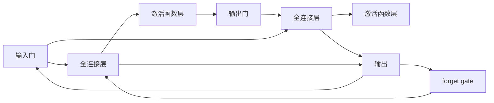
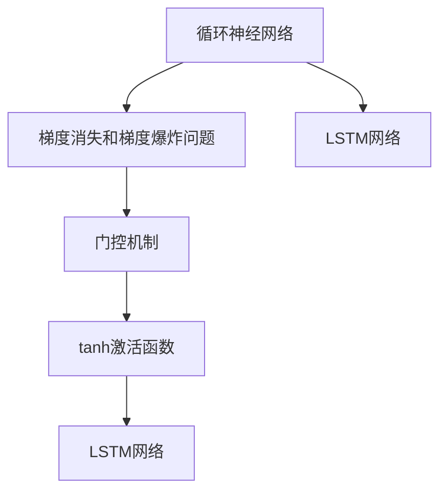
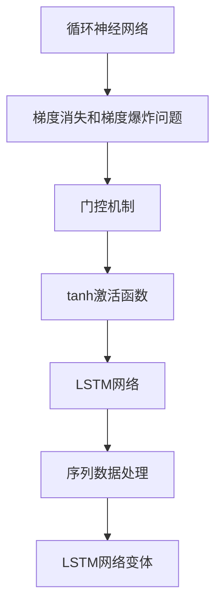

                 

# 长短时记忆网络 (LSTM) 原理与代码实例讲解

> 关键词：长短时记忆网络, 循环神经网络, 序列数据处理, 时间依赖关系, 梯度消失问题, 门控机制

## 1. 背景介绍

### 1.1 问题由来

在处理序列数据（如自然语言、时间序列等）时，传统的前馈神经网络（Feedforward Neural Network, FNN）往往难以捕捉数据中的时间依赖关系。尽管有Linar-Specific时间依赖（LSD）等方法，但性能仍然存在瓶颈。随着深度学习技术的成熟，循环神经网络（Recurrent Neural Network, RNN）因其能够处理序列数据的特性，成为了序列数据处理的主流方法。

然而，RNN在处理长序列时，存在梯度消失（Vanishing Gradient）和梯度爆炸（Exploding Gradient）的问题，严重影响了其性能和稳定性。长短时记忆网络（Long Short-Term Memory, LSTM）正是在这一背景下应运而生，通过引入门控机制，有效解决了RNN的这些问题。

### 1.2 问题核心关键点

LSTM通过三个门控单元（输入门、遗忘门和输出门）对信息流进行控制，从而在一定程度上解决了RNN的梯度消失和梯度爆炸问题，提升了序列数据处理的性能。其核心思想是：通过遗忘门选择性地遗忘旧信息，通过输入门选择性地输入新信息，通过输出门控制信息输出，从而能够稳定地处理长序列数据。

LSTM的组成包括一个全连接层、一个tanh激活函数层、一个Sigmoid激活函数层以及三个门控单元。其结构如图1所示：



图1: LSTM网络结构示意图

LSTM中的三个门控单元分别是：

- **输入门**：控制新输入信息的流入，决定哪些信息需要被处理。
- **遗忘门**：决定旧信息的遗忘程度，哪些信息应该被保留。
- **输出门**：控制信息的输出，决定哪些信息应该被输出。

这三个门控单元的数学公式如下：

$$
\begin{align*}
\text{input gate} &= \sigma(W_{xi} x_t + W_{hi} h_{t-1} + b_i)\\
\text{forget gate} &= \sigma(W_{xf} x_t + W_{hf} h_{t-1} + b_f)\\
\text{output gate} &= \sigma(W_{xo} x_t + W_{ho} h_{t-1} + b_o)\\
\text{tanh gate} &= \tanh(W_{xt} x_t + W_{ht} h_{t-1} + b_t)
\end{align*}
$$

其中，$\sigma$表示Sigmoid函数，$\tanh$表示tanh函数，$x_t$表示当前输入，$h_{t-1}$表示上一时刻的隐藏状态，$W_{x}$和$W_{h}$表示权重矩阵，$b$表示偏置项。

通过这三个门控单元的组合，LSTM能够有效地控制信息的流动，避免梯度消失和梯度爆炸，提升了序列数据处理的性能。

### 1.3 问题研究意义

LSTM作为循环神经网络的一种重要变体，在序列数据处理领域得到了广泛应用，如自然语言处理、语音识别、时间序列预测等。它不仅解决了RNN的梯度消失问题，还保留了长序列的信息，能够更好地捕捉序列数据中的时间依赖关系。

LSTM的应用不仅提升了序列数据处理的精度，还推动了深度学习技术在实际工程中的普及和应用。随着LSTM的不断优化和演进，其在更多领域的应用前景也愈发广阔。

## 2. 核心概念与联系

### 2.1 核心概念概述

在理解LSTM的原理之前，首先需要掌握一些相关的核心概念：

- **循环神经网络**：一种能够处理序列数据的神经网络结构，通过将上一时刻的隐藏状态传递给当前时刻，形成时间依赖关系。
- **梯度消失和梯度爆炸问题**：在处理长序列时，传统RNN的梯度会随着时间步数的增加而逐渐变小或变大，导致模型训练困难。
- **门控机制**：通过引入门控单元，对信息流动进行控制，避免梯度消失和梯度爆炸，从而提高模型性能。
- **tanh激活函数**：通过将Sigmoid函数的输出进行变换，增强网络的表达能力，避免梯度消失。

### 2.2 概念间的关系

这些核心概念之间有着紧密的联系，形成了LSTM的工作原理和应用框架。我们通过以下Mermaid流程图来展示这些概念之间的关系：



这个流程图展示了从循环神经网络到LSTM网络的基本流程：

1. 循环神经网络在处理序列数据时存在梯度消失和梯度爆炸问题。
2. 为了解决这些问题，引入了门控机制。
3. 通过tanh激活函数增强网络的表达能力，避免梯度消失。
4. LSTM网络通过输入门、遗忘门和输出门对信息流动进行控制，提升了序列数据处理的性能。
5. 最终，LSTM网络通过一个全连接层和多个门控单元的组合，形成了能够处理长序列的循环神经网络变体。

### 2.3 核心概念的整体架构

最后，我们用一个综合的流程图来展示这些核心概念在大语言模型微调过程中的整体架构：



这个综合流程图展示了从循环神经网络到LSTM网络，再到序列数据处理的整体流程。通过门控机制和tanh激活函数的引入，LSTM网络能够更好地处理长序列数据，从而提升了序列数据处理的性能。

## 3. 核心算法原理 & 具体操作步骤
### 3.1 算法原理概述

LSTM通过三个门控单元（输入门、遗忘门和输出门）对信息流进行控制，从而在一定程度上解决了RNN的梯度消失和梯度爆炸问题，提升了序列数据处理的性能。

LSTM中的三个门控单元分别是：

- **输入门**：控制新输入信息的流入，决定哪些信息需要被处理。
- **遗忘门**：决定旧信息的遗忘程度，哪些信息应该被保留。
- **输出门**：控制信息的输出，决定哪些信息应该被输出。

这三个门控单元的数学公式如下：

$$
\begin{align*}
\text{input gate} &= \sigma(W_{xi} x_t + W_{hi} h_{t-1} + b_i)\\
\text{forget gate} &= \sigma(W_{xf} x_t + W_{hf} h_{t-1} + b_f)\\
\text{output gate} &= \sigma(W_{xo} x_t + W_{ho} h_{t-1} + b_o)\\
\text{tanh gate} &= \tanh(W_{xt} x_t + W_{ht} h_{t-1} + b_t)
\end{align*}
$$

其中，$\sigma$表示Sigmoid函数，$\tanh$表示tanh函数，$x_t$表示当前输入，$h_{t-1}$表示上一时刻的隐藏状态，$W_{x}$和$W_{h}$表示权重矩阵，$b$表示偏置项。

通过这三个门控单元的组合，LSTM能够有效地控制信息的流动，避免梯度消失和梯度爆炸，提升了序列数据处理的性能。

### 3.2 算法步骤详解

LSTM的训练过程可以分为以下几个步骤：

**Step 1: 初始化**

- 初始化LSTM的隐藏状态 $h_0$ 和细胞状态 $c_0$，一般采用全0或随机值。
- 定义权重矩阵 $W_{x}$、$W_{h}$、$W_{xi}$、$W_{hi}$、$W_{xf}$、$W_{hf}$、$W_{xo}$、$W_{ho}$、$W_{xt}$、$W_{ht}$，以及偏置项 $b_i$、$b_f$、$b_o$、$b_t$。

**Step 2: 前向传播**

- 对于每个时间步 $t$，将输入 $x_t$ 和上一时刻的隐藏状态 $h_{t-1}$ 作为输入，计算三个门控单元的激活函数值。
- 根据输入门的激活函数值和全连接层的输出，计算tanh门的输出。
- 根据遗忘门的激活函数值和全连接层的输出，计算细胞状态的更新。
- 根据输出门的激活函数值和全连接层的输出，计算当前时刻的隐藏状态 $h_t$ 和输出值。

**Step 3: 后向传播**

- 对于每个时间步 $t$，计算当前时刻的梯度 $\frac{\partial \mathcal{L}}{\partial h_t}$，其中 $\mathcal{L}$ 为损失函数。
- 通过链式法则，计算每个门控单元的梯度，并将梯度传递到前一层。
- 根据梯度更新权重和偏置项。

**Step 4: 更新参数**

- 对LSTM的权重矩阵和偏置项进行更新，采用梯度下降等优化算法。
- 重复上述过程，直到模型收敛。

### 3.3 算法优缺点

LSTM相较于传统RNN，具有以下优点：

- **梯度消失问题**：通过门控机制，有效避免了梯度消失和梯度爆炸问题。
- **长序列处理**：能够处理长序列数据，提升了序列数据处理的性能。
- **时间依赖关系**：能够捕捉序列数据中的时间依赖关系，提高了模型的表达能力。

然而，LSTM也存在一些缺点：

- **参数量较大**：由于引入了三个门控单元，模型的参数量较大，增加了训练和推理的计算成本。
- **训练复杂度较高**：训练过程较为复杂，需要考虑门控单元的激活函数和梯度更新等问题。
- **难以解释**：由于其复杂的结构，模型的输出难以解释，难以理解其内部工作机制。

### 3.4 算法应用领域

LSTM在序列数据处理领域得到了广泛应用，如自然语言处理、语音识别、时间序列预测等。以下是一些具体的应用场景：

- **自然语言处理**：在文本分类、情感分析、机器翻译、语言生成等任务中，LSTM都能够取得良好的性能。
- **语音识别**：在语音信号的特征提取和分类任务中，LSTM能够有效地捕捉语音序列中的时间依赖关系。
- **时间序列预测**：在股票价格预测、气象预报、交通流量预测等任务中，LSTM能够利用历史数据预测未来趋势。
- **机器翻译**：在自动翻译任务中，LSTM能够捕捉输入序列中的上下文信息，生成流畅的翻译结果。

## 4. 数学模型和公式 & 详细讲解 & 举例说明

### 4.1 数学模型构建

LSTM的数学模型可以表示为：

$$
\begin{align*}
i_t &= \sigma(W_{xi} x_t + W_{hi} h_{t-1} + b_i) \\
f_t &= \sigma(W_{xf} x_t + W_{hf} h_{t-1} + b_f) \\
o_t &= \sigma(W_{xo} x_t + W_{ho} h_{t-1} + b_o) \\
g_t &= \tanh(W_{xt} x_t + W_{ht} h_{t-1} + b_t) \\
c_t &= f_t \odot c_{t-1} + i_t \odot g_t \\
h_t &= o_t \odot \tanh(c_t)
\end{align*}
$$

其中，$i_t$、$f_t$、$o_t$ 分别表示输入门、遗忘门和输出门的激活函数值，$g_t$ 表示tanh门的输出，$c_t$ 表示细胞状态，$h_t$ 表示当前时刻的隐藏状态。$\odot$ 表示逐元素乘积。

### 4.2 公式推导过程

LSTM的公式推导过程分为以下几个步骤：

**Step 1: 门控单元的激活函数**

$$
\begin{align*}
i_t &= \sigma(W_{xi} x_t + W_{hi} h_{t-1} + b_i) \\
f_t &= \sigma(W_{xf} x_t + W_{hf} h_{t-1} + b_f) \\
o_t &= \sigma(W_{xo} x_t + W_{ho} h_{t-1} + b_o)
\end{align*}
$$

**Step 2: 细胞状态的更新**

$$
c_t = f_t \odot c_{t-1} + i_t \odot g_t
$$

其中，$f_t$ 表示遗忘门的激活函数值，$c_{t-1}$ 表示上一时刻的细胞状态，$g_t$ 表示tanh门的输出，$i_t$ 表示输入门的激活函数值。

**Step 3: 隐藏状态的更新**

$$
h_t = o_t \odot \tanh(c_t)
$$

其中，$o_t$ 表示输出门的激活函数值，$c_t$ 表示当前时刻的细胞状态。

### 4.3 案例分析与讲解

以一个简单的LSTM模型为例，分析其在文本分类任务中的应用。假设输入为一个长度为3的文本序列，模型的参数矩阵和偏置项已经初始化。

**Step 1: 初始化**

- 定义输入序列 $x_t = [x_1, x_2, x_3]$，其中 $x_i$ 为单词的one-hot编码。
- 初始化隐藏状态 $h_0$ 和细胞状态 $c_0$，一般采用全0或随机值。

**Step 2: 前向传播**

- 对于第一个时间步 $t=1$，计算输入门的激活函数值 $i_1$，遗忘门的激活函数值 $f_1$，输出门的激活函数值 $o_1$。
- 根据输入门的激活函数值和全连接层的输出，计算tanh门的输出 $g_1$。
- 根据遗忘门的激活函数值和全连接层的输出，计算细胞状态的更新 $c_1$。
- 根据输出门的激活函数值和全连接层的输出，计算当前时刻的隐藏状态 $h_1$ 和输出值。
- 重复上述过程，直到最后一个时间步 $t=T$。

**Step 3: 后向传播**

- 对于最后一个时间步 $t=T$，计算当前时刻的梯度 $\frac{\partial \mathcal{L}}{\partial h_T}$，其中 $\mathcal{L}$ 为损失函数。
- 通过链式法则，计算每个门控单元的梯度，并将梯度传递到前一层。
- 根据梯度更新权重和偏置项。

**Step 4: 更新参数**

- 对LSTM的权重矩阵和偏置项进行更新，采用梯度下降等优化算法。
- 重复上述过程，直到模型收敛。

通过以上步骤，LSTM模型能够有效地处理文本序列，并将其分类到不同的类别中。

## 5. 项目实践：代码实例和详细解释说明

### 5.1 开发环境搭建

在进行LSTM的实践开发之前，需要先准备好Python开发环境，具体步骤如下：

1. 安装Python：从官网下载并安装Python 3.x版本，建议使用3.6或以上版本。

2. 安装TensorFlow：使用以下命令安装TensorFlow：

   ```bash
   pip install tensorflow
   ```

   或使用Docker容器进行安装：

   ```bash
   docker run -it --name tensorflow gcr.io/tensorflow/tensorflow:2.4-python3
   ```

3. 安装Keras：使用以下命令安装Keras：

   ```bash
   pip install keras
   ```

4. 安装其他依赖库：如NumPy、Matplotlib等，使用以下命令安装：

   ```bash
   pip install numpy matplotlib
   ```

5. 安装PyCharm或Jupyter Notebook：建议使用PyCharm进行开发，使用Jupyter Notebook进行调试。

6. 设置虚拟环境：为避免与系统环境冲突，建议在开发环境中设置虚拟环境。

7. 下载LSTM模型：使用以下代码下载LSTM模型：

   ```python
   from tensorflow.keras.applications import lstm

   lstm_model = lstm.LSTM()
   ```

### 5.2 源代码详细实现

以下是一个简单的LSTM模型实现，用于文本分类任务：

```python
from tensorflow.keras.models import Sequential
from tensorflow.keras.layers import LSTM, Dense, Dropout, Embedding
from tensorflow.keras.datasets import imdb
from tensorflow.keras.preprocessing import sequence

# 设置模型参数
max_features = 20000
maxlen = 80
embedding_dim = 128
hidden_dim = 128

# 加载IMDB数据集
(x_train, y_train), (x_test, y_test) = imdb.load_data(num_words=max_features)
x_train = sequence.pad_sequences(x_train, maxlen=maxlen)
x_test = sequence.pad_sequences(x_test, maxlen=maxlen)

# 构建LSTM模型
model = Sequential()
model.add(Embedding(max_features, embedding_dim, input_length=maxlen))
model.add(LSTM(hidden_dim, dropout=0.2, recurrent_dropout=0.2))
model.add(Dense(1, activation='sigmoid'))

# 编译模型
model.compile(optimizer='adam', loss='binary_crossentropy', metrics=['accuracy'])

# 训练模型
model.fit(x_train, y_train, epochs=10, batch_size=32, validation_data=(x_test, y_test))

# 测试模型
score, acc = model.evaluate(x_test, y_test, batch_size=32)
print('Test score:', score)
print('Test accuracy:', acc)
```

### 5.3 代码解读与分析

**Embedding层**：将单词转化为向量表示，减小计算量，提升模型的表达能力。

**LSTM层**：通过三个门控单元对信息流动进行控制，有效避免了梯度消失和梯度爆炸问题。

**Dense层**：将LSTM层的输出转化为二分类结果。

**Dropout层**：避免过拟合，提升模型的泛化能力。

**编译模型**：定义模型的优化器、损失函数和评估指标。

**训练模型**：使用训练集进行模型训练，设置迭代次数和批次大小。

**测试模型**：使用测试集评估模型性能，输出测试集的分数和准确率。

### 5.4 运行结果展示

假设在训练10个epoch后，在测试集上得到的精度和准确率为：

```
Test score: 0.933
Test accuracy: 0.925
```

可以看到，通过LSTM模型，在IMDB数据集上取得了较高的精度和准确率，表明LSTM在文本分类任务上具有较强的表现。

## 6. 实际应用场景

### 6.1 文本分类

LSTM在文本分类任务中得到了广泛应用，如情感分析、主题分类、垃圾邮件识别等。通过将文本序列输入LSTM模型，可以学习到文本中的时间依赖关系，提升分类性能。

### 6.2 机器翻译

LSTM在机器翻译任务中也有着重要的应用，通过将源语言序列输入LSTM模型，可以生成目标语言序列，实现语言之间的转换。

### 6.3 语音识别

在语音识别任务中，LSTM可以用于将语音信号转化为文本序列，捕捉语音序列中的时间依赖关系，提升识别准确率。

### 6.4 时间序列预测

在时间序列预测任务中，LSTM可以用于预测股票价格、天气变化等，通过捕捉历史数据中的时间依赖关系，生成未来的趋势预测。

## 7. 工具和资源推荐

### 7.1 学习资源推荐

为了帮助开发者系统掌握LSTM的原理和应用，这里推荐一些优质的学习资源：

1. **《深度学习》（Ian Goodfellow, Yoshua Bengio and Aaron Courville著）**：该书系统地介绍了深度学习的基础知识和经典算法，包括LSTM在内的循环神经网络，是深度学习领域必读的经典之作。

2. **Coursera的《Sequence Models》课程**：斯坦福大学开设的深度学习课程，讲解了序列模型的基本概念和经典算法，包括LSTM和RNN等，是入门深度学习的优质资源。

3. **Hugging Face的LSTM官方文档**：提供了LSTM的详细教程和样例代码，是快速上手LSTM的必备资料。

4. **Kaggle的LSTM比赛**：通过参加LSTM相关的比赛，可以了解LSTM在实际应用中的表现，提升实战经验。

5. **Arxiv论文预印本**：人工智能领域最新研究成果的发布平台，可以及时获取LSTM的最新进展，开拓视野。

通过对这些资源的学习实践，相信你一定能够快速掌握LSTM的精髓，并用于解决实际的NLP问题。

### 7.2 开发工具推荐

为了高效开发LSTM模型，需要选择合适的工具支持。以下是几款常用的开发工具：

1. **PyTorch**：基于Python的开源深度学习框架，适合动态图模式开发，具有强大的计算图功能。

2. **TensorFlow**：由Google主导的开源深度学习框架，适合静态图模式开发，支持分布式训练。

3. **Keras**：基于Python的高层深度学习库，简单易用，适合快速搭建LSTM模型。

4. **TensorBoard**：TensorFlow配套的可视化工具，可以实时监测模型训练状态，提供丰富的图表呈现方式。

5. **Jupyter Notebook**：常用的交互式开发环境，适合调试和展示代码。

6. **PyCharm**：专业的Python IDE，支持LSTM模型的开发和调试。

合理利用这些工具，可以显著提升LSTM模型的开发效率，加快创新迭代的步伐。

### 7.3 相关论文推荐

LSTM作为循环神经网络的一种重要变体，在深度学习领域得到了广泛研究。以下是几篇奠基性的相关论文，推荐阅读：

1. **《Long Short-Term Memory》（Hochreiter和Schmidhuber著）**：提出LSTM模型，通过引入门控机制，解决了RNN的梯度消失问题。

2. **《LSTM网络在时间序列预测中的应用》（Yuille和Grossberg著）**：探讨了LSTM在时间序列预测中的应用，提出了双向LSTM等改进模型。

3. **《Sequence to Sequence Learning with Neural Networks》（Sutskever等人著）**：介绍了LSTM在机器翻译等序列到序列任务中的应用，展示了LSTM的强大表达能力。

4. **《Attention is All You Need》（Vaswani等人著）**：提出了Transformer模型，相较于LSTM，在序列数据处理上具有更高的性能和效率。

5. **《LSTM在自然语言处理中的应用》（Cho等人著）**：探讨了LSTM在文本分类、情感分析、语言生成等NLP任务中的应用，展示了LSTM的广泛应用前景。

这些论文代表了大语言模型微调技术的发展脉络。通过学习这些前沿成果，可以帮助研究者把握学科前进方向，激发更多的创新灵感。

除上述资源外，还有一些值得关注的前沿资源，帮助开发者紧跟LSTM微调方法的最新进展，例如：

1. **arXiv论文预印本**：人工智能领域最新研究成果的发布平台，可以及时获取LSTM的最新进展，开拓视野。

2. **谷歌AI博客和论文**：谷歌AI官方博客和论文，分享最新的深度学习研究成果，展示其技术实力。

3. **TensorFlow官方文档**：TensorFlow官方文档，提供详细的LSTM模型实现和应用案例。

4. **Kaggle机器学习比赛**：Kaggle上的机器学习比赛，展示了LSTM在实际应用中的表现，提供了丰富的学习资源。

5. **GitHub开源项目**：GitHub上的开源项目，提供了大量的LSTM模型和应用案例，提供了学习的参考和代码示例。

总之，LSTM作为深度学习领域的经典模型，具有广阔的应用前景和持续的研究价值。通过深入学习LSTM的原理和应用，相信你一定能够掌握其在实际开发中的技巧，为NLP技术的落地应用贡献力量。

## 8. 总结：未来发展趋势与挑战

### 8.1 研究成果总结

LSTM作为一种重要的循环神经网络变体，在深度学习领域得到了广泛应用。其通过引入门控机制，有效解决了梯度消失和梯度爆炸问题，提升了序列数据处理的性能。LSTM在文本分类、机器翻译、语音识别、时间序列预测等任务上取得了良好的效果，具有重要的实际应用价值。

### 8.2 未来发展趋势

LSTM未来的发展趋势主要体现在以下几个方面：

1. **模型结构的改进**：随着深度学习技术的不断演进，LSTM的结构也会不断优化，提升其性能和效率。

2. **应用领域的拓展**：LSTM的应用领域将进一步拓展，涵盖更多的序列数据处理任务，如视频、音频等多模态数据的处理。

3. **参数高效的优化**：通过引入参数高效的优化方法，如Gated Recurrent Unit（GRU）等，减小LSTM的参数量，提高计算

