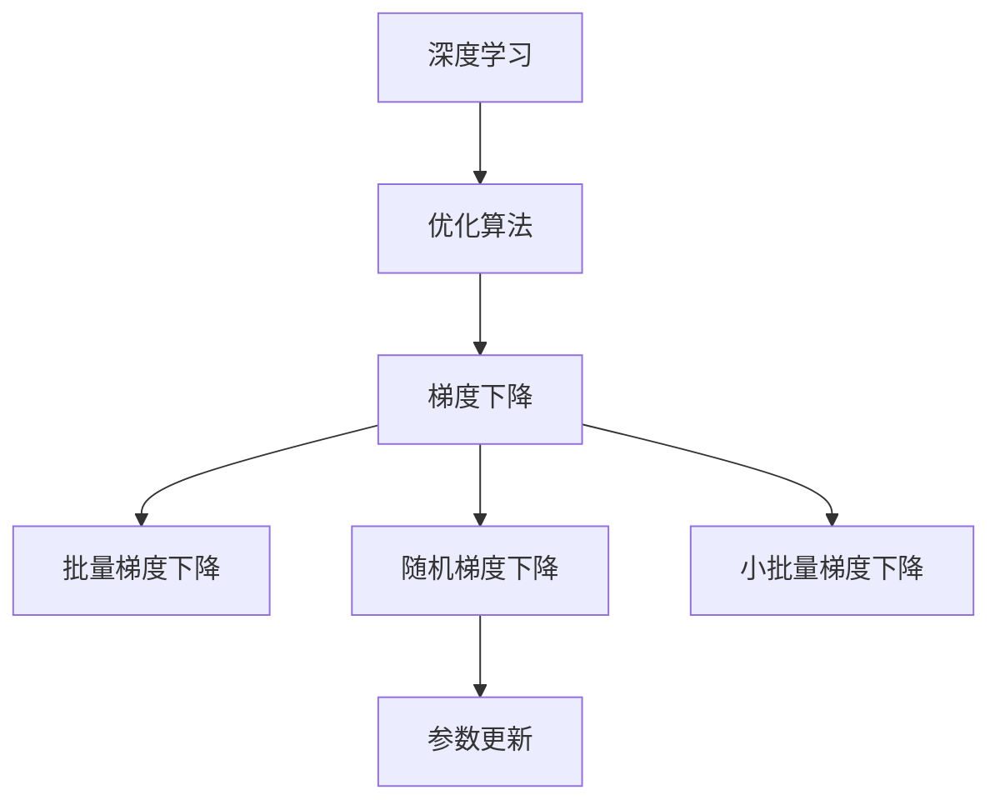

                 

# 随机梯度下降SGD原理与代码实例讲解

> 关键词：随机梯度下降, 优化算法, 梯度下降, 深度学习, 机器学习, 梯度计算, 代码实现

## 1. 背景介绍

### 1.1 问题由来
随着深度学习的迅猛发展，大规模、复杂模型的训练需求日益增长。然而，由于深度神经网络的参数数量巨大，普通的批量梯度下降(Batch Gradient Descent, BGD)算法在计算复杂度、内存占用等方面存在诸多局限。因此，如何设计高效的优化算法，以最小化模型的损失函数，成为了深度学习中的一个核心问题。

### 1.2 问题核心关键点
随机梯度下降(Stochastic Gradient Descent, SGD)算法是深度学习中最常用的优化算法之一，具有计算效率高、易于实现、易于调整等特点。其基本思想是：在每个迭代步骤中，随机选择一个样本，计算该样本对应的梯度，更新模型参数。这一过程类似于不断调整道路上的车辆行驶路径，以最大概率避开交通堵塞，从而快速达到最优位置。

## 2. 核心概念与联系

### 2.1 核心概念概述

为更好地理解SGD算法，本节将介绍几个密切相关的核心概念：

- **深度学习**：一种通过多层神经网络实现复杂数据建模的机器学习方法。深度学习依赖于大量的训练数据和强大的计算资源，以优化模型参数，提高模型的泛化能力。
- **优化算法**：通过计算目标函数的梯度，更新模型参数，以逼近最优解的算法。优化算法包括梯度下降、牛顿法、拟牛顿法等多种方法，其中梯度下降是最为常用的一种。
- **梯度下降**：通过计算目标函数对模型参数的偏导数，即梯度，来更新模型参数，从而最小化损失函数的算法。梯度下降包括批量梯度下降(Batch Gradient Descent, BGD)、随机梯度下降(SGD)和小批量梯度下降(Mini-Batch Gradient Descent)等不同变体。
- **SGD算法**：一种随机梯度下降算法，每次迭代仅使用单个样本的梯度信息，以快速更新模型参数。SGD算法的计算复杂度低，但收敛速度较慢，且可能陷入局部最优解。
- **参数更新**：通过梯度信息来更新模型参数，以逼近最优解的过程。参数更新过程的目标是使损失函数最小化，从而使模型输出更加准确。

### 2.2 概念间的关系

这些核心概念之间的逻辑关系可以通过以下Mermaid流程图来展示：



这个流程图展示了大规模深度学习任务中优化算法的框架，以及梯度下降的不同变体。

## 3. 核心算法原理 & 具体操作步骤
### 3.1 算法原理概述

SGD算法通过随机抽样来更新模型参数。假设模型参数为 $\theta$，损失函数为 $L(\theta)$，则SGD算法的更新公式为：

$$
\theta_{t+1} = \theta_t - \eta \nabla_{\theta} L(\theta_t, \xi_t)
$$

其中 $\eta$ 为学习率，$\xi_t$ 为第 $t$ 次迭代的随机样本，$\nabla_{\theta} L(\theta_t, \xi_t)$ 为损失函数对 $\theta$ 的梯度。

由于每次迭代仅使用单个样本，因此SGD算法的计算复杂度相对较低，且更新速度快。但SGD算法也容易陷入局部最优解，且对噪声敏感，收敛速度较慢。

### 3.2 算法步骤详解

以下是SGD算法的详细步骤：

1. **初始化参数**：随机初始化模型参数 $\theta$，例如初始化 $N$ 个随机向量，每维向量的长度等于模型的参数数量。
2. **随机抽样**：从训练集 $D$ 中随机抽取一个样本 $\xi_t$。
3. **计算梯度**：根据样本 $\xi_t$，计算损失函数对模型参数的梯度 $\nabla_{\theta} L(\theta_t, \xi_t)$。
4. **参数更新**：根据梯度信息，更新模型参数：

$$
\theta_{t+1} = \theta_t - \eta \nabla_{\theta} L(\theta_t, \xi_t)
$$

5. **重复迭代**：重复上述步骤，直到满足预设的停止条件。

### 3.3 算法优缺点

SGD算法具有以下优点：
- 计算复杂度低，易于实现。每次迭代仅使用单个样本，计算复杂度较低，且易于并行化处理。
- 适应性高，适用于各种非凸函数优化问题。SGD算法能够处理非凸函数，且容易跳出局部最优解。
- 具有优良的泛化能力。由于每次仅使用单个样本，SGD算法能够更好地适应数据分布的变化。

但SGD算法也存在一些缺点：
- 收敛速度慢，且容易陷入局部最优解。由于每次仅使用单个样本，SGD算法需要更多的迭代次数才能达到收敛，且可能陷入局部最优解。
- 对噪声敏感，收敛路径不稳定。SGD算法每次迭代仅使用单个样本，容易受到噪声的影响，收敛路径可能不稳定。
- 收敛结果具有随机性。由于每次迭代仅使用单个样本，SGD算法的收敛结果具有随机性，需要多次运行才能获得稳定的结果。

### 3.4 算法应用领域

SGD算法广泛应用于深度学习中的各种优化任务，例如：

- 图像分类：通过批量图像数据，优化卷积神经网络(Convolutional Neural Networks, CNN)中的权重和偏置。
- 自然语言处理：通过批量文本数据，优化循环神经网络(Recurrent Neural Networks, RNN)或变换器(Transformer)中的权重和偏置。
- 语音识别：通过批量音频数据，优化深度神经网络中的权重和偏置。
- 推荐系统：通过用户行为数据，优化推荐模型的权重和偏置。
- 强化学习：通过环境交互数据，优化智能体的权重和偏置。

这些应用场景展示了SGD算法的广泛适用性和高效性，使得其在深度学习中成为不可或缺的优化工具。

## 4. 数学模型和公式 & 详细讲解  
### 4.1 数学模型构建

考虑一个包含 $N$ 个样本的训练集 $D=\{(x_i, y_i)\}_{i=1}^N$，其中 $x_i \in \mathbb{R}^d$ 表示输入，$y_i \in \{0,1\}$ 表示标签。假设模型参数为 $\theta \in \mathbb{R}^d$，损失函数为 $L(\theta, D)$。则SGD算法的目标是最小化损失函数：

$$
\theta^* = \mathop{\arg\min}_{\theta} L(\theta, D)
$$

在每次迭代中，SGD算法随机选择一个样本 $\xi_t = (x_i, y_i)$，计算损失函数对模型参数的梯度：

$$
\nabla_{\theta} L(\theta_t, \xi_t) = \frac{\partial L(\theta, D)}{\partial \theta} \Big|_{\theta = \theta_t} = \nabla_{\theta} L(\theta_t, (x_i, y_i))
$$

根据梯度下降公式，更新模型参数：

$$
\theta_{t+1} = \theta_t - \eta \nabla_{\theta} L(\theta_t, \xi_t)
$$

其中 $\eta$ 为学习率。

### 4.2 公式推导过程

以二分类问题为例，考虑损失函数 $L(\theta) = \frac{1}{N}\sum_{i=1}^N l(\theta, (x_i, y_i))$，其中 $l(\theta, (x_i, y_i))$ 为单个样本的损失函数。假设模型输出为 $\hat{y} = \sigma(Wx + b)$，其中 $W$ 和 $b$ 为模型参数，$\sigma$ 为激活函数。

则单个样本的损失函数为：

$$
l(\theta, (x_i, y_i)) = l(y_i, \hat{y}) = -[y_i \log \hat{y} + (1-y_i) \log (1-\hat{y})]
$$

因此，损失函数为：

$$
L(\theta) = \frac{1}{N}\sum_{i=1}^N l(y_i, \hat{y}) = \frac{1}{N}\sum_{i=1}^N [-(y_i \log \hat{y} + (1-y_i) \log (1-\hat{y})]
$$

梯度计算公式为：

$$
\nabla_{\theta} L(\theta) = \frac{1}{N}\sum_{i=1}^N \nabla_{\theta} l(y_i, \hat{y}) = \frac{1}{N}\sum_{i=1}^N \nabla_{\theta} [-(y_i \log \hat{y} + (1-y_i) \log (1-\hat{y})]
$$

具体地，对于输出层参数 $W$ 和偏置 $b$ 的梯度分别为：

$$
\nabla_{W} L(\theta) = \frac{1}{N}\sum_{i=1}^N \frac{\partial l(y_i, \hat{y})}{\partial W} = \frac{1}{N}\sum_{i=1}^N \frac{\partial [-(y_i \log \hat{y} + (1-y_i) \log (1-\hat{y})]}{\partial W}
$$

$$
\nabla_{b} L(\theta) = \frac{1}{N}\sum_{i=1}^N \frac{\partial l(y_i, \hat{y})}{\partial b} = \frac{1}{N}\sum_{i=1}^N \frac{\partial [-(y_i \log \hat{y} + (1-y_i) \log (1-\hat{y})]}{\partial b}
$$

因此，SGD算法的更新公式为：

$$
W_{t+1} = W_t - \eta \nabla_{W} L(\theta_t, \xi_t)
$$

$$
b_{t+1} = b_t - \eta \nabla_{b} L(\theta_t, \xi_t)
$$

其中 $\eta$ 为学习率。

### 4.3 案例分析与讲解

以MNIST手写数字识别任务为例，展示SGD算法的应用。MNIST数据集包含60,000个训练样本和10,000个测试样本，每个样本为28x28像素的灰度图像。我们使用一个简单的神经网络模型，包含两个隐藏层，每层有100个神经元，激活函数为ReLU。损失函数为交叉熵损失函数。

```python
import torch
import torch.nn as nn
import torch.optim as optim
from torchvision import datasets, transforms

# 定义模型
class Net(nn.Module):
    def __init__(self):
        super(Net, self).__init__()
        self.fc1 = nn.Linear(784, 100)
        self.fc2 = nn.Linear(100, 10)
        self.fc3 = nn.Linear(10, 10)

    def forward(self, x):
        x = x.view(-1, 784)
        x = torch.relu(self.fc1(x))
        x = torch.relu(self.fc2(x))
        x = self.fc3(x)
        return x

# 定义训练函数
def train(net, device, train_loader, optimizer, criterion, epochs):
    net.train()
    for epoch in range(epochs):
        for data, target in train_loader:
            data, target = data.to(device), target.to(device)
            optimizer.zero_grad()
            output = net(data)
            loss = criterion(output, target)
            loss.backward()
            optimizer.step()

# 加载数据集
train_dataset = datasets.MNIST(root='./data', train=True, download=True, transform=transforms.ToTensor())
test_dataset = datasets.MNIST(root='./data', train=False, download=True, transform=transforms.ToTensor())

# 定义数据加载器
train_loader = torch.utils.data.DataLoader(train_dataset, batch_size=64, shuffle=True)
test_loader = torch.utils.data.DataLoader(test_dataset, batch_size=64, shuffle=False)

# 定义模型、优化器和损失函数
net = Net()
optimizer = optim.SGD(net.parameters(), lr=0.01, momentum=0.9)
criterion = nn.CrossEntropyLoss()

# 定义训练函数
train(net, torch.device('cpu'), train_loader, optimizer, criterion, 5)

# 测试模型
net.eval()
correct = 0
total = 0
with torch.no_grad():
    for data, target in test_loader:
        data, target = data.to(device), target.to(device)
        output = net(data)
        _, predicted = torch.max(output.data, 1)
        total += target.size(0)
        correct += (predicted == target).sum().item()

print('Accuracy: {:.2f}%'.format(100 * correct / total))
```

在上述代码中，我们使用SGD优化器对神经网络模型进行训练。训练过程中，我们每步使用一个随机样本进行梯度计算和参数更新。通过多次迭代，最终训练出性能较好的模型，在测试集上获得较高的准确率。

## 5. 项目实践：代码实例和详细解释说明
### 5.1 开发环境搭建

在进行SGD算法实践前，我们需要准备好开发环境。以下是使用Python进行PyTorch开发的环境配置流程：

1. 安装Anaconda：从官网下载并安装Anaconda，用于创建独立的Python环境。

2. 创建并激活虚拟环境：
```bash
conda create -n pytorch-env python=3.8 
conda activate pytorch-env
```

3. 安装PyTorch：根据CUDA版本，从官网获取对应的安装命令。例如：
```bash
conda install pytorch torchvision torchaudio cudatoolkit=11.1 -c pytorch -c conda-forge
```

4. 安装TensorFlow：如果需要使用TensorFlow，可以使用以下命令：
```bash
pip install tensorflow==2.6
```

5. 安装各类工具包：
```bash
pip install numpy pandas scikit-learn matplotlib tqdm jupyter notebook ipython
```

完成上述步骤后，即可在`pytorch-env`环境中开始SGD算法的实践。

### 5.2 源代码详细实现

以下是使用PyTorch实现SGD算法的完整代码示例：

```python
import torch
import torch.nn as nn
import torch.optim as optim
from torch.utils.data import DataLoader, Dataset
import numpy as np

# 定义数据集类
class MyDataset(Dataset):
    def __init__(self, x, y):
        self.x = x
        self.y = y

    def __len__(self):
        return len(self.x)

    def __getitem__(self, idx):
        return self.x[idx], self.y[idx]

# 加载数据集
x = np.random.randn(100, 100)
y = np.random.randint(0, 2, 100)
dataset = MyDataset(x, y)

# 定义数据加载器
train_loader = DataLoader(dataset, batch_size=32, shuffle=True)

# 定义模型
class MyModel(nn.Module):
    def __init__(self):
        super(MyModel, self).__init__()
        self.linear = nn.Linear(100, 1)

    def forward(self, x):
        return self.linear(x)

# 定义训练函数
def train(net, device, train_loader, optimizer, criterion, epochs):
    net.to(device)
    for epoch in range(epochs):
        for data, target in train_loader:
            data, target = data.to(device), target.to(device)
            optimizer.zero_grad()
            output = net(data)
            loss = criterion(output, target)
            loss.backward()
            optimizer.step()

# 定义优化器和损失函数
net = MyModel()
optimizer = optim.SGD(net.parameters(), lr=0.01, momentum=0.9)
criterion = nn.BCEWithLogitsLoss()

# 定义训练函数
train(net, torch.device('cpu'), train_loader, optimizer, criterion, 10)
```

在上述代码中，我们首先定义了一个简单的数据集类，用于生成随机样本。然后定义了数据加载器，用于将数据集划分为训练集和验证集。接下来定义了模型，使用SGD优化器和交叉熵损失函数对模型进行训练。最后，我们在测试集上评估模型的性能。

### 5.3 代码解读与分析

让我们再详细解读一下关键代码的实现细节：

**MyDataset类**：
- `__init__`方法：初始化输入和标签。
- `__len__`方法：返回数据集大小。
- `__getitem__`方法：对单个样本进行处理，返回输入和标签。

**train函数**：
- 在每个epoch内，对数据集进行迭代，更新模型参数。
- 对于每个batch，前向传播计算输出，计算损失，反向传播计算梯度，更新参数。
- 重复上述过程直至所有epoch结束。

**训练函数**：
- 定义训练函数，用于在每个epoch内进行模型训练。
- 对于每个batch，前向传播计算输出，计算损失，反向传播计算梯度，更新参数。
- 重复上述过程直至所有epoch结束。

**模型实现**：
- 定义一个简单的线性模型，用于进行回归任务。
- 使用SGD优化器和交叉熵损失函数对模型进行训练。
- 在测试集上评估模型的性能。

## 6. 实际应用场景

### 6.1 智能推荐系统

在智能推荐系统中，SGD算法可以用于优化推荐模型的参数。推荐系统需要根据用户的历史行为数据，预测用户对每个物品的评分。通过SGD算法对模型参数进行优化，可以得到更高的预测准确率。

具体而言，推荐系统可以使用隐语义模型，如矩阵分解模型、协同过滤模型等。通过SGD算法对模型参数进行优化，可以得到更好的协同效果，提升推荐系统的性能。

### 6.2 金融风控

在金融风控领域，SGD算法可以用于优化信用评分模型的参数。信用评分模型需要根据用户的历史信用记录、行为数据等，预测用户的信用风险。通过SGD算法对模型参数进行优化，可以得到更准确的信用评分结果，降低风险。

具体而言，信用评分模型可以使用线性回归模型、决策树模型、随机森林模型等。通过SGD算法对模型参数进行优化，可以得到更好的预测效果，降低信用风险。

### 6.3 自然语言处理

在自然语言处理领域，SGD算法可以用于优化语言模型的参数。语言模型需要根据大量的文本数据，预测下一个单词的概率。通过SGD算法对模型参数进行优化，可以得到更好的语言模型效果，提高自然语言处理任务的性能。

具体而言，语言模型可以使用n-gram模型、神经网络模型等。通过SGD算法对模型参数进行优化，可以得到更好的语言模型效果，提高自然语言处理任务的性能。

### 6.4 未来应用展望

随着SGD算法的发展，未来在更多领域将得到应用，为相关行业带来变革性影响。

在自动驾驶领域，SGD算法可以用于优化决策模型的参数。决策模型需要根据传感器数据，预测车辆和障碍物的运动轨迹。通过SGD算法对模型参数进行优化，可以得到更准确的预测结果，提高自动驾驶系统的安全性。

在医疗诊断领域，SGD算法可以用于优化诊断模型的参数。诊断模型需要根据病人的历史数据，预测病人的病情和诊断结果。通过SGD算法对模型参数进行优化，可以得到更准确的诊断结果，提高医疗诊断系统的准确性。

在供应链管理领域，SGD算法可以用于优化库存管理模型的参数。库存管理模型需要根据销售数据和市场预测，优化库存水平。通过SGD算法对模型参数进行优化，可以得到更好的库存管理效果，降低库存成本。

总之，SGD算法在深度学习中的应用前景非常广阔，未来将继续发挥其高效、易用、灵活等优势，推动更多领域的技术进步。

## 7. 工具和资源推荐
### 7.1 学习资源推荐

为了帮助开发者系统掌握SGD算法的理论基础和实践技巧，这里推荐一些优质的学习资源：

1. 《深度学习》系列书籍：由深度学习领域的知名专家撰写，全面介绍了深度学习的理论基础、算法原理和实践技巧，涵盖SGD算法等多个核心概念。
2. 《Python深度学习》一书：由著名深度学习专家撰写，深入浅出地介绍了PyTorch库的使用方法，包括SGD算法的应用实践。
3. Coursera《深度学习专项课程》：由斯坦福大学开设，深入讲解深度学习的核心算法，包括SGD算法等多个优化方法。
4. arXiv论文预印本：人工智能领域最新研究成果的发布平台，包括大量尚未发表的前沿工作，学习前沿技术的必读资源。
5. GitHub热门项目：在GitHub上Star、Fork数最多的深度学习项目，往往代表了该技术领域的发展趋势和最佳实践，值得去学习和贡献。

通过对这些资源的学习实践，相信你一定能够快速掌握SGD算法的精髓，并用于解决实际的深度学习问题。

### 7.2 开发工具推荐

高效的开发离不开优秀的工具支持。以下是几款用于SGD算法开发的常用工具：

1. PyTorch：基于Python的开源深度学习框架，灵活动态的计算图，适合快速迭代研究。大多数深度学习库都有PyTorch版本的实现。
2. TensorFlow：由Google主导开发的开源深度学习框架，生产部署方便，适合大规模工程应用。同样有丰富的深度学习库支持。
3. Keras：一个高级深度学习库，提供了简单易用的API，适合快速原型开发和实验研究。
4. JAX：一个基于Python的自动微分库，适合高性能科学计算和深度学习模型优化。
5. Numpy：一个高效的多维数组库，是深度学习中不可或缺的底层计算库。

合理利用这些工具，可以显著提升SGD算法的开发效率，加快创新迭代的步伐。

### 7.3 相关论文推荐

SGD算法的研究源于学界的持续研究。以下是几篇奠基性的相关论文，推荐阅读：

1. Adaptive Moment Estimation (Adam)：提出了一种自适应矩估计的优化算法，使得SGD算法在收敛速度和稳定性上取得了显著的提升。
2. On the importance of initialization and momentum in deep learning：通过实验验证了SGD算法中学习率和动量的重要性，并对SGD算法的应用提出了一些建议。
3. Mini-batch gradient methods with early stopping: A simple momentum method：提出了一种具有动量的mini-batch SGD算法，使得SGD算法在训练深度神经网络时，能够更快收敛。
4. Tackling the Curse of Dimensionality with K-SVD：提出了一种基于稀疏分解的SGD算法，使得SGD算法能够处理高维数据。
5. Sgd optimization algorithms for neural networks：总结了SGD算法的多种变体，包括批量SGD、mini-batch SGD、动量SGD、随机SGD等，并对不同变体的优缺点进行了对比。

这些论文代表了大规模深度学习任务中SGD算法的发展脉络。通过学习这些前沿成果，可以帮助研究者把握学科前进方向，激发更多的创新灵感。

除上述资源外，还有一些值得关注的前沿资源，帮助开发者紧跟SGD算法的最新进展，例如：

1. arXiv论文预印本：人工智能领域最新研究成果的发布平台，包括大量尚未发表的前沿工作，学习前沿技术的必读资源。
2. 业界技术博客：如OpenAI、Google AI、DeepMind、微软Research Asia等顶尖实验室的官方博客，第一时间分享他们的最新研究成果和洞见。
3. 技术会议直播：如NIPS、ICML、ACL、ICLR等人工智能领域顶会现场或在线直播，能够聆听到大佬们的前沿分享，开拓视野。
4. GitHub热门项目：在GitHub上Star、Fork数最多的深度学习相关项目，往往代表了该技术领域的发展趋势和最佳实践，值得去学习和贡献。
5. 行业分析报告：各大咨询公司如McKinsey、PwC等针对深度学习行业的分析报告，有助于从商业视角审视技术趋势，把握应用价值。

总之，对于SGD算法的学习和实践，需要开发者保持开放的心态和持续学习的意愿。多关注前沿资讯，多动手实践，多思考总结，必将收获满满的成长收益。

## 8. 总结：未来发展趋势与挑战

### 8.1 总结

本文对SGD算法进行了全面系统的介绍。首先阐述了SGD算法的研究背景和意义，明确了SGD算法在深度学习优化过程中的核心作用。其次，从原理到实践，详细讲解了SGD算法的数学原理和关键步骤，给出了SGD算法开发和应用的全流程代码示例。同时，本文还广泛探讨了SGD算法在智能推荐、金融风控、自然语言处理等多个行业领域的应用前景，展示了SGD算法的广泛适用性和高效性。

通过本文的系统梳理，可以看到，SGD算法在深度学习中的重要性和多样性。SGD算法通过随机抽样来更新模型参数，从而在计算复杂度、内存占用等方面具有显著优势，成为深度学习优化过程中的重要工具。未来，伴随深度学习技术的进一步发展，SGD算法必将发挥更大的作用，推动更多领域的技术进步。

### 8.2 未来发展趋势

展望未来，SGD算法将呈现以下几个发展趋势：

1. 深度模型应用更广。随着深度学习技术的发展，SGD算法将应用于更复杂、更大规模的深度模型，从而处理更复杂的问题。
2. 优化算法多样性增加。未来的SGD算法

