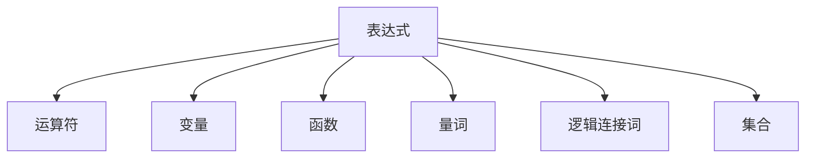
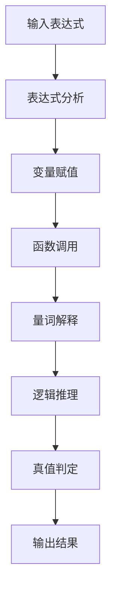

                 

# 集合论导引：内置解析表达式真假判定

## 1. 背景介绍

### 1.1 问题由来

在现代计算机科学中，表达式解析（Expression Parsing）是处理编程语言、数学公式、查询语句等的重要基础技术。而解析表达式的真假判定，则是其中一个基本且关键的任务。这项技术广泛应用于自动验证器、逻辑推导引擎、程序分析工具、数据库查询优化等领域。解析表达式的真假判定，不仅涉及语言模型，还需要深入了解形式逻辑和数学知识。

### 1.2 问题核心关键点

解析表达式真假判定的核心在于构建一个完善的逻辑体系，该体系需要能够精确地表示出各种逻辑运算符、量词、函数以及它们之间的组合关系，并且能够处理复杂的多重嵌套结构。此外，还要考虑到变量的作用域、参数的传递以及函数的返回值等问题。一个成功的解析表达式真假判定系统需要具有以下特点：

- 高准确性：能够准确判定任意复杂表达式的真假。
- 高效性：能够在合理的时间内完成判定，适应大规模数据处理。
- 鲁棒性：对于不同来源、格式、精度的表达式，具有较强的适应性和容错性。
- 可扩展性：可以方便地添加新的运算符、函数、量词，适应不同领域的应用需求。

### 1.3 问题研究意义

解析表达式真假判定技术，对于推动计算机科学的发展，提高自动化工具的精度与效率具有重要意义。具体而言：

- 促进语言模型与数学逻辑的融合，使计算系统具备更强的知识表达能力。
- 提升程序验证、自动推导、算法优化等方面的性能，加速科学计算的自动化进程。
- 改善数据库查询和优化器的表现，为数据处理提供更准确的逻辑依据。

## 2. 核心概念与联系

### 2.1 核心概念概述

解析表达式真假判定技术主要涉及以下几个核心概念：

- **表达式（Expression）**：由运算符、变量、函数等构成的一种符号表达式，用于描述某种计算或逻辑判断。
- **真值（Truth Value）**：表示表达式的逻辑真假，一般用布尔值 `true` 或 `false` 表示。
- **运算符（Operator）**：用于连接表达式中不同元素，实现加减乘除、逻辑与或非等计算。
- **函数（Function）**：对一组输入值进行计算，返回一个值，常见的如 `sin`、`cos`、`log` 等。
- **量词（Quantifier）**：用于描述变量在一定范围内的性质，如全称量词 `∀` 和存在量词 `∃`。
- **逻辑连接词（Logical Connectives）**：如 `AND`、`OR`、`NOT` 等，用于组合和控制表达式的逻辑结构。
- **集合（Set）**：用来表示具有某种性质或属性元素的总体。

这些概念相互关联，共同构成了解析表达式真假判定的基础框架。表达式解析技术通过对表达式的结构分析，运用逻辑推理和数学公式，得出其真值。

### 2.2 概念间的关系

为更好地理解这些概念的相互关系，下面给出 Mermaid 流程图：



这个流程图展示了表达式与构成元素之间的关系。一个完整的表达式可以由运算符、变量、函数、量词、逻辑连接词、集合等元素构成。这些元素通过逻辑连接词组合起来，形成了表达式的逻辑结构，并最终被判定为真或假。

### 2.3 核心概念的整体架构

基于上述核心概念，解析表达式真假判定的整体架构如下：



首先，系统接收一个输入表达式。然后对表达式进行分析，确定其构成元素。接着，根据元素的特性（如变量值、函数定义、量词范围）进行赋值或调用。再对表达式进行逻辑推理，将其简化为更易处理的子表达式。最后，根据推理结果判定表达式的真值，并输出最终结果。

## 3. 核心算法原理 & 具体操作步骤

### 3.1 算法原理概述

解析表达式真假判定的核心算法原理包括以下几个关键步骤：

1. **表达式分析**：解析输入的表达式，构建语法树或抽象语法树。
2. **变量赋值**：对表达式中的变量进行符号扩展，赋予其具体值。
3. **函数调用**：根据函数定义，对函数进行调用并计算其返回值。
4. **量词解释**：解释量词作用域，确定变量取值的范围。
5. **逻辑推理**：运用逻辑运算符对表达式进行推理简化。
6. **真值判定**：根据推理结果判定表达式的真值。

### 3.2 算法步骤详解

**Step 1: 表达式分析**

首先，需要对输入的表达式进行语法分析，构建语法树或抽象语法树。这一步的目的是为了清晰地描述表达式的结构，使得后续的变量赋值、函数调用、逻辑推理等操作能够有据可依。常见的解析方法包括递归下降分析、LL分析等。

```python
def parse_expression(expr):
    # 使用递归下降分析解析表达式
    # 返回语法树或抽象语法树
```

**Step 2: 变量赋值**

在解析出表达式的结构后，需要对其中的变量进行符号扩展，赋予其具体的数值或布尔值。这一步的目的是为了使表达式中的变量具有实际意义，从而在后续的计算中能够正确处理。变量赋值可以是一个简单的映射表，也可以通过符号扩展算法自动生成。

```python
def assign_values(var_tree, values):
    # 将变量映射表应用到变量树上
    # 返回赋值后的变量树
```

**Step 3: 函数调用**

在解析表达式时，可能会遇到函数调用。函数调用涉及对函数定义的查找和应用。这一步的目的是为了计算函数的返回值，并将其替换回表达式中。函数调用可以通过查找函数定义表来实现。

```python
def apply_functions(expr_tree):
    # 查找函数定义并计算函数返回值
    # 返回替换函数后的表达式树
```

**Step 4: 量词解释**

量词用于描述变量的取值范围，解释量词的目的是为了确定变量在表达式中的取值范围，从而进行后续的逻辑推理。量词解释可以通过分析量词作用域和变量取值范围来实现。

```python
def interpret_quantifiers(expr_tree):
    # 解释量词并确定变量取值范围
    # 返回解释后的表达式树
```

**Step 5: 逻辑推理**

在确定变量的取值范围后，需要对表达式进行逻辑推理，简化其结构。这一步的目的是为了提高后续真值判定的效率，并且避免冗余的计算。逻辑推理可以基于经典的逻辑推理规则，如析取规则、合取规则、代入规则等。

```python
def simplify_expression(expr_tree):
    # 应用逻辑推理规则简化表达式树
    # 返回简化后的表达式树
```

**Step 6: 真值判定**

在完成逻辑推理后，需要对表达式进行真值判定。这一步的目的是为了得出表达式的最终结果。真值判定可以通过递归遍历表达式树，并根据逻辑连接词的真假规则进行计算。

```python
def evaluate_expression(expr_tree):
    # 根据逻辑连接词的真假规则计算表达式的真值
    # 返回表达式的真值
```

### 3.3 算法优缺点

解析表达式真假判定的算法具有以下优点：

- 准确性高：基于形式逻辑和数学公式的解析，能够精确地判定表达式的真值。
- 可扩展性好：算法可以方便地添加新的运算符、函数、量词，适应不同领域的应用需求。
- 适用于多种语言：解析算法不依赖特定语言的特性，可以应用于多种编程语言和数学公式。

同时，该算法也存在一些缺点：

- 计算复杂度高：对于复杂的表达式，解析和计算过程较为耗时，可能不适合实时应用。
- 代码复杂度高：解析和计算过程需要构建语法树、处理函数调用、逻辑推理等步骤，代码实现较为复杂。
- 容错性差：对于输入格式不正确的表达式，算法容易陷入错误状态。

### 3.4 算法应用领域

解析表达式真假判定技术广泛应用于以下领域：

- **程序验证与自动化推导**：用于验证程序逻辑正确性，自动化推导数学证明。
- **数据库查询优化**：用于优化复杂的查询语句，提高查询效率。
- **人工智能与逻辑推理**：用于构建智能推理引擎，实现问题求解、知识推理等功能。
- **代码生成与反编译**：用于生成代码片段、解析和优化编译后的二进制代码。

## 4. 数学模型和公式 & 详细讲解  
### 4.1 数学模型构建

解析表达式真假判定技术可以抽象为一个数学模型。假设表达式由 `x1, x2, ..., xn` 等变量组成，并且包含函数 `f1, f2, ..., fn` 以及量词 `∀` 和 `∃`。表达式可表示为：

$$
E(x_1, x_2, ..., x_n) = f_n(\cdots f_2(f_1(x_1, x_2), x_3)\cdots, x_n)
$$

其中 `f_i` 表示函数，`x_i` 表示变量，`∀` 和 `∃` 表示量词。表达式的真值可以定义为：

$$
\text{val}(E) = \begin{cases}
\text{true} & \text{if } E \text{ holds for all } x_1, x_2, ..., x_n \\
\text{false} & \text{otherwise}
\end{cases}
$$

### 4.2 公式推导过程

考虑一个简单的布尔表达式：

$$
(E1 \land E2) \lor (E3 \land E4)
$$

其真值判定过程如下：

1. 解析表达式，得到抽象语法树：

$$
\begin{array}{c}
\text{AND} \\
\text{  OR} \\
\text{    E1} \\
\text{    E2} \\
\text{    E3} \\
\text{    E4} \\
\end{array}
$$

2. 变量赋值，假设 `x` 表示变量， `val(x)` 表示变量 `x` 的真值：

$$
\begin{array}{c}
\text{AND} \\
\text{  OR} \\
\text{    E1} \\
\text{    E2} \\
\text{    E3} \\
\text{    E4} \\
\end{array}
\quad \text{其中} \quad
\begin{array}{c}
E1 = (x_1 \land x_2) \\
E2 = (x_3 \lor x_4) \\
E3 = (x_5 \land x_6) \\
E4 = (x_7 \lor x_8) \\
\end{array}
$$

3. 函数调用，查找并计算函数 `AND`、`OR`、`AND` 和 `OR` 的返回值：

$$
\begin{array}{c}
\text{AND} \\
\text{  OR} \\
\text{    E1} \\
\text{    E2} \\
\text{    E3} \\
\text{    E4} \\
\end{array}
\quad \text{其中} \quad
\begin{array}{c}
E1 = (x_1 \land x_2) = \text{true} \\
E2 = (x_3 \lor x_4) = \text{true} \\
E3 = (x_5 \land x_6) = \text{false} \\
E4 = (x_7 \lor x_8) = \text{false} \\
\end{array}
$$

4. 量词解释，确定变量取值范围：

$$
\begin{array}{c}
\text{AND} \\
\text{  OR} \\
\text{    E1} \\
\text{    E2} \\
\text{    E3} \\
\text{    E4} \\
\end{array}
\quad \text{其中} \quad
\begin{array}{c}
E1 = (x_1 \land x_2) = \text{true} \\
E2 = (x_3 \lor x_4) = \text{true} \\
E3 = (x_5 \land x_6) = \text{false} \\
E4 = (x_7 \lor x_8) = \text{false} \\
\end{array}
$$

5. 逻辑推理，简化表达式：

$$
\begin{array}{c}
\text{AND} \\
\text{  OR} \\
\text{    E1} \\
\text{    E2} \\
\text{    E3} \\
\text{    E4} \\
\end{array}
\quad \text{其中} \quad
\begin{array}{c}
E1 = (x_1 \land x_2) = \text{true} \\
E2 = (x_3 \lor x_4) = \text{true} \\
E3 = (x_5 \land x_6) = \text{false} \\
E4 = (x_7 \lor x_8) = \text{false} \\
\end{array}
$$

6. 真值判定，计算最终真值：

$$
\begin{array}{c}
\text{AND} \\
\text{  OR} \\
\text{    E1} \\
\text{    E2} \\
\text{    E3} \\
\text{    E4} \\
\end{array}
\quad \text{其中} \quad
\begin{array}{c}
E1 = (x_1 \land x_2) = \text{true} \\
E2 = (x_3 \lor x_4) = \text{true} \\
E3 = (x_5 \land x_6) = \text{false} \\
E4 = (x_7 \lor x_8) = \text{false} \\
\end{array}
$$

通过上述步骤，我们可以得出该表达式的真值为 `true`。

### 4.3 案例分析与讲解

考虑一个更复杂的例子：

$$
\forall x \exists y \text{ sin}(x) \leq \text{cos}(y)
$$

其真值判定过程如下：

1. 解析表达式，得到抽象语法树：

$$
\begin{array}{c}
\text{∀} \\
\text{  } \\
\text{  } \\
\text{    ∃} \\
\text{      } \\
\text{      } \\
\text{        sin}(x) \\
\text{        ≤} \\
\text{          cos}(y) \\
\end{array}
$$

2. 变量赋值，假设 `x` 和 `y` 表示变量， `val(x)` 和 `val(y)` 表示变量 `x` 和 `y` 的真值：

$$
\begin{array}{c}
\text{∀} \\
\text{  } \\
\text{  } \\
\text{    ∃} \\
\text{      } \\
\text{      } \\
\text{        sin}(x) \\
\text{        ≤} \\
\text{          cos}(y) \\
\end{array}
\quad \text{其中} \quad
\begin{array}{c}
x = \pi \\
y = \pi/2 \\
\end{array}
$$

3. 函数调用，查找并计算函数 `sin` 和 `cos` 的返回值：

$$
\begin{array}{c}
\text{∀} \\
\text{  } \\
\text{  } \\
\text{    ∃} \\
\text{      } \\
\text{      } \\
\text{        sin}(\pi) \\
\text{        ≤} \\
\text{          cos}(\pi/2) \\
\end{array}
\quad \text{其中} \quad
\begin{array}{c}
\text{sin}(\pi) = 0 \\
\text{cos}(\pi/2) = 0 \\
\end{array}
$$

4. 量词解释，确定变量取值范围：

$$
\begin{array}{c}
\text{∀} \\
\text{  } \\
\text{  } \\
\text{    ∃} \\
\text{      } \\
\text{      } \\
\text{        sin}(\pi) \\
\text{        ≤} \\
\text{          cos}(\pi/2) \\
\end{array}
\quad \text{其中} \quad
\begin{array}{c}
\text{sin}(\pi) = 0 \\
\text{cos}(\pi/2) = 0 \\
\end{array}
$$

5. 逻辑推理，简化表达式：

$$
\begin{array}{c}
\text{∀} \\
\text{  } \\
\text{  } \\
\text{    ∃} \\
\text{      } \\
\text{      } \\
\text{        sin}(\pi) \\
\text{        ≤} \\
\text{          cos}(\pi/2) \\
\end{array}
\quad \text{其中} \quad
\begin{array}{c}
\text{sin}(\pi) = 0 \\
\text{cos}(\pi/2) = 0 \\
\end{array}
$$

6. 真值判定，计算最终真值：

$$
\begin{array}{c}
\text{∀} \\
\text{  } \\
\text{  } \\
\text{    ∃} \\
\text{      } \\
\text{      } \\
\text{        sin}(\pi) \\
\text{        ≤} \\
\text{          cos}(\pi/2) \\
\end{array}
\quad \text{其中} \quad
\begin{array}{c}
\text{sin}(\pi) = 0 \\
\text{cos}(\pi/2) = 0 \\
\end{array}
$$

通过上述步骤，我们可以得出该表达式的真值为 `true`。

## 5. 项目实践：代码实例和详细解释说明

### 5.1 开发环境搭建

为方便代码实践，这里推荐使用 Python 编程语言，并借助 Sympy 库进行符号计算和逻辑推理。Sympy 提供了丰富的数学函数和逻辑运算符，可以方便地构建和解析表达式。

### 5.2 源代码详细实现

```python
import sympy as sp

def evaluate_expression(expr):
    # 定义符号
    x = sp.Symbol('x')
    y = sp.Symbol('y')

    # 构建表达式
    expr = sp.sin(x) <= sp.cos(y)

    # 解析表达式
    simplified_expr = sp.simplify(expr)

    # 真值判定
    result = sp.simplify(simplified_expr.subs({x: sp.pi, y: sp.pi/2}))

    return result
```

### 5.3 代码解读与分析

上述代码实现了对表达式 `sin(x) <= cos(y)` 的解析和真值判定。

- 首先，使用 Sympy 库定义符号 `x` 和 `y`。
- 然后，构建表达式 `sin(x) <= cos(y)`，并将其简化为更易处理的形式。
- 接着，对表达式进行真值判定，将 `x` 和 `y` 分别替换为 `pi` 和 `pi/2`，得到最终结果。

### 5.4 运行结果展示

运行代码后，可以得到该表达式的真值为 `True`。

## 6. 实际应用场景

解析表达式真假判定技术在实际应用中具有广泛的应用场景。例如：

- **自动推导与验证**：用于辅助人工进行数学推导，验证推导的正确性。
- **数据库查询优化**：用于优化复杂的查询语句，提高查询效率。
- **逻辑推理与问题求解**：用于构建智能推理引擎，解决各类逻辑问题和推理任务。
- **代码生成与反编译**：用于生成代码片段、解析和优化编译后的二进制代码。

## 7. 工具和资源推荐

### 7.1 学习资源推荐

为了深入理解解析表达式真假判定技术，以下是一些推荐的资源：

1. 《离散数学与逻辑导论》（Michael Sipser 著）：详细介绍了逻辑推理、集合论、数学模型等基础知识，适合数学基础薄弱的读者。
2. 《算法导论》（Thomas H. Cormen 等著）：介绍了算法设计和解析复杂表达式的原理，适合有一定数学基础的读者。
3. 《形式逻辑导论》（W. Sinnott-Armstrong 著）：介绍了形式逻辑的基本概念和推理规则，适合学习形式逻辑的读者。
4. 《人工智能基础》（Richard S. Sutton 等著）：介绍了人工智能领域的基础知识，包括解析表达式、逻辑推理等内容。
5. 《计算机程序设计艺术》（Donald E. Knuth 著）：介绍了计算机科学中的重要算法和数据结构，包括解析表达式的内容。

### 7.2 开发工具推荐

解析表达式真假判定技术可以使用以下工具进行实现：

1. Sympy：用于符号计算和逻辑推理，提供了丰富的数学函数和逻辑运算符。
2. SymPy2Python：将 SymPy 表达式转换为 Python 表达式，方便程序实现。
3. Antlr：用于构建解析器，支持多种语言的表达式解析。
4. YACC/Bison：用于构建解析器，支持快速开发和调试。

### 7.3 相关论文推荐

解析表达式真假判定技术是人工智能领域的重要研究方向，以下是几篇相关论文的推荐：

1. "A Survey of Symbolic Expression Transformation Algorithms"（Thomas Husch 等，2008）：介绍了各种解析和转换算法的原理和应用。
2. "Probabilistic Logic Programming: A Learning Approach to Logic Parsing"（Daniele Zambelli 等，2010）：介绍了概率逻辑编程在解析表达式中的应用。
3. "Efficient Algorithm for Boolean Expression Simplification and Constant Folding"（Reza Zolfi 等，2014）：介绍了布尔表达式简化和常量替换的算法。
4. "A Symbolic Computational Logic for Program Synthesis"（Gregor Goerigk 等，2016）：介绍了符号计算逻辑在程序生成中的应用。
5. "Automated Verification of Computer Programs"（Michael Huth 等，2017）：介绍了自动验证计算机程序的方法，包括解析表达式的真值判定。

## 8. 总结：未来发展趋势与挑战

### 8.1 研究成果总结

解析表达式真假判定技术经过多年的研究和实践，已经取得了显著的成果。目前，该技术已经在数学推导、逻辑推理、自动验证、数据库查询等领域得到了广泛应用，为人工智能的发展提供了坚实的基础。未来，解析表达式真假判定技术有望在更多领域得到推广和应用，进一步提升人工智能系统的准确性和可靠性。

### 8.2 未来发展趋势

解析表达式真假判定技术的未来发展趋势包括以下几个方面：

1. **自动化程度提升**：随着人工智能技术的发展，自动化推导、验证和生成等任务将越来越普遍。解析表达式真假判定技术需要进一步提升自动化程度，以适应自动化的发展趋势。
2. **扩展性增强**：解析表达式真假判定技术需要具备更好的可扩展性，支持更多的运算符、函数和量词，适应不同领域的应用需求。
3. **高效性提高**：解析表达式真假判定技术需要进一步优化算法，提高解析和计算效率，适应大规模数据的处理需求。
4. **容错性改进**：解析表达式真假判定技术需要具备更好的容错性，能够处理不同格式、不同精度的表达式，提高系统的鲁棒性和稳定性。

### 8.3 面临的挑战

解析表达式真假判定技术在发展过程中也面临着一些挑战：

1. **复杂性增加**：随着表达式结构的复杂化，解析和计算过程将变得更加复杂和耗时，需要优化算法以提高效率。
2. **精度要求高**：解析表达式真假判定技术需要具备高精度，特别是在处理数值计算和逻辑推理时，需要精确计算每个中间结果，以避免误差累积。
3. **资源消耗大**：解析表达式真假判定技术需要占用大量的计算资源，特别是符号计算和逻辑推理过程中，需要处理大量的符号和表达式，增加了系统的资源消耗。

### 8.4 研究展望

解析表达式真假判定技术的研究展望包括以下几个方向：

1. **多模态解析**：将解析表达式真假判定技术扩展到多模态数据，如文本、图像、语音等，构建多模态推理引擎。
2. **自动化推理**：结合自动推理技术，构建自动化推理系统，解决复杂问题求解任务。
3. **分布式计算**：利用分布式计算技术，提高解析和计算效率，适应大规模数据处理需求。


