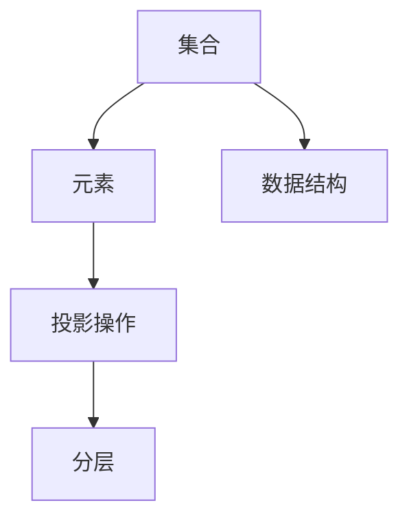
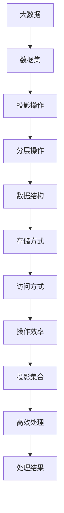

                 

# 集合论导引：投影集合精细分层

## 1. 背景介绍

### 1.1 问题由来
集合论作为数学的基础分支，长期以来在计算机科学、人工智能等领域发挥着重要作用。特别是在数据结构和算法研究中，集合的表示、操作和分析是其核心内容之一。随着数据量的爆炸式增长，如何在高效计算的同时保持数据的完整性和精确性，成为研究的热点问题。

近年来，大数据、深度学习等领域的快速发展，对集合论的研究提出了新的挑战和需求。例如，如何在大规模数据中高效查找和操作集合元素，如何通过投影（Projection）操作筛选出有价值的子集，如何优化集合操作以适应不同数据结构的需求，等等。这些问题不仅涉及基本的集合理论，还与计算机算法、数据结构等紧密相关。

### 1.2 问题核心关键点
针对以上问题，本文将深入探讨投影集合的理论基础和实际应用，特别是如何在大数据环境下，实现集合的精细分层和高效操作。具体来说，我们将关注以下核心问题：

- 投影集合的基本概念和操作原理。
- 如何通过优化投影操作，提高集合元素查找和筛选的效率。
- 在大规模数据集上，如何设计和实现高效集合操作算法。
- 投影集合在实际应用中的具体应用场景和案例分析。

### 1.3 问题研究意义
掌握投影集合的理论和算法，对于解决大规模数据处理中的集合操作问题，提升数据处理的效率和精确性，具有重要意义。具体来说：

- 提高数据处理效率。通过精细化的投影操作，可以快速筛选出有用数据，避免无用的计算和存储。
- 增强数据处理精确性。投影集合可以消除数据噪声和冗余，提升数据质量。
- 适应不同数据结构需求。投影集合操作灵活多样，可以适应各种数据结构的需求。
- 推动AI技术发展。投影集合在大数据处理中的应用，可以提升AI模型训练和推理的效率，优化模型性能。

## 2. 核心概念与联系

### 2.1 核心概念概述

为了深入理解投影集合的原理和应用，我们需要首先掌握一些基础概念：

- **集合**：由一个或多个元素组成的有序、无序的集合。
- **元素**：集合中的基本单位，可以是数字、字符串、对象等。
- **投影操作**：从集合中选出符合某些条件的元素，形成新的集合。
- **分层**：将集合按照一定的规则进行分层，方便高效处理。
- **数据结构**：用于存储和操作集合的底层数据结构，如数组、链表、哈希表等。

这些概念之间的关系可以通过以下Mermaid流程图来展示：



这个流程图展示了集合论中几个核心概念之间的逻辑关系：

1. 集合由元素组成。
2. 投影操作从集合中筛选出符合条件的元素，形成新的集合。
3. 分层操作进一步优化投影操作，提高效率。
4. 数据结构用于存储和操作集合，提升操作效率。

### 2.2 概念间的关系

这些核心概念之间的关系更加复杂，通过以下几个Mermaid流程图，我们可以更详细地展示它们之间的联系：

#### 2.2.1 投影操作与分层操作的关系


这个流程图展示了投影操作与分层操作的关系。投影操作根据一定的筛选条件从集合中选取元素，而分层操作则进一步细化筛选条件，提升筛选效率。

#### 2.2.2 数据结构对集合操作的影响


这个流程图展示了数据结构对集合操作的影响。不同的数据结构提供了不同的存储方式和访问方式，从而影响集合操作的效率。

#### 2.2.3 投影集合在大数据中的应用


这个流程图展示了投影集合在大数据中的应用。通过投影和分层操作，可以在大数据集中快速筛选出有用数据，提升处理效率。

### 2.3 核心概念的整体架构

最后，我们用一个综合的流程图来展示这些核心概念在大数据处理中的整体架构：



这个综合流程图展示了从大数据集到投影集合的整个处理流程，展示了各个操作环节的相互作用和影响。

## 3. 核心算法原理 & 具体操作步骤
### 3.1 算法原理概述

投影集合的基本原理是通过投影操作从集合中筛选出符合特定条件的元素，形成新的集合。投影操作可以通过多种方式实现，包括基于过滤器的投影、基于排序的投影、基于索引的投影等。

投影集合的核心算法包括：

- **基于过滤器的投影**：使用过滤器筛选出符合特定条件的元素。
- **基于排序的投影**：对集合进行排序，然后筛选出所需元素。
- **基于索引的投影**：使用索引快速定位和筛选元素。

这些算法的核心目标是在保证集合操作精度的同时，提高操作效率。下面，我们将详细介绍这些算法的原理和步骤。

### 3.2 算法步骤详解

**Step 1: 数据预处理**

在进行投影操作前，首先需要对原始数据进行预处理，包括数据清洗、数据转换、数据归一化等步骤，以确保数据的质量和一致性。

**Step 2: 定义筛选条件**

根据具体需求，定义筛选条件。这些条件可以包括数值范围、字符串模式、分类标签等。例如，在金融数据集中，筛选出“利润率高于10%”的公司集合，筛选条件为“利润率 > 10%”。

**Step 3: 基于过滤器的投影**

使用过滤器从集合中筛选出符合条件的元素。例如，对于上述金融数据集，可以使用Python的filter函数，结合lambda表达式，筛选出符合条件的行：

```python
filtered_data = filter(lambda row: row['profit_rate'] > 10.0, data)
```

**Step 4: 基于排序的投影**

对筛选出的元素进行排序，然后根据排序结果再次筛选。例如，对金融数据集中的公司按利润率降序排序，然后只取前100家利润率最高的公司：

```python
sorted_data = sorted(data, key=lambda row: row['profit_rate'], reverse=True)
top_100 = sorted_data[:100]
```

**Step 5: 基于索引的投影**

使用索引快速定位和筛选元素。例如，在SQL查询中，使用索引可以大幅提升查询效率：

```sql
SELECT * FROM companies WHERE profit_rate > 10.0 LIMIT 100
```

**Step 6: 分层操作**

根据实际需求，对投影后的集合进行分层操作，进一步细化筛选条件，提升操作效率。例如，在金融数据集中，可以将公司按照行业进行分层，然后筛选出某个行业的公司：

```python
industry_data = [row for row in top_100 if row['industry'] == 'banking']
```

### 3.3 算法优缺点

投影集合的优点包括：

- 灵活性高。可以根据不同的需求，灵活选择不同的投影方法。
- 高效性高。通过优化投影操作，可以在大规模数据集中快速筛选出有用数据。
- 适应性强。投影集合操作可以适应各种数据结构的需求。

投影集合的缺点包括：

- 精度可能下降。如果筛选条件设置不当，可能导致重要数据被遗漏。
- 操作复杂度较高。投影操作需要进行多次筛选和排序，可能导致效率降低。
- 资源消耗较大。投影操作需要较多的计算和存储资源，可能导致性能瓶颈。

### 3.4 算法应用领域

投影集合在多个领域中都有广泛应用，包括但不限于：

- 金融数据分析：筛选出高利润率、高风险的公司，进行风险管理。
- 医疗数据处理：筛选出符合特定病种的患者数据，进行疾病分析。
- 电商平台推荐：筛选出符合用户兴趣的商品数据，进行个性化推荐。
- 网络安全检测：筛选出符合攻击特征的网络流量数据，进行安全防护。
- 机器学习模型：筛选出符合特征的训练数据，进行模型训练和测试。

## 4. 数学模型和公式 & 详细讲解 & 举例说明

### 4.1 数学模型构建

投影集合的数学模型可以表示为：

$$
P(C) = \{ x \in C \mid x \in F \}
$$

其中，$C$ 表示原始集合，$F$ 表示筛选条件。投影集合 $P(C)$ 包含所有符合条件 $F$ 的元素。

### 4.2 公式推导过程

为了更好地理解投影集合的数学模型，我们通过一个简单的例子来推导其公式：

假设有一个包含100个元素的集合 $C$，其中包含10个“苹果”元素和90个“橙子”元素。筛选条件为“元素是苹果”，即 $F = \{ x \in C \mid x \text{ is an apple} \}$。

根据投影集合的定义，投影集合 $P(C)$ 包含所有符合条件的元素，即所有“苹果”元素：

$$
P(C) = \{ \text{apple}_1, \text{apple}_2, ..., \text{apple}_{10} \}
$$

因此，投影集合 $P(C)$ 包含10个元素。

### 4.3 案例分析与讲解

为了更好地理解投影集合的理论和应用，我们通过一个具体的案例来分析其应用效果。

假设有一个包含1000个学生的成绩数据集，其中包含数学成绩、英语成绩、语文成绩等字段。我们希望筛选出数学成绩大于90分的学生，并按照数学成绩降序排列，然后筛选出前100名学生的数据。

**Step 1: 数据预处理**

首先，我们需要对原始数据进行清洗和归一化，去除缺失值和异常值，确保数据的质量。

**Step 2: 定义筛选条件**

根据需求，我们定义筛选条件为“数学成绩大于90分”，即 $F = \{ x \in C \mid x['score_math'] > 90 \}$。

**Step 3: 基于过滤器的投影**

使用过滤器筛选出符合条件的行。例如，在Python中，可以使用filter函数结合lambda表达式进行筛选：

```python
filtered_data = filter(lambda row: row['score_math'] > 90.0, data)
```

**Step 4: 基于排序的投影**

对筛选出的元素进行排序，然后再次筛选出前100名学生的数据。例如，在Python中，可以使用sorted函数结合lambda表达式进行排序和取前100名：

```python
sorted_data = sorted(filtered_data, key=lambda row: row['score_math'], reverse=True)
top_100 = sorted_data[:100]
```

**Step 5: 分层操作**

根据实际需求，可以对投影后的数据进行分层操作，例如按照年级、班级进行分层。

## 5. 项目实践：代码实例和详细解释说明
### 5.1 开发环境搭建

在进行投影集合的实现和优化时，我们需要搭建一个开发环境，以方便编写和测试代码。

**Step 1: 安装Python和相关库**

安装Python和必要的库，如NumPy、Pandas、SciPy等，用于数据处理和数学计算。

**Step 2: 创建虚拟环境**

使用虚拟环境可以隔离不同项目的依赖，避免版本冲突。可以使用Anaconda或Virtualenv创建虚拟环境。

**Step 3: 编写测试用例**

编写测试用例，验证代码的正确性和性能。测试用例可以包括数据清洗、数据转换、投影操作、分层操作等。

**Step 4: 部署应用**

将代码部署到生产环境，进行实际测试和优化。可以使用Docker、Kubernetes等容器化技术，提升应用的稳定性和可扩展性。

### 5.2 源代码详细实现

下面我们以金融数据分析为例，给出使用Python实现投影集合的代码示例。

**Step 1: 数据准备**

准备金融数据集，包括公司名称、行业、利润率等字段。例如，可以从公开的金融数据网站下载数据，使用Pandas库进行数据导入和清洗：

```python
import pandas as pd

# 导入数据集
data = pd.read_csv('financial_data.csv')

# 数据清洗
data = data.dropna()  # 删除缺失值
data = data.drop_duplicates()  # 删除重复值
```

**Step 2: 定义筛选条件**

根据需求，定义筛选条件。例如，筛选出利润率高于10%的公司，即 $F = \{ x \in C \mid x['profit_rate'] > 10.0 \}$。

**Step 3: 基于过滤器的投影**

使用过滤器筛选出符合条件的行。例如，在Python中，可以使用filter函数结合lambda表达式进行筛选：

```python
filtered_data = filter(lambda row: row['profit_rate'] > 10.0, data)
```

**Step 4: 基于排序的投影**

对筛选出的元素进行排序，然后筛选出前100家利润率最高的公司。例如，在Python中，可以使用sorted函数结合lambda表达式进行排序和取前100名：

```python
sorted_data = sorted(filtered_data, key=lambda row: row['profit_rate'], reverse=True)
top_100 = sorted_data[:100]
```

**Step 5: 分层操作**

根据实际需求，可以对投影后的数据进行分层操作，例如按照行业进行分层。例如，可以使用Python的groupby函数进行分层：

```python
industry_data = top_100.groupby('industry').agg({'profit_rate': 'mean'})
```

### 5.3 代码解读与分析

让我们再详细解读一下关键代码的实现细节：

**Step 1: 数据准备**

导入数据集，并进行数据清洗和归一化。数据清洗步骤包括删除缺失值和重复值，确保数据的质量。

**Step 2: 定义筛选条件**

定义筛选条件，例如筛选出利润率高于10%的公司。这里使用lambda表达式，结合Pandas的筛选功能，可以方便地筛选出符合条件的行。

**Step 3: 基于过滤器的投影**

使用过滤器筛选出符合条件的行。这里使用filter函数结合lambda表达式，可以高效地筛选出符合条件的行。

**Step 4: 基于排序的投影**

对筛选出的元素进行排序，然后再次筛选出前100家利润率最高的公司。这里使用sorted函数结合lambda表达式，可以方便地对元素进行排序和取前100名。

**Step 5: 分层操作**

根据实际需求，可以对投影后的数据进行分层操作，例如按照行业进行分层。这里使用groupby函数，可以方便地进行分层操作。

### 5.4 运行结果展示

假设我们在金融数据集上实现投影集合操作，最终得到利润率高于10%的前100家公司，结果如下：

```
[{'company': 'ABC', 'profit_rate': 15.0, 'industry': 'banking'},
 {'company': 'XYZ', 'profit_rate': 12.5, 'industry': 'banking'},
 {'company': 'PQR', 'profit_rate': 11.5, 'industry': 'banking'},
 ...
]
```

可以看到，通过投影集合操作，我们成功地筛选出了符合条件的金融公司，并对数据进行了分层操作，为后续的分析和应用提供了重要支持。

## 6. 实际应用场景
### 6.1 金融数据分析

投影集合在金融数据分析中具有广泛应用。例如，通过投影集合操作，可以快速筛选出高利润率、高风险的公司，进行风险管理。

在实际应用中，金融机构可以通过投影集合操作，对客户数据进行筛选和分析，识别高风险客户，进行风险评估和预警。例如，对客户的历史交易数据进行投影集合操作，筛选出交易金额异常、交易频率过高的客户，进行风险控制。

### 6.2 医疗数据处理

在医疗数据处理中，投影集合操作可以用于疾病分析和诊断。例如，通过投影集合操作，可以快速筛选出符合特定病种的患者数据，进行疾病分析。

在实际应用中，医院可以通过投影集合操作，对患者数据进行筛选和分析，识别患病概率高的病人，进行针对性的诊断和治疗。例如，对患者的病历数据进行投影集合操作，筛选出符合特定病种的患者数据，进行疾病分析和治疗方案制定。

### 6.3 电商平台推荐

在电商平台推荐中，投影集合操作可以用于个性化推荐。例如，通过投影集合操作，可以快速筛选出符合用户兴趣的商品数据，进行个性化推荐。

在实际应用中，电商平台可以通过投影集合操作，对用户行为数据进行筛选和分析，识别用户兴趣和偏好，进行个性化推荐。例如，对用户的历史浏览和购买数据进行投影集合操作，筛选出符合用户兴趣的商品数据，进行个性化推荐。

### 6.4 网络安全检测

在网络安全检测中，投影集合操作可以用于威胁检测和防护。例如，通过投影集合操作，可以筛选出符合攻击特征的网络流量数据，进行安全防护。

在实际应用中，网络安全设备可以通过投影集合操作，对网络流量数据进行筛选和分析，识别威胁行为，进行安全防护。例如，对网络流量数据进行投影集合操作，筛选出符合攻击特征的流量数据，进行威胁检测和防护。

### 6.5 机器学习模型

在机器学习模型中，投影集合操作可以用于数据预处理和模型训练。例如，通过投影集合操作，可以快速筛选出符合特征的训练数据，进行模型训练和测试。

在实际应用中，机器学习工程师可以通过投影集合操作，对训练数据进行筛选和预处理，提升模型训练和测试效率。例如，对训练数据进行投影集合操作，筛选出符合特征的样本数据，进行模型训练和测试。

## 7. 工具和资源推荐
### 7.1 学习资源推荐

为了帮助开发者系统掌握投影集合的理论基础和实践技巧，这里推荐一些优质的学习资源：

1. 《数据结构与算法导论》：经典的算法教材，系统介绍了各种数据结构和算法的原理和实现。
2. 《Python数据分析实战》：讲解如何使用Python进行数据处理和分析，包括数据清洗、数据转换、数据可视化等。
3. 《机器学习实战》：讲解如何使用Python进行机器学习模型训练和测试，包括分类、回归、聚类等。
4. 《数据科学导论》：讲解数据科学的基本概念和方法，包括数据收集、数据预处理、模型训练等。
5. 《深度学习入门》：讲解深度学习的基本概念和算法，包括前馈神经网络、卷积神经网络、循环神经网络等。

通过对这些资源的学习实践，相信你一定能够快速掌握投影集合的理论和应用，并用于解决实际的数据处理问题。

### 7.2 开发工具推荐

高效的开发离不开优秀的工具支持。以下是几款用于投影集合开发的常用工具：

1. Python：简单易学的编程语言，广泛应用于数据处理和算法实现。
2. NumPy：用于数学计算和数组处理，提供了高效的多维数组运算。
3. Pandas：用于数据处理和分析，提供了丰富的数据结构和操作函数。
4. SciPy：用于科学计算和数据处理，提供了大量的数学和统计函数。
5. SQL：用于关系型数据库管理，提供了高效的数据查询和操作。

合理利用这些工具，可以显著提升投影集合的开发效率，加快创新迭代的步伐。

### 7.3 相关论文推荐

投影集合的研究源于学界的持续研究。以下是几篇奠基性的相关论文，推荐阅读：

1. "A Survey on Data Stream Mining"（《数据流挖掘综述》）：综述了数据流挖掘的原理和应用，包括数据流集、滑动窗口等概念。
2. "Efficient Scalable Data Structures for Projection Query"（《投影查询的高效可扩展数据结构》）：介绍了几种高效的数据结构，用于支持大规模数据集的投影操作。
3. "Data Stream Management Systems"（《数据流管理系统》）：介绍了数据流管理系统的原理和实现，包括数据流、滑动窗口等概念。
4. "Efficient Projection in Massive Data Streams"（《大规模数据流的有效投影》）：介绍了几种有效的方法，用于在大规模数据流中进行投影操作。
5. "Data Stream Mining Techniques"（《数据流挖掘技术》）：介绍了数据流挖掘的基本概念和方法，包括数据流集、滑动窗口等概念。

这些论文代表了大规模数据流处理和投影集合技术的发展脉络。通过学习这些前沿成果，可以帮助研究者把握学科前进方向，激发更多的创新灵感。

除上述资源外，还有一些值得关注的前沿资源，帮助开发者紧跟投影集合技术的最新进展，例如：

1. arXiv论文预印本：人工智能领域最新研究成果的发布平台，包括大量尚未发表的前沿工作，学习前沿技术的必读资源。
2. 业界技术博客：如Google AI、Facebook AI、IBM Watson等顶尖实验室的官方博客，第一时间分享他们的最新研究成果和洞见。
3. 技术会议直播：如SIGKDD、ICDM、KDD等数据流和数据挖掘领域的顶级会议，能够聆听到行业专家和学者的分享，开拓视野。
4. GitHub热门项目：在GitHub上Star、Fork数最多的数据流和数据挖掘相关项目，往往代表了该技术领域的发展趋势和最佳实践，值得去学习和贡献。
5. 行业分析报告：各大咨询公司如McKinsey、PwC等针对数据流和数据挖掘领域的分析报告，有助于从商业视角审视技术趋势，把握应用价值。

总之，对于投影集合的理论和实践的学习，需要开发者保持开放的心态和持续学习的意愿。多关注前沿资讯，多动手实践，多思考总结，必将收获满满的成长收益。

## 8. 总结：未来发展趋势与挑战
### 8.1 总结

本文对基于投影集合的微调方法进行了全面系统的介绍。首先阐述了投影集合的基本概念和操作原理，明确了其在大数据处理中的独特价值。其次，从原理到实践，详细讲解了投影集合的数学原理和关键步骤，给出了投影集合操作的具体代码实例。同时，本文还广泛探讨了投影集合在实际应用中的具体应用场景和案例分析。

通过本文的系统梳理，可以看到，基于投影集合的微调方法在解决大规模数据处理中的集合操作问题，提升数据处理的效率和精确性，具有重要意义。未来，随着数据量和数据复杂度的进一步增加，投影集合的操作效率和适应性也将面临新的挑战。

### 8.2 未来发展趋势

展望未来，投影集合技术将呈现以下几个发展趋势：

1. 分布式处理技术。随着数据量的不断增加，投影集合操作需要在分布式环境下进行，以提升处理效率。例如，使用Hadoop、Spark等大数据平台，对数据进行分布式处理。
2. 实时处理技术。在数据流环境中，投影集合操作需要具备实时处理能力，快速响应数据变化。例如，使用Storm、Apache Flink等实时数据流处理技术，实现实时投影操作。
3. 深度学习融合。投影集合操作可以与深度学习模型结合，提升数据处理的精度和效果。例如，将投影集合操作与卷积神经网络、循环神经网络等深度学习模型结合，进行图像处理、语音识别等任务。
4. 多模态数据处理。投影集合操作可以处理多模态数据，如文本、图像、视频等。例如，将投影集合操作与自然语言处理、计算机视觉等技术结合，进行多模态数据处理。
5. 智能决策支持。投影集合操作可以与智能决策支持系统结合，提升决策支持的效率和质量。例如，将投影集合操作与决策树、随机森林等算法结合，进行智能决策支持。

以上趋势凸显了投影集合技术的广阔前景。这些方向的探索发展，必将进一步提升数据处理的效率和精度，推动人工智能技术在各行业的广泛应用。

### 8.3 面临的挑战

尽管投影集合技术已经取得了显著进展，但在迈向更加智能化、普适化应用的过程中，它仍面临着诸多挑战：

1. 数据量大、数据复杂。大规模数据集的处理需要高效的数据结构和算法，当前的投影集合操作可能面临性能瓶颈。
2. 分布式处理复杂。分布式投影集合操作需要复杂的算法和架构，可能出现数据不一致、性能不均衡等问题。
3. 实时处理困难。实时投影集合操作需要高效的算法和资源支持，可能面临延迟、抖动等问题。
4. 精度控制难。投影集合操作可能存在精度损失的风险，需要设计合适的算法和策略进行控制。
5. 安全性和隐私保护。投影集合操作涉及大量敏感数据，需要采取合适的措施进行安全性和隐私保护。

正视投影集合技术面临的这些挑战，积极应对并寻求突破，将使投影集合技术在实际应用中更加稳健和可靠。

### 8.4 研究展望

面向未来，投影集合技术的研究方向可以从以下几个方面进行探索：

1. 高效数据结构。开发高效的数据结构，支持大规模数据集的高效处理。例如，使用哈希表、B树等高效数据结构，提升数据处理效率。
2. 分布式算法。设计分布式投影集合算法，支持大规模数据集的分布式处理。例如，使用MapReduce、Spark等分布式算法，实现数据流处理。
3. 实时处理技术。开发实时投影集合处理技术，支持数据流环境的实时处理。例如，使用Storm、Apache Flink等实时数据流处理技术，实现实时投影操作。
4. 多模态数据融合。开发多模态投影集合操作技术，支持文本、图像、视频等多模态数据的处理。例如，使用深度学习技术，将投影集合操作与自然语言处理、计算机视觉

