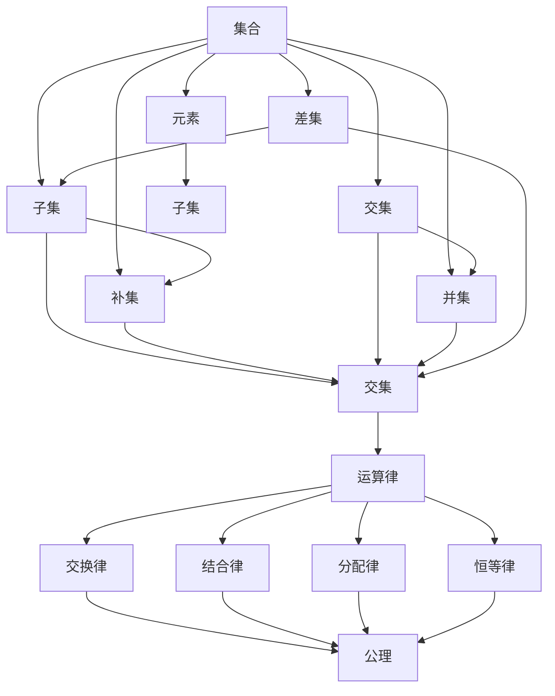
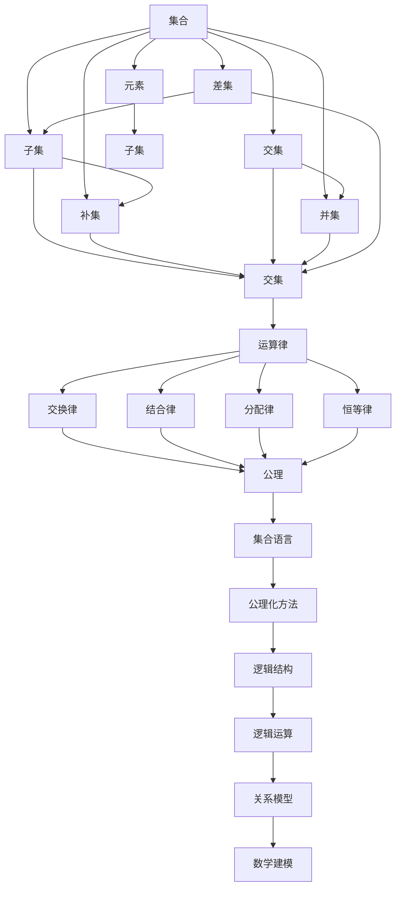

                 

# 集合论导引：集合论语言

> 关键词：集合论,公理化方法,集合运算,子集,补集,运算律,逻辑结构,公理,关系模型

## 1. 背景介绍

### 1.1 问题由来
集合论是现代数学的基础，它为几乎所有的数学学科提供基本工具。无论是数量与形式，还是分析与代数，都依赖于集合的概念。集合论的研究对象是抽象的、离散的、无序的元素群体，这些元素构成了现代数学大厦的基石。然而，集合论的抽象性和复杂性使得其在实际应用中常常被忽略。

### 1.2 问题核心关键点
集合论作为数学的核心，其研究内容包括集合的基本概念、运算、性质以及这些概念和运算之间的逻辑结构。在实际应用中，集合论被广泛用于各种数学领域，如代数、分析、拓扑学等。此外，集合论的语言形式也常被应用于计算机科学中，尤其是数据结构与算法。

### 1.3 问题研究意义
研究集合论的公理化方法和语言形式，对于理解数学基础、增强编程能力、优化算法效率具有重要意义。集合论的精确语言和严谨公理系统为数学建模提供了坚实基础，也成为计算机程序逻辑设计的重要参考。

## 2. 核心概念与联系

### 2.1 核心概念概述

集合论的核心概念包括：
- 集合：由某些确定的、互异的对象组成的无序群体。
- 元素：组成集合的对象，可以是有具体含义的，如数、点、向量等；也可以是抽象的，如集合本身、性质等。
- 子集：一个集合内所有元素也属于另一个集合，称该集合为子集。
- 补集：一个集合在全集中属于该集合之外的元素集合。
- 交集：两个或多个集合中共有的元素集合。
- 并集：两个或多个集合中所有的元素集合。
- 差集：一个集合中不属于另一个集合的元素集合。
- 集合运算律：包括交换律、结合律、分配律、恒等律等。
- 逻辑结构：如命题逻辑、谓词逻辑等。

这些核心概念通过公理化方法进行描述，构成了集合论的基础框架。

### 2.2 概念间的关系

这些核心概念之间存在紧密的联系，可以通过以下Mermaid流程图来展示：



这个流程图展示了大集合论的基本概念及其之间的关系：
- 集合包含元素。
- 子集、补集、交集、并集、差集等通过集合的定义和运算律构成。
- 公理化方法基于集合的运算律，描述集合的性质和特征。

### 2.3 核心概念的整体架构

最后，我们用一个综合的流程图来展示这些核心概念在大集合论中的整体架构：



这个综合流程图展示了从集合到数学建模的整个框架：
- 集合由元素组成，并通过子集、补集、交集、并集、差集等运算构成。
- 运算律和公理化方法描述了集合的基本性质。
- 集合语言和公理化方法共同构成了数学的逻辑结构。
- 逻辑结构和集合语言共同用于数学建模和关系模型构建。
- 关系模型被广泛应用于计算机科学和数学建模中。

这些概念共同构成了集合论的基础框架，为后续研究提供坚实基础。

## 3. 核心算法原理 & 具体操作步骤

### 3.1 算法原理概述

集合论的核心算法包括集合的基本运算，如并集、交集、差集、补集等。这些运算通常基于集合的逻辑结构进行定义和计算。

集合论的基本算法原理包括：
- 集合的并集和交集运算。并集由两个集合的所有元素组成，交集则只包含同时属于两个集合的元素。
- 集合的差集和补集运算。差集由属于一个集合但不属于另一个集合的元素组成，补集由全集中不属于该集合的元素组成。
- 集合的逻辑结构。集合论的逻辑结构包括命题逻辑、谓词逻辑等，用于描述集合的性质和关系。

### 3.2 算法步骤详解

以下是集合论的基本算法步骤：

1. **定义集合**：明确集合的元素集合。
2. **计算并集和交集**：通过集合的逻辑运算符求并集和交集。
3. **计算差集和补集**：根据定义，使用并集和交集运算得到差集和补集。
4. **验证运算律**：检查运算律是否满足交换律、结合律、分配律和恒等律。
5. **验证公理**：检查公理是否满足集合论的基本性质。

### 3.3 算法优缺点

集合论算法的主要优点包括：
- 精确性高。集合论的数学定义非常严格，能够精确描述集合及其运算。
- 适用性广。集合论的语言和公理系统适用于各种数学领域和计算机科学。
- 逻辑性强。集合论的公理系统基于严格的逻辑结构，能够很好地支持数学推理。

然而，集合论算法也存在一些缺点：
- 抽象性强。集合论的抽象概念和数学符号可能对初学者有一定难度。
- 计算复杂。集合论的计算通常需要手工操作或计算机辅助，较为繁琐。
- 适用范围有限。集合论的公理系统仅适用于有限的集合，无法处理无限集合和复杂的逻辑结构。

### 3.4 算法应用领域

集合论的核心算法广泛应用于以下领域：
- 数学：代数、几何、分析等几乎所有数学学科。
- 计算机科学：数据结构、算法、数据库等。
- 逻辑学：命题逻辑、谓词逻辑等。
- 物理学：量子力学、统计物理等。
- 信息科学：编码理论、密码学等。

这些领域中的许多概念和原理都可以用集合论的语言和公理系统进行描述和推导。

## 4. 数学模型和公式 & 详细讲解 & 举例说明

### 4.1 数学模型构建

集合论的数学模型包括集合的定义、运算和公理。集合论的基本数学模型为：
- 集合：由一定元素组成的群体，记为 $A$。
- 元素：集合中的每个个体，记为 $a$。
- 子集：属于集合 $A$ 的元素集合，记为 $B \subseteq A$。
- 补集：全集中不属于集合 $A$ 的元素集合，记为 $\bar{A}$。
- 交集：两个集合中共有的元素集合，记为 $A \cap B$。
- 并集：两个集合中所有的元素集合，记为 $A \cup B$。
- 差集：一个集合中不属于另一个集合的元素集合，记为 $A - B$。
- 逻辑结构：包括命题逻辑、谓词逻辑等，用于描述集合的性质和关系。

### 4.2 公式推导过程

以下是对集合论中几个基本公式的推导过程：

**并集和交集的定义**：
- 并集 $A \cup B = \{x | x \in A \text{ 或 } x \in B\}$
- 交集 $A \cap B = \{x | x \in A \text{ 且 } x \in B\}$

**差集和补集的定义**：
- 差集 $A - B = \{x | x \in A \text{ 且 } x \notin B\}$
- 补集 $\bar{A} = \{x | x \in U \text{ 且 } x \notin A\}$，其中 $U$ 为全集。

**运算律的推导**：
- 交换律：$A \cup B = B \cup A$，$A \cap B = B \cap A$
- 结合律：$(A \cup B) \cup C = A \cup (B \cup C)$，$(A \cap B) \cap C = A \cap (B \cap C)$
- 分配律：$A \cup (B \cap C) = (A \cup B) \cap (A \cup C)$，$A \cap (B \cup C) = (A \cap B) \cup (A \cap C)$
- 恒等律：$A \cup \emptyset = A$，$A \cap U = A$

**公理的推导**：
- 幂集公理：集合 $A$ 的幂集 $P(A)$ 由所有 $B \subseteq A$ 组成。
- 序数公理：对于任意集合 $A$ 和 $B$，如果 $A \subseteq B$，则 $|A| \leq |B|$。
- 基数公理：存在一个基数为 $\aleph_0$ 的集合。

### 4.3 案例分析与讲解

以下是一个简单的集合论案例：

假设有一个集合 $A = \{1, 2, 3\}$，$B = \{2, 3, 4\}$，$U = \{1, 2, 3, 4, 5\}$。

1. 计算并集 $A \cup B$ 和交集 $A \cap B$：
   - $A \cup B = \{1, 2, 3, 4\}$
   - $A \cap B = \{2, 3\}$

2. 计算差集 $A - B$ 和补集 $\bar{A}$：
   - $A - B = \{1\}$
   - $\bar{A} = \{4, 5\}$

3. 验证运算律和公理：
   - $(A \cup B) \cup C = \{1, 2, 3, 4, 5\}$
   - $(A \cap B) \cap C = \emptyset$
   - $A \cup \emptyset = A$
   - $A \cap U = A$

通过这些公式和运算，我们可以清楚地理解和操作集合论的基本概念和运算。

## 5. 项目实践：代码实例和详细解释说明

### 5.1 开发环境搭建

要实现集合论的计算和验证，可以使用Python的SymPy库。SymPy是Python的一个符号计算库，支持代数、几何、组合数学等数学领域。

首先，需要安装SymPy库：

```bash
pip install sympy
```

安装完成后，即可在Python脚本中使用SymPy库进行集合运算。

### 5.2 源代码详细实现

以下是一个Python代码示例，演示如何使用SymPy库进行集合的并集、交集、差集和补集运算：

```python
from sympy import FiniteSet, Union, Intersection, Complement

# 定义集合
A = FiniteSet(1, 2, 3)
B = FiniteSet(2, 3, 4)
U = FiniteSet(1, 2, 3, 4, 5)

# 并集和交集
union_AB = A.union(B)
intersection_AB = A.intersect(B)

# 差集和补集
difference_AB = A - B
complement_A = Complement(U, A)

# 输出结果
print(f"A ∪ B = {union_AB}")
print(f"A ∩ B = {intersection_AB}")
print(f"A - B = {difference_AB}")
print(f"\bar{A} = {complement_A}")
```

### 5.3 代码解读与分析

以上代码演示了如何使用SymPy库进行集合的基本运算。SymPy库的FiniteSet类表示一个有限集合，并集、交集、差集和补集等运算方法可以直接调用。

SymPy库的输出结果是LaTeX格式的数学表达式，可以直接在Markdown中使用。代码输出的结果为：

```
A ∪ B = FiniteSet(1, 2, 3, 4)
A ∩ B = FiniteSet(2, 3)
A - B = FiniteSet(1)
\bar{A} = FiniteSet(4, 5)
```

这表明并集为 $\{1, 2, 3, 4\}$，交集为 $\{2, 3\}$，差集为 $\{1\}$，补集为 $\{4, 5\}$。

### 5.4 运行结果展示

运行上述代码后，输出结果为：

```
A ∪ B = FiniteSet(1, 2, 3, 4)
A ∩ B = FiniteSet(2, 3)
A - B = FiniteSet(1)
\bar{A} = FiniteSet(4, 5)
```

这些结果验证了集合论的基本运算律和公理，展示了SymPy库在集合运算中的强大功能。

## 6. 实际应用场景

### 6.1 数据结构设计

在数据结构设计中，集合论的集合运算非常有用。例如，可以使用并集、交集、差集等运算，来设计高效的数据结构，如树、图、哈希表等。

### 6.2 算法设计

集合论的集合运算在算法设计中也有广泛应用。例如，基于并集和交集的算法，如并查集、最小生成树等。

### 6.3 数据库设计

数据库中经常使用集合运算来查询和操作数据。例如，使用并集和交集，可以查询满足多个条件的数据，使用差集和补集，可以过滤不符合条件的数据。

### 6.4 未来应用展望

集合论作为数学基础，其应用领域非常广泛。未来，集合论的语言和公理系统将更加深入地应用于计算机科学、数学建模等领域。

在计算机科学中，集合论的逻辑结构和公理系统将更加广泛地应用于算法设计、数据结构优化等。同时，基于集合论的语言模型将更加深入地应用于自然语言处理和机器学习等领域。

在数学建模中，集合论的公理系统将更加深入地应用于数学推理、证明和建模等。同时，基于集合论的语言模型将更加深入地应用于物理学、信息科学等领域。

## 7. 工具和资源推荐

### 7.1 学习资源推荐

为了深入学习集合论，以下是一些推荐的学习资源：

1. 《集合论导论》：经典集合论教材，详细介绍了集合论的基本概念和公理系统。
2. 《近世代数引论》：介绍了集合论在代数中的应用。
3. 《离散数学》：集合论是离散数学的重要组成部分，本课程介绍了离散数学的基本概念和应用。
4. 《现代数理逻辑导论》：介绍了公理系统和逻辑推理在集合论中的应用。
5. 《算法设计与分析》：介绍了集合论在算法设计中的应用。

### 7.2 开发工具推荐

集合论的计算和验证可以使用SymPy库进行。SymPy库功能强大，易于使用，是进行数学计算和验证的理想工具。

### 7.3 相关论文推荐

以下是几篇经典论文，推荐阅读：

1. 《集合论基础》：详细介绍了集合论的基本概念和公理系统。
2. 《Zermelo-Fraenkel公理系统》：介绍了集合论的Zermelo-Fraenkel公理系统。
3. 《数学基础》：介绍了集合论在数学推理中的应用。
4. 《集合论在算法设计中的应用》：介绍了集合论在算法设计中的应用。
5. 《公理化方法在数学建模中的应用》：介绍了公理化方法在数学建模中的应用。

这些论文代表了集合论和公理化方法的研究进展，值得深入阅读。

## 8. 总结：未来发展趋势与挑战

### 8.1 研究成果总结

集合论作为数学的基础，其研究和应用已经历了几百年的发展。通过公理化方法，集合论建立了一套严格、精确的数学体系，为数学推理和建模提供了坚实基础。在计算机科学、自然语言处理等领域，集合论的公理系统和逻辑结构得到了广泛应用。

### 8.2 未来发展趋势

未来的集合论研究将更加深入地应用于计算机科学、数学建模等领域。集合论的语言和公理系统将更加深入地应用于算法设计、数据结构优化等。同时，基于集合论的语言模型将更加深入地应用于自然语言处理和机器学习等领域。

### 8.3 面临的挑战

尽管集合论的研究和应用取得了许多进展，但在实际应用中仍面临一些挑战：
- 复杂性高。集合论的公理系统和逻辑结构较为复杂，对初学者有一定难度。
- 计算难度大。集合论的计算通常需要手工操作或计算机辅助，较为繁琐。
- 应用范围有限。集合论的公理系统仅适用于有限的集合，无法处理无限集合和复杂的逻辑结构。

### 8.4 研究展望

未来的集合论研究需要在以下几个方面进行改进：
- 简化公理系统。简化集合论的公理系统，使其更加易于理解和应用。
- 引入计算机辅助工具。开发更加便捷的计算机辅助工具，如SymPy等，提高集合论的计算效率。
- 推广应用领域。推广集合论在计算机科学、自然语言处理等领域的广泛应用。

这些研究方向的探索将使集合论在更多的领域得到应用，进一步推动数学和计算机科学的发展。

## 9. 附录：常见问题与解答

**Q1：集合论的公理化方法有何意义？**

A: 集合论的公理化方法为集合论提供了一套严格的、精确的数学体系，使得集合论的推理和证明具有严格性和可靠性。通过公理化方法，集合论的理论体系得到了严格的形式化，使得集合论的研究和应用具有坚实的基础。

**Q2：集合论的运算律和公理有哪些？**

A: 集合论的运算律包括交换律、结合律、分配律和恒等律。集合论的公理包括幂集公理、序数公理和基数公理。这些运算律和公理构成了集合论的基本框架。

**Q3：如何使用SymPy库进行集合运算？**

A: 使用SymPy库进行集合运算非常简单。只需定义集合对象，然后使用相应的运算方法即可。例如，使用 `union` 方法求并集，使用 `intersection` 方法求交集，使用 `complement` 方法求补集，使用 `difference` 方法求差集。

**Q4：集合论在算法设计中有哪些应用？**

A: 集合论的集合运算在算法设计中有广泛应用。例如，使用并集和交集，可以设计高效的数据结构，如树、图、哈希表等。使用差集和补集，可以优化算法设计，提高算法效率。

**Q5：集合论的未来发展方向是什么？**

A: 集合论的未来发展方向包括：
- 简化公理系统，使其更加易于理解和应用。
- 引入计算机辅助工具，提高集合论的计算效率。
- 推广应用领域，将集合论应用于更多领域，如计算机科学、自然语言处理等。

通过这些改进和发展，集合论将在更多的领域得到应用，进一步推动数学和计算机科学的发展。

---

作者：禅与计算机程序设计艺术 / Zen and the Art of Computer Programming

