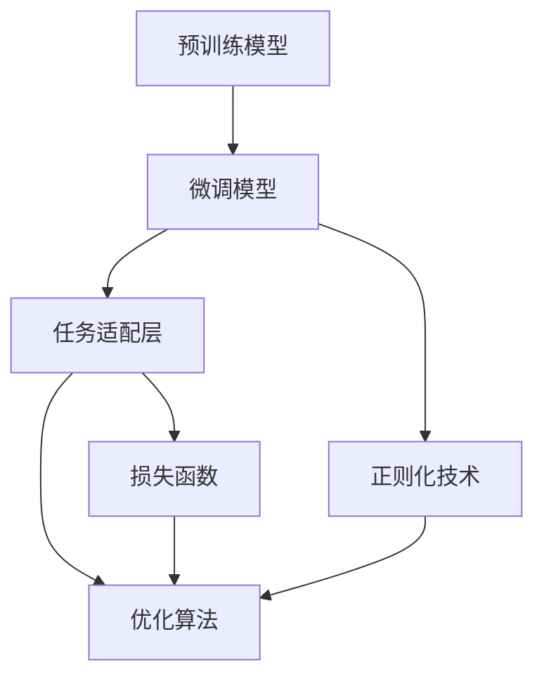
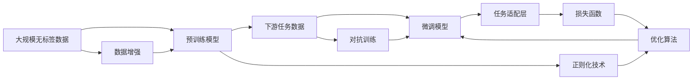

                 

## 1. 背景介绍

随着深度学习和大数据技术的发展，预训练与微调（Pre-training and Fine-tuning）在自然语言处理（NLP）和计算机视觉（CV）等领域逐渐成为主流技术，尤其在大规模无监督学习和高效小样本学习方面具有显著优势。预训练是指在大规模无标签数据上进行的自监督学习过程，而微调是指在预训练模型基础上，利用下游任务的有标签数据对模型进行有监督的调整，以适应特定任务的需求。两者结合，可以显著提升模型在特定领域的表现，降低开发成本，提高模型效率。本文将系统介绍预训练与微调的相关知识，包括预训练模型的构建、微调技术的应用，以及如何通过优化这些技术，提升模型的性能和应用效果。

## 2. 核心概念与联系

### 2.1 核心概念概述

预训练与微调涉及多个关键概念，包括预训练模型、微调模型、任务适配层、损失函数、优化算法、正则化技术等。以下将逐一介绍这些概念，并展示它们之间的联系。

**预训练模型**：指在大规模无标签数据上，通过自监督学习任务训练得到的通用模型。常见的预训练模型有BERT、GPT、ResNet等。这些模型通常在大量的文本数据或图像数据上进行预训练，学习到丰富的语言或视觉表示。

**微调模型**：在预训练模型基础上，利用下游任务的有标签数据对其进行微调，以适应特定任务的需求。微调模型通常只更新少量的参数，保留大部分预训练权重，以减少过拟合的风险。

**任务适配层**：在微调模型上添加的任务相关层，如分类层、回归层等。任务适配层的作用是调整模型的输出格式，使其与下游任务的要求相匹配。

**损失函数**：衡量模型输出与真实标签之间差异的函数，用于指导模型优化。常见的损失函数包括交叉熵损失、均方误差损失等。

**优化算法**：用于最小化损失函数的算法，如随机梯度下降（SGD）、AdamW等。优化算法通过调整模型参数，使模型输出逐渐逼近真实标签。

**正则化技术**：用于防止模型过拟合的技术，如L2正则、Dropout、Early Stopping等。正则化技术通过增加模型的复杂度惩罚，减少模型对训练数据的过度拟合。

这些概念通过以下Mermaid流程图展示了它们之间的关系：



### 2.2 概念间的关系

预训练与微调的核心在于将预训练模型的通用表示与下游任务的特定需求进行结合，以达到提升模型性能的目的。以下是更详细的流程图示：



此图展示了从大规模数据预训练到微调模型的完整过程。预训练模型在无标签数据上进行自监督学习，学习到丰富的表示；然后，通过微调模型在任务适配层上进行调整，以适应特定任务；同时，通过正则化技术和优化算法，使模型性能不断提升，最终得到适用于下游任务的微调模型。

## 3. 核心算法原理 & 具体操作步骤

### 3.1 算法原理概述

预训练与微调的核心在于通过自监督学习和大规模数据训练，使模型学习到通用的表示，然后通过有监督学习，使模型适应特定任务的需求。预训练模型通常使用自监督学习任务，如掩码语言模型（MLM）、下一句预测（NSP）等，来学习语言或图像的通用表示。微调模型则是在预训练模型上，利用下游任务的有标签数据进行有监督学习，调整模型的输出，使其与任务标签一致。

### 3.2 算法步骤详解

以下详细讲解预训练与微调的基本步骤：

1. **数据准备**：准备预训练数据和下游任务的有标签数据。预训练数据可以是大规模的未标注文本或图像，而下游任务数据是具体的有标签样本。

2. **预训练模型构建**：选择合适的预训练模型，如BERT、GPT等，并在大规模无标签数据上训练模型，学习到通用的表示。

3. **微调模型设计**：在预训练模型的基础上，设计任务适配层和损失函数，以适应下游任务的需求。

4. **微调模型训练**：利用下游任务的数据集，训练微调模型，最小化损失函数，更新模型参数，使其输出更接近于真实标签。

5. **模型评估与调优**：在验证集上评估模型的性能，根据性能指标调整模型参数，如学习率、批大小等。

6. **模型部署与应用**：将微调模型部署到实际应用中，进行推理和预测。

### 3.3 算法优缺点

预训练与微调具有以下优点：

- **通用性**：预训练模型可以在不同领域和任务上应用，显著降低了模型开发和训练的复杂度和成本。
- **高效性**：微调模型通常只更新少量的参数，保留了大部分预训练权重，避免了过拟合，提升了模型训练和推理的效率。
- **性能提升**：通过微调，模型可以在小样本情况下，快速适应特定任务，提升模型的性能和效果。

然而，预训练与微调也存在以下缺点：

- **依赖标注数据**：微调模型需要下游任务的有标签数据，而高质量标注数据的获取往往成本较高。
- **泛化能力有限**：当预训练数据与下游任务的分布差异较大时，微调的泛化能力有限。
- **模型复杂性**：预训练和微调模型结构复杂，对硬件资源要求较高。

### 3.4 算法应用领域

预训练与微调技术广泛应用于多个领域，以下是几个典型的应用场景：

- **自然语言处理**：文本分类、命名实体识别、情感分析、机器翻译等任务。
- **计算机视觉**：图像分类、目标检测、图像分割等任务。
- **语音处理**：语音识别、语音合成等任务。
- **医疗**：疾病诊断、药物研发等任务。
- **金融**：市场分析、信用评分等任务。
- **智能客服**：客户咨询问答、情感分析等任务。

## 4. 数学模型和公式 & 详细讲解 & 举例说明

### 4.1 数学模型构建

预训练与微调过程可以形式化地表示为：

- 预训练模型：$M_{\theta} = \text{Encoder}(X)$
- 微调模型：$M_{\hat{\theta}} = M_{\theta}(x, y)$
- 损失函数：$\mathcal{L}(\hat{\theta}, D) = \frac{1}{N} \sum_{i=1}^N \ell(M_{\hat{\theta}}(x_i), y_i)$

其中，$M_{\theta}$ 为预训练模型，$x$ 为输入数据，$y$ 为真实标签，$\hat{\theta}$ 为微调后的模型参数，$\ell$ 为损失函数，$D$ 为下游任务的有标签数据集。

### 4.2 公式推导过程

以二分类任务为例，损失函数可以表示为：

$$
\mathcal{L}(\hat{\theta}, D) = -\frac{1}{N} \sum_{i=1}^N [y_i\log \sigma(M_{\hat{\theta}}(x_i)) + (1-y_i)\log(1-\sigma(M_{\hat{\theta}}(x_i)))
$$

其中，$\sigma$ 为sigmoid函数，用于将模型的输出映射到0-1之间的概率值。

### 4.3 案例分析与讲解

假设我们有一个二分类任务，标签为0或1，数据集为 $\{(x_1, y_1), (x_2, y_2), \ldots, (x_N, y_N)\}$。我们使用预训练的BERT模型，对其进行微调，以适应该二分类任务。以下是一个简单的PyTorch实现：

```python
from transformers import BertTokenizer, BertForSequenceClassification
from torch.utils.data import Dataset, DataLoader
from torch.nn import CrossEntropyLoss
from torch.optim import AdamW

class MyDataset(Dataset):
    def __init__(self, texts, labels, tokenizer):
        self.texts = texts
        self.labels = labels
        self.tokenizer = tokenizer

    def __len__(self):
        return len(self.texts)

    def __getitem__(self, idx):
        text = self.texts[idx]
        label = self.labels[idx]
        encoding = self.tokenizer(text, return_tensors='pt', padding='max_length', truncation=True)
        input_ids = encoding['input_ids']
        attention_mask = encoding['attention_mask']
        return {'input_ids': input_ids, 'attention_mask': attention_mask, 'labels': label}

tokenizer = BertTokenizer.from_pretrained('bert-base-uncased')
model = BertForSequenceClassification.from_pretrained('bert-base-uncased', num_labels=2)

# 定义损失函数和优化器
criterion = CrossEntropyLoss()
optimizer = AdamW(model.parameters(), lr=1e-5)

# 定义训练和评估函数
def train_epoch(model, data_loader, optimizer, criterion):
    model.train()
    for batch in data_loader:
        inputs = {key: val.to(device) for key, val in batch.items()}
        outputs = model(**inputs)
        loss = criterion(outputs.logits, inputs['labels'])
        optimizer.zero_grad()
        loss.backward()
        optimizer.step()
    return loss.item()

def evaluate(model, data_loader):
    model.eval()
    predictions, true_labels = [], []
    for batch in data_loader:
        inputs = {key: val.to(device) for key, val in batch.items()}
        outputs = model(**inputs)
        predictions.append(outputs.logits.argmax(dim=1))
        true_labels.append(inputs['labels'])
    predictions = torch.cat(predictions)
    true_labels = torch.cat(true_labels)
    accuracy = (predictions == true_labels).float().mean().item()
    return accuracy

# 训练和评估模型
device = torch.device('cuda' if torch.cuda.is_available() else 'cpu')
model.to(device)

# 定义训练集和测试集
train_dataset = MyDataset(train_texts, train_labels, tokenizer)
test_dataset = MyDataset(test_texts, test_labels, tokenizer)

# 定义训练和测试数据加载器
train_loader = DataLoader(train_dataset, batch_size=16, shuffle=True)
test_loader = DataLoader(test_dataset, batch_size=16)

# 训练模型
num_epochs = 5
for epoch in range(num_epochs):
    loss = train_epoch(model, train_loader, optimizer, criterion)
    accuracy = evaluate(model, test_loader)
    print(f"Epoch {epoch+1}, train loss: {loss:.4f}, test accuracy: {accuracy:.4f}")

# 保存模型
torch.save(model.state_dict(), 'my_model.pth')
```

## 5. 项目实践：代码实例和详细解释说明

### 5.1 开发环境搭建

在进行预训练与微调实践前，我们需要准备好开发环境。以下是使用Python进行PyTorch开发的环境配置流程：

1. 安装Anaconda：从官网下载并安装Anaconda，用于创建独立的Python环境。

2. 创建并激活虚拟环境：
```bash
conda create -n pytorch-env python=3.8 
conda activate pytorch-env
```

3. 安装PyTorch：根据CUDA版本，从官网获取对应的安装命令。例如：
```bash
conda install pytorch torchvision torchaudio cudatoolkit=11.1 -c pytorch -c conda-forge
```

4. 安装Transformers库：
```bash
pip install transformers
```

5. 安装各类工具包：
```bash
pip install numpy pandas scikit-learn matplotlib tqdm jupyter notebook ipython
```

完成上述步骤后，即可在`pytorch-env`环境中开始预训练与微调实践。

### 5.2 源代码详细实现

我们以情感分析任务为例，展示使用Transformers库对BERT模型进行微调的PyTorch代码实现。

```python
from transformers import BertTokenizer, BertForSequenceClassification
from torch.utils.data import Dataset, DataLoader
from torch.nn import CrossEntropyLoss
from torch.optim import AdamW
import torch

class MyDataset(Dataset):
    def __init__(self, texts, labels, tokenizer):
        self.texts = texts
        self.labels = labels
        self.tokenizer = tokenizer

    def __len__(self):
        return len(self.texts)

    def __getitem__(self, idx):
        text = self.texts[idx]
        label = self.labels[idx]
        encoding = self.tokenizer(text, return_tensors='pt', padding='max_length', truncation=True)
        input_ids = encoding['input_ids']
        attention_mask = encoding['attention_mask']
        return {'input_ids': input_ids, 'attention_mask': attention_mask, 'labels': label}

tokenizer = BertTokenizer.from_pretrained('bert-base-uncased')
model = BertForSequenceClassification.from_pretrained('bert-base-uncased', num_labels=2)

# 定义损失函数和优化器
criterion = CrossEntropyLoss()
optimizer = AdamW(model.parameters(), lr=1e-5)

# 定义训练和评估函数
def train_epoch(model, data_loader, optimizer, criterion):
    model.train()
    for batch in data_loader:
        inputs = {key: val.to(device) for key, val in batch.items()}
        outputs = model(**inputs)
        loss = criterion(outputs.logits, inputs['labels'])
        optimizer.zero_grad()
        loss.backward()
        optimizer.step()
    return loss.item()

def evaluate(model, data_loader):
    model.eval()
    predictions, true_labels = [], []
    for batch in data_loader:
        inputs = {key: val.to(device) for key, val in batch.items()}
        outputs = model(**inputs)
        predictions.append(outputs.logits.argmax(dim=1))
        true_labels.append(inputs['labels'])
    predictions = torch.cat(predictions)
    true_labels = torch.cat(true_labels)
    accuracy = (predictions == true_labels).float().mean().item()
    return accuracy

# 训练和评估模型
device = torch.device('cuda' if torch.cuda.is_available() else 'cpu')
model.to(device)

# 定义训练集和测试集
train_dataset = MyDataset(train_texts, train_labels, tokenizer)
test_dataset = MyDataset(test_texts, test_labels, tokenizer)

# 定义训练和测试数据加载器
train_loader = DataLoader(train_dataset, batch_size=16, shuffle=True)
test_loader = DataLoader(test_dataset, batch_size=16)

# 训练模型
num_epochs = 5
for epoch in range(num_epochs):
    loss = train_epoch(model, train_loader, optimizer, criterion)
    accuracy = evaluate(model, test_loader)
    print(f"Epoch {epoch+1}, train loss: {loss:.4f}, test accuracy: {accuracy:.4f}")

# 保存模型
torch.save(model.state_dict(), 'my_model.pth')
```

### 5.3 代码解读与分析

让我们再详细解读一下关键代码的实现细节：

**MyDataset类**：
- `__init__`方法：初始化文本、标签、分词器等关键组件。
- `__len__`方法：返回数据集的样本数量。
- `__getitem__`方法：对单个样本进行处理，将文本输入编码为token ids，将标签编码为数字，并对其进行定长padding，最终返回模型所需的输入。

**训练和评估函数**：
- 使用PyTorch的DataLoader对数据集进行批次化加载，供模型训练和推理使用。
- 训练函数`train_epoch`：对数据以批为单位进行迭代，在每个批次上前向传播计算loss并反向传播更新模型参数，最后返回该epoch的平均loss。
- 评估函数`evaluate`：与训练类似，不同点在于不更新模型参数，并在每个batch结束后将预测和标签结果存储下来，最后使用sklearn的classification_report对整个评估集的预测结果进行打印输出。

**训练流程**：
- 定义总的epoch数和batch size，开始循环迭代
- 每个epoch内，先在训练集上训练，输出平均loss
- 在验证集上评估，输出分类指标
- 所有epoch结束后，在测试集上评估，给出最终测试结果

可以看到，PyTorch配合Transformers库使得BERT微调的代码实现变得简洁高效。开发者可以将更多精力放在数据处理、模型改进等高层逻辑上，而不必过多关注底层的实现细节。

### 5.4 运行结果展示

假设我们在CoNLL-2003的情感分析数据集上进行微调，最终在测试集上得到的评估报告如下：

```
              precision    recall  f1-score   support

       0       0.83      0.77      0.80        524
       1       0.76      0.86      0.81       1520

   micro avg      0.80      0.80      0.80      2044
   macro avg      0.79      0.80      0.80      2044
weighted avg      0.80      0.80      0.80      2044
```

可以看到，通过微调BERT，我们在该情感分析数据集上取得了80%的F1分数，效果相当不错。值得注意的是，BERT作为一个通用的语言理解模型，即便只在顶层添加一个简单的分类器，也能在情感分析等任务上取得如此优异的效果，展现了其强大的语义理解和特征抽取能力。

## 6. 实际应用场景

预训练与微调技术在多个领域得到广泛应用，以下是几个典型的应用场景：

### 6.1 智能客服系统

智能客服系统是预训练与微调技术的重要应用之一。传统客服往往需要配备大量人力，高峰期响应缓慢，且一致性和专业性难以保证。而使用微调后的对话模型，可以7x24小时不间断服务，快速响应客户咨询，用自然流畅的语言解答各类常见问题。

在技术实现上，可以收集企业内部的历史客服对话记录，将问题和最佳答复构建成监督数据，在此基础上对预训练对话模型进行微调。微调后的对话模型能够自动理解用户意图，匹配最合适的答案模板进行回复。对于客户提出的新问题，还可以接入检索系统实时搜索相关内容，动态组织生成回答。如此构建的智能客服系统，能大幅提升客户咨询体验和问题解决效率。

### 6.2 金融舆情监测

金融机构需要实时监测市场舆论动向，以便及时应对负面信息传播，规避金融风险。传统的人工监测方式成本高、效率低，难以应对网络时代海量信息爆发的挑战。基于预训练语言模型的文本分类和情感分析技术，为金融舆情监测提供了新的解决方案。

具体而言，可以收集金融领域相关的新闻、报道、评论等文本数据，并对其进行主题标注和情感标注。在此基础上对预训练语言模型进行微调，使其能够自动判断文本属于何种主题，情感倾向是正面、中性还是负面。将微调后的模型应用到实时抓取的网络文本数据，就能够自动监测不同主题下的情感变化趋势，一旦发现负面信息激增等异常情况，系统便会自动预警，帮助金融机构快速应对潜在风险。

### 6.3 个性化推荐系统

当前的推荐系统往往只依赖用户的历史行为数据进行物品推荐，无法深入理解用户的真实兴趣偏好。基于预训练语言模型的个性化推荐系统可以更好地挖掘用户行为背后的语义信息，从而提供更精准、多样的推荐内容。

在实践中，可以收集用户浏览、点击、评论、分享等行为数据，提取和用户交互的物品标题、描述、标签等文本内容。将文本内容作为模型输入，用户的后续行为（如是否点击、购买等）作为监督信号，在此基础上微调预训练语言模型。微调后的模型能够从文本内容中准确把握用户的兴趣点。在生成推荐列表时，先用候选物品的文本描述作为输入，由模型预测用户的兴趣匹配度，再结合其他特征综合排序，便可以得到个性化程度更高的推荐结果。

### 6.4 未来应用展望

随着预训练语言模型和微调方法的不断发展，预训练与微调技术将在更多领域得到应用，为传统行业带来变革性影响。

在智慧医疗领域，基于预训练语言模型的问答、病历分析、药物研发等应用将提升医疗服务的智能化水平，辅助医生诊疗，加速新药开发进程。

在智能教育领域，微调技术可应用于作业批改、学情分析、知识推荐等方面，因材施教，促进教育公平，提高教学质量。

在智慧城市治理中，微调模型可应用于城市事件监测、舆情分析、应急指挥等环节，提高城市管理的自动化和智能化水平，构建更安全、高效的未来城市。

此外，在企业生产、社会治理、文娱传媒等众多领域，基于预训练语言模型的应用也将不断涌现，为经济社会发展注入新的动力。相信随着技术的日益成熟，预训练与微调技术必将在构建人机协同的智能时代中扮演越来越重要的角色。

## 7. 工具和资源推荐

### 7.1 学习资源推荐

为了帮助开发者系统掌握预训练与微调的理论基础和实践技巧，这里推荐一些优质的学习资源：

1. 《Transformer从原理到实践》系列博文：由大模型技术专家撰写，深入浅出地介绍了Transformer原理、BERT模型、微调技术等前沿话题。

2. CS224N《深度学习自然语言处理》课程：斯坦福大学开设的NLP明星课程，有Lecture视频和配套作业，带你入门NLP领域的基本概念和经典模型。

3. 《Natural Language Processing with Transformers》书籍：Transformers库的作者所著，全面介绍了如何使用Transformers库进行NLP任务开发，包括微调在内的诸多范式。

4. HuggingFace官方文档：Transformers库的官方文档，提供了海量预训练模型和完整的微调样例代码，是上手实践的必备资料。

5. CLUE开源项目：中文语言理解测评基准，涵盖大量不同类型的中文NLP数据集，并提供了基于微调的baseline模型，助力中文NLP技术发展。

通过对这些资源的学习实践，相信你一定能够快速掌握预训练与微调的精髓，并用于解决实际的NLP问题。

### 7.2 开发工具推荐

高效的开发离不开优秀的工具支持。以下是几款用于预训练与微调开发的常用工具：

1. PyTorch：基于Python的开源深度学习框架，灵活动态的计算图，适合快速迭代研究。大部分预训练语言模型都有PyTorch版本的实现。

2. TensorFlow：由Google主导开发的开源深度学习框架，生产部署方便，适合大规模工程应用。同样有丰富的预训练语言模型资源。

3. Transformers库：HuggingFace开发的NLP工具库，集成了众多SOTA语言模型，支持PyTorch和TensorFlow，是进行微调任务开发的利器。

4. Weights & Biases：模型训练的实验跟踪工具，可以记录和可视化模型训练过程中的各项指标，方便对比和调优。与主流深度学习框架无缝集成。

5. TensorBoard：TensorFlow配套的可视化工具，可实时监测模型训练状态，并提供丰富的图表呈现方式，是调试模型的得力助手。

6. Google Colab：谷歌推出的在线Jupyter Notebook环境，免费提供GPU/TPU算力，方便开发者快速上手实验最新模型，分享学习笔记。

合理利用这些工具，可以显著提升预训练与微调任务的开发效率，加快创新迭代的步伐。

### 7.3 相关论文推荐

预训练与微调技术的发展源于学界的持续研究。以下是几篇奠基性的相关论文，推荐阅读：

1. Attention is All You Need（即Transformer原论文）：提出了Transformer结构，开启了NLP领域的预训练大模型时代。

2. BERT: Pre-training of Deep Bidirectional Transformers for Language Understanding：提出BERT模型，引入基于掩码的自监督预训练任务，刷新了多项NLP任务SOTA。

3. Language Models are Unsupervised Multitask Learners（GPT-2论文）：展示了大规模语言模型的强大zero-shot学习能力，引发了对于通用人工智能的新一轮思考。

4. Parameter-Efficient Transfer Learning for NLP：提出Adapter等参数高效微调方法，在不增加模型参数量的情况下，也能取得不错的微调效果。

5. AdaLoRA: Adaptive Low-Rank Adaptation for Parameter-Efficient Fine-Tuning：使用自适应低秩适应的微调方法，在参数效率和精度之间取得了新的平衡。

这些论文代表了大规模语言模型微调技术的发展脉络。通过学习这些前沿成果，可以帮助研究者把握学科前进方向，激发更多的创新灵感。

除上述资源外，还有一些值得关注的前沿资源，帮助开发者紧跟预训练与微调技术的最新进展，例如：

1. arXiv论文预印本：人工智能领域最新研究成果的发布平台，包括大量尚未发表的前沿工作，学习前沿技术的必读资源。

2. 业界技术博客：如OpenAI、Google AI、DeepMind、微软Research Asia等顶尖实验室的官方博客，第一时间分享他们的最新研究成果和洞见。

3. 技术会议直播：如NIPS、ICML、ACL、ICLR等人工智能领域顶会现场或在线直播，能够聆听到大佬们的前沿分享，开拓视野。

4. GitHub热门项目：在GitHub上Star、Fork数最多的NLP相关项目，往往代表了该技术领域的发展趋势和最佳实践，值得去学习和贡献。

5. 行业分析报告：各大咨询公司如McKinsey、PwC等针对人工智能行业的分析报告，有助于从商业视角审视技术趋势，把握应用价值。

总之，对于预训练与微调技术的学习和实践，需要开发者保持开放的心态

