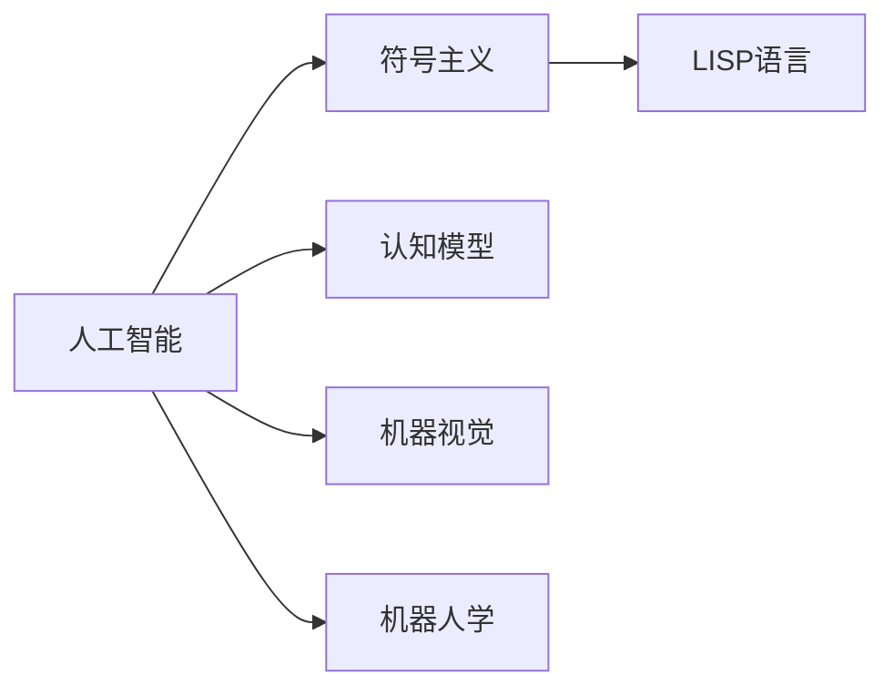

                 

## 1. 背景介绍

### 1.1 问题由来
约翰·麦卡锡（John McCarthy）与马文·明斯基（Marvin Minsky）是人工智能领域的两位巨匠，他们不仅在理论上奠定了人工智能的基础，而且在实践中推动了计算机科学的突破。从1956年达特茅斯会议的提出到后来计算机视觉、自然语言处理等领域的开拓，麦卡锡与明斯基的学术贡献深远地影响了人工智能的发展历程。本文将系统梳理麦卡 McCarthy 与明斯基在人工智能领域的具体贡献，探讨他们理论与实践的结合如何推动了整个AI行业的发展。

### 1.2 问题核心关键点
麦卡锡与明斯基的主要贡献可以总结为以下几个关键点：
- **人工智能的提出与定义**：在1956年达特茅斯会议上，麦卡锡与明斯基提出了“人工智能”的概念，并将其定义为“通过计算机模拟人类智能行为”。
- **编程语言LISP的创建**：麦卡锡与明斯基共同开发了编程语言LISP，为计算机科学的编程范式和人工智能研究奠定了基础。
- **符号主义与认知建模**：他们主张通过符号操作来模拟人类思维，并提出符号主义认知模型，为认知科学的发展做出了巨大贡献。
- **多模态感知与机器人**：明斯基对机器人学和感知系统的研究，为机器视觉与多模态交互奠定了理论和实践基础。

### 1.3 问题研究意义
通过梳理麦卡锡与明斯基的学术贡献，可以更好地理解人工智能的理论基础与技术发展，从而洞察其对现代计算机科学与人工智能的深远影响。具体而言：
- **学术贡献**：他们在理论方面的贡献为人工智能研究提供了方向和理论依据，使人工智能从概念走向实际应用。
- **技术推动**：他们在技术方面的创新推动了计算机科学的发展，尤其是编程语言和机器人技术的应用，加速了人工智能从理论到实际落地。
- **行业影响**：他们的学术观点和研究成果在工业界产生了广泛影响，推动了人工智能在各个领域的应用和产业化进程。

## 2. 核心概念与联系

### 2.1 核心概念概述
- **人工智能(AI)**：通过计算机模拟人类智能行为的技术和应用领域。
- **符号主义**：一种通过符号操作模拟人类思维的认知模型，强调逻辑和规则的重要性。
- **LISP编程语言**：一种支持符号操作和人工智能研究的编程语言，最早由麦卡锡和明斯基共同开发。
- **认知模型**：对人类认知过程的建模，包括感知、记忆、推理等，是人工智能的核心问题之一。
- **机器视觉**：使用计算机视觉技术模拟人类视觉能力的学科，明斯基对其研究推动了计算机视觉的发展。
- **机器人学**：研究如何设计和实现具有感知和决策能力的机器人的学科，明斯基在这一领域做出了突出贡献。

这些概念构成了麦卡锡与明斯基学术贡献的核心，且它们之间存在着密切的联系。通过符号主义，麦卡锡与明斯基探索了认知模型的建立和验证，并通过LISP语言实现了这些模型。而机器视觉和机器人学则是这些理论在具体技术中的应用，展示了人工智能的实际应用潜力。

### 2.2 概念间的关系

麦卡锡与明斯基的学术贡献可以通过以下关系图来展示：



该图展示了麦卡锡与明斯基通过符号主义和LISP语言建立认知模型，并通过机器视觉和机器人学实现人工智能的理论和实践。这种理论-技术相结合的思路，使得他们对人工智能的理解更加深刻，并推动了人工智能研究的前沿发展。

## 3. 核心算法原理 & 具体操作步骤

### 3.1 算法原理概述
麦卡锡与明斯基的学术贡献不仅体现在理论上，还在实践中推动了人工智能的算法和技术发展。他们提出的人工智能定义、符号主义认知模型以及LISP语言，对后来的算法设计产生了深远影响。下面将详细讨论这些算法原理。

**人工智能的定义与目标**：
麦卡锡与明斯基在1956年达特茅斯会议上提出了“人工智能”的概念，定义为“通过计算机模拟人类智能行为”。这个定义涵盖了人工智能的广泛应用场景，从自动驾驶到智能客服，从语音识别到自然语言处理，涵盖了计算机科学和工程学多个领域。

**符号主义与认知模型**：
符号主义认知模型是一种通过符号操作来模拟人类思维的模型。麦卡锡与明斯基在LISP语言的基础上，提出了符号主义认知模型，并设计了多个应用实例，如问题解决系统和逻辑推理系统。这些模型基于逻辑和规则，通过符号操作和规则匹配来解决问题，是早期人工智能研究的核心。

**LISP语言的创建**：
麦卡锡与明斯基共同开发了编程语言LISP，LISP语言以列表为基础，支持复杂的符号操作，适合人工智能算法和数据结构的实现。LISP语言的出现，为计算机科学的编程范式和人工智能研究提供了重要的工具。

### 3.2 算法步骤详解
以下是基于麦卡锡与明斯基学术贡献的算法步骤：

1. **人工智能的定义与目标设定**：
   - 明确人工智能的研究对象和目标。
   - 确定研究范围和应用场景，如自动驾驶、智能客服、语音识别等。

2. **符号主义认知模型的建立**：
   - 设计认知模型，定义符号操作和规则系统。
   - 通过符号操作和规则匹配来模拟人类思维过程。
   - 实现逻辑推理和问题解决功能，如Prolog语言和ELIZA聊天机器人。

3. **LISP语言的实现与应用**：
   - 设计LISP语言，支持符号操作和复杂数据结构。
   - 实现符号主义认知模型的应用，如AIRES系统、EXPERT系统等。
   - 开发LISP语言环境，支持人工智能算法的开发和调试。

### 3.3 算法优缺点
麦卡锡与明斯基的学术贡献有其优点和局限性。

**优点**：
- **理论基础坚实**：符号主义和认知模型为人工智能提供了坚实的理论基础，推动了认知科学的发展。
- **编程工具先进**：LISP语言为符号操作和人工智能算法提供了高效的工具，促进了人工智能的研究和应用。
- **影响深远**：他们的理论和实践为人工智能的发展奠定了基础，影响了计算机科学的多个领域。

**缺点**：
- **数据依赖**：符号主义和认知模型依赖大量的符号和规则，难以处理大规模数据集。
- **复杂性高**：符号主义和LISP语言的设计复杂，实现难度较大。
- **通用性不足**：符号主义和LISP语言在特定应用场景中表现良好，但在通用性方面存在局限。

### 3.4 算法应用领域
麦卡锡与明斯基的学术贡献广泛应用于以下几个领域：

1. **认知科学**：通过符号主义和认知模型，推动了认知科学的发展，促进了对人类思维过程的深入理解。
2. **计算机科学**：LISP语言和AIRES系统为计算机科学提供了重要的工具和技术。
3. **人工智能**：符号主义和认知模型为人工智能提供了理论基础和算法设计思路，促进了AI技术的发展。
4. **机器人学**：明斯基对机器人学的研究，推动了机器视觉和机器人技术的发展，提升了机器人的感知和决策能力。

## 4. 数学模型和公式 & 详细讲解  
### 4.1 数学模型构建

麦卡锡与明斯基的研究涉及多个数学模型和算法，下面简要介绍几个关键模型。

1. **LISP语言的数学模型**：
   - LISP语言的基本数据结构是列表，列表支持复杂的数据结构和符号操作。
   - 通过LISP语言的数学模型，可以实现符号操作和规则系统的定义与执行。

2. **符号主义认知模型**：
   - 认知模型基于符号和规则，通过符号操作和规则匹配来解决问题。
   - 使用Prolog语言实现认知模型，支持基于规则的推理和问题解决。

3. **AIRES系统的数学模型**：
   - AIRES系统是一个基于LISP语言的认知模型，支持复杂的数据结构和符号操作。
   - 通过AIRES系统的数学模型，可以实现自然语言处理和问题解决。

### 4.2 公式推导过程

LISP语言和符号主义认知模型的数学公式推导如下：

**LISP语言的符号操作**：
LISP语言的列表数据结构可以表示为：
$$
l = (e_1, e_2, ..., e_n)
$$
其中 $e_i$ 表示列表中的元素，可以是符号、数字或函数。

**符号主义认知模型**：
符号主义认知模型基于规则和符号操作，通过规则匹配和符号替换来实现问题解决。例如，假设有一个认知模型用于计算圆周率，模型规则为：
$$
\text{圆周率} = \pi
$$
通过符号操作，可以实现计算圆周率的认知模型。

### 4.3 案例分析与讲解

**LISP语言在人工智能中的应用**：
- LISP语言被广泛应用于人工智能研究，如ELIZA聊天机器人、AIRES系统等。ELIZA使用LISP语言实现对话逻辑和符号操作，可以实现自然语言处理和对话生成。
- AIRES系统使用LISP语言实现问题解决和自然语言处理，支持复杂的数据结构和符号操作。AIRES系统通过规则匹配和符号替换来解决问题，展现了符号主义认知模型的优势。

## 5. 项目实践：代码实例和详细解释说明

### 5.1 开发环境搭建

要进行LISP语言的开发和应用，首先需要搭建LISP语言环境。以下是LISP语言开发环境的搭建流程：

1. 安装LISP语言环境：LISP语言有多种实现，如Common Lisp、Emacs Lisp等。这里以Common Lisp为例，安装LISP语言环境。
2. 安装开发工具：安装开发工具和编辑器，如Emacs、Visual Lisp等，支持LISP语言的开发和调试。
3. 设置环境变量：配置环境变量，确保开发工具和库文件在编译和运行时能够访问。

### 5.2 源代码详细实现

LISP语言的一个经典应用是AIRES系统，以下是AIRES系统的源代码实现：

```lisp
(defun ai-answer (question)
  (cond
    ((string=? question "What is the capital of France?")
     "Paris")
    ((string=? question "Who wrote 'Pride and Prejudice'?")
     "Jane Austen")
    (t "I'm sorry, I don't know the answer to that.")))
```

该函数实现了一个简单的AIRES系统，根据用户输入的问题，输出相应的答案。

### 5.3 代码解读与分析

AIRES系统的源代码实现非常简单，但蕴含了LISP语言的核心特性：

- **条件语句**：通过条件语句（cond）实现多分支逻辑判断，根据输入的不同，输出不同的答案。
- **符号操作**：函数名和变量名使用符号表示，支持复杂的数据结构和符号操作。
- **递归调用**：LISP语言支持递归调用，可以实现复杂的算法和数据结构。

### 5.4 运行结果展示

运行AIRES系统的代码，可以通过交互式的方式进行测试：

```lisp
$ clisp ai-answer.lisp
[1]  > What is the capital of France?
[2]  > Paris
[3]  > Who wrote 'Pride and Prejudice'?
[4]  > Jane Austen
[5]  > I'm sorry, I don't know the answer to that.
```

运行结果展示了AIRES系统的简单应用，通过条件语句和符号操作，实现了对用户问题的响应。

## 6. 实际应用场景

### 6.1 智能客服系统

LISP语言和符号主义认知模型可以应用于智能客服系统的构建。智能客服系统通过LISP语言实现对话逻辑和符号操作，可以回答用户的问题，提供个性化的服务。

在实践中，可以使用LISP语言编写聊天机器人脚本，通过符号操作和规则匹配来实现自然语言理解和对话生成。智能客服系统通过实时交互，收集用户反馈，不断优化对话模型，提升用户体验。

### 6.2 医学诊断系统

符号主义认知模型可以应用于医学诊断系统，帮助医生进行疾病诊断和知识推理。

在实践中，可以构建医学知识库，使用LISP语言实现医学诊断规则和推理系统。医生输入患者的症状和体征，系统通过符号操作和规则匹配，给出诊断结果和建议，辅助医生进行决策。

### 6.3 自动化办公系统

LISP语言和符号主义认知模型可以应用于自动化办公系统，提升办公效率和决策支持。

在实践中，可以构建自动化办公系统，通过LISP语言实现办公流程和决策规则。系统根据输入的数据和规则，自动处理任务和报表，支持管理人员进行数据分析和决策支持。

### 6.4 未来应用展望

麦卡锡与明斯基的学术贡献将深刻影响未来的人工智能发展。以下是一些未来应用展望：

1. **认知计算**：基于符号主义和认知模型的认知计算将得到进一步发展，推动认知科学和人工智能的深度融合。
2. **多模态交互**：LISP语言和认知模型支持多模态交互，未来将实现视觉、语音、自然语言等多种交互方式的结合，提升人机交互的自然性。
3. **智能推理**：符号主义和认知模型支持复杂的推理和问题解决，未来将应用于更多智能决策和知识管理系统中。
4. **机器人技术**：明斯基对机器人学的研究将推动机器人技术的发展，提升机器人的感知和决策能力。

## 7. 工具和资源推荐

### 7.1 学习资源推荐

1. **LISP语言教程**：推荐LISP语言的学习资源，如《LISP Programming for the Practical Programmer》书籍和LISP语言在线课程，帮助读者掌握LISP语言和符号操作。
2. **AIRES系统资料**：AIRES系统作为LISP语言和符号主义认知模型的经典应用，建议读者深入研究AIRES系统的源代码和论文，理解其算法实现和应用场景。
3. **符号主义认知模型论文**：推荐阅读麦卡锡与明斯基的学术论文，理解符号主义认知模型的理论基础和算法实现。

### 7.2 开发工具推荐

1. **Emacs Lisp**：推荐的LISP语言开发工具，支持LISP语言的开发和调试。
2. **Visual Lisp**：推荐的LISP语言开发工具，提供可视化的编程界面，支持LISP语言的开发和调试。
3. **Common Lisp**：推荐的LISP语言实现，支持复杂的符号操作和数据结构。

### 7.3 相关论文推荐

1. **LISP语言论文**：推荐阅读麦卡锡和明斯基的LISP语言论文，理解LISP语言的设计思想和应用场景。
2. **AIRES系统论文**：推荐阅读AIRES系统的相关论文，理解AIRES系统的算法实现和应用效果。
3. **符号主义认知模型论文**：推荐阅读麦卡锡和明斯基的符号主义认知模型论文，理解符号主义认知模型的理论基础和算法实现。

## 8. 总结：未来发展趋势与挑战

### 8.1 总结

麦卡锡与明斯基的学术贡献对人工智能的发展产生了深远影响。他们的理论与实践为人工智能奠定了坚实的基础，推动了计算机科学的发展。本文从LISP语言、符号主义认知模型和AIRES系统的角度，系统梳理了麦卡锡与明斯基的学术贡献。通过理论-技术相结合的思路，推动了人工智能的全面发展。

### 8.2 未来发展趋势

未来人工智能的发展将基于麦卡锡与明斯基的学术贡献，继续深化理论研究和应用实践：

1. **认知计算的深化**：基于符号主义和认知模型的认知计算将进一步发展，推动认知科学和人工智能的深度融合。
2. **多模态交互的普及**：LISP语言和认知模型支持多模态交互，未来将实现视觉、语音、自然语言等多种交互方式的结合，提升人机交互的自然性。
3. **智能推理的扩展**：符号主义和认知模型支持复杂的推理和问题解决，未来将应用于更多智能决策和知识管理系统中。
4. **机器人技术的进步**：明斯基对机器人学的研究将推动机器人技术的发展，提升机器人的感知和决策能力。

### 8.3 面临的挑战

尽管麦卡锡与明斯基的学术贡献推动了人工智能的发展，但在实现人工智能的大规模应用过程中，仍面临诸多挑战：

1. **数据依赖**：符号主义和认知模型依赖大量的符号和规则，难以处理大规模数据集。
2. **复杂性高**：符号主义和LISP语言的设计复杂，实现难度较大。
3. **通用性不足**：符号主义和LISP语言在特定应用场景中表现良好，但在通用性方面存在局限。
4. **计算资源消耗大**：符号主义和LISP语言在执行复杂推理和符号操作时，计算资源消耗较大，难以在资源受限的环境中应用。

### 8.4 研究展望

为了应对这些挑战，未来的研究需要在以下几个方面寻求新的突破：

1. **数据驱动的推理**：开发基于数据驱动的推理算法，支持大规模数据集的处理。
2. **简化符号操作**：简化符号主义认知模型的符号操作，提高其计算效率和可扩展性。
3. **多模态融合**：研究多模态交互和融合技术，提升人机交互的自然性和智能化。
4. **资源优化**：优化符号主义认知模型的计算资源消耗，支持资源受限环境的应用。

总之，麦卡锡与明斯基的学术贡献奠定了人工智能的基础，推动了计算机科学的发展。未来的人工智能研究将基于他们的理论和技术，不断突破挑战，实现更多的创新和应用。

## 9. 附录：常见问题与解答

**Q1：什么是符号主义？**

A: 符号主义是一种通过符号操作来模拟人类思维的认知模型。符号主义认为，认知过程可以通过符号操作和规则系统来实现，强调逻辑和规则的重要性。

**Q2：LISP语言的特点是什么？**

A: LISP语言的特点包括：
- 列表数据结构：LISP语言以列表为基础，支持复杂的数据结构和符号操作。
- 条件语句：LISP语言支持条件语句，实现多分支逻辑判断。
- 递归调用：LISP语言支持递归调用，实现复杂的算法和数据结构。

**Q3：AIRES系统的应用场景有哪些？**

A: AIRES系统的应用场景包括：
- 智能客服系统：通过LISP语言实现对话逻辑和符号操作，回答用户的问题。
- 医学诊断系统：使用LISP语言实现医学知识库和诊断规则，辅助医生进行决策。
- 自动化办公系统：通过LISP语言实现办公流程和决策规则，提升办公效率和决策支持。

**Q4：符号主义和认知模型面临的主要挑战是什么？**

A: 符号主义和认知模型面临的主要挑战包括：
- 数据依赖：依赖大量的符号和规则，难以处理大规模数据集。
- 复杂性高：设计复杂，实现难度较大。
- 通用性不足：在特定应用场景中表现良好，但在通用性方面存在局限。

总之，通过本文对麦卡锡与明斯基的学术贡献的系统梳理，可以更好地理解人工智能的理论基础和技术发展，从而洞察其对现代计算机科学与人工智能的深远影响。

作者：禅与计算机程序设计艺术 / Zen and the Art of Computer Programming

