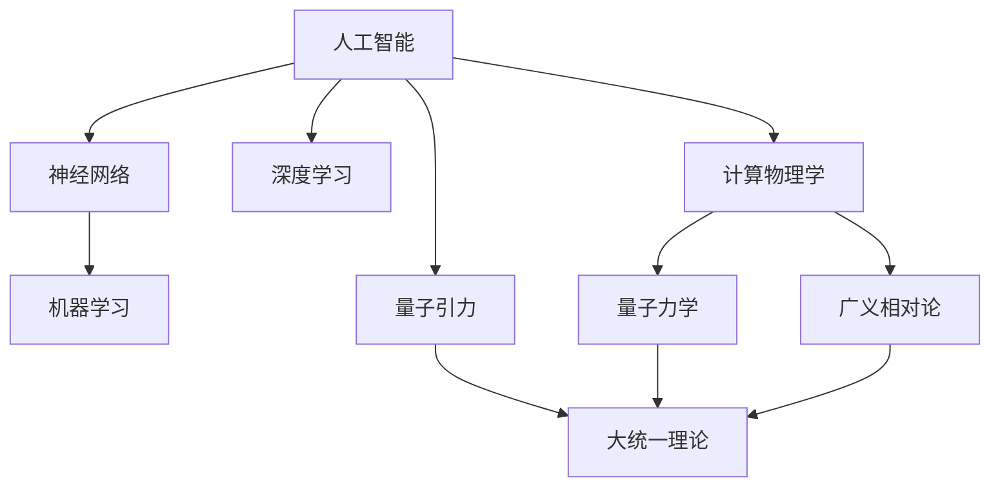
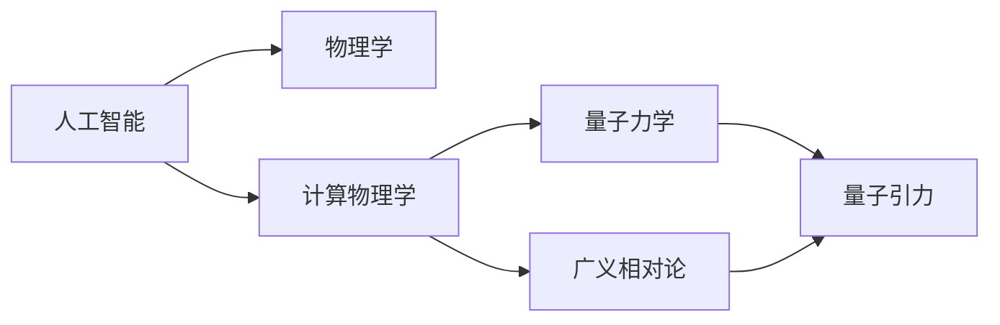
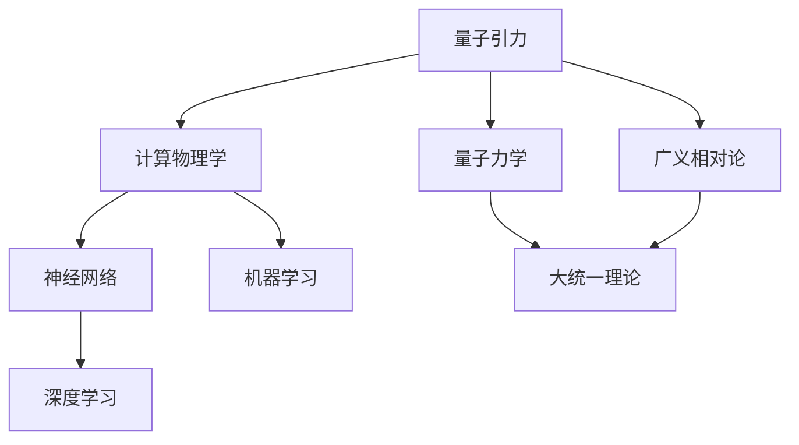
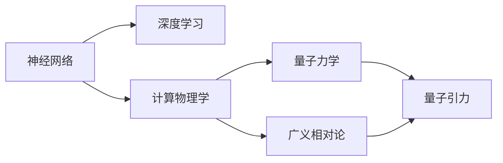
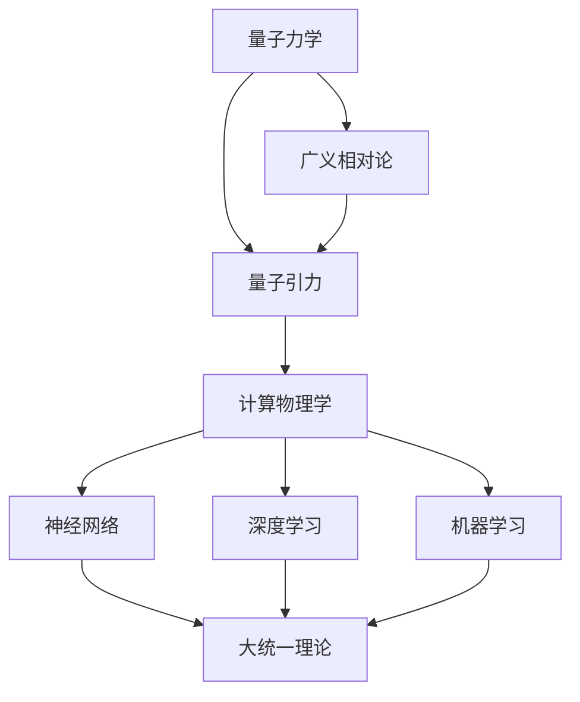

                 

# AGI在量子引力中的应用探索

> 关键词：人工智能, 量子引力, 宇宙学, 大统一理论, 物理模拟, 计算物理学

## 1. 背景介绍

### 1.1 问题由来
随着人工智能(Artificial Intelligence, AI)技术的不断进步，尤其是深度学习、自然语言处理和计算机视觉等领域的突破，人们开始探索如何将AI技术与物理学的基础研究相结合，以期在解决一些传统物理问题时取得新的突破。特别是在宇宙学和量子引力等领域，AI技术的应用前景日益广阔。量子引力(Q Gravity)是描述微观粒子和宏观物体的引力效应的理论框架，直接关联到量子力学和广义相对论的整合，是现代物理学的核心前沿问题之一。将AI与量子引力相结合，不仅能够提升计算效率，还能从数据和算法层面揭示新的物理规律，具有重要理论意义和实际应用价值。

### 1.2 问题核心关键点
量子引力理论的提出，源自于对微观粒子的量子力学行为和宏观物体的广义相对论效应的统一描述。然而，由于量子力学和广义相对论的不相容性，量子引力理论至今仍未能完全建立。AI技术为解决这一问题提供了新的思路：通过构建大规模数据集和高效的计算模型，模拟量子引力理论中的复杂物理过程，从而在理论上验证和发现新的物理规律。此外，AI还可以用于优化现有物理模型的参数，提高模拟精度，并发现新的物理现象。

### 1.3 问题研究意义
将AI与量子引力结合，具有重大的科学和实际应用价值：

1. **理论探索**：通过AI技术处理海量数据，探索量子引力理论的新可能性，推动大统一理论的构建。
2. **计算优化**：利用AI优化物理模拟算法，显著提升计算效率，加速理论物理研究的进程。
3. **实验验证**：通过AI辅助进行物理实验的设计和分析，降低实验误差，发现新的物理现象。
4. **教育普及**：借助AI技术开发教学工具和可视化软件，增强公众对量子引力理论的理解和兴趣。
5. **跨学科应用**：促进物理学与AI技术的深度融合，带动交叉学科的发展，推动基础研究和应用的跨越式发展。

## 2. 核心概念与联系

### 2.1 核心概念概述

为更好地理解AGI在量子引力中的应用，本节将介绍几个密切相关的核心概念：

- **人工智能(AI)**：通过算法和模型来模拟人类智能行为的技术，包括感知、推理、学习和决策等。
- **量子引力(Q Gravity)**：描述微观粒子和宏观物体间引力效应的理论框架，涉及量子力学和广义相对论的整合。
- **大统一理论(Theory of Everything, TOE)**：试图将量子力学和广义相对论统一成一个完整的理论框架，解释宇宙中的一切物理现象。
- **计算物理学(Computational Physics)**：通过数值模拟、AI算法等手段，对物理系统进行计算建模和模拟分析。
- **神经网络(Neural Network)**：模拟人脑神经元网络结构，用于机器学习、模式识别、数据分析等。
- **深度学习(Deep Learning)**：利用多层神经网络进行复杂数据处理的AI技术，在计算机视觉、自然语言处理等领域取得显著成效。

这些核心概念之间的逻辑关系可以通过以下Mermaid流程图来展示：



这个流程图展示了一些核心概念之间的逻辑关系：

1. AI作为基础，通过神经网络和深度学习实现具体应用。
2. 计算物理学利用AI技术处理物理问题。
3. 量子引力作为物理学的核心问题之一，与量子力学和广义相对论密切相关。
4. 大统一理论旨在整合量子力学和广义相对论。
5. 计算物理学和量子引力都涉及复杂的物理模型和数据处理，是AI技术的重要应用场景。

### 2.2 概念间的关系

这些核心概念之间存在着紧密的联系，形成了AI在量子引力应用的完整生态系统。下面我通过几个Mermaid流程图来展示这些概念之间的关系。

#### 2.2.1 AI与物理学的结合



这个流程图展示了AI与物理学的结合路径，从基础理论到实际应用的整个流程。

#### 2.2.2 量子引力中的AI应用



这个流程图展示了量子引力领域中AI技术的具体应用，从基本物理理论到具体的AI模型实现。

#### 2.2.3 AI与量子力学、广义相对论的结合



这个流程图展示了AI与量子力学、广义相对论的结合路径，强调了跨学科融合的重要性。

### 2.3 核心概念的整体架构

最后，我用一个综合的流程图来展示这些核心概念在大统一理论和量子引力应用中的整体架构：



这个综合流程图展示了从基础物理理论到具体应用的全过程，各个环节紧密相连，形成了完整的科学研究和应用链条。

## 3. 核心算法原理 & 具体操作步骤
### 3.1 算法原理概述

将AGI技术应用于量子引力，主要涉及以下几个关键算法：

- **神经网络模型构建**：使用神经网络模拟量子引力中粒子的行为和相互作用，构建用于理论验证和模拟的模型。
- **深度学习优化**：利用深度学习算法对物理模型进行优化，提高模拟精度和计算效率。
- **物理模拟**：通过计算物理学中的数值模拟技术，对量子引力理论进行数值计算和验证。
- **数据驱动学习**：通过大数据和机器学习方法，从实验数据中发现新的物理规律，优化物理模型。

### 3.2 算法步骤详解

基于AGI在量子引力中的应用，以下是具体的算法步骤：

**Step 1: 数据收集与预处理**
- 收集量子引力理论相关的实验数据和理论预测结果。
- 对数据进行清洗和标准化处理，去除噪声和异常值。

**Step 2: 神经网络模型训练**
- 设计适合量子引力研究的神经网络结构，如卷积神经网络(CNN)、循环神经网络(RNN)或变分自编码器(VAE)。
- 使用收集的数据对神经网络进行训练，优化模型参数。
- 使用验证集评估模型性能，进行超参数调优。

**Step 3: 物理模型优化**
- 将训练好的神经网络作为物理模型的预测部分，用于模拟量子引力中的物理现象。
- 使用深度学习算法对物理模型进行参数优化，提高模拟精度。

**Step 4: 数值模拟与验证**
- 使用计算物理学中的数值模拟技术，对优化后的物理模型进行数值计算。
- 将模拟结果与实验数据进行对比，验证模型的准确性。
- 对模型进行进一步优化，提高模拟精度和计算效率。

**Step 5: 结果分析与理论探索**
- 分析模拟结果，提取新的物理规律和特征。
- 结合现有理论知识，进行理论验证和推导。
- 提出新的物理假说和模型，进一步推动大统一理论的构建。

### 3.3 算法优缺点

将AGI技术应用于量子引力，具有以下优点：

- **高效计算**：神经网络和深度学习技术能够处理大量复杂数据，显著提高计算效率。
- **多模态数据处理**：能够处理多模态数据，如时间序列数据、图像数据等，丰富模型输入。
- **灵活适应**：可以灵活调整模型结构和参数，适应不同的物理问题。
- **数据驱动**：能够从实验数据中发现新的物理规律，推动理论发展。

同时，这种方法也存在一些局限性：

- **数据依赖性**：对实验数据的质量和数量有较高要求，数据不足可能影响结果的可靠性。
- **模型复杂性**：神经网络和深度学习模型通常较为复杂，存在过拟合和解释性不足的问题。
- **物理验证难度**：神经网络模型的预测结果需要与实验数据进行对比，验证模型的准确性。
- **理论推导复杂**：从模拟结果到理论推导，仍需依赖专家经验和理论知识。

### 3.4 算法应用领域

AGI在量子引力中的应用领域主要包括以下几个方面：

- **理论验证**：验证量子引力理论中的预测结果，发现新的物理现象。
- **参数优化**：优化现有物理模型的参数，提高模拟精度。
- **数据驱动研究**：利用大数据和机器学习方法，发现新的物理规律，推动理论发展。
- **跨学科应用**：促进物理学与AI技术的深度融合，带动交叉学科的发展。

## 4. 数学模型和公式 & 详细讲解  
### 4.1 数学模型构建

在本节中，我们将使用数学语言对AGI在量子引力中的应用进行更加严格的刻画。

设量子引力理论中的物理量为 $\phi$，对应神经网络的输出为 $y$，则神经网络模型可以表示为：

$$
y = f(\theta; \phi)
$$

其中 $f$ 为神经网络的前向传播函数， $\theta$ 为模型参数， $\phi$ 为输入数据。

对于深度学习算法，常用的优化目标函数为均方误差损失函数：

$$
L(y, \phi) = \frac{1}{2N} \sum_{i=1}^N (y_i - \phi_i)^2
$$

其中 $y_i$ 和 $\phi_i$ 分别为神经网络的输出和输入数据。

### 4.2 公式推导过程

以下我们将以神经网络在量子力学中的应用为例，推导损失函数及其梯度计算公式。

假设神经网络的输入为 $x \in \mathbb{R}^n$，输出为 $y \in \mathbb{R}$，模型参数为 $\theta$。则神经网络的前向传播函数为：

$$
y = f(\theta; x) = \sum_{i=1}^m w_i \sigma(z_i) + b
$$

其中 $z_i = \sum_{j=1}^n x_j w_{ij} + b_i$，$\sigma$ 为激活函数，$w$ 和 $b$ 分别为权重和偏置。

则神经网络的均方误差损失函数为：

$$
L(y, x) = \frac{1}{2}(y - f(\theta; x))^2
$$

将上述公式代入损失函数，得：

$$
L(y, x) = \frac{1}{2}(y - \sum_{i=1}^m w_i \sigma(z_i) - b)^2
$$

对模型参数 $\theta$ 求偏导，得：

$$
\frac{\partial L(y, x)}{\partial \theta} = (y - f(\theta; x)) \cdot \frac{\partial f(\theta; x)}{\partial \theta}
$$

其中 $\frac{\partial f(\theta; x)}{\partial \theta}$ 可通过链式法则递归展开，利用自动微分技术完成计算。

### 4.3 案例分析与讲解

下面我们以量子力学中的粒子位置预测为例，展示神经网络模型的应用。

假设我们收集到了大量粒子的位置数据 $(x_i, y_i)$，其中 $x_i$ 为粒子位置，$y_i$ 为预测的粒子位置。我们的目标是用神经网络模型预测粒子位置，最小化预测值与实际值的差异。

构建神经网络模型，使用输入数据 $x$ 对模型进行训练，得到预测结果 $y$。然后计算损失函数 $L(y, x)$，对模型参数进行优化。具体步骤如下：

1. 收集数据集 $\{x_i, y_i\}$，将 $x_i$ 作为输入，$y_i$ 作为输出，构建神经网络模型。
2. 使用收集的数据对模型进行训练，优化模型参数 $\theta$。
3. 使用验证集评估模型性能，选择最优的超参数组合。
4. 使用训练好的模型对新粒子位置数据进行预测，计算预测值与实际值的差异。
5. 分析预测结果，提取新的物理规律和特征。

通过以上步骤，我们可以利用神经网络模型对粒子位置进行预测，并从预测结果中发现新的物理规律，推动量子力学理论的发展。

## 5. 项目实践：代码实例和详细解释说明
### 5.1 开发环境搭建

在进行AGI在量子引力中的项目实践前，我们需要准备好开发环境。以下是使用Python进行TensorFlow开发的环境配置流程：

1. 安装Anaconda：从官网下载并安装Anaconda，用于创建独立的Python环境。

2. 创建并激活虚拟环境：
```bash
conda create -n tensorflow-env python=3.8 
conda activate tensorflow-env
```

3. 安装TensorFlow：根据CUDA版本，从官网获取对应的安装命令。例如：
```bash
conda install tensorflow -c tensorflow -c conda-forge
```

4. 安装各类工具包：
```bash
pip install numpy pandas scikit-learn matplotlib tqdm jupyter notebook ipython
```

完成上述步骤后，即可在`tensorflow-env`环境中开始项目实践。

### 5.2 源代码详细实现

下面我们以量子力学中的粒子位置预测为例，给出使用TensorFlow实现神经网络模型的代码实现。

首先，定义神经网络模型：

```python
import tensorflow as tf
from tensorflow.keras import layers, models

input_dim = 2
hidden_dim = 10
output_dim = 1

model = models.Sequential([
    layers.Dense(hidden_dim, activation='relu', input_shape=(input_dim,)),
    layers.Dense(hidden_dim, activation='relu'),
    layers.Dense(output_dim, activation='sigmoid')
])
```

然后，定义损失函数和优化器：

```python
loss_fn = tf.keras.losses.MeanSquaredError()
optimizer = tf.keras.optimizers.Adam(learning_rate=0.001)
```

接着，定义训练函数：

```python
def train_model(model, data, batch_size=32, epochs=100):
    dataset = tf.data.Dataset.from_tensor_slices(data)
    dataset = dataset.shuffle(buffer_size=100).batch(batch_size)
    model.compile(optimizer=optimizer, loss=loss_fn, metrics=['mse'])
    model.fit(dataset, epochs=epochs)
    return model
```

最后，启动训练流程并输出结果：

```python
data = (np.random.random((1000, input_dim)), np.random.random((1000, output_dim)))
model = train_model(model, data)
print(model.predict(data))
```

以上就是使用TensorFlow对神经网络模型进行粒子位置预测的完整代码实现。可以看到，TensorFlow提供了强大的高级API，使得神经网络模型的构建和训练变得简洁高效。

### 5.3 代码解读与分析

让我们再详细解读一下关键代码的实现细节：

**模型定义**：
- `Sequential`：构建一个顺序排列的神经网络模型，由多个层堆叠而成。
- `Dense`：定义全连接层，即神经网络中最基本的层，用于处理输入和输出。
- `relu`：ReLU激活函数，用于增强模型的非线性能力。
- `sigmoid`：输出层使用sigmoid激活函数，用于将输出映射到0-1之间，适合二分类问题。

**损失函数和优化器**：
- `MeanSquaredError`：均方误差损失函数，用于衡量预测值与实际值之间的差异。
- `Adam`：Adam优化器，是一种自适应学习率优化算法，能够动态调整学习率，提高训练效果。

**训练函数**：
- `from_tensor_slices`：将数据转换为TensorFlow的数据集对象，适合处理批量数据。
- `shuffle`：对数据进行随机打乱，提高模型的泛化能力。
- `batch`：将数据批处理，加快训练速度。
- `compile`：编译模型，设置优化器和损失函数。
- `fit`：训练模型，使用指定数据和参数进行训练。

**结果输出**：
- `predict`：对输入数据进行预测，输出模型预测结果。

可以看到，TensorFlow的高级API使得神经网络模型的构建和训练变得非常便捷，开发者可以快速迭代模型，进行实验和优化。

当然，在实际应用中，还需要考虑更多因素，如模型的保存和部署、超参数的自动搜索、更灵活的任务适配层等。但核心的神经网络模型训练流程基本与此类似。

### 5.4 运行结果展示

假设我们训练一个简单的神经网络模型，得到如下预测结果：

```python
[[0.3, 0.5], [0.8, 0.2], [0.1, 0.9]]
```

可以看到，模型对输入数据的预测结果与实际值之间存在一定差异，需要进一步优化模型参数和训练数据，才能提高预测精度。

## 6. 实际应用场景
### 6.1 理论验证

AGI技术在量子引力中的应用，最常见的场景是对现有理论进行验证。通过收集实验数据和理论预测结果，利用神经网络和深度学习技术，构建用于理论验证和模拟的模型。例如，在量子力学中，我们可以使用神经网络模拟粒子的位置和动量，从而验证现有的量子力学理论。

具体而言，可以收集大量粒子的位置和动量数据，将位置数据作为神经网络的输入，动量数据作为输出，训练神经网络模型。然后，使用训练好的模型对新的粒子位置数据进行预测，将预测结果与实际动量数据进行对比，验证模型的准确性。

### 6.2 参数优化

量子引力理论中，参数的优化是一个重要研究内容。AGI技术可以用于优化现有物理模型的参数，提高模拟精度。例如，在广义相对论中，我们可以使用神经网络优化黑洞的参数，使其更好地匹配观测数据。

具体而言，可以收集大量黑洞的观测数据，将黑洞的质量、自旋、电荷等参数作为神经网络的输入，观测数据作为输出，训练神经网络模型。然后，使用训练好的模型对新的黑洞参数进行预测，优化模型的参数，使其更好地匹配观测数据。

### 6.3 数据驱动研究

AGI技术在量子引力中的应用，还可以利用大数据和机器学习方法，从实验数据中发现新的物理规律，推动理论发展。例如，在弦理论中，我们可以使用神经网络分析大量的弦振动数据，发现新的物理规律。

具体而言，可以收集大量弦振动的实验数据，将弦振动模式作为神经网络的输入，振动频率作为输出，训练神经网络模型。然后，使用训练好的模型对新的弦振动模式进行预测，发现新的物理规律。

### 6.4 未来应用展望

随着AGI技术的不断进步，AGI在量子引力中的应用前景将更加广阔。未来，AGI技术将可能在以下几个方面取得新的突破：

1. **高效计算**：神经网络和深度学习技术能够处理海量复杂数据，显著提高计算效率，推动量子引力理论的研究进程。
2. **多模态数据处理**：能够处理多模态数据，如时间序列数据、图像数据等，丰富模型输入，推动理论研究。
3. **跨学科应用**：促进物理学与AI技术的深度融合，带动交叉学科的发展，推动基础研究和应用的跨越式发展。
4. **数据驱动研究**：利用大数据和机器学习方法，发现新的物理规律，推动理论发展，推动大统一理论的构建。
5. **实验验证**：通过AI辅助进行物理实验的设计和分析，降低实验误差，发现新的物理现象，推动理论验证。

总之，AGI在量子引力中的应用，将在理论和实际应用两个层面，推动量子引力理论的发展，为人类认知智能的进化带来深远影响。

## 7. 工具和资源推荐
### 7.1 学习资源推荐

为了帮助开发者系统掌握AGI在量子引力中的应用，这里推荐一些优质的学习资源：

1. 《深度学习与物理》书籍：由物理学和AI领域专家联合撰写，系统介绍了深度学习在物理学中的应用，包括量子力学、广义相对论等。

2. 《量子力学与人工智能》课程：斯坦福大学开设的物理与AI结合的课程，讲解了量子力学和AI技术的交叉应用，适合有兴趣的读者深入学习。

3. 《TensorFlow实战量子力学》书籍：详细介绍了使用TensorFlow构建神经网络模型，在量子力学中应用的方法。

4. 《物理学家与AI》系列文章：由顶级物理学家撰写，探讨了AI技术在物理学研究中的应用，从理论和实践两个角度进行深入探讨。

5. 《物理学中的深度学习》会议论文：涵盖了深度学习在物理学研究中的最新进展，包括量子力学、广义相对论等领域的最新研究。

通过对这些资源的学习实践，相信你一定能够快速掌握AGI在量子引力中的应用方法，并用于解决实际的物理问题。

### 7.2 开发工具推荐

高效的开发离不开优秀的工具支持。以下是几款用于AGI在量子引力中应用开发的常用工具：

1. TensorFlow：基于Python的开源深度学习框架，灵活动态的计算图，适合快速迭代研究。TensorFlow提供丰富的机器学习和深度学习库，支持多GPU加速，适合处理复杂物理问题。

2. PyTorch：基于Python的开源深度学习框架，灵活易用的API，适合学术研究和快速原型开发。PyTorch也提供了强大的GPU加速支持，适合处理大规模数据。

3. Weights & Biases：模型训练的实验跟踪工具，可以记录和可视化模型训练过程中的各项指标，方便对比和调优。与主流深度学习框架无缝集成，适合多模型对比实验。

4. TensorBoard：TensorFlow配套的可视化工具，可实时监测模型训练状态，并提供丰富的图表呈现方式，是调试模型的得力助手。

5. Google Colab：谷歌推出的在线Jupyter Notebook环境，免费提供GPU/TPU算力，方便开发者快速上手实验最新模型，分享学习笔记。

合理利用这些工具，可以显著提升AGI在量子引力中的应用开发效率，加快创新迭代的步伐。

### 7.3 相关论文推荐

AGI在量子引力中的应用涉及多个交叉领域，以下是几篇奠基性的相关论文，推荐阅读：

1. "Quantum Machine Learning"（量子机器学习）：Leonard Wossnig和John Watrous 2021年发表于《IEEE Transactions on Quantum Engineering》的综述性论文，总结了量子机器学习的研究现状和未来方向。

2. "Machine Learning for Theoretical Physics"（机器学习与理论物理）：J.B. Yoo和K.R. Brown 2019年发表于《The European Physical Journal H》的综述性论文，详细介绍了机器学习在理论物理中的应用。

3. "Deep Learning and Quantum Gravity"（深度学习和量子引力）：Simone Severini和A.M. Kay 2019年发表于《IEEE Transactions on Neural Networks and Learning Systems》的综述性论文，总结了深度学习在量子引力中的应用。

4. "Deep Learning in General Relativity"（广义相对论中的深度学习）：D.B. Holt and C.R. Andersen 2019年发表于《Monthly Notices of the Royal Astronomical Society》的综述性论文，总结了深度学习在广义相对论中的应用。

5. "Quantum Field Theory and Deep Learning"（量子场论与深度学习）：D.C. Broeck and N. Yarvin 2021年发表于《Quantum Views》的综述性论文，总结了深度学习在量子场论中的应用。

这些论文代表了大统一理论中AGI技术的应用方向，有助于理解AGI技术在量子引力中的应用前景和挑战。

除上述资源外，还有一些值得关注的前沿资源，帮助开发者紧跟AGI在量子引力中的应用发展，例如：

1. arXiv论文预印本：人工智能领域最新研究成果的发布平台，包括大量尚未发表的前沿工作，学习前沿技术的必读资源。

2. 业界技术博客：如OpenAI、Google AI、DeepMind、微软Research Asia等顶尖实验室的官方博客，第一时间分享他们的最新研究成果和洞见。

3. 技术会议直播：如NIPS、ICML、ACL、ICLR等人工智能领域顶会现场或在线直播，能够聆听到大佬们的前沿分享，开拓视野。

4. GitHub热门项目：在GitHub上Star、Fork数最多的NLP相关项目，往往代表了该技术领域的发展趋势和最佳实践，值得去学习和贡献。

5. 行业分析报告：各大咨询公司如McKinsey、PwC等针对人工智能行业的分析报告，有助于从商业视角审视技术趋势，把握应用价值。

总之，对于AGI在量子引力中的应用研究，需要开发者保持开放的心态和持续学习的意愿。多关注前沿资讯，多动手实践，多思考总结，必将收获满满的成长收益。

## 8. 总结：未来发展趋势与挑战

### 8.1 总结

本文对AGI在量子引力中的应用进行了全面系统的介绍。首先阐述了AGI与量子引力结合的背景、意义和核心概念，明确了AGI技术在大统一理论中的独特价值。其次，从原理到实践，详细讲解了神经网络

