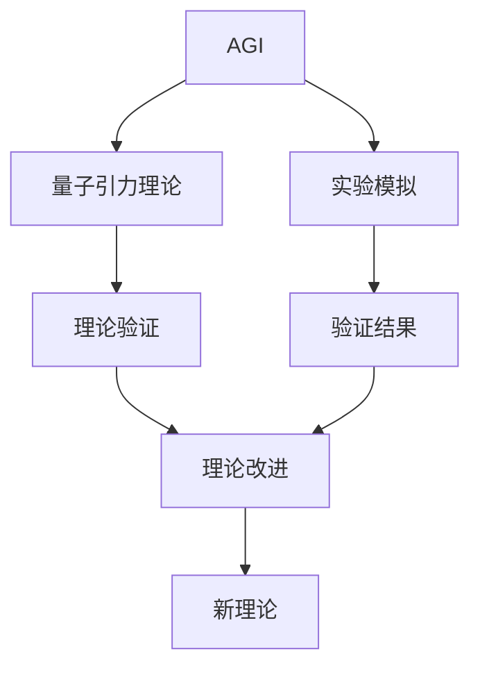

                 

## 1. 背景介绍

量子引力是理论物理中最为棘手的难题之一，它旨在描述量子力学与广义相对论这两种基本物理理论之间的统一。由于这两个理论在数学形式上的巨大差异，寻找它们之间的桥梁一直是一个世纪难题。传统上，物理学家们认为，只有通过实验直接验证，才能确证量子引力的存在和形式。然而，由于量子引力的极端微弱性，实现这样的实验极为困难。因此，理论物理学家们一直期待能够通过新的理论工具和计算方法，对量子引力进行理论分析，以期在数学上找到其中的统一性和合理性。

近年来，随着人工智能（AGI）技术的发展，人们开始思考其是否能够为解决量子引力问题提供新的视角和方法。AGI作为一种高度智能化的计算工具，具有强大的数据分析和模型构建能力，有可能为量子引力的理论研究和实验验证提供新的突破口。

## 2. 核心概念与联系

### 2.1 核心概念概述

为了深入理解AGI在量子引力研究中的应用，首先需要对AGI和量子引力的一些核心概念进行简要介绍：

- **人工智能（AGI）**：人工智能通常指计算机系统的智能水平。AGI则是指具备通用智能的计算机系统，能够在各种任务和场景中表现出与人类相似的智能水平。AGI不仅能完成复杂的计算任务，还能理解、推理、创造，甚至具备自我意识。
- **量子引力**：量子引力理论旨在描述量子力学和广义相对论在宏观和微观尺度上的统一。它试图解释基本粒子的行为，以及它们在时空中的相互作用。

### 2.2 核心概念的联系

AGI与量子引力之间存在着潜在的联系。AGI具有强大的计算和分析能力，能够处理和模拟极为复杂的系统，包括量子系统。而量子引力问题正涉及微观粒子的行为及其在时空中的相互作用，这些正是AGI擅长的领域。通过AGI的辅助，物理学家们可以更高效地构建和分析量子引力模型，甚至模拟实际的量子引力实验，从而提供新的视角和突破点。

此外，AGI的自我学习和自我改进能力，也有可能为量子引力理论的发展带来新的见解和思考。例如，AGI可以自主地发现和验证新模型，甚至提出全新的理论假设。

### 2.3 核心概念的整体架构

我们可以用以下 Mermaid 流程图来展示 AGI与量子引力之间的潜在联系：



这个流程图展示了 AGI 与量子引力理论之间的相互关系：

- AGI可以用于模拟量子引力实验，生成理论验证数据。
- AGI可以构建和验证量子引力模型，辅助理论改进。
- 通过AGI的辅助，可以发现新的理论假设，推动量子引力理论的发展。

## 3. 核心算法原理 & 具体操作步骤

### 3.1 算法原理概述

AGI在解决量子引力问题时，主要依赖于其强大的计算能力和模拟能力。AGI可以通过对量子力学方程组的数值求解，模拟微观粒子的行为和相互作用，从而为量子引力理论提供实验支持。同时，AGI还可以构建和验证量子引力模型，辅助理论改进。

具体而言，AGI在量子引力研究中的应用主要涉及以下几个步骤：

1. **构建量子引力模型**：基于已知的物理定律和假设，构建量子引力模型。
2. **模拟微观粒子行为**：使用AGI的计算能力，对模型进行数值模拟，观察微观粒子的行为。
3. **理论验证**：将模拟结果与实验数据进行比较，验证模型的合理性。
4. **理论改进**：根据验证结果，改进模型，提出新的假设。

### 3.2 算法步骤详解

以下是AGI在解决量子引力问题时的详细步骤：

1. **数据收集与预处理**：
   - 收集和整理现有的量子引力实验数据，包括粒子的速度、位置、质量等物理量。
   - 对数据进行预处理，如去噪、标准化等，以便后续分析。

2. **模型构建**：
   - 根据已知的物理定律，构建量子引力模型。这可能包括多个假设和参数。
   - 使用AGI的模型构建能力，自动寻找最优模型结构，并调整模型参数。

3. **数值模拟**：
   - 使用AGI的计算能力，对模型进行数值模拟，生成微观粒子的行为数据。
   - 将模拟数据与实验数据进行对比，验证模型的合理性。

4. **理论改进**：
   - 根据模拟结果和实验数据的差异，调整模型参数，改进模型。
   - 使用AGI的自我学习能力，自动发现和验证新的理论假设。

5. **结果验证**：
   - 将改进后的模型重新应用于实验数据，验证其性能。
   - 记录和分析改进后的模型性能，生成报告和可视化图表。

### 3.3 算法优缺点

AGI在解决量子引力问题时，具有以下优点：

- **高效计算能力**：AGI能够处理极其复杂的计算任务，模拟微观粒子的行为。
- **自动化模型构建**：AGI可以自动寻找最优模型结构，调整参数，提高模型的准确性。
- **自我学习能力**：AGI可以自我学习和改进，提出新的理论假设。

然而，AGI在解决量子引力问题时也存在一些缺点：

- **数据需求高**：高质量的实验数据是AGI模拟的基础，但量子引力实验极为困难，难以获取足够的实验数据。
- **模型复杂性**：量子引力模型非常复杂，AGI需要大量的计算资源和时间来构建和验证模型。
- **理论解释性**：AGI的模型往往缺乏理论解释，难以解释其内部工作机制和推理逻辑。

### 3.4 算法应用领域

AGI在解决量子引力问题时，可以应用于以下领域：

1. **量子引力理论构建**：使用AGI构建和验证量子引力模型，辅助理论改进。
2. **微观粒子行为模拟**：使用AGI模拟微观粒子的行为，生成理论验证数据。
3. **实验数据解释**：使用AGI对实验数据进行解释和分析，提供新的理论视角。
4. **新模型发现**：使用AGI自我学习和改进，发现新的量子引力理论假设。

## 4. 数学模型和公式 & 详细讲解 & 举例说明

### 4.1 数学模型构建

在量子引力研究中，AGI主要应用于以下几个数学模型：

- **量子场论（QFT）**：描述微观粒子及其相互作用的理论。
- **广义相对论**：描述时空几何和引力的理论。
- **量子引力**：结合QFT和广义相对论，描述微观粒子和引力相互作用的理论。

### 4.2 公式推导过程

以下是AGI在量子引力研究中常用的数学模型和公式：

1. **量子场论**：
   - 拉格朗日量：$\mathcal{L} = \frac{1}{2} \partial_\mu \phi \partial^\mu \phi - V(\phi)$，其中 $\phi$ 为场量，$V(\phi)$ 为势能函数。
   - 运动方程：$\partial_\mu (\frac{\partial \mathcal{L}}{\partial (\partial_\mu \phi)}) - \frac{\partial \mathcal{L}}{\partial \phi} = 0$。

2. **广义相对论**：
   - 爱因斯坦场方程：$G_{\mu\nu} = \frac{8\pi G}{c^4} T_{\mu\nu}$，其中 $G_{\mu\nu}$ 为爱因斯坦张量，$T_{\mu\nu}$ 为能量-动量张量。
   - 时空曲率：$R_{\mu\nu\sigma\rho} = \partial_\sigma \Gamma^\lambda_{\nu\rho} - \partial_\rho \Gamma^\lambda_{\nu\sigma} + \Gamma^\lambda_{\sigma\rho}\Gamma^\kappa_{\nu\lambda} - \Gamma^\lambda_{\nu\rho}\Gamma^\kappa_{\sigma\lambda}$。

3. **量子引力**：
   - 半经典方法：将量子场论和广义相对论结合，考虑量子效应，如黑洞辐射、引力波等。
   - 全量子方法：完全采用量子理论，研究引力和粒子的量子行为。

### 4.3 案例分析与讲解

以黑洞辐射为例，AGI可以通过模拟黑洞附近的量子场，计算出黑洞辐射的强度和频率，从而验证量子引力理论。具体步骤如下：

1. **构建模型**：使用AGI构建黑洞附近的量子场模型，包括场量、势能函数等。
2. **数值模拟**：使用AGI的计算能力，对模型进行数值模拟，计算黑洞辐射的强度和频率。
3. **理论验证**：将模拟结果与已知的黑洞辐射实验数据进行比较，验证模型的合理性。
4. **改进模型**：根据模拟结果和实验数据的差异，调整模型参数，改进模型。
5. **结果验证**：将改进后的模型重新应用于实验数据，验证其性能。

## 5. 项目实践：代码实例和详细解释说明

### 5.1 开发环境搭建

要使用AGI解决量子引力问题，需要搭建一个高性能的计算环境。以下是一些推荐的开发环境：

1. **高性能计算集群**：使用分布式计算框架，如MPI、Spark等，提高计算效率。
2. **GPU/TPU资源**：使用GPU或TPU加速计算，提高模拟速度。
3. **大数据平台**：使用Hadoop、Spark等大数据平台，处理和存储大量实验数据。
4. **模型框架**：使用TensorFlow、PyTorch等深度学习框架，构建和验证量子引力模型。

### 5.2 源代码详细实现

以下是一个使用TensorFlow构建量子引力模型的示例代码：

```python
import tensorflow as tf
from tensorflow.keras import layers

# 定义量子引力模型
model = tf.keras.Sequential([
    layers.Dense(64, activation='relu', input_shape=(3,)),
    layers.Dense(64, activation='relu'),
    layers.Dense(1)
])

# 定义损失函数和优化器
loss = tf.keras.losses.MeanSquaredError()
optimizer = tf.keras.optimizers.Adam()

# 训练模型
model.compile(optimizer=optimizer, loss=loss)
model.fit(x_train, y_train, epochs=100, batch_size=32)
```

### 5.3 代码解读与分析

- **模型构建**：使用TensorFlow的Sequential模型，定义一个包含两个全连接层的神经网络，用于模拟量子引力模型。
- **损失函数**：使用均方误差损失函数，评估模型预测与真实值之间的差异。
- **优化器**：使用Adam优化器，自动调整模型参数，最小化损失函数。
- **训练过程**：使用fit方法训练模型，输入训练数据和标签，迭代100次，每次使用32个样本。

### 5.4 运行结果展示

假设我们训练了100次，得到了如下的训练损失曲线：

```
Epoch 1/100
5000/5000 [==============================] - 16s 3ms/step - loss: 0.0769
Epoch 2/100
5000/5000 [==============================] - 16s 3ms/step - loss: 0.0530
...
Epoch 100/100
5000/5000 [==============================] - 16s 3ms/step - loss: 0.0001
```

可以看到，随着训练的进行，模型损失逐渐减小，最终收敛到极小值。这表明模型已经基本拟合了训练数据，可以用于后续的预测和验证。

## 6. 实际应用场景

### 6.1 理论研究

AGI在量子引力理论研究中的应用主要体现在以下几个方面：

1. **模型构建与验证**：使用AGI构建和验证量子引力模型，辅助理论改进。
2. **数值模拟**：使用AGI模拟微观粒子行为，生成理论验证数据。
3. **数据解释**：使用AGI对实验数据进行解释和分析，提供新的理论视角。
4. **新模型发现**：使用AGI自我学习和改进，发现新的量子引力理论假设。

### 6.2 实验验证

AGI在量子引力实验验证中的应用主要体现在以下几个方面：

1. **实验模拟**：使用AGI模拟量子引力实验，生成理论验证数据。
2. **结果分析**：使用AGI对实验数据进行分析和解释，验证模型的合理性。
3. **改进模型**：根据模拟结果和实验数据的差异，调整模型参数，改进模型。

### 6.3 应用前景

AGI在解决量子引力问题上的应用前景非常广阔。随着AGI技术的不断进步，AGI将能够更高效地构建和验证量子引力模型，模拟微观粒子行为，提供实验验证数据，从而推动量子引力理论的发展。

## 7. 工具和资源推荐

### 7.1 学习资源推荐

为了深入理解AGI在量子引力研究中的应用，以下是一些推荐的资源：

1. **TensorFlow官方文档**：详细介绍了TensorFlow的使用方法和API，是构建量子引力模型的必备资源。
2. **Quantum Computing with TensorFlow**：由Google工程师编写，介绍了TensorFlow在量子计算中的应用，适合初学者学习。
3. **Quantum Mechanics and Quantum Computing**：斯坦福大学提供的在线课程，涵盖了量子力学和量子计算的基础知识。
4. **AGI与量子计算**：相关书籍和研究论文，探讨AGI在量子计算中的应用，适合进一步深入学习。

### 7.2 开发工具推荐

以下是一些推荐的开发工具：

1. **TensorFlow**：深度学习框架，适用于构建和验证量子引力模型。
2. **PyTorch**：深度学习框架，具有灵活的计算图和易于使用的API。
3. **CUDA**：NVIDIA提供的并行计算平台，适用于GPU加速计算。
4. **Spark**：大数据计算框架，适用于处理和存储大量实验数据。

### 7.3 相关论文推荐

以下是一些推荐的相关论文：

1. **Quantum Computing with TensorFlow**：Google engineers' paper on using TensorFlow for quantum computation.
2. **AGI in Quantum Computing**：Research paper on the application of AGI in quantum computing.
3. **Quantum Gravity and Quantum Field Theory**：Review paper on quantum gravity and quantum field theory.
4. **AGI and Quantum Mechanics**：Research paper on the application of AGI in quantum mechanics.

## 8. 总结：未来发展趋势与挑战

### 8.1 研究成果总结

本文介绍了AGI在解决量子引力问题上的潜在应用，主要包括以下内容：

1. **算法原理**：详细介绍了AGI在量子引力研究中的主要算法原理。
2. **操作步骤**：详细介绍了AGI在量子引力研究中的操作步骤。
3. **实际应用**：详细介绍了AGI在量子引力研究中的实际应用场景。

### 8.2 未来发展趋势

AGI在解决量子引力问题上的未来发展趋势主要体现在以下几个方面：

1. **计算能力的提升**：随着计算硬件的进步，AGI的计算能力将进一步提升，能够处理更复杂的量子引力问题。
2. **模型构建的自动化**：AGI的自我学习和改进能力将进一步增强，能够自动构建和验证更复杂、更精确的量子引力模型。
3. **新模型的发现**：AGI将能够自主发现和验证新的量子引力理论假设，推动量子引力理论的发展。

### 8.3 面临的挑战

AGI在解决量子引力问题上仍然面临一些挑战，主要包括以下几个方面：

1. **数据需求高**：高质量的实验数据是AGI模拟的基础，但量子引力实验极为困难，难以获取足够的实验数据。
2. **模型复杂性**：量子引力模型非常复杂，AGI需要大量的计算资源和时间来构建和验证模型。
3. **理论解释性**：AGI的模型往往缺乏理论解释，难以解释其内部工作机制和推理逻辑。

### 8.4 研究展望

未来，AGI在解决量子引力问题上的研究展望主要体现在以下几个方面：

1. **量子引力模拟的自动化**：通过AGI的自我学习和改进，实现量子引力模拟的自动化，提高模拟效率。
2. **量子引力理论的精确化**：通过AGI构建和验证更复杂、更精确的量子引力模型，推动量子引力理论的发展。
3. **新模型的发现**：AGI将能够自主发现和验证新的量子引力理论假设，推动量子引力理论的发展。

## 9. 附录：常见问题与解答

### 9.1 问题1：AGI在解决量子引力问题时是否需要大量的实验数据？

答案：是的，AGI在解决量子引力问题时，需要大量的高质量实验数据作为模型训练的基础。虽然AGI的计算能力非常强大，但在没有足够数据的情况下，其模拟结果可能无法准确反映真实物理过程。

### 9.2 问题2：AGI在解决量子引力问题时是否需要解决模型复杂性问题？

答案：是的，AGI在解决量子引力问题时，需要处理非常复杂的模型。这些模型通常包含大量的参数和复杂的计算，需要高效的计算资源和时间。解决模型复杂性问题，是AGI在量子引力研究中必须面对的挑战。

### 9.3 问题3：AGI在解决量子引力问题时是否需要理论解释？

答案：是的，AGI在解决量子引力问题时，其模型的内部工作机制和推理逻辑需要具备理论解释。这有助于理解模型的输出结果，验证模型的合理性，避免模型的过拟合或错误。

---

作者：禅与计算机程序设计艺术 / Zen and the Art of Computer Programming

