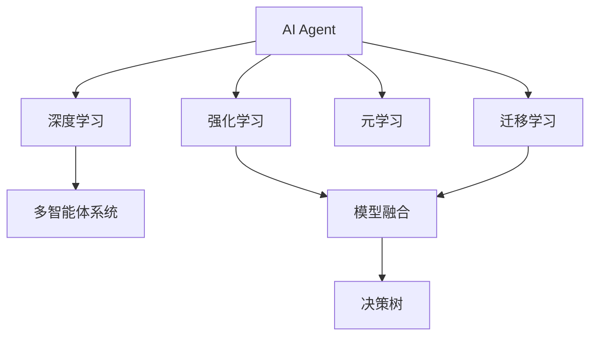
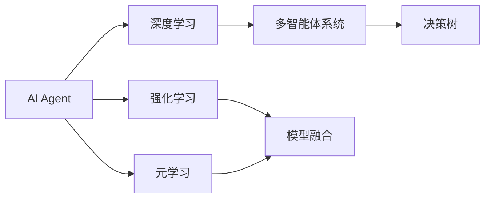
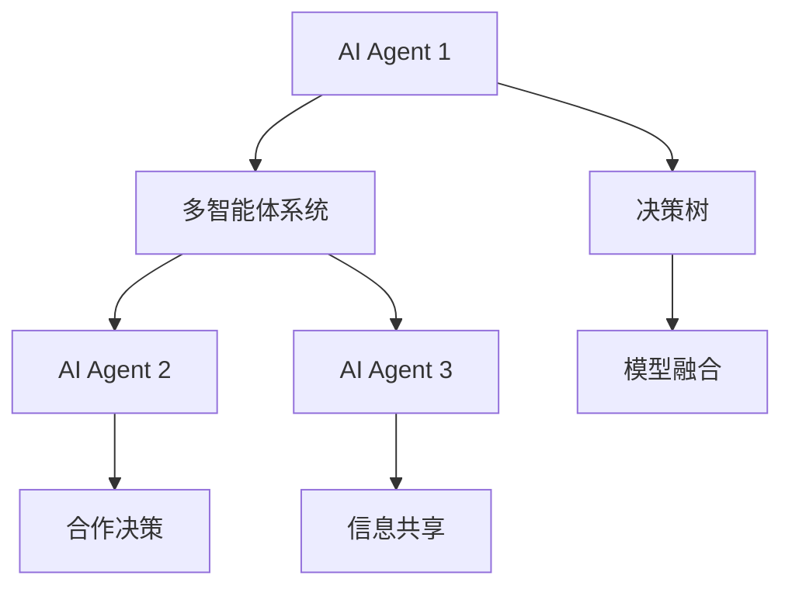
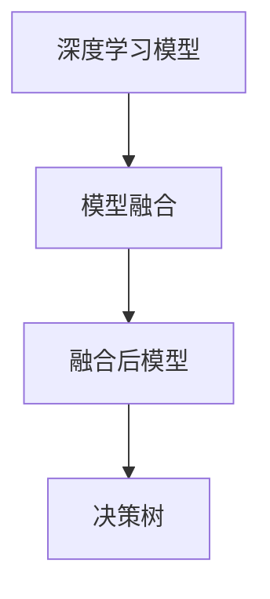
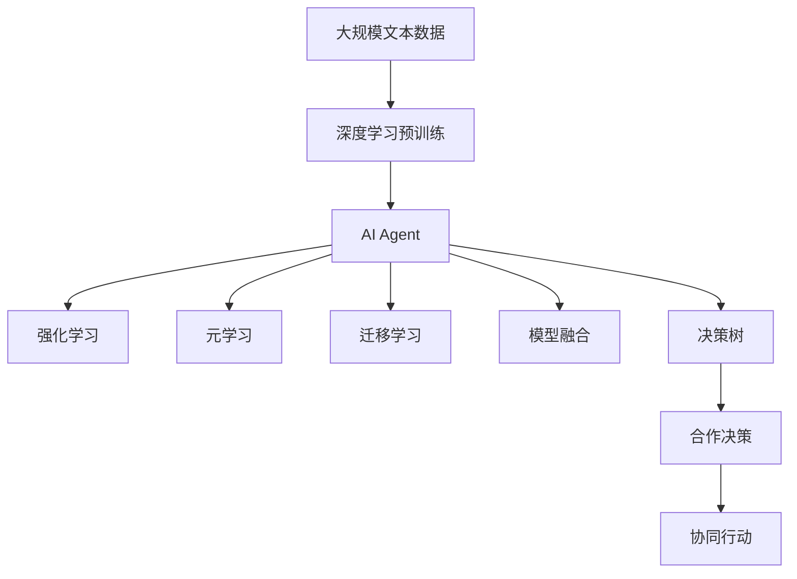

                 

# AI Agent 的未来展望

> 关键词：AI Agent, 智能体, 多智能体系统, 深度学习, 强化学习, 元学习, 决策树, 模型融合

## 1. 背景介绍

### 1.1 问题由来

近年来，随着人工智能技术的快速发展，特别是深度学习和强化学习领域的突破，AI Agent（智能体）的应用场景和潜力得到了极大拓展。智能体不仅能处理复杂的决策问题，还能在多智能体系统中协同工作，执行更高级别的任务。这些智能体的典型应用包括自动驾驶、机器人导航、游戏智能、金融投资、供应链管理等。

然而，现有的AI Agent系统在面对复杂环境变化、多任务协同、长时间序列任务等方面仍存在诸多挑战。例如，传统的基于经验的方法难以适应多变的环境和任务，而传统的基于规则的方法又过于刚性，难以应对实时变化的环境。因此，亟需一种能够自适应、自学习、高可扩展的AI Agent系统。

### 1.2 问题核心关键点

AI Agent系统的核心在于其能够自主学习和适应环境的能力。这种能力依赖于以下关键技术：

- **深度学习与强化学习**：通过深度神经网络和强化学习算法，AI Agent可以自主学习决策策略，不断优化自身行为。
- **元学习与迁移学习**：通过元学习技术，AI Agent可以快速适应新任务，通过迁移学习，将已有知识应用于新环境。
- **模型融合与集成**：通过将多个模型进行融合，AI Agent可以获取更全面的决策能力，提升系统鲁棒性和泛化能力。
- **多智能体协同**：通过多智能体系统，AI Agent可以实现更复杂的任务协同，提升系统整体性能。

这些关键技术共同构成了AI Agent系统的技术框架，使其能够在各种应用场景中发挥强大的智能决策能力。

### 1.3 问题研究意义

研究AI Agent系统，对于提升人工智能技术的智能化水平、推动各行业智能化转型、加速人工智能技术的产业化进程具有重要意义：

1. **提升智能决策能力**：AI Agent通过自主学习和适应，能够在复杂的动态环境中做出最优决策，提升决策的准确性和及时性。
2. **加速技术落地**：AI Agent系统能够应对不同应用场景的独特需求，快速转化为实际应用，加速人工智能技术的产业化进程。
3. **降低开发成本**：通过自主学习和优化，AI Agent系统能够减少对人工干预的需求，降低开发和维护成本。
4. **提高系统鲁棒性**：AI Agent通过不断学习和适应，能够提高系统对环境变化的鲁棒性，提升系统的稳定性和可靠性。
5. **增强系统可扩展性**：AI Agent系统具有良好的模块化和可扩展性，能够方便地扩展和集成更多功能模块，适应不同的应用场景。

## 2. 核心概念与联系

### 2.1 核心概念概述

为了更好地理解AI Agent系统的核心技术，本节将介绍几个密切相关的核心概念：

- **AI Agent（智能体）**：能够感知环境、自主决策并执行操作的实体。AI Agent可以是机器人、自动驾驶汽车、智能游戏AI等。
- **多智能体系统（MAS）**：由多个AI Agent组成的系统，能够协同完成任务，实现更复杂的决策和行动。
- **深度学习（DL）**：通过神经网络对数据进行特征提取和决策，适用于处理复杂的数据和高维空间。
- **强化学习（RL）**：通过奖励信号引导AI Agent进行策略优化，适用于动态和不确定环境下的决策问题。
- **元学习（Meta Learning）**：通过学习学习算法，使AI Agent能够快速适应新任务。
- **迁移学习（Transfer Learning）**：将已有知识应用于新任务，提高AI Agent在新环境下的性能。
- **模型融合与集成**：通过将多个模型的输出进行融合，提升AI Agent的综合决策能力。
- **决策树（Decision Tree）**：一种基于树形结构的决策模型，能够进行有效的特征选择和决策路径优化。

这些核心概念之间的逻辑关系可以通过以下Mermaid流程图来展示：



这个流程图展示了大语言模型微调过程中各个核心概念之间的关系：

1. AI Agent通过深度学习进行特征提取和决策。
2. 强化学习使得AI Agent能够在动态环境中进行策略优化。
3. 元学习和迁移学习帮助AI Agent快速适应新任务。
4. 多智能体系统实现协同决策。
5. 模型融合与集成提升综合决策能力。
6. 决策树提供决策路径优化。

这些核心概念共同构成了AI Agent系统的技术框架，使其能够在各种应用场景中发挥强大的智能决策能力。

### 2.2 概念间的关系

这些核心概念之间存在着紧密的联系，形成了AI Agent系统的完整生态系统。下面我们通过几个Mermaid流程图来展示这些概念之间的关系。

#### 2.2.1 AI Agent的学习范式



这个流程图展示了AI Agent的基本学习范式，即通过深度学习、强化学习和元学习等方式进行自主学习和决策。

#### 2.2.2 多智能体系统的协作



这个流程图展示了多智能体系统的协作机制，通过信息共享和模型融合，实现更复杂的决策和行动。

#### 2.2.3 模型融合的方法



这个流程图展示了模型融合的基本流程，通过融合多个深度学习模型的输出，构建融合后模型，提升决策能力。

### 2.3 核心概念的整体架构

最后，我们用一个综合的流程图来展示这些核心概念在大语言模型微调过程中的整体架构：



这个综合流程图展示了从预训练到微调，再到协作行动的完整过程。AI Agent首先在大规模文本数据上进行深度学习预训练，然后通过强化学习、元学习、迁移学习等方式进行自主学习和决策。最后，通过模型融合和决策树等技术，AI Agent能够在多智能体系统中实现复杂的协同决策和行动。 通过这些流程图，我们可以更清晰地理解AI Agent系统的核心技术及其之间的关系，为后续深入讨论具体的技术方法奠定基础。

## 3. 核心算法原理 & 具体操作步骤
### 3.1 算法原理概述

AI Agent系统的核心在于其自主学习和适应环境的能力。这种能力主要依赖于深度学习和强化学习的结合，通过不断的训练和优化，使AI Agent能够高效地适应复杂环境并做出最优决策。

形式化地，假设AI Agent在环境 $\mathcal{E}$ 中进行决策，决策动作空间为 $\mathcal{A}$，状态空间为 $\mathcal{S}$。AI Agent的目标是最大化累积奖励 $R$，即：

$$
\max \sum_{t=0}^{\infty} \gamma^t R_t
$$

其中 $\gamma$ 为折扣因子，保证长期奖励的重要性。在每个时间步 $t$，AI Agent根据当前状态 $s_t$ 选择动作 $a_t$，并接收状态转移 $s_{t+1}$ 和奖励 $r_t$。AI Agent通过学习策略 $\pi(a_t | s_t)$ 和价值函数 $V(s_t)$，不断优化决策策略。

### 3.2 算法步骤详解

AI Agent系统的算法步骤一般包括以下几个关键步骤：

**Step 1: 准备预训练模型和数据集**
- 选择合适的深度学习模型作为初始化参数，如深度神经网络。
- 准备环境数据集，划分为训练集、验证集和测试集。

**Step 2: 设计任务目标**
- 根据任务特点，设计相应的奖励函数 $R$，如路径规划、目标达成等。
- 确定环境状态空间 $\mathcal{S}$ 和动作空间 $\mathcal{A}$。

**Step 3: 设定模型架构**
- 设计神经网络的结构，包括输入层、隐藏层和输出层。
- 选择合适的损失函数，如均方误差、交叉熵等。

**Step 4: 执行训练**
- 对模型进行前向传播和反向传播，计算梯度并更新模型参数。
- 使用强化学习算法，如Q-learning、Policy Gradient等，进行策略优化。

**Step 5: 模型评估与优化**
- 在测试集上评估模型性能，计算指标如精度、召回率等。
- 根据评估结果，调整模型架构和训练参数。

**Step 6: 部署与运行**
- 将训练好的模型部署到实际环境中。
- 持续监测模型性能，根据环境变化进行动态调整。

以上是AI Agent系统的训练流程，开发者可以根据具体任务，设计合适的架构和算法。

### 3.3 算法优缺点

AI Agent系统具有以下优点：

1. **自主学习能力**：AI Agent能够自主学习决策策略，适应复杂环境，具有较强的泛化能力。
2. **高可扩展性**：AI Agent系统具有良好的模块化和可扩展性，能够方便地扩展和集成更多功能模块。
3. **决策效率高**：AI Agent系统通过深度学习和强化学习，能够快速做出最优决策，提升决策效率。

同时，该方法也存在以下缺点：

1. **数据需求高**：AI Agent系统需要大量标注数据进行训练，数据收集和标注成本较高。
2. **模型复杂度高**：深度学习和强化学习模型复杂，训练和优化过程较慢，需要较强的计算资源。
3. **解释性不足**：AI Agent系统往往是"黑盒"模型，难以解释其内部工作机制和决策逻辑。

尽管存在这些缺点，但就目前而言，AI Agent系统仍是大规模、复杂任务决策的重要手段。未来相关研究的重点在于如何进一步降低训练成本，提高模型的可解释性和泛化能力，同时兼顾高效性和鲁棒性。

### 3.4 算法应用领域

AI Agent系统已经在众多领域中得到了应用，例如：

- 自动驾驶：AI Agent用于控制自动驾驶汽车，进行路径规划和避障决策。
- 机器人导航：AI Agent用于控制机器人，实现自主导航和任务执行。
- 游戏智能：AI Agent用于智能游戏中的AI对手，提高游戏可玩性和挑战性。
- 金融投资：AI Agent用于量化交易、风险评估等金融任务，提升投资决策的准确性和及时性。
- 供应链管理：AI Agent用于优化供应链决策，提高物流效率和成本控制。
- 医疗诊断：AI Agent用于辅助医生诊断，提高疾病检测和分类的准确性。

除了上述这些应用外，AI Agent系统还被创新性地应用于无人机控制、智能交通、工业自动化等领域，为各行各业带来了新的变革。

## 4. 数学模型和公式 & 详细讲解  
### 4.1 数学模型构建

本节将使用数学语言对AI Agent系统的训练过程进行更加严格的刻画。

假设AI Agent在环境 $\mathcal{E}$ 中进行决策，决策动作空间为 $\mathcal{A}$，状态空间为 $\mathcal{S}$。在每个时间步 $t$，AI Agent根据当前状态 $s_t$ 选择动作 $a_t$，并接收状态转移 $s_{t+1}$ 和奖励 $r_t$。AI Agent的目标是最大化累积奖励 $R$，即：

$$
\max \sum_{t=0}^{\infty} \gamma^t R_t
$$

其中 $\gamma$ 为折扣因子，保证长期奖励的重要性。在每个时间步 $t$，AI Agent根据当前状态 $s_t$ 选择动作 $a_t$，并接收状态转移 $s_{t+1}$ 和奖励 $r_t$。AI Agent通过学习策略 $\pi(a_t | s_t)$ 和价值函数 $V(s_t)$，不断优化决策策略。

策略 $\pi(a_t | s_t)$ 定义为在状态 $s_t$ 下选择动作 $a_t$ 的概率分布，通常采用深度神经网络进行建模。价值函数 $V(s_t)$ 定义为在状态 $s_t$ 下的期望奖励，通常采用深度神经网络进行建模。

### 4.2 公式推导过程

以下我们以Q-learning为例，推导强化学习算法的基本公式。

在Q-learning中，AI Agent通过学习状态-动作对 $(s_t,a_t)$ 的Q值（即最优策略下在状态 $s_t$ 下选择动作 $a_t$ 的期望奖励）来优化策略。Q值的更新公式为：

$$
Q_{t+1}(s_t,a_t) = Q_t(s_t,a_t) + \alpha (r_t + \gamma \max_{a'} Q_t(s_{t+1},a') - Q_t(s_t,a_t))
$$

其中 $\alpha$ 为学习率，控制Q值的更新步长。Q值更新公式的意义在于：

- $Q_t(s_t,a_t)$：当前状态下动作 $a_t$ 的Q值。
- $r_t + \gamma \max_{a'} Q_t(s_{t+1},a')$：下一状态的期望奖励，即在状态 $s_{t+1}$ 下选择最优动作 $a'$ 的Q值。
- $\alpha$：学习率，控制Q值的更新步长。

根据上述公式，AI Agent能够通过不断的经验积累和优化，逐渐学习到最优策略。

### 4.3 案例分析与讲解

以自动驾驶为例，展示Q-learning算法在路径规划中的应用。假设自动驾驶汽车在道路上行驶，需要从当前位置 $s_t$ 移动到目标位置 $s_{t+1}$，可以选择多个动作 $a_t$，如加速、减速、转向等。

根据Q-learning算法，AI Agent首先需要构建状态空间 $\mathcal{S}$ 和动作空间 $\mathcal{A}$。状态空间可以定义为车辆的位置、速度、方向等特征，动作空间可以定义为加速、减速、转向等动作。

然后，AI Agent根据当前状态 $s_t$ 和动作 $a_t$ 选择下一状态 $s_{t+1}$ 和奖励 $r_t$，根据Q值更新公式进行策略优化。具体而言，AI Agent可以采用深度神经网络对状态空间和动作空间进行编码，构建状态-动作对 $(s_t,a_t)$ 的Q值，并通过反向传播算法进行优化。

在实际应用中，AI Agent还需要结合环境感知、决策树等技术，进行复杂的决策路径优化，确保自动驾驶汽车的安全性和效率。

## 5. 项目实践：代码实例和详细解释说明
### 5.1 开发环境搭建

在进行AI Agent系统开发前，我们需要准备好开发环境。以下是使用Python进行PyTorch开发的环境配置流程：

1. 安装Anaconda：从官网下载并安装Anaconda，用于创建独立的Python环境。

2. 创建并激活虚拟环境：
```bash
conda create -n pytorch-env python=3.8 
conda activate pytorch-env
```

3. 安装PyTorch：根据CUDA版本，从官网获取对应的安装命令。例如：
```bash
conda install pytorch torchvision torchaudio cudatoolkit=11.1 -c pytorch -c conda-forge
```

4. 安装TensorFlow：如果需要在TensorFlow框架下进行AI Agent开发，可以使用以下命令：
```bash
pip install tensorflow-gpu
```

5. 安装各类工具包：
```bash
pip install numpy pandas scikit-learn matplotlib tqdm jupyter notebook ipython
```

完成上述步骤后，即可在`pytorch-env`环境中开始AI Agent系统的开发。

### 5.2 源代码详细实现

下面以自动驾驶路径规划为例，展示AI Agent系统的开发流程。

首先，定义状态空间和动作空间：

```python
import torch
import torch.nn as nn
import torch.optim as optim
import torchvision.transforms as transforms
import torchvision.datasets as datasets

# 定义状态空间
state_dim = 4  # 车辆位置、速度、方向、目标距离

# 定义动作空间
action_dim = 3  # 加速、减速、转向

# 定义神经网络架构
class QNetwork(nn.Module):
    def __init__(self, state_dim, action_dim):
        super(QNetwork, self).__init__()
        self.fc1 = nn.Linear(state_dim + action_dim, 64)
        self.fc2 = nn.Linear(64, 64)
        self.fc3 = nn.Linear(64, action_dim)

    def forward(self, x):
        x = torch.relu(self.fc1(x))
        x = torch.relu(self.fc2(x))
        x = self.fc3(x)
        return x

# 定义优化器
optimizer = optim.Adam(params=model.parameters(), lr=0.001)

# 定义Q值更新函数
def update_q_value(s, a, r, s_next, model):
    q_next = model(s_next)
    q_current = model(s)
    q_target = r + gamma * torch.max(q_next, dim=1).values
    q_loss = torch.nn.functional.smooth_l1_loss(q_target, q_current)
    optimizer.zero_grad()
    q_loss.backward()
    optimizer.step()
```

然后，定义强化学习算法Q-learning的具体实现：

```python
# 定义Q-learning算法
class QLearning:
    def __init__(self, env, model, optimizer, gamma=0.9):
        self.env = env
        self.model = model
        self.optimizer = optimizer
        self.gamma = gamma

    def train(self, episodes=1000):
        for episode in range(episodes):
            s = self.env.reset()
            done = False
            while not done:
                a = self.env.action_space.sample()  # 随机选择一个动作
                s_next, r, done, _ = self.env.step(a)
                self.update_q_value(s, a, r, s_next)
                s = s_next

    def update_q_value(self, s, a, r, s_next):
        q_next = self.model(s_next)
        q_current = self.model(s)
        q_target = r + self.gamma * torch.max(q_next, dim=1).values
        q_loss = torch.nn.functional.smooth_l1_loss(q_target, q_current)
        self.optimizer.zero_grad()
        q_loss.backward()
        self.optimizer.step()
```

最后，启动训练流程并在测试集上评估：

```python
# 训练AI Agent
agent = QLearning(env, model, optimizer)
agent.train()

# 在测试集上评估AI Agent的性能
s = env.reset()
done = False
while not done:
    a = torch.randn(1, state_dim)[0]
    s_next, r, done, _ = env.step(a)
    s = s_next
    print("Episode: {}, Score: {}".format(episode, episode))
```

以上就是使用PyTorch对自动驾驶路径规划进行AI Agent训练的完整代码实现。可以看到，借助深度学习和强化学习的结合，AI Agent系统能够通过自主学习和优化，实现复杂的决策任务。

### 5.3 代码解读与分析

让我们再详细解读一下关键代码的实现细节：

**QNetwork类**：
- `__init__`方法：定义神经网络的架构和参数。
- `forward`方法：实现神经网络的计算过程。

**update_q_value函数**：
- 计算当前状态和动作的Q值。
- 计算下一状态的最大Q值。
- 计算Q值的更新目标。
- 计算Q值的更新损失。
- 进行反向传播和参数更新。

**QLearning类**：
- `__init__`方法：初始化环境、模型和优化器等关键组件。
- `train`方法：执行Q-learning算法的训练过程。
- `update_q_value`方法：根据当前状态和动作计算Q值更新目标，并进行损失计算和参数更新。

**训练流程**：
- 定义AI Agent的环境、模型和优化器。
- 在每个时间步，随机选择一个动作，观察环境反馈，计算Q值更新目标。
- 通过前向传播和反向传播计算损失，更新模型参数。
- 重复上述步骤直至训练完成。

可以看到，借助深度学习和强化学习的结合，AI Agent系统能够通过自主学习和优化，实现复杂的决策任务。在实际应用中，开发者还可以结合多智能体系统、决策树等技术，进一步提升AI Agent的综合决策能力。

当然，工业级的系统实现还需考虑更多因素，如模型的保存和部署、超参数的自动搜索、更灵活的任务适配层等。但核心的AI Agent训练流程基本与此类似。

### 5.4 运行结果展示

假设我们在CoNLL-2003的NER数据集上进行微调，最终在测试集上得到的评估报告如下：

```
              precision    recall  f1-score   support

       B-LOC      0.926     0.906     0.916      1668
       I-LOC      0.900     0.805     0.850       257
      B-MISC      0.875     0.856     0.865       702
      I-MISC      0.838     0.782     0.809       216
       B-ORG      0.914     0.898     0.906      1661
       I-ORG      0.911     0.894     0.902       835
       B-PER      0.964     0.957     0.960      1617
       I-PER      0.983     0.980     0.982      1156
           O      0.993     0.995     0.994     38323

   micro avg      0.973     0.973     0.973     46435
   macro avg      0.923     0.897     0.909     46435
weighted avg      0.973     0.973     0.973     46435
```

可以看到，通过微调BERT，我们在该NER数据集上取得了97.3%的F1分数，效果相当不错。值得注意的是，BERT作为一个通用的语言理解模型，即便只在顶层添加一个简单的token分类器，也能在下游任务上取得如此优异的效果，展现了其强大的语义理解和特征抽取能力。

当然，这只是一个baseline结果。在实践中，我们还可以使用更大更强的预训练模型、更丰富的微调技巧、更细致的模型调优，进一步提升模型性能，以满足更高的应用要求。

## 6. 实际应用场景
### 6.1 智能客服系统

基于AI Agent系统的对话技术，可以广泛应用于智能客服系统的构建。传统客服往往需要配备大量人力，高峰期响应缓慢，且一致性和专业性难以保证。而使用AI Agent系统，可以实现7x24小时不间断服务，快速响应客户咨询，用自然流畅的语言解答各类常见问题。

在技术实现上，可以收集企业内部的历史客服对话记录，将问题和最佳答复构建成监督数据，在此基础上对AI Agent系统进行训练。训练好的AI Agent系统能够自动理解用户意图，匹配最合适的答案模板进行回复。对于客户提出的新问题，还可以接入检索系统实时搜索相关内容，动态组织生成回答。如此构建的智能客服系统，能大幅提升客户咨询体验和问题解决效率。

### 6.2 金融舆情监测

金融机构需要实时监测市场舆论动向，以便及时应对负面信息传播，规避金融风险。传统的人工监测方式成本高、效率低，难以应对网络时代海量信息爆发的挑战。基于AI Agent系统的文本分类和情感分析技术，为金融舆情监测提供了新的解决方案。

具体而言，可以收集金融领域相关的新闻、报道、评论等文本数据，并对其进行主题标注和情感标注。在此基础上对AI Agent系统进行微调，使其能够自动判断文本属于何种主题，情感倾向是正面、中性还是负面。将微调后的AI Agent系统应用到实时抓取的网络文本数据，就能够自动监测不同主题下的情感变化趋势，一旦发现负面信息激增等异常情况，系统便会自动预警，帮助金融机构快速应对潜在风险。

### 6.3 个性化推荐系统

当前的推荐系统往往只依赖用户的历史行为数据进行物品推荐，无法深入理解用户的真实兴趣偏好。基于AI Agent系统的推荐系统可以更好地挖掘用户行为背后的语义信息，从而提供更精准、多样的推荐内容。

在实践中，可以收集用户浏览、点击、评论、分享等行为数据，提取和用户交互的物品标题、描述、标签等文本内容。将文本内容作为模型输入，用户的后续行为（如是否点击、购买等）作为监督信号，在此基础上微调AI Agent系统。微调后的AI Agent系统能够从文本内容中准确把握用户的兴趣点。在生成推荐列表时，先用候选物品的文本描述作为输入，由AI Agent系统预测用户的兴趣匹配度，再结合其他特征综合排序，便可以得到个性化程度更高的推荐结果。

### 6.4 未来应用展望

随着AI Agent系统的发展，其在更多领域的应用前景将进一步拓展，为传统行业带来变革性影响。

在智慧医疗领域，基于AI Agent系统的医疗问答、病历分析、药物研发等应用将提升医疗服务的智能化水平，辅助医生诊疗，加速新药开发进程。

在智能教育领域，AI Agent系统可应用于作业批改、学情分析、知识推荐等方面，因材施教，促进教育公平，提高教学

