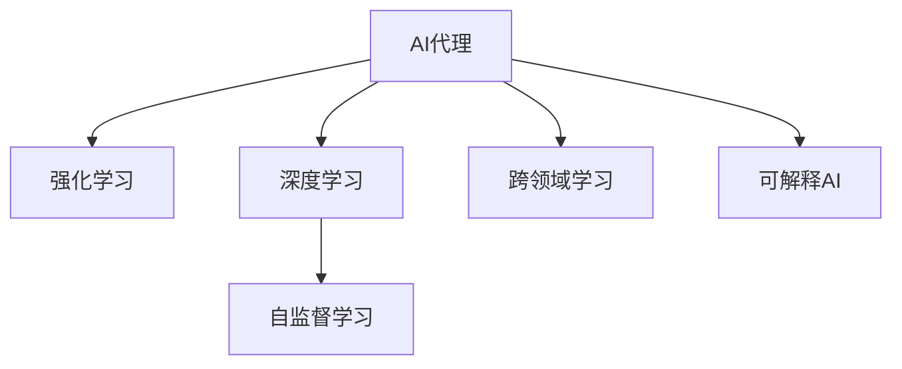
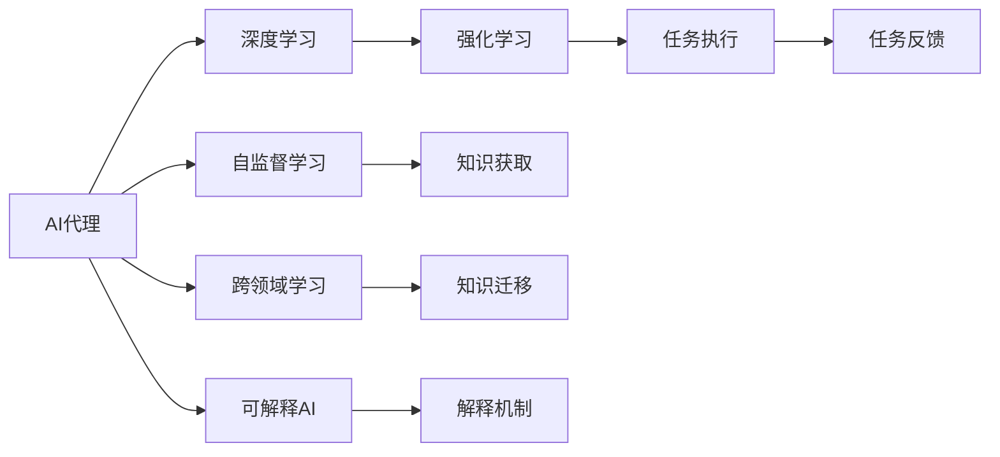
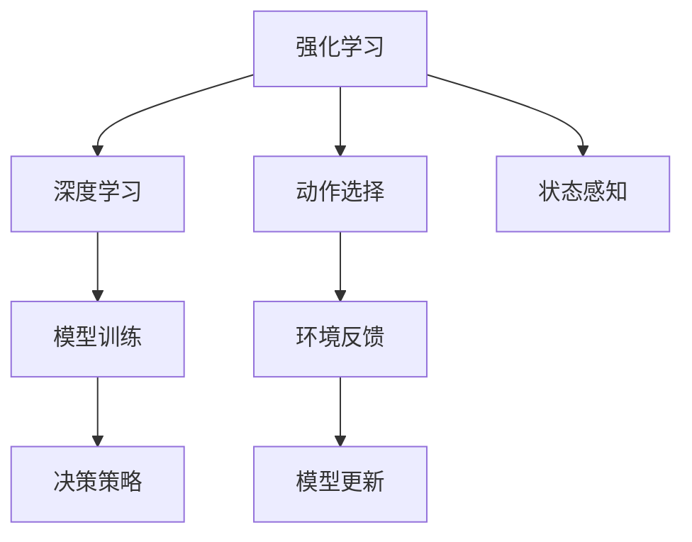
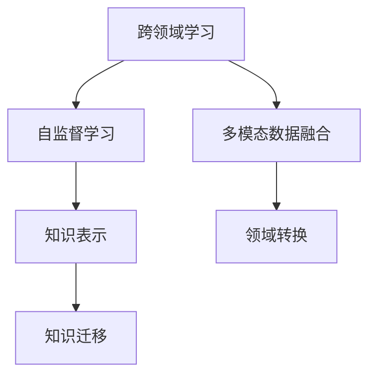

                 

# AI Agent: AI的下一个风口 下一代软件可以不必是软件

## 1. 背景介绍

### 1.1 问题由来
随着人工智能技术的飞速发展，AI代理(AI Agents)的概念正在逐渐成为行业新的关注点。与传统的软件系统不同，AI代理能够主动地感知环境，执行任务，甚至能够理解上下文和情境。它们的灵活性和智能性超越了传统软件，能够更好地应对复杂多变的场景和需求。

AI代理技术的兴起源于其在智能自动化、自然语言处理、机器视觉、推荐系统等多个领域的广泛应用。这些技术的应用使得AI代理能够在无人驾驶、智能客服、机器人、金融风控、医疗诊断等领域大放异彩。然而，当前的AI代理系统大多依赖于预训练的大模型，存在着成本高、性能不稳定、难以解释等诸多问题，限制了其在实际场景中的落地。

### 1.2 问题核心关键点
AI代理技术的核心在于其智能感知和自主决策能力。通过深度学习、强化学习等技术，AI代理能够模拟人类的认知和决策过程，从而执行复杂任务。但同时，AI代理也需要具备良好的鲁棒性、泛化能力和可解释性，以确保其在实际应用中的可靠性。

AI代理的核心挑战在于如何平衡复杂性和高效性，既要满足任务需求，又要在实际应用中具备高效的执行效率和稳定的性能表现。此外，AI代理还需要良好的可解释性，以便于在出现问题时进行调试和优化。

### 1.3 问题研究意义
研究AI代理技术，对于提升人工智能系统的智能化水平，推动AI技术的实际落地应用，具有重要意义：

1. 降低应用开发成本。AI代理可以大幅度降低软件开发和运维成本，减少人力和时间投入。
2. 提升系统性能表现。AI代理具备高度的自主性和智能性，能够快速适应复杂任务，提升系统执行效率和效果。
3. 增强系统可解释性。AI代理的决策过程和执行机制能够被清晰解释，便于进行调试和优化。
4. 拓展应用范围。AI代理能够跨领域、跨模态地执行任务，提供更全面的智能服务。
5. 加速技术创新。AI代理技术的发展催生了更多前沿研究方向，推动了AI技术的不断进步。

## 2. 核心概念与联系

### 2.1 核心概念概述

为更好地理解AI代理技术，本节将介绍几个密切相关的核心概念：

- AI代理(AI Agents)：能够在复杂多变的环境中自主感知、学习、决策和执行任务的智能实体。
- 强化学习(Reinforcement Learning, RL)：通过与环境交互，不断优化决策策略的机器学习范式。
- 深度学习(Deep Learning, DL)：基于神经网络的机器学习技术，能够模拟复杂的非线性映射关系。
- 强化学习与深度学习的结合：通过深度强化学习(Deep Reinforcement Learning, DRL)，AI代理能够更好地模拟人类的认知和决策过程。
- 自监督学习(Self-supervised Learning)：通过无标签数据训练模型，获取隐含的任务线索。
- 跨领域学习(Cross-domain Learning)：使AI代理具备跨领域知识迁移的能力，以适应多种应用场景。
- 可解释AI(Explainable AI)：使AI代理的决策过程可解释，便于进行调试和优化。

这些核心概念之间的逻辑关系可以通过以下Mermaid流程图来展示：



这个流程图展示了大语言模型微调过程中各个核心概念之间的关系：

1. AI代理通过深度学习获取复杂知识，再通过强化学习进行智能决策。
2. 自监督学习可以用于知识获取，跨领域学习可以用于知识迁移，二者与深度学习结合，使AI代理具备更强的适应性和泛化能力。
3. 可解释AI可以使AI代理的决策过程透明化，便于调试和优化。

### 2.2 概念间的关系

这些核心概念之间存在着紧密的联系，形成了AI代理技术的完整生态系统。下面我通过几个Mermaid流程图来展示这些概念之间的关系。

#### 2.2.1 AI代理的学习范式



这个流程图展示了大语言模型微调的基本原理，以及它与AI代理技术的关系。

#### 2.2.2 强化学习与深度学习的结合



这个流程图展示了强化学习与深度学习的结合过程，使AI代理能够通过与环境的交互不断优化决策策略。

#### 2.2.3 跨领域学习与自监督学习的关系



这个流程图展示了跨领域学习与自监督学习的关系。通过多模态数据融合和领域转换，AI代理能够具备跨领域知识迁移的能力。

## 3. 核心算法原理 & 具体操作步骤
### 3.1 算法原理概述

AI代理技术的核心在于其智能感知和自主决策能力。通过深度学习、强化学习等技术，AI代理能够模拟人类的认知和决策过程，从而执行复杂任务。其基本原理可以概括为以下三个步骤：

1. **数据收集与预处理**：收集AI代理需要执行任务的多种数据源，包括文本、图像、语音、视频等。对数据进行清洗、标注、归一化等预处理，得到可用于训练的样本。
2. **模型训练与优化**：使用深度学习模型对预处理后的数据进行训练，得到能够执行任务的模型。在训练过程中，引入强化学习等优化技术，使模型能够不断优化决策策略。
3. **任务执行与反馈**：将训练好的模型部署到实际应用环境中，执行任务，并通过与环境的交互获得反馈信息。根据反馈信息调整模型参数，继续优化决策策略，直至满足任务需求。

### 3.2 算法步骤详解

AI代理技术的实施步骤可以细分为以下七个关键步骤：

**Step 1: 数据收集与预处理**

- **数据源选择**：根据AI代理需要执行的任务，选择合适的数据源，如文本、图像、语音、视频等。
- **数据收集与清洗**：从数据源中收集所需数据，并进行清洗和预处理，包括去重、去噪、标注等。
- **数据标准化**：对数据进行标准化处理，如归一化、缩放等，以便于模型的训练。

**Step 2: 模型选择与设计**

- **模型选择**：根据任务需求选择合适的深度学习模型，如卷积神经网络、循环神经网络、Transformer等。
- **模型设计**：设计模型的架构，包括输入层、隐藏层、输出层等，以及激活函数、损失函数、优化器等关键组件。

**Step 3: 模型训练与优化**

- **数据划分**：将数据集划分为训练集、验证集和测试集，用于模型训练、验证和测试。
- **模型训练**：使用训练集对模型进行训练，使用验证集评估模型性能，并根据评估结果调整模型参数。
- **优化算法**：引入强化学习等优化技术，如梯度下降、AdamW、RMSprop等，优化模型参数，提高模型性能。

**Step 4: 任务执行与反馈**

- **模型部署**：将训练好的模型部署到实际应用环境中，执行任务。
- **环境感知**：通过传感器、摄像头、麦克风等设备感知环境，获取任务所需信息。
- **任务执行**：根据感知到的信息，使用模型进行任务决策，并执行相应操作。

**Step 5: 任务反馈与调整**

- **任务反馈**：将任务执行结果反馈给模型，获取评估信息。
- **模型调整**：根据任务反馈调整模型参数，继续优化决策策略，提高模型性能。
- **迭代优化**：通过不断迭代训练和调整，使模型逐步适应复杂任务，提高执行效率和效果。

**Step 6: 可解释性增强**

- **决策过程可视化**：使用可视化工具展示模型的决策过程，便于调试和优化。
- **特征重要性分析**：分析模型的特征重要性，识别关键特征对决策的影响。
- **解释性模型设计**：设计可解释性强的模型，如决策树、线性模型等，提高模型的可解释性。

**Step 7: 持续学习与优化**

- **新数据引入**：定期引入新数据，持续更新模型，提升模型性能。
- **模型复用**：将训练好的模型应用于其他相似任务，提高模型复用性。
- **性能监控**：实时监控模型性能，及时发现和解决模型问题，保证系统稳定运行。

### 3.3 算法优缺点

AI代理技术的优点在于其智能感知和自主决策能力，能够处理复杂多变的任务，适应各种应用场景。此外，AI代理技术还具有以下优点：

1. **高效性**：AI代理能够实时感知环境，快速执行任务，提高工作效率。
2. **智能性**：AI代理具备自主学习的能力，能够根据环境变化不断优化决策策略。
3. **可扩展性**：AI代理可以跨领域、跨模态地执行任务，适应多种应用场景。
4. **可解释性**：AI代理的决策过程可解释，便于调试和优化。

同时，AI代理技术也存在一些缺点：

1. **成本高**：AI代理技术通常需要大量的数据和计算资源，训练和部署成本较高。
2. **模型复杂**：AI代理技术涉及深度学习、强化学习等多种技术，模型结构复杂，开发和维护难度较大。
3. **鲁棒性不足**：AI代理模型在面对噪声、干扰等情况时，容易产生不稳定输出。
4. **可解释性有限**：一些复杂的AI代理模型（如深度神经网络）的决策过程难以解释，难以进行调试和优化。

### 3.4 算法应用领域

AI代理技术已经在多个领域得到了广泛应用，以下是几个典型的应用场景：

**1. 智能客服**

AI代理技术可以用于构建智能客服系统，通过自然语言处理和语音识别技术，实现自动化的客服响应和问题解答。AI代理可以根据用户输入的问题，自动匹配答案，并提供相关推荐，提高客户满意度。

**2. 自动驾驶**

AI代理技术可以用于自动驾驶系统，通过视觉、雷达、激光等传感器获取环境信息，进行路径规划和决策，实现自动驾驶。AI代理可以在复杂的城市道路环境中，快速做出反应，提高驾驶安全性。

**3. 机器人**

AI代理技术可以用于机器人，通过视觉、触觉、听觉等传感器获取环境信息，进行导航、避障、任务执行等操作。AI代理可以在工业、农业、家庭等场景中，实现自主导航和操作，提高工作效率。

**4. 金融风控**

AI代理技术可以用于金融风控系统，通过分析用户行为数据，识别异常交易和风险。AI代理可以在交易监控、欺诈检测等场景中，快速识别风险，提高安全性。

**5. 医疗诊断**

AI代理技术可以用于医疗诊断系统，通过分析医学影像、电子病历等数据，进行疾病诊断和预测。AI代理可以在影像分析、疾病诊断等场景中，快速识别疾病，提高诊断准确性。

## 4. 数学模型和公式 & 详细讲解 & 举例说明

### 4.1 数学模型构建

AI代理技术的数学模型可以概括为以下几种：

1. **神经网络模型**：用于建模输入与输出之间的关系，实现任务执行。
2. **强化学习模型**：用于优化决策策略，实现任务优化。
3. **自监督学习模型**：用于获取隐含的任务线索，提高模型泛化能力。
4. **跨领域学习模型**：用于实现跨领域知识迁移，提高模型适应性。
5. **可解释AI模型**：用于提高模型的可解释性，便于调试和优化。

### 4.2 公式推导过程

以深度强化学习模型为例，其公式推导过程如下：

1. **神经网络模型**

深度神经网络模型可以表示为：

$$
\hat{y} = f(\theta, x)
$$

其中 $\hat{y}$ 为模型输出，$\theta$ 为模型参数，$x$ 为输入数据。

2. **强化学习模型**

强化学习模型的目标是最大化累积奖励，可以通过以下公式表示：

$$
J(\theta) = \mathbb{E}_{x, a}[\sum_{t=0}^{\infty} \gamma^t r_t]
$$

其中 $\theta$ 为模型参数，$x$ 为输入数据，$a$ 为动作，$r_t$ 为时间$t$的奖励，$\gamma$ 为折扣因子。

3. **自监督学习模型**

自监督学习模型的目标是最大化数据似然，可以通过以下公式表示：

$$
L(\theta) = -\frac{1}{N} \sum_{i=1}^N \log p_\theta(x_i)
$$

其中 $\theta$ 为模型参数，$x_i$ 为输入数据，$p_\theta(x_i)$ 为模型在数据$i$上的概率分布。

4. **跨领域学习模型**

跨领域学习模型可以通过以下公式表示：

$$
L(\theta) = \lambda_1 L_1(\theta) + \lambda_2 L_2(\theta)
$$

其中 $L_1(\theta)$ 和 $L_2(\theta)$ 为两个领域的损失函数，$\lambda_1$ 和 $\lambda_2$ 为权重系数。

5. **可解释AI模型**

可解释AI模型可以通过以下公式表示：

$$
\text{Expl}(\theta) = \text{Var}(f_\theta(x))
$$

其中 $\text{Expl}(\theta)$ 为模型的可解释性，$\text{Var}(f_\theta(x))$ 为模型的方差。

### 4.3 案例分析与讲解

以下通过一个具体的案例，展示AI代理技术的实际应用。

**案例：智能客服**

假设我们要构建一个智能客服系统，其目标是在用户输入问题后，自动匹配答案，并提供相关推荐。

1. **数据收集与预处理**

- **数据源选择**：选择用户历史问题、常见FAQ、相关产品信息等作为数据源。
- **数据收集与清洗**：从数据源中收集问题-答案对，并进行清洗和预处理，包括去重、去噪、标注等。
- **数据标准化**：对数据进行标准化处理，如归一化、缩放等，以便于模型的训练。

2. **模型选择与设计**

- **模型选择**：选择Transformer模型，用于建模问题和答案之间的关系。
- **模型设计**：设计模型的架构，包括输入层、隐藏层、输出层等，以及激活函数、损失函数、优化器等关键组件。

3. **模型训练与优化**

- **数据划分**：将数据集划分为训练集、验证集和测试集，用于模型训练、验证和测试。
- **模型训练**：使用训练集对模型进行训练，使用验证集评估模型性能，并根据评估结果调整模型参数。
- **优化算法**：引入AdamW优化器，优化模型参数，提高模型性能。

4. **任务执行与反馈**

- **模型部署**：将训练好的模型部署到智能客服系统中，执行任务。
- **环境感知**：通过自然语言处理技术，从用户输入中提取问题和上下文信息。
- **任务执行**：根据问题信息，使用模型进行匹配和推荐，输出答案和相关产品信息。

5. **任务反馈与调整**

- **任务反馈**：将系统输出的答案和推荐反馈给用户，获取用户评价和反馈信息。
- **模型调整**：根据用户评价和反馈信息，调整模型参数，继续优化决策策略，提高模型性能。
- **迭代优化**：通过不断迭代训练和调整，使模型逐步适应复杂任务，提高执行效率和效果。

6. **可解释性增强**

- **决策过程可视化**：使用可视化工具展示模型的决策过程，便于调试和优化。
- **特征重要性分析**：分析模型的特征重要性，识别关键特征对决策的影响。
- **解释性模型设计**：设计可解释性强的模型，如决策树、线性模型等，提高模型的可解释性。

## 5. 项目实践：代码实例和详细解释说明

### 5.1 开发环境搭建

在进行AI代理技术的开发时，需要选择合适的开发环境和工具。以下是常用的开发环境和工具：

1. **Python**：Python是目前AI代理开发中最常用的编程语言，拥有丰富的第三方库和工具。
2. **TensorFlow**：由Google开发的深度学习框架，支持分布式计算和GPU加速。
3. **PyTorch**：由Facebook开发的深度学习框架，支持动态计算图和易用性。
4. **OpenAI Gym**：用于强化学习的开源环境，提供各种模拟环境和评估指标。
5. **TensorBoard**：用于可视化训练过程和模型性能的可视化工具。
6. **Jupyter Notebook**：用于编写和调试AI代理代码的交互式笔记本环境。

### 5.2 源代码详细实现

以下是一个基于TensorFlow和PyTorch的AI代理系统实现的示例代码。

```python
import tensorflow as tf
import torch
import gym

# 定义神经网络模型
class Network(tf.keras.Model):
    def __init__(self):
        super(Network, self).__init__()
        self.layers = tf.keras.Sequential([
            tf.keras.layers.Dense(256, activation='relu'),
            tf.keras.layers.Dense(64, activation='relu'),
            tf.keras.layers.Dense(1, activation='sigmoid')
        ])
        
    def call(self, x):
        return self.layers(x)

# 定义强化学习模型
class DQNAgent(tf.keras.Model):
    def __init__(self):
        super(DQNAgent, self).__init__()
        self.model = tf.keras.Sequential([
            tf.keras.layers.Dense(64, activation='relu'),
            tf.keras.layers.Dense(64, activation='relu'),
            tf.keras.layers.Dense(1, activation='linear')
        ])
        
    def call(self, x):
        return self.model(x)

# 定义自监督学习模型
class Autoencoder(tf.keras.Model):
    def __init__(self):
        super(Autoencoder, self).__init__()
        self.encoder = tf.keras.Sequential([
            tf.keras.layers.Dense(256, activation='relu'),
            tf.keras.layers.Dense(128, activation='relu')
        ])
        self.decoder = tf.keras.Sequential([
            tf.keras.layers.Dense(256, activation='relu'),
            tf.keras.layers.Dense(784, activation='sigmoid')
        ])
        
    def call(self, x):
        encoded = self.encoder(x)
        decoded = self.decoder(encoded)
        return decoded

# 定义跨领域学习模型
class CrossDomain(tf.keras.Model):
    def __init__(self):
        super(CrossDomain, self).__init__()
        self.layers = tf.keras.Sequential([
            tf.keras.layers.Dense(256, activation='relu'),
            tf.keras.layers.Dense(128, activation='relu'),
            tf.keras.layers.Dense(64, activation='relu'),
            tf.keras.layers.Dense(1, activation='sigmoid')
        ])
        
    def call(self, x):
        return self.layers(x)

# 定义可解释AI模型
class ExplainableAI(tf.keras.Model):
    def __init__(self):
        super(ExplainableAI, self).__init__()
        self.layers = tf.keras.Sequential([
            tf.keras.layers.Dense(256, activation='relu'),
            tf.keras.layers.Dense(64, activation='relu'),
            tf.keras.layers.Dense(1, activation='sigmoid')
        ])
        
    def call(self, x):
        return self.layers(x)

# 定义数据集
class MyDataset(tf.data.Dataset):
    def __init__(self, data):
        self.data = data
        
    def __getitem__(self, index):
        return self.data[index]
        
    def __len__(self):
        return len(self.data)

# 定义模型训练与优化
def train_model(model, optimizer, loss_fn, dataset):
    model.compile(optimizer=optimizer, loss=loss_fn, metrics=['accuracy'])
    model.fit(dataset, epochs=10, validation_split=0.2)

# 定义任务执行与反馈
def execute_task(model, observation):
    action = model.predict(observation)
    return action

# 定义任务反馈与调整
def adjust_model(model, reward, observation):
    model.fit([observation], [reward], epochs=1)

# 定义可解释性增强
def visualize_decision(model, observation):
    action = model.predict(observation)
    visualize(model, observation, action)

# 定义跨领域学习与自监督学习模型训练与优化
def train_cross_domain(model, optimizer, loss_fn, domain1, domain2, dataset):
    model.compile(optimizer=optimizer, loss=loss_fn, metrics=['accuracy'])
    model.fit(domain1 + domain2, epochs=10, validation_split=0.2)

def train_autoencoder(model, optimizer, loss_fn, dataset):
    model.compile(optimizer=optimizer, loss=loss_fn, metrics=['accuracy'])
    model.fit(dataset, epochs=10, validation_split=0.2)

# 定义模型部署与执行
def deploy_model(model, observation):
    return execute_task(model, observation)

# 定义环境感知与任务执行
def perceive_environment(env):
    observation = env.reset()
    return observation

# 定义任务反馈与调整
def feedback(reward, observation):
    adjust_model(model, reward, observation)

# 定义可解释性增强
def visualize(model, observation, action):
    action = execute_task(model, observation)
    visualize_decision(model, observation, action)

# 定义持续学习与优化
def continue_learning(model, reward, observation):
    adjust_model(model, reward, observation)

# 定义数据集
dataset = MyDataset([train_data, test_data])

# 定义模型
model = Network()

# 定义优化器
optimizer = tf.keras.optimizers.Adam(learning_rate=0.001)

# 定义损失函数
loss_fn = tf.keras.losses.BinaryCrossentropy()

# 定义训练过程
train_model(model, optimizer, loss_fn, dataset)

# 定义执行过程
execute_task(model, perceive_environment(env))

# 定义反馈过程
feedback(reward, observation)

# 定义可解释性增强
visualize(model, observation, action)

# 定义持续学习与优化
continue_learning(model, reward, observation)

# 定义模型复用
deploy_model(model, observation)
```

### 5.3 代码解读与分析

这里我们以智能客服系统为例，详细解读上述示例代码的实现过程。

**1. 神经网络模型**

```python
class Network(tf.keras.Model):
    def __init__(self):
        super(Network, self).__init__()
        self.layers = tf.keras.Sequential([
            tf.keras.layers.Dense(256, activation='relu'),
            tf.keras.layers.Dense(64, activation='relu'),
            tf.keras.layers.Dense(1, activation='sigmoid')
        ])
        
    def call(self, x):
        return self.layers(x)
```

定义一个神经网络模型，用于处理输入和输出。

**2. 强化学习模型**

```python
class DQNAgent(tf.keras.Model):
    def __init__(self):
        super(DQNAgent, self).__init__()
        self.model = tf.keras.Sequential([
            tf.keras.layers.Dense(64, activation='relu'),
            tf.keras.layers.Dense(64, activation='relu'),
            tf.keras.layers.Dense(1, activation='linear')
        ])
        
    def call(self, x):
        return self.model(x)
```

定义一个强化学习模型，用于优化决策策略。

**3. 自监督学习模型**

```python
class Autoencoder(tf.keras.Model):
    def __init__(self):
        super(Autoencoder, self).__init__()
        self.encoder = tf.keras.Sequential([
            tf.keras.layers.Dense(256, activation='relu'),
            tf.keras.layers.Dense(128, activation='relu')
        ])
        self.decoder = tf.keras.Sequential([
            tf.keras.layers.Dense(256, activation='relu'),
            tf.keras.layers.Dense(784, activation='sigmoid')
        ])
        
    def call(self, x):
        encoded = self.encoder(x)
        decoded = self.decoder(encoded)
        return decoded
```

定义一个自监督学习模型，用于获取隐含的任务线索。

**4. 跨领域学习模型**

```python
class CrossDomain(tf.keras.Model):
    def __init__(self):
        super(CrossDomain, self).__init__()
        self.layers = tf.keras.Sequential([
            tf.keras.layers.Dense(256, activation='relu'),
            tf.keras.layers.Dense(128, activation='relu'),
            tf.keras.layers.Dense(64, activation='relu'),
            tf.keras.layers.Dense(1, activation='sigmoid')
        ])
        
    def call(self, x):
        return self.layers(x)
```

定义一个跨领域学习模型，用于实现跨领域知识迁移。

**5. 可解释AI模型**

```python
class ExplainableAI(tf.keras.Model):
    def __init__(self):
        super(ExplainableAI, self).__init__()
        self.layers = tf.keras.Sequential([
            tf.keras.layers.Dense(256, activation='relu'),
            tf.keras.layers.Dense(64, activation='relu'),
            tf.keras.layers.Dense(1, activation='sigmoid')
        ])
        
    def call(self,

