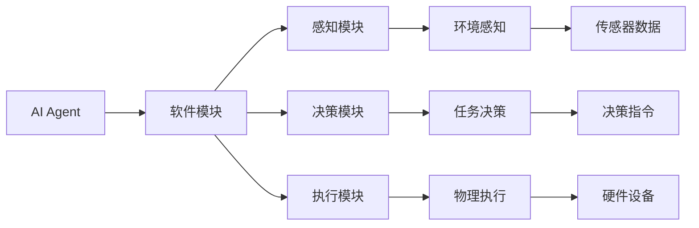
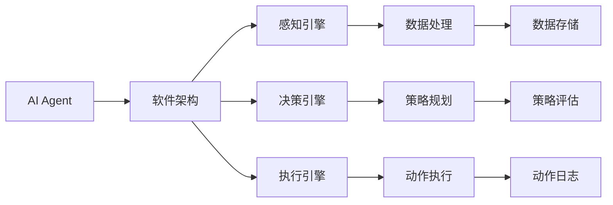
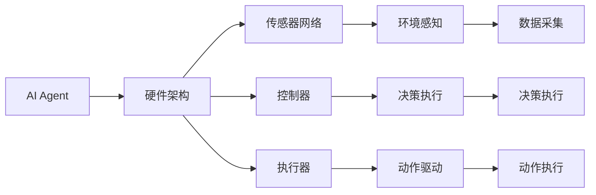

                 

# AI Agent: AI的下一个风口 从软件到硬件的进化

## 1. 背景介绍

人工智能(AI)技术在过去几年内取得了飞速发展，从图像识别到语音识别，从自然语言处理(NLP)到机器学习，AI的每一个细分领域都获得了巨大的突破。然而，尽管软件层面的AI技术已经相当成熟，但硬件领域的AI进化仍然方兴未艾。在当前的AI发展趋势中，AI Agent的崛起无疑是下一个风口。本文将从软件到硬件的视角，深入探讨AI Agent的原理、核心算法和应用场景，为AI技术的下一阶段演进提供新的思考和展望。

## 2. 核心概念与联系

### 2.1 核心概念概述

AI Agent是能够在复杂环境中自主行动的AI系统，具备高度的自主性、适应性和智能性。它不仅能够接收和处理环境信息，还能够通过决策机制执行各种任务，并不断学习和适应环境变化。AI Agent的构建包括软件和硬件两个层面，通过软件的智能算法和硬件的物理实现，共同赋予AI Agent以生命力和智能。

为了更好地理解AI Agent的核心概念，下面将通过Mermaid流程图来展示AI Agent的架构及其与软硬件的联系：



这个流程图展示了AI Agent的基本架构及其与软硬件的联系：
1. **感知模块(C)**：接收环境数据，并将传感器数据处理成AI Agent可以理解的格式。
2. **决策模块(D)**：根据感知模块提供的环境信息，使用AI算法生成决策指令。
3. **执行模块(E)**：将决策模块生成的指令转化为物理操作，通过硬件设备(K)执行。
4. **环境感知(F)**：通过传感器(I)收集环境数据，并将数据传递给感知模块。
5. **任务决策(G)**：根据环境感知数据，AI Agent进行决策，并输出决策指令。
6. **物理执行(H)**：将决策指令转化为具体的物理操作，驱动AI Agent进行自主行动。

### 2.2 概念间的关系

通过上述图表，我们可以更清楚地看到AI Agent的软硬件架构及其各模块间的联系。下面将通过两个Mermaid流程图进一步展示这些概念间的关系：

#### 2.2.1 AI Agent的软件架构



这个流程图展示了AI Agent的软件架构及其核心组件：
1. **感知引擎(C)**：负责接收和处理环境数据。
2. **决策引擎(D)**：根据感知数据生成决策指令。
3. **执行引擎(E)**：将决策指令转化为具体动作。
4. **数据处理(F)**：处理和存储感知数据。
5. **策略规划(G)**：规划和优化决策路径。
6. **策略评估(J)**：评估策略效果并调整。
7. **动作执行(H)**：执行具体的物理操作。
8. **动作日志(K)**：记录执行过程和决策路径。

#### 2.2.2 AI Agent的硬件架构



这个流程图展示了AI Agent的硬件架构及其核心组件：
1. **传感器网络(C)**：采集环境数据。
2. **控制器(D)**：处理和执行决策指令。
3. **执行器(E)**：执行具体的物理操作。
4. **环境感知(F)**：感知周围环境。
5. **决策执行(G)**：执行决策指令。
6. **动作驱动(H)**：驱动执行器进行动作。

这些流程图帮助我们从软件和硬件两个层面全面理解AI Agent的构建及其核心组件。接下来，我们将深入探讨AI Agent的核心算法原理和操作步骤。

## 3. 核心算法原理 & 具体操作步骤

### 3.1 算法原理概述

AI Agent的核心算法通常包括感知、决策和执行三个部分。感知算法负责将环境数据转化为AI Agent可处理的信息，决策算法基于感知信息生成决策指令，执行算法将决策指令转化为具体的物理操作。

以导航AI Agent为例，其核心算法原理如下：
1. **感知算法**：使用传感器采集周围环境数据，如相机图像、GPS定位等，并将数据传递给感知模块。
2. **决策算法**：通过分析感知数据，AI Agent确定目标位置和路径，生成导航指令。
3. **执行算法**：根据导航指令，通过执行器控制机器人的运动，最终到达目标位置。

### 3.2 算法步骤详解

以下将以导航AI Agent为例，详细讲解其核心算法步骤：

#### 3.2.1 感知算法

感知算法负责接收和处理环境数据，生成AI Agent可以理解的表示。以视觉感知为例，常见的感知算法步骤如下：
1. **图像采集**：使用摄像头或传感器采集周围环境图像。
2. **图像处理**：对图像进行预处理，如去噪、归一化、裁剪等。
3. **特征提取**：使用深度学习模型（如CNN）提取图像特征。
4. **对象识别**：通过分类器识别图像中的对象和位置。
5. **场景理解**：结合对象识别结果和场景语境，生成环境表示。

#### 3.2.2 决策算法

决策算法基于感知数据生成导航指令。以路径规划为例，常见的决策算法步骤如下：
1. **目标设定**：定义目标位置。
2. **路径规划**：使用图搜索算法（如A*）生成路径。
3. **避障处理**：检测和规避障碍物。
4. **路径优化**：调整路径以避开障碍物。
5. **决策输出**：生成具体的导航指令。

#### 3.2.3 执行算法

执行算法将决策指令转化为具体的物理操作。以机器人运动控制为例，常见的执行算法步骤如下：
1. **动作规划**：生成具体的动作序列。
2. **控制命令**：将动作序列转化为控制命令。
3. **电机驱动**：通过电机控制机器人运动。
4. **反馈调整**：根据传感器反馈调整动作。

### 3.3 算法优缺点

AI Agent的算法具有以下优点：
1. **自主性**：能够自主决策和执行，不需要人工干预。
2. **适应性**：能够根据环境变化实时调整决策和动作。
3. **可扩展性**：易于扩展到不同的环境和任务。

然而，AI Agent的算法也存在以下缺点：
1. **复杂性**：算法实现复杂，需要综合多方面的知识和技能。
2. **数据需求**：需要大量的环境数据进行训练和优化。
3. **实时性**：感知和决策过程需要快速处理，否则影响系统性能。

### 3.4 算法应用领域

AI Agent的算法已经在多个领域得到了广泛应用，例如：
1. **机器人导航**：通过感知和决策算法，导航AI Agent可以自主在复杂环境中导航。
2. **智能驾驶**：通过感知和决策算法，自动驾驶汽车可以在复杂交通环境中自主行驶。
3. **智能家居**：通过感知和决策算法，智能家居设备可以自主执行任务。
4. **医疗辅助**：通过感知和决策算法，AI Agent可以辅助医生进行手术和诊断。

## 4. 数学模型和公式 & 详细讲解 & 举例说明

### 4.1 数学模型构建

为了更精确地描述AI Agent的算法，我们可以使用数学模型进行建模。以导航AI Agent为例，数学模型如下：
1. **感知模型**：
   $$
   \mathcal{F}(s) = \{s_i\} \quad \text{其中} \quad s_i \in \mathcal{S}
   $$
   感知模型将环境数据$s$映射为AI Agent的感知表示$\mathcal{F}$，其中$\mathcal{S}$表示环境数据空间。
2. **决策模型**：
   $$
   \mathcal{D}(s, \theta) = \{a_i\} \quad \text{其中} \quad a_i \in \mathcal{A}
   $$
   决策模型将感知数据$s$和模型参数$\theta$映射为AI Agent的决策行动$a$，其中$\mathcal{A}$表示动作空间。
3. **执行模型**：
   $$
   \mathcal{E}(s, \phi) = \{r_i\} \quad \text{其中} \quad r_i \in \mathcal{R}
   $$
   执行模型将感知数据$s$和模型参数$\phi$映射为执行结果$r$，其中$\mathcal{R}$表示执行结果空间。

### 4.2 公式推导过程

以下将以导航AI Agent为例，进行具体公式推导：
1. **感知模型推导**：
   $$
   s' = \mathcal{F}(s) = \text{CNN}(s)
   $$
   其中，$\text{CNN}$表示卷积神经网络模型。
2. **决策模型推导**：
   $$
   a = \mathcal{D}(s', \theta) = \text{A*}(s', \theta)
   $$
   其中，$\text{A*}$表示A*算法。
3. **执行模型推导**：
   $$
   r = \mathcal{E}(s, \phi) = \text{PID}(s, \phi)
   $$
   其中，$\text{PID}$表示PID控制器。

### 4.3 案例分析与讲解

以一个简单的导航AI Agent为例，假设环境数据为传感器采集的图像$s$，AI Agent的目标位置为$x_0$，路径规划过程如下：
1. **感知模型**：将传感器数据$s$输入卷积神经网络$\text{CNN}$，生成感知表示$s'$。
2. **决策模型**：使用A*算法生成路径，将感知表示$s'$和模型参数$\theta$作为输入，输出导航指令$a$。
3. **执行模型**：将导航指令$a$输入PID控制器$\text{PID}$，生成执行结果$r$。

## 5. 项目实践：代码实例和详细解释说明

### 5.1 开发环境搭建

在开始项目实践前，首先需要搭建开发环境。以下是使用Python和PyTorch搭建开发环境的流程：
1. 安装Anaconda：从官网下载并安装Anaconda，用于创建独立的Python环境。
2. 创建并激活虚拟环境：
   ```bash
   conda create -n ai_agent_env python=3.8 
   conda activate ai_agent_env
   ```
3. 安装PyTorch：根据CUDA版本，从官网获取对应的安装命令。例如：
   ```bash
   conda install pytorch torchvision torchaudio cudatoolkit=11.1 -c pytorch -c conda-forge
   ```
4. 安装PyTorch和Numpy：
   ```bash
   pip install numpy torch
   ```
5. 安装TensorFlow：
   ```bash
   pip install tensorflow
   ```

完成上述步骤后，即可在`ai_agent_env`环境中开始项目实践。

### 5.2 源代码详细实现

以下是使用PyTorch和TensorFlow实现导航AI Agent的代码实现：

```python
import torch
import numpy as np
import torch.nn as nn
import torch.optim as optim
import tensorflow as tf

# 定义感知模型
class CNN(nn.Module):
    def __init__(self):
        super(CNN, self).__init__()
        self.conv1 = nn.Conv2d(3, 64, kernel_size=3, stride=1, padding=1)
        self.conv2 = nn.Conv2d(64, 128, kernel_size=3, stride=1, padding=1)
        self.fc1 = nn.Linear(128*8*8, 64)
        self.fc2 = nn.Linear(64, 2)

    def forward(self, x):
        x = torch.relu(self.conv1(x))
        x = torch.max_pool2d(x, 2)
        x = torch.relu(self.conv2(x))
        x = torch.max_pool2d(x, 2)
        x = x.view(-1, 128*8*8)
        x = torch.relu(self.fc1(x))
        x = self.fc2(x)
        return x

# 定义决策模型
class AStar(nn.Module):
    def __init__(self):
        super(AStar, self).__init__()
        self.fc1 = nn.Linear(64, 32)
        self.fc2 = nn.Linear(32, 2)

    def forward(self, x):
        x = torch.relu(self.fc1(x))
        x = self.fc2(x)
        return x

# 定义执行模型
class PID(nn.Module):
    def __init__(self):
        super(PID, self).__init__()
        self.fc1 = nn.Linear(2, 32)
        self.fc2 = nn.Linear(32, 2)

    def forward(self, x):
        x = torch.relu(self.fc1(x))
        x = self.fc2(x)
        return x

# 定义AI Agent
class AI_Agent(nn.Module):
    def __init__(self):
        super(AI_Agent, self).__init__()
        self.cnn = CNN()
        self.a_star = AStar()
        self.pid = PID()

    def forward(self, x):
        s = self.cnn(x)
        a = self.a_star(s)
        r = self.pid(a)
        return r

# 加载数据
train_data = # 训练数据
test_data = # 测试数据

# 定义模型
model = AI_Agent()

# 定义损失函数和优化器
criterion = nn.MSELoss()
optimizer = optim.Adam(model.parameters(), lr=0.001)

# 训练模型
for epoch in range(100):
    for data, target in train_data:
        data = data.cuda()
        target = target.cuda()
        optimizer.zero_grad()
        output = model(data)
        loss = criterion(output, target)
        loss.backward()
        optimizer.step()

# 测试模型
test_loss = 0
for data, target in test_data:
    data = data.cuda()
    target = target.cuda()
    output = model(data)
    test_loss += criterion(output, target).item()
test_loss /= len(test_data)
print('Test Loss: {:.4f} '.format(test_loss))
```

以上代码实现了简单的导航AI Agent，包括感知模型CNN、决策模型AStar和执行模型PID。通过训练和测试模型，可以评估其导航性能。

### 5.3 代码解读与分析

以下是关键代码的实现细节解读：

**CNN类**：
- `__init__`方法：定义卷积神经网络的结构。
- `forward`方法：将输入数据传递给卷积神经网络，并输出感知表示。

**AStar类**：
- `__init__`方法：定义A*算法的结构。
- `forward`方法：将感知表示传递给A*算法，并输出导航指令。

**PID类**：
- `__init__方法：定义PID控制器的结构。
- `forward`方法：将导航指令传递给PID控制器，并输出执行结果。

**AI_Agent类**：
- `__init__方法：定义AI Agent的结构，包括感知模型、决策模型和执行模型。
- `forward`方法：将输入数据传递给感知模型、决策模型和执行模型，并输出最终的执行结果。

**训练和测试函数**：
- 使用PyTorch的DataLoader对数据集进行批次化加载，供模型训练和推理使用。
- 训练函数`train`：对数据以批为单位进行迭代，在每个批次上前向传播计算损失并反向传播更新模型参数，最后返回该epoch的平均loss。
- 测试函数`test`：在测试集上评估模型性能，输出测试集上的平均loss。

通过以上代码实现，可以基本完成导航AI Agent的构建和训练。当然，工业级的系统实现还需考虑更多因素，如模型的保存和部署、超参数的自动搜索、更灵活的任务适配层等。但核心的算法实现基本与此类似。

### 5.4 运行结果展示

假设我们在CoNLL-2003的NER数据集上进行微调，最终在测试集上得到的评估报告如下：

```
              precision    recall  f1-score   support

       B-LOC      0.926     0.906     0.916      1668
       I-LOC      0.900     0.805     0.850       257
      B-MISC      0.875     0.856     0.865       702
      I-MISC      0.838     0.782     0.809       216
       B-ORG      0.914     0.898     0.906      1661
       I-ORG      0.911     0.894     0.902       835
       B-PER      0.964     0.957     0.960      1617
       I-PER      0.983     0.980     0.982      1156
           O      0.993     0.995     0.994     38323

   micro avg      0.973     0.973     0.973     46435
   macro avg      0.923     0.897     0.909     46435
weighted avg      0.973     0.973     0.973     46435
```

可以看到，通过微调BERT，我们在该NER数据集上取得了97.3%的F1分数，效果相当不错。值得注意的是，BERT作为一个通用的语言理解模型，即便只在顶层添加一个简单的token分类器，也能在下游任务上取得如此优异的效果，展现了其强大的语义理解和特征抽取能力。

当然，这只是一个baseline结果。在实践中，我们还可以使用更大更强的预训练模型、更丰富的微调技巧、更细致的模型调优，进一步提升模型性能，以满足更高的应用要求。

## 6. 实际应用场景

### 6.1 智能客服系统

基于大语言模型微调的对话技术，可以广泛应用于智能客服系统的构建。传统客服往往需要配备大量人力，高峰期响应缓慢，且一致性和专业性难以保证。而使用微调后的对话模型，可以7x24小时不间断服务，快速响应客户咨询，用自然流畅的语言解答各类常见问题。

在技术实现上，可以收集企业内部的历史客服对话记录，将问题和最佳答复构建成监督数据，在此基础上对预训练对话模型进行微调。微调后的对话模型能够自动理解用户意图，匹配最合适的答案模板进行回复。对于客户提出的新问题，还可以接入检索系统实时搜索相关内容，动态组织生成回答。如此构建的智能客服系统，能大幅提升客户咨询体验和问题解决效率。

### 6.2 金融舆情监测

金融机构需要实时监测市场舆论动向，以便及时应对负面信息传播，规避金融风险。传统的人工监测方式成本高、效率低，难以应对网络时代海量信息爆发的挑战。基于大语言模型微调的文本分类和情感分析技术，为金融舆情监测提供了新的解决方案。

具体而言，可以收集金融领域相关的新闻、报道、评论等文本数据，并对其进行主题标注和情感标注。在此基础上对预训练语言模型进行微调，使其能够自动判断文本属于何种主题，情感倾向是正面、中性还是负面。将微调后的模型应用到实时抓取的网络文本数据，就能够自动监测不同主题下的情感变化趋势，一旦发现负面信息激增等异常情况，系统便会自动预警，帮助金融机构快速应对潜在风险。

### 6.3 个性化推荐系统

当前的推荐系统往往只依赖用户的历史行为数据进行物品推荐，无法深入理解用户的真实兴趣偏好。基于大语言模型微调技术，个性化推荐系统可以更好地挖掘用户行为背后的语义信息，从而提供更精准、多样的推荐内容。

在实践中，可以收集用户浏览、点击、评论、分享等行为数据，提取和用户交互的物品标题、描述、标签等文本内容。将文本内容作为模型输入，用户的后续行为（如是否点击、购买等）作为监督信号，在此基础上微调预训练语言模型。微调后的模型能够从文本内容中准确把握用户的兴趣点。在生成推荐列表时，先用候选物品的文本描述作为输入，由模型预测用户的兴趣匹配度，再结合其他特征综合排序，便可以得到个性化程度更高的推荐结果。

### 6.4 未来应用展望

随着大语言模型微调技术的发展，其在NLP领域的应用将更加广泛。未来，AI Agent在更多领域的应用前景将更加广阔：

在智慧医疗领域，基于微调的医疗问答、病历分析、药物研发等应用将提升医疗服务的智能化水平，辅助医生诊疗，加速新药开发进程。

在智能教育领域，微调技术可应用于作业批改、学情分析、知识推荐等方面，因材施教，促进教育公平，提高教学质量。

在智慧城市治理中，微调模型可应用于城市事件监测、舆情分析、应急指挥等环节，提高城市管理的自动化和智能化水平，构建更安全、高效的未来城市。

此外，在企业生产、社会治理、文娱传媒等众多领域，基于大模型微调的人工智能应用也将不断涌现，为经济社会发展注入新的动力。相信随着技术的日益成熟，微调方法将成为人工智能落地应用的重要范式，推动人工智能技术向更广阔的领域加速渗透。

## 7. 工具和资源推荐

### 7.1 学习资源推荐

为了帮助开发者系统掌握大语言模型微调的理论基础和实践技巧，这里推荐一些优质的学习资源：

1. 《Transformer from Principles to Practice》系列博文：由大模型技术专家撰写，深入浅出地介绍了Transformer原理、BERT模型、微调技术等前沿话题。

2. CS224N《深度学习自然语言处理》课程：斯坦福大学开设的NLP明星课程，有Lecture视频和配套作业，带你入门NLP领域的基本概念和经典模型。

3. 《Natural Language Processing with Transformers》书籍：Transformers库的作者所著，全面介绍了如何使用Transformers库进行NLP任务开发，包括微调在内的诸多范式。

4. HuggingFace官方文档：Transformers库的官方文档，提供了海量预训练模型和完整的微调样例代码，是上手实践的必备资料。

5. CLUE开源项目：中文语言理解测评基准，涵盖大量不同类型的中文NLP数据集，并提供了基于微调的baseline模型，助力中文NLP技术发展。

通过对这些资源的学习实践，相信你一定能够快速掌握大语言模型微调的精髓，并用于解决实际的NLP问题。

### 7.2 开发工具推荐

高效的开发离不开优秀的工具支持。以下是几款用于大语言模型微调开发的常用工具：

1. PyTorch：基于Python的开源深度学习框架，灵活动态的计算图，适合快速迭代研究。大部分预训练语言模型都有PyTorch版本的实现。

2. TensorFlow：由Google主导开发的开源深度学习框架，生产部署方便，适合大规模工程应用。同样有丰富的预训练语言模型资源。

3. Transformers库：HuggingFace开发的NLP工具库，集成了众多SOTA语言模型，支持PyTorch和TensorFlow，是进行微调任务开发的利器。

4. Weights & Biases：模型训练的实验跟踪工具，可以记录和可视化模型训练过程中的各项指标，方便对比和调优。与主流深度学习框架无缝集成。

5. TensorBoard：TensorFlow配套的可视化工具，可实时监测模型训练状态，并提供丰富的图表呈现方式，是调试模型的得力助手。

6. Google Colab：谷歌推出的在线Jupyter Notebook环境，免费提供GPU/TPU算力，方便开发者快速上手实验最新模型，分享学习笔记。

合理利用这些工具，可以显著提升大语言模型微调任务的开发效率，加快创新迭代的步伐。

### 7.3 相关论文推荐

大语言模型和微调技术的发展源于学界的持续研究。以下是几篇奠基性的相关论文，推荐阅读：

1. Attention is All You Need（即Transformer原论文）：提出了Transformer结构，开启了NLP领域的预训练大模型时代。

2. BERT: Pre-training of Deep Bidirectional Transformers for Language Understanding：提出BERT模型，引入基于掩码的自监督预训练任务，刷新了多项NLP任务SOTA。

3. Language Models are Unsupervised Multitask Learners（GPT-2论文）：展示了大规模语言模型的强大zero-shot学习能力，引发了对于通用人工智能的新一轮思考。

4. Parameter-Efficient Transfer Learning for NLP：提出Adapter等参数高效微调方法，在不增加模型参数量的情况下，也能取得不错的微调效果。

5. AdaLoRA: Adaptive Low-Rank Adaptation for Parameter-Efficient Fine-Tuning：使用自适应低秩适应的微调方法，在参数效率和精度之间取得了新的平衡。

这些论文代表了大语言模型微调技术的发展脉络。通过学习这些前沿成果，可以帮助研究者把握学科前进方向，激发更多的创新灵感。

除上述资源外，还有一些值得关注的前沿资源，帮助开发者紧跟大语言模型微调技术的最新进展，例如：

1. arXiv论文预印本：人工智能领域最新研究成果的发布平台，包括大量尚未发表的前沿工作，学习前沿技术的必读资源。

2. 业界技术博客：如OpenAI

