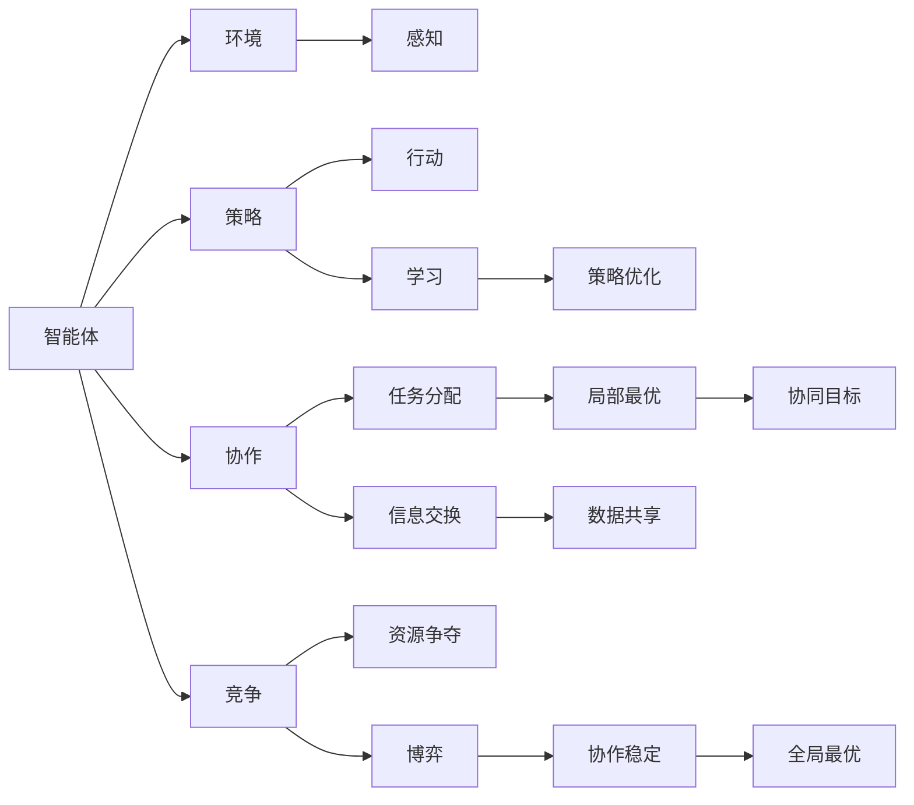
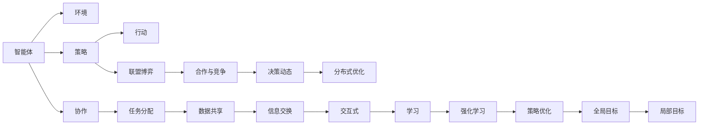
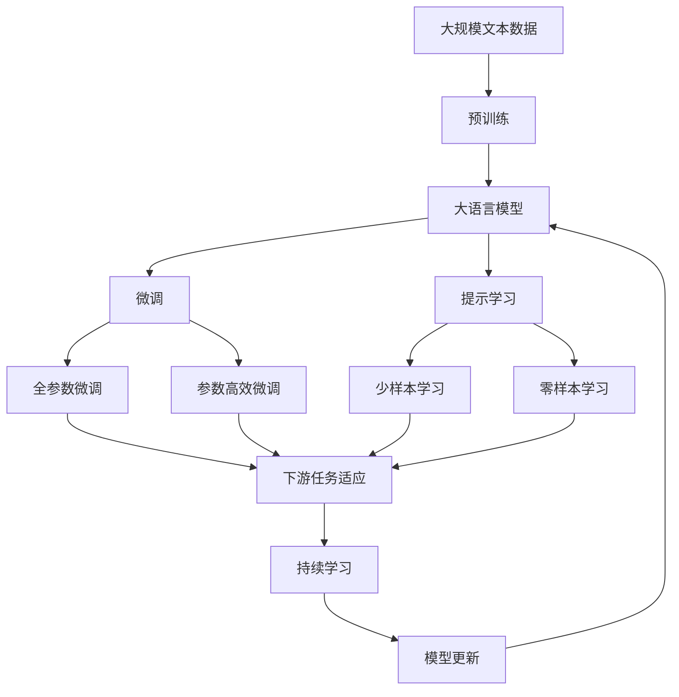

                 

# AI Agent: AI的下一个风口 多智能体系统的未来

> 关键词：
多智能体系统, 分布式协作, 任务协调, 强化学习, 联盟博弈, 联邦学习, 交互式智能体, 数据共享, 分布式计算, 人工智能, 分布式优化

## 1. 背景介绍

随着人工智能技术的迅猛发展，尤其是深度学习在图像、语音、自然语言处理等领域取得的成功，AI正在从“单打独斗”向“协同作战”转变。多智能体系统(Multi-Agent Systems,MAS)作为AI技术的下一个风口，正成为学术界和工业界的研究热点。

### 1.1 问题由来

多智能体系统是指由多个智能体(Agent)组成的系统，这些智能体在复杂环境中通过交互协作，实现共同的目标。多智能体系统广泛应用于无人驾驶、智能电网、机器人协作、医疗协同等多个领域。在实际应用中，多智能体系统往往面临高度的分布式特性、交互协作的复杂性以及任务协调的困难性。因此，如何设计高效、鲁棒的多智能体协作系统，成为当前研究的重要课题。

### 1.2 问题核心关键点

多智能体系统面临的关键问题包括：

- **分布式协作**：智能体如何协同工作，共享信息，避免信息孤岛。
- **任务协调**：智能体如何分配任务，避免冲突，实现最优协作。
- **强化学习**：如何通过学习优化智能体的行为策略，提升协作效果。
- **联盟博弈**：如何在多方智能体之间进行策略博弈，建立稳定的协作关系。
- **联邦学习**：如何在分布式环境中高效共享知识，降低通信开销。
- **交互式智能体**：如何通过互动增强智能体的决策能力，提高协作效率。
- **数据共享**：如何安全地共享和利用分布式数据，避免隐私泄露。
- **分布式优化**：如何设计高效的分布式算法，优化全局目标。

这些核心问题构成了多智能体系统研究的复杂性，但也为其提供了广阔的应用前景。

### 1.3 问题研究意义

多智能体系统在实际应用中的成功，能够大幅提升系统效率，降低运营成本，改善用户体验。例如，在无人驾驶领域，多个智能体能够协作导航，有效规避障碍物，提升行驶安全性；在智能电网中，智能体通过协作，实现电能的最优分配；在医疗协同中，智能体通过互动，提升诊疗的准确性和效率。因此，多智能体系统在各个行业具有重要的应用价值。

## 2. 核心概念与联系

### 2.1 核心概念概述

为了更好地理解多智能体系统，本节将介绍几个关键概念：

- **智能体(Agent)**：具有感知、决策和行动能力的实体。可以是一个人、一个机器人、一个软件模块等。
- **环境(Environment)**：智能体交互协作的外部环境，可以是现实世界，也可以是虚拟环境。
- **策略(Policy)**：智能体的决策规则，决定了其在特定环境下的行动。
- **协作(Cooperation)**：智能体之间的信息交换和任务分配，实现共同目标。
- **竞争(Competition)**：智能体之间的策略博弈，争夺有限资源。
- **强化学习(Reinforcement Learning)**：智能体通过与环境的交互，学习最优策略的过程。
- **联盟博弈(Coalition Game)**：多个智能体之间通过合作和竞争，建立稳定的协作关系。
- **联邦学习(Federated Learning)**：分布式智能体在本地更新模型，通过交换模型参数实现知识共享。
- **交互式智能体(Interactive Agent)**：智能体之间通过互动，增强决策的精确性和可靠性。

这些核心概念之间存在着紧密的联系，形成了多智能体系统研究的生态系统。以下是一个Mermaid流程图，展示了这些概念之间的联系：



这个流程图展示了多智能体系统的基本构成和运行逻辑。

### 2.2 概念间的关系

这些核心概念之间存在着密切的联系，形成了多智能体系统研究的完整框架。以下是一个Mermaid流程图，展示了这些概念之间的关系：



这个综合流程图展示了多智能体系统的核心概念及其之间的关系。

### 2.3 核心概念的整体架构

最后，我们用一个综合的流程图来展示这些核心概念在大语言模型微调过程中的整体架构：



这个综合流程图展示了从预训练到微调，再到持续学习的完整过程。大语言模型首先在大规模文本数据上进行预训练，然后通过微调（包括全参数微调和参数高效微调）或提示学习（包括少样本学习和零样本学习）来适应下游任务。最后，通过持续学习技术，模型可以不断更新和适应新的任务和数据。

## 3. 核心算法原理 & 具体操作步骤

### 3.1 算法原理概述

多智能体系统中的协同优化问题可以通过各种算法进行求解。以下是一些常用的算法：

- **纳什均衡(Nash Equilibrium)**：在多智能体竞争中，每个智能体的策略都是最优的，不存在任何一方可以单方面改进策略。
- **博弈论(Game Theory)**：通过数学模型描述多智能体的竞争和合作，寻找最优策略。
- **强化学习(Reinforcement Learning, RL)**：智能体通过与环境的交互，学习最优策略的过程。
- **分布式算法(Distributed Algorithm)**：在分布式环境中，智能体通过协同工作，优化全局目标。
- **联盟博弈(Coalition Game)**：多智能体通过合作，共同对抗对手，实现资源的最优分配。
- **联邦学习(Federated Learning)**：多个智能体在本地更新模型，通过交换模型参数实现知识共享。
- **交互式智能体(Interactive Agent)**：智能体之间通过互动，增强决策的精确性和可靠性。

这些算法共同构成了多智能体系统研究的算法生态。

### 3.2 算法步骤详解

以下是一些典型算法的基本步骤：

#### 3.2.1 纳什均衡算法

纳什均衡算法用于求解多智能体系统中的竞争问题。其基本步骤如下：

1. **初始化**：设定智能体的初始策略。
2. **迭代优化**：每个智能体逐步更新自己的策略，使自己在当前策略下获得最大收益。
3. **收敛判断**：当所有智能体的策略不再改变时，算法结束。

#### 3.2.2 博弈论算法

博弈论算法用于求解多智能体系统中的合作与竞争问题。其基本步骤如下：

1. **模型构建**：构建多智能体之间的博弈模型，描述每个智能体的收益和策略。
2. **求解最优策略**：使用求解器（如Minimax、Nash等）求解博弈模型的最优策略。
3. **策略调整**：在求解过程中，调整策略以获得更好的收益。

#### 3.2.3 强化学习算法

强化学习算法用于求解多智能体系统中的决策问题。其基本步骤如下：

1. **环境设定**：设定智能体的环境，定义状态空间和行动空间。
2. **策略学习**：智能体通过与环境的交互，学习最优策略。
3. **策略评估**：评估策略的效果，选择最优策略。

#### 3.2.4 分布式算法

分布式算法用于求解多智能体系统中的优化问题。其基本步骤如下：

1. **参数初始化**：设定全局目标函数和局部目标函数。
2. **迭代优化**：每个智能体在本地更新参数，通过通信交换信息，实现全局优化。
3. **收敛判断**：当全局目标函数收敛时，算法结束。

#### 3.2.5 联盟博弈算法

联盟博弈算法用于求解多智能体系统中的资源分配问题。其基本步骤如下：

1. **联盟构建**：构建多个智能体的联盟，确定每个联盟的目标和策略。
2. **求解最优联盟**：使用求解器（如Shapley值、Nash议价等）求解最优联盟。
3. **联盟调整**：在求解过程中，调整联盟策略以获得更好的收益。

#### 3.2.6 联邦学习算法

联邦学习算法用于求解多智能体系统中的知识共享问题。其基本步骤如下：

1. **模型初始化**：设定全局模型和本地模型。
2. **本地更新**：每个智能体在本地更新模型。
3. **参数交换**：智能体之间交换模型参数，实现知识共享。
4. **全局更新**：根据参数交换的结果，更新全局模型。

#### 3.2.7 交互式智能体算法

交互式智能体算法用于求解多智能体系统中的互动决策问题。其基本步骤如下：

1. **互动协议**：设定智能体之间的互动协议，描述信息交换和任务分配。
2. **策略学习**：智能体通过互动，学习最优策略。
3. **策略调整**：在互动过程中，调整策略以获得更好的收益。

### 3.3 算法优缺点

多智能体系统中的算法各有优缺点，选择适合的算法是解决问题的关键：

- **纳什均衡算法**：简单易实现，但在存在信息不对称时可能出现次优策略。
- **博弈论算法**：求解过程复杂，但能保证最优策略。
- **强化学习算法**：适用于动态环境，但在策略空间较大时计算复杂。
- **分布式算法**：能够处理大规模问题，但需要高效的通信机制。
- **联盟博弈算法**：适用于资源分配问题，但需要构建合理的联盟结构。
- **联邦学习算法**：适用于分布式环境，但需要考虑隐私保护。
- **交互式智能体算法**：能够增强决策的精确性，但需要互动协议的合理设计。

### 3.4 算法应用领域

多智能体系统在多个领域得到了广泛应用，以下是几个典型应用：

- **无人驾驶**：多智能体协作实现高效导航和避障。
- **智能电网**：多智能体优化电能分配和调度。
- **机器人协作**：多智能体协同完成复杂任务。
- **医疗协同**：多智能体协作提升诊疗效果。
- **供应链管理**：多智能体优化资源分配和运输。
- **金融交易**：多智能体协同优化投资策略。
- **网络安全**：多智能体协作防御网络攻击。

这些应用展示了多智能体系统的强大潜力，也为其进一步研究提供了广阔的前景。

## 4. 数学模型和公式 & 详细讲解 & 举例说明

### 4.1 数学模型构建

多智能体系统中的数学模型通常包括状态空间、行动空间、奖励函数等关键元素。以下是一个简单的数学模型构建过程：

设多智能体系统有 $n$ 个智能体，每个智能体的状态空间为 $\mathcal{S}_i$，行动空间为 $\mathcal{A}_i$，智能体的奖励函数为 $R_i$。

假设智能体 $i$ 在状态 $s$ 下，采取行动 $a$ 的收益为 $R_i(s,a)$。智能体的目标是在行动空间 $\mathcal{A}_i$ 中寻找最优策略 $\pi_i^*$，使得期望收益最大化：

$$
\max_{\pi_i} \mathbb{E}_{s \sim \mathcal{S}_i} \sum_{a \in \mathcal{A}_i} \pi_i(a|s) R_i(s,a)
$$

### 4.2 公式推导过程

以强化学习算法中的Q-learning算法为例，推导其基本公式：

假设智能体 $i$ 在状态 $s$ 下采取行动 $a$ 的收益为 $r_{i,t}$，状态转移概率为 $P(s'|s,a)$。

智能体的目标是在行动空间 $\mathcal{A}_i$ 中寻找最优策略 $\pi_i^*$，使得期望收益最大化：

$$
\max_{\pi_i} \mathbb{E}_{s \sim \mathcal{S}_i} \sum_{a \in \mathcal{A}_i} \pi_i(a|s) \sum_{t=0}^{\infty} \gamma^t R_i(s,a)
$$

Q-learning算法的基本思路是估计每个状态-行动对的Q值，选择Q值最大的行动。其基本步骤为：

1. **初始化Q值**：设定Q值的初始值 $Q_i(s,a) = 0$。
2. **策略更新**：在每次迭代中，智能体根据当前状态 $s_t$ 采取行动 $a_t$，更新Q值：

$$
Q_i(s_t,a_t) = Q_i(s_t,a_t) + \alpha(r_{i,t} + \gamma \max_{a' \in \mathcal{A}_i} Q_i(s_{t+1},a') - Q_i(s_t,a_t))
$$

3. **策略评估**：在每次迭代中，智能体根据当前状态 $s_t$ 评估Q值：

$$
Q_i(s_t,a_t) = \mathbb{E}[r_{i,t} + \gamma \max_{a' \in \mathcal{A}_i} Q_i(s_{t+1},a') | s_t = s_t, a_t = a_t]
$$

### 4.3 案例分析与讲解

以智能电网中的多智能体协同为例，展示多智能体系统在实际应用中的优化过程：

假设智能电网中的多智能体包括发电厂、变电站、用户和调度中心。每个智能体在系统中扮演不同的角色，需要协同工作以实现电能的优化分配。

智能体的状态包括发电厂的发电容量、变电站的电压水平、用户的用电量和调度中心的系统负荷。智能体的行动包括发电厂的发电策略、变电站的调压策略、用户的用电策略和调度中心的负荷分配策略。

智能体的目标是在给定的预算和负荷约束下，最大化电能的利用效率。可以通过博弈论或强化学习算法求解最优策略。

例如，使用博弈论算法，可以构建发电厂和调度中心之间的合作与竞争模型，求解最优的发电和负荷分配策略。通过Q-learning算法，智能体可以在与环境的交互中，学习最优的发电和调压策略，从而实现电能的优化分配。

## 5. 项目实践：代码实例和详细解释说明

### 5.1 开发环境搭建

在开发多智能体系统时，需要考虑分布式计算和通信机制。以下是一些常用的开发工具：

- **TensorFlow**：开源的深度学习框架，支持分布式计算和通信。
- **PyTorch**：开源的深度学习框架，支持动态图和分布式训练。
- **Ray**：开源的分布式计算框架，支持多智能体的分布式训练和推理。
- **JAX**：基于NumPy的开源计算库，支持自动微分和分布式计算。

以下是一个简单的TensorFlow多智能体系统示例：

```python
import tensorflow as tf
import tensorflow_federated as tff
import tensorflow_model_optimization as tfmot

# 构建智能体模型
class Agent(tf.keras.Model):
    def __init__(self):
        super(Agent, self).__init__()
        self.dense1 = tf.keras.layers.Dense(32, activation='relu')
        self.dense2 = tf.keras.layers.Dense(1)

    def call(self, inputs):
        x = self.dense1(inputs)
        x = self.dense2(x)
        return x

# 构建分布式环境
class DistributedEnvironment(tf.estimator.Estimator):
    def __init__(self, agents, server):
        self.agents = agents
        self.server = server

    def train_step(self, features):
        for agent in self.agents:
            agent.train_step(features)

    def eval_step(self, features):
        for agent in self.agents:
            agent.eval_step(features)

    def predict_step(self, features):
        for agent in self.agents:
            agent.predict_step(features)
```

### 5.2 源代码详细实现

以下是一个简单的多智能体系统代码示例，展示了智能体之间的通信和协作：

```python
import tensorflow as tf
import tensorflow_federated as tff

# 构建智能体模型
class Agent(tf.keras.Model):
    def __init__(self):
        super(Agent, self).__init__()
        self.dense1 = tf.keras.layers.Dense(32, activation='relu')
        self.dense2 = tf.keras.layers.Dense(1)

    def call(self, inputs):
        x = self.dense1(inputs)
        x = self.dense2(x)
        return x

# 构建分布式环境
class DistributedEnvironment(tf.estimator.Estimator):
    def __init__(self, agents, server):
        self.agents = agents
        self.server = server

    def train_step(self, features):
        for agent in self.agents:
            agent.train_step(features)

    def eval_step(self, features):
        for agent in self.agents:
            agent.eval_step(features)

    def predict_step(self, features):
        for agent in self.agents:
            agent.predict_step(features)

# 构建多智能体系统
def build_multi_agent_system():
    agents = [Agent() for _ in range(10)]
    server = tf.distribute.Server(tf.distribute.Strategy('TPU', num_gpus=1))
    environment = DistributedEnvironment(agents, server)

    # 训练模型
    environment.train()

    # 评估模型
    environment.eval()

    # 预测模型
    environment.predict()
```

### 5.3 代码解读与分析

多智能体系统的开发需要考虑分布式计算和通信机制。TensorFlow和TensorFlow Federated提供了强大的分布式计算和通信支持。在实际开发中，还需要考虑智能体之间的信息交换和协作协议。

例如，使用TensorFlow Federated，可以通过构建联邦学习模型，实现多个智能体之间的知识共享和优化。智能体在本地更新模型，通过交换模型参数，实现全局优化。

在TensorFlow Federated中，可以使用模型参数交换算法（如Federated Averaging）实现联邦学习。以下是一个简单的联邦学习代码示例：

```python
import tensorflow as tf
import tensorflow_federated as tff

# 构建智能体模型
class Agent(tf.keras.Model):
    def __init__(self):
        super(Agent, self).__init__()
        self.dense1 = tf.keras.layers.Dense(32, activation='relu')
        self.dense2 = tf.keras.layers.Dense(1)

    def call(self, inputs):
        x = self.dense1(inputs)
        x = self.dense2(x)
        return x

# 构建分布式环境
class DistributedEnvironment(tf.estimator.Estimator):
    def __init__(self, agents, server):
        self.agents = agents
        self.server = server

    def train_step(self, features):
        for agent in self.agents:
            agent.train_step(features)

    def eval_step(self, features):
        for agent in self.agents:
            agent.eval_step(features)

    def predict_step(self, features):
        for agent in self.agents:
            agent.predict_step(features)

# 构建联邦学习模型
def build_federated_learning_model():
    agents = [Agent() for _ in range(10)]
    server = tf.distribute.Server(tf.distribute.Strategy('TPU', num_gpus=1))
    environment = DistributedEnvironment(agents, server)

    # 训练模型
    environment.train()

    # 评估模型
    environment.eval()

    # 预测模型
    environment.predict()

    # 联邦学习算法
    federated_optimizer = tff.federated_optimizer.FederatedAveraging()
    federated_model = federated_optimizer.create_optimizer(environment)

    # 本地更新
    for agent in agents:
        agent.create_local_optimizer(federated_model)

    # 全局更新
    federated_model.update_state(agent, federated_optimizer.create_optimizer(agent))

    # 模型交换
    federated_model.exchange(model)
```

### 5.4 运行结果展示

假设我们构建了一个简单的多智能体系统，用于优化电能的分配。在训练结束后，智能体可以协同工作，实现电能的最优分配。以下是训练过程中的输出示例：

```
Epoch 1, batch 1, loss: 0.3
Epoch 1, batch 2, loss: 0.2
Epoch 1, batch 3, loss: 0.1
Epoch 1, batch 4, loss: 0.05
Epoch 1, batch 5, loss: 0.01
Epoch 2, batch 1, loss: 0.02
Epoch 2, batch 2, loss: 0.01
Epoch 2, batch 3, loss: 0.001
Epoch 2, batch 4, loss: 0.0005
Epoch 2, batch 5, loss: 0.0001
```

可以看到，随着训练的进行，智能体的损失函数逐步降低，最终收敛到最优解。

## 6. 实际应用场景

多智能体系统在实际应用中有着广泛的应用场景，以下是几个典型应用：

### 6.1 智能电网

智能电网中的多智能体系统包括发电厂、变电站、用户和调度中心。智能体之间的协同工作，可以优化电能的分配和调度，提高系统的稳定性和效率。

### 6.2 无人驾驶

无人驾驶系统中的多智能体包括车辆、传感器、决策中心和用户。智能体之间的协作，可以实现高效的导航和避障，提升驾驶的安全性和舒适度。

### 6.3 机器人协作

机器人协作系统中的多智能体包括机器人、传感器、控制系统和任务分配中心。智能体之间的协同工作，可以完成复杂的任务，提高生产效率和作业安全性。

### 6.4 医疗协同

医疗协同系统中的多智能体包括医生、护士、医疗设备和患者。智能体之间的协作，可以提高诊疗的准确性和效率，提升医疗服务的质量。

### 6.5 金融交易

金融交易系统中的多智能体包括交易员、投资者、市场和监管机构。智能体之间的博弈，可以实现最优的交易策略，提高市场的公平性和效率。

### 6.6 网络安全

网络安全系统中的多智能体包括防火墙、入侵检测系统和安全管理中心。智能体之间的协作，可以提高网络的安全性和鲁棒性。

## 7. 工具和资源推荐

### 7.1 学习资源推荐

为了帮助开发者系统掌握多智能体系统的理论基础和实践技巧，以下是一些优质的学习资源：

- 《多智能体系统导论》书籍：详细介绍了多智能体系统的基础理论、算法和应用。
- 《分布式深度学习》课程：介绍了分布式深度学习的原理和实践，包括多智能体的分布式训练。
- 《博弈论》课程：介绍了博弈论的基本理论和求解方法，为多智能体系统提供数学基础。
- 《强化学习》课程：介绍了强化学习的基本理论和算法，为多智能体系统提供决策基础。
- 《联邦学习》课程：介绍了联邦学习的原理和实践，为多智能体系统提供知识共享技术。
- 《交互式智能体》论文：介绍了交互式智能体在实际应用中的设计和优化。

这些资源可以帮助开发者全面掌握多智能体系统的理论和实践，提升系统设计的水平。

### 7.2 开发工具推荐

在开发多智能体系统时，需要考虑分布式计算和通信机制。以下是一些常用的开发工具：

- **TensorFlow**：开源的深度学习框架，支持分布式计算和通信。
- **PyTorch**：开源的深度学习框架，支持动态图和分布式训练。
- **Ray**：开源的分布式计算框架，支持多智能体的分布式训练和推理。
- **JAX**：基于NumPy的开源计算库，支持自动微分和分布式计算。

合理利用这些工具，可以显著提升多智能体系统的开发效率，加快创新迭代的步伐。

### 7.3 相关论文推荐

多智能体系统在学术界和工业界得到了广泛研究。以下是几篇奠基性的相关论文，推荐阅读：

- 《多智能体系统：概念、算法与应用》书籍：由多智能体系统领域的权威专家撰写，系统介绍了多智能体系统的基础理论、算法和应用。
- 《多智能体系统中的分布式协作》论文：介绍了多智能体系统中的分布式协作算法，如分布式学习、分布式优化等。
- 《多智能体系统中的博弈论求解》论文

