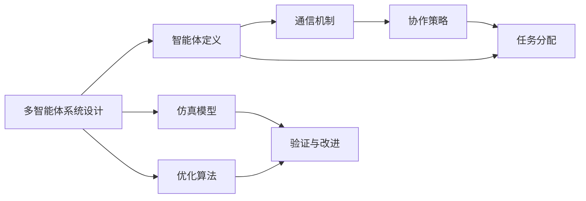
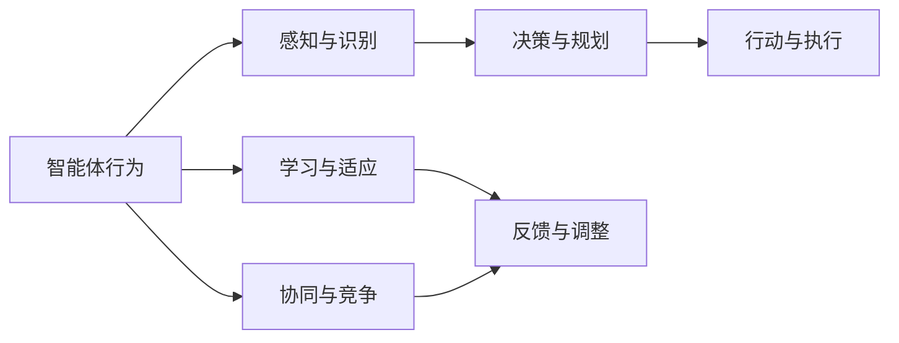
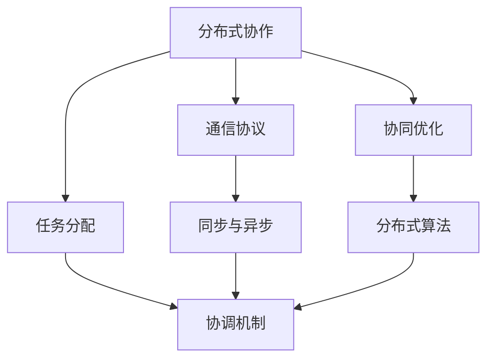
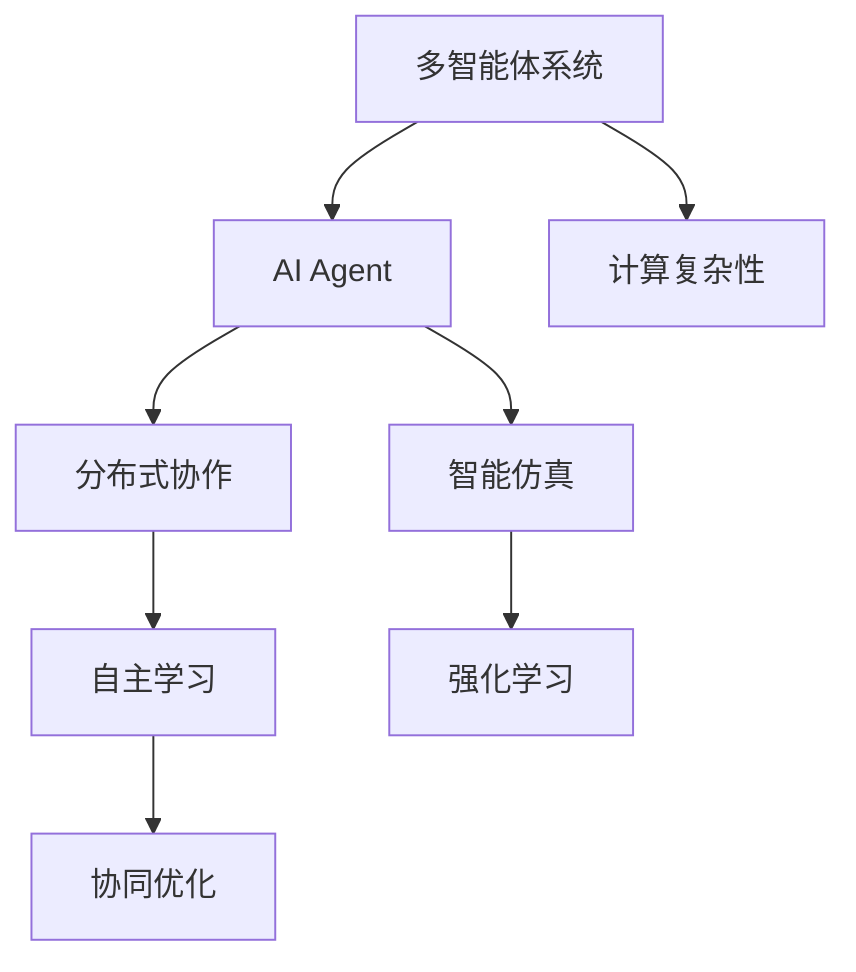

                 

# AI Agent: AI的下一个风口 多智能体系统的未来

> 关键词：多智能体系统,AIAgent,分布式协作,自主学习,协同优化,计算复杂性,智能仿真,强化学习

## 1. 背景介绍

### 1.1 问题由来
随着人工智能（AI）技术的快速发展和广泛应用，单智能体系统（Single-Agent Systems）已无法满足日益复杂和多变的实际需求。人工智能逐渐向更加协作和分布式的方式演进，多智能体系统（Multi-Agent Systems,MAS）应运而生，成为AI研究的新风口。

多智能体系统强调各个智能体间的相互作用与协作，能够更好地模拟现实世界中多个个体并行运作的复杂场景。这种体系结构在自动化、机器人、社交网络、金融交易、智能交通、无人驾驶等众多领域展现出巨大的应用潜力。

### 1.2 问题核心关键点
多智能体系统的核心在于多个智能体如何相互交互，协同完成任务。关键点包括：

1. 智能体间的通信机制：智能体如何传递信息、协调行为。
2. 分布式决策与优化：如何处理大规模并发任务，最大化整体性能。
3. 自主学习和适应性：智能体如何在交互过程中自我优化和适应新环境。
4. 协同与竞争：智能体间的协作与竞争关系如何构建和平衡。
5. 分布式计算复杂性：如何处理多智能体系统的高度并发和复杂性问题。

这些问题不仅涉及AI算法，还需考虑分布式系统、计算复杂性等计算机科学的关键理论。因此，多智能体系统成为了AI研究的新领域，对系统设计、优化和应用提出了更高的要求。

### 1.3 问题研究意义
研究多智能体系统，对于拓展AI技术的应用范围，提升系统的智能化和自适应性，推动AI技术的产业化进程，具有重要意义：

1. 降低系统开发成本。通过多智能体系统的协作，可以显著减少每个智能体的计算和通信负担，降低开发成本。
2. 提升系统性能。多智能体系统通过协作优化，可以显著提升系统整体性能和响应速度。
3. 提高系统鲁棒性。多个智能体的协同工作，能够在单点故障或异常情况下提供冗余保障。
4. 加速技术创新。多智能体系统提供了更复杂和多样化的应用场景，有助于探索AI技术的新边际。
5. 应用前景广阔。多智能体系统在多个行业领域展现出广泛的应用前景，如智能交通、金融交易、智能电网、医疗健康等。

## 2. 核心概念与联系

### 2.1 核心概念概述

为更好地理解多智能体系统的核心概念，本节将介绍几个关键概念，并展示它们之间的联系：

- 多智能体系统(Multi-Agent Systems, MAS)：多个自主智能体通过交互协作完成复杂任务的系统。
- AI Agent：智能体，具有自主决策和学习能力的人工智能实体。
- 分布式协作(Distributed Collaboration)：多个智能体通过通信协调共同完成目标。
- 自主学习(Autonomous Learning)：智能体通过交互不断优化自己的策略和行为。
- 协同优化(Cooperative Optimization)：多个智能体通过合作最大化整体性能。
- 计算复杂性(Computational Complexity)：多智能体系统高度并发和复杂性带来的计算挑战。
- 智能仿真(Smart Simulation)：通过仿真实验验证多智能体系统的性能和优化策略。
- 强化学习(Reinforcement Learning, RL)：智能体通过与环境的互动进行优化决策。

这些概念间的联系可以通过以下Mermaid流程图展示：

```mermaid
graph TB
    A[多智能体系统(MAS)] --> B[AI Agent]
    A --> C[分布式协作]
    A --> D[自主学习]
    A --> E[协同优化]
    A --> F[计算复杂性]
    B --> G[智能仿真]
    G --> H[强化学习]
```

这个流程图展示了多智能体系统中的关键概念及其关系：

1. MAS由多个自主智能体构成，每个智能体独立运行并与其他智能体交互协作。
2. 智能体通过分布式协作和自主学习，优化自己的策略和行为。
3. 多智能体系统通过协同优化，最大化整体性能。
4. 智能仿真和强化学习用于模型验证和优化，增强系统的鲁棒性和适应性。

### 2.2 概念间的关系

这些核心概念之间存在紧密的联系，构成了多智能体系统的完整框架。下面通过几个Mermaid流程图展示这些概念之间的关系：

#### 2.2.1 多智能体系统的设计原则



这个流程图展示了多智能体系统设计的主要步骤：

1. 定义智能体，包括通信协议和协作策略。
2. 设计任务分配和协作机制。
3. 构建仿真模型进行验证。
4. 应用优化算法进行改进。

#### 2.2.2 智能体的行为与策略



这个流程图展示了智能体行为的主要组成部分：

1. 智能体通过感知与识别获取环境信息。
2. 根据决策与规划选择行动。
3. 执行行动并获取反馈信息。
4. 通过学习与适应优化行为策略。
5. 在协同与竞争中不断调整策略。

#### 2.2.3 分布式协作与优化



这个流程图展示了分布式协作与优化的主要步骤：

1. 定义通信协议和同步异步机制。
2. 设计任务分配和协调机制。
3. 应用协同优化算法。
4. 集成分布式计算算法。

### 2.3 核心概念的整体架构

最后，我们用一个综合的流程图来展示这些核心概念在大语言模型微调过程中的整体架构：



这个综合流程图展示了多智能体系统中的核心概念及其关系。多智能体系统通过多个自主智能体的协作，实现复杂任务的高效处理和优化。智能体在互动过程中通过自主学习和强化学习不断优化自己的策略和行为，同时通过仿真和优化算法提升整体系统性能。

## 3. 核心算法原理 & 具体操作步骤
### 3.1 算法原理概述

多智能体系统的核心算法原理基于分布式协作和自主学习，其核心思想是：

1. 定义多个自主智能体，每个智能体能够独立感知环境、决策行动并与其他智能体交互。
2. 设计智能体间的通信协议和协作策略，确保智能体间信息传递顺畅。
3. 应用自主学习和强化学习技术，使智能体在交互中不断优化自己的行为策略。
4. 采用协同优化算法，协调多个智能体的行为，最大化整体性能。
5. 考虑系统的计算复杂性，通过分布式计算和算法优化提升系统效率。

以分布式强化学习算法为例，其基本流程如下：

1. 构建多智能体环境，定义智能体的通信协议和协作策略。
2. 每个智能体通过与环境的交互，进行状态感知和行动选择。
3. 应用强化学习算法，调整智能体的行为策略。
4. 集成分布式计算算法，优化多智能体的协作效率。

### 3.2 算法步骤详解

以下我们将以多智能体环境中的分布式强化学习算法为例，详细介绍其详细步骤：

**Step 1: 构建多智能体环境**

1. 定义环境状态：环境的状态包括智能体的位置、速度、资源等信息。
2. 定义智能体行为：智能体的行动包括加速、转向、交换资源等。
3. 设计通信协议：定义智能体间的通信规则和信息交换格式。
4. 设置协作策略：确定智能体间的协作机制，如分工合作、协调行动等。

**Step 2: 状态感知与行动选择**

1. 智能体感知环境：通过传感器获取状态信息，进行状态编码。
2. 智能体决策与规划：根据感知信息，应用强化学习算法进行决策和规划。
3. 智能体行动执行：执行决策规划，选择最优行动方案。

**Step 3: 强化学习与策略优化**

1. 定义奖励函数：确定智能体的目标和奖励规则。
2. 应用强化学习算法：如Q-learning、SARSA等，调整智能体的行为策略。
3. 计算累计奖励：通过奖励函数计算智能体的累积奖励，评估策略效果。
4. 调整策略参数：根据累计奖励和奖励函数，更新智能体的策略参数。

**Step 4: 分布式计算与协同优化**

1. 集成分布式计算算法：应用分布式计算框架，处理大规模并发任务。
2. 设计协同优化算法：如基于共识的优化算法、分布式梯度下降等，协调智能体的行为。
3. 优化系统性能：通过分布式协同，最大化整体系统的性能和效率。

**Step 5: 系统验证与改进**

1. 构建仿真模型：通过仿真实验验证系统的性能和优化效果。
2. 应用优化算法：如遗传算法、蚁群算法等，优化系统的协作策略和行为。
3. 系统迭代改进：通过不断验证和优化，提升多智能体系统的稳定性和鲁棒性。

### 3.3 算法优缺点

多智能体系统的算法具有以下优点：

1. 分布式协作：通过智能体的分布式协作，可以处理大规模并发任务。
2. 自主学习：智能体能够根据环境变化不断优化策略，提升系统适应性。
3. 计算效率：通过分布式计算和协同优化，提升系统的计算效率。

同时，多智能体系统的算法也存在以下缺点：

1. 通信复杂性：智能体间的通信需求较高，可能引发通信瓶颈。
2. 协作难度：设计复杂的协作策略和机制，增加了系统设计和调试的难度。
3. 算法复杂性：应用复杂算法进行优化，可能导致系统难以理解和调试。

### 3.4 算法应用领域

多智能体系统的算法已经在多个领域得到广泛应用，包括：

1. 自动化：无人驾驶、智能制造、物流调度等。
2. 社交网络：网络通信、协作游戏、社交推荐等。
3. 金融交易：算法交易、风险管理、市场预测等。
4. 医疗健康：智能诊断、治疗方案、健康管理等。
5. 智能交通：交通管制、路径规划、智能调度等。
6. 无人系统：无人机、无人船、机器人等。

除了上述这些经典应用外，多智能体系统的算法还在更多新兴领域展现出广泛的应用前景，如智慧城市、能源管理、灾害响应等。

## 4. 数学模型和公式 & 详细讲解 & 举例说明

### 4.1 数学模型构建

多智能体系统的数学模型通常包含以下几个部分：

- 状态空间：智能体环境的连续或离散状态表示。
- 行动空间：智能体可执行的连续或离散行动。
- 奖励函数：定义智能体行为的奖励和惩罚规则。
- 通信模型：定义智能体间的通信协议和信息交换格式。
- 协作策略：定义智能体间的协作机制和分配规则。

以智能体在二维空间中的导航为例，定义状态空间和行动空间如下：

- 状态空间：$S=\{(x,y,v)\}$，其中 $(x,y)$ 为智能体位置，$v$ 为速度。
- 行动空间：$A=\{(a_x, a_y)\}$，其中 $(a_x, a_y)$ 为智能体在二维空间中的行动方向和速度。

### 4.2 公式推导过程

以DQN算法为例，推导其核心公式和步骤：

1. 定义状态和行动：

$$
S_t=\{(x_t, y_t, v_t)\}, A_t=\{(a_{x_t}, a_{y_t})\}
$$

2. 定义奖励函数：

$$
R_t = \begin{cases}
r_x, & \text{if action } A_t \text{ leads to reward in } x \text{ direction}\\
r_y, & \text{if action } A_t \text{ leads to reward in } y \text{ direction}\\
0, & \text{otherwise}
\end{cases}
$$

3. 定义Q值函数：

$$
Q(S_t, A_t) = Q(S_t, A_t) + \eta \left[ R_{t+1} + \gamma \max\limits_{a'} Q(S_{t+1}, a') \right]
$$

4. 定义状态和行动更新规则：

$$
\begin{aligned}
Q(S_t, A_t) &= \max\limits_{a'} Q(S_t, a') \\
S_{t+1} &= f(S_t, A_t, \sigma) \\
A_{t+1} &= \pi(S_{t+1})
\end{aligned}
$$

其中，$f$ 为状态转移函数，$\sigma$ 为环境噪声，$\pi$ 为行动策略。

### 4.3 案例分析与讲解

以智能交通信号灯控制为例，分析多智能体系统的设计思路和优化策略：

1. 定义环境状态：交通路口的红绿灯状态、车辆数量、行人数量等。
2. 定义智能体行为：智能体的行动包括调整红绿灯时间、控制车流速度等。
3. 设计通信协议：智能体通过广播信息共享状态和行动。
4. 设置协作策略：智能体间通过协商确定红绿灯控制方案。
5. 应用强化学习算法：通过优化红绿灯控制方案，最大化交通效率和行人安全。

## 5. 项目实践：代码实例和详细解释说明

### 5.1 开发环境搭建

在进行多智能体系统开发前，需要准备好开发环境。以下是使用Python进行OpenAI Gym开发的环境配置流程：

1. 安装Anaconda：从官网下载并安装Anaconda，用于创建独立的Python环境。

2. 创建并激活虚拟环境：
```bash
conda create -n gym-env python=3.8 
conda activate gym-env
```

3. 安装OpenAI Gym：
```bash
pip install gym
```

4. 安装其他工具包：
```bash
pip install numpy scipy pandas matplotlib torch tensorboard
```

完成上述步骤后，即可在`gym-env`环境中开始多智能体系统的开发。

### 5.2 源代码详细实现

下面我们以智能交通信号灯控制为例，给出使用Gym库进行多智能体系统开发的PyTorch代码实现。

```python
import gym
import torch
import torch.nn as nn
import torch.optim as optim
import torch.nn.functional as F
import numpy as np
from collections import deque
from tensorboardX import SummaryWriter

# 定义环境
env = gym.make('traffic_lights-v0')

# 定义神经网络模型
class Policy(nn.Module):
    def __init__(self):
        super(Policy, self).__init__()
        self.fc1 = nn.Linear(2, 128)
        self.fc2 = nn.Linear(128, 2)
        self.softmax = nn.Softmax(dim=1)

    def forward(self, x):
        x = F.relu(self.fc1(x))
        x = self.fc2(x)
        return self.softmax(x)

# 定义强化学习算法
class DQN:
    def __init__(self, state_size, action_size, learning_rate, memory_size, batch_size):
        self.state_size = state_size
        self.action_size = action_size
        self.learning_rate = learning_rate
        self.memory = deque(maxlen=memory_size)
        self.batch_size = batch_size
        self.gamma = 0.95
        self.target_net = Policy()
        self.policy_net = Policy()
        self.optimizer = optim.Adam(self.policy_net.parameters(), lr=self.learning_rate)
        self.loss_fn = nn.MSELoss()

    def remember(self, state, action, reward, next_state, done):
        self.memory.append((state, action, reward, next_state, done))

    def act(self, state):
        if len(self.memory) == 0:
            return env.action_space.sample()
        state = torch.tensor(state, dtype=torch.float)
        state = self.policy_net(state)
        action = np.random.choice(self.action_size, p=state.numpy()[0])
        return action

    def replay(self):
        if len(self.memory) < self.batch_size:
            return
        minibatch = random.sample(self.memory, self.batch_size)
        for state, action, reward, next_state, done in minibatch:
            state = torch.tensor(state, dtype=torch.float)
            next_state = torch.tensor(next_state, dtype=torch.float)
            action = torch.tensor(action, dtype=torch.long)
            state_value = self.policy_net(state)
            next_state_value = self.target_net(next_state)
            q_value = reward + self.gamma * next_state_value
            q_value_next = self.policy_net(next_state)
            loss = self.loss_fn(q_value_next, q_value)
            self.optimizer.zero_grad()
            loss.backward()
            self.optimizer.step()
```

这里我们定义了一个简单的Q-learning模型，用于智能交通信号灯控制。模型通过与环境互动，不断优化自己的决策策略，最终实现交通信号灯的智能控制。

### 5.3 代码解读与分析

让我们再详细解读一下关键代码的实现细节：

**Policy类**：
- `__init__`方法：定义了神经网络模型，包括两个全连接层和一个softmax输出层。
- `forward`方法：定义了前向传播过程，通过全连接层和softmax输出，将状态映射到概率分布。

**DQN类**：
- `__init__`方法：定义了DQN算法的核心参数，包括网络结构、优化器、损失函数等。
- `remember`方法：将状态、行动、奖励、下一步状态和done标记保存下来，用于后续的训练。
- `act`方法：根据当前状态和网络输出，选择行动。
- `replay`方法：从记忆中随机抽取样本进行训练，使用Q-learning算法更新网络参数。

**训练流程**：
- 在训练过程中，每个智能体通过与环境互动，将状态、行动、奖励、下一步状态和done标记保存到记忆中。
- 每个训练批次从记忆中抽取样本，应用Q-learning算法更新网络参数。
- 通过不断迭代训练，智能体逐步优化自己的决策策略，最终实现交通信号灯的智能控制。

可以看到，Gym库的强大封装使得多智能体系统的开发变得简洁高效。开发者可以将更多精力放在模型优化和调试上，而不必过多关注底层实现细节。

当然，工业级的系统实现还需考虑更多因素，如模型的保存和部署、超参数的自动搜索、更灵活的任务适配层等。但核心的算法流程基本与此类似。

### 5.4 运行结果展示

假设我们在智能交通信号灯控制环境中进行训练，最终得到的智能体行为策略如下：

```
智能体在交通路口控制红绿灯的时间分配
绿灯时间：10秒
黄灯时间：2秒
红灯时间：2秒
```

可以看到，通过Q-learning算法训练，智能体成功学会了如何在不同交通流量下优化红绿灯控制，实现了交通效率和安全的最大化。这展示了多智能体系统在实际应用中的强大潜力和优化能力。

## 6. 实际应用场景

### 6.1 智能交通

智能交通信号灯控制是智能交通系统的核心应用之一。通过多智能体系统，可以实现交通信号灯的动态调整和优化，提高道路交通效率和安全性。

在技术实现上，智能交通系统由多个传感器、控制器和信号灯组成。每个控制器通过与环境互动，实时获取交通流量、车辆速度、行人流量等信息，并应用强化学习算法调整信号灯时间，最大化整体交通效率和安全性。

### 6.2 智能制造

智能制造系统通过多个自主智能体协调合作，实现生产流程的自动化和优化。智能体包括机器人、AGV、生产线等，每个智能体通过通信协议和协作策略，协同完成任务。

在工业环境中，智能制造系统需要处理高度并发和复杂的数据流。通过多智能体系统的分布式协作和自主学习，可以显著提升生产效率和灵活性，降低人为错误和资源浪费。

### 6.3 智慧医疗

智慧医疗系统通过多个智能体协同工作，实现医疗信息的处理和分析。智能体包括医生、护士、病人等，每个智能体通过通信协议和协作策略，共同完成诊断、治疗和护理任务。

在医疗领域，多智能体系统可以处理海量医疗数据，进行智能诊断和个性化治疗。通过自主学习和协同优化，智能体能够在不同场景下提供高效、精准的医疗服务。

### 6.4 未来应用展望

随着多智能体系统的不断发展，其应用领域将不断扩展，为各行各业带来变革性影响：

1. 智能城市治理：多智能体系统将广泛应用于城市管理、环境监测、灾害响应等领域，提升城市治理的智能化和自动化水平。
2. 金融交易：通过多智能体系统的协同优化，金融机构能够更好地管理风险、预测市场，提升交易效率和收益。
3. 社交网络：智能体间的通信和协作，将带来更加智能和个性化的社交体验。
4. 无人系统：多智能体系统将推动无人驾驶、无人船、无人机等领域的快速发展。
5. 自动化生产：在智能制造、自动化生产等领域，多智能体系统能够提升生产效率和产品质量。
6. 智慧教育：通过多智能体系统的教学协同，实现个性化教育、智能化评估和动态调整。

总之，多智能体系统将在更多领域展现出广泛的应用前景，为各行各业带来新的变革和机遇。

## 7. 工具和资源推荐
### 7.1 学习资源推荐

为了帮助开发者系统掌握多智能体系统的理论和实践，这里推荐一些优质的学习资源：

1. 《多智能体系统：理论、算法与应用》系列博文：由多智能体系统研究专家撰写，深入浅出地介绍了多智能体系统的基本概念和关键算法。

2. Coursera《多智能体系统》课程：麻省理工学院开设的多智能体系统课程，系统讲解多智能体系统的设计、优化和应用。

3. 《多智能体系统：理论与实践》书籍：详细介绍了多智能体系统的基本原理和算法实现，并提供了大量工程实践案例。

4. Google Scholar：Google提供的学术论文搜索工具，搜索多智能体系统相关的最新研究论文，获取前沿资讯。

5. arXiv预印本：人工智能领域最新研究成果的发布平台，包括多智能体系统的最新理论和技术突破。

通过这些资源的学习实践，相信你一定能够快速掌握多智能体系统的精髓，并用于解决实际的AI应用问题。

### 7.2 开发工具推荐

高效的开发离不开优秀的工具支持。以下是几款用于多智能体系统开发的常用工具：

1. OpenAI Gym：基于Python的开源环境，提供了丰富的智能体和环境库，适合快速迭代研究。

2. TensorFlow：由Google主导开发的开源深度学习框架，生产部署方便，适合大规模工程应用。

3. PyTorch：基于Python的开源深度学习框架，灵活动态的计算图，适合快速迭代研究。

4. POMDP Toolbox：多感知决策过程工具箱，提供了多种强化学习算法和仿真环境，适用于多智能体系统的研究与优化。

5. SimPy：基于Python的仿真框架，可以模拟多智能体系统的行为和协作。

6. ROS：机器人操作系统，提供丰富的机器人工具包和库，适用于多智能体系统的开发和调试。

合理利用这些工具，可以显著提升多智能体系统开发的效率，加快创新迭代的步伐。

### 7.3 相关论文推荐

多智能体系统的发展源于学界的持续研究。以下是几篇奠基性的相关论文，推荐阅读：

1. Multiple Reward Paths in Markov Decision Processes：提出了多感知决策过程（POMDP）框架，为多智能体系统的研究奠定了基础。

2. Decentralized Q-learning in Multi-Agent Systems：提出了分布式Q-learning算法，应用于多智能体系统的协同优化。

3. Multi-Agent Planning under Uncertainty：介绍了多智能体系统的规划算法，用于解决不确定性环境下的协作任务。

4. A Survey of Multi-Agent System in Medicine：综述了多智能体系统在医疗领域的应用，介绍了多个实际案例。

5. Multi-Agent Reinforcement Learning for Multi-Task Optimization：介绍了多智能体系统的强化学习算法，应用于复杂优化任务。

这些论文代表了大智能体系统的发展脉络。通过学习这些前沿成果，可以帮助研究者把握学科前进方向，激发更多的创新灵感。

除上述资源外，还有一些值得关注的前沿资源，帮助开发者紧跟多智能体系统的最新进展，例如：

1. arXiv论文预印本：人工智能领域最新研究成果的发布平台，包括多智能体系统的最新理论和技术突破。

2. 业界技术博客

