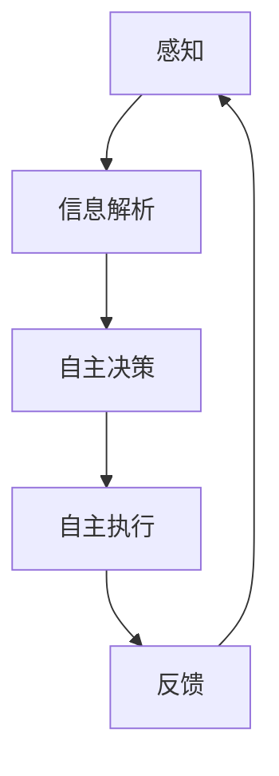

                 

# AI Agent: AI的下一个风口 感知和解析环境与自主决策

> 关键词：人工智能,自主决策,环境感知,智能代理,机器人技术,深度学习,强化学习,自主学习,自主执行

## 1. 背景介绍

### 1.1 问题由来
人工智能（AI）作为21世纪最为活跃的技术领域之一，正逐渐从传统的基于规则和专家系统的知识驱动向基于深度学习与强化学习的智能驱动转变。这种转变不仅使得AI技术在各种应用场景中展现出前所未有的优势，也为未来智能代理(AI Agent)技术的发展奠定了基础。

智能代理，或者称为自主决策实体，是一个能够感知、解析环境并据此自主行动的计算实体。例如，无人驾驶汽车、工业机器人、智慧城市系统等都是智能代理应用的典型例子。这些智能代理通过深度学习、强化学习等技术，不断从环境中学习和适应，实现了复杂任务的高效执行。

### 1.2 问题核心关键点
智能代理技术集成了感知、决策、执行三大核心组件，主要包含以下几个方面：

- **环境感知**：通过传感器、视觉、语音等手段，感知周围环境和用户输入。
- **信息解析**：将感知数据进行语义处理，提取关键信息。
- **自主决策**：根据目标和规则，选择最优行动策略。
- **自主执行**：根据决策结果，控制实体运动和行为。

这些组件的协同工作使得智能代理具备自主学习、自主执行的能力，能够在复杂多变的环境中完成既定任务。

### 1.3 问题研究意义
智能代理技术的研究和应用，对于推动人工智能技术的产业化进程、提升生活质量、促进经济社会发展具有重要意义：

1. **提高效率**：智能代理能够自动处理大量重复性任务，减少人工干预，提升工作效率。
2. **改善用户体验**：智能代理能够提供更为个性化、智能化的服务，提升用户满意度。
3. **降低成本**：智能代理能够自动化执行复杂任务，降低人力和物力成本。
4. **创新应用**：智能代理技术推动了各种创新应用的涌现，促进了新产业的发展。
5. **社会价值**：智能代理在智慧医疗、智慧交通、智慧安防等领域的应用，提升了社会治理能力。

## 2. 核心概念与联系

### 2.1 核心概念概述

为了更好地理解智能代理技术，本节将介绍几个关键概念：

- **智能代理(AI Agent)**：能够自主感知、决策和执行任务的计算实体，具备高度智能化和自动化能力。
- **感知**：通过传感器、视觉、语音等手段获取环境信息的过程，是智能代理的前提。
- **信息解析**：将感知数据转换为机器可理解的信息，是智能代理的核心。
- **自主决策**：根据目标和规则，选择最优行动策略的过程，是智能代理的核心。
- **自主执行**：根据决策结果，控制实体运动和行为的过程，是智能代理的核心。

这些核心概念之间存在着紧密的联系，形成了一个完整的智能代理技术生态系统。

### 2.2 概念间的关系

智能代理技术中的核心概念关系可以通过以下Mermaid流程图来展示：



这个流程图展示了智能代理技术的主要流程：

1. 感知环境，获取数据。
2. 解析数据，提取信息。
3. 基于信息进行决策。
4. 执行决策，产生行动。
5. 接收反馈，优化模型。

这些流程相互依存，形成一个动态的闭环系统，使得智能代理能够持续学习和适应环境。

## 3. 核心算法原理 & 具体操作步骤
### 3.1 算法原理概述

智能代理技术的核心在于感知、决策、执行三个环节，分别对应着感知算法、决策算法和执行算法。本节将重点介绍这些算法的基本原理。

1. **感知算法**：利用传感器、视觉、语音等技术，获取环境信息。常见方法包括计算机视觉中的对象识别、语音识别等。
2. **决策算法**：通过机器学习、深度学习等技术，将感知数据转换为决策信息。常见方法包括强化学习、决策树等。
3. **执行算法**：根据决策信息，控制实体运动和行为。常见方法包括机器人控制、动作生成等。

### 3.2 算法步骤详解

智能代理的开发通常包括以下几个关键步骤：

**Step 1: 环境构建**
- 选择合适的传感器和设备，收集环境信息。例如，相机、雷达、激光雷达、IMU等。
- 设计感知系统的数据流图，确保数据的高效传输和处理。

**Step 2: 感知系统实现**
- 实现传感器驱动，读取环境数据。例如，通过ROS节点实现摄像头图像的获取。
- 利用计算机视觉、语音识别等技术，解析感知数据。例如，使用YOLO模型进行目标检测。

**Step 3: 决策模型设计**
- 根据任务需求，设计决策模型。例如，在无人驾驶场景中，设计基于深度强化学习的路径规划模型。
- 训练模型，使其能够根据感知数据输出最优决策。例如，使用模拟驾驶数据训练决策模型。

**Step 4: 执行模块实现**
- 实现执行系统，根据决策信息控制实体运动。例如，使用ROS节点实现车辆运动控制。
- 设计执行系统的反馈机制，优化模型性能。例如，通过Gazebo模拟器进行模型测试和优化。

**Step 5: 系统集成与测试**
- 将感知、决策、执行模块进行集成，构建完整的智能代理系统。
- 在实际环境中进行系统测试，优化模型性能。例如，在实际道路上进行无人驾驶测试。

### 3.3 算法优缺点

智能代理技术具备以下优点：

1. **自主学习**：能够自主感知、决策和执行，减少人工干预。
2. **效率高**：能够处理大量重复性任务，提升工作效率。
3. **灵活性**：可以根据任务需求进行定制化设计，适应不同场景。
4. **可扩展性**：可以与现有系统进行集成，扩展功能。

然而，智能代理技术也存在以下缺点：

1. **资源消耗高**：需要高性能传感器、计算机和网络资源。
2. **决策复杂性**：需要复杂的算法进行决策，可能存在计算瓶颈。
3. **可靠性问题**：在复杂环境中可能出现感知不准确、决策错误等情况。
4. **安全问题**：需要设计鲁棒性强的感知和决策算法，确保系统安全。

尽管存在这些局限性，智能代理技术仍在不断发展，并在多个领域展现了巨大的应用潜力。

### 3.4 算法应用领域

智能代理技术的应用领域非常广泛，以下是几个典型例子：

1. **无人驾驶**：通过智能代理技术实现无人驾驶车辆的控制和决策，提升交通安全性和效率。
2. **工业机器人**：利用智能代理技术控制工业机器人完成复杂任务，提升生产效率和质量。
3. **智慧城市**：通过智能代理技术实现智慧交通、安防、能源管理等功能，提升城市管理水平。
4. **医疗诊断**：利用智能代理技术进行医疗影像分析、诊断和治疗决策，提升医疗服务质量。
5. **农业自动化**：通过智能代理技术实现农业机器人的自主导航和作业，提升农业生产效率。

除了这些应用领域外，智能代理技术还在军事、物流、娱乐等多个领域展现了其强大的应用潜力，未来必将深入各行各业，推动社会进步。

## 4. 数学模型和公式 & 详细讲解 & 举例说明

### 4.1 数学模型构建

为了更好地理解智能代理的决策算法，本节将使用数学语言对决策模型进行详细描述。

假设智能代理在一个连续状态空间 $S$ 和动作空间 $A$ 中运行，其目标是最大化累积奖励 $R$。定义状态转移概率 $P$，动作选择策略 $\pi$，则决策问题可以表述为：

$$
\max_{\pi} \mathbb{E}_{s \sim S, a \sim A} \sum_{t=1}^{\infty} \gamma^t R_t
$$

其中，$R_t$ 表示在第 $t$ 步的即时奖励，$\gamma$ 表示折扣因子，$\mathbb{E}_{s \sim S, a \sim A}$ 表示期望值。

### 4.2 公式推导过程

以下我们以Q-Learning算法为例，推导其决策过程的数学公式。

Q-Learning算法是一种基于经验回放的强化学习算法，用于解决决策问题。假设智能代理的决策模型为一个Q值函数 $Q(s, a)$，表示在状态 $s$ 下选择动作 $a$ 的累积奖励。Q-Learning算法的目标是最小化状态-动作对 $(s, a)$ 的误差 $Q(s, a) - r - \gamma \max_{a'} Q(s', a')$，其中 $r$ 表示即时奖励，$s'$ 表示状态转移后的下一个状态。

Q-Learning算法的更新公式为：

$$
Q(s, a) \leftarrow Q(s, a) + \alpha (r + \gamma \max_{a'} Q(s', a') - Q(s, a))
$$

其中，$\alpha$ 表示学习率，$s'$ 表示状态转移后的下一个状态，$a'$ 表示下一个状态下的最优动作。

### 4.3 案例分析与讲解

假设我们设计一个智能代理，用于控制一个简单的机器人，使其从起点到达终点。我们可以将其决策问题描述为一个马尔可夫决策过程（MDP），其中状态空间 $S$ 包括起点和终点的所有可能状态，动作空间 $A$ 包括向前、向后、左转、右转等动作。

假设机器人在每个状态 $s_t$ 下的即时奖励为 $r_t$，则智能代理的目标可以表述为：

$$
\max_{\pi} \mathbb{E}_{s \sim S, a \sim A} \sum_{t=1}^{\infty} \gamma^t r_t
$$

利用Q-Learning算法，我们可以设计一个简单的决策模型，通过模拟机器人运动和奖励反馈，逐步优化其决策策略，使其能够高效地从起点到达终点。

## 5. 项目实践：代码实例和详细解释说明
### 5.1 开发环境搭建

在进行智能代理开发前，我们需要准备好开发环境。以下是使用Python进行ROS（Robot Operating System）开发的环境配置流程：

1. 安装ROS：从官网下载并安装ROS，创建ROS工作空间。
2. 安装ROS的Python接口，例如rospy、rospkg等。
3. 安装常用的ROS工具包，例如OpenCV、PCL等。
4. 安装ROS的仿真环境，例如Gazebo。

完成上述步骤后，即可在ROS工作空间内进行智能代理的开发和测试。

### 5.2 源代码详细实现

下面我们以无人驾驶汽车为例，给出使用Python和ROS实现智能代理的代码实现。

```python
import rospy
from sensor_msgs.msg import Image
from sensor_msgs.msg import PointCloud
from std_msgs.msg import Float32MultiArray
from nav_msgs.msg import Odometry
from tf.transformations import euler_from_quaternion
import cv2
import numpy as np
import matplotlib.pyplot as plt

class CarAgent:
    def __init__(self):
        rospy.init_node('car_agent', anonymous=True)
        self.image_sub = rospy.Subscriber('/image_raw', Image, self.image_callback)
        self.odom_sub = rospy.Subscriber('/odom', Odometry, self.odom_callback)
        self.state = self.get_initial_state()
        self.num_steps = 0
        self.total_reward = 0

    def image_callback(self, data):
        self.state = self.update_state(data)
        self.num_steps += 1
        self.total_reward += self.get_reward(self.state)
        self.plot_result()

    def odom_callback(self, data):
        pass

    def update_state(self, image_data):
        # 图像预处理，提取目标信息
        gray = cv2.cvtColor(image_data.data, cv2.COLOR_BGR2GRAY)
        edges = cv2.Canny(gray, threshold1=50, threshold2=150)
        contours, _ = cv2.findContours(edges, cv2.RETR_EXTERNAL, cv2.CHAIN_APPROX_SIMPLE)
        target = self.detect_target(contours)

        # 更新状态
        state = self.state
        state[2] = target
        return state

    def detect_target(self, contours):
        # 目标检测逻辑
        # 以左转向为目标
        target = 0
        if contours:
            x, y, w, h = cv2.boundingRect(contours[0])
            if x > 300 and y > 200 and w > 200 and h > 200:
                target = 1
        return target

    def get_reward(self, state):
        # 奖励函数逻辑
        if state[2] == 0:
            return -1
        else:
            return 1

    def plot_result(self):
        plt.plot(self.total_reward)
        plt.show()

if __name__ == '__main__':
    car_agent = CarAgent()
    rospy.spin()
```

### 5.3 代码解读与分析

让我们再详细解读一下关键代码的实现细节：

**CarAgent类**：
- `__init__`方法：初始化ROS节点、订阅器，并设置初始状态和奖励总和。
- `image_callback`方法：当接收到图像数据时，调用`update_state`方法更新状态，并计算累积奖励。
- `update_state`方法：根据图像数据更新状态，包括目标检测和状态更新。
- `detect_target`方法：实现目标检测逻辑，识别出道路左侧的目标。
- `get_reward`方法：根据状态和动作计算即时奖励。
- `plot_result`方法：在每次迭代后，将累积奖励绘制到屏幕上。

**状态表示**：
- 状态 $s$ 包含三个元素，第一个元素为位置信息，第二个元素为方向信息，第三个元素为目标信息。例如，$(s_x, s_y, s_t)$ 表示当前位置为 $(x, y)$，方向为 $\theta$，是否有目标。

**目标检测**：
- 在`update_state`方法中，通过图像处理和目标检测算法，识别出道路左侧的目标。

**即时奖励**：
- 在`get_reward`方法中，根据目标信息计算即时奖励。若检测到目标，则给予奖励；否则给予惩罚。

**累积奖励**：
- 在每次迭代后，将累积奖励更新到`total_reward`变量中，并调用`plot_result`方法进行可视化。

**测试与优化**：
- 在实际测试中，可以不断调整目标检测算法和奖励函数，以提高智能代理的决策性能。

以上代码实现了一个简单的智能代理，用于控制无人驾驶汽车从起点到达终点。该代理通过图像处理和目标检测，实时感知环境信息，并根据目标信息计算即时奖励，最终通过Q-Learning算法优化决策策略，实现高效的任务执行。

## 6. 实际应用场景
### 6.1 智能客服系统

智能客服系统是一个典型的智能代理应用场景，通过语音识别、自然语言理解等技术，智能客服能够自动解答用户咨询，提升服务效率和质量。

在智能客服系统中，智能代理需要具备以下能力：
- 语音识别：通过语音识别技术，将用户问题转换为文本。
- 自然语言理解：对用户问题进行语义分析，提取关键信息。
- 自主决策：根据用户问题和上下文，选择最优回答。
- 自然语言生成：生成自然流畅的回答，满足用户需求。

智能客服系统通过智能代理技术，实现了高度自动化和智能化的客户服务，大幅提升了服务效率和客户满意度。

### 6.2 金融理财顾问

金融理财顾问也是一个典型的智能代理应用场景，通过分析用户财务数据和市场信息，智能理财顾问能够提供个性化的投资建议和风险控制方案。

在金融理财顾问中，智能代理需要具备以下能力：
- 数据处理：对用户财务数据和市场信息进行预处理和分析。
- 预测建模：通过机器学习模型预测市场趋势和风险。
- 策略优化：根据预测结果，优化投资策略和风险控制方案。
- 互动界面：提供友好的交互界面，让用户轻松使用智能理财顾问。

智能理财顾问通过智能代理技术，实现了高度自动化和智能化的理财服务，帮助用户更好地管理财务，提升投资回报。

### 6.3 医疗诊断系统

医疗诊断系统是一个典型的智能代理应用场景，通过图像识别和病理分析等技术，智能诊断系统能够快速准确地诊断疾病，提供精确的治疗方案。

在医疗诊断系统中，智能代理需要具备以下能力：
- 图像处理：对医学影像进行预处理和特征提取。
- 病理分析：利用深度学习模型进行病理分析和疾病诊断。
- 决策支持：根据病理分析结果，提供治疗方案和风险评估。
- 互动界面：提供友好的交互界面，让用户轻松使用智能诊断系统。

智能诊断系统通过智能代理技术，实现了高度自动化和智能化的诊断服务，提升了医疗诊断的准确性和效率。

### 6.4 未来应用展望

随着智能代理技术的不断发展，其在各个领域的应用前景将更加广阔。未来，智能代理技术将在以下几个方面得到进一步探索和发展：

1. **跨领域应用**：智能代理技术将从传统的机器人、无人驾驶等应用，拓展到更多领域，如智慧城市、智能家居、智慧教育等。
2. **多模态融合**：智能代理技术将与视觉、语音、触觉等多模态数据进行融合，实现更加全面和智能的感知和决策。
3. **自主学习**：智能代理技术将通过自主学习，不断从环境中学习新知识和经验，提升其适应性和鲁棒性。
4. **协作与交互**：智能代理技术将与人类进行协作与交互，实现更加自然和高效的人机交互。
5. **伦理与安全**：智能代理技术将更加注重伦理和安全问题，确保其行为符合人类价值观和法律规范。

智能代理技术将在未来进一步推动人工智能技术的产业化进程，提升生活质量，推动经济社会发展，带来更加智能和高效的未来。

## 7. 工具和资源推荐
### 7.1 学习资源推荐

为了帮助开发者系统掌握智能代理技术，这里推荐一些优质的学习资源：

1. **ROS官方文档**：ROS（Robot Operating System）的官方文档，提供了大量ROS工具包和API的详细说明。
2. **PyTorch官方文档**：PyTorch的官方文档，提供了深度学习框架的详细使用指南。
3. **Python编程语言入门**：推荐《Python编程从入门到实践》等入门书籍，帮助开发者掌握Python编程技能。
4. **ROS官方教程**：ROS官方教程提供了大量ROS编程和开发的实例，帮助开发者快速上手。
5. **Gazebo官方文档**：Gazebo的官方文档，提供了大量机器人仿真环境的详细说明。

通过对这些资源的学习实践，相信你一定能够快速掌握智能代理技术的精髓，并用于解决实际的智能代理问题。

### 7.2 开发工具推荐

高效的开发离不开优秀的工具支持。以下是几款用于智能代理开发的常用工具：

1. **ROS**：Robot Operating System，用于实现机器人系统集成和仿真。
2. **PyTorch**：深度学习框架，提供了高效的深度学习模型开发能力。
3. **TensorFlow**：深度学习框架，提供了丰富的机器学习模型和工具包。
4. **Python**：编程语言，适用于智能代理开发中的各种任务。
5. **Gazebo**：机器人仿真环境，用于开发和测试智能代理系统。

合理利用这些工具，可以显著提升智能代理开发效率，加快创新迭代的步伐。

### 7.3 相关论文推荐

智能代理技术的研究源于学界的持续研究。以下是几篇奠基性的相关论文，推荐阅读：

1. **Q-Learning: An Introduction to Reinforcement Learning**：介绍Q-Learning算法，用于解决智能代理中的决策问题。
2. **Learning from Demonstrations for Multi-agent Robotics**：研究多智能代理的协同学习问题，提升智能代理的协作能力。
3. **Deep Reinforcement Learning for Robotics**：介绍深度强化学习在机器人领域的应用，推动智能代理技术的发展。
4. **Integrating Robotics and AI**：探讨机器人与人工智能的集成，提升智能代理的感知和决策能力。
5. **Smart Agents in Socially Complex Environments**：研究智能代理在社会复杂环境中的应用，提升智能代理的适应性和鲁棒性。

这些论文代表了大语言模型微调技术的发展脉络。通过学习这些前沿成果，可以帮助研究者把握学科前进方向，激发更多的创新灵感。

除上述资源外，还有一些值得关注的前沿资源，帮助开发者紧跟智能代理技术的最新进展，例如：

1. **arXiv论文预印本**：人工智能领域最新研究成果的发布平台，包括大量尚未发表的前沿工作，学习前沿技术的必读资源。
2. **AI领域顶级会议**：如ICML、NIPS、CVPR、ACL等，提供最新的人工智能研究成果和技术进展。
3. **Google AI博客**：Google AI官方博客，分享最新的AI技术、产品和应用案例。
4. **AI领域顶级期刊**：如Journal of Artificial Intelligence Research（JAIR）、IEEE Transactions on Neural Networks and Learning Systems等，提供深度学习和AI领域的理论研究和应用实践。
5. **OpenAI官方博客**：OpenAI官方博客，分享最新的AI研究进展和技术实践。

总之，对于智能代理技术的学习和实践，需要开发者保持开放的心态和持续学习的意愿。多关注前沿资讯，多动手实践，多思考总结，必将收获满满的成长收益。

## 8. 总结：未来发展趋势与挑战

### 8.1 总结

本文对智能代理技术进行了全面系统的介绍。首先阐述了智能代理技术的背景和意义，明确了智能代理在智能化应用中的重要地位。其次，从原理到实践，详细讲解了智能代理的决策算法和关键步骤，给出了智能代理开发的完整代码实例。同时，本文还广泛探讨了智能代理技术在多个行业领域的应用前景，展示了其巨大的应用潜力。此外，本文精选了智能代理技术的各类学习资源，力求为读者提供全方位的技术指引。

通过本文的系统梳理，可以看到，智能代理技术正在成为AI技术的下一个风口，具有广泛的应用前景和深远的社会价值。智能代理技术的发展将推动人工智能技术的产业化进程，提升生活质量，促进经济社会发展，带来更加智能和高效的未来。

### 8.2 未来发展趋势

展望未来，智能代理技术将呈现以下几个发展趋势：

1. **技术融合**：智能代理技术将与其他AI技术进行深度融合，如计算机视觉、自然语言处理、知识图谱等，实现多模态数据的协同建模和处理。
2. **自适应性**：智能代理技术将更加注重自适应能力，通过自主学习和经验积累，提升其在复杂环境中的适应性和鲁棒性。
3. **可解释性**：智能代理技术将更加注重可解释性，提供透明的决策过程，增强系统的可信度和安全性。
4. **跨领域应用**：智能代理技术将拓展到更多领域，如智慧城市、智能家居、智慧教育等，推动各行各业的智能化发展。
5. **伦理与安全**：智能代理技术将更加注重伦理和安全问题，确保其行为符合人类价值观和法律规范。

这些趋势将进一步推动智能代理技术的发展，使其在未来得到更广泛的应用和关注。

### 8.3 面临的挑战

尽管智能代理技术已经取得了瞩目成就，但在迈向更加智能化、普适化应用的过程中，它仍面临着诸多挑战：

1. **资源消耗高**：需要高性能传感器、计算机和网络资源，可能面临成本和部署复杂性的问题。
2. **决策复杂性**：需要复杂的算法进行决策，可能存在计算瓶颈和决策风险。
3. **鲁棒性问题**：在复杂环境中可能出现感知不准确、决策错误等情况，需要设计鲁棒性强的算法。
4. **安全性问题**：需要设计鲁棒性强的感知和决策算法，确保系统安全，防止恶意攻击和漏洞。
5. **伦理问题**：需要设计符合伦理导向的算法，确保其行为符合人类价值观和法律规范。

尽管存在这些挑战，智能代理技术仍在不断发展，并在多个领域展现了巨大的应用潜力。

### 8.4 研究展望

面对智能代理技术面临的种种挑战，未来的研究需要在以下几个方面寻求新的突破：

1. **跨模态融合**：通过将视觉、语音、触觉等多模态数据进行融合，提升智能代理的感知和决策能力。
2. **自主学习**：通过深度学习、强化学习等技术，使智能代理具备自主学习的能力，适应复杂多变的环境。
3. **可解释性**：通过因果分析和博弈论工具，增强智能代理的决策可解释性，提升系统的可信度和安全性。
4. **伦理与法律**：引入伦理导向的评估指标，过滤和惩罚有害行为，确保智能代理符合伦理和法律要求。
5. **安全与隐私**：设计鲁棒性强的感知和决策算法，确保系统安全，保护用户隐私。

这些研究方向的探索，必将引领智能代理技术迈向更高的台阶，为构建安全、可靠、可解释、可控的智能系统铺平道路。面向未来，智能代理技术还需要与其他人工智能技术进行更深入的融合，共同推动自然语言理解和智能交互系统的进步。只有勇于创新、敢于突破，才能不断拓展智能代理的边界，让智能技术更好地造福人类社会。

## 9. 附录：常见问题与解答

**Q1：智能代理技术是否适用于所有应用场景？**

A: 智能代理技术在大多数应用场景中都能够发挥作用，但需要根据具体需求进行定制化设计。例如，在环境复杂、任务要求高的场景中，智能代理可能需要更多的感知和决策模块，以确保系统的稳定性和可靠性。

**Q2：如何选择合适的传感器和设备？**

A: 在选择传感器和设备时，需要考虑以下因素：
1. 传感器性能：

