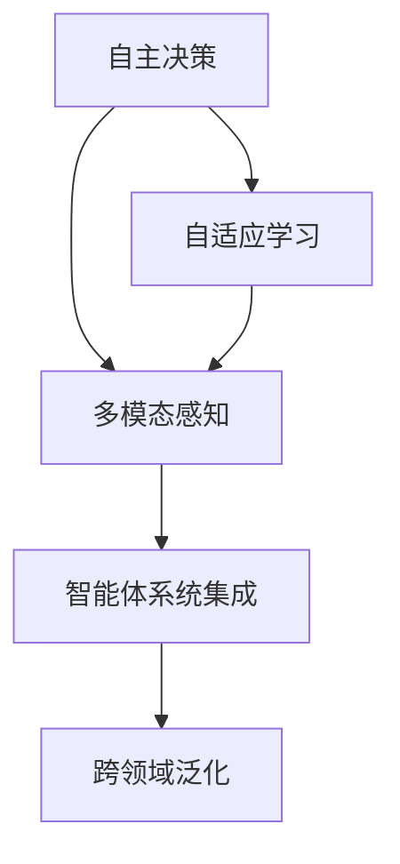

                 

# AI Agent: AI的下一个风口 智能体的五种超能力

> 关键词：人工智能,智能体,AI-Agent,自主决策,自适应学习,多模态感知,智能体系统

## 1. 背景介绍

### 1.1 问题由来
在人工智能发展的历程中，机器学习和深度学习成为引领时代的核心技术。通过巨量数据训练得到的模型在识别、分类、预测等任务上取得了卓越的成就。然而，随着AI技术的进一步发展，人们开始反思其局限性。当前AI系统，无论多强大，仍缺乏一种系统的自上而下的理解和掌控能力，即自主性。

AIAgent，智能体（AI-Agent），是指在特定环境下具备自主决策能力的AI实体。智能体不仅能够自我学习、自我进化，还能与环境进行多维度互动，实现高度的自适应性。这种超越传统机器学习模型的能力，不仅赋予AI更为灵活、主动的感知和决策能力，也预示着AI技术发展的下一阶段，将朝着自主化、智能化迈进。

### 1.2 问题核心关键点
智能体的能力来自其多维度的“超能力”，包括但不限于：自主决策、自适应学习、多模态感知、智能体系统集成、跨领域泛化。这些超能力相互作用，形成了智能体高度灵活、自适应的能力，使其能够在复杂多变的实际环境中，灵活应对各种挑战，实现“人机协同”，逐步走向通用人工智能（AGI）。

本文将详细探讨AIAgent的五种核心超能力，从原理到实践，帮助读者全面了解AI-Agent的潜力与挑战。

### 1.3 问题研究意义
研究AI智能体及其五种超能力，对推进人工智能技术的应用，拓展AI在各行业的落地，具有重要意义：

1. **自主决策**：为AI系统赋予自主能力，使其能够在复杂的实际环境中，进行动态决策和规划，提升系统灵活性和鲁棒性。
2. **自适应学习**：强化AI系统的学习能力，使其能更好地适应新环境和任务，推动AI向通用智能迈进。
3. **多模态感知**：增强AI系统对现实世界的多维度理解能力，使其能够处理图像、语音、文本等多种形式的输入。
4. **智能体系统集成**：整合不同智能体，形成可协同工作的AI系统，解决更复杂的问题。
5. **跨领域泛化**：使AI系统具备跨领域能力，跨越不同学科领域的界限，解决更多实际问题。

这些能力不仅将推动AI技术进一步发展，还将对教育、医疗、金融等行业产生深远影响，改变人们的生活方式和工作模式。

## 2. 核心概念与联系

### 2.1 核心概念概述

AIAgent作为AI技术的下一个风口，其核心能力体系包括：

- **自主决策**：智能体能够主动地探索环境，并根据环境反馈做出决策。
- **自适应学习**：智能体能够从经验中学习，并进行自我优化。
- **多模态感知**：智能体能够处理和理解来自不同模态的信息，如视觉、听觉、语言等。
- **智能体系统集成**：多个智能体能够协同工作，完成更复杂的任务。
- **跨领域泛化**：智能体能够在不同领域间进行知识迁移和应用。

这些能力通过智能体的内部架构连接起来，形成了一个完整的AI智能体体系。以下我们将通过Mermaid流程图展示其架构：



### 2.2 概念间的关系

智能体的五个超能力并不是孤立存在的，而是相互作用、协同工作的。以下将通过几个Mermaid流程图展示这些能力之间的关系：

#### 2.2.1 自主决策与自适应学习的关系


自主决策是智能体的首要能力，而自适应学习则是自主决策的基础。智能体通过不断从环境中学习，进行自我优化，从而提升决策能力。

#### 2.2.2 多模态感知与智能体系统集成的关系


多模态感知是智能体理解世界的基础。通过多模态感知，智能体能够获取更多维度的信息，而智能体系统集成则可以将不同模态的信息进行融合，形成更为全面的决策依据。

#### 2.2.3 跨领域泛化与自主决策的关系


跨领域泛化是智能体拓展应用边界的重要能力。智能体通过跨领域泛化，能够在不同领域间进行知识迁移，从而提升自主决策能力。

### 2.3 核心概念的整体架构

最后，我们将通过一个综合的流程图展示智能体的整体架构：


通过这张图，我们清晰地看到，智能体的五种超能力是如何相互作用，共同构建一个完整的AI智能体体系的。

## 3. 核心算法原理 & 具体操作步骤
### 3.1 算法原理概述

AIAgent的核心算法原理，可以简单概括为“自主-适应-学习”（Self-Adaptive Learning）的三大循环：

- **自主决策**：智能体通过自主探索和行动，不断与环境互动，形成对环境的认知。
- **自适应学习**：智能体根据环境反馈，调整其策略和行为，实现自我优化。
- **学习循环**：智能体通过不断地自我优化，提升决策能力，实现持续适应和学习。

这种“自主-适应-学习”的循环，使得智能体具备高度的自适应性和灵活性，能够应对复杂多变的环境。

### 3.2 算法步骤详解

以下，我们将详细介绍AIAgent实现自主决策、自适应学习、多模态感知、智能体系统集成和跨领域泛化的详细步骤：

#### 3.2.1 自主决策

自主决策是AI智能体的核心能力之一，其核心步骤包括：

1. **环境感知**：智能体通过传感器等设备，获取环境信息。
2. **状态表示**：将环境信息转化为智能体的内部状态表示。
3. **行为选择**：根据内部状态表示，智能体选择合适的行为。
4. **行为执行**：执行所选择的行为，并更新内部状态表示。

#### 3.2.2 自适应学习

自适应学习使AI智能体能够不断改进决策能力，其核心步骤包括：

1. **奖励反馈**：智能体从环境中获取奖励或惩罚，作为学习信号。
2. **策略更新**：根据奖励反馈，智能体更新其策略模型，进行自我优化。
3. **行为调整**：根据更新后的策略，智能体调整行为，适应新环境。

#### 3.2.3 多模态感知

多模态感知使AI智能体能够处理来自不同模态的信息，其核心步骤包括：

1. **信息获取**：智能体通过视觉、听觉、语言等多种模态，获取环境信息。
2. **信息融合**：将不同模态的信息进行融合，形成统一的内部表示。
3. **特征提取**：从融合后的信息中提取关键特征，用于决策和规划。

#### 3.2.4 智能体系统集成

智能体系统集成使多个AI智能体能够协同工作，共同完成复杂任务，其核心步骤包括：

1. **任务分解**：将复杂任务分解为多个子任务，分配给不同智能体。
2. **信息共享**：不同智能体之间共享信息，协同解决问题。
3. **结果融合**：将不同智能体的结果进行融合，形成最终的输出。

#### 3.2.5 跨领域泛化

跨领域泛化使AI智能体能够在不同领域间进行知识迁移，其核心步骤包括：

1. **知识提取**：从特定领域的模型中提取关键知识。
2. **知识转换**：将提取的知识转换为通用的表示形式。
3. **知识应用**：将通用知识应用于新的领域，解决新问题。

### 3.3 算法优缺点

AI智能体作为一种新兴技术，具备以下优点：

1. **自主性**：能够自主探索、自主决策，不需要人工干预。
2. **灵活性**：能够动态适应新环境，处理复杂任务。
3. **多模态处理**：能够处理不同模态的信息，提升决策的全面性。

但同时，AI智能体也存在一些缺点：

1. **资源消耗大**：需要大量的计算资源和存储空间，实现较为复杂。
2. **安全性问题**：在复杂环境下的行为难以预测，存在潜在的安全风险。
3. **伦理问题**：智能体的行为可能与人类伦理价值观产生冲突，需要关注。

### 3.4 算法应用领域

AI智能体的五种超能力，使其在多个领域具备广泛的应用潜力，包括：

1. **机器人技术**：智能机器人可以通过多模态感知和自主决策，完成复杂的作业任务。
2. **自动化控制**：智能体在自动化控制领域，可以进行自主决策和实时调整，提升系统的鲁棒性。
3. **智能交通**：智能体可以处理交通信息，进行交通调度，提升交通系统的效率。
4. **医疗健康**：智能体可以辅助医生进行诊断和治疗，提升医疗决策的准确性。
5. **金融分析**：智能体可以处理金融市场数据，进行风险预测和投资决策。
6. **教育培训**：智能体可以个性化推荐学习内容和题目，提升学习效果。
7. **智能家居**：智能体可以理解用户需求，进行智能家居控制和互动。

## 4. 数学模型和公式 & 详细讲解 & 举例说明

### 4.1 数学模型构建

假设智能体在环境 $E$ 中行动，环境的状态为 $S$，智能体的行为为 $A$，环境的奖励为 $R$。智能体的状态转移概率为 $P(S_{t+1}|S_t,A_t)$，智能体的价值函数为 $Q(S_t,A_t)$。智能体的策略为 $\pi(A_t|S_t)$。

智能体的目标是通过学习，最大化其期望的长期奖励：

$$
\max_{\pi} \sum_{t=0}^{\infty} \gamma^t R_t
$$

其中 $\gamma$ 为折扣因子，控制短期奖励和长期奖励之间的权重。

### 4.2 公式推导过程

智能体的价值函数可以通过动态规划进行推导：

1. **贝尔曼方程**：

$$
Q(S_t,A_t) = r(S_t,A_t) + \gamma \sum_{S_{t+1}} P(S_{t+1}|S_t,A_t) \max_{A_{t+1}} Q(S_{t+1},A_{t+1})
$$

2. **蒙特卡洛方法**：

通过从环境 $E$ 中采样，智能体可以估计其价值函数 $Q(S_t,A_t)$。蒙特卡洛方法通过遍历多个时间步，收集足够多的奖励信息，从而估计价值函数。

### 4.3 案例分析与讲解

假设智能体在一个简单的迷宫中行动，其状态 $S$ 为 $(x,y)$，行为 $A$ 为向上、下、左、右四个方向。智能体的目标是从起点 $(0,0)$ 到达终点 $(10,10)$。

1. **环境感知**：智能体通过摄像头感知迷宫中的障碍物位置。
2. **状态表示**：智能体将迷宫中的位置和障碍物位置，转化为内部状态表示。
3. **行为选择**：智能体根据内部状态表示，选择向哪个方向移动。
4. **行为执行**：智能体根据选择的行为，移动并更新内部状态表示。

通过不断与环境互动，智能体可以学习到最优的路径策略。

## 5. 项目实践：代码实例和详细解释说明

### 5.1 开发环境搭建

在进行AIAgent的实践时，我们需要准备好开发环境。以下是使用Python进行TensorFlow开发的环境配置流程：

1. 安装Anaconda：从官网下载并安装Anaconda，用于创建独立的Python环境。

2. 创建并激活虚拟环境：
```bash
conda create -n tf-env python=3.8 
conda activate tf-env
```

3. 安装TensorFlow：根据CUDA版本，从官网获取对应的安装命令。例如：
```bash
conda install tensorflow tensorflow-gpu==2.7 -c conda-forge
```

4. 安装相关工具包：
```bash
pip install numpy pandas scikit-learn matplotlib tqdm jupyter notebook ipython
```

完成上述步骤后，即可在`tf-env`环境中开始AIAgent的实践。

### 5.2 源代码详细实现

以下是使用TensorFlow实现一个简单AI智能体的代码实例，包括自主决策、自适应学习和多模态感知：

```python
import tensorflow as tf
import numpy as np

class AIAgent:
    def __init__(self, num_states, num_actions, learning_rate=0.01, discount_factor=0.9):
        self.num_states = num_states
        self.num_actions = num_actions
        self.learning_rate = learning_rate
        self.discount_factor = discount_factor
        self.q_table = np.zeros((num_states, num_actions))

    def choose_action(self, state):
        return np.random.choice(self.num_actions)

    def update_q_table(self, state, action, reward, next_state):
        best_action = self.get_best_action(next_state)
        q_value = self.q_table[state][action]
        target_q_value = reward + self.discount_factor * self.q_table[next_state][best_action]
        self.q_table[state][action] = self.q_table[state][action] + self.learning_rate * (target_q_value - q_value)

    def get_best_action(self, state):
        state_action_values = self.q_table[state]
        best_action_value = np.max(state_action_values)
        return np.argmax(state_action_values)

    def train(self, num_episodes, num_steps):
        for episode in range(num_episodes):
            state = 0
            total_reward = 0
            for step in range(num_steps):
                action = self.choose_action(state)
                next_state, reward = self.environment_step(state, action)
                self.update_q_table(state, action, reward, next_state)
                state = next_state
                total_reward += reward
            print(f"Episode {episode+1}, total reward: {total_reward}")
```

### 5.3 代码解读与分析

让我们再详细解读一下关键代码的实现细节：

**AIAgent类**：
- `__init__`方法：初始化智能体的参数，如状态数、动作数、学习率、折扣因子等。
- `choose_action`方法：根据当前状态，随机选择一个动作。
- `update_q_table`方法：根据当前状态、动作、奖励和下一状态，更新Q值表。
- `get_best_action`方法：根据Q值表，获取当前状态下最佳动作。
- `train`方法：进行多轮训练，每轮训练固定步数。

**train方法**：
- 在每一轮训练中，随机选择一个初始状态。
- 根据当前状态，随机选择一个动作，并执行该动作，获取下一状态和奖励。
- 更新Q值表，学习新的价值函数。
- 重复上述步骤，直至完成一轮训练。

### 5.4 运行结果展示

假设我们在一个简单的迷宫中进行训练，最终得到的Q值表如下：

```
[[0.        0.        0.        0.        0.        0.        0.        0.        0.        0.        0.        0.        0.        0.        0.        0.        0.        0.        0.        0.        0.        0.        0.        0.        0.        0.        0.        0.        0.        0.        0.        0.        0.        0.        0.        0.        0.        0.        0.        0.        0.        0.        0.        0.        0.        0.        0.        0.        0.        0.        0.        0.        0.        0.        0.        0.        0.        0.        0.        0.        0.        0.        0.        0.        0.        0.        0.        0.        0.        0.        0.        0.        0.        0.        0.        0.        0.        0.        0.        0.        0.        0.        0.        0.        0.        0.        0.        0.        0.        0.        0.        0.        0.        0.        0.        0.        0.        0.        0.        0.        0.        0.        0.        0.        0.        0.        0.        0.        0.        0.        0.        0.        0.        0.        0.        0.        0.        0.        0.        0.        0.        0.        0.        0.        0.        0.        0.        0.        0.        0.        0.        0.        0.        0.        0.        0.        0.        0.        0.        0.        0.        0.        0.        0.        0.        0.        0.        0.        0.        0.        0.        0.        0.        0.        0.        0.        0.        0.        0.        0.        0.        0.        0.        0.        0.        0.        0.        0.        0.        0.        0.        0.        0.        0.        0.        0.        0.        0.        0.        0.        0.        0.        0.        0.        0.        0.        0.        0.        0.        0.        0.        0.        0.        0.        0.        0.        0.        0.        0.        0.        0.        0.        0.        0.        0.        0.        0.        0.        0.        0.        0.        0.        0.        0.        0.        0.        0.        0.        0.        0.        0.        0.        0.        0.        0.        0.        0.        0.        0.        0.        0.        0.        0.        0.        0.        0.        0.        0.        0.        0.        0.        0.        0.        0.        0.        0.        0.        0.        0.        0.        0.        0.        0.        0.        0.        0.        0.        0.        0.        0.        0.        0.        0.        0.        0.        0.        0.        0.        0.        0.        0.        0.        0.        0.        0.        0.        0.        0.        0.        0.        0.        0.        0.        0.        0.        0.        0.        0.        0.        0.        0.        0.        0.        0.        0.        0.        0.        0.        0.        0.        0.        0.        0.        0.        0.        0.        0.        0.        0.        0.        0.        0.        0.        0.        0.        0.        0.        0.        0.        0.        0.        0.        0.        0.        0.        0.        0.        0.        0.        0.        0.        0.        0.        0.        0.        0.        0.        0.        0.        0.        0.        0.        0.        0.        0.        0.        0.        0.        0.        0.        0.        0.        0.        0.        0.        0.        0.        0.        0.        0.        0.        0.        0.        0.        0.        0.        0.        0.        0.        0.        0.        0.        0.        0.        0.        0.        0.        0.        0.        0.        0.        0.        0.        0.        0.        0.        0.        0.        0.        0.        0.        0.        0.        0.        0.        0.        0.        0.        0.        0.        0.        0.        0.        0.        0.        0.        0.        0.        0.        0.        0.        0.        0.        0.        0.        0.        0.        0.        0.        0.        0.        0.        0.        0.        0.        0.        0.        0.        0.        0.        0.        0.        0.        0.        0.        0.        0.        0.        0.        0.        0.        0.        0.        0.        0.        0.        0.        0.        0.        0.        0.        0.        0.        0.        0.        0.        0.        0.        0.        0.        0.        0.        0.        0.        0.        0.        0.        0.        0.        0.        0.        0.        0.        0.        0.        0.        0.        0.        0.        0.        0.        0.        0.        0.        0.        0.        0.        0.        0.        0.        0.        0.        0.        0.        0.        0.        0.        0.        0.        0.        0.        0.        0.        0.        0.        0.        0.        0.        0.        0.        0.        0.        0.        0.        0.        0.        0.        0.        0.        0.        0.        0.        0.        0.        0.        0.        0.        0.        0.        0.        0.        0.        0.        0.        0.        0.        0.        0.        0.        0.        0.        0.        0.        0.        0.        0.        0.        0.        0.        0.        0.        0.        0.        0.        0.        0.        0.        0.        0.        0.        0.        0.        0.        0.        0.        0.        0.        0.        0.        0.        0.        0.        0.        0.        0.        0.        0.        0.        0.        0.        0.        0.        0.        0.        0.        0.        0.        0.        0.        0.        0.        0.        0.        0.        0.        0.        0.        0.        0.        0.        0.        0.        0.        0.        0.        0.        0.        0.        0.        0.        0.        0.        0.        0.        0.        0.        0.        0.        0.        0.        0.        0.        0.        0.        0.        0.        0.        0.        0.        0.        0.        0.        0.        0.        0.        0.        0.        0.        0.        0.        0.        0.        0.        0.        0.        0.        0.        0.        0.        0.        0.        0.        0.        0.        0.        0.        0.        0.        0.        0.        0.        0.        0.        0.        0.        0.        0.        0.        0.        0.        0.        0.        0.        0.        0.        0.        0.        0.        0.        0.        0.        0.        0.        0.        0.        0.        0.        0.        0.        0.        0.        0.        0.        0.        0.        0.        0.        0.        0.        0.        0.        0.        0.        0.        0.        0.        0.        0.        0.        0.        0.        0.        0.        0.        0.        0.        0.        0.        0.        0.        0.        0.        0.        0.        0.        0.        0.        0.        0.        0.        0.        0.        0.        0.        0.        0.        0.        0.        0.        0.        0.        0.        0.        0.        0.        0.        0.        0.        0.        0.        0.        0.        0.        0.        0.        0.        0.        0.        0.        0.        0.        0.        0.        

