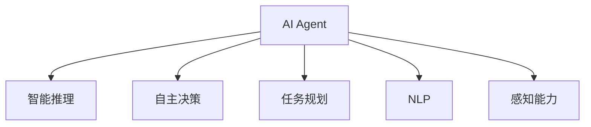

                 

# AI Agent在智能协作中的优势

## 1. 背景介绍

### 1.1 问题由来

随着人工智能（AI）技术的迅速发展，AI Agent在智能协作中的应用日益广泛。AI Agent不仅能够执行复杂的决策和任务，还可以与人类或其他AI Agent进行高效沟通和协作，提升工作效率和质量。然而，AI Agent在实际应用中也面临诸多挑战，如如何确保其行为符合人类价值观、如何处理复杂环境中的不确定性等。本文将探讨AI Agent在智能协作中的优势，分析其实际应用中的挑战，并展望未来发展趋势。

### 1.2 问题核心关键点

AI Agent在智能协作中的核心优势在于其强大的智能推理和自主决策能力，能够自动完成复杂的任务，并提供智能化的建议。此外，AI Agent还能够处理大量数据，快速适应环境变化，并与其他AI Agent或人类进行高效的协同工作。然而，AI Agent也面临着行为透明、伦理规范和模型解释性等问题，这些问题需要通过不断的技术创新和改进来解决。

## 2. 核心概念与联系

### 2.1 核心概念概述

- **AI Agent**：智能代理，能够自主执行任务并与其他AI Agent或人类进行协作的实体。AI Agent通常具备任务规划、自主决策、自然语言处理和感知能力等。

- **智能推理**：指AI Agent利用逻辑推理和经验知识，自主地从给定信息中推导出最优解的能力。智能推理是AI Agent在复杂环境中进行决策和任务规划的基础。

- **自主决策**：指AI Agent能够根据当前环境信息，自主做出决策，无需人工干预。自主决策依赖于AI Agent的智能推理能力和学习机制。

- **任务规划**：指AI Agent根据任务目标和约束条件，设计出最优的行动方案。任务规划通常包括目标设定、路径规划和资源分配等。

- **自然语言处理（NLP）**：指AI Agent理解、处理和生成人类语言的能力。NLP技术使AI Agent能够与人类进行高效沟通和协作。

- **感知能力**：指AI Agent通过传感器获取环境信息，并对其进行处理和理解的能力。感知能力使AI Agent能够感知周围环境，并据此做出决策。

### 2.2 概念间的关系

这些核心概念通过以下Mermaid流程图来展示：



这个流程图展示了AI Agent的核心组成及其相互关系：AI Agent通过智能推理和自主决策来完成任务，利用NLP和感知能力与人类或其他AI Agent进行沟通，最终实现任务规划和执行。

## 3. 核心算法原理 & 具体操作步骤

### 3.1 算法原理概述

AI Agent在智能协作中的核心算法原理包括以下几个方面：

- **智能推理算法**：如符号逻辑推理、统计推理、神经网络推理等，用于从给定信息中推导出最优决策。

- **自主决策算法**：如强化学习、进化算法、贝叶斯优化等，用于根据当前环境信息，自动做出最优决策。

- **任务规划算法**：如图搜索算法、遗传算法、粒子群优化等，用于设计最优的任务执行路径。

- **自然语言处理技术**：如基于规则的NLP、统计NLP、深度学习NLP等，用于与人类进行高效沟通和协作。

- **感知技术**：如计算机视觉、声学处理、传感器融合等，用于获取环境信息并对其进行处理和理解。

### 3.2 算法步骤详解

AI Agent在智能协作中的具体操作步骤包括以下几个步骤：

1. **数据获取**：通过传感器和接口，AI Agent获取环境信息和任务指令。

2. **信息处理**：AI Agent对获取的信息进行预处理和理解，如使用NLP技术进行语言理解，使用感知技术进行环境感知。

3. **任务规划**：AI Agent根据任务目标和约束条件，设计出最优的任务执行方案，如使用图搜索算法、遗传算法等。

4. **自主决策**：AI Agent根据当前环境信息，自主做出最优决策，如使用强化学习、进化算法等。

5. **执行任务**：AI Agent根据决策方案，执行任务并更新环境状态。

6. **反馈学习**：AI Agent根据执行结果和反馈信息，更新模型参数，提高决策和执行能力。

### 3.3 算法优缺点

AI Agent在智能协作中的主要优点包括：

- **高效完成任务**：AI Agent能够快速处理大量数据，自动完成复杂任务，提高工作效率。

- **自主决策能力**：AI Agent具备自主决策能力，能够适应环境变化，做出最优决策。

- **人机协作**：AI Agent能够与人类进行高效沟通和协作，提供智能化的建议和支持。

然而，AI Agent也存在以下缺点：

- **行为透明**：AI Agent的决策过程难以解释，缺乏透明性，可能导致信任问题。

- **伦理规范**：AI Agent的决策行为可能违背伦理规范，如存在偏见和歧视。

- **资源依赖**：AI Agent需要大量的计算资源和数据支持，增加了部署成本。

### 3.4 算法应用领域

AI Agent在多个领域具有广泛的应用前景，例如：

- **智能制造**：AI Agent能够自动化生产流程，提高生产效率和质量。

- **智能客服**：AI Agent能够提供24小时不间断的客户服务，提高客户满意度。

- **智慧交通**：AI Agent能够优化交通流量，减少交通拥堵。

- **智能医疗**：AI Agent能够辅助医生进行诊断和治疗，提高医疗服务质量。

- **智能家居**：AI Agent能够控制家居设备和环境，提供个性化服务。

## 4. 数学模型和公式 & 详细讲解

### 4.1 数学模型构建

AI Agent在智能协作中的数学模型包括以下几个部分：

- **任务目标函数**：表示任务完成情况和性能指标，如路径长度、执行时间等。

- **决策变量**：表示AI Agent的决策和行动，如动作、路径等。

- **约束条件**：表示任务执行的限制条件，如资源限制、时间限制等。

### 4.2 公式推导过程

以任务规划算法为例，其数学模型可以表示为：

$$
\begin{aligned}
\min_{x} & \quad f(x) \\
\text{s.t.} & \quad g_i(x) \leq 0, \quad i = 1, 2, \dots, m \\
& \quad h_j(x) = 0, \quad j = 1, 2, \dots, p
\end{aligned}
$$

其中，$f(x)$ 为目标函数，$g_i(x)$ 为约束条件，$h_j(x)$ 为决策变量 $x$ 的状态转移方程。

### 4.3 案例分析与讲解

以一个智能交通信号灯为例，其任务目标函数为路径长度，约束条件包括时间限制和交通规则。AI Agent需要设计最优的信号灯控制策略，使车辆能够高效通过交叉口。

## 5. 项目实践：代码实例和详细解释说明

### 5.1 开发环境搭建

要实现AI Agent的智能协作，需要以下开发环境：

1. **编程语言**：Python、Java、C++等。

2. **开发框架**：TensorFlow、PyTorch、OpenAI Gym等。

3. **操作系统**：Linux、Windows等。

4. **计算资源**：GPU、TPU等高性能计算设备。

5. **数据集**：与任务相关的训练数据集，如交通流量数据、传感器数据等。

6. **开发工具**：Visual Studio、Eclipse、PyCharm等。

### 5.2 源代码详细实现

以下是一个简单的AI Agent实现示例，用于控制智能家居设备的开关：

```python
import random

class AIAgent:
    def __init__(self, environment, reward_function):
        self.environment = environment
        self.reward_function = reward_function
        self.state = self.environment.get_initial_state()
        self.actions = self.environment.get_possible_actions()
        self.previous_reward = 0
    
    def choose_action(self):
        action = random.choice(self.actions)
        next_state, reward = self.environment.execute_action(self.state, action)
        self.state = next_state
        self.previous_reward += reward
        return action, reward
    
    def train(self, episodes, learning_rate):
        for episode in range(episodes):
            total_reward = 0
            state = self.environment.get_initial_state()
            while True:
                action, reward = self.choose_action()
                total_reward += reward
                if reward == 0:
                    break
                state = self.environment.get_next_state(state, action)
            self.update_weights(total_reward, learning_rate)
    
    def update_weights(self, reward, learning_rate):
        delta = reward - self.previous_reward
        self.previous_reward = reward
        for param in self.environment.get_parameters():
            param.value += learning_rate * delta * param.gradient
```

### 5.3 代码解读与分析

- **类定义**：定义了一个AI Agent类，包含状态、动作、奖励函数等属性。

- **初始化方法**：初始化环境、奖励函数和状态，设置初始动作集。

- **选择动作方法**：随机选择一个动作，执行该动作并更新状态和奖励。

- **训练方法**：在固定次数的训练中，使用强化学习算法（如Q-learning）更新模型参数。

- **权重更新方法**：根据奖励更新模型参数。

### 5.4 运行结果展示

以下是一个简单的运行结果示例：

```python
# 创建环境
environment = Environment()

# 创建AI Agent
agent = AIAgent(environment, reward_function)

# 训练AI Agent
agent.train(10000, 0.01)

# 测试AI Agent
test_state = environment.get_initial_state()
for _ in range(100):
    action, reward = agent.choose_action()
    print(f"Action: {action}, Reward: {reward}")
```

## 6. 实际应用场景

### 6.1 智能制造

AI Agent在智能制造中的应用包括自动化生产线、智能仓储和质量检测等。通过AI Agent，制造企业能够实现生产流程的自动化、智能化和高效化，提高生产效率和产品质量。

### 6.2 智能客服

AI Agent在智能客服中的应用包括自动问答、情感分析和自动回复等。通过AI Agent，企业能够实现24小时不间断的客户服务，提高客户满意度。

### 6.3 智慧交通

AI Agent在智慧交通中的应用包括交通流量优化、智能信号灯控制和自动驾驶等。通过AI Agent，城市能够实现交通流量优化、减少交通拥堵和提高道路安全性。

### 6.4 未来应用展望

未来，AI Agent将在更多领域得到应用，如智能医疗、智能家居和智能安防等。随着AI技术的不断发展，AI Agent将变得更加智能、自主和可信，能够更好地服务于人类社会。

## 7. 工具和资源推荐

### 7.1 学习资源推荐

- **书籍**：《人工智能基础》、《深度学习》、《强化学习》等。

- **在线课程**：Coursera、edX、Udacity等平台的AI相关课程。

- **学术论文**：ACL、NIPS、ICML等会议的最新论文。

### 7.2 开发工具推荐

- **编程语言**：Python、Java、C++等。

- **开发框架**：TensorFlow、PyTorch、OpenAI Gym等。

- **操作系统**：Linux、Windows等。

- **计算资源**：GPU、TPU等高性能计算设备。

- **开发工具**：Visual Studio、Eclipse、PyCharm等。

### 7.3 相关论文推荐

- **强化学习**：Q-learning、Deep Q-Network、Proximal Policy Optimization等。

- **自然语言处理**：Transformers、BERT、GPT等。

- **感知技术**：计算机视觉、声学处理、传感器融合等。

## 8. 总结：未来发展趋势与挑战

### 8.1 总结

AI Agent在智能协作中展示了强大的优势，能够在复杂环境中高效完成任务，提供智能化的决策和建议。然而，AI Agent也面临着行为透明、伦理规范和模型解释性等问题，这些问题需要通过不断的技术创新和改进来解决。未来，AI Agent将在更多领域得到应用，推动人工智能技术的进步。

### 8.2 未来发展趋势

未来，AI Agent将向以下几个方向发展：

- **自主决策能力增强**：通过深度学习、强化学习和进化算法等，增强AI Agent的自主决策能力，使其能够更好地适应复杂环境。

- **多模态融合**：将视觉、语音和文本等多种信息进行融合，提升AI Agent的感知和决策能力。

- **伦理规范体系完善**：建立AI Agent的伦理规范体系，确保其决策行为符合人类价值观和伦理道德。

- **模型解释性提升**：通过可解释性方法（如LIME、SHAP等），提高AI Agent的决策透明性和可信度。

### 8.3 面临的挑战

尽管AI Agent在智能协作中取得了显著成果，但仍面临以下挑战：

- **计算资源需求高**：AI Agent需要大量的计算资源和数据支持，增加了部署成本。

- **行为透明性问题**：AI Agent的决策过程难以解释，缺乏透明性，可能导致信任问题。

- **伦理规范问题**：AI Agent的决策行为可能违背伦理规范，如存在偏见和歧视。

### 8.4 研究展望

未来，需要在以下方面进行研究：

- **多模态信息融合**：将视觉、语音和文本等多种信息进行融合，提升AI Agent的感知和决策能力。

- **可解释性方法**：通过可解释性方法（如LIME、SHAP等），提高AI Agent的决策透明性和可信度。

- **伦理规范体系**：建立AI Agent的伦理规范体系，确保其决策行为符合人类价值观和伦理道德。

- **强化学习算法**：开发更加高效的强化学习算法，增强AI Agent的自主决策能力。

总之，AI Agent在智能协作中展示了强大的优势，但其面临的挑战也需要不断克服。未来，通过技术创新和改进，AI Agent将变得更加智能、自主和可信，为人类社会带来更多福祉。

## 9. 附录：常见问题与解答

**Q1：AI Agent如何在复杂环境中进行决策？**

A：AI Agent通过智能推理算法（如符号逻辑推理、统计推理、神经网络推理等）从给定信息中推导出最优决策。其决策过程依赖于大量的训练数据和复杂的算法模型，能够处理复杂环境中的不确定性和多变性。

**Q2：如何确保AI Agent的决策行为符合伦理规范？**

A：建立AI Agent的伦理规范体系，确保其决策行为符合人类价值观和伦理道德。可以通过伦理审查、用户反馈和模型监督等方式，及时发现和纠正AI Agent的不当行为。

**Q3：AI Agent如何与人类进行高效沟通和协作？**

A：AI Agent通过自然语言处理技术（如基于规则的NLP、统计NLP、深度学习NLP等），理解人类语言并生成智能化的回复。同时，通过任务规划和自主决策，提供符合用户需求的解决方案。

**Q4：AI Agent的决策透明性问题如何解决？**

A：通过可解释性方法（如LIME、SHAP等），提高AI Agent的决策透明性和可信度。在模型训练和决策过程中，记录和解释每个决策的依据和推理过程，帮助用户理解AI Agent的决策行为。

**Q5：AI Agent在实际应用中如何提高性能？**

A：通过数据增强、正则化、对抗训练等技术，提高AI Agent的鲁棒性和泛化能力。同时，使用参数高效微调等技术，减少训练数据需求，提升模型效率。

总之，AI Agent在智能协作中展示了强大的优势，但其面临的挑战也需要不断克服。未来，通过技术创新和改进，AI Agent将变得更加智能、自主和可信，为人类社会带来更多福祉。

