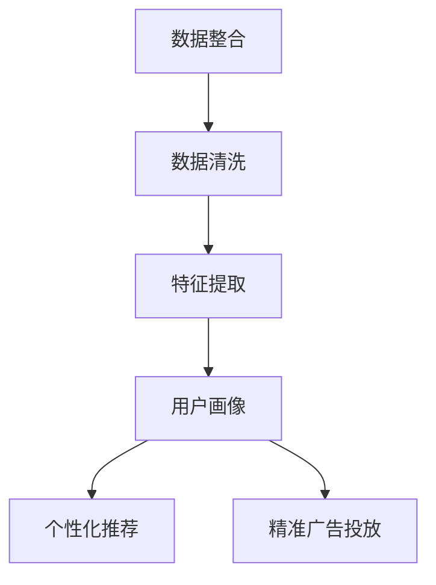
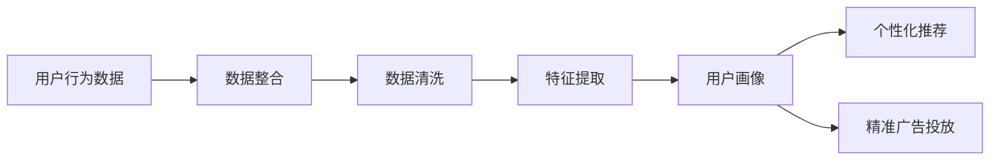
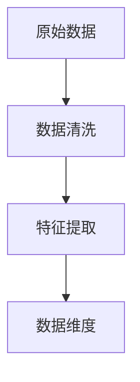
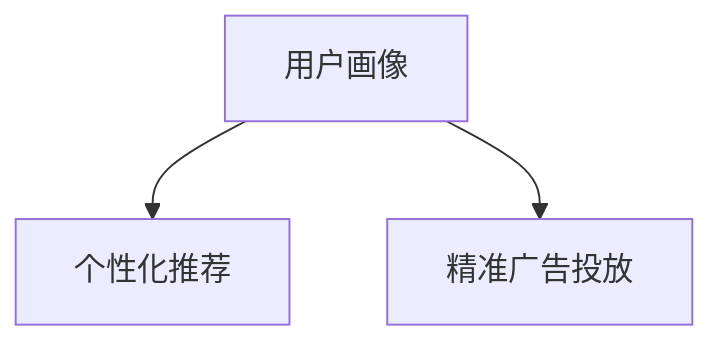
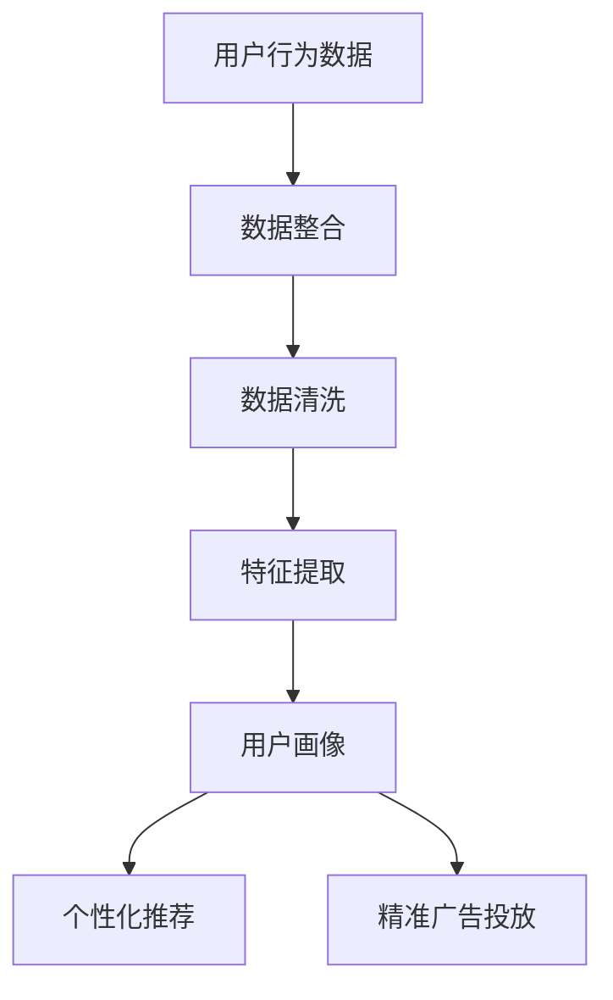

                 

# AI DMP 数据基建：构建数据驱动的营销生态

## 1. 背景介绍

### 1.1 问题由来

在互联网和电子商务的迅猛发展背景下，消费者行为、产品销量、市场趋势等信息量激增，带来了巨大的商机和挑战。如何在海量数据中高效提取有用信息，构建精确的用户画像，成为营销领域的重要课题。

数据驱动营销（Data-Driven Marketing，DMP）应运而生，通过全面整合线上线下数据，构建用户全貌，实现精准营销，提升营销效果。然而，传统的DMP系统依赖人工构建标签和维度，工作量大、复杂度高，难以应对实时化、个性化需求。

为了解决这些问题，AI DMP（人工智能驱动的数据管理系统）应运而生。通过机器学习、深度学习等技术，AI DMP能够自动识别、提取、组合数据，构建更加精准、动态的用户画像。

### 1.2 问题核心关键点

AI DMP的核心目标是通过自动化、智能化的数据处理和分析，构建高质量的用户画像。其主要步骤包括：

1. **数据整合**：从各渠道（如电商、社交、搜索等）获取用户行为数据，包括浏览、购买、评论、点击等。
2. **数据清洗**：去除噪声、缺失数据，提升数据质量。
3. **特征提取**：提取用户行为、兴趣、属性等关键特征，构建数据维度。
4. **用户画像**：通过聚类、分类、关联规则等算法，生成用户画像，并根据用户行为实时更新。
5. **推荐与广告**：利用用户画像，进行个性化推荐和精准投放广告。

AI DMP的优势在于通过自动化处理，提高数据处理效率，同时利用机器学习等技术，实现智能化分析，提升用户画像的准确性和动态性。

### 1.3 问题研究意义

AI DMP的构建与优化对于提升营销效果、降低成本、提升用户体验具有重要意义：

1. **提升营销效果**：通过精确的用户画像，实现精准推荐和广告投放，提升转化率和ROI。
2. **降低成本**：自动化数据处理减少人力投入，降低运营成本。
3. **提升用户体验**：根据用户兴趣和行为，提供个性化内容和推荐，提升用户满意度。
4. **数据分析与洞察**：通过用户行为分析，获取市场趋势和用户需求，为决策提供支持。

AI DMP的构建和优化，是数据驱动营销成功的重要保障，有助于实现数据资产的最大化利用和价值挖掘。

## 2. 核心概念与联系

### 2.1 核心概念概述

为更好地理解AI DMP的核心技术和应用场景，本节将介绍几个关键概念及其相互关系：

- **AI DMP（AI驱动的数据管理系统）**：利用AI技术构建的用户画像管理系统，自动处理海量数据，构建精准用户画像。
- **数据整合**：从不同渠道获取用户行为数据，并进行合并、清洗和标准化。
- **特征提取**：从原始数据中自动提取关键特征，用于构建用户画像。
- **用户画像**：基于用户行为和属性，生成用户全貌，用于推荐和广告投放。
- **个性化推荐系统**：根据用户画像，提供个性化推荐服务。
- **精准广告投放**：通过用户画像，进行精准广告投放，提升广告效果。

这些核心概念之间的联系可以通过以下Mermaid流程图来展示：



这个流程图展示了数据整合、数据清洗、特征提取、用户画像、个性化推荐、精准广告投放等环节之间的紧密联系，共同构成了AI DMP的完整数据处理和分析流程。

### 2.2 概念间的关系

这些核心概念之间存在着紧密的联系，形成了AI DMP的整体生态系统。下面我们通过几个Mermaid流程图来展示这些概念之间的关系。

#### 2.2.1 AI DMP的整体架构



这个流程图展示了从用户行为数据到用户画像的完整处理流程，以及个性化推荐和精准广告投放的应用。

#### 2.2.2 数据清洗与特征提取的配合



这个流程图展示了数据清洗和特征提取的配合，确保数据质量和准确性。

#### 2.2.3 用户画像与推荐和广告的联动



这个流程图展示了用户画像在个性化推荐和精准广告投放中的应用，实现高效的数据利用。

### 2.3 核心概念的整体架构

最后，我们用一个综合的流程图来展示这些核心概念在大数据管理中的整体架构：



这个综合流程图展示了从原始数据到最终应用的全过程，涵盖了数据整合、数据清洗、特征提取、用户画像、个性化推荐、精准广告投放等多个环节。

## 3. 核心算法原理 & 具体操作步骤
### 3.1 算法原理概述

AI DMP的核心算法原理主要包括以下几个方面：

1. **数据整合**：通过数据集成技术，将来自不同渠道的用户行为数据进行合并和标准化。
2. **数据清洗**：通过数据去重、去噪、填补缺失值等技术，提升数据质量。
3. **特征提取**：利用机器学习等技术，从原始数据中提取关键特征，用于构建用户画像。
4. **用户画像**：通过聚类、分类、关联规则等算法，生成用户全貌，并根据用户行为实时更新。
5. **个性化推荐系统**：利用用户画像，实现个性化推荐。
6. **精准广告投放**：根据用户画像，进行精准广告投放。

AI DMP的核心算法原理可归纳为数据预处理、特征工程、模型训练和应用实现四个环节。通过这些算法，AI DMP能够自动、高效地处理和分析用户数据，构建高质量的用户画像。

### 3.2 算法步骤详解

AI DMP的具体操作步骤包括以下几个关键步骤：

**Step 1: 数据采集与整合**

1. **数据源收集**：从电商、社交、搜索等不同渠道收集用户行为数据，包括浏览记录、购买历史、评价内容等。
2. **数据整合**：对不同来源的数据进行整合，消除冗余，构建统一的用户数据视图。

**Step 2: 数据清洗与标准化**

1. **数据去重**：去除重复数据，确保数据唯一性。
2. **数据去噪**：去除异常值、噪声数据，提升数据质量。
3. **数据标准化**：对不同来源的数据进行标准化，统一格式和单位。

**Step 3: 特征提取与维度构建**

1. **特征提取**：利用机器学习算法，如PCA、TF-IDF、LDA等，从原始数据中提取关键特征。
2. **维度构建**：构建用户画像的特征维度，包括行为、兴趣、属性等。

**Step 4: 用户画像构建**

1. **用户聚类**：利用聚类算法，如K-means、GMM等，将用户分为不同群体，构建用户簇。
2. **用户分类**：利用分类算法，如决策树、SVM等，对用户进行分类，生成标签。
3. **关联规则挖掘**：利用关联规则算法，如Apriori、FP-growth等，发现用户行为之间的关联关系。

**Step 5: 推荐与广告投放**

1. **个性化推荐**：利用用户画像，生成推荐列表，提供个性化内容和服务。
2. **精准广告投放**：根据用户画像，进行精准广告投放，提高广告效果。

### 3.3 算法优缺点

AI DMP具有以下优点：

1. **高效性**：自动化数据处理和分析，大大提升数据处理效率。
2. **精确性**：利用机器学习等技术，提高用户画像的准确性。
3. **动态性**：根据用户行为实时更新用户画像，提升用户画像的动态性。

同时，AI DMP也存在一些局限性：

1. **数据隐私**：处理大量用户数据时，需要注意隐私保护。
2. **算法复杂度**：部分算法（如深度学习、关联规则挖掘等）计算复杂度较高，需要高性能计算资源。
3. **模型泛化能力**：在处理特定领域数据时，需要针对性地优化算法。

### 3.4 算法应用领域

AI DMP技术广泛应用于以下几个领域：

1. **电商推荐系统**：利用用户画像，提供个性化商品推荐。
2. **社交媒体分析**：分析用户行为，提供精准营销策略。
3. **广告投放优化**：利用用户画像，实现精准广告投放，提升广告效果。
4. **用户细分与分析**：通过聚类和分类算法，进行用户细分和分析，提升用户洞察。
5. **内容推荐**：根据用户画像，推荐相关内容和信息，提升用户粘性。

## 4. 数学模型和公式 & 详细讲解 & 举例说明
### 4.1 数学模型构建

AI DMP的数学模型主要包括以下几个方面：

- **数据整合**：利用数据集成技术，如数据合并、去重、标准化等，将不同来源的数据进行整合。
- **数据清洗**：利用数据去噪、去重、填补缺失值等技术，提升数据质量。
- **特征提取**：利用PCA、TF-IDF、LDA等算法，从原始数据中提取关键特征。
- **用户画像**：利用K-means、GMM等聚类算法，将用户分为不同群体，生成用户簇。
- **个性化推荐**：利用协同过滤、矩阵分解等算法，提供个性化推荐服务。
- **精准广告投放**：利用逻辑回归、决策树等算法，进行精准广告投放。

### 4.2 公式推导过程

以下我们以用户聚类为例，推导K-means算法的计算公式。

K-means算法通过迭代优化，将用户分为K个簇。设用户集为$\mathcal{U}=\{x_1, x_2, \cdots, x_n\}$，其中$x_i \in \mathcal{X}$为第$i$个用户的行为向量，$\mathcal{X}$为特征空间。设簇数为$K$，初始簇心为$\mu_1, \mu_2, \cdots, \mu_K$。

K-means算法的主要步骤如下：

1. **初始化簇心**：随机选择$K$个用户作为初始簇心。
2. **分配**：计算每个用户$x_i$到各个簇心的距离，分配到距离最近的簇。
3. **更新簇心**：重新计算每个簇的均值，作为新的簇心。
4. **迭代**：重复步骤2和3，直到簇心不再变化。

设簇心为$\mu_k = \frac{1}{N_k} \sum_{i \in C_k} x_i$，其中$C_k$为第$k$个簇的用户集，$N_k$为簇内用户数。则K-means算法的目标函数为：

$$
\min_{\mu_1, \mu_2, \cdots, \mu_K} \sum_{i=1}^n \min_{k=1,\cdots,K} \| x_i - \mu_k \|^2
$$

通过迭代优化，K-means算法最小化上述目标函数，从而将用户分为K个簇。

### 4.3 案例分析与讲解

假设我们有一个电商用户数据集，包含用户的浏览记录、购买历史、评价内容等。我们利用K-means算法将其分为5个簇，每个簇代表一个用户群体。以下是实现步骤：

1. **数据预处理**：去除异常值、噪声数据，对数据进行标准化。
2. **特征提取**：利用TF-IDF算法，提取用户的关键词和属性。
3. **聚类分析**：利用K-means算法，将用户分为5个簇，每个簇代表一个用户群体。
4. **结果分析**：分析每个簇的特征，发现不同用户群体的购买偏好、兴趣等差异。

## 5. 项目实践：代码实例和详细解释说明
### 5.1 开发环境搭建

在进行AI DMP开发前，我们需要准备好开发环境。以下是使用Python进行PyTorch开发的环境配置流程：

1. 安装Anaconda：从官网下载并安装Anaconda，用于创建独立的Python环境。

2. 创建并激活虚拟环境：
```bash
conda create -n pytorch-env python=3.8 
conda activate pytorch-env
```

3. 安装PyTorch：根据CUDA版本，从官网获取对应的安装命令。例如：
```bash
conda install pytorch torchvision torchaudio cudatoolkit=11.1 -c pytorch -c conda-forge
```

4. 安装各类工具包：
```bash
pip install numpy pandas scikit-learn matplotlib tqdm jupyter notebook ipython
```

完成上述步骤后，即可在`pytorch-env`环境中开始AI DMP实践。

### 5.2 源代码详细实现

下面我们以电商推荐系统为例，给出使用PyTorch进行用户聚类的PyTorch代码实现。

首先，定义用户行为数据的特征提取函数：

```python
from sklearn.feature_extraction.text import TfidfVectorizer
from sklearn.cluster import KMeans

def extract_features(data):
    # 文本特征提取
    tfidf = TfidfVectorizer()
    features = tfidf.fit_transform(data)
    
    # 聚类分析
    kmeans = KMeans(n_clusters=5)
    kmeans.fit(features)
    labels = kmeans.labels_
    
    return features, labels
```

然后，定义数据加载函数：

```python
import pandas as pd

def load_data(file_path):
    data = pd.read_csv(file_path)
    return data['description']
```

最后，进行用户聚类并输出结果：

```python
from sklearn.metrics import silhouette_score

# 加载数据
data = load_data('data.csv')

# 特征提取和聚类
features, labels = extract_features(data)

# 聚类结果可视化
import matplotlib.pyplot as plt
plt.scatter(features[:, 0], features[:, 1], c=labels)
plt.title('K-means Clustering Results')
plt.show()

# 聚类效果评估
silhouette_avg = silhouette_score(features, labels)
print(f'Silhouette Score: {silhouette_avg}')
```

以上就是使用PyTorch进行用户聚类的完整代码实现。可以看到，得益于Scikit-learn库的强大封装，我们可以用相对简洁的代码完成用户聚类的实现。

### 5.3 代码解读与分析

让我们再详细解读一下关键代码的实现细节：

**extract_features函数**：
- 利用TfidfVectorizer进行文本特征提取，将文本数据转换为TF-IDF特征向量。
- 利用KMeans算法进行聚类分析，将用户分为5个簇，并返回簇标签。

**load_data函数**：
- 利用Pandas库读取CSV文件，提取用户行为数据。

**特征提取和聚类**：
- 加载数据，调用特征提取函数进行文本特征提取和聚类分析。
- 利用Matplotlib库可视化聚类结果，并输出轮廓系数。

**运行结果展示**：
- 运行代码后，输出聚类结果可视化图和轮廓系数，分析聚类效果。

## 6. 实际应用场景

### 6.1 电商推荐系统

电商推荐系统是AI DMP技术的重要应用场景之一。通过AI DMP构建的用户画像，电商企业可以更好地理解用户需求和行为，实现个性化推荐，提升用户体验和销售额。

具体而言，电商企业可以利用AI DMP对用户浏览、购买、评价等行为数据进行深度分析，构建精准的用户画像，然后根据用户画像提供个性化的商品推荐。例如，当用户浏览某类商品时，AI DMP会自动分析该用户的历史浏览记录和购买偏好，推荐类似商品，提高转化率。

### 6.2 社交媒体分析

社交媒体平台可以借助AI DMP技术，对用户行为进行分析，提升用户粘性和平台活跃度。

社交媒体平台可以通过AI DMP对用户的点赞、评论、分享等行为数据进行深度分析，构建精准的用户画像，然后根据用户画像提供个性化的内容推荐和活动推送。例如，当用户关注某个品牌时，AI DMP会自动分析该用户的兴趣偏好，推荐相关内容和广告，提升用户参与度和平台黏性。

### 6.3 广告投放优化

AI DMP技术还可以应用于广告投放优化，提升广告投放效果。

广告投放平台可以通过AI DMP对用户行为数据进行深度分析，构建精准的用户画像，然后根据用户画像进行精准广告投放，提高广告点击率和转化率。例如，当用户搜索某类产品时，AI DMP会自动分析该用户的兴趣偏好和购买历史，推荐相关广告，提升广告效果。

## 7. 工具和资源推荐

### 7.1 学习资源推荐

为了帮助开发者系统掌握AI DMP的理论基础和实践技巧，这里推荐一些优质的学习资源：

1. 《机器学习实战》系列书籍：介绍机器学习算法和应用，包括聚类、分类等核心概念。
2. 《深度学习》系列课程：斯坦福大学开设的深度学习课程，涵盖深度学习算法和应用，适合深入学习。
3. Kaggle：数据科学竞赛平台，提供大量经典数据集和竞赛，可以实践和挑战AI DMP技术。
4. Coursera：提供全球顶尖大学的在线课程，包括机器学习、深度学习等，适合系统学习。
5. Google AI实验室：提供大量机器学习、深度学习资源和代码，适合学习前沿技术。

通过对这些资源的学习实践，相信你一定能够快速掌握AI DMP的精髓，并用于解决实际的商业问题。

### 7.2 开发工具推荐

高效的开发离不开优秀的工具支持。以下是几款用于AI DMP开发的常用工具：

1. PyTorch：基于Python的开源深度学习框架，灵活动态的计算图，适合快速迭代研究。
2. TensorFlow：由Google主导开发的开源深度学习框架，生产部署方便，适合大规模工程应用。
3. Scikit-learn：Python机器学习库，提供了丰富的机器学习算法和工具，适合数据处理和特征提取。
4. Pandas：Python数据分析库，提供了高效的数据处理和分析功能，适合数据清洗和预处理。
5. Matplotlib：Python绘图库，提供了丰富的绘图工具，适合数据可视化。
6. Jupyter Notebook：交互式编程环境，适合快速迭代开发和实验。

合理利用这些工具，可以显著提升AI DMP开发效率，加快创新迭代的步伐。

### 7.3 相关论文推荐

AI DMP技术的发展源于学界的持续研究。以下是几篇奠基性的相关论文，推荐阅读：

1. K-means: A Method for Clustering Multidimensional Data: 经典的K-means算法论文，介绍了K-means算法的原理和应用。
2. PCA: Principal Component Analysis: 主成分分析算法论文，介绍了PCA算法的原理和应用。
3. Collaborative Filtering for Recommender Systems: 协同过滤算法论文，介绍了协同过滤算法的原理和应用。
4. Matrix Factorization Techniques for Recommender Systems: 矩阵分解算法论文，介绍了矩阵分解算法的原理和应用。
5. AI for Sales: The Future of Customer Interaction: 利用AI驱动营销的案例研究，展示了AI DMP技术在实际应用中的成功应用。

这些论文代表了大数据驱动营销技术的发展脉络。通过学习这些前沿成果，可以帮助研究者把握学科前进方向，激发更多的创新灵感。

除上述资源外，还有一些值得关注的前沿资源，帮助开发者紧跟AI DMP技术的最新进展，例如：

1. arXiv论文预印本：人工智能领域最新研究成果的发布平台，包括大量尚未发表的前沿工作，学习前沿技术的必读资源。
2. 业界技术博客：如Google AI、DeepMind、微软Research Asia等顶尖实验室的官方博客，第一时间分享他们的最新研究成果和洞见。
3. 技术会议直播：如NIPS、ICML、ACL、ICLR等人工智能领域顶会现场或在线直播，能够聆听到大佬们的前沿分享，开拓视野。
4. GitHub热门项目：在GitHub上Star、Fork数最多的AI DMP相关项目，往往代表了该技术领域的发展趋势和最佳实践，值得去学习和贡献。
5. 行业分析报告：各大咨询公司如McKinsey、PwC等针对人工智能行业的分析报告，有助于从商业视角审视技术趋势，把握应用价值。

总之，对于AI DMP技术的开发和应用，需要开发者保持开放的心态和持续学习的意愿。多关注前沿资讯，多动手实践，多思考总结，必将收获满满的成长收益。

## 8. 总结：未来发展趋势与挑战

### 8.1 总结

本文对AI DMP技术进行了全面系统的介绍。首先阐述了AI DMP的研究背景和意义，明确了其在大数据驱动营销中的重要价值。其次，从原理到实践，详细讲解了AI DMP的核心算法和操作步骤，给出了AI DMP任务开发的完整代码实例。同时，本文还广泛探讨了AI DMP技术在电商推荐、社交媒体分析、广告投放等多个领域的应用前景，展示了其广泛的应用价值。此外，本文精选了AI DMP技术的各类学习资源，力求为读者提供全方位的技术指引。

通过本文的系统梳理，可以看到，AI DMP技术正在成为数据驱动营销的重要范式，极大地拓展了数据分析和应用的范围。受益于大数据技术的进步，AI DMP技术能够在实时化、个性化方面取得突破，推动营销效率和效果的提升。未来，随着技术的发展和应用场景的拓展，AI DMP技术必将在更多领域大放异彩。

### 8.2 未来发展趋势

展望未来，AI DMP技术将呈现以下几个发展趋势：

1. **实时化**：随着数据采集技术的提升，实时数据流的处理成为可能。AI DMP将逐步实现实时化，及时捕捉用户行为变化，动态更新用户画像。
2. **个性化**：利用深度学习等技术，AI DMP将进一步提升个性化推荐和广告投放的效果，实现更精准的营销。
3. **跨平台**：AI DMP将打破平台壁垒，实现跨平台数据整合和分析，提供更全面的用户画像。
4. **联邦学习**：利用联邦学习技术，AI DMP将实现跨机构的数据合作，保护用户隐私的同时，提升数据利用率。
5. **自动化**：通过自动化工具和流程，AI DMP将进一步降低人工干预，提升效率和准确性。
6. **可视化**：AI DMP将提供更丰富的数据可视化工具，帮助企业更好地理解用户行为和市场趋势。

以上趋势凸显了AI DMP技术的广阔前景。这些方向的探索发展，将进一步提升数据驱动营销的效果和应用范围，为商业决策提供更加精准和可靠的数据支持。

### 8.3 面临的挑战

尽管AI DMP技术已经取得了显著成果，但在迈向更加智能化、普适化应用的过程中，它仍面临诸多挑战：

1. **数据隐私和安全**：处理大量用户数据时，如何保护用户隐私，防止数据泄露，成为关键问题。
2. **算法复杂度和资源消耗**：部分算法（如深度学习、矩阵分解等）计算复杂度较高，需要高性能计算资源。
3. **跨平台数据整合**：不同平台的数据格式和标准不一，如何实现跨平台数据整合，提升数据质量。
4. **自动化和人工干预**：如何实现自动化数据处理和分析，同时保持人工干预的灵活性和准确性。
5. **数据实时性和动态性**：如何实现实时数据流的处理，提升用户画像的动态性。
6. **多模态数据整合**：如何整合来自不同模态的数据（如文本、图像、视频等），提升用户画像的全面性。

正视AI DMP面临的这些挑战，积极应对并寻求突破，将是大数据驱动营销走向成熟的必由之路。相信随着学界和产业界的共同努力，这些挑战终将一一被克服，AI DMP技术必将在构建人机协同的智能时代中扮演越来越重要的角色。

### 8.4 研究展望

面对AI DMP技术所面临的种种挑战，未来的研究需要在以下几个方面寻求新的突破：

1. **数据隐私保护**：研究如何在大数据分析过程中保护用户隐私，防止数据泄露。
2. **算法优化和资源管理**：优化算法性能，降低计算复杂度和资源消耗，提升实时化、自动化处理能力。
3. **跨平台数据整合**：研究跨平台数据整合技术，提升数据质量和一致性。
4. **多模态数据融合**：研究如何整合来自不同模态的数据，提升用户画像的全面性和准确性。
5. **自动化与人工干预**：研究自动化和人工干预的平衡策略，提升效率和准确性。
6. **实时数据处理**：研究实时数据流处理技术，提升用户画像的动态性和实时性。

这些研究方向的探索，必将引领AI DMP技术迈向更高的台阶，为数据驱动营销带来新的突破和创新。面向未来，AI DMP技术还需要与其他人工智能技术进行更深入的融合，如知识表示、因果推理、强化学习等，多路径协同发力，共同推动数据驱动营销的进步。只有勇于创新、敢于突破，才能不断拓展大数据驱动营销的边界，让智能技术更好地造

