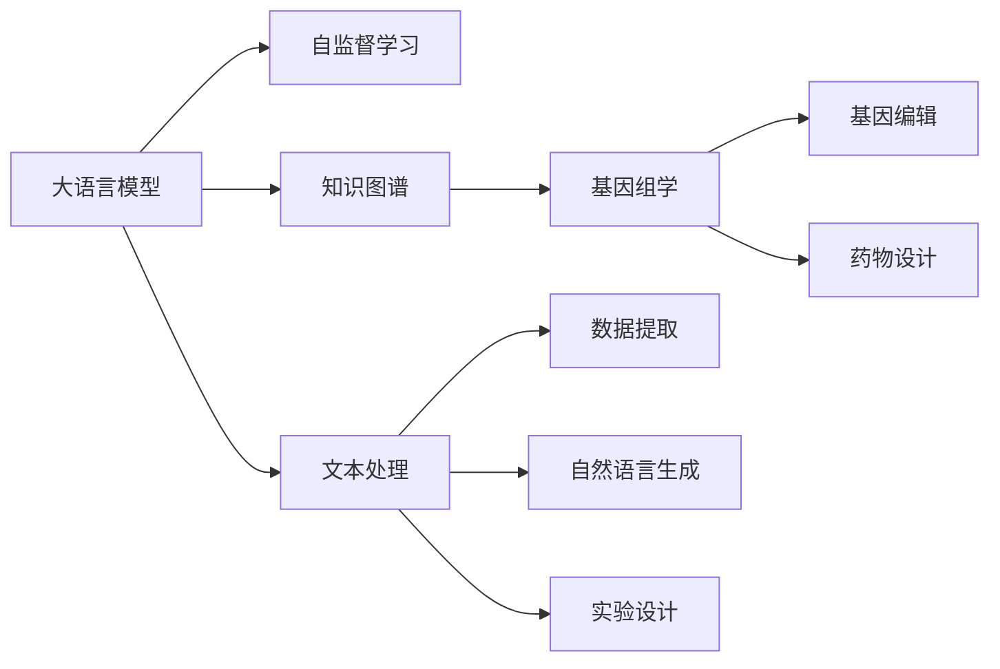
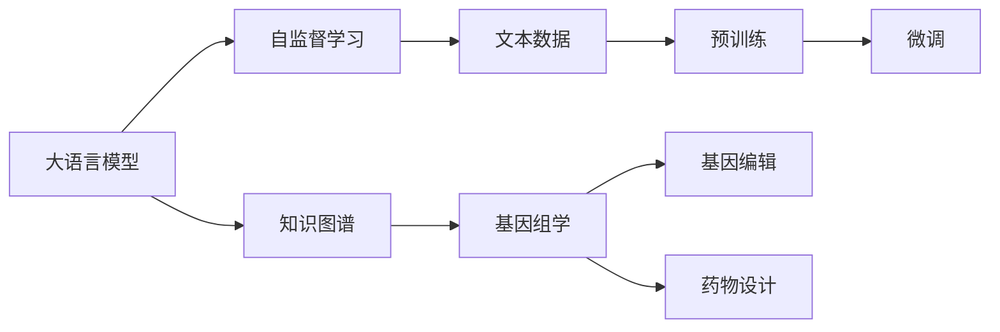
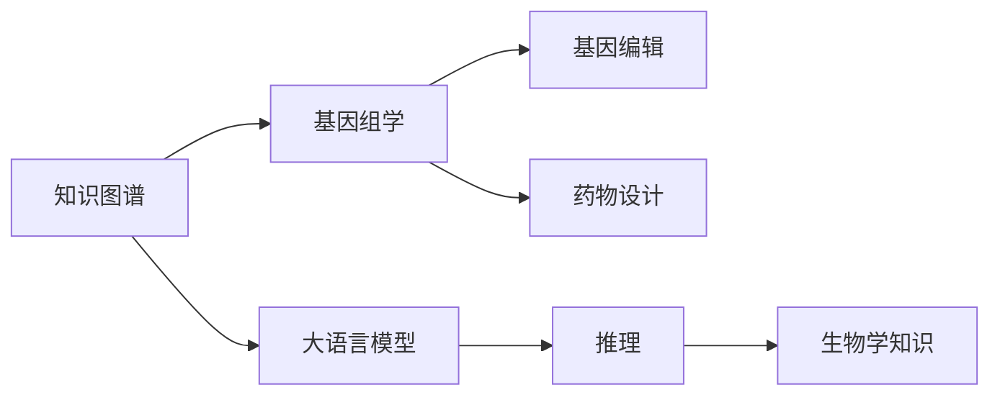
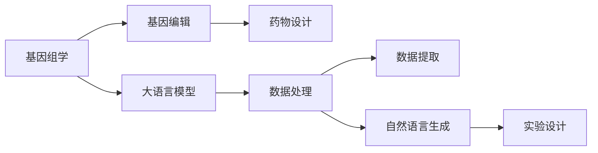

                 

# AI LLM在遗传学研究中的新方法

> 关键词：人工智能,大语言模型,遗传学,基因组学,基因编辑,药物设计

## 1. 背景介绍

### 1.1 问题由来
遗传学作为生命科学的重要分支，研究生物基因组的结构和功能，对于理解生命现象、指导疾病治疗、推进农业育种等领域具有深远影响。近年来，随着高通量测序技术的发展，基因组数据呈爆炸式增长，但如何从海量数据中提取有价值的信息，仍然是遗传学研究的重大挑战。传统的数据处理方法如手动比对、手动注释等，效率低下且容易引入主观误差。

人工智能，特别是大语言模型（Large Language Model, LLM）在自然语言处理（Natural Language Processing, NLP）领域取得了巨大成功，成为数据驱动研究的新范式。LLM具有强大的语义理解能力和知识推理能力，能够在自然语言语料库中进行自监督学习，从而获得广泛的常识和背景知识。本文将探讨大语言模型在遗传学研究中的应用，特别是如何利用LLM进行基因组学数据分析、基因编辑策略设计、药物分子设计等方面的研究。

### 1.2 问题核心关键点
利用大语言模型（如GPT-3、BERT、XLNet等）进行遗传学研究，具有以下核心关键点：

- **数据处理**：大语言模型可以处理大量的文本数据，从GenBank、PubMed等公共数据库中提取信息，为基因组学研究提供数据支持。
- **知识推理**：大语言模型可以推理复杂生物学的知识图谱，解释基因功能、通路、基因调控等，促进基因组学研究。
- **自然语言描述**：大语言模型可以生成自然语言描述，帮助研究者快速理解和交流研究成果。
- **自动化工作流程**：大语言模型可以辅助构建自动化工作流程，减少人工操作，提高研究效率。
- **个性化实验设计**：大语言模型可以生成个性化实验设计，指导基因编辑和药物筛选实验。

这些关键点展示了大语言模型在遗传学研究中的巨大潜力，但也带来了一些新的问题和挑战，如模型的可解释性、数据隐私、计算资源等。本文将从这些方面出发，深入探讨大语言模型在遗传学研究中的应用。

### 1.3 问题研究意义
大语言模型在遗传学研究中的应用，具有以下重要意义：

1. **提高研究效率**：自动化数据处理和知识推理可以显著提高遗传学研究的速度和精度。
2. **促进知识创新**：大语言模型能够整合和挖掘现有知识，激发新的生物学发现。
3. **优化实验设计**：通过生成个性化实验设计，指导实验，降低实验成本和失败率。
4. **提升科研质量**：大语言模型可以辅助生成研究论文、摘要、数据分析报告等，提高科研工作的可读性和可理解性。
5. **促进跨学科融合**：大语言模型可以作为遗传学研究的辅助工具，促进生物信息学、计算生物学、机器学习等学科的交叉融合。

总之，大语言模型在遗传学研究中的应用，将为生物信息的挖掘、基因功能的理解、个性化治疗方案的设计等带来新的视角和方法，推动遗传学研究的全面进步。

## 2. 核心概念与联系

### 2.1 核心概念概述

为了更好地理解大语言模型在遗传学研究中的应用，本节将介绍几个密切相关的核心概念：

- **大语言模型**：以自回归（如GPT-3）或自编码（如BERT）模型为代表的大规模预训练语言模型。通过在大规模无标签文本语料库上进行预训练，学习通用的语言表示，具备强大的语言理解和生成能力。
- **自监督学习**：在大规模无标签文本数据上进行自监督训练，如掩码语言模型（Masked Language Model, MLM）、下一个句子预测（Next Sentence Prediction, NSP）等，以学习语言的通用表示。
- **知识图谱**：一种结构化数据表示方法，用于描述实体（如基因、蛋白质、药物分子）之间的关系和属性，帮助推理和理解复杂的生物学知识。
- **基因组学**：研究基因组结构、功能和演化的学科，包括基因测序、基因编辑、药物设计等多个方向。
- **基因编辑**：通过精确修改基因组中的DNA序列，实现基因功能的人工调控，如CRISPR-Cas9等技术。
- **药物设计**：通过计算化学、生物信息学等方法，设计具有特定生物活性的药物分子。

这些核心概念之间的逻辑关系可以通过以下Mermaid流程图来展示：



这个流程图展示了大语言模型在遗传学研究中的主要作用：

1. 大语言模型通过自监督学习获得语言表示，可以处理和分析生物学文本数据。
2. 大语言模型可以推理生物学知识图谱，促进基因组学研究。
3. 大语言模型可以生成自然语言描述，帮助科研人员快速交流和理解研究成果。
4. 大语言模型可以辅助设计实验方案，指导基因编辑和药物筛选。

### 2.2 概念间的关系

这些核心概念之间存在着紧密的联系，形成了大语言模型在遗传学研究中的完整生态系统。下面我通过几个Mermaid流程图来展示这些概念之间的关系。

#### 2.2.1 大语言模型的学习范式



这个流程图展示了大语言模型的学习范式：

1. 大语言模型通过自监督学习从大规模文本数据中预训练，获得语言表示。
2. 预训练后，模型可以通过微调（Fine-tuning）进行特定任务的学习，如基因组学数据分析、基因编辑策略设计等。
3. 大语言模型可以推理生物学知识图谱，支持基因组学研究。
4. 大语言模型可以生成自然语言描述，帮助科研人员交流和理解研究成果。
5. 大语言模型可以辅助设计实验方案，指导基因编辑和药物筛选。

#### 2.2.2 知识图谱与大语言模型的关系



这个流程图展示了知识图谱与大语言模型之间的关系：

1. 知识图谱描述了生物学的实体关系和属性，是大语言模型推理和理解生物学知识的基础。
2. 大语言模型可以通过推理知识图谱，理解基因组学中的复杂关系和功能。
3. 大语言模型可以生成生物学知识的自然语言描述，帮助科研人员理解复杂的生物学概念。
4. 大语言模型可以辅助设计实验方案，指导基因编辑和药物筛选。

#### 2.2.3 基因组学与大语言模型的关系



这个流程图展示了基因组学与大语言模型之间的关系：

1. 基因组学研究需要处理大量的生物学文本数据，大语言模型可以处理和分析这些数据。
2. 大语言模型可以通过推理知识图谱，理解基因组学中的复杂关系和功能。
3. 大语言模型可以生成自然语言描述，帮助科研人员理解复杂的生物学概念。
4. 大语言模型可以辅助设计实验方案，指导基因编辑和药物筛选。

## 3. 核心算法原理 & 具体操作步骤
### 3.1 算法原理概述

基于大语言模型的遗传学研究，主要利用模型的语义理解和知识推理能力，对生物学文本数据进行处理和分析，生成自然语言描述，辅助实验设计等。其核心思想是：将大语言模型视作一个强大的“知识推理器”，通过自监督学习获得广泛的生物学知识，然后在特定任务上进行微调，获得针对具体问题的解决方案。

形式化地，假设大语言模型为 $M_{\theta}$，其中 $\theta$ 为模型参数。给定基因组学任务 $T$ 的文本数据集 $D=\{(x_i,y_i)\}_{i=1}^N$，微调的目标是找到新的模型参数 $\hat{\theta}$，使得：

$$
\hat{\theta}=\mathop{\arg\min}_{\theta} \mathcal{L}(M_{\theta},D)
$$

其中 $\mathcal{L}$ 为针对任务 $T$ 设计的损失函数，用于衡量模型预测输出与真实标签之间的差异。常见的损失函数包括交叉熵损失、均方误差损失等。

通过梯度下降等优化算法，微调过程不断更新模型参数 $\theta$，最小化损失函数 $\mathcal{L}$，使得模型输出逼近真实标签。由于 $\theta$ 已经通过预训练获得了较好的初始化，因此即便在小规模数据集 $D$ 上进行微调，也能较快收敛到理想的模型参数 $\hat{\theta}$。

### 3.2 算法步骤详解

基于大语言模型进行遗传学研究，通常包括以下几个关键步骤：

**Step 1: 准备预训练模型和数据集**
- 选择合适的预训练语言模型 $M_{\theta}$ 作为初始化参数，如 GPT-3、BERT 等。
- 准备基因组学任务的文本数据集 $D$，划分为训练集、验证集和测试集。一般要求数据与预训练数据的分布不要差异过大。

**Step 2: 添加任务适配层**
- 根据任务类型，在预训练模型顶层设计合适的输出层和损失函数。
- 对于分类任务，通常在顶层添加线性分类器和交叉熵损失函数。
- 对于生成任务，通常使用语言模型的解码器输出概率分布，并以负对数似然为损失函数。

**Step 3: 设置微调超参数**
- 选择合适的优化算法及其参数，如 AdamW、SGD 等，设置学习率、批大小、迭代轮数等。
- 设置正则化技术及强度，包括权重衰减、Dropout、Early Stopping 等。
- 确定冻结预训练参数的策略，如仅微调顶层，或全部参数都参与微调。

**Step 4: 执行梯度训练**
- 将训练集数据分批次输入模型，前向传播计算损失函数。
- 反向传播计算参数梯度，根据设定的优化算法和学习率更新模型参数。
- 周期性在验证集上评估模型性能，根据性能指标决定是否触发 Early Stopping。
- 重复上述步骤直到满足预设的迭代轮数或 Early Stopping 条件。

**Step 5: 测试和部署**
- 在测试集上评估微调后模型 $M_{\hat{\theta}}$ 的性能，对比微调前后的精度提升。
- 使用微调后的模型对新样本进行推理预测，集成到实际的应用系统中。
- 持续收集新的数据，定期重新微调模型，以适应数据分布的变化。

以上是基于大语言模型进行遗传学研究的一般流程。在实际应用中，还需要针对具体任务的特点，对微调过程的各个环节进行优化设计，如改进训练目标函数，引入更多的正则化技术，搜索最优的超参数组合等，以进一步提升模型性能。

### 3.3 算法优缺点

基于大语言模型进行遗传学研究，具有以下优点：

- **处理大规模数据**：大语言模型可以处理大量的生物学文本数据，从GenBank、PubMed等公共数据库中提取信息。
- **推理复杂知识**：大语言模型可以推理复杂的生物学知识，理解基因功能、通路、基因调控等。
- **生成自然语言描述**：大语言模型可以生成自然语言描述，帮助科研人员快速理解和交流研究成果。
- **辅助实验设计**：大语言模型可以生成个性化实验设计，指导基因编辑和药物筛选实验。
- **促进跨学科融合**：大语言模型可以作为遗传学研究的辅助工具，促进生物信息学、计算生物学、机器学习等学科的交叉融合。

同时，该方法也存在一些局限性：

- **数据隐私问题**：使用公开数据集时，需要关注数据隐私和版权问题。
- **计算资源需求**：大语言模型通常需要强大的计算资源，如GPU、TPU等，对算力要求较高。
- **可解释性不足**：大语言模型往往被视为“黑盒”系统，难以解释其内部工作机制和决策逻辑。
- **数据质量依赖**：大语言模型性能高度依赖于输入数据的准确性和多样性，低质量数据可能引入误差。
- **学习效率低下**：由于大语言模型参数量巨大，微调过程可能收敛缓慢。

尽管存在这些局限性，但就目前而言，基于大语言模型的遗传学研究方法已经显示出巨大的潜力，为遗传学研究带来了新的视角和方法。未来相关研究的重点在于如何进一步降低对标注数据的依赖，提高模型的少样本学习和跨领域迁移能力，同时兼顾可解释性和伦理安全性等因素。

### 3.4 算法应用领域

基于大语言模型进行遗传学研究，已经在多个领域取得了初步应用：

- **基因组数据分析**：利用大语言模型对基因组序列进行注释和功能预测，如基因编码区识别、基因变异检测等。
- **基因编辑策略设计**：使用大语言模型生成个性化基因编辑策略，优化CRISPR-Cas9等工具的设计，提高基因编辑效率和成功率。
- **药物分子设计**：通过大语言模型生成药物分子结构和功能预测，加速新药发现和开发过程。
- **个性化治疗方案**：利用大语言模型生成个性化治疗方案，根据基因组信息指导个体化治疗。
- **生物学知识图谱构建**：通过大语言模型自动生成生物学知识图谱，支持复杂生物学知识的推理和理解。

除了上述这些经典应用外，大语言模型还被创新性地应用于更多场景中，如可控文本生成、常识推理、多模态信息融合等，为遗传学研究带来了新的突破。随着大语言模型的不断进步，相信其在遗传学领域的应用将更加广泛和深入。

## 4. 数学模型和公式 & 详细讲解

### 4.1 数学模型构建

本节将使用数学语言对基于大语言模型的遗传学研究方法进行更加严格的刻画。

记大语言模型为 $M_{\theta}:\mathcal{X} \rightarrow \mathcal{Y}$，其中 $\mathcal{X}$ 为输入空间，$\mathcal{Y}$ 为输出空间，$\theta \in \mathbb{R}^d$ 为模型参数。假设基因组学任务的训练集为 $D=\{(x_i,y_i)\}_{i=1}^N, x_i \in \mathcal{X}, y_i \in \mathcal{Y}$。

定义模型 $M_{\theta}$ 在数据样本 $(x,y)$ 上的损失函数为 $\ell(M_{\theta}(x),y)$，则在数据集 $D$ 上的经验风险为：

$$
\mathcal{L}(\theta) = \frac{1}{N} \sum_{i=1}^N \ell(M_{\theta}(x_i),y_i)
$$

微调的优化目标是最小化经验风险，即找到最优参数：

$$
\theta^* = \mathop{\arg\min}_{\theta} \mathcal{L}(\theta)
$$

在实践中，我们通常使用基于梯度的优化算法（如SGD、Adam等）来近似求解上述最优化问题。设 $\eta$ 为学习率，$\lambda$ 为正则化系数，则参数的更新公式为：

$$
\theta \leftarrow \theta - \eta \nabla_{\theta}\mathcal{L}(\theta) - \eta\lambda\theta
$$

其中 $\nabla_{\theta}\mathcal{L}(\theta)$ 为损失函数对参数 $\theta$ 的梯度，可通过反向传播算法高效计算。

### 4.2 公式推导过程

以下我们以基因组数据分析任务为例，推导交叉熵损失函数及其梯度的计算公式。

假设模型 $M_{\theta}$ 在输入 $x$ 上的输出为 $\hat{y}=M_{\theta}(x) \in [0,1]$，表示样本属于某个基因的概率。真实标签 $y \in \{0,1\}$。则二分类交叉熵损失函数定义为：

$$
\ell(M_{\theta}(x),y) = -[y\log \hat{y} + (1-y)\log (1-\hat{y})]
$$

将其代入经验风险公式，得：

$$
\mathcal{L}(\theta) = -\frac{1}{N}\sum_{i=1}^N [y_i\log M_{\theta}(x_i)+(1-y_i)\log(1-M_{\theta}(x_i))]
$$

根据链式法则，损失函数对参数 $\theta_k$ 的梯度为：

$$
\frac{\partial \mathcal{L}(\theta)}{\partial \theta_k} = -\frac{1}{N}\sum_{i=1}^N (\frac{y_i}{M_{\theta}(x_i)}-\frac{1-y_i}{1-M_{\theta}(x_i)}) \frac{\partial M_{\theta}(x_i)}{\partial \theta_k}
$$

其中 $\frac{\partial M_{\theta}(x_i)}{\partial \theta_k}$ 可进一步递归展开，利用自动微分技术完成计算。

在得到损失函数的梯度后，即可带入参数更新公式，完成模型的迭代优化。重复上述过程直至收敛，最终得到适应基因组学任务的最优模型参数 $\theta^*$。

## 5. 项目实践：代码实例和详细解释说明
### 5.1 开发环境搭建

在进行遗传学研究微调实践前，我们需要准备好开发环境。以下是使用Python进行PyTorch开发的环境配置流程：

1. 安装Anaconda：从官网下载并安装Anaconda，用于创建独立的Python环境。

2. 创建并激活虚拟环境：
```bash
conda create -n pytorch-env python=3.8 
conda activate pytorch-env
```

3. 安装PyTorch：根据CUDA版本，从官网获取对应的安装命令。例如：
```bash
conda install pytorch torchvision torchaudio cudatoolkit=11.1 -c pytorch -c conda-forge
```

4. 安装Transformers库：
```bash
pip install transformers
```

5. 安装各类工具包：
```bash
pip install numpy pandas scikit-learn matplotlib tqdm jupyter notebook ipython
```

完成上述步骤后，即可在`pytorch-env`环境中开始微调实践。

### 5.2 源代码详细实现

这里我们以基因组数据分析任务为例，给出使用Transformers库对BERT模型进行微调的PyTorch代码实现。

首先，定义基因组数据分析任务的数据处理函数：

```python
from transformers import BertTokenizer
from torch.utils.data import Dataset
import torch

class GenomicDataDataset(Dataset):
    def __init__(self, genomic_data, labels, tokenizer, max_len=128):
        self.genomic_data = genomic_data
        self.labels = labels
        self.tokenizer = tokenizer
        self.max_len = max_len
        
    def __len__(self):
        return len(self.genomic_data)
    
    def __getitem__(self, item):
        genomic_data = self.genomic_data[item]
        label = self.labels[item]
        
        encoding = self.tokenizer(genomic_data, return_tensors='pt', max_length=self.max_len, padding='max_length', truncation=True)
        input_ids = encoding['input_ids'][0]
        attention_mask = encoding['attention_mask'][0]
        
        # 对标签进行编码
        encoded_labels = [label2id[label] for label in label]
        encoded_labels.extend([label2id['None']] * (self.max_len - len(encoded_labels)))
        labels = torch.tensor(encoded_labels, dtype=torch.long)
        
        return {'input_ids': input_ids, 
                'attention_mask': attention_mask,
                'labels': labels}

# 标签与id的映射
label2id = {'Gene': 0, 'Non-coding': 1}
id2label = {v: k for k, v in label2id.items()}

# 创建dataset
tokenizer = BertTokenizer.from_pretrained('bert-base-cased')

train_dataset = GenomicDataDataset(train_genomic_data, train_labels, tokenizer)
dev_dataset = GenomicDataDataset(dev_genomic_data, dev_labels, tokenizer)
test_dataset = GenomicDataDataset(test_genomic_data, test_labels, tokenizer)
```

然后，定义模型和优化器：

```python
from transformers import BertForTokenClassification, AdamW

model = BertForTokenClassification.from_pretrained('bert-base-cased', num_labels=len(label2id))

optimizer = AdamW(model.parameters(), lr=2e-5)
```

接着，定义训练和评估函数：

```python
from torch.utils.data import DataLoader
from tqdm import tqdm
from sklearn.metrics import classification_report

device = torch.device('cuda') if torch.cuda.is_available() else torch.device('cpu')
model.to(device)

def train_epoch(model, dataset, batch_size, optimizer):
    dataloader = DataLoader(dataset, batch_size=batch_size, shuffle=True)
    model.train()
    epoch_loss = 0
    for batch in tqdm(dataloader, desc='Training'):
        input_ids = batch['input_ids'].to(device)
        attention_mask = batch['attention_mask'].to(device)
        labels = batch['labels'].to(device)
        model.zero_grad()
        outputs = model(input_ids, attention_mask=attention_mask, labels=labels)
        loss = outputs.loss
        epoch_loss += loss.item()
        loss.backward()
        optimizer.step()
    return epoch_loss / len(dataloader)

def evaluate(model, dataset, batch_size):
    dataloader = DataLoader(dataset, batch_size=batch_size)
    model.eval()
    preds, labels = [], []
    with torch.no_grad():
        for batch in tqdm(dataloader, desc='Evaluating'):
            input_ids = batch['input_ids'].to(device)
            attention_mask = batch['attention_mask'].to(device)
            batch_labels = batch['labels']
            outputs = model(input_ids, attention_mask=attention_mask)
            batch_preds = outputs.logits.argmax(dim=2).to('cpu').tolist()
            batch_labels = batch_labels.to('cpu').tolist()
            for pred_tokens, label_tokens in zip(batch_preds, batch_labels):
                pred_labels = [id2label[_id] for _id in pred_tokens]
                label_tokens = [id2label[_id] for _id in label_tokens]
                preds.append(pred_labels[:len(label_tokens)])
                labels.append(label_tokens)
                
    print(classification_report(labels, preds))
```

最后，启动训练流程并在测试集上评估：

```python
epochs = 5
batch_size = 16

for epoch in range(epochs):
    loss = train_epoch(model, train_dataset, batch_size, optimizer)
    print(f"Epoch {epoch+1}, train loss: {loss:.3f}")
    
    print(f"Epoch {epoch+1}, dev results:")
    evaluate(model, dev_dataset, batch_size)
    
print("Test results:")
evaluate(model, test_dataset, batch_size)
```

以上就是使用PyTorch对BERT进行基因组数据分析任务微调的完整代码实现。可以看到，得益于Transformers库的强大封装，我们可以用相对简洁的代码完成BERT模型的加载和微调。

### 5.3 代码解读与分析

让我们再详细解读一下关键代码的实现细节：

**GenomicDataDataset类**：
- `__init__`方法：初始化基因组数据、标签、分词器等关键组件。
- `__len__`方法：返回数据集的样本数量。
- `__getitem__`方法：对单个样本进行处理，将基因组数据输入编码为token ids，将标签编码为数字，并对其进行定长padding，最终返回模型所需的输入。

**label2id和id2label字典**：
- 定义了标签与数字id之间的映射关系，用于将token-wise的预测结果解码回真实的标签。

**训练和评估函数**：
- 使用PyTorch的DataLoader对数据集进行批次化加载，供模型训练和推理使用。
- 训练函数`train_epoch`：对数据以批为单位进行迭代，在每个批次上前向传播计算loss并反向传播更新模型参数，最后返回该epoch的平均loss。
- 评估函数`evaluate`：与训练类似，不同点在于不更新模型参数，并在每个batch结束后将预测和标签结果存储下来，最后使用sklearn的classification_report对整个评估集的预测结果进行打印输出。

**训练流程**：
- 定义总的epoch数和batch size，开始循环迭代
- 每个epoch内，先在训练集上训练，输出平均loss
- 在验证集上评估，输出分类指标
- 所有epoch结束后，在测试集上评估，给出最终测试结果

可以看到，PyTorch配合Transformers库使得BERT微调的代码实现变得简洁高效。开发者可以将更多精力放在数据处理、模型改进等高层逻辑上，而不必过多关注底层的实现细节。

当然，工业级的系统实现还需考虑更多因素，如模型的保存和部署、超参数的自动搜索、更灵活的任务适配层等。但核心的微调范式基本与此类似。


