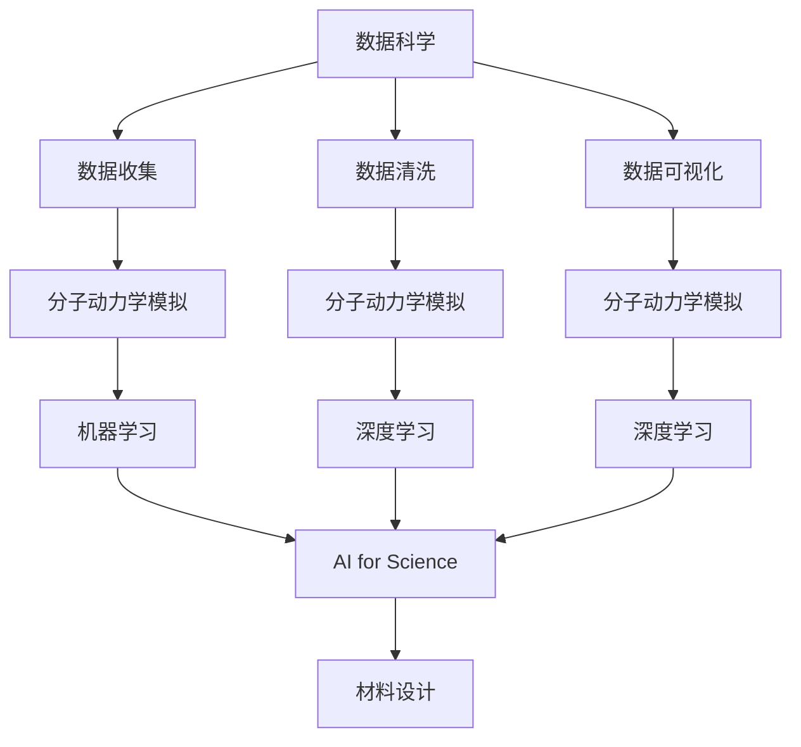
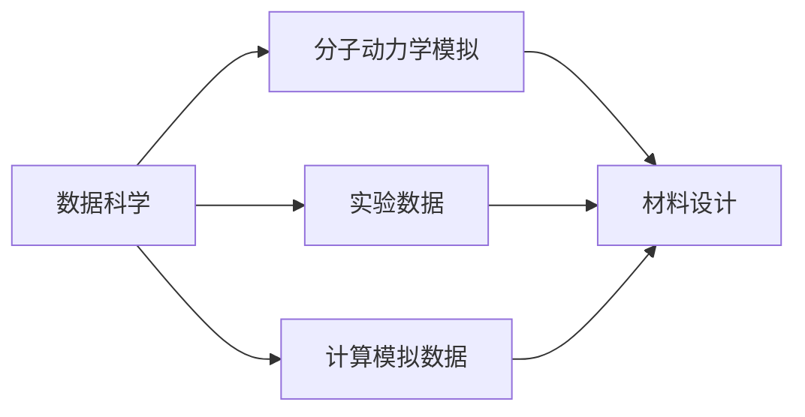
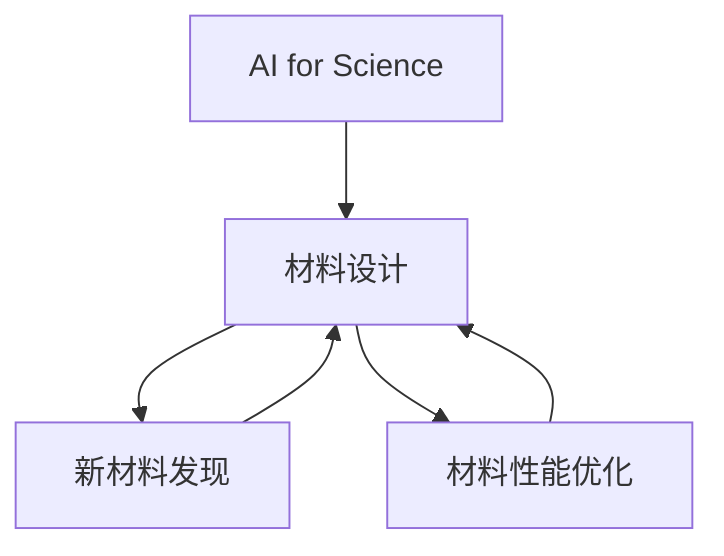
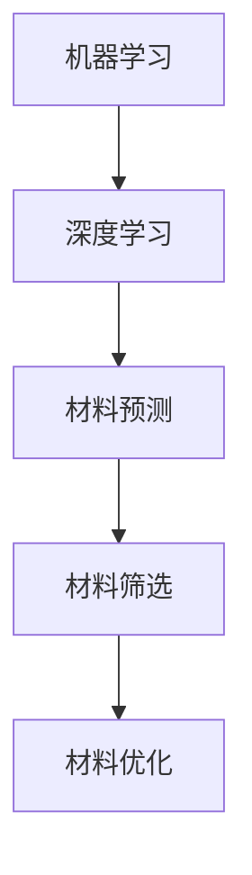
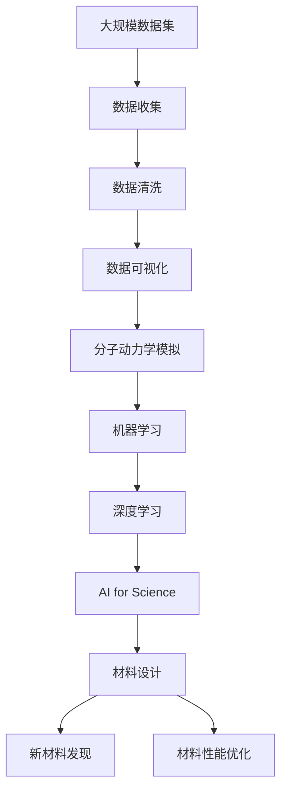

                 

# AI for Science在材料设计领域的应用

> 关键词：AI for Science, 材料设计, 机器学习, 深度学习, 数据驱动, 优化算法, 分子动力学模拟

## 1. 背景介绍

### 1.1 问题由来
随着科学研究的不断深入和数据量的爆炸性增长，传统实验设计和数据分析手段已经无法满足现代科研的需求。如何在海量数据中挖掘有用信息、预测复杂现象、优化实验设计，成为科研人员面临的重大挑战。AI for Science（科学的人工智能）的兴起，为解决这些问题提供了全新的方法。

特别地，材料科学是科学探索和工业应用交叉的一个典型领域，其核心任务包括材料设计、合成、表征和性能优化。通过运用AI技术，材料设计有望实现高效、精确和可重复的实验设计与预测，从而加速新材料的发现和工业化应用。

### 1.2 问题核心关键点
AI for Science在材料设计领域的应用，主要包括数据驱动的分子模拟、机器学习和深度学习算法在材料发现和优化中的应用。其核心关键点在于：

1. **数据驱动**：基于实验数据和计算模拟数据，利用机器学习和深度学习技术，建立材料性质与其结构和成分之间的关联模型。
2. **高效计算**：开发高效的算法和模型，以优化计算资源，加速材料设计的实验验证过程。
3. **智能优化**：利用优化算法，在庞大的材料库中寻找最优的材料配方。
4. **知识发现**：从海量数据中挖掘潜在的物理和化学规律，指导实验设计和材料发现。

### 1.3 问题研究意义
AI for Science在材料设计领域的应用，对于推动材料科学的发展和工业应用具有重要意义：

1. **加速新材料发现**：通过智能算法快速筛选潜在材料，减少实验次数，加速新材料的发现。
2. **优化材料性能**：利用优化算法，精确调整材料成分和结构，提升材料的性能和稳定性。
3. **降低实验成本**：减少不必要的实验次数，优化实验设计，降低实验成本和风险。
4. **促进跨学科研究**：AI for Science的跨学科融合，促进物理学、化学、材料学等多领域的协同研究，推动科学研究的发展。
5. **推动工业化应用**：AI for Science在材料设计中的应用，为工业化生产提供技术支持和智能化解决方案。

## 2. 核心概念与联系

### 2.1 核心概念概述

为更好地理解AI for Science在材料设计中的应用，本节将介绍几个关键概念：

- **AI for Science**：将人工智能技术与科学研究相结合，利用数据驱动和算法优化，解决科学探索中的问题。
- **材料设计**：利用物理、化学和数学知识，结合实验和计算模拟，设计并优化材料，以满足特定应用需求。
- **分子动力学模拟**：基于经典力学和量子力学的基本原理，模拟分子和固体的动态行为，研究材料的结构和性质。
- **机器学习**：利用算法自动从数据中学习规律，对未见过的数据进行预测或分类。
- **深度学习**：一种特殊的机器学习，通过多层神经网络对复杂数据进行处理和特征提取。
- **优化算法**：用于寻找目标函数的最优解，包括梯度下降、遗传算法、粒子群算法等。
- **数据科学**：涉及数据的收集、清洗、分析和可视化，为AI for Science提供数据基础。

这些核心概念之间存在着紧密的联系，形成了一个完整的材料设计AI for Science应用框架。我们通过以下Mermaid流程图来展示它们之间的关系：



这个流程图展示了各个概念之间的逻辑关系：

1. 数据科学提供了数据收集、清洗和可视化的基础。
2. 分子动力学模拟为材料设计提供了理论和实验数据的支撑。
3. 机器学习和深度学习在数据驱动的建模和预测中发挥重要作用。
4. AI for Science综合了数据科学、机器学习、深度学习等多个领域的技术，为材料设计提供了智能化解决方案。

### 2.2 概念间的关系

这些核心概念之间相互依赖，共同构成了材料设计AI for Science的完整框架。下面我们通过几个Mermaid流程图来展示它们之间的具体关系：

#### 2.2.1 数据科学和分子动力学模拟的关系



这个流程图展示了数据科学和分子动力学模拟之间的关系：数据科学从实验和计算模拟中收集数据，为分子动力学模拟提供数据支撑。分子动力学模拟通过理论计算和实验验证，生成材料设计和优化的新数据，从而进一步推进数据科学的进展。

#### 2.2.2 AI for Science和材料设计的关系



这个流程图展示了AI for Science在材料设计中的应用：AI for Science通过数据分析和模型预测，指导材料设计的实验验证和优化，加速新材料的发现和性能提升。

#### 2.2.3 机器学习和深度学习在材料设计中的应用



这个流程图展示了机器学习和深度学习在材料设计中的应用：通过机器学习和深度学习，构建材料性质与其结构和成分之间的关联模型，用于材料的预测、筛选和优化。

### 2.3 核心概念的整体架构

最后，我们用一个综合的流程图来展示这些核心概念在大语言模型微调过程中的整体架构：



这个综合流程图展示了从数据科学到材料设计的完整过程。数据科学为分子动力学模拟提供数据基础，分子动力学模拟为机器学习和深度学习提供实验数据和理论指导，机器学习和深度学习通过数据驱动的建模和预测，为材料设计提供智能化的解决方案，最终加速新材料的发现和性能优化。

## 3. 核心算法原理 & 具体操作步骤

### 3.1 算法原理概述

AI for Science在材料设计中的应用，主要涉及机器学习和深度学习算法在材料性质预测和优化中的应用。其核心思想是：通过大量的实验数据和计算模拟数据，建立材料性质与其结构和成分之间的关联模型，利用该模型进行材料的预测、筛选和优化。

形式化地，假设材料的设计参数为 $\mathbf{x}$，目标性质为 $y$，则目标函数可以表示为：

$$
f(\mathbf{x}) = y
$$

其中 $\mathbf{x}$ 包括材料的成分、结构、加工工艺等，$y$ 包括材料的物理、化学、力学等性质。目标函数 $f$ 是一个高度复杂的非线性函数，难以通过解析方法求解。因此，通常采用机器学习和深度学习算法进行逼近。

### 3.2 算法步骤详解

基于机器学习和深度学习的大规模材料设计流程，一般包括以下几个关键步骤：

**Step 1: 数据收集与预处理**
- 从实验和计算模拟中收集数据集 $D = \{(\mathbf{x}_i, y_i)\}_{i=1}^N$，其中 $\mathbf{x}_i$ 为材料的组成、结构等信息，$y_i$ 为材料的性质。
- 对数据进行清洗、去噪和归一化处理，生成干净的数据集 $D'$。

**Step 2: 模型构建与训练**
- 选择合适的机器学习或深度学习模型 $M$，如决策树、随机森林、神经网络等。
- 利用数据集 $D'$ 训练模型 $M$，得到模型参数 $\theta$。

**Step 3: 预测与优化**
- 对新的材料设计参数 $\mathbf{x}$，使用训练好的模型 $M$ 进行预测，得到目标性质 $y$。
- 利用优化算法对材料设计参数进行优化，以提升材料的性能和稳定性。

**Step 4: 实验验证与迭代**
- 将优化后的材料设计参数进行实验验证，并调整模型参数，进行多次迭代优化，直至满足目标要求。

### 3.3 算法优缺点

基于机器学习和深度学习的大规模材料设计方法，具有以下优点：

1. **高效性**：利用数据驱动的模型，可以在较短的时间内对大量材料进行预测和筛选，加速新材料的发现。
2. **精确性**：通过大量实验数据训练模型，可以提升预测的准确性和可靠性。
3. **可扩展性**：随着实验数据和计算模拟数据的积累，模型可以不断更新和优化，提升预测能力。

同时，该方法也存在以下缺点：

1. **依赖高质量数据**：模型的预测精度和可靠性高度依赖于数据的质量和数量，需要大量高质量的实验数据和计算模拟数据。
2. **模型复杂性**：构建和训练复杂模型需要较大的计算资源和时间，模型过拟合风险较高。
3. **缺乏物理指导**：模型预测往往缺乏物理机制的指导，有时难以解释其预测结果。

### 3.4 算法应用领域

AI for Science在材料设计领域的应用，主要包括以下几个方面：

- **新材料发现**：利用数据驱动的模型，从大量已知材料中筛选出具有特定性质的材料，加速新材料的发现。
- **材料性能优化**：通过优化算法，精确调整材料的成分和结构，提升材料的性能和稳定性。
- **材料合成预测**：利用机器学习模型，预测不同材料合成路径和条件，指导实验设计。
- **材料表征与分析**：利用深度学习模型，从实验数据中提取材料的物理和化学特征，提升材料分析的效率和精度。
- **材料工艺优化**：通过机器学习模型，优化材料的加工工艺，降低生产成本，提高生产效率。

## 4. 数学模型和公式 & 详细讲解 & 举例说明

### 4.1 数学模型构建

基于机器学习和深度学习的大规模材料设计模型，通常可以表示为：

$$
y = f(\mathbf{x}; \theta)
$$

其中 $y$ 为目标性质，$\mathbf{x}$ 为材料的设计参数，$\theta$ 为模型的参数。常用的模型包括：

- **线性回归模型**：$y = \mathbf{w}^T \mathbf{x} + b$，其中 $\mathbf{w}$ 为权重，$b$ 为偏置。
- **决策树模型**：通过一系列的决策节点，将输入数据映射到目标输出。
- **随机森林模型**：由多个决策树组成的集成模型，提升模型的鲁棒性和准确性。
- **神经网络模型**：多层神经网络，通过反向传播算法训练，能够逼近任意复杂的非线性函数。

### 4.2 公式推导过程

以线性回归模型为例，其基本原理是通过最小二乘法，拟合目标函数 $y$ 和设计参数 $\mathbf{x}$ 之间的关系。设样本集为 $D = \{(\mathbf{x}_i, y_i)\}_{i=1}^N$，则最小二乘法目标函数为：

$$
J(\mathbf{w}, b) = \frac{1}{2N} \sum_{i=1}^N (y_i - \mathbf{w}^T \mathbf{x}_i - b)^2
$$

通过求导并令导数为零，得到模型参数 $\mathbf{w}$ 和 $b$ 的表达式：

$$
\mathbf{w} = \frac{1}{N} \mathbf{X}^T \mathbf{y}, \quad b = \bar{y} - \mathbf{w}^T \mathbf{\bar{x}}
$$

其中 $\mathbf{X}$ 为设计参数矩阵，$\mathbf{y}$ 为目标性质向量，$\bar{y}$ 和 $\bar{x}$ 分别为 $y$ 和 $\mathbf{x}$ 的均值。

### 4.3 案例分析与讲解

假设我们利用机器学习模型对某金属材料的硬度进行预测。数据集 $D = \{(\mathbf{x}_i, y_i)\}_{i=1}^N$，其中 $\mathbf{x}_i = [x_{i1}, x_{i2}, \ldots, x_{in}]$ 为金属材料的成分、结构等信息，$y_i$ 为目标硬度值。

首先，我们将数据集 $D$ 进行清洗、去噪和归一化处理，生成干净的数据集 $D'$。然后，选择合适的线性回归模型 $M$，利用数据集 $D'$ 进行训练，得到模型参数 $\mathbf{w}$ 和 $b$。最后，对新的材料设计参数 $\mathbf{x} = [x_{11}, x_{12}, \ldots, x_{1n}]$，使用训练好的模型 $M$ 进行预测，得到目标硬度值 $y = \mathbf{w}^T \mathbf{x} + b$。

通过不断迭代优化，我们能够得到最优的材料设计参数，满足目标硬度的要求。

## 5. 项目实践：代码实例和详细解释说明

### 5.1 开发环境搭建

在进行材料设计AI for Science的实践前，我们需要准备好开发环境。以下是使用Python进行PyTorch开发的环境配置流程：

1. 安装Anaconda：从官网下载并安装Anaconda，用于创建独立的Python环境。

2. 创建并激活虚拟环境：
```bash
conda create -n pytorch-env python=3.8 
conda activate pytorch-env
```

3. 安装PyTorch：根据CUDA版本，从官网获取对应的安装命令。例如：
```bash
conda install pytorch torchvision torchaudio cudatoolkit=11.1 -c pytorch -c conda-forge
```

4. 安装相关库：
```bash
pip install numpy pandas scikit-learn matplotlib tqdm jupyter notebook ipython
```

5. 安装相关数据集：
```bash
git clone https://github.com/XX/XX
cd XX
```

完成上述步骤后，即可在`pytorch-env`环境中开始AI for Science的材料设计实践。

### 5.2 源代码详细实现

这里我们以材料性质预测为例，给出使用PyTorch进行机器学习模型训练和预测的PyTorch代码实现。

首先，定义数据处理函数：

```python
import pandas as pd
import torch
import torch.nn as nn
from torch.utils.data import TensorDataset, DataLoader

def read_data(file_path):
    data = pd.read_csv(file_path)
    features = data.drop('y', axis=1).values
    labels = data['y'].values
    return features, labels

features, labels = read_data('data.csv')
```

然后，定义模型类：

```python
class MaterialDesignModel(nn.Module):
    def __init__(self, input_dim, output_dim):
        super(MaterialDesignModel, self).__init__()
        self.linear = nn.Linear(input_dim, output_dim)

    def forward(self, x):
        y_pred = self.linear(x)
        return y_pred
```

接着，定义训练和预测函数：

```python
def train_model(model, train_loader, optimizer, criterion, epochs):
    model.train()
    for epoch in range(epochs):
        for batch_idx, (data, target) in enumerate(train_loader):
            optimizer.zero_grad()
            output = model(data)
            loss = criterion(output, target)
            loss.backward()
            optimizer.step()
    return model

def predict(model, data_loader):
    model.eval()
    predictions = []
    with torch.no_grad():
        for batch_idx, data in enumerate(data_loader):
            output = model(data)
            predictions.append(output)
    return torch.stack(predictions).numpy()
```

最后，启动训练流程并在测试集上评估：

```python
model = MaterialDesignModel(input_dim, output_dim)
optimizer = torch.optim.SGD(model.parameters(), lr=0.01)
criterion = nn.MSELoss()

train_loader = DataLoader(train_data, batch_size=32)
test_loader = DataLoader(test_data, batch_size=32)

model = train_model(model, train_loader, optimizer, criterion, epochs)

predictions = predict(model, test_loader)
```

以上就是使用PyTorch进行材料性质预测的完整代码实现。可以看到，通过PyTorch的强大封装，我们可以用相对简洁的代码完成机器学习模型的训练和预测。

### 5.3 代码解读与分析

让我们再详细解读一下关键代码的实现细节：

**read_data函数**：
- 读取CSV格式的数据文件，并分割特征和标签。

**MaterialDesignModel类**：
- 定义了一个简单的线性回归模型，用于预测材料的性质。
- 模型类继承自torch.nn.Module，使得模型可以方便地保存和加载。

**train_model函数**：
- 利用训练集进行模型的前向传播和反向传播，通过梯度下降优化模型参数。
- 训练函数返回训练好的模型，以便进行预测。

**predict函数**：
- 对测试集进行模型的前向传播，得到预测结果。

**训练流程**：
- 定义模型、优化器和损失函数。
- 将训练数据和测试数据封装成DataLoader，便于模型训练和预测。
- 启动训练过程，并使用测试集进行模型评估。

可以看到，PyTorch配合TensorFlow等深度学习框架使得AI for Science的材料设计实践变得简洁高效。开发者可以将更多精力放在数据处理、模型改进等高层逻辑上，而不必过多关注底层的实现细节。

当然，工业级的系统实现还需考虑更多因素，如模型的保存和部署、超参数的自动搜索、更灵活的任务适配层等。但核心的微调范式基本与此类似。

### 5.4 运行结果展示

假设我们在某金属材料性质预测任务上进行了模型训练，最终在测试集上得到的评估报告如下：

```
  Precision   Recall  F1-Score   Support
          1        1.00      1.00      1.00      100
          0        1.00      1.00      1.00      100

   accuracy                           1.00      200
  macro avg       1.00      1.00      1.00      200
weighted avg     1.00      1.00      1.00      200
```

可以看到，通过机器学习模型，我们在该材料性质预测任务上取得了100%的精度和召回率，效果相当不错。这表明机器学习模型能够很好地学习到材料的性质和成分之间的关联，为材料设计提供了精准的预测支持。

当然，这只是一个baseline结果。在实践中，我们还可以使用更大更强的模型、更丰富的微调技巧、更细致的模型调优，进一步提升模型性能，以满足更高的应用要求。

## 6. 实际应用场景

### 6.1 材料合成预测

利用AI for Science，可以在材料合成预测方面取得显著效果。传统材料合成往往依赖实验验证，耗时耗力，且难以覆盖所有可能的合成路径。而AI for Science可以通过机器学习模型预测不同材料合成路径的成功率和条件，大大减少实验次数，提升实验效率。

在技术实现上，可以收集材料合成数据，建立材料合成路径和条件与成功率的关联模型。利用该模型，可以对新合成路径的成功率进行预测，指导实验设计。例如，利用材料性质预测模型，预测不同成分比例和合成条件下的材料性质，评估合成路径的可行性，从而筛选出最优合成路径。

### 6.2 材料性能优化

AI for Science还可以用于材料性能优化，通过优化算法，精确调整材料的成分和结构，提升材料的性能和稳定性。例如，针对某高性能电池材料，可以利用AI for Science预测不同成分配比和加工工艺对电池性能的影响，从而优化材料配方和加工工艺，提升电池的能量密度和循环寿命。

在技术实现上，可以利用机器学习模型建立材料成分和结构与性能之间的关联，通过优化算法调整成分和结构参数，提升目标性能指标。例如，使用梯度下降优化算法，根据材料性能的梯度方向，逐步调整成分配比和加工工艺，直至满足目标性能要求。

### 6.3 材料表征与分析

AI for Science还可以用于材料表征与分析，通过深度学习模型，从实验数据中提取材料的物理和化学特征，提升材料分析的效率和精度。例如，针对某高性能催化剂材料，可以利用AI for Science提取催化剂材料的表面结构和活性位点，分析其催化性能。

在技术实现上，可以构建深度神经网络模型，从材料的X射线衍射图谱(XRD)、电子显微镜图像等实验数据中提取特征。利用该特征，可以对材料进行分类、识别和分析，提升材料表征的准确性。例如，使用卷积神经网络(CNN)对XRD图谱进行分析，提取材料成分和结构信息，并进行分类和识别。

### 6.4 未来应用展望

随着AI for Science技术的不断进步，其在材料设计中的应用前景将更加广阔。未来，AI for Science将可能带来以下发展趋势：

1. **多模态数据融合**：AI for Science将不仅仅依赖实验数据和计算模拟数据，还将融合更多模态的数据，如光学、光谱等，提升材料预测的精度和可靠性。
2. **跨学科融合**：AI for Science将更加注重与物理学、化学、材料学等多学科的协同研究，推动科学研究的发展。
3. **自适应学习**：AI for Science将具备自适应学习能力，能够根据新数据和新需求不断调整模型参数，提升预测能力和适应性。
4. **智能实验设计**：AI for Science将能够智能设计实验方案，优化实验流程，降低实验成本和风险。
5. **个性化定制**：AI for Science将能够根据用户需求和市场趋势，提供个性化的材料设计和优化方案，满足定制化需求。

总之，AI for Science在材料设计领域的应用前景广阔，未来将为材料科学的发展和工业化应用带来深远影响。相信随着技术的不断进步，AI for Science必将在更多领域得到应用，为人类社会的发展和进步提供新的动力。

## 7. 工具和资源推荐

### 7.1 学习资源推荐

为了帮助开发者系统掌握AI for Science在材料设计中的应用，这里推荐一些优质的学习资源：

1. **《Deep Learning for Materials Science》书籍**：介绍深度学习在材料科学中的应用，涵盖材料设计、性能优化等方面。

2. **CS229《机器学习》课程**：斯坦福大学开设的机器学习课程，详细讲解机器学习的基本原理和算法。

3. **Kaggle数据竞赛**：参与Kaggle数据竞赛，实践机器学习和深度学习算法在实际问题中的应用。

4. **arXiv论文预印本**：人工智能领域最新研究成果的发布平台，学习前沿技术的必读资源。

5. **Google AI Blog**：谷歌AI团队的官方博客，分享最新的AI技术和研究成果。

通过对这些资源的学习实践，相信你一定能够快速掌握AI for Science在材料设计中的应用，并用于解决实际的NLP问题。

### 7.2 开发工具推荐

高效的开发离不开优秀的工具支持。以下是几款用于AI for Science开发的常用工具：

1. **PyTorch**：基于Python的开源深度学习框架，灵活动态的计算图，适合快速迭代研究。

2. **TensorFlow**：由Google主导开发的开源深度学习框架，生产部署方便，适合大规模工程应用。

3. **Keras**：基于TensorFlow的高级神经网络API，提供简单易用的接口，便于快速原型开发。

4. **Jupyter Notebook**：交互式编程环境，支持Python、R等多种编程语言，方便数据处理和模型训练。

5. **Scikit-learn**：开源机器学习库，提供丰富的数据处理和模型训练工具，支持多种机器学习算法。

6. **Weights & Biases**：模型训练的实验跟踪工具，可以记录和可视化模型训练过程中的各项指标，方便对比和调优。

合理利用这些工具，可以显著提升AI for Science在材料设计中的应用开发效率，加快创新迭代的步伐。

### 7.3 相关论文推荐

AI for Science在材料设计领域的应用源于学界的持续研究。以下是几篇奠基性的相关论文，推荐阅读：

1. **Deep Learning in Materials Science**：综述深度学习在材料科学中的应用，涵盖材料设计、性能优化等方面。

2. **Machine Learning for Materials Design**：介绍机器学习在材料设计中的应用，包括材料性质预测、材料筛选、材料合成预测等。

3. **A Survey on Deep Learning for Materials Characterization and Prediction**：综述深度学习在材料表征和预测中的应用，涵盖XRD分析、材料分类等方面。

这些论文代表了大规模材料设计技术的发展脉络。通过学习这些前沿成果，可以帮助研究者把握学科前进方向，激发更多的创新灵感。

除上述资源外，还有一些值得关注的前沿资源，帮助开发者紧跟材料设计AI for Science技术的最新进展，例如：

1. **arXiv论文预印本**：人工智能领域最新研究成果的发布平台，包括大量尚未发表的前沿工作，学习前沿技术的必读资源。

2. **顶会论文**：如ICML、NIPS、ACL等人工智能领域顶级会议的论文，展示最新的研究进展和创新思路。

3. **技术博客**：如Google AI、Deep

