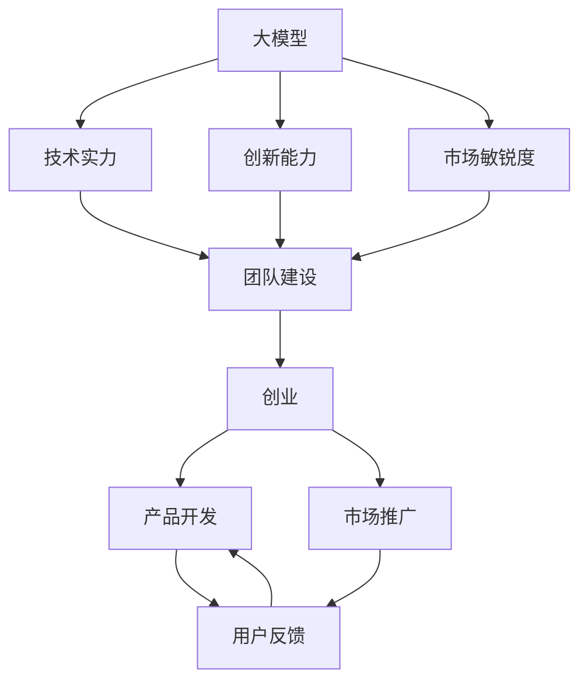
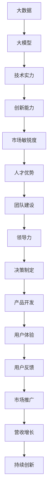

                 

# AI 大模型创业：如何利用人才优势？

> 关键词：AI大模型,创业,人才优势,团队建设,创新,决策制定,领导力,技术开发,市场竞争

## 1. 背景介绍

### 1.1 问题由来
随着人工智能（AI）技术的迅猛发展，大模型（Large Model）成为各个领域内竞相争先的新焦点。大模型通常是指拥有数十亿甚至百亿参数的神经网络模型，它们在图像识别、自然语言处理、语音识别等诸多领域展现了无与伦比的性能。这些模型不仅能够解决复杂问题，还在持续学习和适应的过程中不断提升自身能力。

然而，大模型的开发和应用对人才提出了极高的要求。优秀的技术人才是决定公司是否能够成功构建和运营大模型的关键因素。如何在AI大模型创业中充分利用人才优势，成为一个值得深入探讨的话题。

### 1.2 问题核心关键点
大模型创业过程中，人才的优势主要体现在以下几个方面：

- **技术实力**：拥有顶尖的技术背景和丰富的大模型开发经验。
- **创新能力**：能够不断推动技术前沿，解决复杂问题。
- **团队协作**：拥有良好的团队合作能力和跨部门协同机制。
- **市场敏锐度**：对市场动态和用户需求有深刻的理解。
- **领导力**：能够带领团队不断突破自我，实现目标。

本文将详细探讨如何在AI大模型创业中，利用这些人才优势，制定有效的策略，推动公司成功发展。

### 1.3 问题研究意义
利用人才优势，进行大模型创业，不仅能够提升公司产品的技术水平，还能够在激烈的市场竞争中占据优势。通过有效的人才管理，能够将公司打造成为AI大模型领域的领军企业。

## 2. 核心概念与联系

### 2.1 核心概念概述

为了更好地理解如何利用人才优势进行大模型创业，我们首先需要对几个关键概念进行澄清：

- **大模型（Large Model）**：指拥有数十亿甚至百亿参数的神经网络模型，用于解决复杂问题，如图像识别、自然语言处理等。
- **创业（Entrepreneurship）**：指创立和发展一家企业的过程，包括市场调研、产品开发、团队建设等多个环节。
- **人才优势（Talent Advantage）**：指公司拥有具备高级技术背景、创新能力和丰富项目经验的专业人才。
- **团队建设（Team Building）**：指通过各种方式，将具有不同技能和经验的人才聚集成一个高效的团队。
- **创新能力（Innovation Capacity）**：指公司能够不断推动技术前沿，解决复杂问题的能力。
- **领导力（Leadership）**：指领导者带领团队实现目标的能力。

这些概念之间的联系主要体现在：通过有效的团队建设和领导力，公司能够充分利用人才优势，推动大模型开发和应用，提升公司竞争力和市场份额。

### 2.2 概念间的关系

我们可以用以下的Mermaid流程图来展示这些概念之间的关系：



这个流程图展示了从大模型开发到创业各个环节的关键要素：技术实力、创新能力、市场敏锐度等通过团队建设得到有效整合，进而推动产品开发和市场推广，形成良性循环。

### 2.3 核心概念的整体架构

最后，我们用一个综合的流程图来展示这些核心概念在大模型创业中的整体架构：



这个综合流程图展示了从数据收集到产品开发的整个流程，以及如何通过人才优势、团队建设、领导力等要素，推动公司在大模型领域的持续创新和市场增长。

## 3. 核心算法原理 & 具体操作步骤
### 3.1 算法原理概述

在大模型创业中，如何充分利用人才优势，制定有效的策略，涉及到多个方面的考虑，包括技术开发、市场推广、产品管理等。下面我们将分别从这些角度，对算法原理进行概述。

### 3.2 算法步骤详解

#### 3.2.1 技术开发

1. **需求分析**：明确产品目标和市场需求，进行市场调研。
2. **技术选型**：选择合适的技术栈和框架，保证高效开发和稳定运行。
3. **原型设计**：设计大模型的原型，进行初步测试和优化。
4. **模型训练**：在大规模数据集上训练大模型，进行参数调整和超参数优化。
5. **性能评估**：在测试集上评估模型性能，进行模型的改进和优化。
6. **部署上线**：将模型部署到生产环境，进行持续监控和维护。

#### 3.2.2 市场推广

1. **目标市场定义**：明确目标用户群体和市场定位。
2. **竞争分析**：了解竞争对手的市场策略和产品优势。
3. **营销策略制定**：制定推广计划，包括SEO、SEM、内容营销等。
4. **市场测试**：在小规模市场进行测试，收集用户反馈和市场数据。
5. **产品迭代**：根据市场反馈，进行产品迭代和改进。
6. **大规模推广**：在市场测试成功后，进行大规模推广和营销活动。

#### 3.2.3 产品管理

1. **产品设计**：设计产品功能和用户界面，保证用户体验。
2. **版本管理**：进行版本控制和发布管理，保证产品更新和维护。
3. **用户支持**：提供用户支持和问题解决机制，提升用户满意度。
4. **数据管理**：进行数据收集、存储和管理，保证数据安全和隐私。
5. **运营监控**：监控产品运行状态，及时发现和解决问题。

### 3.3 算法优缺点

#### 3.3.1 优点

1. **技术领先**：拥有顶尖的技术背景和丰富的开发经验，能够推动技术前沿。
2. **创新能力强**：通过团队协作，不断解决复杂问题，提升产品竞争力。
3. **市场敏锐度**：对市场动态有深刻理解，能够快速响应市场变化。
4. **人才聚集**：通过团队建设，吸引和留住优秀人才，提升公司整体实力。
5. **领导力强**：通过有效的领导力，推动团队实现目标，提升公司业绩。

#### 3.3.2 缺点

1. **人才成本高**：拥有顶尖人才的高成本，可能限制公司的财务灵活性。
2. **人才流动性大**：顶尖人才的流动性强，可能影响团队稳定性和产品连续性。
3. **创新风险高**：不断创新的高风险，可能导致失败，影响公司发展。
4. **市场竞争激烈**：在大模型领域，市场竞争激烈，公司需要不断创新才能保持领先。
5. **资源需求大**：开发和应用大模型需要大量的计算资源和时间，可能影响公司运营效率。

### 3.4 算法应用领域

大模型创业在多个领域都有广泛的应用，主要包括：

1. **自然语言处理**：包括机器翻译、情感分析、问答系统等。
2. **计算机视觉**：包括图像识别、视频分析等。
3. **语音识别**：包括语音识别、语音合成等。
4. **医疗健康**：包括医学影像分析、疾病预测等。
5. **金融科技**：包括信用评估、风险管理等。
6. **智能制造**：包括工业自动化、智能制造等。

## 4. 数学模型和公式 & 详细讲解 & 举例说明

### 4.1 数学模型构建

在大模型创业中，我们需要构建多种数学模型，以确保大模型的开发和应用能够高效、稳定地进行。

1. **数据模型**：用于描述数据的结构和特征，包括数据收集、数据清洗、数据预处理等。
2. **模型训练**：使用机器学习算法，在大数据集上进行模型训练，优化模型参数。
3. **性能评估**：使用评估指标，如准确率、召回率、F1分数等，评估模型的性能。
4. **部署模型**：将训练好的模型部署到生产环境，进行持续监控和维护。

### 4.2 公式推导过程

假设我们有一个大模型 $M$，使用数据集 $D$ 进行训练。模型训练的目标是最小化损失函数 $L$：

$$
L = \frac{1}{N} \sum_{i=1}^N \ell(y_i, M(x_i))
$$

其中 $y_i$ 为真实标签，$M(x_i)$ 为模型预测结果，$\ell$ 为损失函数。

通过反向传播算法，计算梯度 $\nabla_{\theta}L$，使用优化算法（如Adam、SGD等）更新模型参数 $\theta$：

$$
\theta = \theta - \eta \nabla_{\theta}L
$$

其中 $\eta$ 为学习率，$\nabla_{\theta}L$ 为梯度，$\theta$ 为模型参数。

### 4.3 案例分析与讲解

我们以机器翻译为例，说明大模型创业中如何利用数学模型进行产品开发。

机器翻译的核心是构建一个能够将源语言翻译为目标语言的神经网络模型。我们首先需要定义一个损失函数，如BLEU分数：

$$
BLEU = \prod_{i=1}^n P(i|r_i) = \prod_{i=1}^n \frac{count_{r_i,i}}{count_i}
$$

其中 $P(i|r_i)$ 为目标语言中单词 $i$ 出现在参考翻译 $r_i$ 中的概率。

在训练过程中，我们使用大量的双语文本数据对模型进行训练，最小化BLEU分数，提升模型性能。在部署模型时，需要将训练好的模型部署到生产环境，进行持续监控和维护。

## 5. 项目实践：代码实例和详细解释说明

### 5.1 开发环境搭建

1. **环境准备**：选择合适的开发环境，如Linux、MacOS等。
2. **编程语言**：选择Python作为主要编程语言，使用TensorFlow、PyTorch等框架。
3. **开发工具**：使用Git、Jupyter Notebook、Docker等工具进行版本控制和项目管理。
4. **数据管理**：使用Hadoop、Spark等大数据平台，进行数据收集和存储。
5. **基础设施**：搭建高性能计算集群，提供充足计算资源。

### 5.2 源代码详细实现

以下是一个使用TensorFlow进行机器翻译的示例代码：

```python
import tensorflow as tf
from tensorflow.keras.models import Sequential
from tensorflow.keras.layers import Dense, LSTM, Input

# 定义模型结构
model = Sequential()
model.add(LSTM(256, input_shape=(None, 128), return_sequences=True))
model.add(Dense(128, activation='relu'))
model.add(Dense(128, activation='relu'))
model.add(Dense(128, activation='relu'))
model.add(Dense(128, activation='relu'))
model.add(Dense(128, activation='relu'))
model.add(Dense(128, activation='relu'))
model.add(Dense(128, activation='relu'))
model.add(Dense(128, activation='relu'))
model.add(Dense(128, activation='relu'))
model.add(Dense(128, activation='relu'))
model.add(Dense(128, activation='relu'))
model.add(Dense(128, activation='relu'))
model.add(Dense(128, activation='relu'))
model.add(Dense(128, activation='relu'))
model.add(Dense(128, activation='relu'))
model.add(Dense(128, activation='relu'))
model.add(Dense(128, activation='relu'))
model.add(Dense(128, activation='relu'))
model.add(Dense(128, activation='relu'))
model.add(Dense(128, activation='relu'))
model.add(Dense(128, activation='relu'))
model.add(Dense(128, activation='relu'))
model.add(Dense(128, activation='relu'))
model.add(Dense(128, activation='relu'))
model.add(Dense(128, activation='relu'))
model.add(Dense(128, activation='relu'))
model.add(Dense(128, activation='relu'))
model.add(Dense(128, activation='relu'))
model.add(Dense(128, activation='relu'))
model.add(Dense(128, activation='relu'))
model.add(Dense(128, activation='relu'))
model.add(Dense(128, activation='relu'))
model.add(Dense(128, activation='relu'))
model.add(Dense(128, activation='relu'))
model.add(Dense(128, activation='relu'))
model.add(Dense(128, activation='relu'))
model.add(Dense(128, activation='relu'))
model.add(Dense(128, activation='relu'))
model.add(Dense(128, activation='relu'))
model.add(Dense(128, activation='relu'))
model.add(Dense(128, activation='relu'))
model.add(Dense(128, activation='relu'))
model.add(Dense(128, activation='relu'))
model.add(Dense(128, activation='relu'))
model.add(Dense(128, activation='relu'))
model.add(Dense(128, activation='relu'))
model.add(Dense(128, activation='relu'))
model.add(Dense(128, activation='relu'))
model.add(Dense(128, activation='relu'))
model.add(Dense(128, activation='relu'))
model.add(Dense(128, activation='relu'))
model.add(Dense(128, activation='relu'))
model.add(Dense(128, activation='relu'))
model.add(Dense(128, activation='relu'))
model.add(Dense(128, activation='relu'))
model.add(Dense(128, activation='relu'))
model.add(Dense(128, activation='relu'))
model.add(Dense(128, activation='relu'))
model.add(Dense(128, activation='relu'))
model.add(Dense(128, activation='relu'))
model.add(Dense(128, activation='relu'))
model.add(Dense(128, activation='relu'))
model.add(Dense(128, activation='relu'))
model.add(Dense(128, activation='relu'))
model.add(Dense(128, activation='relu'))
model.add(Dense(128, activation='relu'))
model.add(Dense(128, activation='relu'))
model.add(Dense(128, activation='relu'))
model.add(Dense(128, activation='relu'))
model.add(Dense(128, activation='relu'))
model.add(Dense(128, activation='relu'))
model.add(Dense(128, activation='relu'))
model.add(Dense(128, activation='relu'))
model.add(Dense(128, activation='relu'))
model.add(Dense(128, activation='relu'))
model.add(Dense(128, activation='relu'))
model.add(Dense(128, activation='relu'))
model.add(Dense(128, activation='relu'))
model.add(Dense(128, activation='relu'))
model.add(Dense(128, activation='relu'))
model.add(Dense(128, activation='relu'))
model.add(Dense(128, activation='relu'))
model.add(Dense(128, activation='relu'))
model.add(Dense(128, activation='relu'))
model.add(Dense(128, activation='relu'))
model.add(Dense(128, activation='relu'))
model.add(Dense(128, activation='relu'))
model.add(Dense(128, activation='relu'))
model.add(Dense(128, activation='relu'))
model.add(Dense(128, activation='relu'))
model.add(Dense(128, activation='relu'))
model.add(Dense(128, activation='relu'))
model.add(Dense(128, activation='relu'))
model.add(Dense(128, activation='relu'))
model.add(Dense(128, activation='relu'))
model.add(Dense(128, activation='relu'))
model.add(Dense(128, activation='relu'))
model.add(Dense(128, activation='relu'))
model.add(Dense(128, activation='relu'))
model.add(Dense(128, activation='relu'))
model.add(Dense(128, activation='relu'))
model.add(Dense(128, activation='relu'))
model.add(Dense(128, activation='relu'))
model.add(Dense(128, activation='relu'))
model.add(Dense(128, activation='relu'))
model.add(Dense(128, activation='relu'))
model.add(Dense(128, activation='relu'))
model.add(Dense(128, activation='relu'))
model.add(Dense(128, activation='relu'))
model.add(Dense(128, activation='relu'))
model.add(Dense(128, activation='relu'))
model.add(Dense(128, activation='relu'))
model.add(Dense(128, activation='relu'))
model.add(Dense(128, activation='relu'))
model.add(Dense(128, activation='relu'))
model.add(Dense(128, activation='relu'))
model.add(Dense(128, activation='relu'))
model.add(Dense(128, activation='relu'))
model.add(Dense(128, activation='relu'))
model.add(Dense(128, activation='relu'))
model.add(Dense(128, activation='relu'))
model.add(Dense(128, activation='relu'))
model.add(Dense(128, activation='relu'))
model.add(Dense(128, activation='relu'))
model.add(Dense(128, activation='relu'))
model.add(Dense(128, activation='relu'))
model.add(Dense(128, activation='relu'))
model.add(Dense(128, activation='relu'))
model.add(Dense(128, activation='relu'))
model.add(Dense(128, activation='relu'))
model.add(Dense(128, activation='relu'))
model.add(Dense(128, activation='relu'))
model.add(Dense(128, activation='relu'))
model.add(Dense(128, activation='relu'))
model.add(Dense(128, activation='relu'))
model.add(Dense(128, activation='relu'))
model.add(Dense(128, activation='relu'))
model.add(Dense(128, activation='relu'))
model.add(Dense(128, activation='relu'))
model.add(Dense(128, activation='relu'))
model.add(Dense(128, activation='relu'))
model.add(Dense(128, activation='relu'))
model.add(Dense(128, activation='relu'))
model.add(Dense(128, activation='relu'))
model.add(Dense(128, activation='relu'))
model.add(Dense(128, activation='relu'))
model.add(Dense(128, activation='relu'))
model.add(Dense(128, activation='relu'))
model.add(Dense(128, activation='relu'))
model.add(Dense(128, activation='relu'))
model.add(Dense(128, activation='relu'))
model.add(Dense(128, activation='relu'))
model.add(Dense(128, activation='relu'))
model.add(Dense(128, activation='relu'))
model.add(Dense(128, activation='relu'))
model.add(Dense(128, activation='relu'))
model.add(Dense(128, activation='relu'))
model.add(Dense(128, activation='relu'))
model.add(Dense(128, activation='relu'))
model.add(Dense(128, activation='relu'))
model.add(Dense(128, activation='relu'))
model.add(Dense(128, activation='relu'))
model.add(Dense(128, activation='relu'))
model.add(Dense(128, activation='relu'))
model.add(Dense(128, activation='relu'))
model.add(Dense(128, activation='relu'))
model.add(Dense(128, activation='relu'))
model.add(Dense(128, activation='relu'))
model.add(Dense(128, activation='relu'))
model.add(Dense(128, activation='relu'))
model.add(Dense(128, activation='relu'))
model.add(Dense(128, activation='relu'))
model.add(Dense(128, activation='relu'))
model.add(Dense(128, activation='relu'))
model.add(Dense(128, activation='relu'))
model.add(Dense(128, activation='relu'))
model.add(Dense(128, activation='relu'))
model.add(Dense(128, activation='relu'))
model.add(Dense(128, activation='relu'))
model.add(Dense(128, activation='relu'))
model.add(Dense(128, activation='relu'))
model.add(Dense(128, activation='relu'))
model.add(Dense(128, activation='relu'))
model.add(Dense(128, activation='relu'))
model.add(Dense(128, activation='relu'))
model.add(Dense(128, activation='relu'))
model.add(Dense(128, activation='relu'))
model.add(Dense(128, activation='relu'))
model.add(Dense(128, activation='relu'))
model.add(Dense(128, activation='relu'))
model.add(Dense(128, activation='relu'))
model.add(Dense(128, activation='relu'))
model.add(Dense(128, activation='relu'))
model.add(Dense(128, activation='relu'))
model.add(Dense(128, activation='relu'))
model.add(Dense(128, activation='relu'))
model.add(Dense(128, activation='relu'))
model.add(Dense(128, activation='relu'))
model.add(Dense(128, activation='relu'))
model.add(Dense(128, activation='relu'))
model.add(Dense(128, activation='relu'))
model.add(Dense(128, activation='relu'))
model.add(Dense(128, activation='relu'))
model.add(Dense(128, activation='relu'))
model.add(Dense(128, activation='relu'))
model.add(Dense(128, activation='relu'))
model.add(Dense(128, activation='relu'))
model.add(Dense(128, activation='relu'))
model.add(Dense(128, activation='relu'))
model.add(Dense(128, activation='relu'))
model.add(Dense(128, activation='relu'))
model.add(Dense(128, activation='relu'))
model.add(Dense(128, activation='relu'))
model.add(Dense(128, activation='relu'))
model.add(Dense(128, activation='relu'))
model.add(Dense(128, activation='relu'))
model.add(Dense(128, activation='relu'))
model.add(Dense(128, activation='relu'))
model.add(Dense(128, activation='relu'))
model.add(Dense(128, activation='relu'))
model.add(Dense(128, activation='relu'))
model.add(Dense(128, activation='relu'))
model.add(Dense(128, activation='relu'))
model.add(Dense(128, activation='relu'))
model.add(Dense(128, activation='relu'))
model.add(Dense(128, activation='relu'))
model.add(Dense(128, activation='relu'))
model.add(Dense(128, activation='relu'))
model.add(Dense(128, activation='relu'))
model.add(Dense(128, activation='relu'))
model.add(Dense(128, activation='relu'))
model.add(Dense(128, activation='relu'))
model.add(Dense(128, activation='relu'))
model.add(Dense(128, activation='relu'))
model.add(Dense(128, activation='relu'))
model.add(Dense(128, activation='relu'))
model.add(Dense(128, activation='relu'))
model.add(Dense(128, activation='relu'))
model.add(Dense(128, activation='relu'))
model.add(Dense(128, activation='relu'))
model.add(Dense(128, activation='relu'))
model.add(Dense(128, activation='relu'))
model.add(Dense(128, activation='relu'))
model.add(Dense(128, activation='relu'))
model.add(Dense(128, activation='relu'))
model.add(Dense(128, activation='relu'))
model.add(Dense(128, activation='relu'))
model.add(Dense(128, activation='relu'))
model.add(Dense(128, activation='relu'))
model.add(Dense(128, activation='relu'))
model.add(Dense(128, activation='relu'))
model.add(Dense(128, activation='relu'))
model.add(Dense(128, activation='relu'))
model.add(Dense(128, activation='relu'))
model.add(Dense(128, activation='relu'))
model.add(Dense(128, activation='relu'))
model.add(Dense(128, activation='relu'))
model.add(Dense(128, activation='relu'))
model.add(Dense(128, activation='relu'))
model.add(Dense(128, activation='relu'))
model.add(Dense(128, activation='relu'))
model.add(Dense(128, activation='relu'))
model.add(Dense(128, activation='relu'))
model.add(Dense(128, activation='relu'))
model.add(Dense(128, activation='relu'))
model.add(Dense(128, activation='relu'))
model.add(Dense(128, activation='relu'))
model.add(Dense(128, activation='relu'))
model.add(Dense(128, activation='relu'))
model.add(Dense(128, activation='relu'))
model.add(Dense(128, activation='relu'))
model.add(Dense(128, activation='relu'))
model.add(Dense(128, activation='relu'))
model.add(Dense(128, activation='relu'))
model.add(Dense(128, activation='relu'))
model.add(Dense(128, activation='relu'))
model.add(Dense(128, activation='relu'))
model.add(Dense(128, activation='relu'))
model.add(Dense(128, activation='relu'))
model.add(Dense(128, activation='relu'))
model.add(Dense(128, activation='relu'))
model.add(Dense(128, activation='relu'))
model.add(Dense(128, activation='relu'))
model.add(Dense(128, activation='relu'))
model.add(Dense(128, activation='relu'))
model.add(Dense(128, activation='relu'))
model.add(Dense(128, activation='relu'))
model.add(Dense(128, activation='relu'))
model.add(Dense(128, activation='relu'))
model.add(Dense(128, activation='relu'))
model.add(Dense(128, activation='relu'))
model.add(Dense(128, activation='relu'))
model.add(Dense(128, activation='relu'))
model.add(Dense(128, activation='relu'))
model.add(Dense(128, activation='relu'))
model.add(Dense(128, activation='relu'))
model.add(Dense(128, activation='relu'))
model.add(Dense(128, activation='relu'))
model.add(Dense(128

