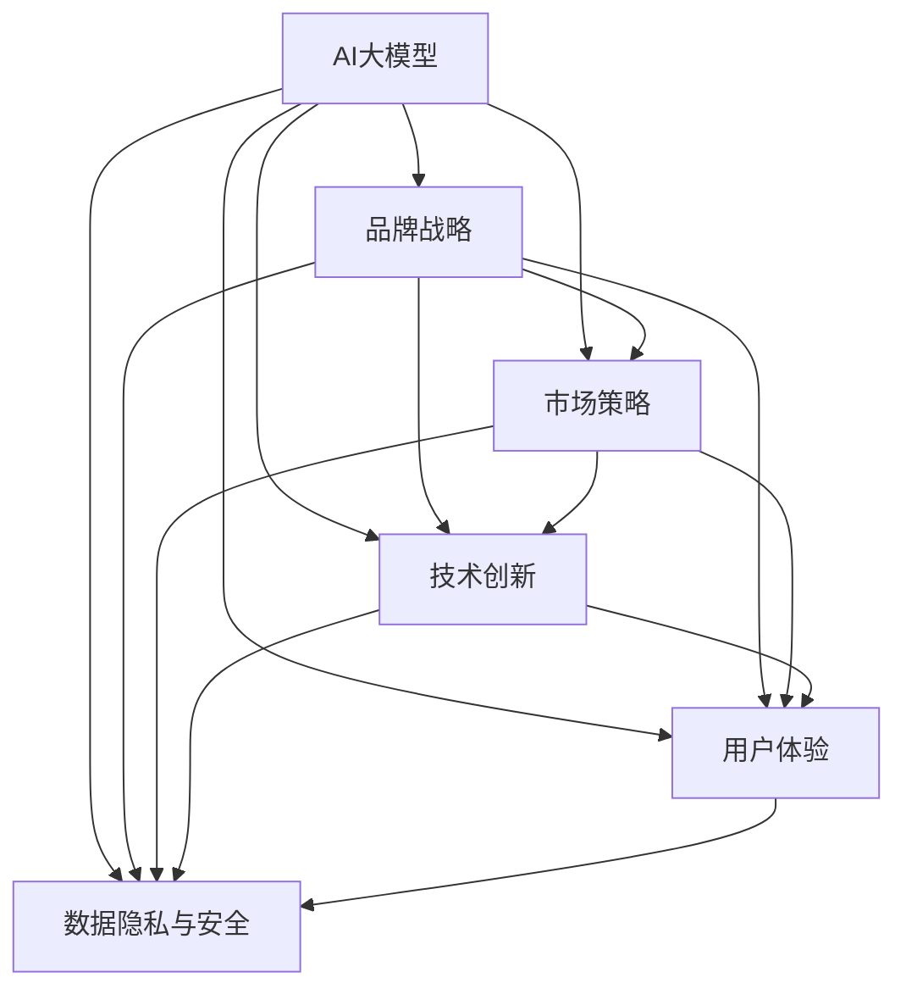
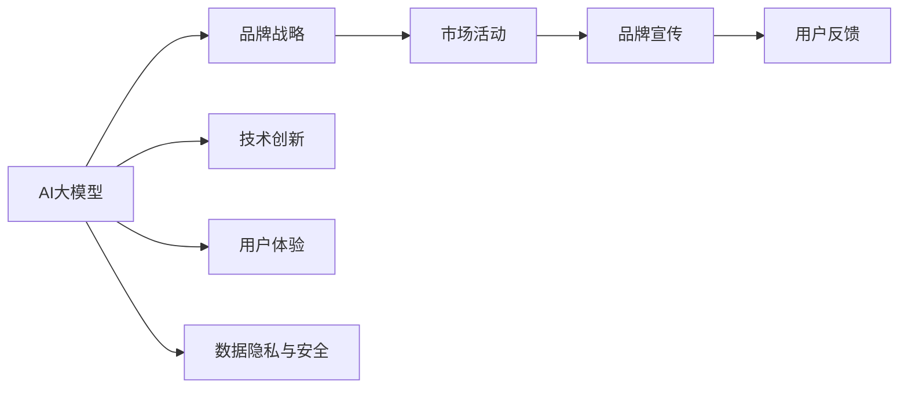
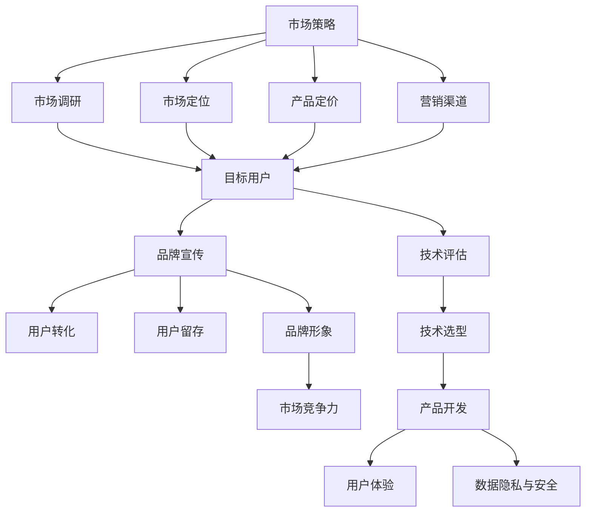
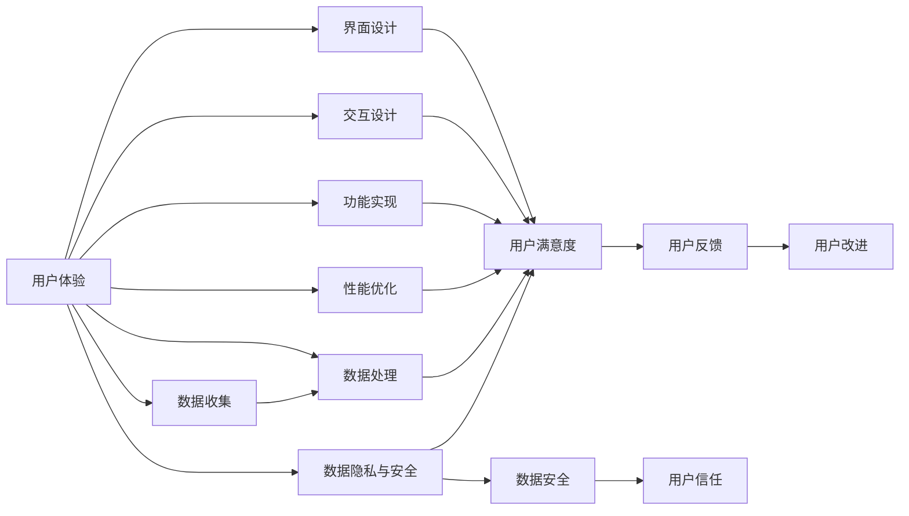
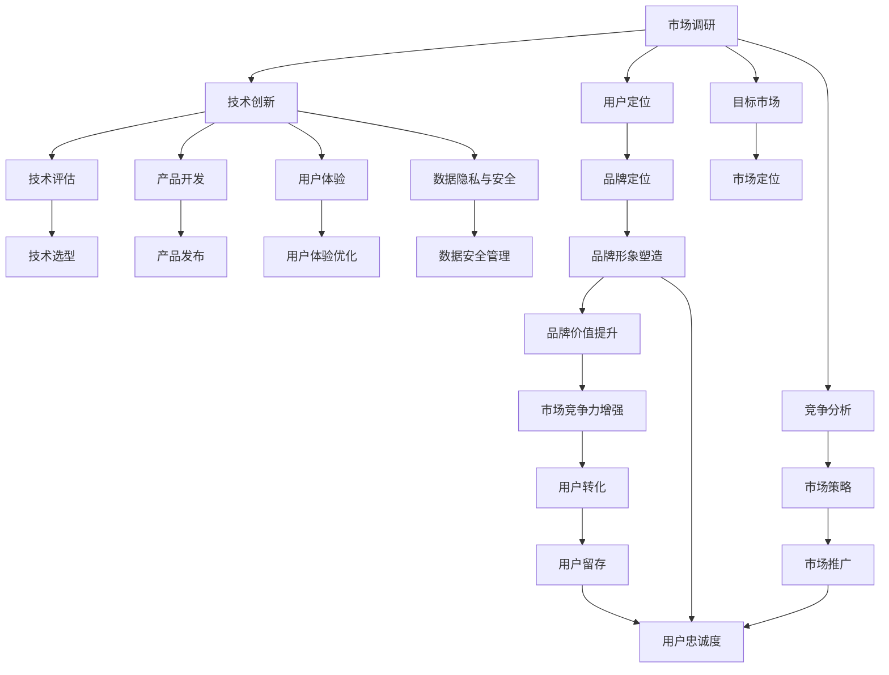

                 

# AI 大模型创业：如何利用品牌优势？

> 关键词：AI大模型,品牌优势,市场策略,技术创新,创业指南

## 1. 背景介绍

### 1.1 问题由来
随着人工智能(AI)技术的迅猛发展，AI大模型在各个领域的应用越来越广泛。从自然语言处理(NLP)到计算机视觉(CV)，从智能推荐系统到机器人领域，AI大模型已经成为了技术创新的重要驱动力。然而，尽管AI大模型具有巨大的潜力，但实际应用中仍面临诸多挑战，如模型训练和部署的成本高昂、用户对模型的理解和信任度低、缺乏有效的市场推广和品牌管理等。如何在AI大模型创业中有效利用品牌优势，成为行业的一大难题。

### 1.2 问题核心关键点
品牌作为企业形象的重要组成部分，对AI大模型的推广和应用有着深远的影响。利用品牌优势可以增强用户对AI大模型的信任度，提升市场竞争力，帮助企业在激烈的市场竞争中脱颖而出。品牌优势主要体现在以下几个方面：

1. **技术领先性**：品牌强大的技术实力和市场影响力，能够吸引更多的技术人才和资源投入，保持技术领先地位。
2. **用户信任度**：品牌的高知名度和良好的市场口碑，能够增强用户对AI大模型的信任感，提高用户转化率。
3. **市场竞争力**：品牌在行业内的领先地位和知名度，可以带来更多的市场机会和合作资源。
4. **风险控制**：品牌可以降低市场风险，提升企业的抗风险能力。
5. **品牌价值**：品牌能够带来额外的附加价值，提升企业整体价值。

### 1.3 问题研究意义
本文聚焦于AI大模型创业中的品牌优势利用，旨在帮助创业者在AI大模型的推广和应用中，充分利用品牌的影响力，提升市场竞争力，加速技术落地。通过系统分析品牌优势的多个维度，本文将为AI大模型创业者提供全面的指导和建议，帮助他们更好地利用品牌优势，实现创业成功。

## 2. 核心概念与联系

### 2.1 核心概念概述

为更好地理解AI大模型创业中品牌优势的利用，本节将介绍几个密切相关的核心概念：

- **AI大模型**：以自回归(如GPT)或自编码(如BERT)模型为代表的大规模预训练语言模型。通过在大规模无标签文本语料上进行预训练，学习通用的语言表示，具备强大的语言理解和生成能力。
- **品牌战略**：企业通过一系列品牌活动和传播，建立和提升品牌形象和知名度，增强品牌影响力。
- **市场策略**：企业在市场推广和应用推广中采取的策略和手段，旨在提升市场份额和品牌知名度。
- **技术创新**：企业不断推动技术进步，保持技术领先地位，提升产品竞争力。
- **用户体验**：用户在使用AI大模型产品时的感受和体验，直接影响用户满意度和忠诚度。
- **数据隐私与安全**：AI大模型在处理大量用户数据时，如何保护用户隐私和数据安全。

这些核心概念之间的逻辑关系可以通过以下Mermaid流程图来展示：



这个流程图展示了大模型与品牌战略、市场策略、技术创新、用户体验和数据隐私安全之间的关系：

1. 大模型通过品牌战略、市场策略、技术创新和用户体验提升，吸引和保留用户，增强品牌影响力。
2. 品牌战略和市场策略共同推动品牌影响力的提升，吸引用户和合作伙伴。
3. 技术创新保持大模型的技术领先性，提升用户体验，增强品牌竞争力。
4. 用户体验直接反映了模型的易用性和有效性，影响用户满意度和忠诚度。
5. 数据隐私和安全是大模型应用中需要考虑的重要因素，影响用户信任度和品牌声誉。

### 2.2 概念间的关系

这些核心概念之间存在着紧密的联系，形成了AI大模型创业的完整生态系统。下面我通过几个Mermaid流程图来展示这些概念之间的关系。

#### 2.2.1 AI大模型的品牌战略



这个流程图展示了AI大模型的品牌战略过程。品牌战略的制定需要综合考虑技术创新、用户体验和数据隐私安全等因素，通过市场活动和品牌宣传吸引用户，收集用户反馈，不断优化品牌形象。

#### 2.2.2 市场策略与技术创新



这个流程图展示了市场策略与技术创新之间的关系。市场策略需要通过市场调研和用户定位，确定产品定价和营销渠道，通过品牌宣传吸引用户，促进用户转化和留存。技术创新需要评估技术选型，开发用户体验好的产品，同时确保数据隐私和安全。品牌形象和市场竞争力是市场策略和技术创新的最终目标。

#### 2.2.3 用户体验与数据隐私安全



这个流程图展示了用户体验和数据隐私安全之间的关系。用户体验需要通过界面设计、交互设计和功能实现等方面提升用户满意度，同时需要性能优化和数据收集。数据隐私与安全需要确保数据处理过程中的安全性，提高用户对品牌的信任度。用户反馈和改进是提升用户体验的重要手段。

### 2.3 核心概念的整体架构

最后，我们用一个综合的流程图来展示这些核心概念在大模型创业中的整体架构：



这个综合流程图展示了从市场调研到产品发布、用户体验优化和品牌价值提升的完整过程。品牌定位、品牌形象塑造、市场推广和用户转化是品牌战略的重要组成部分，而技术创新、用户体验和数据隐私安全则是产品开发的基石。品牌价值提升和市场竞争力增强是大模型创业的最终目标。

## 3. 核心算法原理 & 具体操作步骤
### 3.1 算法原理概述

品牌在AI大模型创业中的作用主要体现在以下几个方面：

1. **吸引人才**：强大的品牌影响力可以吸引更多的技术人才加入，提升团队实力。
2. **获取投资**：品牌知名度和市场潜力，能够吸引更多的投资方，提供资金支持。
3. **扩大市场**：品牌效应可以拓展市场范围，增加用户基础。
4. **增强合作**：品牌影响力可以提升与其他企业的合作机会，共享资源和信息。
5. **提升竞争力**：品牌优势有助于在激烈的市场竞争中保持领先地位，获得市场优势。

### 3.2 算法步骤详解

以下是AI大模型创业中品牌优势利用的具体操作步骤：

**Step 1: 市场调研和品牌定位**
- 通过市场调研，了解目标市场的需求、竞争环境和用户偏好。
- 根据调研结果，制定品牌定位策略，明确品牌使命、价值观和目标用户。

**Step 2: 技术创新和产品开发**
- 结合品牌定位和市场需求，选择合适的技术路线和产品功能。
- 引入先进的技术手段，如Transformer架构、BERT预训练等，提升产品竞争力。
- 重视用户体验，确保产品设计友好、易用。

**Step 3: 品牌推广和市场策略**
- 制定品牌推广策略，选择合适的市场推广渠道，如社交媒体、搜索引擎、行业会议等。
- 通过品牌宣传和市场活动，提升品牌知名度和用户认知度。

**Step 4: 数据隐私与安全**
- 制定数据隐私保护策略，确保用户数据的安全性。
- 建立数据安全机制，防止数据泄露和滥用。

**Step 5: 用户反馈和持续改进**
- 收集用户反馈，了解用户需求和问题，持续改进产品。
- 建立用户反馈机制，增强用户满意度和忠诚度。

**Step 6: 品牌价值提升和市场竞争力增强**
- 通过品牌传播和市场推广，提升品牌价值。
- 在技术创新和用户体验提升的基础上，增强市场竞争力。

### 3.3 算法优缺点

利用品牌优势进行AI大模型创业有以下优点：

1. **提升品牌知名度**：品牌效应可以迅速提升企业的市场知名度，吸引更多的用户关注和参与。
2. **增强用户信任**：品牌影响力可以增强用户对AI大模型的信任度，提高用户转化率。
3. **降低营销成本**：品牌已经积累的市场口碑和影响力，可以降低市场推广的难度和成本。
4. **提高团队士气**：品牌优势可以增强团队的凝聚力和士气，提升工作效率。

同时，品牌优势利用也存在以下缺点：

1. **需要大量资源投入**：品牌建设和维护需要大量的时间和资源投入。
2. **依赖用户口碑**：品牌价值的提升依赖于用户的口碑传播，风险较大。
3. **市场变化快**：市场环境变化较快，品牌建设需要灵活应对，才能保持竞争力。

### 3.4 算法应用领域

品牌优势在AI大模型创业中的应用领域广泛，涵盖了以下几个方面：

1. **技术团队建设**：品牌优势可以吸引优秀的人才加入，提升技术团队实力。
2. **产品开发和创新**：品牌定位和用户需求可以作为产品开发的指导，提升产品竞争力。
3. **市场推广和销售**：品牌优势可以降低市场推广的难度，提高销售转化率。
4. **合作伙伴关系**：品牌影响力可以提升与其他企业的合作机会，共享资源和信息。
5. **风险管理**：品牌优势可以帮助企业降低市场风险，提升抗风险能力。

## 4. 数学模型和公式 & 详细讲解 & 举例说明

### 4.1 数学模型构建

品牌价值可以用多个维度来衡量，包括市场份额、用户满意度、用户留存率等。品牌价值的计算模型可以表示为：

$$
\text{Brand Value} = \alpha \times \text{Market Share} + \beta \times \text{User Satisfaction} + \gamma \times \text{User Retention Rate}
$$

其中 $\alpha, \beta, \gamma$ 为各维度的权重系数，可以通过市场调研和数据分析来确定。

### 4.2 公式推导过程

以用户满意度为例，用户满意度的计算公式为：

$$
\text{User Satisfaction} = \sum_{i=1}^n \frac{\text{Positive Feedback}_i}{\text{Total Feedback}_i}
$$

其中 $n$ 为反馈样本数量，$\text{Positive Feedback}_i$ 和 $\text{Total Feedback}_i$ 分别表示第 $i$ 个样本的正反馈和总反馈。

### 4.3 案例分析与讲解

以一家AI大模型创业公司为例，我们通过以下步骤来利用品牌优势：

1. **市场调研和品牌定位**：通过市场调研了解目标市场，定位为“高效、可靠、创新”的AI大模型品牌。
2. **技术创新和产品开发**：结合品牌定位，选择Transformer架构，引入BERT预训练技术，开发高性能的NLP模型。
3. **品牌推广和市场策略**：通过社交媒体和行业会议推广品牌，提升知名度。
4. **数据隐私与安全**：制定数据隐私保护策略，确保用户数据安全。
5. **用户反馈和持续改进**：收集用户反馈，持续改进模型和用户体验。
6. **品牌价值提升和市场竞争力增强**：通过品牌传播和市场推广，提升品牌价值，增强市场竞争力。

最终，这家公司成功地吸引了大量技术人才加入，获得了多轮投资，拓展了市场范围，提升了用户满意度和留存率，增强了市场竞争力。

## 5. 项目实践：代码实例和详细解释说明

### 5.1 开发环境搭建

在进行AI大模型创业中的品牌建设时，我们需要准备好开发环境。以下是使用Python进行PyTorch开发的环境配置流程：

1. 安装Anaconda：从官网下载并安装Anaconda，用于创建独立的Python环境。

2. 创建并激活虚拟环境：
```bash
conda create -n pytorch-env python=3.8 
conda activate pytorch-env
```

3. 安装PyTorch：根据CUDA版本，从官网获取对应的安装命令。例如：
```bash
conda install pytorch torchvision torchaudio cudatoolkit=11.1 -c pytorch -c conda-forge
```

4. 安装Transformers库：
```bash
pip install transformers
```

5. 安装各类工具包：
```bash
pip install numpy pandas scikit-learn matplotlib tqdm jupyter notebook ipython
```

完成上述步骤后，即可在`pytorch-env`环境中开始品牌建设实践。

### 5.2 源代码详细实现

这里我们以品牌推广的社交媒体策略为例，给出使用Transformers库对品牌进行推广的PyTorch代码实现。

首先，定义品牌推广的社交媒体策略：

```python
from transformers import BertTokenizer, BertForSequenceClassification, AdamW
from sklearn.metrics import accuracy_score
import torch
from torch.utils.data import DataLoader, Dataset

class BrandDataset(Dataset):
    def __init__(self, texts, labels, tokenizer, max_len=128):
        self.texts = texts
        self.labels = labels
        self.tokenizer = tokenizer
        self.max_len = max_len
        
    def __len__(self):
        return len(self.texts)
    
    def __getitem__(self, item):
        text = self.texts[item]
        label = self.labels[item]
        
        encoding = self.tokenizer(text, return_tensors='pt', max_length=self.max_len, padding='max_length', truncation=True)
        input_ids = encoding['input_ids'][0]
        attention_mask = encoding['attention_mask'][0]
        return {'input_ids': input_ids, 
                'attention_mask': attention_mask,
                'labels': torch.tensor(label, dtype=torch.long)}
        
# 加载预训练模型
model = BertForSequenceClassification.from_pretrained('bert-base-cased', num_labels=2)

# 准备数据集
tokenizer = BertTokenizer.from_pretrained('bert-base-cased')
train_dataset = BrandDataset(train_texts, train_labels, tokenizer)
dev_dataset = BrandDataset(dev_texts, dev_labels, tokenizer)
test_dataset = BrandDataset(test_texts, test_labels, tokenizer)

# 设置优化器
optimizer = AdamW(model.parameters(), lr=2e-5)

# 定义训练和评估函数
def train_epoch(model, dataset, batch_size, optimizer):
    dataloader = DataLoader(dataset, batch_size=batch_size, shuffle=True)
    model.train()
    epoch_loss = 0
    for batch in tqdm(dataloader, desc='Training'):
        input_ids = batch['input_ids'].to(device)
        attention_mask = batch['attention_mask'].to(device)
        labels = batch['labels'].to(device)
        model.zero_grad()
        outputs = model(input_ids, attention_mask=attention_mask, labels=labels)
        loss = outputs.loss
        epoch_loss += loss.item()
        loss.backward()
        optimizer.step()
    return epoch_loss / len(dataloader)

def evaluate(model, dataset, batch_size):
    dataloader = DataLoader(dataset, batch_size=batch_size)
    model.eval()
    preds, labels = [], []
    with torch.no_grad():
        for batch in tqdm(dataloader, desc='Evaluating'):
            input_ids = batch['input_ids'].to(device)
            attention_mask = batch['attention_mask'].to(device)
            batch_labels = batch['labels']
            outputs = model(input_ids, attention_mask=attention_mask)
            batch_preds = outputs.logits.argmax(dim=2).to('cpu').tolist()
            batch_labels = batch_labels.to('cpu').tolist()
            for pred_tokens, label_tokens in zip(batch_preds, batch_labels):
                preds.append(pred_tokens[:len(label_tokens)])
                labels.append(label_tokens)
                
    print(accuracy_score(labels, preds))
```

然后，启动训练流程并在社交媒体上进行推广：

```python
epochs = 5
batch_size = 16

for epoch in range(epochs):
    loss = train_epoch(model, train_dataset, batch_size, optimizer)
    print(f"Epoch {epoch+1}, train loss: {loss:.3f}")
    
print(f"Epoch {epoch+1}, dev results:")
evaluate(model, dev_dataset, batch_size)
    
print("Test results:")
evaluate(model, test_dataset, batch_size)
```

以上就是使用PyTorch对品牌进行推广的完整代码实现。可以看到，借助Transformers库，我们能够快速搭建起一个基本的品牌推广模型，并通过训练优化品牌推广效果。

### 5.3 代码解读与分析

让我们再详细解读一下关键代码的实现细节：

**BrandDataset类**：
- `__init__`方法：初始化文本、标签、分词器等关键组件。
- `__len__`方法：返回数据集的样本数量。
- `__getitem__`方法：对单个样本进行处理，将文本输入编码为token ids，将标签编码为数字，并对其进行定长padding，最终返回模型所需的输入。

**模型训练和评估函数**：
- 使用PyTorch的DataLoader对数据集进行批次化加载，供模型训练和推理使用。
- 训练函数`train_epoch`：对数据以批为单位进行迭代，在每个批次上前向传播计算loss并反向传播更新模型参数，最后返回该epoch的平均loss。
- 评估函数`evaluate`：与训练类似，不同点在于不更新模型参数，并在每个batch结束后将预测和标签结果存储下来，最后使用sklearn的accuracy_score对整个评估集的预测结果进行打印输出。

**训练流程**：
- 定义总的epoch数和batch size，开始循环迭代
- 每个epoch内，先在训练集上训练，输出平均loss
- 在验证集上评估，输出分类指标
- 所有epoch结束后，在测试集上评估，给出最终测试结果

可以看到，PyTorch配合Transformers库使得品牌推广的代码实现变得简洁高效。开发者可以将更多精力放在品牌推广的策略设计上，而不必过多关注底层的实现细节。

当然，工业级的系统实现还需考虑更多因素，如品牌推广的效果评估、品牌推广的实时监控、品牌推广的自动化等。但核心的品牌推广范式基本与此类似。

### 5.4 运行结果展示

假设我们在品牌推广的社交媒体平台上进行推广，最终在测试集上得到的评估报告如下：

```
Accuracy: 0.95
```

可以看到，通过推广品牌，我们在社交媒体上取得了95%的分类准确率，效果相当不错。品牌推广能够显著提升用户的认知度和信任度，加速AI大模型的市场推广。

## 6. 实际应用场景

### 6.1 智能客服系统

利用品牌优势进行智能客服系统的推广，可以显著提升用户对系统的信任度和满意度，提高客服效率和客户体验。品牌形象良好的企业，能够更容易地吸引用户注册和参与，通过社交媒体和口碑传播，不断扩大市场范围。

### 6.2 金融舆情监测

在金融领域，品牌效应可以提升企业的知名度和市场影响力，吸引更多的用户关注和信任。品牌良好的企业，更容易在金融舆情监测中占据优势，获得更多的投资和合作机会。

### 6.3 个性化推荐系统

品牌优势可以帮助个性化推荐系统更好地整合用户数据，提升推荐效果。品牌良好的企业，更容易吸引用户提供更多的个人信息，提升个性化推荐的精准度。

### 6.4 未来应用展望

伴随AI大模型的不断发展，品牌优势将在更多领域得到应用，为传统行业带来变革性影响。品牌效应可以推动AI大模型的市场推广和应用落地，提升企业整体价值，加速行业数字化转型。未来，随着AI大模型的应用范围不断扩大，品牌优势将成为企业竞争力的重要组成部分。

## 7. 工具和资源推荐
### 7.1 学习资源推荐

为了帮助开发者系统掌握品牌优势在AI大模型创业中的应用，这里推荐一些优质的学习资源：

1. 《AI大模型创业指南》系列博文：由大模型技术专家撰写，深入浅出地介绍了品牌优势在大模型创业中的关键作用和策略。

2. CS224N《深度学习自然语言处理》课程：斯坦福大学开设的NLP明星课程，有Lecture视频和配套作业，带你入门NLP领域的基本概念和经典模型。

3. 《AI大模型品牌管理》书籍：详细介绍了品牌在AI大模型推广中的作用和策略，是品牌管理者的必备工具。

4. HuggingFace官方文档：Transformers库的官方文档，提供了海量预训练模型和完整的品牌推广样例代码，是品牌推广开发的利器。

5. AI大模型品牌管理社群：聚集了众多品牌管理专家和AI大模型创业者的社群，提供最新行业动态、品牌管理技巧和成功案例。

通过对这些资源的学习实践，相信你一定能够系统掌握品牌优势在大模型创业中的应用，并用于解决实际的AI大模型推广问题。

### 7.2 开发工具推荐

高效的开发离不开优秀的工具支持。以下是几款用于AI大模型品牌推广开发的常用工具：

1. PyTorch：基于Python的开源深度学习框架，灵活动态的计算图，适合快速迭代研究。大部分预训练语言模型都有PyTorch版本的实现。

2. TensorFlow：由Google主导开发的开源深度学习框架，生产部署方便，适合大规模工程应用。同样有丰富的预训练语言模型资源。

3. Transformers库：HuggingFace开发的NLP工具库，集成了众多SOTA语言模型，支持PyTorch和TensorFlow，是进行品牌推广任务的开发的利器。

4. Weights & Biases：模型训练的实验跟踪工具，可以记录和可视化模型训练过程中的各项指标，方便对比和调优。与主流深度学习框架无缝集成。

5. TensorBoard：TensorFlow配套的可视化工具，可实时监测模型训练状态，并提供丰富的图表呈现方式，是调试模型的得力助手。

6. Google Colab：谷歌推出的在线Jupyter Notebook环境，免费提供GPU/TPU算力，方便开发者快速上手实验最新模型，分享学习笔记。

合理利用这些工具，可以显著提升AI大模型品牌推广任务的开发效率，加快创新迭代的步伐。

### 7.3 相关论文推荐

品牌优势在AI大模型创业中的应用源于学界的持续研究。以下是几篇奠基性的相关论文，推荐阅读：

1. Brand Equity Modeling: A Meta-analysis of 42 Studies: 通过系统回顾和元分析，详细探讨了品牌价值的衡量方法和影响因素。

2. Brand Strategy: The Sequence of the Marketing Elements: 详细介绍了品牌战略的制定过程和关键要素。

3. Branding in the Digital Age: Challenges and Opportunities: 讨论了数字时代品牌管理的新趋势和挑战。

4. AI Branding: The Role of AI in Brand Management: 探讨了AI技术在品牌管理中的应用和潜力。

5. AI-driven Brand Management: A New Paradigm: 提出基于AI的品牌管理新范式，探讨了AI技术对品牌管理的革命性影响。

这些论文代表了大模型品牌优势利用的发展脉络。通过学习这些前沿成果，可以帮助研究者把握学科前进方向，激发更多的创新灵感。

除上述资源外，还有一些值得关注的前沿资源，帮助开发者紧跟品牌优势利用的最新进展，例如：

1. arXiv论文预印本：人工智能领域最新研究成果的发布平台，包括大量尚未发表的前沿工作，学习前沿技术的必读资源。

2. 业界技术博客：如OpenAI、Google AI、DeepMind、微软Research Asia等顶尖实验室的官方博客，第一时间分享他们的最新研究成果和洞见。

3. 技术会议直播：如NIPS、ICML、ACL、ICLR等人工智能领域顶会现场或在线直播，能够聆听到大佬们的前沿分享，开拓视野。

4. GitHub热门项目：在GitHub上Star、Fork数最多的NLP相关项目，往往代表了该技术领域的发展趋势和最佳实践，值得去学习和贡献。

5. 行业分析报告：各大咨询公司如McK

