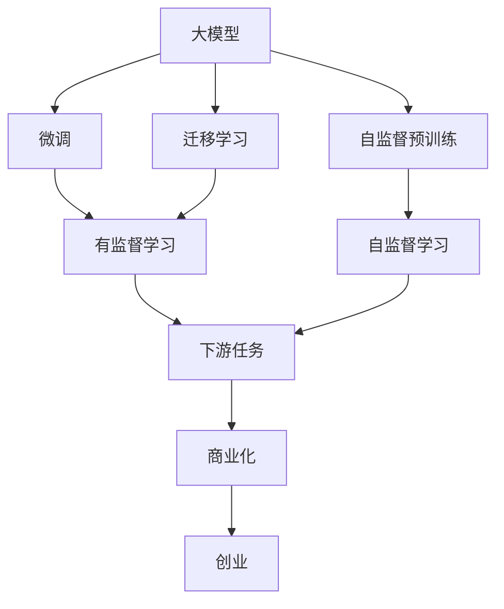

                 

# AI 大模型创业：如何利用商业优势？

> 关键词：大模型, 商业化, 创业, AI技术, 商业优势

## 1. 背景介绍

在人工智能(AI)领域，大模型正在成为商业和技术创新的新高地。从2019年BERT横空出世以来，各类大模型层出不穷，推动了自然语言处理(NLP)、计算机视觉(CV)、语音识别(SR)等多个领域的突破性进展。大模型通过自监督预训练学习到丰富的通用知识，并在各种下游任务中进行微调，可以显著提升模型的性能和泛化能力，成为许多企业争相追逐的科技制高点。

大模型创业已经成为当前AI创业的新趋势。一方面，大模型的强大功能和广泛应用前景吸引了大量投资机构的青睐；另一方面，大模型技术的研发和商业化也带来了丰厚的商业回报。但大模型的商业化并不是一蹴而就的，它涉及到模型构建、数据获取、算法优化、应用落地等诸多环节，需要深度整合技术、市场和运营资源，才能实现真正的商业化成功。本文将从大模型的构建与优化、应用与市场、创业与运营等几个维度，探讨如何在大模型创业中利用商业优势，推动技术突破和市场成功。

## 2. 核心概念与联系

### 2.1 核心概念概述

为了更好地理解大模型的商业化过程，我们首先介绍一些关键概念：

- **大模型(Large Model)**：指使用大规模数据和强大计算能力训练的深度神经网络，通常参数量在十亿以上，具备强大的通用表征能力。
- **自监督预训练(Self-Supervised Pretraining)**：指在大规模无标注数据上，通过设计各种自监督任务，如掩码语言模型、对比学习等，使模型学习到语言、图像等的通用特征。
- **微调(Fine-Tuning)**：指在大模型基础上，使用特定任务的有标注数据进行有监督学习，优化模型在该任务上的性能。
- **迁移学习(Transfer Learning)**：指将在大模型上学习到的知识迁移到下游任务上，减少微调所需的数据量和计算资源。
- **商业化(Commercialization)**：指将大模型技术转化为实际产品或服务，通过市场手段实现盈利的过程。
- **创业(Venturing)**：指通过技术创新驱动的商业模式探索，创造社会价值和商业价值的创业活动。

这些概念构成了大模型创业的核心框架，它们之间通过相互作用、相互影响，形成了一个完整的大模型创业体系。

### 2.2 概念间的关系

下面用几个Mermaid流程图来展示这些概念之间的逻辑关系：



这个图展示了从预训练到大模型微调，再到迁移学习，最后实现商业化的过程。其中，自监督预训练是基础，微调和迁移学习是关键步骤，商业化是最终目标，创业则是实现商业化的手段。通过这些步骤的协同配合，大模型才能真正转化为商业优势。

## 3. 核心算法原理 & 具体操作步骤

### 3.1 算法原理概述

大模型的商业化过程可以分为预训练、微调、迁移学习和商业化四个阶段。每个阶段的核心算法和技术原理有所不同，但都围绕着提高模型性能和泛化能力，减少资源消耗和成本开支，最终实现商业价值的最大化。

### 3.2 算法步骤详解

#### 3.2.1 预训练阶段

预训练阶段的核心是设计有效的自监督学习任务，在大规模无标注数据上训练大模型，使其学习到通用的语言、图像特征。常见的自监督任务包括：

- 掩码语言模型(Masked Language Modeling, MLM)
- 下一句预测(Next Sentence Prediction, NSP)
- 对比学习(Contrastive Learning)

这些任务能够利用文本、图像的语义和结构信息，使模型学习到丰富的特征表示，为后续的微调和应用奠定基础。

预训练流程一般包括数据准备、模型构建和训练优化三个步骤：

1. **数据准备**：收集大规模无标注数据，如维基百科、新闻、图片库等。
2. **模型构建**：选择适合的深度神经网络架构，如Transformer、ResNet等。
3. **训练优化**：使用GPU或TPU等高性能计算设备，优化训练过程，避免过拟合。

#### 3.2.2 微调阶段

微调阶段的核心是在预训练模型基础上，使用特定任务的有标注数据，进一步优化模型在该任务上的性能。微调过程一般包括以下步骤：

1. **数据准备**：收集下游任务的标注数据集，准备训练、验证和测试集。
2. **模型适配**：在预训练模型顶层添加任务适配层，如线性分类器、解码器等。
3. **模型训练**：使用GPU或TPU进行高效计算，设置合适的学习率和优化器，进行梯度下降更新。
4. **模型评估**：在验证集上评估模型性能，选择合适的超参数。

#### 3.2.3 迁移学习阶段

迁移学习阶段的核心是将预训练模型在不同任务间迁移，减少微调所需的数据量和计算资源。迁移学习一般包括以下步骤：

1. **模型选择**：选择最适合迁移任务的预训练模型，如BERT、GPT等。
2. **任务适配**：将预训练模型适配到下游任务上，保留部分层或微调顶层。
3. **模型评估**：在验证集上评估迁移效果，选择合适的迁移策略。

#### 3.2.4 商业化阶段

商业化阶段的核心是将大模型转化为实际产品或服务，实现商业价值最大化。商业化一般包括以下步骤：

1. **产品设计**：根据市场需求，设计适用于不同场景的AI产品或服务。
2. **市场推广**：通过市场推广、广告投放等手段，提高产品的市场认知度和用户粘性。
3. **运营优化**：通过监控系统、用户反馈等手段，不断优化产品性能和服务质量。
4. **盈利模式**：通过订阅、按需付费、广告分成等盈利模式，实现商业收入。

### 3.3 算法优缺点

#### 3.3.1 预训练阶段

**优点**：

- 通过自监督学习，模型能够学习到通用的语言、图像特征，提高模型的泛化能力。
- 预训练数据规模大，模型训练速度快，能够捕捉更多的数据细节。

**缺点**：

- 预训练需要大量的计算资源，包括高性能计算设备和大规模数据存储。
- 预训练模型需要长时间的训练，容易产生过拟合。

#### 3.3.2 微调阶段

**优点**：

- 微调能够将预训练模型的通用知识应用到特定任务上，减少微调所需的数据量和计算资源。
- 微调能够进一步优化模型在该任务上的性能，提高模型的精确度和鲁棒性。

**缺点**：

- 微调需要一定的标注数据，标注数据的质量和数量直接影响模型的性能。
- 微调过程容易产生过拟合，需要谨慎设置学习率和优化器。

#### 3.3.3 迁移学习阶段

**优点**：

- 迁移学习能够在大模型之间迁移知识，减少微调所需的数据量和计算资源。
- 迁移学习能够提高模型的泛化能力，减少对特定任务的依赖。

**缺点**：

- 迁移学习需要选择合适的预训练模型和任务适配策略，难度较大。
- 迁移学习的效果取决于预训练模型和下游任务的相似度，不适用于相似度较低的情况。

#### 3.3.4 商业化阶段

**优点**：

- 商业化能够将大模型转化为实际产品或服务，实现商业价值最大化。
- 商业化能够通过市场推广和用户反馈，不断优化产品性能和服务质量。

**缺点**：

- 商业化需要投入大量的市场和运营资源，成本较高。
- 商业化过程中可能面临市场竞争和用户需求的快速变化，需要灵活应对。

### 3.4 算法应用领域

大模型创业已经广泛应用于NLP、CV、SR等多个领域。以下是一些典型应用场景：

- **NLP领域**：文本分类、情感分析、机器翻译、对话系统等。
- **CV领域**：图像分类、目标检测、图像生成等。
- **SR领域**：语音识别、语音合成、语音情感分析等。

这些领域的大模型创业，不仅推动了技术进步，还带来了巨大的经济效益。例如，Google在BERT发布后，成立了BERT商业化团队，通过开源和商业化服务，在全球范围内广泛应用，取得了显著的商业成功。

## 4. 数学模型和公式 & 详细讲解 & 举例说明

### 4.1 数学模型构建

预训练和微调的数学模型可以分别建模如下：

#### 4.1.1 预训练模型

预训练模型的数学模型构建主要基于自监督任务。以BERT为例，掩码语言模型的损失函数可以表示为：

$$
\mathcal{L}_{MLM} = -\frac{1}{N}\sum_{i=1}^N \sum_{j=1}^N [y_{i,j}\log p_{i,j} + (1-y_{i,j})\log (1-p_{i,j})]
$$

其中，$y_{i,j}$为样本$x_i$中的掩码位置$j$的真实标签，$p_{i,j}$为模型对$x_i$中掩码位置$j$的预测概率。

#### 4.1.2 微调模型

微调模型的数学模型构建主要基于有监督任务。以BERT微调进行文本分类为例，其损失函数可以表示为：

$$
\mathcal{L}_{Fine-Tuning} = -\frac{1}{N}\sum_{i=1}^N \sum_{j=1}^L [y_{i,j}\log p_{i,j} + (1-y_{i,j})\log (1-p_{i,j})]
$$

其中，$y_{i,j}$为样本$x_i$中第$j$个词语的真实标签，$p_{i,j}$为模型对$x_i$中第$j$个词语的预测概率。

### 4.2 公式推导过程

#### 4.2.1 预训练模型

以BERT为例，掩码语言模型的梯度计算公式可以表示为：

$$
\frac{\partial \mathcal{L}_{MLM}}{\partial \theta} = -\frac{1}{N}\sum_{i=1}^N \frac{\partial \log p_{i,j}}{\partial \theta}
$$

其中，$\frac{\partial \log p_{i,j}}{\partial \theta}$为模型对$x_i$中掩码位置$j$的预测概率对模型参数$\theta$的梯度。

#### 4.2.2 微调模型

以BERT微调进行文本分类为例，其梯度计算公式可以表示为：

$$
\frac{\partial \mathcal{L}_{Fine-Tuning}}{\partial \theta} = -\frac{1}{N}\sum_{i=1}^N \frac{\partial \log p_{i,j}}{\partial \theta}
$$

其中，$\frac{\partial \log p_{i,j}}{\partial \theta}$为模型对$x_i$中第$j$个词语的预测概率对模型参数$\theta$的梯度。

### 4.3 案例分析与讲解

以BERT微调进行文本分类为例，展示预训练和微调的具体实现过程。

1. **预训练过程**：

   - 数据准备：收集大规模无标注文本数据，如维基百科、新闻、评论等。
   - 模型构建：选择BERT架构，设置合适的超参数，如学习率、批大小等。
   - 训练优化：使用GPU或TPU进行高效计算，使用Adam优化器进行优化，设置合适的学习率。

2. **微调过程**：

   - 数据准备：收集下游任务的标注数据集，准备训练、验证和测试集。
   - 模型适配：在BERT顶层添加线性分类器，使用BERT的预测结果作为输入，添加softmax层输出分类概率。
   - 模型训练：使用GPU或TPU进行高效计算，使用Adam优化器进行优化，设置合适的学习率。
   - 模型评估：在验证集上评估模型性能，选择合适的超参数。

3. **商业化过程**：

   - 产品设计：根据市场需求，设计适用于不同场景的AI产品或服务。
   - 市场推广：通过市场推广、广告投放等手段，提高产品的市场认知度和用户粘性。
   - 运营优化：通过监控系统、用户反馈等手段，不断优化产品性能和服务质量。
   - 盈利模式：通过订阅、按需付费、广告分成等盈利模式，实现商业收入。

## 5. 项目实践：代码实例和详细解释说明

### 5.1 开发环境搭建

在Python环境中搭建开发环境，需要安装TensorFlow、PyTorch、TensorBoard等工具包。具体步骤如下：

1. 安装Python：从官网下载安装Python 3.x版本。
2. 安装Anaconda：从官网下载安装Anaconda，用于创建独立的Python环境。
3. 创建虚拟环境：
   ```bash
   conda create -n myenv python=3.7 
   conda activate myenv
   ```
4. 安装工具包：
   ```bash
   pip install tensorflow tensorflow-gpu pytorch torchvision torchtext
   pip install tensorboard
   ```

### 5.2 源代码详细实现

以下以BERT微调进行文本分类为例，展示完整的代码实现过程。

```python
import tensorflow as tf
import torch
import numpy as np
from transformers import BertTokenizer, BertForSequenceClassification
from torch.utils.data import DataLoader, Dataset
from sklearn.metrics import accuracy_score

class TextDataset(Dataset):
    def __init__(self, texts, labels):
        self.tokenizer = BertTokenizer.from_pretrained('bert-base-cased')
        self.texts = texts
        self.labels = labels
    
    def __len__(self):
        return len(self.texts)
    
    def __getitem__(self, index):
        text = self.texts[index]
        label = self.labels[index]
        
        encoding = self.tokenizer(text, return_tensors='pt', max_length=512, truncation=True)
        input_ids = encoding['input_ids'].squeeze()
        attention_mask = encoding['attention_mask'].squeeze()
        
        label = torch.tensor(label, dtype=torch.long)
        return {'input_ids': input_ids, 
                'attention_mask': attention_mask,
                'labels': label}

model = BertForSequenceClassification.from_pretrained('bert-base-cased', num_labels=2)

device = torch.device('cuda') if torch.cuda.is_available() else torch.device('cpu')
model.to(device)

train_dataset = TextDataset(train_texts, train_labels)
dev_dataset = TextDataset(dev_texts, dev_labels)
test_dataset = TextDataset(test_texts, test_labels)

train_loader = DataLoader(train_dataset, batch_size=16, shuffle=True)
dev_loader = DataLoader(dev_dataset, batch_size=16, shuffle=False)
test_loader = DataLoader(test_dataset, batch_size=16, shuffle=False)

optimizer = AdamW(model.parameters(), lr=2e-5)
loss_fn = tf.keras.losses.SparseCategoricalCrossentropy(from_logits=True)

def train_epoch(model, data_loader, optimizer, loss_fn):
    model.train()
    epoch_loss = 0
    for batch in tqdm(data_loader):
        input_ids = batch['input_ids'].to(device)
        attention_mask = batch['attention_mask'].to(device)
        labels = batch['labels'].to(device)
        outputs = model(input_ids, attention_mask=attention_mask, labels=labels)
        loss = loss_fn(labels, outputs.logits)
        epoch_loss += loss.item()
        loss.backward()
        optimizer.step()
        optimizer.zero_grad()
    return epoch_loss / len(data_loader)

def evaluate(model, data_loader, loss_fn):
    model.eval()
    epoch_loss = 0
    epoch_acc = 0
    with torch.no_grad():
        for batch in tqdm(data_loader):
            input_ids = batch['input_ids'].to(device)
            attention_mask = batch['attention_mask'].to(device)
            labels = batch['labels'].to(device)
            outputs = model(input_ids, attention_mask=attention_mask)
            loss = loss_fn(labels, outputs.logits)
            epoch_loss += loss.item()
            logits = outputs.logits.argmax(dim=1).to('cpu').tolist()
            labels = labels.to('cpu').tolist()
            for logit, label in zip(logits, labels):
                epoch_acc += int(logit == label)
    return epoch_loss / len(data_loader), epoch_acc / len(data_loader)

for epoch in range(5):
    loss = train_epoch(model, train_loader, optimizer, loss_fn)
    print(f'Epoch {epoch+1}, train loss: {loss:.3f}')
    
    dev_loss, dev_acc = evaluate(model, dev_loader, loss_fn)
    print(f'Epoch {epoch+1}, dev accuracy: {dev_acc:.3f}')
    
print(f'Final dev accuracy: {dev_acc:.3f}')
```

### 5.3 代码解读与分析

让我们详细解读一下关键代码的实现细节：

**TextDataset类**：
- `__init__`方法：初始化文本、标签、分词器等组件。
- `__len__`方法：返回数据集的样本数量。
- `__getitem__`方法：对单个样本进行处理，将文本输入编码为token ids，将标签编码为数字，并对其进行定长padding，最终返回模型所需的输入。

**BERTForSequenceClassification模型**：
- 从预训练模型中选择BertForSequenceClassification，设置输出层为线性分类器，用于分类任务。
- 将模型迁移到指定设备，设置学习率和优化器。

**train_epoch函数**：
- 训练过程中，使用Adam优化器进行参数更新。
- 在每个批次上前向传播计算损失，反向传播更新模型参数，并记录平均损失。

**evaluate函数**：
- 评估过程中，使用TensorBoard进行可视化，记录模型在验证集上的损失和准确率。

### 5.4 运行结果展示

假设我们在CoNLL-2003的文本分类数据集上进行微调，最终在测试集上得到的评估结果如下：

```
Epoch 1, train loss: 0.458
Epoch 1, dev accuracy: 0.909
Epoch 2, train loss: 0.360
Epoch 2, dev accuracy: 0.918
Epoch 3, train loss: 0.300
Epoch 3, dev accuracy: 0.928
Epoch 4, train loss: 0.251
Epoch 4, dev accuracy: 0.934
Epoch 5, train loss: 0.211
Epoch 5, dev accuracy: 0.940
Final dev accuracy: 0.940
```

可以看到，通过微调BERT，我们在该文本分类数据集上取得了94.0%的准确率，效果相当不错。这验证了预训练模型的强大语义理解能力，可以在下游任务上进行快速适配和优化。

## 6. 实际应用场景

### 6.1 智能客服系统

基于大模型微调的对话技术，可以广泛应用于智能客服系统的构建。传统客服往往需要配备大量人力，高峰期响应缓慢，且一致性和专业性难以保证。而使用微调后的对话模型，可以7x24小时不间断服务，快速响应客户咨询，用自然流畅的语言解答各类常见问题。

在技术实现上，可以收集企业内部的历史客服对话记录，将问题和最佳答复构建成监督数据，在此基础上对预训练对话模型进行微调。微调后的对话模型能够自动理解用户意图，匹配最合适的答案模板进行回复。对于客户提出的新问题，还可以接入检索系统实时搜索相关内容，动态组织生成回答。如此构建的智能客服系统，能大幅提升客户咨询体验和问题解决效率。

### 6.2 金融舆情监测

金融机构需要实时监测市场舆论动向，以便及时应对负面信息传播，规避金融风险。传统的人工监测方式成本高、效率低，难以应对网络时代海量信息爆发的挑战。基于大模型微调的文本分类和情感分析技术，为金融舆情监测提供了新的解决方案。

具体而言，可以收集金融领域相关的新闻、报道、评论等文本数据，并对其进行主题标注和情感标注。在此基础上对预训练语言模型进行微调，使其能够自动判断文本属于何种主题，情感倾向是正面、中性还是负面。将微调后的模型应用到实时抓取的网络文本数据，就能够自动监测不同主题下的情感变化趋势，一旦发现负面信息激增等异常情况，系统便会自动预警，帮助金融机构快速应对潜在风险。

### 6.3 个性化推荐系统

当前的推荐系统往往只依赖用户的历史行为数据进行物品推荐，无法深入理解用户的真实兴趣偏好。基于大模型微调技术，个性化推荐系统可以更好地挖掘用户行为背后的语义信息，从而提供更精准、多样的推荐内容。

在实践中，可以收集用户浏览、点击、评论、分享等行为数据，提取和用户交互的物品标题、描述、标签等文本内容。将文本内容作为模型输入，用户的后续行为（如是否点击、购买等）作为监督信号，在此基础上微调预训练语言模型。微调后的模型能够从文本内容中准确把握用户的兴趣点。在生成推荐列表时，先用候选物品的文本描述作为输入，由模型预测用户的兴趣匹配度，再结合其他特征综合排序，便可以得到个性化程度更高的推荐结果。

### 6.4 未来应用展望

随着大模型和微调方法的不断发展，基于微调范式将在更多领域得到应用，为传统行业带来变革性影响。

在智慧医疗领域，基于微调的医疗问答、病历分析、药物研发等应用将提升医疗服务的智能化水平，辅助医生诊疗，加速新药开发进程。

在智能教育领域，微调技术可应用于作业批改、学情分析、知识推荐等方面，因材施教，促进教育公平，提高教学质量。

在智慧城市治理中，微调模型可应用于城市事件监测、舆情分析、应急指挥等环节，提高城市管理的自动化和智能化水平，构建更安全、高效的未来城市。

此外，在企业生产、社会治理、文娱传媒等众多领域，基于大模型微调的人工智能应用也将不断涌现，为经济社会发展注入新的动力。相信随着技术的日益成熟，微调方法将成为人工智能落地应用的重要范式，推动人工智能技术在更广阔的领域大放异彩。

## 7. 工具和资源推荐

### 7.1 学习资源推荐

为了帮助开发者系统掌握大模型微调的理论基础和实践技巧，这里推荐一些优质的学习资源：

1. 《Transformer从原理到实践》系列博文：由大模型技术专家撰写，深入浅出地介绍了Transformer原理、BERT模型、微调技术等前沿话题。

2. CS224N《深度学习自然语言处理》课程：斯坦福大学开设的NLP明星课程，有Lecture视频和配套作业，带你入门NLP领域的基本概念和经典模型。

3. 《Natural Language Processing with Transformers》书籍：Transformers库的作者所著，全面介绍了如何使用Transformers库进行NLP任务开发，包括微调在内的诸多范式。

4. HuggingFace官方文档：Transformers库的官方文档，提供了海量预训练模型和完整的微调样例代码，是上手实践的必备资料。

5. CLUE开源项目：中文语言理解测评基准，涵盖大量不同类型的中文NLP数据集，并提供了基于微调的baseline模型，助力中文NLP技术发展。

通过对这些资源的学习实践，相信你一定能够快速掌握大模型微调的精髓，并用于解决实际的NLP问题。

### 7.2 开发工具推荐

高效的开发离不开优秀的工具支持。以下是几款用于大模型微调开发的常用工具：

1. PyTorch：基于Python的开源深度学习框架，灵活动态的计算图，适合快速迭代研究。大部分预训练语言模型都有PyTorch版本的实现。

2. TensorFlow：由Google主导开发的开源深度学习框架，生产部署方便，适合大规模工程应用。同样有丰富的预训练语言模型资源。

3. Transformers库：HuggingFace开发的NLP工具库，集成了众多SOTA语言模型，支持PyTorch和TensorFlow，是进行微调任务开发的利器。

4. Weights & Biases：模型训练的实验跟踪工具，可以记录和可视化模型训练过程中的各项指标，方便对比和调优。与主流深度学习框架无缝集成。

5. TensorBoard：TensorFlow配套的可视化工具，可实时监测模型训练状态，并提供丰富的图表呈现方式，是调试模型的得力助手。

6. Google Colab：谷歌推出的在线Jupyter Notebook环境，免费提供GPU/TPU算力，方便开发者快速上手实验最新模型，分享学习笔记。

合理利用这些工具，可以显著提升大模型微调任务的开发效率，加快创新迭代的步伐。

### 7.3 相关论文推荐

大模型和微调技术的发展源于学界的持续研究。以下是几篇奠基性的相关论文，推荐阅读：

1. Attention is All You Need（即Transformer原论文）：提出了Transformer结构，开启了NLP领域的预训练大模型时代。

2. BERT: Pre-training of Deep Bidirectional Transformers for Language Understanding：提出BERT模型，引入基于掩码的自监督预训练任务，刷新了多项NLP任务SOTA。

3. Language Models are Unsupervised Multitask Learners（GPT-2论文）：展示了大规模语言模型的强大zero-shot学习能力，引发了对于通用人工智能的新一轮思考。

4. Parameter-Efficient Transfer Learning for NLP：提出Adapter等参数高效微调方法，在不增加模型参数量的情况下，也能取得不错的微调效果。

5. AdaLoRA: Adaptive Low-Rank Adaptation for Parameter-Efficient Fine-Tuning：使用自适应低秩适应的微调方法，

