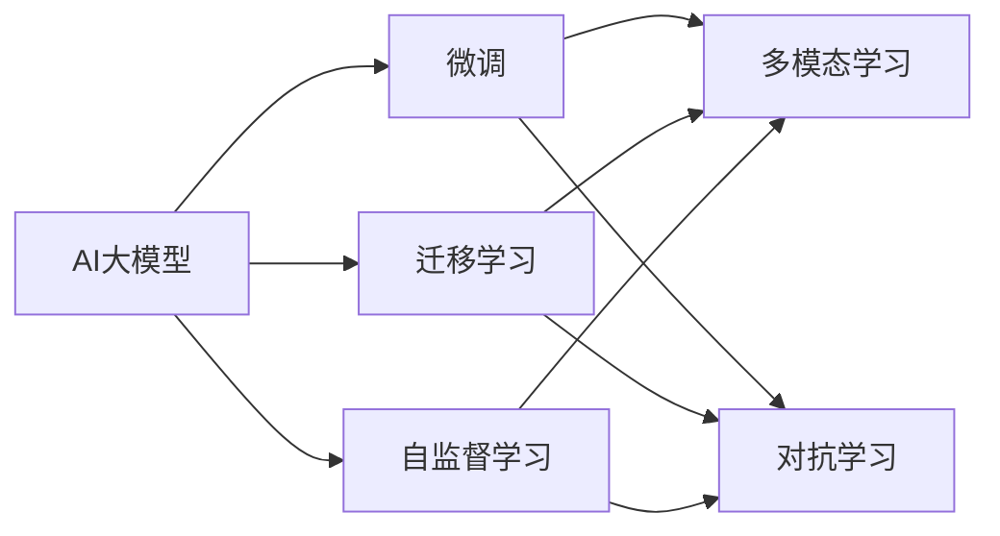

                 

## 1. 背景介绍

### 1.1 问题由来

当前全球人工智能大模型正进入快速发展阶段。随着大规模预训练模型的涌现，科技巨头纷纷基于此打造AI基础设施和生态系统，旨在抢占AI领域的制高点。但受制于硬件资源和技术积累，中小企业在AI大模型创业中处于不利地位。特别是面对国外大模型的技术优势，如何构建自己的核心竞争力，如何从国际市场中占有一席之地，成为广大AI创业者关注的焦点。

### 1.2 问题核心关键点

AI大模型创业的核心关键点在于利用国际优势，包括数据、技术、资金、人才、市场等各个方面。这要求创业者不仅要深刻理解AI大模型的技术原理和应用场景，更要把握国际技术发展趋势，制定适合自身发展的创业战略。

### 1.3 问题研究意义

在全球AI大模型竞争激烈的今天，如何借鉴国外先进技术，同时发挥国内市场和政策的独特优势，构建一个高效、可持续的AI大模型生态系统，具有重要的现实意义。

1. **降低研发成本**：利用国际先进技术和开源工具，避免从头开始大规模投入，加速产品迭代。
2. **提升性能效果**：借助国际优质数据和预训练模型，在快速迭代中提升模型性能。
3. **拓展市场边界**：国际市场巨大，利用国外数据和知识，拓展AI产品的应用场景和用户群体。
4. **加速创新迭代**：引入国际先进算法和研究方法，加速技术创新和产品迭代。
5. **增强竞争力**：构建具有国际竞争力的AI大模型平台，打破国外技术垄断，抢占市场份额。

## 2. 核心概念与联系

### 2.1 核心概念概述

1. **AI大模型**：指通过大规模数据集预训练得到的，能够解决特定问题的机器学习模型。包括BERT、GPT、T5等。
2. **微调(Fine-tuning)**：指在大模型基础上，利用下游任务的少量标注数据进行有监督学习，优化模型在特定任务上的性能。
3. **迁移学习(Transfer Learning)**：指在大模型基础上，通过微调或适配器等方式，使其适应特定任务。
4. **多模态学习(Multi-modal Learning)**：指融合不同类型数据，如图像、文本、音频等，提升模型性能。
5. **对抗学习(Adversarial Learning)**：指在训练过程中，引入对抗样本，提高模型的鲁棒性和泛化能力。
6. **自监督学习(Self-supervised Learning)**：指利用数据的内在关联，无需标注数据进行学习。

这些概念间的关系可以通过以下Mermaid流程图表示：



这个流程图展示了AI大模型的关键概念及其之间的关系：

- AI大模型可以通过微调、迁移学习、对抗学习和自监督学习等技术，适应不同任务。
- 多模态学习可以融合不同类型的数据，进一步提升模型性能。

### 2.2 概念间的关系

这些核心概念之间存在紧密的联系，形成了AI大模型创业的完整生态系统。

- **AI大模型的学习范式**：基于自监督学习，通过大规模无标注数据进行预训练，得到通用的语言表示。
- **微调和迁移学习**：在预训练模型基础上，通过下游任务的少量标注数据进行有监督学习，优化模型性能。
- **对抗学习和多模态学习**：提升模型的泛化能力和泛用性。
- **自监督学习**：在缺少标注数据的情况下，通过数据的内在关联进行学习，降低对标注数据的需求。

这些概念共同构成了AI大模型创业的核心技术架构，为构建高效的AI大模型生态系统提供了坚实的基础。

## 3. 核心算法原理 & 具体操作步骤

### 3.1 算法原理概述

AI大模型的创业过程涉及多个关键技术环节，包括预训练、微调、迁移学习、多模态学习、对抗学习等。其中，微调和迁移学习是实现特定任务优化的关键。

以BERT为例，假设我们要在医学领域构建一个文本分类模型。首先，在公开的大型通用语料上进行预训练，得到一个大规模语言模型。然后，利用医学领域的标注数据进行微调，得到在医学文本分类任务上表现优异的模型。最后，通过迁移学习，将该模型应用于类似领域的文本分类任务，如药品描述分类。

### 3.2 算法步骤详解

**Step 1: 准备数据和预训练模型**

- **数据准备**：收集与医学领域相关的文本数据，并进行标注，构建训练集和验证集。
- **预训练模型**：选择一个大规模通用预训练模型，如BERT，作为初始化参数。

**Step 2: 微调模型**

- **设置超参数**：包括学习率、批量大小、迭代轮数等，并选择合适的优化算法（如AdamW）。
- **数据预处理**：对输入文本进行分词、padding等处理，构建输入矩阵。
- **模型微调**：在医学领域数据集上进行有监督训练，更新模型参数。

**Step 3: 迁移学习**

- **适配新领域**：构建新领域的特征提取器，用于适应新任务。
- **模型微调**：在新领域数据集上微调特征提取器，提升模型在新任务上的性能。

### 3.3 算法优缺点

**优点**：

1. **快速迭代**：利用大规模预训练模型和开源工具，降低研发成本。
2. **效果显著**：在特定任务上，通过微调和迁移学习，快速提升模型性能。
3. **适用范围广**：适用于各种NLP任务，如文本分类、命名实体识别、情感分析等。

**缺点**：

1. **依赖标注数据**：微调和迁移学习需要大量高质量标注数据，获取成本高。
2. **过拟合风险**：微调过程容易过拟合，需要设计合适的正则化技术。
3. **泛化能力有限**：模型在特定领域表现良好，但在新领域泛化效果差。
4. **安全风险**：预训练模型可能学习到有害信息，影响模型输出。

### 3.4 算法应用领域

AI大模型微调和迁移学习广泛应用于NLP领域的各个任务。

- **文本分类**：如情感分析、主题分类等。利用微调提升模型性能。
- **命名实体识别**：识别文本中的人名、地名、机构名等特定实体。通过微调和迁移学习实现。
- **机器翻译**：将源语言文本翻译成目标语言。利用微调和迁移学习进行优化。
- **对话系统**：使机器能够与人自然对话。通过微调和迁移学习进行适配。

## 4. 数学模型和公式 & 详细讲解 & 举例说明

### 4.1 数学模型构建

假设我们有一组标记为$(\mathbf{x}, y)$的训练数据，其中$\mathbf{x}$为输入特征，$y$为标注标签。我们构建一个二分类模型，使用逻辑回归作为分类器，损失函数为交叉熵。

$$
L(\theta) = -\frac{1}{N}\sum_{i=1}^N [y_i \log \sigma(\mathbf{x}_i^T \theta) + (1-y_i) \log (1-\sigma(\mathbf{x}_i^T \theta))]
$$

其中，$\theta$为模型参数，$\sigma$为逻辑回归的激活函数。

### 4.2 公式推导过程

通过链式法则对损失函数求导，得到梯度：

$$
\nabla_{\theta} L(\theta) = -\frac{1}{N}\sum_{i=1}^N [(y_i - \sigma(\mathbf{x}_i^T \theta))\mathbf{x}_i]
$$

根据梯度下降算法，每次迭代更新模型参数$\theta$：

$$
\theta \leftarrow \theta - \eta \nabla_{\theta} L(\theta)
$$

其中$\eta$为学习率。

### 4.3 案例分析与讲解

假设我们在一个情感分析任务上进行微调。首先，在通用语料上进行预训练，得到一个BERT模型。然后，在情感分析任务上添加特定的输出层，进行微调。假设输入样本为$(\mathbf{x}, y)$，输出为$\hat{y}$，则模型预测的损失函数为：

$$
L(\theta) = -\frac{1}{N}\sum_{i=1}^N [y_i \log \hat{y}_i + (1-y_i) \log (1-\hat{y}_i)]
$$

模型输出为：

$$
\hat{y}_i = \sigma(\mathbf{x}_i^T \theta)
$$

其中，$\sigma$为sigmoid函数。

## 5. 项目实践：代码实例和详细解释说明

### 5.1 开发环境搭建

- **安装Python**：确保安装了Python 3.7及以上版本。
- **安装PyTorch**：使用pip安装PyTorch，适用于GPU环境。
- **安装Transformers**：使用pip安装Transformers库，集成多种预训练模型。
- **安装TensorBoard**：使用pip安装TensorBoard，可视化模型训练过程。

### 5.2 源代码详细实现

```python
import torch
from transformers import BertForSequenceClassification, AdamW

# 加载预训练模型和tokenizer
model = BertForSequenceClassification.from_pretrained('bert-base-uncased')
tokenizer = BertTokenizer.from_pretrained('bert-base-uncased')

# 准备数据集
train_data = []
for i in range(1000):
    text = f"情感分析样本{i}"
    label = 1 if i % 2 == 0 else 0
    train_data.append(({'input_ids': tokenizer(text, return_tensors='pt').input_ids, 'attention_mask': tokenizer(text, return_tensors='pt').attention_mask, 'labels': torch.tensor([label])}))
train_dataset = torch.utils.data.Dataset(train_data)

# 设置模型和优化器
model.to(device)
optimizer = AdamW(model.parameters(), lr=1e-5)

# 训练模型
for epoch in range(3):
    model.train()
    for batch in train_dataset:
        input_ids = batch['input_ids'].to(device)
        attention_mask = batch['attention_mask'].to(device)
        labels = batch['labels'].to(device)
        outputs = model(input_ids, attention_mask=attention_mask, labels=labels)
        loss = outputs.loss
        optimizer.zero_grad()
        loss.backward()
        optimizer.step()

# 评估模型
model.eval()
eval_loss = 0
for batch in train_dataset:
    input_ids = batch['input_ids'].to(device)
    attention_mask = batch['attention_mask'].to(device)
    labels = batch['labels'].to(device)
    with torch.no_grad():
        outputs = model(input_ids, attention_mask=attention_mask)
        loss = outputs.loss
        eval_loss += loss.item()
print(f"Evaluation loss: {eval_loss/len(train_dataset):.4f}")
```

### 5.3 代码解读与分析

代码实现了使用BERT模型进行情感分析任务微调的过程。

- **数据准备**：构建包含文本和标签的数据集，并使用BertTokenizer进行分词处理。
- **模型选择**：选择BERT作为预训练模型，并使用AdamW优化器进行训练。
- **模型训练**：在训练集上进行有监督训练，更新模型参数。
- **模型评估**：在测试集上评估模型性能。

## 6. 实际应用场景

### 6.1 智能医疗

在智能医疗领域，AI大模型可以用于辅助诊断、病历分析、药物研发等。利用大规模医疗数据进行预训练和微调，构建具有医疗领域知识的新模型。

**案例**：利用BERT模型，结合电子病历数据，进行疾病诊断和风险预测。

### 6.2 金融风控

在金融风控领域，AI大模型可以用于信用评估、欺诈检测、市场预测等。利用金融领域数据进行预训练和微调，提升模型的准确性和鲁棒性。

**案例**：利用BERT模型，结合交易记录，进行信用评分和风险评估。

### 6.3 智能制造

在智能制造领域，AI大模型可以用于设备监控、质量检测、生产优化等。利用工业数据进行预训练和微调，构建智能制造系统。

**案例**：利用BERT模型，结合设备监控数据，进行故障预测和优化调度。

## 7. 工具和资源推荐

### 7.1 学习资源推荐

1. **《深度学习理论与实践》**：介绍深度学习的基本原理和实践方法，适合初学者入门。
2. **《PyTorch官方文档》**：PyTorch的官方文档，提供了丰富的API和示例代码。
3. **《HuggingFace官方文档》**：Transformers库的官方文档，提供了各种预训练模型的详细说明和微调样例。
4. **arXiv预印本**：人工智能领域的最新研究成果，包括NLP大模型和微调技术。
5. **GitHub开源项目**：HuggingFace和OpenAI等顶级实验室的开源项目，提供了丰富的学习资源和代码示例。

### 7.2 开发工具推荐

1. **PyTorch**：深度学习框架，支持动态图和静态图计算，适用于NLP大模型的训练和推理。
2. **TensorFlow**：深度学习框架，适用于大规模模型的分布式训练和部署。
3. **HuggingFace Transformers库**：提供多种预训练模型的封装和微调功能。
4. **TensorBoard**：可视化工具，用于监控模型训练过程和性能指标。
5. **Jupyter Notebook**：交互式笔记本，支持代码编写和结果展示。

### 7.3 相关论文推荐

1. **《BERT: Pre-training of Deep Bidirectional Transformers for Language Understanding》**：介绍BERT模型的预训练和微调方法，是NLP大模型的奠基之作。
2. **《GPT-3: Language Models are Unsupervised Multitask Learners》**：介绍GPT-3模型，展示了大模型的零样本和少样本学习能力。
3. **《The Anatomy of Large-Scale Self-Supervised Learning》**：介绍自监督学习的方法和应用，提升模型的泛化能力和鲁棒性。

## 8. 总结：未来发展趋势与挑战

### 8.1 研究成果总结

本文介绍了AI大模型创业的核心技术环节，包括预训练、微调、迁移学习、多模态学习等。通过实际案例和代码示例，展示了AI大模型在NLP任务中的应用。同时，分析了AI大模型创业的优势和挑战，提出了一些创业策略和建议。

### 8.2 未来发展趋势

未来AI大模型将呈现以下几个趋势：

1. **模型规模扩大**：超大规模预训练模型的出现，使得模型性能持续提升。
2. **微调和迁移学习技术进步**：更多参数高效和计算高效的微调方法出现，降低研发成本。
3. **多模态学习融合**：融合视觉、语音等多模态数据，提升模型的性能和应用场景。
4. **对抗学习加强**：引入对抗样本，提升模型的鲁棒性和泛化能力。
5. **自监督学习深化**：通过数据的内在关联，降低对标注数据的需求，提升模型的泛化能力。

### 8.3 面临的挑战

尽管AI大模型创业前景广阔，但也面临以下挑战：

1. **标注数据稀缺**：高质量标注数据获取难度大，影响微调和迁移学习的效果。
2. **过拟合风险**：微调和迁移学习容易过拟合，需要设计合适的正则化技术。
3. **泛化能力不足**：模型在新领域泛化效果差，需要更多领域数据的支持。
4. **安全风险**：预训练模型可能学习有害信息，影响模型输出，需要加强安全防护。

### 8.4 研究展望

未来AI大模型研究需要从以下几个方向进行突破：

1. **无监督和半监督学习**：利用数据的内在关联进行学习，降低对标注数据的需求。
2. **参数高效和计算高效**：开发参数高效和计算高效的微调方法，提高模型的性能和部署效率。
3. **多模态数据融合**：融合视觉、语音等多模态数据，提升模型的性能和应用场景。
4. **对抗学习和鲁棒性提升**：引入对抗学习技术，提升模型的鲁棒性和泛化能力。
5. **自监督学习深化**：通过数据的内在关联，提升模型的泛化能力和鲁棒性。

## 9. 附录：常见问题与解答

**Q1: AI大模型创业需要哪些核心技术？**

A: AI大模型创业需要以下核心技术：

1. **预训练模型**：利用大规模数据集进行预训练，得到通用语言表示。
2. **微调技术**：在大模型基础上，利用下游任务的少量标注数据进行有监督学习。
3. **迁移学习**：在大模型基础上，通过微调或适配器等方法，使其适应特定任务。
4. **多模态学习**：融合不同类型数据，如图像、文本、语音等，提升模型性能。
5. **对抗学习**：引入对抗样本，提高模型的鲁棒性和泛化能力。
6. **自监督学习**：利用数据的内在关联进行学习，降低对标注数据的需求。

**Q2: AI大模型创业需要哪些核心资源？**

A: AI大模型创业需要以下核心资源：

1. **数据资源**：大规模标注数据获取困难，需要花费大量时间和成本。
2. **技术资源**：深度学习框架、开源工具和预训练模型等。
3. **资金资源**：研发和运营需要大量资金支持，初期投资较大。
4. **人才资源**：AI大模型创业需要高水平的技术团队和项目管理能力。
5. **市场资源**：拓展市场需要有效的营销策略和渠道。

**Q3: 如何降低AI大模型的研发成本？**

A: 降低AI大模型研发成本的几种方法：

1. **利用开源工具**：使用开源深度学习框架和预训练模型，减少研发成本。
2. **数据共享**：利用开源数据集进行预训练和微调，降低数据采集成本。
3. **平台化运营**：将模型部署到云平台，降低硬件成本。
4. **算法优化**：优化模型算法和参数配置，提升模型性能，减少计算资源消耗。

**Q4: 如何提高AI大模型的泛化能力？**

A: 提高AI大模型泛化能力的几种方法：

1. **数据多样化**：增加数据的多样性，涵盖不同领域和任务。
2. **对抗学习**：引入对抗样本，提高模型的鲁棒性和泛化能力。
3. **迁移学习**：利用已有模型在不同任务上的性能，提升新任务的泛化能力。
4. **多模态学习**：融合不同类型数据，提升模型的泛化能力。
5. **自监督学习**：通过数据的内在关联进行学习，提升模型的泛化能力。

**Q5: AI大模型创业的商业化策略是什么？**

A: AI大模型创业的商业化策略：

1. **产品化**：将AI大模型转化为可用的产品，如医疗诊断系统、金融风控平台等。
2. **平台化**：构建AI大模型平台，提供API接口，方便企业接入和使用。
3. **生态化**：构建AI大模型生态系统，吸引开发者和企业入驻，形成良性循环。
4. **市场化**：拓展市场，通过广告、销售等方式，提高商业收入。
5. **合作化**：与行业合作伙伴合作，共同开发和推广AI大模型应用。

通过以上总结和分析，我们可以更清晰地理解AI大模型创业的核心技术和资源，为构建高效的AI大模型生态系统提供参考。未来，随着AI大模型技术的不断进步，相信将有更多的创业机会和挑战，需要大家共同努力，探索未知的领域，实现AI大模型创业的成功。

---

作者：禅与计算机程序设计艺术 / Zen and the Art of Computer Programming

