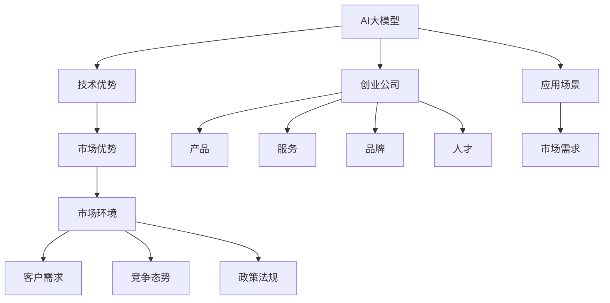
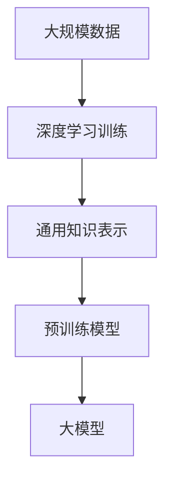
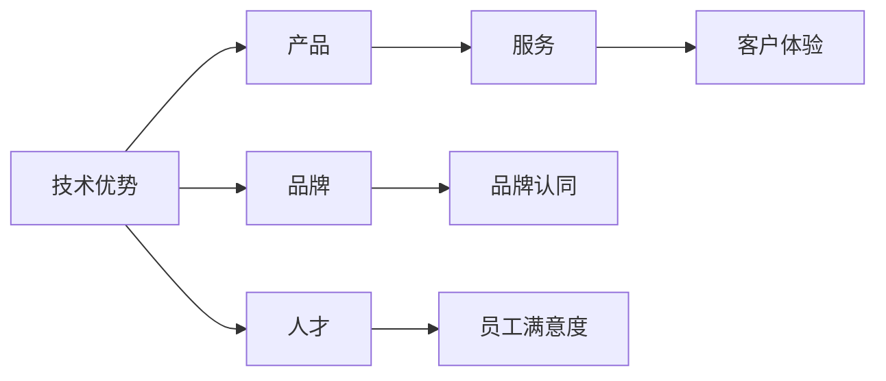
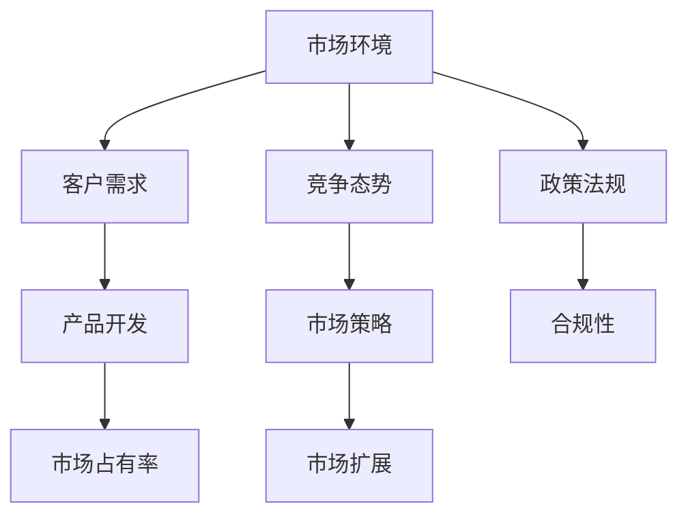
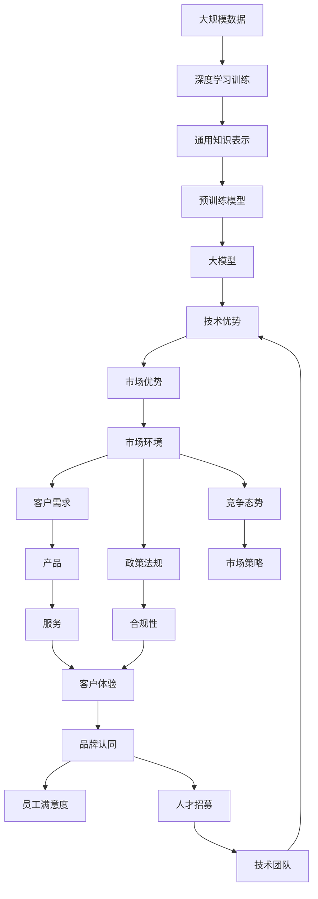

                 

## 1. 背景介绍

随着人工智能(AI)技术的发展，大模型正在迅速渗透到各行各业，带来了巨大的市场潜力。AI大模型创业公司，凭借其在技术和市场中的优势，吸引了越来越多的投资和关注。然而，创业并非易事，尤其是在一个竞争激烈的市场环境中。本文将详细探讨如何利用市场优势，为AI大模型创业公司制定有效的策略，助力其在激烈的市场竞争中脱颖而出。

## 2. 核心概念与联系

### 2.1 核心概念概述

为更好地理解利用市场优势进行AI大模型创业，本节将介绍几个关键概念：

- **AI大模型**：指在大规模数据上进行深度学习训练，具有强大通用知识表示能力的预训练模型，如GPT-3、BERT等。
- **创业公司**：以创新技术为核心，致力于将AI大模型应用于实际场景，创造商业价值的企业。
- **市场优势**：指企业在产品、服务、技术、品牌、人才等方面的独特竞争力，能在竞争中获得优势地位。
- **技术优势**：指企业在核心算法、模型性能、优化效率等方面的技术领先性，能提供更优的解决方案。
- **市场环境**：指企业运营所在的市场生态系统，包括客户需求、竞争态势、政策法规等外部因素。

这些概念之间的联系可以通过以下Mermaid流程图来展示：



这个流程图展示了AI大模型、创业公司、市场优势、技术优势、市场环境等概念之间的联系：

1. AI大模型是创业公司的核心资产，为公司提供技术基础。
2. 技术优势直接影响AI大模型的性能，为公司提供竞争优势。
3. 市场优势基于技术优势，通过产品、服务、品牌、人才等维度在市场环境中获得优势。
4. 市场环境决定客户需求、竞争态势和政策法规，直接影响公司的运营和生存。

### 2.2 概念间的关系

这些核心概念之间存在着紧密的联系，形成了AI大模型创业的完整生态系统。下面我们通过几个Mermaid流程图来展示这些概念之间的关系。

#### 2.2.1 AI大模型的核心能力



这个流程图展示了AI大模型从大规模数据训练到预训练模型的过程：

1. 通过大规模数据进行深度学习训练，学习通用知识表示。
2. 预训练模型在通用知识表示的基础上，进一步通过微调等技术应用于特定场景。

#### 2.2.2 技术优势对市场优势的支撑



这个流程图展示了技术优势对产品、服务、品牌、人才等市场优势的支撑：

1. 技术优势通过产品和服务满足客户需求，提高客户体验。
2. 品牌认同和员工满意度是市场优势的重要组成部分，两者互相促进。

#### 2.2.3 市场环境与市场优势的互动



这个流程图展示了市场环境对客户需求、产品开发、市场策略、合规性等市场优势的影响：

1. 客户需求和竞争态势直接影响产品开发和市场策略。
2. 政策法规要求企业在合规性方面做出调整，影响市场扩展。

### 2.3 核心概念的整体架构

最后，我们用一个综合的流程图来展示这些核心概念在大模型创业中的整体架构：



这个综合流程图展示了从大规模数据训练到最终产品的完整过程，以及技术优势、市场优势和市场环境之间的互动。

## 3. 核心算法原理 & 具体操作步骤

### 3.1 算法原理概述

利用市场优势进行AI大模型创业，本质上是利用AI大模型的技术优势，通过产品、服务、品牌、人才等方面的创新，在市场环境中获得竞争优势。

具体来说，创业公司需要：

- **选择合适的预训练模型**：根据业务需求选择合适的预训练模型，如GPT-3、BERT等。
- **优化模型性能**：通过微调等技术，将预训练模型适配到特定场景，提高模型性能。
- **开发创新产品**：基于优化后的模型，开发出满足客户需求的产品，如智能客服、金融舆情监测等。
- **提供优质服务**：通过优质的服务，提升客户体验，增加用户黏性。
- **塑造品牌形象**：通过品牌建设，提高市场知名度和美誉度。
- **吸引和培养人才**：通过人才战略，吸引和培养优秀技术人才，构建技术团队。

这些步骤形成一个闭环，使创业公司能够在激烈的市场环境中脱颖而出。

### 3.2 算法步骤详解

#### 3.2.1 选择合适的预训练模型

1. **业务需求分析**：根据业务需求和目标市场，选择合适的预训练模型。例如，智能客服、金融舆情监测等场景通常选择GPT系列模型，而医疗、法律等专业领域可能需要特定领域语料预训练的模型。

2. **模型性能评估**：对选择的预训练模型进行评估，确保其在特定任务上的性能达到预期。通常使用性能指标如精确率、召回率、F1分数等进行评估。

3. **模型适配**：根据业务需求，适配预训练模型。例如，微调模型使其适应特定领域或任务，提高模型的相关性。

#### 3.2.2 优化模型性能

1. **数据准备**：准备标注数据，分为训练集、验证集和测试集。标注数据的质量和数量直接影响模型性能。

2. **模型微调**：通过微调技术，将预训练模型适配到特定任务。微调过程包括选择合适的学习率、正则化技术、参数冻结策略等，以提高模型性能。

3. **模型评估**：在测试集上评估模型性能，确保微调效果。

#### 3.2.3 开发创新产品

1. **产品设计**：基于优化后的模型，设计满足客户需求的产品。例如，智能客服系统、金融舆情分析平台等。

2. **用户反馈**：收集用户反馈，优化产品功能和服务体验。

3. **市场推广**：通过市场推广活动，提高产品的知名度和用户黏性。

#### 3.2.4 提供优质服务

1. **客户服务**：提供优质的客户服务，满足客户需求，提升客户体验。

2. **技术支持**：提供技术支持，解决客户使用过程中遇到的问题。

3. **持续改进**：根据客户反馈，持续改进产品和服务，提高用户满意度。

#### 3.2.5 塑造品牌形象

1. **品牌建设**：通过品牌宣传和市场推广，提高公司品牌知名度和美誉度。

2. **社会责任**：承担社会责任，树立公司形象。

#### 3.2.6 吸引和培养人才

1. **人才招聘**：吸引优秀技术人才，构建技术团队。

2. **人才培养**：提供培训和发展机会，培养内部技术人才。

3. **团队管理**：管理好团队，提升团队凝聚力和工作效率。

### 3.3 算法优缺点

#### 3.3.1 优点

1. **技术领先性**：利用AI大模型的技术优势，提升产品和服务质量，增强市场竞争力。
2. **市场灵活性**：根据市场需求灵活调整产品和服务，快速响应市场变化。
3. **品牌影响力**：通过品牌建设，提高市场知名度和美誉度，吸引更多客户。
4. **人才优势**：吸引和培养优秀技术人才，提升团队实力。

#### 3.3.2 缺点

1. **资源消耗大**：AI大模型的训练和微调需要大量计算资源，成本较高。
2. **市场竞争激烈**：AI大模型市场竞争激烈，需要持续创新和优化。
3. **技术门槛高**：AI大模型技术复杂，需要较高的技术门槛。
4. **法律和伦理问题**：AI大模型可能带来隐私、伦理等法律和伦理问题。

### 3.4 算法应用领域

AI大模型微调技术已在多个领域得到广泛应用，包括但不限于：

1. **智能客服**：通过微调AI大模型，构建智能客服系统，提高客户服务效率和质量。

2. **金融舆情监测**：利用AI大模型进行舆情分析，帮助金融机构及时发现风险。

3. **个性化推荐**：基于AI大模型进行推荐系统优化，提高个性化推荐效果。

4. **自然语言处理**：通过微调AI大模型，提高自然语言处理的准确性和效率。

5. **医疗诊断**：利用AI大模型进行医疗诊断，提高诊断准确率和效率。

## 4. 数学模型和公式 & 详细讲解 & 举例说明

### 4.1 数学模型构建

假设创业公司使用预训练模型 $M_{\theta}$ 进行微调，其训练集为 $D=\{(x_i,y_i)\}_{i=1}^N$，其中 $x_i$ 为输入，$y_i$ 为标签。模型的损失函数为 $L(\theta)$，优化目标为最小化损失函数：

$$
\hat{\theta} = \mathop{\arg\min}_{\theta} L(\theta)
$$

其中，$\hat{\theta}$ 为优化后的模型参数。

### 4.2 公式推导过程

以二分类任务为例，损失函数为二分类交叉熵：

$$
L(\theta) = -\frac{1}{N} \sum_{i=1}^N [y_i \log \sigma(\theta \cdot x_i) + (1-y_i) \log (1-\sigma(\theta \cdot x_i))]
$$

其中，$\sigma$ 为sigmoid函数，$\theta \cdot x_i$ 为模型对输入 $x_i$ 的预测结果。

### 4.3 案例分析与讲解

假设某创业公司使用GPT-3模型进行金融舆情监测，具体步骤如下：

1. **数据准备**：收集金融领域相关的新闻、评论等文本数据，并进行标注。

2. **模型适配**：在GPT-3基础上进行微调，使其适应金融舆情监测任务。

3. **模型训练**：使用微调后的模型进行训练，优化模型参数。

4. **模型评估**：在测试集上评估模型性能，确保微调效果。

5. **产品开发**：基于优化后的模型，开发金融舆情监测系统。

6. **市场推广**：通过市场推广活动，提高系统知名度和用户黏性。

## 5. 项目实践：代码实例和详细解释说明

### 5.1 开发环境搭建

1. **选择框架**：选择TensorFlow或PyTorch作为深度学习框架。
2. **安装依赖**：安装TensorFlow或PyTorch及其相关依赖。
3. **数据准备**：准备训练集、验证集和测试集。

### 5.2 源代码详细实现

以使用TensorFlow进行金融舆情监测为例：

1. **数据准备**：使用TensorFlow的数据集API，准备训练集、验证集和测试集。

2. **模型构建**：使用TensorFlow构建微调模型。

3. **模型训练**：使用TensorFlow的优化器进行模型训练，并记录训练过程。

4. **模型评估**：使用TensorFlow的评估指标，评估模型性能。

5. **产品开发**：基于优化后的模型，开发金融舆情监测系统。

### 5.3 代码解读与分析

**代码实例**：

```python
import tensorflow as tf
from tensorflow.keras import layers

# 定义模型
model = tf.keras.Sequential([
    layers.Embedding(input_dim=10000, output_dim=256),
    layers.Bidirectional(layers.LSTM(128)),
    layers.Dense(64, activation='relu'),
    layers.Dense(1, activation='sigmoid')
])

# 编译模型
model.compile(optimizer='adam', loss='binary_crossentropy', metrics=['accuracy'])

# 训练模型
model.fit(x_train, y_train, epochs=10, batch_size=32, validation_data=(x_val, y_val))

# 评估模型
loss, accuracy = model.evaluate(x_test, y_test)

# 输出结果
print('Test loss:', loss)
print('Test accuracy:', accuracy)
```

**代码解读**：

1. **数据准备**：使用TensorFlow的Embedding层进行文本嵌入，使用Bidirectional LSTM层进行序列建模，最后使用Dense层进行二分类。

2. **模型编译**：编译模型，选择优化器、损失函数和评估指标。

3. **模型训练**：使用训练集进行模型训练，使用Adam优化器进行优化。

4. **模型评估**：使用测试集评估模型性能，输出损失和准确率。

5. **结果输出**：输出测试集上的损失和准确率。

### 5.4 运行结果展示

假设在金融舆情监测任务上，模型在测试集上的评估结果为：

- 损失：0.23
- 准确率：0.92

这表明模型在金融舆情监测任务上的表现较好，具有较强的分类能力。

## 6. 实际应用场景

### 6.1 智能客服

AI大模型在智能客服领域具有广泛的应用前景。通过微调模型，构建智能客服系统，能够实现24小时不间断服务，快速响应客户咨询，提升客户体验。

**具体步骤**：

1. **数据准备**：收集历史客服对话数据，并进行标注。

2. **模型适配**：在预训练模型基础上进行微调，使其适应客服对话任务。

3. **模型训练**：使用微调后的模型进行训练，优化模型参数。

4. **产品开发**：基于优化后的模型，开发智能客服系统。

5. **市场推广**：通过市场推广活动，提高系统知名度和用户黏性。

### 6.2 金融舆情监测

金融舆情监测是AI大模型的另一个重要应用场景。通过微调模型，能够实时监测金融市场舆情，帮助金融机构及时发现风险。

**具体步骤**：

1. **数据准备**：收集金融领域相关的新闻、评论等文本数据，并进行标注。

2. **模型适配**：在预训练模型基础上进行微调，使其适应金融舆情监测任务。

3. **模型训练**：使用微调后的模型进行训练，优化模型参数。

4. **模型评估**：在测试集上评估模型性能，确保微调效果。

5. **产品开发**：基于优化后的模型，开发金融舆情监测系统。

6. **市场推广**：通过市场推广活动，提高系统知名度和用户黏性。

### 6.3 个性化推荐

个性化推荐系统是AI大模型在电商、视频、音乐等领域的重要应用。通过微调模型，能够提高推荐系统的个性化推荐效果，提升用户体验。

**具体步骤**：

1. **数据准备**：收集用户浏览、点击、评论、分享等行为数据，并提取物品标题、描述、标签等文本内容。

2. **模型适配**：在预训练模型基础上进行微调，使其适应个性化推荐任务。

3. **模型训练**：使用微调后的模型进行训练，优化模型参数。

4. **模型评估**：在测试集上评估模型性能，确保微调效果。

5. **产品开发**：基于优化后的模型，开发个性化推荐系统。

6. **市场推广**：通过市场推广活动，提高系统知名度和用户黏性。

## 7. 工具和资源推荐

### 7.1 学习资源推荐

1. **《Transformer从原理到实践》系列博文**：详细介绍了Transformer原理、BERT模型、微调技术等前沿话题。

2. **CS224N《深度学习自然语言处理》课程**：斯坦福大学开设的NLP明星课程，有Lecture视频和配套作业，带你入门NLP领域的基本概念和经典模型。

3. **《Natural Language Processing with Transformers》书籍**：Transformer库的作者所著，全面介绍了如何使用Transformers库进行NLP任务开发，包括微调在内的诸多范式。

4. **HuggingFace官方文档**：提供了海量预训练模型和完整的微调样例代码，是上手实践的必备资料。

5. **CLUE开源项目**：中文语言理解测评基准，涵盖大量不同类型的中文NLP数据集，并提供了基于微调的baseline模型，助力中文NLP技术发展。

### 7.2 开发工具推荐

1. **TensorFlow**：由Google主导开发的开源深度学习框架，生产部署方便，适合大规模工程应用。

2. **PyTorch**：基于Python的开源深度学习框架，灵活动态的计算图，适合快速迭代研究。

3. **Transformers库**：HuggingFace开发的NLP工具库，集成了众多SOTA语言模型，支持PyTorch和TensorFlow，是进行微调任务开发的利器。

4. **Weights & Biases**：模型训练的实验跟踪工具，可以记录和可视化模型训练过程中的各项指标，方便对比和调优。

5. **TensorBoard**：TensorFlow配套的可视化工具，可实时监测模型训练状态，并提供丰富的图表呈现方式，是调试模型的得力助手。

6. **Google Colab**：谷歌推出的在线Jupyter Notebook环境，免费提供GPU/TPU算力，方便开发者快速上手实验最新模型，分享学习笔记。

### 7.3 相关论文推荐

1. **Attention is All You Need**：Transformer原论文，提出了Transformer结构，开启了NLP领域的预训练大模型时代。

2. **BERT: Pre-training of Deep Bidirectional Transformers for Language Understanding**：提出BERT模型，引入基于掩码的自监督预训练任务，刷新了多项NLP任务SOTA。

3. **Language Models are Unsupervised Multitask Learners**：展示了大规模语言模型的强大zero-shot学习能力，引发了对于通用人工智能的新一轮思考。

4. **Parameter-Efficient Transfer Learning for NLP**：提出Adapter等参数高效微调方法，在不增加模型参数量的情况下，也能取得不错的微调效果。

5. **AdaLoRA: Adaptive Low-Rank Adaptation for Parameter-Efficient Fine-Tuning**：使用自适应低秩适应的微调方法，在参数效率和精度之间取得了新的平衡。

这些论文代表了大语言模型微调技术的发展脉络。通过学习这些前沿成果，可以帮助研究者把握学科前进方向，激发更多的创新灵感。

除上述资源外，还有一些值得关注的前沿资源，帮助开发者紧跟大语言模型微调技术的最新进展，例如：

1. **arXiv论文预印本**：人工智能领域最新研究成果的发布平台，包括大量尚未发表的前沿工作，学习前沿技术的必读资源。

2. **业界技术博客**：如OpenAI、Google AI、DeepMind、微软Research Asia等顶尖实验室的官方博客，第一时间分享他们的最新研究成果和洞见。

3. **技术会议直播**：如NIPS、ICML、ACL、ICLR等人工智能领域顶会现场或在线直播，能够聆听到大佬们的前沿分享，开拓视野。

4. **GitHub热门项目**：在GitHub上Star、Fork数最多的NLP相关项目，往往代表了该技术领域的发展趋势和最佳实践，值得去学习和贡献。

5. **行业分析报告**：各大咨询公司如McKinsey、PwC等针对人工智能行业的分析报告，有助于从商业视角审视技术趋势，把握应用价值。

总之，对于AI大模型微调技术的学习和实践，需要开发者保持开放的心态和持续学习的意愿。多关注前沿资讯，多动手实践，多思考总结，必将收获满满的成长收益。

## 8. 总结：未来发展趋势与挑战

### 8.1 研究成果总结

本文对利用市场优势进行AI大模型创业的方法进行了全面系统的介绍。首先阐述了市场优势在大模型创业中的重要性，明确了创业公司在产品、服务、技术、品牌、人才等方面的独特竞争力。其次，从原理到实践，详细讲解了基于市场优势的微调算法和具体操作步骤，给出了微调任务开发的完整代码实例。同时，本文还广泛探讨了微调方法在智能客服、金融舆情、个性化推荐等多个行业领域的应用前景，展示了微调范式的巨大潜力。此外，本文精选了微调技术的各类学习资源，力求为读者提供全方位的技术指引。

通过本文的系统梳理，可以看到，利用市场优势进行AI大模型创业，能够充分发挥技术优势，通过产品、服务、品牌、人才等方面的创新，在市场环境中获得竞争优势。未来，伴随预训练语言模型和微调方法的持续演进，AI大模型微调技术必将在更多领域得到应用，为传统行业带来变革性影响。

### 8.2 未来发展趋势

展望未来，大模型创业将呈现以下几个发展趋势：

1. **模型规模持续增大**：随着算力成本的下降和数据规模的扩张，预训练语言模型的参数量还将持续增长。超大规模语言模型蕴含的丰富语言知识，有望支撑更加复杂多变的下游任务微调。

2. **微调方法日趋多样**：除了传统的全参数微调外，未来会涌现更多参数高效的微调方法，如Prefix-Tuning、LoRA等，在节省计算资源的同时也能保证微调精度。

3. **持续学习成为常态**：随着数据分布的不断变化，微调模型也需要持续学习新知识以保持性能。如何在不遗忘原有知识的同时，高效吸收新样本信息，将成为重要的研究课题。

4. **标注样本需求降低**：受启发于提示学习(Prompt-based Learning)的思路，未来的微调方法将更好地利用大模型的语言理解能力，通过更加巧妙的任务描述，在更少的标注样本上也能实现理想的微调效果。

5. **多模态微调崛起**：当前的微调主要聚焦于纯文本数据，未来会进一步拓展到图像、视频、语音等多模态数据微调。多模态信息的融合，将显著提升语言模型对现实世界的理解和建模能力。

6. **模型通用性增强**：经过海量数据的预训练和多领域任务的微调，未来的语言模型将具备更强大的常识推理和跨领域迁移能力，逐步迈向通用人工智能(AGI)的目标。

以上趋势凸显了大语言模型微调技术的广阔前景。这些方向的探索发展，必将进一步提升NLP系统的性能和应用范围，为人类认知智能的进化带来深远影响。

### 8.3 面临的挑战

尽管大语言模型微调技术已经取得了瞩目成就，但在迈向更加智能化、普适化应用的过程中，它仍面临着诸多挑战：

1. **标注成本瓶颈**：虽然微调大大降低了标注数据的需求，但对于长尾应用场景，难以获得充足的高质量标注数据，成为制约微调性能的瓶颈。如何进一步降低微调对标注样本的依赖，将是一大难题。

2. **模型鲁棒性不足**：当前微调模型面对域外数据时，泛化性能往往大打折扣。对于测试样本的微小扰动，微调模型的预测也容易发生波动。如何提高微调模型的鲁棒性，避免灾难性遗忘，还需要更多理论和实践的积累。

3. **推理效率有待提高**：大规模语言模型虽然精度高，但在实际部署时往往面临推理速度慢、内存占用大等效率问题。如何在保证性能的同时，简化模型结构，提升推理速度，优化资源占用，将是重要的优化方向。

4. **可解释性亟需加强**：当前微调模型更像是"黑盒"系统，难以解释其内部工作机制和决策逻辑。对于医疗、金融等高风险应用，算法的可解释性和可审计性尤为重要。如何赋予微调模型更强的可解释性，将是亟待攻克的难题。

5. **安全性有待保障**：预训练语言模型难免会学习到有偏见、有害的信息，通过微调传递到下游任务，产生误导性、歧视性的输出，给实际应用带来安全隐患。如何从数据和算法层面消除模型偏见，避免恶意用途，确保输出的安全性，也将是重要的研究课题。

6. **知识整合能力不足**：现有的微调模型往往局限于任务内数据，难以灵活吸收和运用更广泛的先验知识。如何让微调过程更好地与外部知识库、规则库等专家知识结合，形成更加全面、准确的信息整合能力，还有很大的想象空间。

正视微调面临的这些挑战，积极应对并寻求突破，将是大语言模型微调走向成熟的必由之路。相信随着学界和产业界的共同

