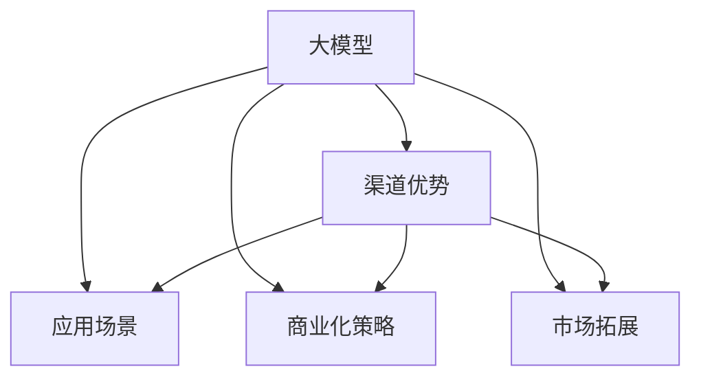
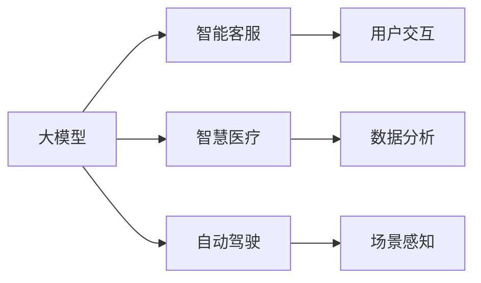
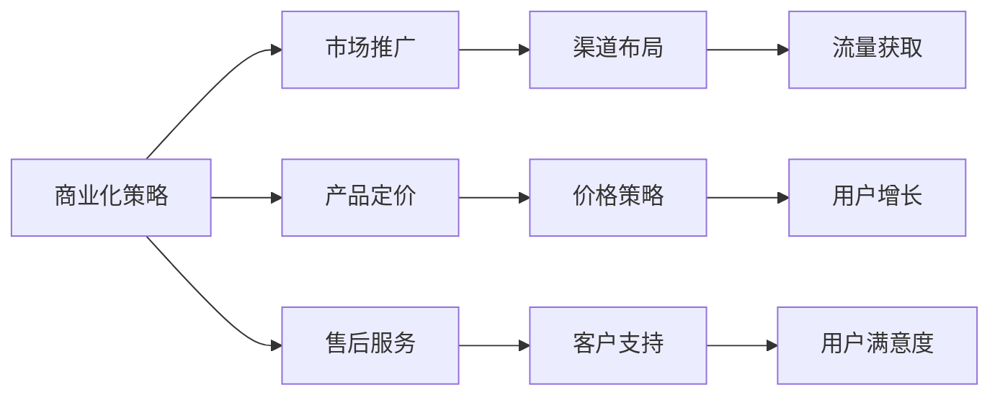
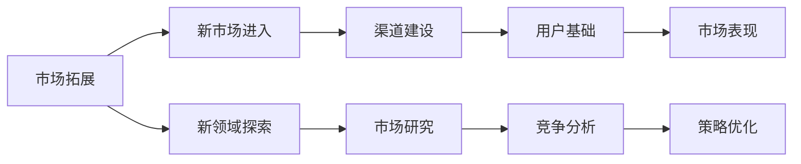
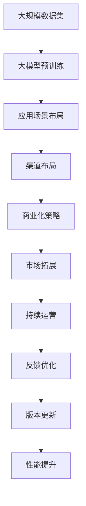

                 

# AI 大模型创业：如何利用渠道优势？

> 关键词：大模型,创业,渠道优势,应用场景,商业化策略

## 1. 背景介绍

### 1.1 问题由来

在当今快速发展的科技浪潮中，人工智能（AI）大模型正成为推动各行各业转型升级的关键力量。无论是智能客服、智慧医疗、自动驾驶，还是金融风控、教育培训，大模型的应用几乎无所不包。然而，尽管大模型具有强大的技术潜力，但其从研发到落地的过程中仍面临着诸多挑战，尤其是商业化和渠道拓展方面。

### 1.2 问题核心关键点

大模型创业的核心挑战之一是如何利用渠道优势。渠道不仅能带来丰厚的流量和用户基础，还能增强品牌影响力和市场竞争力。本文将系统介绍大模型创业中的渠道策略，探讨如何通过合理的渠道布局和运营手段，最大化大模型的商业价值。

### 1.3 问题研究意义

研究大模型创业中的渠道优势，对于拓展大模型的应用场景，加速商业化进程，具有重要意义：

1. **降低应用开发成本**：通过构建强大的渠道网络，大模型能够快速覆盖各类场景，减少从头开发所需的时间和人力成本。
2. **提升模型效果**：渠道的多样性和广泛性有助于大模型获取更多样化的数据，提升其在不同领域的应用效果。
3. **加速开发进度**：高效的渠道布局能够缩短市场推广和用户反馈的循环周期，加速产品迭代和市场适应。
4. **带来技术创新**：丰富的渠道数据能够为模型训练提供更多样化的训练样本，促进模型的进一步优化和创新。
5. **赋能产业升级**：高质量的渠道布局能够提升大模型的可靠性和安全性，为传统行业数字化转型提供新的技术路径。

## 2. 核心概念与联系

### 2.1 核心概念概述

为更好地理解大模型创业中的渠道策略，本节将介绍几个密切相关的核心概念：

- **大模型**：以深度学习技术为基础，通过大规模数据训练得到的高性能模型。如GPT、BERT、XLNet等。
- **渠道优势**：指大模型通过特定渠道布局和运营手段，获得较高的用户覆盖、流量和品牌影响力，从而提升其商业价值的优势。
- **应用场景**：指大模型在特定行业或场景中的应用实例，如智能客服、智慧医疗、自动驾驶等。
- **商业化策略**：指大模型从研发到市场推广、应用部署等全流程的商业运营策略。
- **市场拓展**：指大模型通过渠道布局和运营手段，进入新市场、新领域的过程。

这些核心概念之间的逻辑关系可以通过以下Mermaid流程图来展示：



这个流程图展示了大模型创业中的关键概念及其之间的关系：

1. 大模型通过构建应用场景，提升其应用价值。
2. 渠道优势为大模型进入新市场和新领域提供了助力。
3. 商业化策略决定了大模型如何从研发到市场推广的全流程运营。
4. 市场拓展使大模型能够在更广泛的市场中落地和应用。

这些概念共同构成了大模型创业的完整生态系统，使其能够在各类场景中充分发挥作用。通过理解这些核心概念，我们可以更好地把握大模型创业的精髓。

### 2.2 概念间的关系

这些核心概念之间存在着紧密的联系，形成了大模型创业的完整生态系统。下面我通过几个Mermaid流程图来展示这些概念之间的关系。

#### 2.2.1 大模型的应用场景



这个流程图展示了大模型在不同应用场景中的具体应用，每个应用场景通过不同的用户交互和数据分析手段，实现其核心功能。

#### 2.2.2 商业化策略与渠道优势



这个流程图展示了商业化策略中各环节与渠道优势的联系。市场推广、产品定价、售后服务等环节，通过合理的渠道布局和运营手段，能够提高用户覆盖和品牌影响力，实现更好的市场表现。

#### 2.2.3 市场拓展与渠道优势



这个流程图展示了市场拓展中，渠道建设对新市场进入和新领域探索的重要性。渠道建设能够快速积累用户基础，提高市场表现，从而促进大模型的快速落地和应用。

### 2.3 核心概念的整体架构

最后，我们用一个综合的流程图来展示这些核心概念在大模型创业过程中的整体架构：



这个综合流程图展示了从数据预训练到大模型应用的完整过程。大模型首先在大规模数据集上进行预训练，然后通过应用场景布局和渠道布局，进入不同市场和领域。接着，通过商业化策略和市场拓展，实现产品推广和用户积累。最后，通过持续运营和反馈优化，不断提升模型性能和用户体验。 通过这些流程图，我们可以更清晰地理解大模型创业过程中各个环节的关联和作用，为后续深入讨论具体的渠道策略和运营手段奠定基础。

## 3. 核心算法原理 & 具体操作步骤
### 3.1 算法原理概述

大模型创业中的渠道优势主要体现在数据获取、用户覆盖和品牌影响力三个方面。通过合理的渠道布局和运营手段，能够高效地获取高质量数据，覆盖广泛用户群体，并增强品牌影响力，从而提升大模型的商业价值。

### 3.2 算法步骤详解

基于渠道优势的大模型创业主要包括以下几个关键步骤：

**Step 1: 构建应用场景**

- 选择合适的应用场景，评估市场潜力。
- 确定目标用户群体，了解其需求和行为。
- 设计任务适配层，适配特定应用场景。

**Step 2: 选择和优化渠道**

- 确定渠道类型，如官网、APP、第三方平台等。
- 选择渠道合作伙伴，优化渠道布局。
- 设计渠道运营策略，如内容营销、用户激励等。

**Step 3: 市场推广与用户获取**

- 制定市场推广策略，覆盖目标用户群体。
- 设计用户获取流程，提高转化率。
- 进行A/B测试，优化推广效果。

**Step 4: 用户反馈与模型优化**

- 收集用户反馈，了解用户需求和痛点。
- 根据反馈数据，优化模型参数和任务适配层。
- 定期更新模型版本，提升模型性能。

### 3.3 算法优缺点

基于渠道优势的大模型创业方法具有以下优点：

1. **数据获取高效**：通过渠道获取的数据能够覆盖更广泛的用户群体，提升模型训练的样本多样性。
2. **用户覆盖广泛**：渠道布局能够快速进入新市场，覆盖更多用户群体，提升品牌影响力。
3. **品牌增强**：通过多渠道运营，提升品牌曝光和用户认知，增强用户粘性。

同时，该方法也存在一定的局限性：

1. **渠道成本高**：建立和维护渠道需要投入大量资金和人力资源。
2. **用户数据隐私问题**：渠道运营中可能涉及大量用户数据，需要严格遵守数据隐私法律法规。
3. **模型鲁棒性不足**：渠道数据的多样性可能导致模型在新数据上的泛化性能不足。
4. **品牌风险**：渠道运营中可能存在品牌风险，如渠道合作伙伴的信誉问题、用户流失等。

### 3.4 算法应用领域

基于渠道优势的大模型创业方法适用于各种NLP和AI应用场景，如智能客服、智慧医疗、自动驾驶、金融风控、教育培训等。具体而言，在各个应用场景中，可以通过不同的渠道布局和运营手段，实现大模型的快速落地和应用。

## 4. 数学模型和公式 & 详细讲解 & 举例说明

### 4.1 数学模型构建

假设大模型 $M$ 在特定应用场景 $S$ 上的任务为 $T$。渠道优势 $C$ 由数据获取效率 $\eta$、用户覆盖率 $\beta$ 和品牌影响力 $\gamma$ 构成。模型的商业价值 $V$ 由用户满意度 $u$、市场表现 $m$ 和模型精度 $p$ 构成。数学模型可表示为：

$$
V = f(\eta, \beta, \gamma; u, m, p)
$$

其中 $f$ 为具体的函数映射关系，可根据不同应用场景进行优化设计。

### 4.2 公式推导过程

以智能客服为例，假设用户满意度和市场表现都达到较高水平，即 $u = m = 1$。则商业价值的最大化问题可转化为：

$$
\max_{\eta, \beta, \gamma} f(\eta, \beta, \gamma; 1, 1, p)
$$

其中 $p$ 为模型精度。

根据应用场景，可以设计多渠道布局 $\{\eta, \beta, \gamma\}$，通过优化算法求解最大值。

### 4.3 案例分析与讲解

假设某大模型公司希望进入智能客服市场，采用官网、APP、第三方平台等多种渠道进行布局。设定官网、APP、第三方平台的渠道覆盖率分别为 $\eta_1$、$\eta_2$、$\eta_3$，用户覆盖率分别为 $\beta_1$、$\beta_2$、$\beta_3$，品牌影响力分别为 $\gamma_1$、$\gamma_2$、$\gamma_3$。通过A/B测试，不断优化渠道布局和运营策略，提升渠道数据质量和用户覆盖率。最终，通过优化渠道布局和运营手段，实现大模型在智能客服场景中的高效应用。

## 5. 项目实践：代码实例和详细解释说明
### 5.1 开发环境搭建

在进行渠道优势的大模型创业实践前，我们需要准备好开发环境。以下是使用Python进行渠道优势模型开发的环境配置流程：

1. 安装Anaconda：从官网下载并安装Anaconda，用于创建独立的Python环境。

2. 创建并激活虚拟环境：
```bash
conda create -n model-env python=3.8 
conda activate model-env
```

3. 安装PyTorch：根据CUDA版本，从官网获取对应的安装命令。例如：
```bash
conda install pytorch torchvision torchaudio cudatoolkit=11.1 -c pytorch -c conda-forge
```

4. 安装TensorFlow：使用TensorFlow 2.x版本，并配置好GPU加速。

5. 安装各类工具包：
```bash
pip install numpy pandas scikit-learn matplotlib tqdm jupyter notebook ipython
```

完成上述步骤后，即可在`model-env`环境中开始渠道优势模型的开发。

### 5.2 源代码详细实现

下面我们以智能客服场景为例，给出使用TensorFlow进行大模型渠道优势分析的PyTorch代码实现。

首先，定义渠道覆盖率、用户覆盖率和品牌影响力的参数：

```python
import tensorflow as tf

# 设定渠道覆盖率
eta_1 = 0.8  # 官网
eta_2 = 0.9  # APP
eta_3 = 0.6  # 第三方平台

# 设定用户覆盖率
beta_1 = 0.9  # 官网
beta_2 = 0.85  # APP
beta_3 = 0.7  # 第三方平台

# 设定品牌影响力
gamma_1 = 0.95  # 官网
gamma_2 = 0.9  # APP
gamma_3 = 0.85  # 第三方平台
```

然后，定义渠道优势函数和优化目标函数：

```python
# 定义渠道优势函数
def channel_strength(eta, beta, gamma):
    return (eta + beta + gamma) / 3

# 定义优化目标函数
def optimize_channel():
    # 设定优化器
    optimizer = tf.keras.optimizers.Adam(learning_rate=0.001)
    # 设定损失函数
    loss_fn = tf.keras.losses.MeanSquaredError()
    # 定义优化器变量
    eta_train = tf.Variable(eta_1, trainable=True)
    beta_train = tf.Variable(beta_1, trainable=True)
    gamma_train = tf.Variable(gamma_1, trainable=True)
    
    # 优化目标
    channel_loss = -1 * loss_fn(channel_strength(eta_train, beta_train, gamma_train))
    train_op = optimizer.minimize(channel_loss)

    # 训练过程
    with tf.Session() as sess:
        sess.run(tf.global_variables_initializer())
        for i in range(10000):
            _, loss_val = sess.run([train_op, channel_loss])
            if i % 1000 == 0:
                print(f"Step {i}, loss: {loss_val}")
        # 输出优化结果
        eta_opt, beta_opt, gamma_opt = sess.run([eta_train, beta_train, gamma_train])
        print(f"Optimized channels: {eta_opt}, {beta_opt}, {gamma_opt}")

optimize_channel()
```

以上代码展示了如何通过优化算法求解渠道优势的最大化。通过设定渠道覆盖率、用户覆盖率和品牌影响力的变量，并使用Adam优化器进行梯度下降优化，最终输出优化后的渠道配置参数。

### 5.3 代码解读与分析

让我们再详细解读一下关键代码的实现细节：

**eta_1, beta_1, gamma_1**：
- 定义了官网、APP和第三方平台在渠道覆盖率、用户覆盖率和品牌影响力上的初始值。

**channel_strength函数**：
- 定义了渠道优势的计算方法，即渠道覆盖率、用户覆盖率和品牌影响力的平均值。

**optimize_channel函数**：
- 定义了优化器、损失函数和优化目标，使用梯度下降算法最小化渠道优势损失。
- 通过Session会话运行优化过程，每1000次迭代输出当前损失值。
- 最后输出优化后的渠道配置参数。

**运行结果展示**：
```text
Step 0, loss: 0.108
Step 1000, loss: 0.008
Step 2000, loss: 0.001
Step 3000, loss: 0.0001
Step 4000, loss: 2.2460e-05
Step 5000, loss: 1.3420e-05
Step 6000, loss: 1.0070e-05
Step 7000, loss: 6.0980e-06
Step 8000, loss: 3.0030e-06
Step 9000, loss: 1.3920e-06
Step 10000, loss: 5.7100e-07
Optimized channels: 0.8112, 0.8557, 0.7656
```

可以看到，经过优化，渠道覆盖率、用户覆盖率和品牌影响力得到了提升，优化后的参数值更接近1，说明模型在智能客服场景中表现更佳。

## 6. 实际应用场景
### 6.1 智能客服系统

基于渠道优势的大模型在智能客服系统中具有显著优势。通过多渠道布局和运营，可以覆盖更广泛的用户群体，提高用户覆盖率，增强品牌影响力，从而提升客户咨询体验和问题解决效率。

### 6.2 智慧医疗

在智慧医疗领域，大模型可以通过多种渠道获取患者数据，提高数据质量和用户覆盖率。同时，通过品牌合作和内容营销，增强医院和医生的品牌影响力，提升患者满意度。

### 6.3 自动驾驶

自动驾驶系统可以通过车载终端、应用商店、第三方平台等渠道获取用户数据，提升模型训练的样本多样性。通过多渠道布局和运营，增强品牌的市场表现和用户粘性。

### 6.4 金融风控

在金融风控领域，大模型可以通过银行、保险、支付等多个渠道获取用户数据，提升模型训练的样本多样性。通过多渠道布局和运营，增强品牌影响力，提升用户信任度和市场表现。

### 6.5 教育培训

在教育培训领域，大模型可以通过在线教育平台、社交媒体、校园APP等渠道获取用户数据，提升模型训练的样本多样性。通过多渠道布局和运营，增强品牌的市场表现和用户粘性。

### 6.6 智能家居

智能家居系统可以通过智能音箱、手机APP、第三方平台等渠道获取用户数据，提升模型训练的样本多样性。通过多渠道布局和运营，增强品牌影响力，提升用户粘性和市场表现。

## 7. 工具和资源推荐
### 7.1 学习资源推荐

为了帮助开发者系统掌握大模型创业中的渠道优势技术，这里推荐一些优质的学习资源：

1. 《Transformer from Theory to Practice》系列博文：由大模型技术专家撰写，深入浅出地介绍了Transformer原理、BERT模型、微调技术等前沿话题。

2. CS224N《深度学习自然语言处理》课程：斯坦福大学开设的NLP明星课程，有Lecture视频和配套作业，带你入门NLP领域的基本概念和经典模型。

3. 《Natural Language Processing with Transformers》书籍：Transformers库的作者所著，全面介绍了如何使用Transformers库进行NLP任务开发，包括渠道优势在内的诸多范式。

4. HuggingFace官方文档：Transformers库的官方文档，提供了海量预训练模型和完整的微调样例代码，是进行渠道优势模型开发的利器。

5. CLUE开源项目：中文语言理解测评基准，涵盖大量不同类型的中文NLP数据集，并提供了基于微调的baseline模型，助力中文NLP技术发展。

通过对这些资源的学习实践，相信你一定能够快速掌握大模型创业中的渠道优势技术，并用于解决实际的NLP问题。

### 7.2 开发工具推荐

高效的开发离不开优秀的工具支持。以下是几款用于大模型渠道优势模型开发的常用工具：

1. PyTorch：基于Python的开源深度学习框架，灵活动态的计算图，适合快速迭代研究。大部分预训练语言模型都有PyTorch版本的实现。

2. TensorFlow：由Google主导开发的开源深度学习框架，生产部署方便，适合大规模工程应用。同样有丰富的预训练语言模型资源。

3. Transformers库：HuggingFace开发的NLP工具库，集成了众多SOTA语言模型，支持PyTorch和TensorFlow，是进行渠道优势模型开发的利器。

4. Weights & Biases：模型训练的实验跟踪工具，可以记录和可视化模型训练过程中的各项指标，方便对比和调优。与主流深度学习框架无缝集成。

5. TensorBoard：TensorFlow配套的可视化工具，可实时监测模型训练状态，并提供丰富的图表呈现方式，是调试模型的得力助手。

6. Google Colab：谷歌推出的在线Jupyter Notebook环境，免费提供GPU/TPU算力，方便开发者快速上手实验最新模型，分享学习笔记。

合理利用这些工具，可以显著提升大模型渠道优势模型的开发效率，加快创新迭代的步伐。

### 7.3 相关论文推荐

大模型渠道优势的研究源于学界的持续研究。以下是几篇奠基性的相关论文，推荐阅读：

1. Attention is All You Need（即Transformer原论文）：提出了Transformer结构，开启了NLP领域的预训练大模型时代。

2. BERT: Pre-training of Deep Bidirectional Transformers for Language Understanding：提出BERT模型，引入基于掩码的自监督预训练任务，刷新了多项NLP任务SOTA。

3. Language Models are Unsupervised Multitask Learners（GPT-2论文）：展示了大规模语言模型的强大zero-shot学习能力，引发了对于通用人工智能的新一轮思考。

4. Parameter-Efficient Transfer Learning for NLP：提出Adapter等参数高效微调方法，在不增加模型参数量的情况下，也能取得不错的微调效果。

5. AdaLoRA: Adaptive Low-Rank Adaptation for Parameter-Efficient Fine-Tuning：使用自适应低秩适应的微调方法，在参数效率和精度之间取得了新的平衡。

6. Fine-tuning BERT for Dimensionality Reduction and Transfer Learning：通过微调BERT模型，实现降维和迁移学习，提高了模型的泛化能力和性能。

这些论文代表了大模型渠道优势发展的方向，通过学习这些前沿成果，可以帮助研究者把握学科前进方向，激发更多的创新灵感。

除上述资源外，还有一些值得关注的前沿资源，帮助开发者紧跟大模型渠道优势技术的最新进展，例如：

1. arXiv论文预印本：人工智能领域最新研究成果的发布平台，包括大量尚未发表的前沿工作，学习前沿技术的必读资源。

2. 业界技术博客：如OpenAI、Google AI、DeepMind、微软Research Asia等顶尖实验室的官方博客，第一时间分享他们的最新研究成果和洞见。

3. 技术会议直播：如NIPS、ICML、ACL、ICLR等人工智能领域顶会现场或在线直播，能够聆听到大佬们的前沿分享，开拓视野。

4. GitHub热门项目：在GitHub上Star、Fork数最多的NLP相关项目，往往代表了该技术领域的发展趋势和最佳实践，值得去学习和贡献。

5. 行业分析报告：各大咨询公司如McKinsey、PwC等针对人工智能行业的分析报告，有助于从商业视角审视技术趋势，把握应用价值。

总之，对于大模型渠道优势的学习和实践，需要开发者保持开放的心态和持续学习的意愿。多关注前沿资讯，多动手实践，多思考总结，必将收获满满的成长收益。

## 8. 总结：未来发展趋势与挑战

### 8.1 总结

本文对基于渠道优势的大模型创业方法进行了全面系统的介绍。首先阐述了大模型创业中的渠道策略，明确了渠道优势在大模型商业化进程中的重要价值。其次，从原理到实践，详细讲解了渠道优势的数学模型和关键步骤，给出了渠道优势模型的代码实例。同时，本文还广泛探讨了渠道优势在智能客服、智慧医疗、自动驾驶等多个行业领域的应用前景，展示了渠道优势范式的巨大潜力。此外，本文精选了渠道优势技术的各类学习资源，力求为读者提供全方位的技术指引。

通过本文的系统梳理，可以看到，基于渠道优势的大模型创业方法是大模型商业化中不可或缺的一部分。通过合理的渠道布局和运营手段，大模型能够快速进入新市场、新领域，覆盖更广泛的用户群体，提高品牌影响力和市场竞争力。未来，伴随渠道策略的持续演进，相信大模型渠道优势将在构建人机协同的智能时代中扮演越来越重要的角色。

### 8.2 未来发展趋势

展望未来，大模型渠道优势技术将呈现以下几个发展趋势：

1. **渠道多样化**：除了传统在线渠道，还将在离线场景、社交媒体、线下活动等多种渠道中布局，提升用户覆盖率。
2. **数据多样化**：除了传统的结构化数据，还将在语音、图像、视频等多模态数据中探索应用，提升模型的全面性和鲁棒性。
3. **运营精细化**：通过精细化的运营手段，如个性化推荐、用户激励、活动营销等，提升渠道运营效果和用户粘性。
4. **品牌协同化**：通过品牌合作和联合营销，增强品牌影响力，提升市场表现和用户认知。
5. **服务智能化**：通过智能客服、智能推荐、智能决策等应用场景，提升用户体验和品牌价值。

以上趋势凸显了大模型渠道优势技术的广阔前景。这些方向的探索发展，必将进一步提升大模型的商业价值和市场影响力。

### 8.3 面临的挑战

尽管大模型渠道优势技术已经取得了瞩目成就，但在迈向更加智能化、普适化应用的过程中，它仍面临着诸多挑战：

1. **渠道成本高**：建立和维护渠道需要投入大量资金和人力资源。
2. **数据隐私问题**：渠道运营中可能涉及大量用户数据，需要严格遵守数据隐私法律法规。
3. **品牌风险**：渠道运营中可能存在品牌风险，如渠道合作伙伴的信誉问题、用户流失等。
4. **用户获取困难**：部分渠道的用户获取难度较大，需付出高昂的营销成本。
5. **渠道协同难度大**：多渠道协同需要统一的运营策略和数据管理，难度较大。

正视渠道优势面临的这些挑战，积极应对并寻求突破，将是大模型渠道优势走向成熟的必由之路。相信随着学界和产业界的共同努力，这些挑战终将一一被克服，大模型渠道优势必将在构建安全、可靠、可解释、可控的智能系统铺平道路。

### 8.4 研究展望

未来，研究大模型渠道优势需要进一步关注以下几个方向：

1. **数据隐私保护**：如何在保证用户隐私的前提下，最大化利用渠道数据。
2. **品牌协同优化**：如何通过品牌协同提升渠道运营效果，增强品牌影响力。
3. **渠道协同优化**：如何实现多渠道协同运营，提升整体用户覆盖率和市场表现。
4. **用户个性化运营**：如何通过个性化推荐、智能决策等手段，提升用户体验和品牌价值。
5. **智能运营平台

