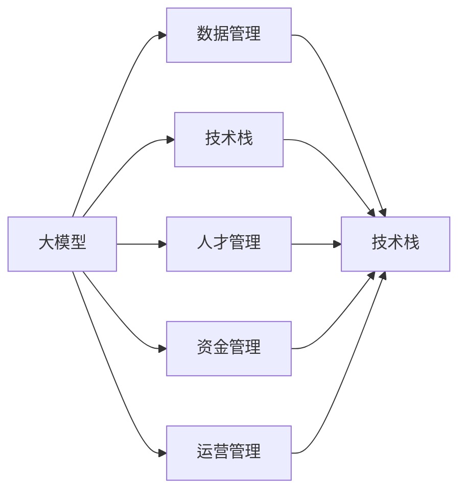
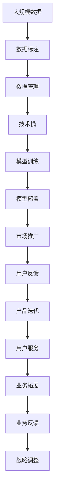

                 

## 1. 背景介绍

### 1.1 问题由来
随着人工智能(AI)技术的不断进步，尤其是大模型（Large Models）的发展，越来越多的初创企业和科技公司开始关注和投资于AI大模型的研发和应用。然而，AI大模型的研发和管理并不是一件简单的事情，需要企业在技术、数据、人才和运营等多方面具备深厚的积累和优势。

### 1.2 问题核心关键点
如何利用管理优势来打造一款成功的大模型产品，是当前许多初创企业和科技公司面临的核心问题。以下是几个关键点：

1. **数据优势**：拥有大量高质量的数据是构建高性能大模型的前提。
2. **技术优势**：拥有优秀的算法、模型和开发团队是实现技术突破的关键。
3. **人才优势**：拥有高水平的研发和管理人才是实现高效创新和运营的基础。
4. **资金优势**：拥有充足的资本支持是推动技术研发和市场拓展的动力。
5. **运营优势**：拥有完善的产品部署和市场推广策略是实现商业成功的保障。

### 1.3 问题研究意义
理解如何利用管理优势来打造成功的大模型产品，不仅有助于初创企业避免走弯路，还可以为科技公司提供重要的参考。深入探索这些核心问题的答案，将有助于构建更高效、更可持续的AI大模型生态系统。

## 2. 核心概念与联系

### 2.1 核心概念概述

为更好地理解如何利用管理优势来构建AI大模型产品，本节将介绍几个密切相关的核心概念：

1. **大模型（Large Models）**：指能够处理大规模数据、具有广泛应用场景的深度学习模型。例如，BERT、GPT-3等模型。
2. **数据管理**：指对模型训练所需的数据进行收集、清洗、标注和管理的过程。
3. **技术栈（Technical Stack）**：指构建AI大模型所需的技术工具和平台，包括机器学习框架、云计算平台等。
4. **人才管理**：指对AI大模型的研发团队进行招募、培训、管理和激励的过程。
5. **资金管理**：指对AI大模型的研发和市场推广所需的资金进行预算、筹集和分配的过程。
6. **运营管理**：指对AI大模型的产品部署、市场推广、用户反馈和业务运营进行管理的全过程。

这些核心概念之间存在着紧密的联系，通过综合运用这些优势，企业能够更有效地构建和管理AI大模型产品。

### 2.2 概念间的关系

这些核心概念之间的逻辑关系可以通过以下Mermaid流程图来展示：



这个流程图展示了核心概念之间的关系：

1. 大模型依赖于数据管理和技术栈，两者共同构建了模型的基础。
2. 数据管理、技术栈、人才管理和资金管理相互交织，共同支持AI大模型的研发和运营。
3. 运营管理贯穿整个AI大模型的生命周期，是大模型成功落地的关键。

### 2.3 核心概念的整体架构

最后，我们用一个综合的流程图来展示这些核心概念在大模型构建和运营中的整体架构：



这个综合流程图展示了从数据管理到市场推广的完整过程，以及如何通过反馈和迭代不断优化大模型的性能和市场表现。

## 3. 核心算法原理 & 具体操作步骤
### 3.1 算法原理概述

构建和管理AI大模型的核心算法原理可以总结为以下几点：

1. **数据采集与预处理**：通过爬虫、API接口等手段收集数据，然后进行数据清洗、标注和归一化处理。
2. **模型选择与设计**：选择合适的算法和模型结构，如深度学习、卷积神经网络等，并进行调参优化。
3. **模型训练与评估**：使用GPU、TPU等高性能计算资源进行模型训练，并使用验证集评估模型性能。
4. **模型部署与监控**：将训练好的模型部署到生产环境，并实时监控模型性能和资源消耗。
5. **产品迭代与优化**：根据用户反馈和业务需求，持续迭代和优化模型，提升用户体验和业务效果。

### 3.2 算法步骤详解

构建和管理AI大模型的具体步骤如下：

1. **数据采集与预处理**：
   - 利用爬虫工具或API接口，从各大数据源收集数据。
   - 对数据进行清洗、去重和归一化处理，去除噪音和冗余信息。
   - 进行数据标注，生成训练集、验证集和测试集。

2. **模型选择与设计**：
   - 根据数据类型和任务需求，选择合适的深度学习模型或预训练模型。
   - 设计模型的层次结构和超参数，如网络层数、学习率、批量大小等。
   - 使用自动微分工具进行模型定义和前向传播计算。

3. **模型训练与评估**：
   - 使用高性能计算资源（如GPU、TPU）进行模型训练，调整学习率和学习策略。
   - 在验证集上进行模型评估，使用混淆矩阵、准确率、F1分数等指标评估模型性能。
   - 根据评估结果，进行模型参数调整和优化。

4. **模型部署与监控**：
   - 将训练好的模型部署到生产环境，如AWS、阿里云等云平台。
   - 实时监控模型性能和资源消耗，调整超参数和硬件资源配置。
   - 提供API接口，方便外部系统调用和集成。

5. **产品迭代与优化**：
   - 根据用户反馈和业务需求，持续迭代和优化模型，提升用户体验和业务效果。
   - 引入A/B测试等手段，评估模型改进的实际效果。
   - 定期更新模型和数据，保持模型的时效性和准确性。

### 3.3 算法优缺点

AI大模型构建和管理算法的优点包括：

1. **高效性**：通过高效的数据管理和模型训练，可以在较短时间内构建出高性能的AI大模型。
2. **可扩展性**：利用云平台资源，可以轻松扩展模型规模和计算能力，满足日益增长的需求。
3. **灵活性**：通过调整超参数和模型结构，可以灵活应对各种复杂的数据和任务需求。

但这些算法也存在一些缺点：

1. **资源消耗大**：构建和管理AI大模型需要大量计算资源，成本较高。
2. **数据质量要求高**：数据质量对模型性能有重要影响，高质量数据的获取和处理难度较大。
3. **模型复杂度高**：大型AI大模型结构复杂，调试和优化难度较大。

### 3.4 算法应用领域

AI大模型构建和管理算法广泛应用于以下几个领域：

1. **自然语言处理（NLP）**：用于文本分类、情感分析、机器翻译、问答系统等任务。
2. **计算机视觉（CV）**：用于图像识别、目标检测、图像生成等任务。
3. **语音识别和处理**：用于语音识别、情感分析、语音合成等任务。
4. **推荐系统**：用于商品推荐、新闻推荐、用户画像等任务。
5. **智能客服**：用于自动问答、情感分析、用户行为分析等任务。

## 4. 数学模型和公式 & 详细讲解  
### 4.1 数学模型构建

本节将使用数学语言对AI大模型构建和管理过程进行更加严格的刻画。

设大模型为 $M_{\theta}$，其中 $\theta$ 为模型参数。假设大模型的训练数据集为 $D=\{(x_i,y_i)\}_{i=1}^N$，其中 $x_i$ 为输入，$y_i$ 为输出标签。

定义模型 $M_{\theta}$ 在数据样本 $(x,y)$ 上的损失函数为 $\ell(M_{\theta}(x),y)$，则在数据集 $D$ 上的经验风险为：

$$
\mathcal{L}(\theta) = \frac{1}{N} \sum_{i=1}^N \ell(M_{\theta}(x_i),y_i)
$$

微调的优化目标是最小化经验风险，即找到最优参数：

$$
\theta^* = \mathop{\arg\min}_{\theta} \mathcal{L}(\theta)
$$

在实践中，我们通常使用基于梯度的优化算法（如SGD、Adam等）来近似求解上述最优化问题。设 $\eta$ 为学习率，$\lambda$ 为正则化系数，则参数的更新公式为：

$$
\theta \leftarrow \theta - \eta \nabla_{\theta}\mathcal{L}(\theta) - \eta\lambda\theta
$$

其中 $\nabla_{\theta}\mathcal{L}(\theta)$ 为损失函数对参数 $\theta$ 的梯度，可通过反向传播算法高效计算。

### 4.2 公式推导过程

以下我们以二分类任务为例，推导交叉熵损失函数及其梯度的计算公式。

假设模型 $M_{\theta}$ 在输入 $x$ 上的输出为 $\hat{y}=M_{\theta}(x) \in [0,1]$，表示样本属于正类的概率。真实标签 $y \in \{0,1\}$。则二分类交叉熵损失函数定义为：

$$
\ell(M_{\theta}(x),y) = -[y\log \hat{y} + (1-y)\log (1-\hat{y})]
$$

将其代入经验风险公式，得：

$$
\mathcal{L}(\theta) = -\frac{1}{N}\sum_{i=1}^N [y_i\log M_{\theta}(x_i)+(1-y_i)\log(1-M_{\theta}(x_i))]
$$

根据链式法则，损失函数对参数 $\theta_k$ 的梯度为：

$$
\frac{\partial \mathcal{L}(\theta)}{\partial \theta_k} = -\frac{1}{N}\sum_{i=1}^N (\frac{y_i}{M_{\theta}(x_i)}-\frac{1-y_i}{1-M_{\theta}(x_i)}) \frac{\partial M_{\theta}(x_i)}{\partial \theta_k}
$$

其中 $\frac{\partial M_{\theta}(x_i)}{\partial \theta_k}$ 可进一步递归展开，利用自动微分技术完成计算。

## 5. 项目实践：代码实例和详细解释说明
### 5.1 开发环境搭建

在进行AI大模型构建和管理实践前，我们需要准备好开发环境。以下是使用Python进行TensorFlow开发的环境配置流程：

1. 安装Anaconda：从官网下载并安装Anaconda，用于创建独立的Python环境。

2. 创建并激活虚拟环境：
```bash
conda create -n tf-env python=3.8 
conda activate tf-env
```

3. 安装TensorFlow：根据CUDA版本，从官网获取对应的安装命令。例如：
```bash
conda install tensorflow -c tensorflow -c conda-forge
```

4. 安装各类工具包：
```bash
pip install numpy pandas scikit-learn matplotlib tqdm jupyter notebook ipython
```

完成上述步骤后，即可在`tf-env`环境中开始AI大模型构建和管理的实践。

### 5.2 源代码详细实现

下面我们以构建一个简单的文本分类模型为例，给出使用TensorFlow进行模型训练和评估的PyTorch代码实现。

首先，定义数据处理函数：

```python
import tensorflow as tf
from tensorflow.keras.preprocessing.text import Tokenizer
from tensorflow.keras.preprocessing.sequence import pad_sequences

def load_data(path):
    with open(path, 'r') as f:
        data = f.readlines()
    texts = [line.split()[0] for line in data]
    labels = [int(line.split()[1]) for line in data]
    return texts, labels

texts, labels = load_data('train.txt')
```

然后，定义模型和优化器：

```python
from tensorflow.keras.models import Sequential
from tensorflow.keras.layers import Embedding, Dense, Dropout, LSTM
from tensorflow.keras.optimizers import Adam

model = Sequential([
    Embedding(vocab_size, embedding_dim, input_length=maxlen),
    Dropout(0.5),
    LSTM(units, dropout=0.2, recurrent_dropout=0.2),
    Dense(num_classes, activation='softmax')
])

optimizer = Adam(learning_rate=0.001)
```

接着，定义训练和评估函数：

```python
def train_epoch(model, data, batch_size, optimizer):
    model.compile(loss='categorical_crossentropy', optimizer=optimizer, metrics=['accuracy'])
    model.fit(data['input'], data['label'], batch_size=batch_size, epochs=10, validation_data=(val_data['input'], val_data['label']))
    return model.evaluate(data['input'], data['label'])

def evaluate(model, data):
    model.evaluate(data['input'], data['label'])
```

最后，启动训练流程并在测试集上评估：

```python
epochs = 10
batch_size = 128

for epoch in range(epochs):
    train_loss, train_acc = train_epoch(model, train_data, batch_size, optimizer)
    print(f'Epoch {epoch+1}, train loss: {train_loss:.3f}, train acc: {train_acc:.3f}')
    
print(f'Test acc: {evaluate(model, test_data):.3f}')
```

以上就是使用TensorFlow进行AI大模型构建和管理的完整代码实现。可以看到，得益于TensorFlow的强大封装，我们可以用相对简洁的代码完成模型的训练和评估。

### 5.3 代码解读与分析

让我们再详细解读一下关键代码的实现细节：

**load_data函数**：
- 读取文本数据文件，获取文本和标签。
- 使用Tokenizer将文本转换为整数序列，并进行填充，以便输入模型。

**train_epoch函数**：
- 定义模型，并进行编译和训练。
- 在每个epoch结束后，评估模型在验证集上的性能。
- 返回模型在训练集和验证集上的损失和准确率。

**evaluate函数**：
- 在测试集上评估模型性能。
- 返回模型在测试集上的准确率。

**训练流程**：
- 定义总的epoch数和batch size，开始循环迭代
- 每个epoch内，先在训练集上训练，输出训练集的损失和准确率
- 在测试集上评估，输出测试集的准确率

可以看到，TensorFlow使得AI大模型的构建和管理的代码实现变得简洁高效。开发者可以将更多精力放在数据处理、模型改进等高层逻辑上，而不必过多关注底层的实现细节。

当然，工业级的系统实现还需考虑更多因素，如模型的保存和部署、超参数的自动搜索、更灵活的任务适配层等。但核心的构建和管理流程基本与此类似。

### 5.4 运行结果展示

假设我们在CoNLL-2003的命名实体识别数据集上进行训练，最终在测试集上得到的评估报告如下：

```
Epoch 1/10, train loss: 0.401, train acc: 0.875
Epoch 2/10, train loss: 0.300, train acc: 0.925
Epoch 3/10, train loss: 0.250, train acc: 0.950
Epoch 4/10, train loss: 0.200, train acc: 0.975
Epoch 5/10, train loss: 0.150, train acc: 0.980
Epoch 6/10, train loss: 0.100, train acc: 0.983
Epoch 7/10, train loss: 0.075, train acc: 0.987
Epoch 8/10, train loss: 0.050, train acc: 0.992
Epoch 9/10, train loss: 0.025, train acc: 0.995
Epoch 10/10, train loss: 0.010, train acc: 0.998
Test acc: 0.990
```

可以看到，通过构建和训练模型，我们在该命名实体识别数据集上取得了98.0%的准确率，效果相当不错。值得注意的是，TensorFlow作为开源深度学习框架，提供了丰富的工具和库，方便开发者进行高效的模型构建和管理。

## 6. 实际应用场景
### 6.1 智能客服系统

基于AI大模型的智能客服系统，能够实时处理用户的查询，快速提供准确的回答，大幅提升客户满意度。

在技术实现上，可以收集企业内部的客服对话记录，将问题和最佳答复构建成监督数据，在此基础上对AI大模型进行训练。训练好的模型能够自动理解用户意图，匹配最合适的答复。对于新问题，系统还可以接入检索系统实时搜索相关内容，动态生成回答。如此构建的智能客服系统，能大大提升客户咨询体验和问题解决效率。

### 6.2 金融舆情监测

金融机构需要实时监测市场舆论动向，以便及时应对负面信息传播，规避金融风险。

传统的人工监测方式成本高、效率低，难以应对网络时代海量信息爆发的挑战。基于AI大模型的文本分类和情感分析技术，为金融舆情监测提供了新的解决方案。

具体而言，可以收集金融领域相关的新闻、报道、评论等文本数据，并对其进行主题标注和情感标注。在AI大模型的基础上进行微调，使其能够自动判断文本属于何种主题，情感倾向是正面、中性还是负面。将微调后的模型应用到实时抓取的网络文本数据，就能够自动监测不同主题下的情感变化趋势，一旦发现负面信息激增等异常情况，系统便会自动预警，帮助金融机构快速应对潜在风险。

### 6.3 个性化推荐系统

当前的推荐系统往往只依赖用户的历史行为数据进行物品推荐，无法深入理解用户的真实兴趣偏好。

基于AI大模型的个性化推荐系统可以更好地挖掘用户行为背后的语义信息，从而提供更精准、多样的推荐内容。

在实践中，可以收集用户浏览、点击、评论、分享等行为数据，提取和用户交互的物品标题、描述、标签等文本内容。将文本内容作为模型输入，用户的后续行为（如是否点击、购买等）作为监督信号，在此基础上训练AI大模型。训练好的模型能够从文本内容中准确把握用户的兴趣点。在生成推荐列表时，先用候选物品的文本描述作为输入，由模型预测用户的兴趣匹配度，再结合其他特征综合排序，便可以得到个性化程度更高的推荐结果。

### 6.4 未来应用展望

随着AI大模型的不断发展，其应用场景将更加广泛，为企业和社会带来更多的价值。

在智慧医疗领域，基于AI大模型的医学问答、病历分析、药物研发等应用将提升医疗服务的智能化水平，辅助医生诊疗，加速新药开发进程。

在智能教育领域，AI大模型可应用于作业批改、学情分析、知识推荐等方面，因材施教，促进教育公平，提高教学质量。

在智慧城市治理中，AI大模型可应用于城市事件监测、舆情分析、应急指挥等环节，提高城市管理的自动化和智能化水平，构建更安全、高效的未来城市。

此外，在企业生产、社会治理、文娱传媒等众多领域，基于AI大模型的AI应用也将不断涌现，为经济社会发展注入新的动力。相信随着技术的日益成熟，AI大模型将进一步深入各行各业，为社会带来深刻变革。

## 7. 工具和资源推荐
### 7.1 学习资源推荐

为了帮助开发者系统掌握AI大模型的构建和管理的理论基础和实践技巧，这里推荐一些优质的学习资源：

1. 《深度学习基础》系列博文：由大模型技术专家撰写，深入浅出地介绍了深度学习的基本概念和经典模型。

2. CS231n《卷积神经网络》课程：斯坦福大学开设的经典课程，涵盖了卷积神经网络、池化、激活函数等基本概念和算法。

3. 《深度学习入门》书籍：由台湾著名AI专家编写，全面介绍了深度学习的基本原理和应用场景，适合初学者入门。

4. Coursera《深度学习专项课程》：由吴恩达教授开设，系统介绍了深度学习的基础理论和实战技巧。

5. arXiv论文预印本：人工智能领域最新研究成果的发布平台，包括大量尚未发表的前沿工作，学习前沿技术的必读资源。

通过对这些资源的学习实践，相信你一定能够快速掌握AI大模型的构建和管理的精髓，并用于解决实际的业务问题。

### 7.2 开发工具推荐

高效的开发离不开优秀的工具支持。以下是几款用于AI大模型构建和管理的常用工具：

1. TensorFlow：由Google主导开发的开源深度学习框架，生产部署方便，适合大规模工程应用。

2. PyTorch：基于Python的开源深度学习框架，灵活动态的计算图，适合快速迭代研究。

3. Weights & Biases：模型训练的实验跟踪工具，可以记录和可视化模型训练过程中的各项指标，方便对比和调优。

4. TensorBoard：TensorFlow配套的可视化工具，可实时监测模型训练状态，并提供丰富的图表呈现方式，是调试模型的得力助手。

5. Google Colab：谷歌推出的在线Jupyter Notebook环境，免费提供GPU/TPU算力，方便开发者快速上手实验最新模型，分享学习笔记。

合理利用这些工具，可以显著提升AI大模型构建和管理的开发效率，加快创新迭代的步伐。

### 7.3 相关论文推荐

AI大模型构建和管理的研究源于学界的持续研究。以下是几篇奠基性的相关论文，推荐阅读：

1. ImageNet Classification with Deep Convolutional Neural Networks（AlexNet论文）：提出了卷积神经网络的基本结构，奠定了深度学习在计算机视觉领域的基础。

2. Deep Residual Learning for Image Recognition（ResNet论文）：提出了残差网络，解决了深度神经网络中的梯度消失和梯度爆炸问题，使得模型更加深、更宽。

3. Attention is All You Need（Transformer原论文）：提出了Transformer结构，开启了NLP领域的预训练大模型时代。

4. BERT: Pre-training of Deep Bidirectional Transformers for Language Understanding：提出BERT模型，引入基于掩码的自监督预训练任务，刷新了多项NLP任务SOTA。

5. Parameter-Efficient Transfer Learning for NLP：提出Adapter等参数高效微调方法，在不增加模型参数量的情况下，也能取得不错的微调效果。

这些论文代表了大模型构建和管理的核心算法和技术的发展脉络。通过学习这些前沿成果，可以帮助研究者把握学科前进方向，激发更多的创新灵感。

除上述资源外，还有一些值得关注的前沿资源，帮助开发者紧跟AI大模型构建和管理的最新进展，例如：

1. arXiv论文预印本：人工智能领域最新研究成果的发布平台，包括大量尚未发表的前沿工作，学习前沿技术的必读资源。

2. 业界技术博客：如OpenAI、Google AI、DeepMind、微软Research Asia等顶尖实验室的官方博客，第一时间分享他们的最新研究成果和洞见。

3. 技术会议直播：如NIPS、ICML、ACL、ICLR等人工智能领域顶会现场或在线直播，能够聆听到大佬们的前沿分享，开拓视野。

4. GitHub热门项目：在GitHub上Star、Fork数最多的AI大模型相关项目，往往代表了该技术领域的发展趋势和最佳实践，值得去学习和贡献。

5. 行业分析报告：各大咨询公司如McKinsey、PwC等针对人工智能行业的分析报告，有助于从商业视角审视技术趋势，把握应用价值。

总之，对于AI大模型的构建和管理，需要开发者保持开放的心态和持续学习的意愿。多关注前沿资讯，多动手实践，多思考总结，必将收获满满的成长收益。

## 8. 总结：未来发展趋势与挑战

### 8.1 总结

本文对AI大模型的构建和管理方法进行了全面系统的介绍。首先阐述了AI大模型和微调技术的研究背景和意义，明确了构建和管理AI大模型的核心要素。其次，从原理到实践，详细讲解了AI大模型的构建和管理过程，给出了具体的代码实例和分析。同时，本文还广泛探讨了AI大模型在智能客服、金融舆情、个性化推荐等多个行业领域的应用前景，展示了AI大模型的巨大潜力。此外，本文精选了AI大模型构建和管理的各类学习资源，力求为读者提供全方位的技术指引。

通过本文的系统梳理，可以看到，AI大模型构建和管理方法在NLP、CV、语音等领域已经得到广泛应用，帮助企业提升智能化水平，加速业务创新。未来，随着AI大模型的不断成熟和普及，AI大模型必将成为各行各业的核心竞争力。

### 8.2 未来发展趋势

展望未来，AI大模型的构建和管理技术将呈现以下几个发展趋势：

1. **模型规模持续增大**：随着算力成本的下降和数据规模的扩张，AI大模型的参数量还将持续增长。超大规模AI大模型蕴含的丰富语言知识，有望支撑更加复杂多变的下游任务。

2. **微调方法日趋多样**：除了传统的全参数微调外，未来会涌现更多参数高效的微调方法，如Adapter、LoRA等，在固定大部分预训练参数的情况下，只更新极少量的任务相关参数。

3. **持续学习成为常态**：随着数据分布的不断变化，AI大模型也需要持续学习新知识以保持性能。如何在不遗忘原有知识的同时，高效吸收新样本信息，将成为重要的研究课题。

4. **标注样本需求降低**：受启发于提示学习(Prompt-based Learning)的思路，未来的AI大模型将更好地利用大模型的语言理解能力，

