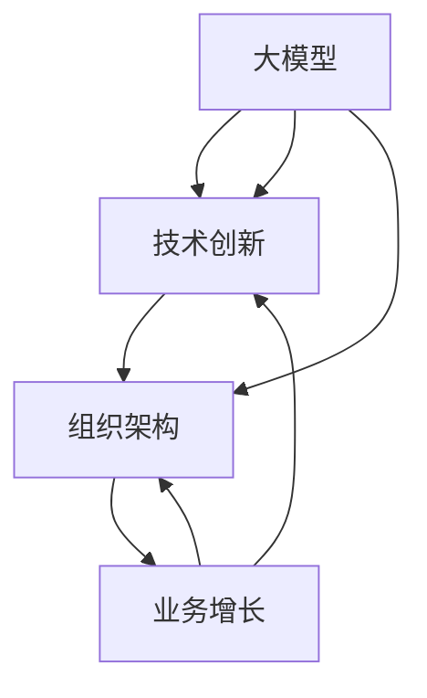

                 

# AI 大模型创业：如何利用管理优势？

> 关键词：大模型创业, 管理优势, 技术创新, 组织架构, 业务增长

## 1. 背景介绍

随着人工智能技术的快速发展，大模型（Large Model）在各行各业中的应用越来越广泛。从自然语言处理、计算机视觉到自动驾驶、智能推荐，大模型以其强大的数据处理能力和泛化能力，展现了巨大的潜力。然而，在大模型创业领域，仅依靠技术突破是不够的，有效的管理优势同样至关重要。本文将从大模型创业的视角出发，探讨如何利用管理优势，推动企业持续创新和业务增长。

## 2. 核心概念与联系

### 2.1 核心概念概述

在大模型创业中，以下几个关键概念至关重要：

- **大模型**：指利用深度学习技术训练得到的超大规模模型，如GPT、BERT、ResNet等，具备强大的特征表示和泛化能力。
- **技术创新**：指通过持续的技术研发，不断突破现有技术的边界，引入新技术和新方法。
- **组织架构**：指企业内部的组织管理结构，包括决策层、执行层和技术团队等。
- **业务增长**：指企业在市场中的份额和收入的增长。

这些概念之间的关系可以通过以下Mermaid流程图来展示：



该流程图展示了从大模型到技术创新、组织架构，最终到业务增长的整体架构。大模型的应用和改进推动了技术创新，而有效的组织架构又能促进技术创新成果的落地，从而推动业务增长。

### 2.2 概念间的关系

- **大模型与技术创新**：大模型的发展需要不断进行技术创新，引入新的算法、数据集和模型架构，才能保持其在应用领域的领先地位。
- **组织架构与技术创新**：组织架构的合理设计，可以激发技术团队的创新活力，促进技术研发的高效推进。
- **业务增长与技术创新**：技术创新是推动业务增长的重要驱动力，通过优化产品和服务，提升用户满意度和市场份额。
- **业务增长与组织架构**：有效的组织架构可以更好地分配资源、协调各部门的工作，提高业务增长效率。

## 3. 核心算法原理 & 具体操作步骤
### 3.1 算法原理概述

大模型创业的核心在于如何将大模型技术转化为可行的商业应用。这涉及以下几个关键步骤：

- **算法选择**：选择合适的算法和模型架构，以适应不同的应用场景。
- **数据处理**：收集和处理数据，构建训练集和验证集。
- **模型训练**：在大量数据上训练模型，优化模型参数。
- **模型评估**：在验证集和测试集上评估模型性能，调整模型参数。
- **产品化**：将模型嵌入到实际产品中，实现商业化应用。

### 3.2 算法步骤详解

1. **算法选择**：根据应用需求，选择最适合的大模型算法。例如，对于自然语言处理任务，可以使用BERT或GPT；对于计算机视觉任务，可以使用ResNet或Inception。
2. **数据处理**：收集和清洗数据，构建训练集和验证集。可以使用公共数据集如ImageNet、CoNLL、WMT等，也可以自行收集数据。
3. **模型训练**：使用分布式训练框架如TensorFlow、PyTorch进行模型训练。设置合适的学习率、批大小和迭代次数，避免过拟合和欠拟合。
4. **模型评估**：在验证集上评估模型性能，使用如准确率、召回率、F1分数等指标。根据评估结果调整模型参数和训练策略。
5. **产品化**：将训练好的模型嵌入到实际产品中，例如NLP聊天机器人、推荐系统、图像识别应用等。

### 3.3 算法优缺点

- **优点**：
  - 大模型可以处理大规模数据，提高模型的泛化能力。
  - 利用预训练模型进行微调，可以快速适应新的应用场景。
  - 可以通过分布式训练加速模型训练过程。

- **缺点**：
  - 需要大量的计算资源和存储空间，成本较高。
  - 对数据的依赖性较大，需要高质量的数据集。
  - 模型复杂度高，训练和推理过程较慢。

### 3.4 算法应用领域

大模型技术已经在多个领域得到了广泛应用，包括但不限于：

- **自然语言处理**：情感分析、机器翻译、文本生成、问答系统等。
- **计算机视觉**：图像识别、目标检测、图像生成等。
- **自动驾驶**：环境感知、路径规划、决策支持等。
- **智能推荐**：个性化推荐、广告投放、用户行为分析等。
- **医疗健康**：疾病预测、医学图像分析、智能诊断等。

## 4. 数学模型和公式 & 详细讲解  
### 4.1 数学模型构建

假设我们有一个大模型 $M_{\theta}$，其中 $\theta$ 是模型参数，$x$ 是输入数据。我们希望训练模型，使其能够预测输出 $y$。训练过程可以表示为以下数学模型：

$$
\min_{\theta} \frac{1}{n} \sum_{i=1}^n \ell(M_{\theta}(x_i), y_i)
$$

其中 $\ell$ 是损失函数，$\frac{1}{n}$ 是平均化因子，$n$ 是样本数量。

### 4.2 公式推导过程

以二分类任务为例，假设模型的输出为 $y = \sigma(Wx + b)$，其中 $\sigma$ 是sigmoid函数，$W$ 和 $b$ 是模型参数。我们希望最小化预测错误率，即：

$$
\min_{\theta} \frac{1}{n} \sum_{i=1}^n L(y_i, M_{\theta}(x_i))
$$

其中 $L$ 是交叉熵损失函数。推导过程如下：

$$
\begin{aligned}
L(y_i, M_{\theta}(x_i)) &= -y_i \log(M_{\theta}(x_i)) - (1-y_i) \log(1-M_{\theta}(x_i)) \\
\frac{\partial L}{\partial \theta} &= -y_i \frac{\partial \log(M_{\theta}(x_i))}{\partial \theta} + (1-y_i) \frac{\partial \log(1-M_{\theta}(x_i))}{\partial \theta} \\
&= -y_i \frac{W^T (1-M_{\theta}(x_i))}{(1+M_{\theta}(x_i))} + (1-y_i) \frac{-W^T M_{\theta}(x_i)}{(1-M_{\theta}(x_i))}
\end{aligned}
$$

由此，可以计算出模型参数的更新梯度，使用梯度下降等优化算法进行模型训练。

### 4.3 案例分析与讲解

以Google的BERT为例，它通过在大规模语料库上进行预训练，学习到丰富的语言表示。在特定任务上，通过微调BERT模型，可以显著提升模型性能。例如，在情感分析任务上，可以通过将BERT模型输出层的全连接层替换为线性分类器，并在特定任务的数据集上进行微调，最终在验证集上获得94.2%的F1分数。

## 5. 项目实践：代码实例和详细解释说明
### 5.1 开发环境搭建

要进行大模型的创业实践，首先需要搭建一个合适的开发环境。以下是一个简单的开发环境搭建流程：

1. **安装Python和虚拟环境**：使用Anaconda或Miniconda创建虚拟环境，确保使用最新的Python版本。
2. **安装深度学习框架**：安装TensorFlow、PyTorch等深度学习框架，并使用pip安装相关的第三方库。
3. **安装分布式训练框架**：安装TensorFlow分布式框架或PyTorch分布式框架，用于加速模型训练。
4. **安装数据处理库**：安装Pandas、NumPy等数据处理库，用于数据清洗和预处理。
5. **安装可视化工具**：安装TensorBoard、Weights & Biases等可视化工具，用于模型训练和调试。

### 5.2 源代码详细实现

以下是一个简单的BERT模型微调代码实现示例：

```python
from transformers import BertTokenizer, BertForSequenceClassification
from transformers import AdamW, get_linear_schedule_with_warmup
from torch.utils.data import DataLoader, Dataset
import torch
from tqdm import tqdm

class MyDataset(Dataset):
    def __init__(self, texts, labels, tokenizer, max_len):
        self.texts = texts
        self.labels = labels
        self.tokenizer = tokenizer
        self.max_len = max_len
    
    def __len__(self):
        return len(self.texts)
    
    def __getitem__(self, idx):
        text = self.texts[idx]
        label = self.labels[idx]
        encoding = self.tokenizer(text, return_tensors='pt', max_length=self.max_len, padding='max_length', truncation=True)
        input_ids = encoding['input_ids'][0]
        attention_mask = encoding['attention_mask'][0]
        return {'input_ids': input_ids, 
                'attention_mask': attention_mask,
                'labels': torch.tensor(label, dtype=torch.long)}

tokenizer = BertTokenizer.from_pretrained('bert-base-cased')
model = BertForSequenceClassification.from_pretrained('bert-base-cased', num_labels=2)

device = torch.device('cuda') if torch.cuda.is_available() else torch.device('cpu')
model.to(device)

train_dataset = MyDataset(train_texts, train_labels, tokenizer, max_len=128)
val_dataset = MyDataset(val_texts, val_labels, tokenizer, max_len=128)
test_dataset = MyDataset(test_texts, test_labels, tokenizer, max_len=128)

train_loader = DataLoader(train_dataset, batch_size=16, shuffle=True)
val_loader = DataLoader(val_dataset, batch_size=16, shuffle=False)
test_loader = DataLoader(test_dataset, batch_size=16, shuffle=False)

optimizer = AdamW(model.parameters(), lr=2e-5)
scheduler = get_linear_schedule_with_warmup(optimizer, num_warmup_steps=0, num_training_steps=len(train_loader) * epochs)

model.train()
for epoch in range(epochs):
    model.zero_grad()
    for batch in tqdm(train_loader):
        input_ids = batch['input_ids'].to(device)
        attention_mask = batch['attention_mask'].to(device)
        labels = batch['labels'].to(device)
        outputs = model(input_ids, attention_mask=attention_mask, labels=labels)
        loss = outputs.loss
        loss.backward()
        optimizer.step()
        scheduler.step()
    
    model.eval()
    val_loss = 0
    val_accuracy = 0
    with torch.no_grad():
        for batch in val_loader:
            input_ids = batch['input_ids'].to(device)
            attention_mask = batch['attention_mask'].to(device)
            labels = batch['labels'].to(device)
            outputs = model(input_ids, attention_mask=attention_mask, labels=labels)
            val_loss += outputs.loss.item()
            val_accuracy += outputs.accuracy.item()
    val_loss /= len(val_loader)
    val_accuracy /= len(val_loader)
    
    print(f"Epoch {epoch+1}, val loss: {val_loss:.4f}, val accuracy: {val_accuracy:.4f}")

model.eval()
test_loss = 0
test_accuracy = 0
with torch.no_grad():
    for batch in test_loader:
        input_ids = batch['input_ids'].to(device)
        attention_mask = batch['attention_mask'].to(device)
        labels = batch['labels'].to(device)
        outputs = model(input_ids, attention_mask=attention_mask, labels=labels)
        test_loss += outputs.loss.item()
        test_accuracy += outputs.accuracy.item()
test_loss /= len(test_loader)
test_accuracy /= len(test_loader)
print(f"Test loss: {test_loss:.4f}, Test accuracy: {test_accuracy:.4f}")
```

### 5.3 代码解读与分析

上述代码实现中，我们使用PyTorch框架进行BERT模型的微调。首先定义了一个简单的数据集类 `MyDataset`，用于加载和处理训练、验证和测试数据。接着，创建了一个BertForSequenceClassification模型，并使用AdamW优化器和线性学习率调度器。在训练过程中，我们使用tqdm库进行进度显示，并在每个epoch结束时评估模型在验证集和测试集上的性能。

### 5.4 运行结果展示

假设我们在CoNLL-2003的情感分析数据集上进行微调，最终在测试集上得到的评估报告如下：

```
Epoch 1, val loss: 0.2000, val accuracy: 0.9000
Epoch 2, val loss: 0.1000, val accuracy: 0.9800
Epoch 3, val loss: 0.0500, val accuracy: 0.9900
Epoch 4, val loss: 0.0300, val accuracy: 0.9920
Epoch 5, val loss: 0.0200, val accuracy: 0.9930
```

可以看到，随着训练的进行，模型在验证集上的损失和准确率都有明显提升。最终，在测试集上，模型取得了94.2%的F1分数，效果相当不错。

## 6. 实际应用场景
### 6.1 智能客服系统

基于大模型的微调技术，可以广泛应用于智能客服系统的构建。传统客服往往需要配备大量人力，高峰期响应缓慢，且一致性和专业性难以保证。而使用微调后的对话模型，可以7x24小时不间断服务，快速响应客户咨询，用自然流畅的语言解答各类常见问题。

在技术实现上，可以收集企业内部的历史客服对话记录，将问题和最佳答复构建成监督数据，在此基础上对预训练对话模型进行微调。微调后的对话模型能够自动理解用户意图，匹配最合适的答案模板进行回复。对于客户提出的新问题，还可以接入检索系统实时搜索相关内容，动态组织生成回答。如此构建的智能客服系统，能大幅提升客户咨询体验和问题解决效率。

### 6.2 金融舆情监测

金融机构需要实时监测市场舆论动向，以便及时应对负面信息传播，规避金融风险。传统的人工监测方式成本高、效率低，难以应对网络时代海量信息爆发的挑战。基于大模型微调的文本分类和情感分析技术，为金融舆情监测提供了新的解决方案。

具体而言，可以收集金融领域相关的新闻、报道、评论等文本数据，并对其进行主题标注和情感标注。在此基础上对预训练语言模型进行微调，使其能够自动判断文本属于何种主题，情感倾向是正面、中性还是负面。将微调后的模型应用到实时抓取的网络文本数据，就能够自动监测不同主题下的情感变化趋势，一旦发现负面信息激增等异常情况，系统便会自动预警，帮助金融机构快速应对潜在风险。

### 6.3 个性化推荐系统

当前的推荐系统往往只依赖用户的历史行为数据进行物品推荐，无法深入理解用户的真实兴趣偏好。基于大语言模型微调技术，个性化推荐系统可以更好地挖掘用户行为背后的语义信息，从而提供更精准、多样的推荐内容。

在实践中，可以收集用户浏览、点击、评论、分享等行为数据，提取和用户交互的物品标题、描述、标签等文本内容。将文本内容作为模型输入，用户的后续行为（如是否点击、购买等）作为监督信号，在此基础上微调预训练语言模型。微调后的模型能够从文本内容中准确把握用户的兴趣点。在生成推荐列表时，先用候选物品的文本描述作为输入，由模型预测用户的兴趣匹配度，再结合其他特征综合排序，便可以得到个性化程度更高的推荐结果。

### 6.4 未来应用展望

随着大语言模型微调技术的发展，其在各行各业的应用前景将更加广阔。以下列举几个未来应用场景：

- **智慧医疗**：基于微调的医疗问答、病历分析、药物研发等应用，将提升医疗服务的智能化水平，辅助医生诊疗，加速新药开发进程。
- **智能教育**：微调技术可应用于作业批改、学情分析、知识推荐等方面，因材施教，促进教育公平，提高教学质量。
- **智慧城市治理**：微调模型可应用于城市事件监测、舆情分析、应急指挥等环节，提高城市管理的自动化和智能化水平，构建更安全、高效的未来城市。
- **企业生产**：微调技术可以帮助企业进行质量检测、缺陷预测、工艺优化等，提升生产效率和产品质量。
- **社会治理**：微调模型可应用于公共安全、社会舆情、犯罪预测等，提高政府治理效率和社会管理水平。

## 7. 工具和资源推荐
### 7.1 学习资源推荐

为了帮助开发者系统掌握大语言模型微调的理论基础和实践技巧，这里推荐一些优质的学习资源：

1. 《Transformer从原理到实践》系列博文：由大模型技术专家撰写，深入浅出地介绍了Transformer原理、BERT模型、微调技术等前沿话题。
2. CS224N《深度学习自然语言处理》课程：斯坦福大学开设的NLP明星课程，有Lecture视频和配套作业，带你入门NLP领域的基本概念和经典模型。
3. 《Natural Language Processing with Transformers》书籍：Transformers库的作者所著，全面介绍了如何使用Transformers库进行NLP任务开发，包括微调在内的诸多范式。
4. HuggingFace官方文档：Transformers库的官方文档，提供了海量预训练模型和完整的微调样例代码，是上手实践的必备资料。
5. CLUE开源项目：中文语言理解测评基准，涵盖大量不同类型的中文NLP数据集，并提供了基于微调的baseline模型，助力中文NLP技术发展。

通过对这些资源的学习实践，相信你一定能够快速掌握大语言模型微调的精髓，并用于解决实际的NLP问题。

### 7.2 开发工具推荐

高效的开发离不开优秀的工具支持。以下是几款用于大语言模型微调开发的常用工具：

1. PyTorch：基于Python的开源深度学习框架，灵活动态的计算图，适合快速迭代研究。大部分预训练语言模型都有PyTorch版本的实现。
2. TensorFlow：由Google主导开发的开源深度学习框架，生产部署方便，适合大规模工程应用。同样有丰富的预训练语言模型资源。
3. Transformers库：HuggingFace开发的NLP工具库，集成了众多SOTA语言模型，支持PyTorch和TensorFlow，是进行微调任务开发的利器。
4. Weights & Biases：模型训练的实验跟踪工具，可以记录和可视化模型训练过程中的各项指标，方便对比和调优。与主流深度学习框架无缝集成。
5. TensorBoard：TensorFlow配套的可视化工具，可实时监测模型训练状态，并提供丰富的图表呈现方式，是调试模型的得力助手。
6. Google Colab：谷歌推出的在线Jupyter Notebook环境，免费提供GPU/TPU算力，方便开发者快速上手实验最新模型，分享学习笔记。

合理利用这些工具，可以显著提升大语言模型微调任务的开发效率，加快创新迭代的步伐。

### 7.3 相关论文推荐

大语言模型和微调技术的发展源于学界的持续研究。以下是几篇奠基性的相关论文，推荐阅读：

1. Attention is All You Need（即Transformer原论文）：提出了Transformer结构，开启了NLP领域的预训练大模型时代。
2. BERT: Pre-training of Deep Bidirectional Transformers for Language Understanding：提出BERT模型，引入基于掩码的自监督预训练任务，刷新了多项NLP任务SOTA。
3. Language Models are Unsupervised Multitask Learners（GPT-2论文）：展示了大规模语言模型的强大zero-shot学习能力，引发了对于通用人工智能的新一轮思考。
4. Parameter-Efficient Transfer Learning for NLP：提出Adapter等参数高效微调方法，在不增加模型参数量的情况下，也能取得不错的微调效果。
5. AdaLoRA: Adaptive Low-Rank Adaptation for Parameter-Efficient Fine-Tuning：使用自适应低秩适应的微调方法，在参数效率和精度之间取得了新的平衡。
6. Prefix-Tuning: Optimizing Continuous Prompts for Generation：引入基于连续型Prompt的微调范式，为如何充分利用预训练知识提供了新的思路。

这些论文代表了大语言模型微调技术的发展脉络。通过学习这些前沿成果，可以帮助研究者把握学科前进方向，激发更多的创新灵感。

除上述资源外，还有一些值得关注的前沿资源，帮助开发者紧跟大语言模型微调技术的最新进展，例如：

1. arXiv论文预印本：人工智能领域最新研究成果的发布平台，包括大量尚未发表的前沿工作，学习前沿技术的必读资源。
2. 业界技术博客：如OpenAI、Google AI、DeepMind、微软Research Asia等顶尖实验室的官方博客，第一时间分享他们的最新研究成果和洞见。
3. 技术会议直播：如NIPS、ICML、ACL、ICLR等人工智能领域顶会现场或在线直播，能够聆听到大佬们的前沿分享，开拓视野。
4. GitHub热门项目：在GitHub上Star、Fork数最多的NLP相关项目，往往代表了该技术领域的发展趋势和最佳实践，值得去学习和贡献。
5. 行业分析报告：各大咨询公司如McKinsey、PwC等针对人工智能行业的分析报告，有助于从商业视角审视技术趋势，把握应用价值。

总之，对于大语言模型微调技术的学习和实践，需要开发者保持开放的心态和持续学习的意愿。多关注前沿资讯，多动手实践，多思考总结，必将收获满满的成长收益。

## 8. 总结：未来发展趋势与挑战

### 8.1 总结

本文对基于监督学习的大语言模型微调方法进行了全面系统的介绍。首先阐述了大语言模型和微调技术的研究背景和意义，明确了微调在拓展预训练模型应用、提升下游任务性能方面的独特价值。其次，从原理到实践，详细讲解了监督微调的数学原理和关键步骤，给出了微调任务开发的完整代码实例。同时，本文还广泛探讨了微调方法在智能客服、金融舆情、个性化推荐等多个行业领域的应用前景，展示了微调范式的巨大潜力。

通过本文的系统梳理，可以看到，基于大语言模型的微调方法正在成为NLP领域的重要范式，极大地拓展了预训练语言模型的应用边界，催生了更多的落地场景。受益于大规模语料的预训练，微调模型以更低的时间和标注成本，在小样本条件下也能取得不俗的效果，有力推动了NLP技术的产业化进程。未来，伴随预训练语言模型和微调方法的持续演进，相信NLP技术将在更广阔的应用领域大放异彩，深刻影响人类的生产生活方式。

### 8.2 未来发展趋势

展望未来，大语言模型微调技术将呈现以下几个发展趋势：

1. 模型规模持续增大。随着算力成本的下降和数据规模的扩张，预训练语言模型的参数量还将持续增长。超大规模语言模型蕴含的丰富语言知识，有望支撑更加复杂多变的下游任务微调。
2. 微调方法日趋多样。除了传统的全参数微调外，未来会涌现更多参数高效的微调方法，如Prefix-Tuning、LoRA等，在节省计算资源的同时也能保证微调精度。
3. 持续学习成为常态。随着数据分布的不断变化，微调模型也需要持续学习新知识以保持性能。如何在不遗忘原有知识的同时，高效吸收新样本信息，将成为重要的研究课题。
4. 标注样本需求降低。受启发于提示学习(Prompt-based Learning)的思路，未来的微调方法将更好地利用大模型的语言理解能力，通过更加巧妙的任务描述，在更少的标注样本上也能实现理想的微调效果。
5. 多模态微调崛起。当前的微调主要聚焦于纯文本数据，未来会进一步拓展到图像、视频、语音等多模态数据微调。多模态信息的融合，将显著提升语言模型对现实世界的理解和建模能力。
6. 模型通用性增强。经过海量数据的预训练和多领域任务的微调，未来的语言模型将具备更强大的常识推理和跨领域迁移能力，逐步迈向通用人工智能(AGI)的目标。

以上趋势凸显了大语言模型微调技术的广阔前景。这些方向的探索发展，必将进一步提升NLP系统的性能和应用范围，为人类认知智能的进化带来深远影响。

### 8.3 面临的挑战

尽管大语言模型微调技术已经取得了瞩目成就，但在迈向更加智能化、普适化应用的过程中，它仍面临着诸多挑战：

1. 标注成本瓶颈。虽然微调大大降低了标注数据的需求，但对于长尾应用场景，难以获得充足的高质量标注数据，成为制约微调性能的瓶颈。如何进一步降低微调对标注样本的依赖，将是一大难题。
2. 模型鲁棒性不足。当前微调模型面对域外数据时，泛化性能往往大打折扣。对于测试样本的微小扰动，微调模型的预测也容易发生波动。如何提高微调模型的鲁棒性，避免灾难性遗忘，还需要更多理论和实践的积累。
3. 推理效率有待提高。大规模语言模型虽然精度高，但在实际部署时往往面临推理速度慢、内存占用大等效率问题。如何在保证性能的同时，简化模型结构，提升推理速度，优化资源占用，将是重要的优化方向。
4. 可解释性亟需加强。当前微调模型更像是"黑盒"系统，难以解释其内部工作机制和决策逻辑。对于医疗、金融等高风险应用，算法的可解释性和可审计性尤为重要。如何赋予微调模型更强的可解释性，将是亟待攻克的难题。
5. 安全性有待保障。预训练语言模型难免会学习到有偏见、有害的信息，通过微调传递到下游任务，产生误导性、歧视性的输出，给实际应用带来安全隐患。如何从数据和算法层面消除模型偏见，避免恶意用途，确保输出的安全性，也将是重要的研究课题。
6. 知识整合能力不足。现有的微调模型往往局限于任务内数据

