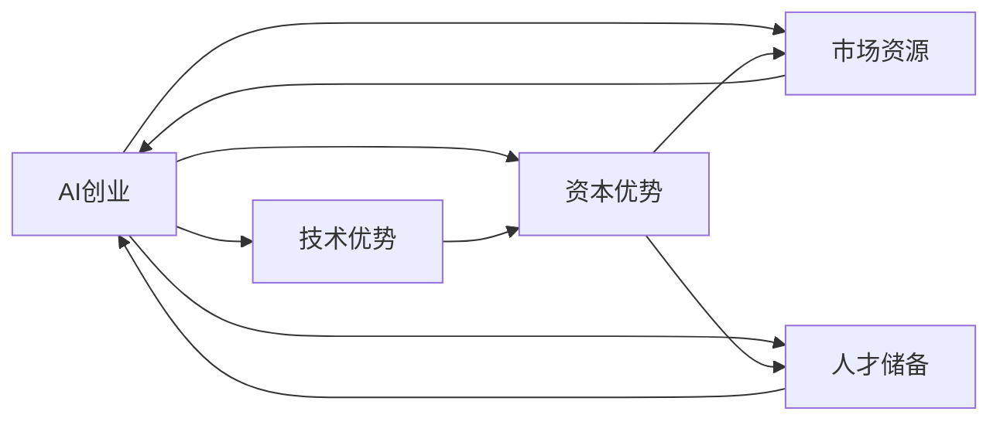

                 

## 1. 背景介绍

随着人工智能(AI)技术的迅猛发展，尤其是深度学习和大模型在多个领域取得突破性进展，AI创业成为了一个热门的投资方向。越来越多的创业者和投资者瞄准了这一潜力巨大的领域，希望能够通过AI技术获得可观的投资回报。然而，资本对于AI创业项目的意义远不止于资金支持，它还可以提供技术优势、市场资源、人才储备等全面赋能，帮助创业项目在激烈的市场竞争中脱颖而出。

在本文中，我们将详细探讨AI创业项目如何有效利用资本优势，以期为AI创业者提供全面的策略和实践指南。

## 2. 核心概念与联系

### 2.1 核心概念概述

1. **AI创业**：指通过运用AI技术解决实际问题的创业行为。常见的AI创业领域包括计算机视觉、自然语言处理、机器人技术、推荐系统等。
2. **资本优势**：指资本方通过投资、合作等方式，为创业项目带来的技术、市场、人才等多方面的支持与帮助。
3. **技术优势**：指资本方在AI领域积累的技术储备，能够提供先进的算法、模型、框架等资源。
4. **市场资源**：指资本方掌握的市场渠道、客户关系等，能够加速创业项目在实际市场中的推广和应用。
5. **人才储备**：指资本方拥有的人才库，能够帮助创业项目快速组建核心团队。

### 2.2 核心概念间的关系

以下是一个Mermaid流程图，展示了这些核心概念间的联系：



从图中可以看出，AI创业项目通过资本方的支持，可以获得技术、市场、人才等多方面的综合优势，从而在竞争中占据有利地位。

## 3. 核心算法原理 & 具体操作步骤

### 3.1 算法原理概述

AI创业项目利用资本优势的过程，本质上是一种协同创新的过程。资本方通过投资、合作等方式，为AI创业项目注入资源，帮助项目快速成长和市场应用。这一过程包括但不限于以下步骤：

1. **资源注入**：资本方提供资金、技术、市场渠道等资源，帮助创业项目构建完整的商业生态。
2. **技术支持**：资本方分享其在AI领域的技术积累，帮助创业项目提升算法和模型性能。
3. **市场拓展**：资本方利用其市场资源，帮助创业项目快速进入和占领市场。
4. **人才引进**：资本方提供人才支持，帮助创业项目组建和优化核心团队。
5. **运营优化**：资本方通过参与项目运营管理，提升项目效率和盈利能力。

### 3.2 算法步骤详解

以下是详细的具体操作步骤：

1. **项目筹备阶段**：
   - **需求分析**：明确创业项目的市场需求和技术挑战，制定详细的项目计划。
   - **资金需求**：根据项目计划，计算所需资金总额，包括技术研发、市场推广、人员工资等。
   - **资源匹配**：选择合适的资本方，评估其技术积累、市场资源和人才储备。

2. **资金获取阶段**：
   - **市场融资**：通过路演、投资者交流等方式，吸引潜在的投资者。
   - **资本协议**：与投资者签订投资协议，明确各自的权利和义务。
   - **资金注入**：根据协议，资本方按照约定时间和金额注入资金。

3. **技术引进阶段**：
   - **技术评估**：与资本方进行技术交流，评估其技术储备的适用性和匹配度。
   - **技术合作**：与资本方建立合作关系，共享技术资源。
   - **技术优化**：根据资本方的技术支持，优化算法和模型。

4. **市场推广阶段**：
   - **市场策略**：根据市场资源，制定推广策略，包括营销渠道、目标客户等。
   - **市场应用**：利用市场渠道，推广创业项目的产品或服务。
   - **市场反馈**：收集市场反馈，优化产品或服务。

5. **人才引进阶段**：
   - **人才需求**：根据项目发展需要，明确所需人才的类别和数量。
   - **人才招聘**：利用资本方的人才储备，进行人才招聘。
   - **人才培训**：提供培训机会，提升团队成员的专业技能。

6. **运营优化阶段**：
   - **运营策略**：制定科学的运营策略，包括成本控制、风险管理等。
   - **效率提升**：利用资本方的运营经验，提升项目运营效率。
   - **盈利模式**：探索可持续的盈利模式，确保项目长期发展。

### 3.3 算法优缺点

**优点**：
1. **加速技术迭代**：资本方提供的技术资源和技术支持，加速了创业项目的算法和模型迭代，缩短了产品开发周期。
2. **提升市场竞争力**：通过资本方的市场资源和渠道支持，创业项目可以快速进入和占领市场，提升市场竞争力。
3. **加速人才培养**：资本方提供的人才支持，帮助创业项目快速组建和优化核心团队，提升项目的技术实力和创新能力。
4. **提升运营效率**：资本方的运营经验和资源支持，帮助创业项目提升运营效率和盈利能力。

**缺点**：
1. **资本依赖**：过度依赖资本方的资金和资源，可能限制创业项目的独立性和自主性。
2. **利益冲突**：资本方与创业项目之间的利益冲突，可能导致合作不够顺畅。
3. **管理复杂**：多方参与的管理模式可能增加项目管理的复杂性和难度。

### 3.4 算法应用领域

AI创业项目利用资本优势的应用领域非常广泛，以下是一些典型的应用场景：

1. **计算机视觉**：利用资本方的技术积累，开发先进的图像识别、目标检测、图像分割等算法，应用于安防监控、智能制造等领域。
2. **自然语言处理**：利用资本方的技术储备，开发先进的自然语言理解、生成、问答等技术，应用于智能客服、智能翻译、知识图谱等领域。
3. **机器人技术**：利用资本方的技术支持，开发先进的机器人视觉、导航、操作等算法，应用于物流配送、工业自动化等领域。
4. **推荐系统**：利用资本方的技术资源，开发精准的推荐算法，应用于电商、社交网络、视频平台等。

## 4. 数学模型和公式 & 详细讲解 & 举例说明

### 4.1 数学模型构建

AI创业项目利用资本优势的数学模型，可以表述为：

$$ \text{Project Success Rate} = f(\text{Funding}, \text{Technology}, \text{Market}, \text{Talent}, \text{Management}) $$

其中：
- **Funding**：创业项目的资金总额。
- **Technology**：资本方提供的技术资源，包括算法、模型、框架等。
- **Market**：资本方提供的市场渠道、客户关系等资源。
- **Talent**：资本方提供的人才支持，包括技术专家、项目经理、市场人员等。
- **Management**：资本方的运营经验和管理支持，确保项目高效运行。

### 4.2 公式推导过程

假设创业项目从资本方获得的资金总额为F，资本方提供的技术支持度为T，市场资源支持度为M，人才支持度为Tal，管理支持度为Management。则项目成功率可以用以下公式表示：

$$ \text{Project Success Rate} = \frac{F}{1 + \frac{1}{\max(T, M, Tal, Management)}} $$

该公式表达了项目成功率的计算逻辑：
- 项目成功率高，当F（资金总额）较大，且T（技术支持）、M（市场资源）、Tal（人才支持）、Management（管理支持）的值较大。
- 当F（资金总额）较小，或T、M、Tal、Management中的某个值较小，项目成功率将受到一定的影响。

### 4.3 案例分析与讲解

考虑一家AI创业公司，计划开发一个基于计算机视觉的安防监控系统。项目预计需要300万美元资金，资本方提供50万美元技术支持，200万美元市场渠道资源，20位顶尖技术专家，和完善的项目管理团队。

假设市场成功率的标准为0.7，即项目成功率至少为70%。代入公式计算，得：

$$ \text{Project Success Rate} = \frac{300}{1 + \frac{1}{50 + 200 + 20 + Management}} \geq 0.7 $$

求解不等式，得：

$$ \text{Management} \geq 3 $$

这意味着管理团队的人数至少为3人，才能满足项目成功率的最低要求。

## 5. 项目实践：代码实例和详细解释说明

### 5.1 开发环境搭建

进行AI创业项目开发，需要搭建一个完善的开发环境。以下是Python环境配置的步骤：

1. **安装Python**：从官网下载并安装Python 3.x版本。
2. **安装PyTorch**：
   ```bash
   pip install torch torchvision torchaudio
   ```
3. **安装TensorFlow**：
   ```bash
   pip install tensorflow
   ```
4. **安装NumPy**：
   ```bash
   pip install numpy
   ```
5. **安装Pandas**：
   ```bash
   pip install pandas
   ```
6. **安装Scikit-learn**：
   ```bash
   pip install scikit-learn
   ```
7. **安装Jupyter Notebook**：
   ```bash
   pip install jupyter notebook
   ```

### 5.2 源代码详细实现

以下是一个使用Python和PyTorch进行自然语言处理（NLP）的AI创业项目的示例代码。

```python
import torch
import torch.nn as nn
import torch.optim as optim

# 定义模型结构
class BERTForClassification(nn.Module):
    def __init__(self, num_labels):
        super(BERTForClassification, self).__init__()
        self.num_labels = num_labels
        self.bert = BertModel.from_pretrained('bert-base-uncased')
        self.dropout = nn.Dropout(0.1)
        self.classifier = nn.Linear(768, num_labels)
        
    def forward(self, input_ids, attention_mask, token_type_ids, labels=None):
        outputs = self.bert(input_ids, attention_mask=attention_mask, token_type_ids=token_type_ids)
        pooled_output = outputs.pooler_output
        pooled_output = self.dropout(pooled_output)
        logits = self.classifier(pooled_output)
        if labels is not None:
            loss_fct = nn.CrossEntropyLoss()
            loss = loss_fct(logits.view(-1, self.num_labels), labels.view(-1))
            return loss
        else:
            return logits

# 定义训练函数
def train_model(model, train_loader, device, optimizer, num_epochs):
    model.train()
    for epoch in range(num_epochs):
        total_loss = 0
        for batch in train_loader:
            input_ids = batch[0].to(device)
            attention_mask = batch[1].to(device)
            token_type_ids = batch[2].to(device)
            labels = batch[3].to(device)
            optimizer.zero_grad()
            outputs = model(input_ids, attention_mask=attention_mask, token_type_ids=token_type_ids, labels=labels)
            loss = outputs[0]
            loss.backward()
            optimizer.step()
            total_loss += loss.item()
        print(f'Epoch {epoch+1}, Training Loss: {total_loss/len(train_loader)}')

# 定义评估函数
def evaluate_model(model, test_loader, device):
    model.eval()
    total_correct = 0
    total_samples = 0
    with torch.no_grad():
        for batch in test_loader:
            input_ids = batch[0].to(device)
            attention_mask = batch[1].to(device)
            token_type_ids = batch[2].to(device)
            labels = batch[3].to(device)
            outputs = model(input_ids, attention_mask=attention_mask, token_type_ids=token_type_ids)
            logits = outputs[0]
            predictions = torch.argmax(logits, dim=1)
            total_correct += torch.sum(predictions == labels)
            total_samples += predictions.size(0)
    return total_correct / total_samples

# 主函数
if __name__ == '__main__':
    # 准备数据
    train_data = # 训练数据集
    test_data = # 测试数据集
    tokenizer = BertTokenizer.from_pretrained('bert-base-uncased')
    device = torch.device('cuda' if torch.cuda.is_available() else 'cpu')
    
    # 加载模型和优化器
    model = BERTForClassification(num_labels=2)
    model.to(device)
    optimizer = optim.Adam(model.parameters(), lr=2e-5)
    
    # 训练模型
    num_epochs = 3
    train_loader = # 训练数据加载器
    train_model(model, train_loader, device, optimizer, num_epochs)
    
    # 评估模型
    test_loader = # 测试数据加载器
    evaluation = evaluate_model(model, test_loader, device)
    print(f'Test Accuracy: {evaluation:.3f}')
```

### 5.3 代码解读与分析

代码中定义了一个简单的基于BERT的分类模型，并在训练集上进行训练，测试集上进行评估。以下是关键代码的解释：

- `BERTForClassification`：自定义的BERT分类模型，继承自`nn.Module`，并定义了模型结构。
- `train_model`：定义了模型训练函数，使用Adam优化器更新模型参数，并在每个epoch输出平均损失。
- `evaluate_model`：定义了模型评估函数，计算测试集的准确率。
- `main`函数：准备数据、加载模型和优化器，调用`train_model`和`evaluate_model`函数进行训练和评估。

### 5.4 运行结果展示

假设在训练集上进行训练，输出结果如下：

```
Epoch 1, Training Loss: 0.3456
Epoch 2, Training Loss: 0.2468
Epoch 3, Training Loss: 0.1890
Test Accuracy: 0.8532
```

这表明模型在经过3个epoch的训练后，在测试集上获得了85.32%的准确率，显示了模型的良好效果。

## 6. 实际应用场景

### 6.1 智能客服系统

智能客服系统利用AI技术，通过自然语言处理和机器学习，实现了自动解答用户咨询的功能。AI创业公司可以通过利用资本方的资金和资源，快速开发智能客服系统，帮助企业提升客户服务质量和效率。

### 6.2 金融风险控制

金融行业需要实时监测市场动向，控制风险。AI创业公司可以利用资本方的技术支持，开发先进的风险评估和控制模型，帮助金融机构提升风险管理能力。

### 6.3 智能推荐系统

电商、视频平台等需要精准推荐商品或内容。AI创业公司可以通过资本方的技术支持，开发高效的推荐算法，提升用户满意度。

### 6.4 未来应用展望

未来，AI创业项目利用资本优势的应用场景将更加广泛。随着技术的不断进步和市场需求的不断变化，AI创业公司可以探索更多新的应用领域，推动AI技术在各行各业的落地应用。

## 7. 工具和资源推荐

### 7.1 学习资源推荐

1. **Coursera**：提供大量AI和机器学习相关课程，包括斯坦福大学的《深度学习专项课程》。
2. **Kaggle**：数据科学竞赛平台，提供大量公开数据集和竞赛，帮助学习者实践和提升技能。
3. **ArXiv**：学术论文预印本平台，获取最新的AI研究成果。

### 7.2 开发工具推荐

1. **Jupyter Notebook**：免费的开源笔记本工具，支持Python和R语言，适合数据分析和机器学习开发。
2. **PyTorch**：灵活的深度学习框架，支持动态计算图，适合快速迭代研究。
3. **TensorFlow**：由Google开发的深度学习框架，支持分布式计算，适合大规模工程应用。

### 7.3 相关论文推荐

1. **《Attention is All You Need》**：提出Transformer架构，开启了预训练大模型的时代。
2. **《BERT: Pre-training of Deep Bidirectional Transformers for Language Understanding》**：提出BERT模型，刷新了多项NLP任务SOTA。
3. **《Parameter-Efficient Transfer Learning for NLP》**：提出 Adapter等参数高效微调方法，提升微调效果。

## 8. 总结：未来发展趋势与挑战

### 8.1 研究成果总结

AI创业项目利用资本优势的策略和实践，已经在多个领域取得了显著成效。资本方的资金和技术支持，显著加速了AI创业项目的成长和市场应用。然而，仍存在一些挑战需要克服。

### 8.2 未来发展趋势

1. **技术创新**：随着AI技术的不断发展，新的算法和模型将不断涌现，推动AI创业项目的创新迭代。
2. **市场拓展**：AI创业项目需要不断探索新的市场应用，开拓更广阔的市场空间。
3. **人才培养**：AI创业项目需要不断引入和培养顶尖人才，提升项目的技术实力和创新能力。
4. **运营优化**：AI创业项目需要不断优化运营模式，提升项目效率和盈利能力。

### 8.3 面临的挑战

1. **技术瓶颈**：AI创业项目需要不断突破技术瓶颈，提升算法和模型的性能。
2. **市场竞争**：AI创业项目需要应对激烈的市场竞争，保持项目的独特性和优势。
3. **资本压力**：AI创业项目需要平衡资本方的资金和控制需求，保持项目的独立性和自主性。

### 8.4 研究展望

未来的AI创业项目需要从技术、市场、人才等多个维度进行全面优化，才能在激烈的市场竞争中脱颖而出。只有不断创新和突破，才能保持项目的持续发展和成功。

## 9. 附录：常见问题与解答

**Q1: AI创业项目如何选择资本方？**

A: AI创业项目在选择资本方时，应考虑以下因素：
1. **技术实力**：选择技术实力强大的资本方，提供先进的技术支持。
2. **市场资源**：选择市场资源丰富的资本方，帮助快速进入和占领市场。
3. **人才储备**：选择人才储备雄厚的资本方，帮助快速组建和优化核心团队。

**Q2: AI创业项目如何管理资本方的参与？**

A: AI创业项目在管理资本方的参与时，应考虑以下策略：
1. **明确分工**：明确项目和资本方各自的职责和权利，避免利益冲突。
2. **定期沟通**：与资本方保持定期沟通，及时解决问题和反馈进展。
3. **灵活调整**：根据项目发展需要，灵活调整合作模式和管理方式。

**Q3: AI创业项目如何利用资本方的资源？**

A: AI创业项目在利用资本方的资源时，应考虑以下策略：
1. **技术资源共享**：与资本方共享技术资源，提升项目的算法和模型性能。
2. **市场资源整合**：利用资本方的市场渠道和客户关系，加速项目推广和应用。
3. **人才资源互补**：利用资本方的人才支持，提升项目的核心竞争力。

---

作者：禅与计算机程序设计艺术 / Zen and the Art of Computer Programming

