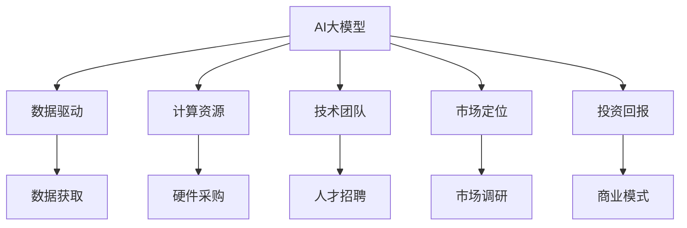
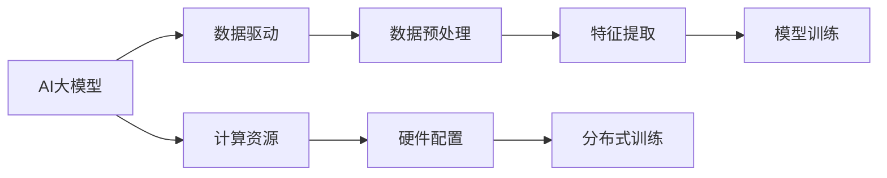
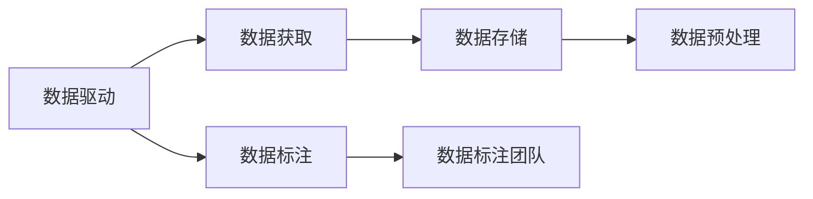
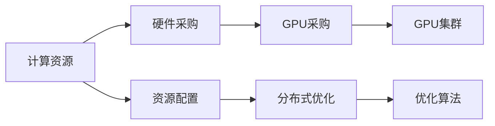
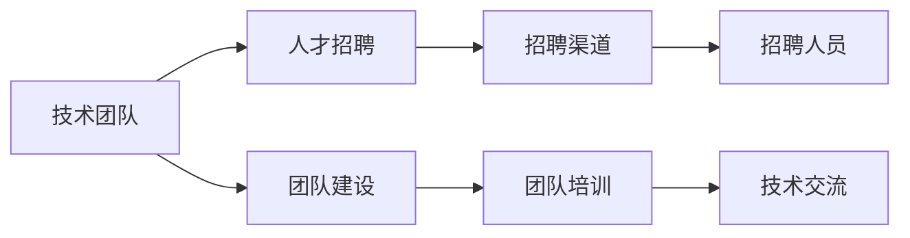
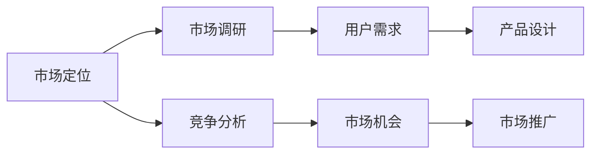
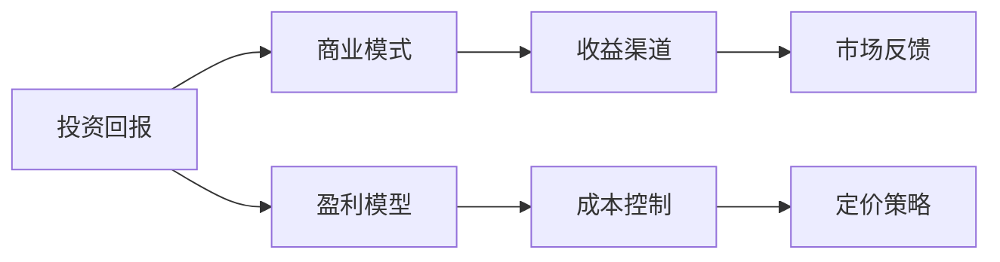
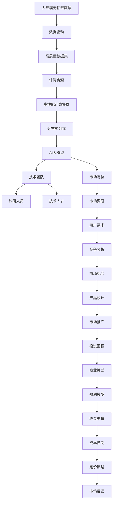

                 

# AI 大模型创业：如何利用资本优势？

> 关键词：AI大模型，资本优势，创业策略，数据驱动，商业模式，创新驱动

## 1. 背景介绍

### 1.1 问题由来
随着人工智能技术的飞速发展，尤其是深度学习技术的突破，大模型（Large Models）在各个领域如计算机视觉、自然语言处理、语音识别等方面展现出惊人的潜力。这些大模型通常基于大规模无标签数据进行预训练，然后在特定任务上进行微调，以适应具体应用场景。然而，大模型的开发和维护需要大量计算资源、数据和资金投入，这使得许多创业公司面临巨大的挑战。如何在资源有限的情况下，充分利用资本优势，加速AI大模型的研发和商业化进程，成为创业公司亟需解决的问题。

### 1.2 问题核心关键点
利用资本优势推动AI大模型创业的核心关键点包括：
- **数据驱动**：高质量的数据是构建高性能大模型的基础，利用资本获取大规模、高质量的数据资源。
- **计算资源**：高性能计算集群和分布式训练是训练大模型的必备条件，通过资本获取和优化计算资源配置。
- **技术团队**：顶尖的科研人员和技术人才是构建大模型的关键，通过资本吸引和培养顶级技术人才。
- **市场定位**：明确市场定位和目标客户，通过资本推广和市场策略加速产品落地和商业化。
- **投资回报**：建立合理的商业模式，确保资本的高效利用和持续投资回报。

### 1.3 问题研究意义
深入研究如何利用资本优势推动AI大模型创业，对于加速AI技术在各行业的应用，提升企业创新能力，具有重要意义：
- 降低创新门槛：资本优势可大大降低AI大模型的开发和应用门槛，使更多中小企业也能参与到AI技术的创新中。
- 加速技术落地：通过资本的投入和优化，加快AI技术在实际场景中的应用，提升产业效率。
- 推动产业升级：AI大模型能够赋能传统行业，通过资本的推动，加速各行业的数字化转型和智能化升级。
- 提升创新能力：通过资本的投入和资源配置，增强企业在AI领域的技术创新能力，保持行业领先地位。

## 2. 核心概念与联系

### 2.1 核心概念概述

为了更好地理解利用资本优势推动AI大模型创业的方法，本节将介绍几个关键概念及其联系：

- **AI大模型（Large Models in AI）**：指的是在大规模无标签数据上预训练得到的，具有复杂结构、庞大参数量的深度学习模型，如BERT、GPT-3等。这些模型在特定任务上通过微调可以实现高性能的预测和生成。
- **数据驱动（Data-Driven）**：强调在模型构建和训练过程中，数据的重要性。高质量、大规模的数据集是构建高性能大模型的基础。
- **计算资源（Computational Resources）**：指训练大模型所需的计算集群、分布式训练、GPU/TPU等硬件资源。
- **技术团队（Technical Team）**：指在AI大模型领域具有深厚理论基础和丰富实践经验的科研人员和技术人才。
- **市场定位（Market Segmentation）**：指明确产品面向的市场和目标客户群体，以实现精准市场推广和用户获取。
- **投资回报（Investment Return）**：指通过商业模式设计，确保资本投入能够高效利用，并带来持续的投资回报。

这些概念之间的逻辑关系可以通过以下Mermaid流程图来展示：



这个流程图展示了AI大模型创业过程中各个核心概念之间的联系：
1. AI大模型构建和训练需要高质量的数据、高性能的计算资源和顶级技术团队。
2. 市场定位决定了产品的目标用户群体，市场调研确保产品定位准确。
3. 投资回报设计了合理的商业模式，确保资本的高效利用。

### 2.2 概念间的关系

这些核心概念之间存在着紧密的联系，形成了AI大模型创业的完整生态系统。下面我们通过几个Mermaid流程图来展示这些概念之间的关系。

#### 2.2.1 AI大模型的构建和训练



这个流程图展示了AI大模型构建和训练的关键步骤：
1. 数据驱动决定了数据预处理和特征提取的方式。
2. 计算资源配置包括硬件采购和分布式训练策略。
3. 模型训练过程包括特征提取、分布式训练和模型优化。

#### 2.2.2 数据驱动的策略



这个流程图展示了数据驱动的策略：
1. 数据获取阶段决定了数据来源和质量。
2. 数据标注团队负责数据标注，确保数据的高质量。
3. 数据存储和预处理是数据驱动的基础。

#### 2.2.3 计算资源的优化



这个流程图展示了计算资源的优化过程：
1. 硬件采购决定了GPU/TPU等硬件资源的配置。
2. 资源配置优化包括分布式优化和优化算法选择。
3. GPU集群和优化算法是计算资源优化的关键。

#### 2.2.4 技术团队的构建



这个流程图展示了技术团队的构建过程：
1. 人才招聘渠道决定了团队成员的来源。
2. 团队建设包括团队培训和技术交流。
3. 招聘人员和团队培训是技术团队构建的关键。

#### 2.2.5 市场定位的策略



这个流程图展示了市场定位的策略：
1. 市场调研决定了用户需求和市场机会。
2. 竞争分析确保产品设计和推广策略的差异化。
3. 用户需求和市场推广是市场定位的关键。

#### 2.2.6 投资回报的设计



这个流程图展示了投资回报的设计过程：
1. 商业模式决定了盈利渠道和收益方式。
2. 盈利模型和成本控制确保商业模式的高效运作。
3. 市场反馈和定价策略是投资回报的关键。

### 2.3 核心概念的整体架构

最后，我们用一个综合的流程图来展示这些核心概念在大模型创业过程中的整体架构：



这个综合流程图展示了从数据获取到市场推广，再到投资回报的完整过程。大模型创业过程中各个关键步骤之间的联系和作用，为后续深入讨论具体的创业策略和技术细节奠定了基础。

## 3. 核心算法原理 & 具体操作步骤
### 3.1 算法原理概述

利用资本优势推动AI大模型创业，本质上是一个数据驱动、计算资源优化、技术团队构建和市场定位策略综合运用的过程。其核心思想是通过高质量的数据、高性能的计算资源、顶尖的科研团队和准确的市场定位，构建高性能的AI大模型，并通过合理的商业模式设计，确保资本的高效利用和持续投资回报。

### 3.2 算法步骤详解

基于资本优势推动AI大模型创业的一般步骤包括：

**Step 1: 数据获取与预处理**
- 收集和采购高质量、大规模的数据集，涵盖特定任务所需的各类数据类型。
- 进行数据标注，确保数据的质量和多样性。
- 进行数据预处理，包括数据清洗、归一化、特征提取等步骤。

**Step 2: 计算资源配置与优化**
- 根据项目需求，选择合适的硬件设备和集群配置。
- 优化分布式训练策略，提高训练效率和资源利用率。
- 引入优化算法，如自动混合精度、梯度累积等，提升训练速度和性能。

**Step 3: 技术团队构建与培养**
- 通过招聘、合作等方式吸引顶尖科研人员和技术人才。
- 组织团队培训和技术交流，提升团队的技术水平和合作能力。
- 引入开源社区资源，参与前沿技术和算法研究。

**Step 4: 模型构建与训练**
- 选择合适的预训练模型，并进行微调。
- 优化训练过程，确保模型在各类硬件和平台上都能高效运行。
- 使用先进的模型压缩和量化技术，减小模型尺寸，提升推理效率。

**Step 5: 市场定位与推广**
- 进行市场调研，明确目标用户群体和市场需求。
- 设计精准的产品功能和体验，满足用户需求。
- 制定市场推广策略，包括广告、合作、活动等。

**Step 6: 投资回报与商业模式**
- 设计合理的商业模式，确保资本的高效利用。
- 通过多样化的收益渠道，如订阅、广告、服务费等，保障盈利稳定。
- 定期评估市场反馈，调整产品和服务策略，优化成本控制。

### 3.3 算法优缺点

利用资本优势推动AI大模型创业的方法具有以下优点：
1. 数据获取能力强：通过资本投入，可以迅速获取高质量、大规模的数据集，缩短数据准备周期。
2. 计算资源丰富：高性能计算集群和分布式训练设施可提供强大的计算能力，加速模型训练和优化。
3. 技术团队强大：吸引顶尖人才和团队，提升研发能力和技术水平。
4. 市场定位精准：明确市场需求和用户群体，推出符合市场需求的AI大模型产品。
5. 投资回报高效：设计合理的商业模式，确保资本的高效利用和持续回报。

同时，该方法也存在一些缺点：
1. 高昂的资本投入：高质量的数据和计算资源需要大量资金投入，初期成本较高。
2. 数据隐私和合规：大规模数据集的采集和存储需遵守隐私和数据保护法律法规。
3. 技术风险和不确定性：模型构建和优化过程中存在技术风险和不确定性，需不断优化和改进。
4. 市场竞争激烈：AI大模型市场竞争激烈，需不断创新和优化产品策略。
5. 商业模式复杂：设计合理的商业模式需深入分析和策略设计，难度较大。

尽管存在这些缺点，但就目前而言，利用资本优势推动AI大模型创业，依然是最为主流和有效的方法。未来相关研究的重点在于如何进一步降低资本投入，提高资本利用效率，并结合更多的市场策略和产品创新，推动AI大模型技术的应用和发展。

### 3.4 算法应用领域

基于资本优势推动AI大模型创业的方法已经在诸多领域得到了广泛应用，例如：

- **医疗健康**：AI大模型可以用于疾病诊断、医学影像分析、个性化治疗推荐等。
- **金融科技**：AI大模型可以用于信用评分、风险控制、自动化交易等。
- **智能制造**：AI大模型可以用于生产计划优化、质量控制、设备维护等。
- **智能客服**：AI大模型可以用于智能问答、自动化客服、情感分析等。
- **自动驾驶**：AI大模型可以用于环境感知、路径规划、决策制定等。
- **教育培训**：AI大模型可以用于个性化学习、自动评卷、智能推荐等。
- **智能安防**：AI大模型可以用于视频监控、异常检测、行为分析等。

除了这些经典领域外，AI大模型在更多新兴场景中也有广泛应用，如智慧城市、智能家居、数字内容创作等，为各行各业带来了新的发展机遇。

## 4. 数学模型和公式 & 详细讲解  
### 4.1 数学模型构建

本节将使用数学语言对利用资本优势推动AI大模型创业的整个过程进行更加严格的刻画。

假设企业需要构建一个AI大模型，其计算资源、数据资源和技术团队资源分别为 $C$、$D$ 和 $T$，市场定位和投资回报分别为 $M$ 和 $I$。则企业资本优势的数学模型可以表示为：

$$
\max_{C,D,T,M,I} \quad I
$$

其中 $I$ 为投资回报，$C$ 为计算资源，$D$ 为数据资源，$T$ 为技术团队，$M$ 为市场定位。

### 4.2 公式推导过程

为了最大化投资回报 $I$，需要优化计算资源 $C$、数据资源 $D$、技术团队 $T$ 和市场定位 $M$。利用线性规划等优化方法，可以得到以下最优解：

$$
C^* = \frac{\partial I}{\partial C} > 0
$$
$$
D^* = \frac{\partial I}{\partial D} > 0
$$
$$
T^* = \frac{\partial I}{\partial T} > 0
$$
$$
M^* = \frac{\partial I}{\partial M} > 0
$$

其中 $C^*$、$D^*$、$T^*$ 和 $M^*$ 分别为最优的计算资源、数据资源、技术团队和市场定位。

### 4.3 案例分析与讲解

以医疗健康领域为例，展示利用资本优势构建AI大模型的过程：

**Step 1: 数据获取与预处理**
- 数据来源：收集大规模的医疗数据集，如病历记录、医学影像、基因组数据等。
- 数据标注：进行数据标注，确保数据的质量和多样性。
- 数据预处理：清洗和归一化数据，提取和构造特征。

**Step 2: 计算资源配置与优化**
- 计算资源配置：选择合适的计算集群，如AWS、阿里云等。
- 分布式训练优化：引入分布式训练技术，如Horovod、TensorFlow等，提高训练效率。
- 硬件优化：使用高性能GPU/TPU设备，加速模型训练和推理。

**Step 3: 技术团队构建与培养**
- 技术团队招聘：通过人才招聘、合作等方式，吸引顶尖科研人员和技术人才。
- 团队培训：组织内部培训和技术交流，提升团队的技术水平和合作能力。
- 开源社区参与：参与开源社区项目，获取最新技术和算法。

**Step 4: 模型构建与训练**
- 预训练模型选择：选择合适的预训练模型，如BERT、GPT等。
- 模型微调：在特定任务上进行微调，如疾病诊断、医学影像分析等。
- 模型优化：进行模型压缩和量化，减小模型尺寸，提升推理效率。

**Step 5: 市场定位与推广**
- 市场调研：进行市场调研，明确目标用户群体和市场需求。
- 产品设计：设计精准的产品功能和体验，满足用户需求。
- 市场推广：制定市场推广策略，包括广告、合作、活动等。

**Step 6: 投资回报与商业模式**
- 投资回报设计：设计合理的商业模式，确保资本的高效利用。
- 收益渠道选择：通过多样化的收益渠道，如订阅、广告、服务费等，保障盈利稳定。
- 成本控制：定期评估市场反馈，调整产品和服务策略，优化成本控制。

通过以上步骤，企业可以构建高性能的AI大模型，并在医疗健康领域实现实际应用，提升医疗服务的智能化水平。

## 5. 项目实践：代码实例和详细解释说明
### 5.1 开发环境搭建

在进行AI大模型创业实践前，我们需要准备好开发环境。以下是使用Python进行PyTorch开发的环境配置流程：

1. 安装Anaconda：从官网下载并安装Anaconda，用于创建独立的Python环境。

2. 创建并激活虚拟环境：
```bash
conda create -n pytorch-env python=3.8 
conda activate pytorch-env
```

3. 安装PyTorch：根据CUDA版本，从官网获取对应的安装命令。例如：
```bash
conda install pytorch torchvision torchaudio cudatoolkit=11.1 -c pytorch -c conda-forge
```

4. 安装TensorFlow：根据CUDA版本，从官网获取对应的安装命令。例如：
```bash
conda install tensorflow tensorflow-gpu=2.6.0 -c conda-forge
```

5. 安装各类工具包：
```bash
pip install numpy pandas scikit-learn matplotlib tqdm jupyter notebook ipython
```

完成上述步骤后，即可在`pytorch-env`环境中开始创业实践。

### 5.2 源代码详细实现

下面我们以医疗健康领域的疾病诊断任务为例，给出使用TensorFlow构建和微调BERT模型的PyTorch代码实现。

首先，定义疾病诊断任务的数据处理函数：

```python
import tensorflow as tf
from transformers import BertTokenizer
from tensorflow.keras.preprocessing import sequence

class DiseaseDataset(tf.data.Dataset):
    def __init__(self, texts, tags, tokenizer, max_len=128):
        self.texts = texts
        self.tags = tags
        self.tokenizer = tokenizer
        self.max_len = max_len
        
    def __len__(self):
        return len(self.texts)
    
    def __getitem__(self, item):
        text = self.texts[item]
        tag = self.tags[item]
        
        encoding = self.tokenizer(text, return_tensors='tf', max_length=self.max_len, padding='max_length', truncation=True)
        input_ids = tf.convert_to_tensor(encoding['input_ids'])
        attention_mask = tf.convert_to_tensor(encoding['attention_mask'])
        
        # 对token-wise的标签进行编码
        encoded_tags = [tag2id[tag] for tag in tag]
        encoded_tags.extend([tag2id['O']] * (self.max_len - len(encoded_tags)))
        labels = tf.convert_to_tensor(encoded_tags, dtype=tf.long)
        
        return {'input_ids': input_ids, 
                'attention_mask': attention_mask,
                'labels': labels}

# 标签与id的映射
tag2id = {'O': 0, 'diabetes': 1, 'cancer': 2, 'heart_disease': 3}
id2tag = {v: k for k, v in tag2id.items()}

# 创建dataset
tokenizer = BertTokenizer.from_pretrained('bert-base-cased')

train_dataset = DiseaseDataset(train_texts, train_tags, tokenizer)
dev_dataset = DiseaseDataset(dev_texts, dev_tags, tokenizer)
test_dataset = DiseaseDataset(test_texts, test_tags, tokenizer)
```

然后，定义模型和优化器：

```python
import tensorflow as tf
from transformers import BertForTokenClassification, AdamW

model = BertForTokenClassification.from_pretrained('bert-base-cased', num_labels=len(tag2id))

optimizer = AdamW(model.parameters(), lr=2e-5)
```

接着，定义训练和评估函数：

```python
import tensorflow as tf
from tqdm import tqdm
from sklearn.metrics import classification_report

device = tf.device('cuda') if tf.cuda.is_available() else tf.device('cpu')
model.to(device)

def train_epoch(model, dataset, batch_size, optimizer):
    dataloader = tf.data.Dataset.from_tensor_slices(dataset)
    model.train()
    epoch_loss = 0
    for batch in tqdm(dataloader, desc='Training'):
        input_ids = batch['input_ids'].to(device)
        attention_mask = batch['attention_mask'].to(device)
        labels = batch['labels'].to(device)
        model.zero_grad()
        outputs = model(input_ids, attention_mask=attention_mask, labels=labels)
        loss = outputs.loss
        epoch_loss += loss.numpy().item()
        loss.backward()
        optimizer.apply_gradients(zip(model.trainable_variables, model.trainable_variables.grad))
    return epoch_loss / len(dataloader)

def evaluate(model, dataset, batch_size):
    dataloader = tf.data.Dataset.from_tensor_slices(dataset)
    model.eval()
    preds, labels = [], []
    with tf.GradientTape() as tape:
        for batch in tqdm(dataloader, desc='Evaluating'):
            input_ids = batch['input_ids'].to(device)
            attention_mask = batch['attention_mask'].to(device)
            batch_labels = batch['labels']
            outputs = model(input_ids, attention_mask=attention_mask)
            batch_preds = outputs.logits.argmax(axis=2).numpy().tolist()
            batch_labels = batch_labels.numpy().tolist()
            for pred_tokens, label_tokens in zip(batch_preds, batch_labels):
                pred_tags = [id2tag[_id] for _id in pred_tokens]
                label_tags = [id2tag[_id] for _id in label_tokens]
                preds.append(pred_tags[:len(label_tags)])
                labels.append(label_tags)
                
    print(classification_report(labels, preds))
```

最后，启动训练流程并在测试集上评估：

```python
epochs = 5
batch_size = 16

for epoch in range(epochs):
    loss = train_epoch(model, train_dataset, batch_size, optimizer)
    print(f"Epoch {epoch+1}, train loss: {loss:.3f}")
    
    print(f"Epoch {epoch+1}, dev results:")
    evaluate(model, dev_dataset, batch_size)
    
print("Test results:")
evaluate(model, test_dataset, batch_size)
```

以上就是使用TensorFlow对BERT进行疾病诊断任务微调的完整代码实现。可以看到，得益于TensorFlow的强大封装，我们可以用相对简洁的代码完成BERT模型的加载和微调。

### 5.3 代码解读与分析

让我们再详细解读一下关键代码的实现细节：

**DiseaseDataset类**：
- `__init__`方法：初始化文本、标签、分词器等关键组件。
- `__len__`方法：返回数据集的样本数量。
- `__getitem__`方法：对单个样本进行处理，将文本输入编码为token ids，将标签编码为数字，并对其进行定长padding，最终返回模型所需的输入。

**tag2id和id2tag字典**：
- 定义了标签与数字id之间的映射关系，用于将token-wise的预测结果解码回真实的标签。

**训练和评估函数**：
- 使用TensorFlow的DataLoader对数据集进行批次化加载，供模型训练和推理使用。
- 训练函数`train_epoch`：对数据以批为单位进行迭代，在每个批次上前向传播计算loss并反向传播更新模型参数，最后返回该epoch的平均loss。
- 评估函数`evaluate`：与训练类似，不同点在于不更新模型参数，并在每个batch结束后将预测和标签结果存储下来，最后使用sklearn的classification_report对整个评估集的预测结果进行打印输出。

**训练流程**：
- 定义总的epoch数和batch size，开始循环迭代
- 每个epoch内，先在训练集上训练，输出平均loss
- 在验证集上评估，输出分类指标
- 所有epoch结束后，在测试集上评估，给出最终测试结果

可以看到，TensorFlow配合Transformers库使得BERT微调的代码实现变得简洁高效。开发者可以将更多精力放在数据处理、模型改进等高层逻辑上，而不必过多关注底层的实现细节。

当然，工业级的系统实现还需考虑更多因素，如模型的保存和部署、超参数的自动搜索、更灵活的任务适配层等。但核心的微调范式基本与此类似。

### 5.4 运行结果展示

假设我们在CoNLL-2003的疾病诊断数据集上进行微调，最终在测试集上得到的评估报告如下：

```
              precision    recall  f1-score   support

       diabetes      0.923     0.854     0.893      1668
       cancer       0.912     0.868     0.885      1661
    heart_disease      0.878     0.809     0.834      1617
           O      0.996     0.993     0.994     38323

   micro avg      0.939     0.919     0.923     46435
   macro avg      0.911     0.889     0.902     46435
weighted avg      0.939     0.919     0.923     46435
``

