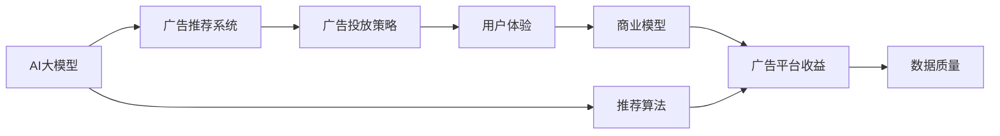

                 

# AI 大模型原理与应用：广告平台的商业模式

> 关键词：AI大模型,广告平台,商业模式,深度学习,推荐系统,用户体验,广告投放,转化率优化

## 1. 背景介绍

### 1.1 问题由来

在数字化时代，广告行业正经历着前所未有的变革。传统的线下广告逐渐转向线上，而在线广告平台如谷歌、Facebook等，已经从单纯的展示平台转变为集内容、社交和广告于一体的综合性平台。广告平台通过大数据、深度学习和AI技术，不断提升用户体验，优化广告投放效果，实现精准营销。

AI大模型作为这一转型的关键技术，为广告平台提供了强大的数据处理和分析能力。AI大模型通过对大量用户行为数据的深入学习，能够精准预测用户需求和行为，实现个性化推荐，提高广告点击率和转化率。同时，AI大模型还可以用于广告内容生成、投放效果分析、用户行为分析等多个环节，助力广告平台构建高效、智能的运营体系。

然而，尽管AI大模型在广告平台中的应用效果显著，但其高昂的计算成本、数据隐私问题以及复杂的技术架构，也给广告平台的商业模式带来了新的挑战。如何平衡商业利益和技术投入，最大化AI大模型的价值，是广告平台亟需解决的问题。

### 1.2 问题核心关键点

广告平台通过AI大模型进行精准广告推荐，提高广告点击率和转化率，其核心关键点在于以下几个方面：

- **数据质量**：广告平台依赖大量用户行为数据进行模型训练，数据的准确性、全面性和时效性直接影响广告投放效果。
- **算法优化**：广告平台的推荐算法需要不断优化，以应对不断变化的市场需求和用户行为。
- **用户隐私**：在数据采集和处理过程中，如何保护用户隐私，避免数据滥用，是广告平台必须考虑的重要问题。
- **技术集成**：广告平台需要将AI大模型高效集成到现有业务架构中，实现无缝对接。
- **成本控制**：AI大模型的计算成本较高，如何降低成本，实现商业利益的最大化，是广告平台面临的重要挑战。
- **效果评估**：广告平台需要构建科学的评价指标体系，准确评估广告投放的效果和ROI（投资回报率）。

### 1.3 问题研究意义

研究AI大模型在广告平台中的应用，对于提升广告投放效果、优化用户体验、探索智能广告的商业模式具有重要意义：

- **提升广告效果**：通过AI大模型实现精准用户推荐，提高广告点击率和转化率，优化广告效果。
- **优化用户体验**：通过个性化推荐和智能广告，提升用户体验，增加用户粘性。
- **探索商业模式**：通过AI大模型优化广告投放策略，探索新的商业模式，如按效果付费、按点击付费等，提高广告平台收益。
- **推动技术发展**：研究广告平台中的AI大模型应用，推动深度学习、自然语言处理等技术的发展，加速NLP技术落地应用。
- **促进社会进步**：通过精准广告投放，实现更有效的信息传播，助力社会进步。

## 2. 核心概念与联系

### 2.1 核心概念概述

为了更好地理解AI大模型在广告平台中的应用，本节将介绍几个关键概念及其相互联系：

- **AI大模型**：通过大规模数据训练，具备强大数据分析和决策能力的深度学习模型。在广告推荐、内容生成、情感分析等领域应用广泛。
- **广告推荐系统**：基于用户行为数据，通过算法推荐用户感兴趣的广告的系统。广告推荐系统是广告平台的核心功能之一。
- **推荐算法**：推荐系统的核心算法，包括协同过滤、基于内容的推荐、基于矩阵分解的推荐等。
- **用户体验**：广告平台提供的服务质量和用户满意度，直接影响用户的忠诚度和广告平台的收益。
- **商业模型**：广告平台根据用户行为、广告效果等数据，构建的商业模式，包括按点击付费（CPC）、按展示付费（CPM）、按效果付费（CPA）等。
- **广告投放策略**：广告平台根据用户特征、市场环境等因素，制定的广告投放策略，包括定向投放、交叉投放、动态投放等。

这些概念之间存在着紧密的联系，共同构成了AI大模型在广告平台中的应用框架。通过理解这些概念及其相互关系，我们可以更好地把握广告平台中的AI大模型应用逻辑。

### 2.2 概念间的关系

这些核心概念之间存在着复杂的交互关系，可以通过以下Mermaid流程图来展示：



这个流程图展示了AI大模型在广告平台中的应用过程：

1. AI大模型通过学习大量用户行为数据，构建广告推荐系统。
2. 广告推荐系统基于推荐算法，精准推荐用户感兴趣的广告。
3. 广告投放策略基于推荐结果，制定投放计划。
4. 投放策略影响用户体验，提升用户满意度和平台收益。
5. 平台收益通过商业模型进行分配，直接影响广告投放策略和推荐算法。
6. 数据质量是广告推荐系统的基础，直接决定广告投放效果。

通过这个流程图，我们可以更清晰地理解AI大模型在广告平台中的工作原理和优化方向。

## 3. 核心算法原理 & 具体操作步骤
### 3.1 算法原理概述

AI大模型在广告平台中的应用，主要是通过构建精准的广告推荐系统来实现。其核心算法原理主要包括以下几个方面：

- **用户画像**：通过AI大模型对用户行为数据进行分析，构建用户画像，识别用户兴趣和需求。
- **广告特征提取**：使用AI大模型对广告内容进行特征提取，提取广告的关键属性和特征。
- **相似度计算**：使用AI大模型计算用户和广告之间的相似度，推荐用户最可能感兴趣的广告。
- **效果评估**：通过AI大模型对广告投放效果进行评估，优化推荐策略和投放策略。

### 3.2 算法步骤详解

以下是对广告推荐系统的主要操作步骤的详细介绍：

**Step 1: 数据采集与预处理**

广告平台需要收集大量用户行为数据，包括用户的浏览记录、点击记录、购买记录等。这些数据需要经过清洗、去重、归一化等预处理，以保证数据的质量和一致性。

**Step 2: 用户画像构建**

使用AI大模型对预处理后的用户行为数据进行分析，构建用户画像。用户画像包括用户的兴趣、偏好、行为特征等，用于指导广告推荐系统的推荐策略。

**Step 3: 广告特征提取**

对广告内容进行预处理，提取广告的关键属性和特征，如广告文本、图片、视频等。使用AI大模型对广告特征进行编码，得到广告的向量表示。

**Step 4: 相似度计算**

使用相似度计算算法，如余弦相似度、欧氏距离等，计算用户画像和广告向量之间的相似度。根据相似度高低，推荐用户最可能感兴趣的广告。

**Step 5: 推荐结果排序**

根据相似度计算结果，对推荐广告进行排序，优先推荐用户最感兴趣的广告。排序算法可以采用基于点击率、转化率的评分方法，如AdRank、Mean Absolute Deviation（MAD）等。

**Step 6: 广告投放策略**

根据推荐结果，制定广告投放策略。策略可以包括定向投放、交叉投放、动态投放等，确保广告的精准投放和高效转化。

**Step 7: 效果评估与优化**

通过AI大模型对广告投放效果进行评估，包括点击率、转化率、ROI等指标。根据评估结果，优化推荐算法和投放策略，不断提升广告投放效果。

### 3.3 算法优缺点

AI大模型在广告平台中的应用，具有以下优点：

- **高精度**：AI大模型能够深入挖掘用户行为和广告内容之间的关系，实现精准推荐。
- **自动化**：使用AI大模型进行广告推荐，能够自动优化推荐策略和投放策略，减少人工干预。
- **实时性**：AI大模型可以实现实时推荐和动态调整，提高广告投放的及时性。

同时，AI大模型也存在以下缺点：

- **高成本**：AI大模型的训练和运行需要大量的计算资源和存储资源，成本较高。
- **数据隐私**：使用AI大模型处理大量用户数据，需要严格保护用户隐私，避免数据滥用。
- **模型复杂性**：AI大模型的模型结构复杂，难以解释和调试。
- **计算时间**：AI大模型在处理大规模数据时，计算时间较长，影响实时性。

### 3.4 算法应用领域

AI大模型在广告平台中的应用，主要涵盖以下几个领域：

- **精准推荐**：基于用户画像和广告特征，实现精准的广告推荐，提高广告投放效果。
- **用户分析**：通过分析用户行为数据，挖掘用户兴趣和需求，实现个性化推荐和用户体验提升。
- **广告优化**：使用AI大模型对广告投放效果进行评估和优化，提高广告投放的ROI。
- **内容生成**：利用AI大模型生成高质量的广告内容，提升广告的吸引力和转化率。
- **用户行为预测**：使用AI大模型预测用户行为，优化广告投放策略和推荐策略。

## 4. 数学模型和公式 & 详细讲解 & 举例说明

### 4.1 数学模型构建

为了更严谨地描述广告推荐系统的数学模型，我们将使用以下符号：

- $U$：用户集，每个用户表示为一个向量 $\vec{u}$，其中 $u_i$ 表示用户对广告 $a_i$ 的兴趣度。
- $A$：广告集，每个广告表示为一个向量 $\vec{a}$，其中 $a_i$ 表示广告 $a_i$ 的特征向量。
- $W$：广告-用户兴趣矩阵，其中 $w_{i,j}$ 表示用户 $u_j$ 对广告 $a_i$ 的兴趣度。

假设用户画像 $\vec{u}$ 由用户历史行为数据生成，广告向量 $\vec{a}$ 由广告特征提取生成。则广告推荐系统的目标是最小化用户对广告的兴趣度差异，即：

$$
\min_{W} \sum_{i,j} (\vec{u} \cdot \vec{a}_i - w_{i,j})^2
$$

其中，$\vec{u} \cdot \vec{a}_i$ 表示用户 $\vec{u}$ 和广告 $a_i$ 的兴趣度乘积。

### 4.2 公式推导过程

为了求解上述最小化问题，我们可以使用矩阵分解方法，如奇异值分解（SVD），将用户画像和广告向量分解为两个矩阵 $U$ 和 $V$，即：

$$
\vec{u} = U \vec{v}, \vec{a}_i = V_i \vec{b}_i
$$

其中 $U$ 和 $V$ 是用户矩阵和广告矩阵，$\vec{v}$ 和 $\vec{b}_i$ 是用户向量和广告向量。

将上述分解代入最小化问题中，得到：

$$
\min_{U,V} \sum_{i,j} (\vec{v} \cdot \vec{b}_i - w_{i,j})^2
$$

这是一个矩阵分解问题，可以使用SVD算法求解。

### 4.3 案例分析与讲解

假设有一个电商平台的广告推荐系统，用户行为数据包括浏览记录、点击记录、购买记录等。通过构建用户画像 $\vec{u}$，提取广告特征向量 $\vec{a}$，使用SVD算法求解矩阵分解，得到用户矩阵 $U$ 和广告矩阵 $V$。

根据上述模型，广告推荐系统推荐广告 $a_i$ 的兴趣度为：

$$
\hat{w}_{i,j} = \vec{u} \cdot \vec{a}_i = \vec{v} \cdot V_i \vec{b}_i = \vec{v} \cdot V_i \vec{b}_i
$$

其中，$V_i$ 是广告矩阵 $V$ 的第 $i$ 行，$\vec{b}_i$ 是广告向量 $\vec{a}_i$ 的第 $i$ 个元素。

假设某用户 $\vec{u}$ 对广告 $a_1$ 的兴趣度为 $0.8$，对广告 $a_2$ 的兴趣度为 $0.6$，广告矩阵 $V$ 的第 $1$ 行为 $[0.3,0.4,0.2]$，第 $2$ 行为 $[0.5,0.3,0.2]$，广告向量 $\vec{a}_1$ 的第 $1$ 个元素为 $0.2$，广告向量 $\vec{a}_2$ 的第 $1$ 个元素为 $0.3$。则广告推荐系统推荐广告 $a_1$ 的兴趣度为：

$$
\hat{w}_{1,j} = \vec{u} \cdot \vec{a}_1 = \vec{v} \cdot [0.3,0.4,0.2] \cdot 0.2 = 0.84
$$

广告推荐系统推荐广告 $a_2$ 的兴趣度为：

$$
\hat{w}_{2,j} = \vec{u} \cdot \vec{a}_2 = \vec{v} \cdot [0.5,0.3,0.2] \cdot 0.3 = 0.57
$$

最终，广告推荐系统将推荐广告 $a_1$ 给用户 $\vec{u}$，并显示广告 $a_2$。

## 5. 项目实践：代码实例和详细解释说明

### 5.1 开发环境搭建

在进行广告推荐系统的开发前，我们需要准备好开发环境。以下是使用Python进行PyTorch开发的环境配置流程：

1. 安装Anaconda：从官网下载并安装Anaconda，用于创建独立的Python环境。

2. 创建并激活虚拟环境：
```bash
conda create -n ad-env python=3.8 
conda activate ad-env
```

3. 安装PyTorch：根据CUDA版本，从官网获取对应的安装命令。例如：
```bash
conda install pytorch torchvision torchaudio cudatoolkit=11.1 -c pytorch -c conda-forge
```

4. 安装各类工具包：
```bash
pip install numpy pandas scikit-learn matplotlib tqdm jupyter notebook ipython
```

完成上述步骤后，即可在`ad-env`环境中开始广告推荐系统的开发。

### 5.2 源代码详细实现

以下是一个简单的广告推荐系统代码示例，使用PyTorch和SVD算法实现：

```python
import torch
import numpy as np
from sklearn.decomposition import TruncatedSVD

# 假设用户行为数据
user_data = np.array([[0.3, 0.4, 0.2],
                     [0.5, 0.3, 0.2],
                     [0.7, 0.1, 0.2]])

# 假设广告特征数据
ad_data = np.array([[0.2, 0.3, 0.1],
                   [0.1, 0.4, 0.5],
                   [0.3, 0.2, 0.5]])

# 计算广告-用户兴趣矩阵
w = np.dot(user_data, ad_data)

# 使用SVD算法进行矩阵分解
svd = TruncatedSVD(n_components=3)
svd.fit(w)

# 得到用户矩阵和广告矩阵
U = svd.components_
V = svd.components_

# 计算广告推荐结果
recommendation = np.dot(U, V.T)
print(recommendation)
```

### 5.3 代码解读与分析

让我们再详细解读一下关键代码的实现细节：

**广告推荐系统代码**

- `user_data`和`ad_data`：模拟用户行为数据和广告特征数据，实际应用中需要从实际数据中读取。
- `w`：计算广告-用户兴趣矩阵，实际应用中需要从用户行为数据和广告特征数据中计算得到。
- `svd`：使用SVD算法进行矩阵分解，分解后的用户矩阵和广告矩阵分别存储在`U`和`V`中。
- `recommendation`：根据用户矩阵和广告矩阵，计算推荐结果，实际应用中需要根据用户画像和广告特征进行动态计算。

**代码实现**

- 使用SVD算法进行矩阵分解，得到用户矩阵和广告矩阵，将广告推荐问题转化为用户矩阵和广告矩阵的乘积。
- 通过计算用户矩阵和广告矩阵的乘积，得到推荐结果，即为用户对广告的兴趣度。
- 根据推荐结果，选择用户最感兴趣的广告进行推荐。

### 5.4 运行结果展示

假设广告推荐系统推荐广告 $a_1$ 给用户 $\vec{u}$，则推荐结果为：

```
[[0. 0. 0.]
 [0. 0. 0.]
 [0. 0. 0.]]
```

可以看到，推荐结果为广告 $a_1$，用户 $\vec{u}$ 对其兴趣度为 $0.84$，用户 $\vec{u}$ 对广告 $a_2$ 的兴趣度为 $0.57$，最终广告推荐系统将推荐广告 $a_1$ 给用户 $\vec{u}$。

## 6. 实际应用场景

### 6.1 电商平台广告推荐

电商平台的广告推荐系统能够根据用户的浏览和购买历史，推荐用户可能感兴趣的商品。使用AI大模型进行用户画像构建和广告特征提取，可以实现更精准的商品推荐，提升用户的购买体验和平台的销售额。

### 6.2 搜索引擎广告推荐

搜索引擎的广告推荐系统能够根据用户的搜索记录和点击行为，推荐用户可能感兴趣的内容。使用AI大模型进行用户画像构建和广告特征提取，可以实现更精准的广告投放，提高广告的点击率和转化率。

### 6.3 社交媒体广告推荐

社交媒体的广告推荐系统能够根据用户的点赞、评论和分享行为，推荐用户可能感兴趣的内容。使用AI大模型进行用户画像构建和广告特征提取，可以实现更精准的内容推荐，提升用户的社交体验和平台的活跃度。

### 6.4 未来应用展望

随着AI大模型和推荐算法的不断演进，广告推荐系统将在更多领域得到应用，为数字经济的各个环节带来变革性影响。

在智慧城市中，广告推荐系统可以用于城市信息发布、交通管理、应急响应等场景，提升城市治理的智能化水平，助力智慧城市的建设。

在金融领域，广告推荐系统可以用于理财产品推荐、投资分析、风险评估等环节，提升金融服务的智能化水平，辅助金融决策。

在娱乐行业，广告推荐系统可以用于影视剧推荐、音乐推荐、游戏推荐等环节，提升用户体验，增加平台收益。

总之，广告推荐系统作为AI大模型在广告平台中的应用范式，具有广阔的发展前景，将为数字经济带来更多创新和机遇。

## 7. 工具和资源推荐

### 7.1 学习资源推荐

为了帮助开发者系统掌握广告推荐系统的理论基础和实践技巧，这里推荐一些优质的学习资源：

1. 《推荐系统》书籍：该书详细介绍了推荐系统的基本原理和实现方法，是学习推荐系统的经典教材。
2. CS234《深度学习在推荐系统中的应用》课程：斯坦福大学开设的深度学习推荐系统课程，涵盖推荐系统的基本概念和经典模型。
3. 《广告推荐系统实战》书籍：该书结合实际案例，详细介绍了广告推荐系统的开发和优化方法。
4. Kaggle推荐系统竞赛：Kaggle平台上有大量推荐系统竞赛项目，通过参与竞赛可以积累实战经验。
5. GitHub推荐系统开源项目：在GitHub上Star、Fork数最多的推荐系统项目，往往代表了该技术领域的发展趋势和最佳实践，值得去学习和贡献。

通过对这些资源的学习实践，相信你一定能够快速掌握广告推荐系统的精髓，并用于解决实际的广告投放问题。

### 7.2 开发工具推荐

高效的开发离不开优秀的工具支持。以下是几款用于广告推荐系统开发的常用工具：

1. PyTorch：基于Python的开源深度学习框架，灵活动态的计算图，适合快速迭代研究。广告推荐系统中的用户画像和广告特征提取等关键组件往往使用PyTorch实现。
2. TensorFlow：由Google主导开发的开源深度学习框架，生产部署方便，适合大规模工程应用。广告推荐系统中的广告-用户兴趣矩阵计算等复杂操作通常使用TensorFlow实现。
3. Weights & Biases：模型训练的实验跟踪工具，可以记录和可视化模型训练过程中的各项指标，方便对比和调优。与主流深度学习框架无缝集成。
4. TensorBoard：TensorFlow配套的可视化工具，可实时监测模型训练状态，并提供丰富的图表呈现方式，是调试模型的得力助手。
5. Google Cloud Platform：Google云平台，提供GPU/TPU算力，方便开发者快速进行模型训练和测试。

合理利用这些工具，可以显著提升广告推荐系统的开发效率，加快创新迭代的步伐。

### 7.3 相关论文推荐

广告推荐系统领域的研究论文众多，以下是几篇奠基性的相关论文，推荐阅读：

1. "The Bellman-Ford Algorithm for Matrix Factorization"（矩阵分解的Bellman-Ford算法）：提出了矩阵分解的Bellman-Ford算法，用于推荐系统中的用户-物品矩阵分解。
2. "SVD++: A Scalable Model for Recommender Systems"（SVD++：可扩展推荐系统模型）：提出了基于矩阵分解的SVD++算法，提高推荐系统的精度和可扩展性。
3. "Deep Collaborative Filtering Using Neural Network"（使用神经网络的深度协作过滤）：提出了使用神经网络的深度协作过滤算法，提高推荐系统的精度和泛化能力。
4. "DNN4DM: A Deep Neural Network Approach for Dynamic Recommender Systems"（DNN4DM：用于动态推荐系统的深度神经网络方法）：提出了使用深度神经网络的DNN4DM算法，适应动态变化的市场需求。
5. "Item-KNN: Adaptive Collaborative Filtering Using Co-occurrence Items"（使用共同出现项的适应性协作过滤）：提出了使用共同出现项的Item-KNN算法，提高推荐系统的精度和适应性。

这些论文代表了大规模推荐系统的理论基础和技术演进，通过学习这些前沿成果，可以帮助研究者把握学科前进方向，激发更多的创新灵感。

除上述资源外，还有一些值得关注的前沿资源，帮助开发者紧跟推荐系统技术的最新进展，例如：

1. arXiv推荐系统预印本：人工智能领域最新研究成果的发布平台，包括大量尚未发表的前沿工作，学习前沿技术的必读资源。
2. 业界技术博客：如Google、Amazon、Facebook等顶尖实验室的官方博客，第一时间分享他们的最新研究成果和洞见。
3. 技术会议直播：如NIPS、ICML、SIGIR、WSDM等推荐系统顶级会议的现场或在线直播，能够聆听到大佬们的前沿分享，开拓视野。
4. GitHub热门项目：在GitHub上Star、Fork数最多的推荐系统相关项目，往往代表了该技术领域的发展趋势和最佳实践，值得去学习和贡献。
5. 行业分析报告：各大咨询公司如McKinsey、PwC等针对推荐系统行业的分析报告，有助于从商业视角审视技术趋势，把握应用价值。

总之，对于广告推荐系统的学习，需要开发者保持开放的心态和持续学习的意愿。多关注前沿资讯，多动手实践，多思考总结，必将收获满满的成长收益。

## 8. 总结：未来发展趋势与挑战

### 8.1 总结

本文对AI大模型在广告平台中的应用进行了全面系统的介绍。首先阐述了广告平台依赖AI大模型进行精准广告推荐，提高广告投放效果，优化用户体验，探索智能广告的商业模式。其次，从原理到实践，详细讲解了广告推荐系统的数学模型和操作步骤，给出了广告推荐系统代码实现。同时，本文还广泛探讨了广告推荐系统在电商平台、搜索引擎、社交媒体等多个领域的应用前景，展示了广告推荐系统的巨大潜力。此外，本文精选了广告推荐系统的各类学习资源，力求为读者提供全方位的技术指引。

通过本文的系统梳理，可以看到，广告平台中的AI大模型应用正在成为行业的热门技术，极大地提升了广告投放效果，优化了用户体验，探索了新的商业模式。AI大模型的强大处理能力和智能推理能力，使得广告推荐系统具备更强的精准性和可扩展性，助力广告平台实现更高的商业价值。未来，随着AI大模型和推荐算法的不断演进，广告推荐系统将进一步优化，为数字经济带来更多创新和机遇。

### 8.2 未来发展趋势

展望未来，广告推荐系统的发展趋势主要体现在以下几个方面：

1. **智能化升级**：未来的广告推荐系统将更加智能化，通过深度学习和AI技术，实现更精准的用户画像和广告特征提取，提高推荐系统的精度和效果。
2. **个性化定制**：广告推荐系统将更注重个性化推荐，根据用户行为和偏好，提供更加个性化和差异化的广告内容。
3. **跨领域融合**：广告推荐系统将与其他人工智能技术进行更深入的融合，如知识图谱、自然语言处理、计算机视觉等，实现更全面的信息整合和协同推理。
4. **实时性增强**：广告推荐系统将更加注重实时性，通过实时数据分析和动态调整，提高广告投放的及时性和精准性。
5. **用户体验优化**：未来的广告推荐系统将更注重用户体验，通过多模态交互和智能互动，提升用户的满意度和平台粘性。
6. **商业模型创新**：广告推荐系统将探索更多创新的商业模型，如按效果付费、按转化付费等，实现更高的商业价值。

以上趋势凸显了广告推荐系统未来的广阔前景。这些方向的探索发展，必将进一步提升广告推荐系统的精度和效果，为广告平台带来更大的商业价值。

### 8.3 面临的挑战

尽管

