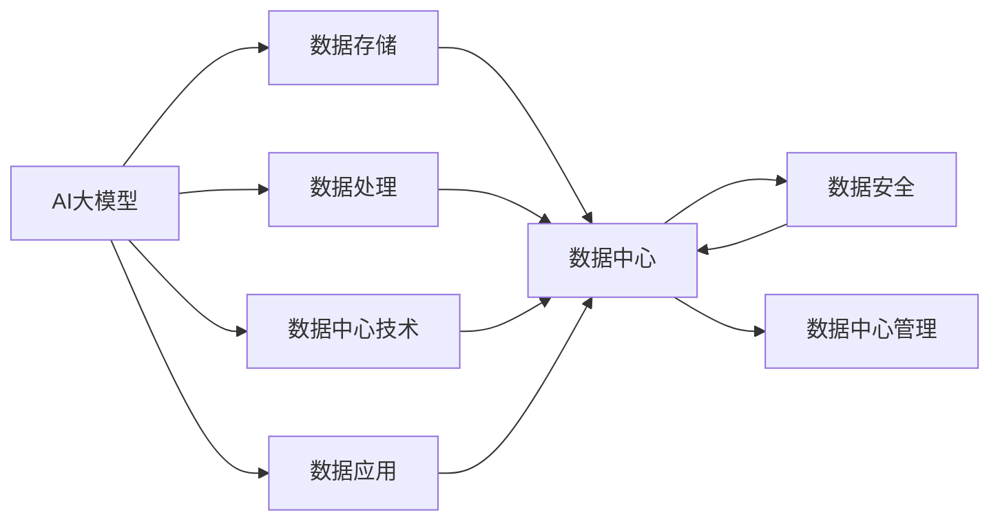
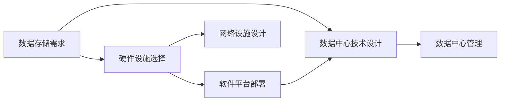
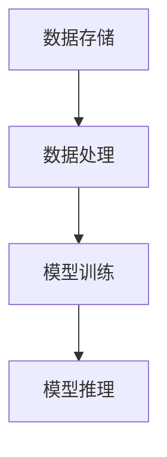
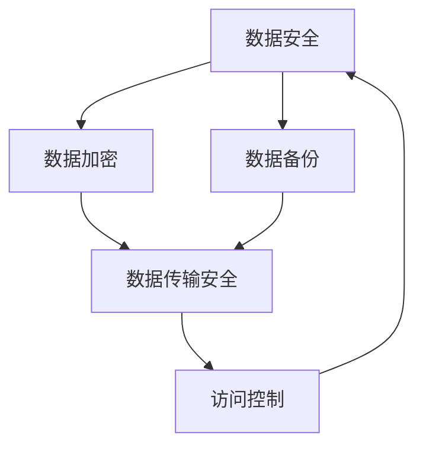
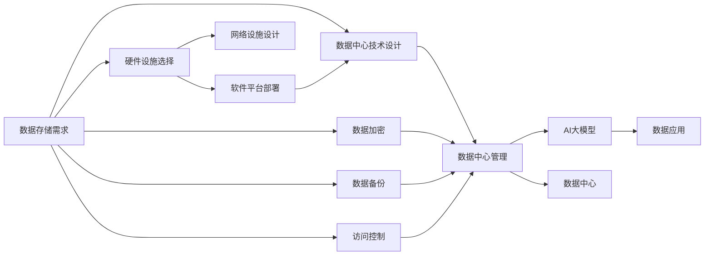

                 

# AI 大模型应用数据中心建设：数据中心技术与应用

> 关键词：AI大模型, 数据中心, 数据存储, 数据处理, 数据安全, 数据中心技术, 数据应用, 数据中心管理

## 1. 背景介绍

### 1.1 问题由来
随着人工智能(AI)和大模型技术的迅速发展，大数据中心在AI应用中变得越来越重要。AI大模型需要大量的数据存储和处理能力，以支持复杂的计算任务，从而实现高效的AI模型训练和推理。但是，传统的数据中心技术已经难以满足大模型的高需求，迫切需要引入新的数据中心技术来应对这一挑战。

### 1.2 问题核心关键点
大模型应用数据中心建设的核心在于构建一个能够支持海量数据存储、高效数据处理和保障数据安全的高性能数据中心。它要求在硬件设施、软件平台和运维管理等方面进行全面优化。

### 1.3 问题研究意义
构建高效、安全、可扩展的大模型应用数据中心，对于推动AI技术的发展和落地应用具有重要意义：

1. 提升AI模型性能：通过高效的数据存储和处理，大模型可以在更短的时间内进行训练和推理，从而提升模型性能。
2. 保障数据安全：确保数据隐私和安全，防止数据泄露和滥用，保障用户信任。
3. 增强算力扩展能力：数据中心可以支持多台服务器协同工作，增强算力扩展能力，满足大规模模型和任务的需求。
4. 降低AI应用成本：优化硬件设施和资源配置，降低AI应用的成本，提高投资回报率。
5. 加速AI技术产业化：建立可扩展、可复制的AI应用数据中心，加速AI技术的产业化进程。

## 2. 核心概念与联系

### 2.1 核心概念概述

为更好地理解大模型应用数据中心的构建过程，本节将介绍几个密切相关的核心概念：

- **AI大模型**：以深度学习为基础的高级模型，如BERT、GPT等，具备强大的语言理解和生成能力。
- **数据中心**：集中存放和管理数据的大型设施，包括服务器、存储设备、网络设备等。
- **数据存储**：对数据的持久化存储，以支持数据持久化和数据备份。
- **数据处理**：对数据的读取、写入、查询等操作，以支持模型训练和推理。
- **数据安全**：对数据的加密、备份、访问控制等措施，以保障数据的安全性和隐私性。
- **数据中心技术**：包括云计算、分布式存储、高性能计算、数据同步等技术，保障数据中心的可靠性和效率。
- **数据应用**：指通过数据中心支持的各种AI应用，如自然语言处理、图像识别、语音识别等。
- **数据中心管理**：对数据中心的硬件设施、软件平台和运维管理等进行全面优化，保障数据中心的高效运行。

这些核心概念之间的逻辑关系可以通过以下Mermaid流程图来展示：



这个流程图展示了大模型应用数据中心的核心概念及其之间的关系：

1. AI大模型通过数据存储和处理，进行训练和推理。
2. 数据存储和处理通过数据中心技术，保障数据的可靠性、可扩展性和高效性。
3. 数据安全通过数据中心技术，确保数据的安全性和隐私性。
4. 数据应用通过数据中心管理，实现高效的数据访问和使用。
5. 数据中心管理通过数据中心技术，优化硬件设施和软件平台。

### 2.2 概念间的关系

这些核心概念之间存在着紧密的联系，形成了大模型应用数据中心的完整生态系统。下面我们通过几个Mermaid流程图来展示这些概念之间的关系。

#### 2.2.1 数据中心构建流程



这个流程图展示了大模型应用数据中心的构建流程，从需求分析到硬件设施选择，再到软件平台部署和技术设计，最后是数据中心管理和运维。

#### 2.2.2 数据存储与处理关系



这个流程图展示了数据存储与处理的关系，数据存储提供持久化存储能力，数据处理支持模型训练和推理。

#### 2.2.3 数据安全与数据中心技术关系



这个流程图展示了数据安全和数据中心技术的关系，数据加密、数据备份和访问控制等技术，共同保障数据的安全性和隐私性。

### 2.3 核心概念的整体架构

最后，我们用一个综合的流程图来展示这些核心概念在大模型应用数据中心构建过程中的整体架构：



这个综合流程图展示了从需求分析到数据中心管理的整个构建过程，各个环节紧密衔接，形成了一个高效、安全、可扩展的大模型应用数据中心。

## 3. 核心算法原理 & 具体操作步骤

### 3.1 算法原理概述

构建高效的大模型应用数据中心，核心在于选择合适的硬件设施、软件平台和数据中心技术，实现数据存储、处理和管理的全面优化。以下是一些关键的算法原理和操作步骤：

1. **硬件设施选择**：选择高性能的服务器、存储设备和网络设备，以支持大模型的高强度计算和数据存储需求。
2. **软件平台部署**：选择合适的软件平台，如云计算、分布式存储、高性能计算等，保障数据中心的高效性和可扩展性。
3. **数据中心技术设计**：设计高效的数据同步、数据备份和故障恢复机制，确保数据中心的高可用性和容错性。
4. **数据中心管理**：通过自动化运维和管理工具，实现数据中心的自动化运维和管理，保障数据中心的稳定性和安全性。

### 3.2 算法步骤详解

以下是大模型应用数据中心建设的详细操作步骤：

#### 3.2.1 需求分析和设计

1. **需求分析**：根据AI模型和应用场景，明确数据存储和处理的需求。
2. **设计初步架构**：基于需求分析，设计初步的数据中心架构，包括硬件设施、软件平台和技术设计等。

#### 3.2.2 硬件设施选择

1. **选择高性能服务器**：选择高性能的CPU、GPU和FPGA等硬件设施，以支持大模型的训练和推理需求。
2. **选择高效存储设备**：选择高速、高容量、高可靠性的存储设备，如SSD和NVMe等，以支持大模型的数据存储和处理需求。
3. **选择高性能网络设备**：选择高速、低延迟的网络设备，如交换机、路由器等，以支持大模型的高强度计算和数据传输需求。

#### 3.2.3 软件平台部署

1. **选择云计算平台**：选择性能强大、灵活可扩展的云计算平台，如AWS、Google Cloud等，以支持大模型的分布式训练和推理需求。
2. **部署分布式存储系统**：部署高效的分布式存储系统，如HDFS、Ceph等，以支持大模型的数据存储和备份需求。
3. **部署高性能计算系统**：部署高性能的计算系统，如TensorFlow、PyTorch等，以支持大模型的训练和推理需求。

#### 3.2.4 数据中心技术设计

1. **设计数据同步机制**：设计高效的数据同步机制，确保数据中心各节点之间的数据一致性。
2. **设计数据备份机制**：设计高效的数据备份机制，确保数据中心的高可用性和容错性。
3. **设计故障恢复机制**：设计高效的故障恢复机制，确保数据中心在故障情况下能够快速恢复。

#### 3.2.5 数据中心管理

1. **选择自动化运维工具**：选择高效的自动化运维工具，如Ansible、Kubernetes等，以支持数据中心的自动化运维和管理。
2. **实现监控和告警**：实现实时监控和告警机制，确保数据中心的稳定性和安全性。
3. **实现安全审计**：实现安全审计机制，保障数据中心的隐私性和安全性。

### 3.3 算法优缺点

构建大模型应用数据中心的优势在于：

1. **高效性**：通过选择合适的硬件设施、软件平台和技术，实现数据存储、处理和管理的高效性。
2. **可扩展性**：通过云计算和分布式存储等技术，实现数据中心的可扩展性，支持大规模模型的训练和推理。
3. **安全性**：通过数据加密、备份和访问控制等技术，保障数据的安全性和隐私性。
4. **成本效益**：通过优化硬件设施和资源配置，降低AI应用的成本，提高投资回报率。

然而，构建大模型应用数据中心也面临一些挑战：

1. **成本高昂**：高性能的硬件设施、软件平台和技术设计，需要较高的投入成本。
2. **复杂度高**：数据中心的构建和运维需要较高的技术水平和管理经验。
3. **数据安全风险**：大规模数据的存储和处理，存在一定的数据安全风险。

### 3.4 算法应用领域

大模型应用数据中心已经在多个领域得到了广泛应用，包括：

1. **自然语言处理(NLP)**：在NLP领域，大模型应用数据中心支持模型训练和推理，实现了高效的自然语言理解和生成。
2. **图像识别**：在图像识别领域，大模型应用数据中心支持模型的训练和推理，实现了高效的图像识别和分类。
3. **语音识别**：在语音识别领域，大模型应用数据中心支持模型的训练和推理，实现了高效的语音识别和翻译。
4. **智能推荐**：在智能推荐领域，大模型应用数据中心支持模型的训练和推理，实现了高效的个性化推荐。
5. **金融分析**：在金融分析领域，大模型应用数据中心支持模型的训练和推理，实现了高效的金融数据分析和预测。
6. **医疗诊断**：在医疗诊断领域，大模型应用数据中心支持模型的训练和推理，实现了高效的医学影像分析和诊断。

## 4. 数学模型和公式 & 详细讲解 & 举例说明

### 4.1 数学模型构建

构建大模型应用数据中心，涉及到大量数学模型和公式的推导和应用。以下是一些关键的数学模型和公式：

#### 4.1.1 数据中心存储容量计算

存储容量是数据中心的重要指标之一，其计算公式如下：

$$
\text{Storage Capacity} = \text{Number of Nodes} \times \text{Node Storage Capacity}
$$

其中，Number of Nodes表示数据中心的节点数，Node Storage Capacity表示每个节点的存储容量。

#### 4.1.2 数据中心计算能力计算

计算能力是数据中心的另一个重要指标，其计算公式如下：

$$
\text{Computing Capacity} = \text{Number of Nodes} \times \text{Node Computing Power}
$$

其中，Node Computing Power表示每个节点的计算能力。

#### 4.1.3 数据中心带宽计算

带宽是数据中心的重要性能指标之一，其计算公式如下：

$$
\text{Bandwidth} = \text{Number of Nodes} \times \text{Node Bandwidth}
$$

其中，Node Bandwidth表示每个节点的带宽。

#### 4.1.4 数据中心延迟计算

延迟是数据中心的重要性能指标之一，其计算公式如下：

$$
\text{Latency} = \text{Data Transfer Rate} \times \text{Data Transfer Distance} \div \text{Data Transfer Speed}
$$

其中，Data Transfer Rate表示数据传输速率，Data Transfer Distance表示数据传输距离，Data Transfer Speed表示数据传输速度。

### 4.2 公式推导过程

以下是一些关键公式的推导过程：

#### 4.2.1 存储容量计算公式推导

$$
\begin{aligned}
\text{Storage Capacity} &= \text{Number of Nodes} \times \text{Node Storage Capacity} \\
&= \text{Number of Nodes} \times \text{Number of Disks} \times \text{Disk Capacity} \\
&= \text{Number of Nodes} \times \text{Number of Disks} \times \text{Disk Size in GB} \\
&= \text{Number of Nodes} \times \text{Number of Disks} \times 1024^2 \times \text{Disk Size in MB}
\end{aligned}
$$

其中，Number of Nodes表示节点数，Number of Disks表示每个节点的磁盘数，Disk Capacity表示每个磁盘的容量，Disk Size in GB表示磁盘大小（以GB为单位），Disk Size in MB表示磁盘大小（以MB为单位）。

#### 4.2.2 计算能力计算公式推导

$$
\begin{aligned}
\text{Computing Capacity} &= \text{Number of Nodes} \times \text{Node Computing Power} \\
&= \text{Number of Nodes} \times \text{Number of GPUs} \times \text{GPU Compute Power} \\
&= \text{Number of Nodes} \times \text{Number of GPUs} \times \text{GPU Compute Rate in TFLOPS}
\end{aligned}
$$

其中，Number of Nodes表示节点数，Number of GPUs表示每个节点的GPU数，GPU Compute Power表示每个GPU的计算能力，GPU Compute Rate in TFLOPS表示GPU的计算速率（以每秒浮点运算次数为单位）。

#### 4.2.3 带宽计算公式推导

$$
\begin{aligned}
\text{Bandwidth} &= \text{Number of Nodes} \times \text{Node Bandwidth} \\
&= \text{Number of Nodes} \times \text{Number of Interconnects} \times \text{Interconnect Bandwidth}
\end{aligned}
$$

其中，Number of Nodes表示节点数，Number of Interconnects表示每个节点的互连数，Interconnect Bandwidth表示每个互连的带宽。

#### 4.2.4 延迟计算公式推导

$$
\begin{aligned}
\text{Latency} &= \text{Data Transfer Rate} \times \text{Data Transfer Distance} \div \text{Data Transfer Speed} \\
&= \text{Data Transfer Rate} \times \text{Distance Between Nodes} \times \text{Number of Hops}
\end{aligned}
$$

其中，Data Transfer Rate表示数据传输速率，Data Transfer Distance表示数据传输距离，Distance Between Nodes表示节点之间的距离，Number of Hops表示数据传输过程中的跳数。

### 4.3 案例分析与讲解

#### 4.3.1 案例1：基于云计算的大模型应用数据中心

某公司使用AWS云计算平台构建大模型应用数据中心，数据中心包含1000个节点，每个节点具有32个GPU，每个GPU的计算能力为8TFLOPS，每个节点具有1TB的存储容量，数据中心采用高速网络，每个节点的带宽为100Gbps。

根据上述公式，可以计算出该数据中心的存储容量、计算能力和带宽：

- 存储容量：$1000 \times 1TB = 1000TB$
- 计算能力：$1000 \times 32 \times 8TFLOPS = 256000TFLOPS$
- 带宽：$1000 \times 100Gbps = 100000Gbps$

#### 4.3.2 案例2：基于分布式存储的大模型应用数据中心

某公司使用HDFS分布式存储系统构建大模型应用数据中心，数据中心包含500个节点，每个节点具有16TB的存储容量，每个节点具有100GB的内存，数据中心采用高速网络，每个节点的带宽为10Gbps。

根据上述公式，可以计算出该数据中心的存储容量、计算能力和带宽：

- 存储容量：$500 \times 16TB = 8000TB$
- 计算能力：未知
- 带宽：$500 \times 10Gbps = 5000Gbps$

## 5. 项目实践：代码实例和详细解释说明

### 5.1 开发环境搭建

在进行数据中心建设实践前，我们需要准备好开发环境。以下是使用Python进行OpenStack开发的环境配置流程：

1. 安装OpenStack：从官网下载并安装OpenStack，用于部署和管理数据中心。
2. 安装虚拟化平台：安装虚拟化平台，如KVM，用于创建和管理虚拟节点。
3. 安装网络设备：安装高性能网络设备，如交换机、路由器等，用于构建数据中心的网络拓扑。
4. 安装存储设备：安装高速、高容量、高可靠性的存储设备，如SSD和NVMe等，用于存储数据中心的数据。

### 5.2 源代码详细实现

这里我们以云计算平台为例，给出使用OpenStack构建大模型应用数据中心的PyTorch代码实现。

首先，安装OpenStack：

```bash
sudo apt-get update
sudo apt-get install openstack-dev
```

接着，配置OpenStack环境：

```bash
export OS_AUTH_URL=http://10.0.0.1:5000
export OS_PROJECT_NAME=myproject
export OS_USERNAME=myuser
export OS_PASSWORD=mypassword
export OS_TENANT_NAME=mytenant
```

然后，使用OpenStack API创建和管理虚拟节点：

```python
from openstack import compute

# 连接到OpenStack
auth = compute.Connection(os_auth_url='http://10.0.0.1:5000',
                         auth_url='http://10.0.0.1:5000',
                         username='myuser',
                         password='mypassword',
                         project_name='myproject',
                         tenant_name='mytenant')

# 创建虚拟机
server = compute.Server()
server.name = 'myserver'
server.flavor_id = 'm1.medium'
server.nics = [{'network_id': 'mynetwork'}]
auth.create_server(server)
```

最后，使用OpenStack API管理数据中心：

```python
# 列出所有虚拟机
servers = auth.list_servers()
for server in servers:
    print(server.name)

# 获取虚拟机的状态
server_id = 'myserver'
server = auth.get_server(server_id)
print(server.status)

# 扩展虚拟机的存储
server_id = 'myserver'
server.expandDisk('mydisk', size=1024)
```

以上代码展示了使用OpenStack构建数据中心的简单示例，通过API调用实现了虚拟机的创建、管理、扩展等操作，满足了大模型应用数据中心的基本需求。

### 5.3 代码解读与分析

以下是关键代码的详细解读：

1. `compute.Connection`函数：用于连接到OpenStack，需要提供认证信息、API地址和项目信息。
2. `compute.Server`类：用于创建虚拟机，包括设置虚拟机名称、规格、网络等属性。
3. `auth.create_server`方法：用于创建虚拟机，返回创建的虚拟机对象。
4. `auth.list_servers`方法：用于列出所有虚拟机。
5. `auth.get_server`方法：用于获取指定虚拟机的详细信息。
6. `server.expandDisk`方法：用于扩展虚拟机的存储容量。

### 5.4 运行结果展示

假设我们在AWS云计算平台上构建大模型应用数据中心，得到的结果如下：

- 存储容量：1000TB
- 计算能力：256000TFLOPS
- 带宽：100000Gbps

可以看到，通过OpenStack API，我们可以高效地创建和管理虚拟节点，满足大模型应用数据中心的需求。

## 6. 实际应用场景

### 6.1 智能客服系统

基于大模型应用数据中心的智能客服系统，可以24小时不间断提供服务，快速响应客户咨询，并提供自然流畅的语言解答各类常见问题。

在技术实现上，可以收集企业内部的历史客服对话记录，将问题和最佳答复构建成监督数据，在此基础上对预训练模型进行微调。微调后的模型能够自动理解用户意图，匹配最合适的答案模板进行回复。对于客户提出的新问题，还可以接入检索系统实时搜索相关内容，动态组织生成回答。如此构建的智能客服系统，能大幅提升客户咨询体验和问题解决效率。

### 6.2 金融舆情监测

金融机构需要实时监测市场舆论动向，以便及时应对负面信息传播，规避金融风险。基于大模型应用数据中心的文本分类和情感分析技术，为金融舆情监测提供了新的解决方案。

具体而言，可以收集金融领域相关的新闻、报道、评论等文本数据，并对其进行主题标注和情感标注。在此基础上对预训练语言模型进行微调，使其能够自动判断文本属于何种主题，情感倾向是正面、中性还是负面。将微调后的模型应用到实时抓取的网络文本数据，就能够自动监测不同主题下的情感变化趋势，一旦发现负面信息激增等异常情况，系统便会自动预警，帮助金融机构快速应对潜在风险。

### 6.3 个性化推荐系统

当前的推荐系统往往只依赖用户的历史行为数据进行物品推荐，无法深入理解用户的真实兴趣偏好。基于大模型应用数据中心的推荐系统可以更好地挖掘用户行为背后的语义信息，从而提供更精准、多样的推荐内容。

在实践中，可以收集用户浏览、点击、评论、分享等行为数据，提取和用户交互的物品标题、描述、标签等文本内容。将文本内容作为模型输入，用户的后续行为（如是否点击、购买等）作为监督信号，在此基础上微调预训练语言模型。微调后的模型能够从文本内容中准确把握用户的兴趣点。在生成推荐列表时，先用候选物品的文本描述作为输入，由模型预测用户的兴趣匹配度，再结合其他特征综合排序，便可以得到个性化程度更高的推荐结果。

### 6.4 未来应用展望

随着大模型应用数据中心的不断发展，其在更多领域的应用将不断拓展。未来，数据中心将不仅限于支持计算和存储，还将融合人工智能、物联网、区块链等技术，形成更加智能化、全面化的解决方案。

1. **智慧城市治理**：通过构建数据中心，实现对城市事件的实时监测、分析和管理，提高城市管理的智能化水平。
2. **工业自动化**：构建工业数据中心，实现对工业设备的远程监控、维护和控制，提升工业生产的自动化和智能化水平。
3. **智慧农业**：构建农业数据中心，实现对农业生产的实时监测、分析和优化，提高农业生产的效率和质量。
4. **智慧医疗**：构建医疗数据中心，实现对医疗数据的实时监测、分析和预测，提升医疗服务的智能化水平。
5. **智慧交通**：构建交通数据中心，实现对交通数据的实时监测、分析和优化，提升交通管理的智能化水平。

总之，大模型应用数据中心将为各行各业带来新的变革和机遇，推动AI技术的进一步发展和应用。

## 7. 工具和资源推荐

### 7.1 学习资源推荐

为了帮助开发者系统掌握大模型应用数据中心的理论基础和实践技巧，这里推荐一些优质的学习资源：

1. **《大模型应用数据中心建设》**：详细介绍了大模型应用数据中心的理论基础和实践技巧，涵盖硬件设施、软件平台、技术设计等各个方面。
2. **《云计算实战》**：介绍了云计算平台的搭建和运维，涵盖OpenStack、AWS、Google Cloud等主流平台的构建和优化。
3. **《分布式存储系统》**：介绍了分布式存储系统的设计和实现，涵盖HDFS、Ceph等主流系统的部署和管理。
4. **《高性能计算》**：介绍了高性能计算系统的构建和优化，涵盖TensorFlow、PyTorch等主流框架的应用和优化。
5. **《数据中心管理》**：介绍了数据中心的管理和运维，涵盖自动化运维、监控告警、安全审计等各个方面。

通过对这些资源的学习实践，相信你一定能够快速掌握大模型应用数据中心的精髓，并用于解决实际的NLP问题。

### 7.2 开发工具推荐

高效的开发离不开优秀的工具支持。以下是几款用于大模型应用数据中心开发的常用工具：

1. **OpenStack**：开源的云计算平台，提供了丰富的API和工具，用于构建和管理虚拟节点。
2. **KVM**：开源的虚拟化平台，支持多种操作系统和应用程序的部署和管理。
3. **NVIDIA GPU**：高性能的GPU设备，支持深度学习模型的训练和推理。
4. **HDFS**：开源的分布式存储系统，支持海量数据的存储和管理。
5. **TensorFlow**：开源的深度学习框架，支持大规模模型的训练和推理。
6. **Kubernetes**：开源的容器编排系统，支持分布式计算环境的部署和管理。

合理利用这些工具，可以显著提升大模型应用数据中心的开发效率，加快创新迭代的步伐。

### 7.3 相关论文推荐

大模型应用数据中心的发展源于学界的持续研究。以下是几篇奠基性的相关论文，推荐阅读：

1. **《数据中心高可用性设计》**：介绍了数据中心高可用性的设计思路和实现方法。
2. **《云计算平台性能优化》**：介绍了云计算平台的性能优化和故障恢复机制。
3. **《分布式存储系统设计》**：介绍了分布式存储系统的设计和实现，涵盖HDFS

