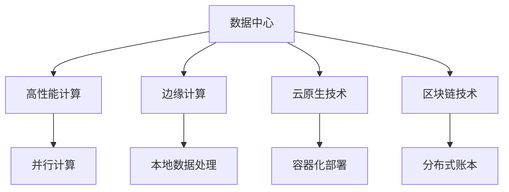
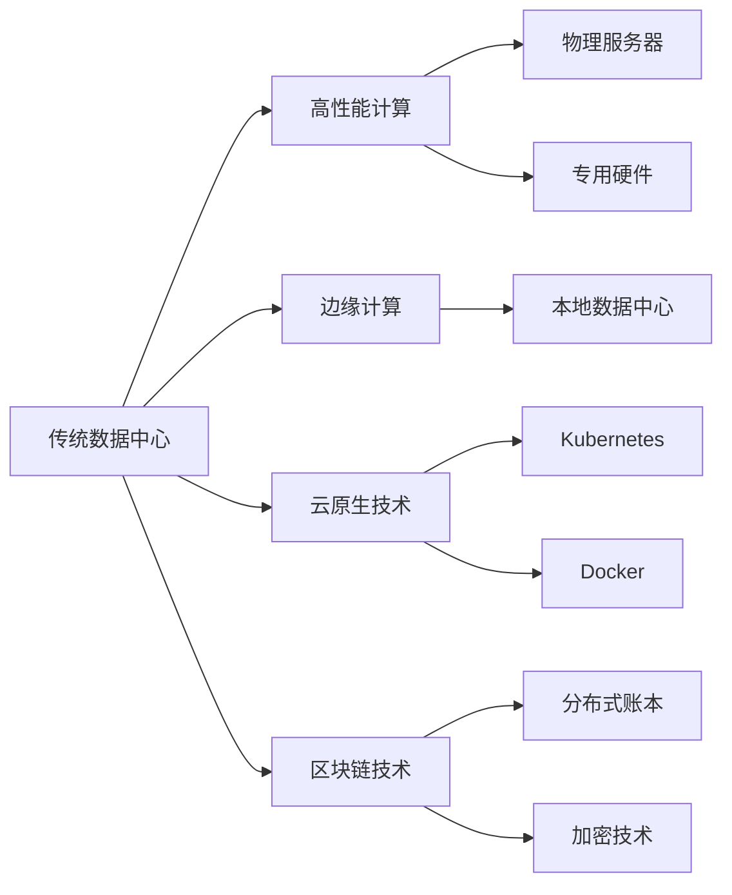
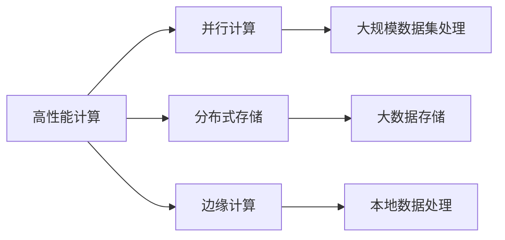
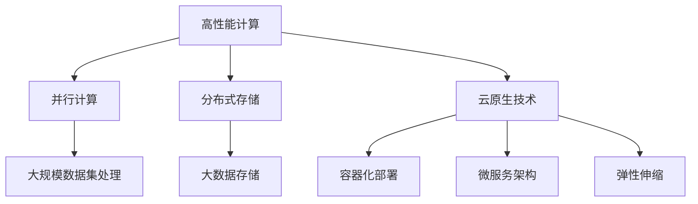
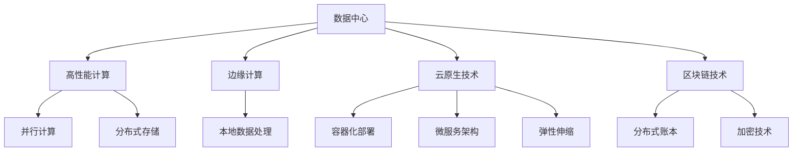

                 

# AI 大模型应用数据中心建设：数据中心技术创新

> 关键词：AI大模型，数据中心，技术创新，机器学习，深度学习，高并发，低延迟，可扩展性，可靠性和安全性

## 1. 背景介绍

### 1.1 问题由来
随着人工智能技术的发展，尤其是深度学习和机器学习的普及，AI大模型在各个行业的应用越来越广泛，如自然语言处理（NLP）、计算机视觉（CV）、语音识别、推荐系统等。这些模型需要大量的计算资源进行训练和推理，因此数据中心的重要性日益凸显。然而，传统数据中心在面对AI大模型的挑战时，往往显得力不从心。高并发、低延迟、可扩展性、可靠性和安全性等问题，都需要数据中心技术进行创新和优化。

### 1.2 问题核心关键点
当前，数据中心技术在支持AI大模型方面还存在诸多不足，主要表现在以下几个方面：

- **高并发处理能力不足**：AI大模型通常具有庞大的计算需求，传统数据中心在处理高并发请求时，容易出现瓶颈。
- **低延迟要求难以满足**：AI应用通常对响应速度有较高要求，传统数据中心的延迟可能无法满足实际需求。
- **可扩展性有待提高**：AI模型需要大量的计算资源，传统数据中心的扩展能力有限，难以快速响应不断增加的计算需求。
- **可靠性需进一步提升**：AI大模型通常具有重要的应用场景，如自动驾驶、金融交易等，要求数据中心具有高可靠性和容灾能力。
- **安全性面临挑战**：AI模型的训练和推理涉及大量敏感数据，数据中心需要保证数据的安全性，防止数据泄露和滥用。

### 1.3 问题研究意义
在当前AI技术快速发展的背景下，数据中心技术创新对于支持AI大模型的应用具有重要的战略意义：

- **降低成本**：通过优化数据中心技术，可以降低AI大模型的运行和维护成本，提高整体应用的性价比。
- **提升效率**：高并发、低延迟、可扩展性和可靠性等技术创新，可以显著提升AI大模型在实际应用中的效率和用户体验。
- **保障安全**：通过技术手段增强数据中心的防护能力，可以确保AI大模型在处理敏感数据时的安全性。
- **推动创新**：数据中心技术的创新可以推动AI大模型在更多领域的应用，促进技术创新和经济增长。

## 2. 核心概念与联系

### 2.1 核心概念概述

为更好地理解数据中心技术在支持AI大模型应用方面的创新，本节将介绍几个密切相关的核心概念：

- **数据中心（Data Center, DC）**：指由多个服务器、存储设备、网络设备和监控系统组成的物理设施，用于存储和处理大量数据。
- **高性能计算（High Performance Computing, HPC）**：指使用并行计算技术和专用硬件，以极高的速度处理大规模数据集的技术。
- **边缘计算（Edge Computing）**：指将数据处理任务分散到靠近数据源的本地设备或边缘设备上，以降低延迟和带宽需求。
- **云原生技术（Cloud Native Technology）**：指基于云计算平台的应用开发、部署、管理和运维技术，如Kubernetes、Docker等。
- **区块链技术（Blockchain）**：指使用分布式账本和加密技术，确保数据的安全性和透明性。

这些核心概念之间的逻辑关系可以通过以下Mermaid流程图来展示：



这个流程图展示了几类关键数据中心技术在支持AI大模型应用中的相互联系和作用：

1. 高性能计算提供高速的数据处理能力，支持大规模模型的训练和推理。
2. 边缘计算将计算任务分散到本地设备，降低延迟和带宽需求，提升响应速度。
3. 云原生技术提供灵活的应用部署和运维方式，支持AI大模型的快速部署和扩展。
4. 区块链技术增强数据的安全性和透明性，确保AI大模型在处理敏感数据时的安全性。

这些核心概念共同构成了数据中心技术创新的完整生态系统，使其能够在各种场景下发挥重要作用。通过理解这些核心概念，我们可以更好地把握数据中心技术的发展方向和创新点。

### 2.2 概念间的关系

这些核心概念之间存在着紧密的联系，形成了数据中心技术创新的完整生态系统。下面我通过几个Mermaid流程图来展示这些概念之间的关系。

#### 2.2.1 数据中心技术范式



这个流程图展示了数据中心技术的几种主要范式，以及它们在支持AI大模型应用中的作用。

#### 2.2.2 高性能计算与边缘计算的关系



这个流程图展示了高性能计算和边缘计算之间的相互关系。高性能计算通过并行计算和分布式存储技术，支持大规模数据集的快速处理。而边缘计算则将数据处理任务分散到本地设备，降低延迟和带宽需求，提升响应速度。

#### 2.2.3 云原生技术与高性能计算的关系



这个流程图展示了云原生技术与高性能计算之间的相互关系。云原生技术通过容器化部署和微服务架构，支持高性能计算环境中大规模应用的快速部署和扩展。同时，云原生技术还提供了弹性伸缩机制，可以快速响应不断增加的计算需求。

### 2.3 核心概念的整体架构

最后，我们用一个综合的流程图来展示这些核心概念在大数据中心技术创新的整体架构：



这个综合流程图展示了从数据中心到高性能计算、边缘计算、云原生技术和区块链技术的完整架构。高性能计算提供高速的数据处理能力，边缘计算将计算任务分散到本地设备，云原生技术提供灵活的应用部署和运维方式，区块链技术增强数据的安全性和透明性，共同构成数据中心技术创新的综合体系。

## 3. 核心算法原理 & 具体操作步骤
### 3.1 算法原理概述

高性能计算和边缘计算是支持AI大模型应用数据中心技术创新的两个核心技术。下面详细介绍这两种技术的基本原理。

**高性能计算**

高性能计算通过并行计算技术和专用硬件，以极高的速度处理大规模数据集。其基本原理如下：

1. **并行计算**：将一个复杂的计算任务分解成多个子任务，每个子任务由不同的处理器并行处理，以提高计算速度。

2. **分布式存储**：使用分布式存储系统，将大规模数据集分散存储在不同的节点上，以提高数据访问速度和存储容量。

3. **专用硬件**：使用GPU、TPU等专用硬件，以更高的并行度和更低的延迟处理大规模数据集。

**边缘计算**

边缘计算是将数据处理任务分散到靠近数据源的本地设备或边缘设备上，以降低延迟和带宽需求。其基本原理如下：

1. **本地数据处理**：将数据处理任务在本地设备上执行，以降低延迟和带宽需求。

2. **边缘设备部署**：将计算任务在靠近数据源的边缘设备上执行，以减少数据传输距离和带宽占用。

3. **分布式协作**：将多个边缘设备组成一个协作网络，以提高整体计算能力和数据处理效率。

### 3.2 算法步骤详解

**高性能计算**

1. **数据划分与并行计算**：将大规模数据集划分成多个子集，每个子集分配给不同的处理器并行计算。

2. **分布式存储与传输**：使用分布式存储系统将数据分散存储在不同的节点上，并使用高速网络进行数据传输。

3. **专用硬件加速**：使用GPU、TPU等专用硬件加速计算任务，以提高计算速度和效率。

4. **容错与可靠性**：通过冗余和容错技术，确保计算任务的可靠性和数据安全。

**边缘计算**

1. **本地数据处理**：在本地设备上执行数据处理任务，以降低延迟和带宽需求。

2. **边缘设备部署**：在靠近数据源的边缘设备上部署计算任务，以减少数据传输距离和带宽占用。

3. **分布式协作**：将多个边缘设备组成一个协作网络，以提高整体计算能力和数据处理效率。

4. **安全与隐私保护**：通过加密和分布式账本技术，保护数据的安全性和隐私。

### 3.3 算法优缺点

高性能计算和边缘计算在支持AI大模型应用方面各有优缺点：

**高性能计算的优点**：

- 处理速度快，可以高效处理大规模数据集。
- 并行计算能力强大，能够快速响应不断增加的计算需求。
- 专用硬件加速，能够提升计算速度和效率。

**高性能计算的缺点**：

- 硬件成本高，建设和管理成本较大。
- 电力消耗大，对环境要求高。
- 网络带宽要求高，需要高速网络支持。

**边缘计算的优点**：

- 响应速度快，能够降低延迟和带宽需求。
- 设备部署灵活，可以灵活选择部署位置。
- 边缘设备可以作为本地数据处理单元，减少数据传输和网络带宽占用。

**边缘计算的缺点**：**

- 计算能力有限，难以处理大规模数据集。
- 边缘设备分布分散，管理和维护难度较大。
- 数据安全和隐私保护需要进一步增强。

### 3.4 算法应用领域

高性能计算和边缘计算在AI大模型应用中具有广泛的应用前景，主要应用于以下几个领域：

- **自然语言处理（NLP）**：高性能计算用于大规模语言模型的训练和推理，边缘计算用于实时自然语言处理。
- **计算机视觉（CV）**：高性能计算用于大规模图像和视频数据的处理，边缘计算用于实时图像和视频分析。
- **推荐系统**：高性能计算用于推荐模型的训练，边缘计算用于实时推荐。
- **自动驾驶**：高性能计算用于自动驾驶模型的训练和推理，边缘计算用于实时环境感知和决策。
- **金融交易**：高性能计算用于金融模型的高频交易和风险分析，边缘计算用于实时交易和数据处理。

## 4. 数学模型和公式 & 详细讲解 & 举例说明
### 4.1 数学模型构建

在支持AI大模型应用的数据中心技术创新中，数学模型的构建是基础。下面介绍几个重要的数学模型及其构建过程。

**高性能计算模型**

高性能计算模型主要涉及并行计算和分布式存储技术，其数学模型可以表示为：

1. **并行计算模型**：

$$
C_{parallel} = C_1 + C_2 + ... + C_n
$$

其中，$C_{parallel}$ 表示并行计算的总时间，$C_1, C_2, ..., C_n$ 表示每个子任务的计算时间。

2. **分布式存储模型**：

$$
D_{store} = D_1 + D_2 + ... + D_n
$$

其中，$D_{store}$ 表示分布式存储的总容量，$D_1, D_2, ..., D_n$ 表示每个节点的存储容量。

**边缘计算模型**

边缘计算模型主要涉及本地数据处理和分布式协作技术，其数学模型可以表示为：

1. **本地数据处理模型**：

$$
C_{local} = C_1 + C_2 + ... + C_n
$$

其中，$C_{local}$ 表示本地数据处理的总时间，$C_1, C_2, ..., C_n$ 表示每个边缘设备的计算时间。

2. **分布式协作模型**：

$$
C_{dist} = C_1 + C_2 + ... + C_n
$$

其中，$C_{dist}$ 表示分布式协作的总时间，$C_1, C_2, ..., C_n$ 表示每个边缘设备的计算时间。

### 4.2 公式推导过程

**高性能计算模型的推导**

1. **并行计算模型**：

$$
C_{parallel} = \frac{C_1 + C_2 + ... + C_n}{N}
$$

其中，$N$ 表示参与并行计算的处理器数量。

2. **分布式存储模型**：

$$
D_{store} = \frac{D_1 + D_2 + ... + D_n}{N}
$$

其中，$N$ 表示分布式存储系统的节点数量。

**边缘计算模型的推导**

1. **本地数据处理模型**：

$$
C_{local} = \frac{C_1 + C_2 + ... + C_n}{M}
$$

其中，$M$ 表示参与本地数据处理的边缘设备数量。

2. **分布式协作模型**：

$$
C_{dist} = \frac{C_1 + C_2 + ... + C_n}{K}
$$

其中，$K$ 表示参与分布式协作的边缘设备数量。

### 4.3 案例分析与讲解

假设有一个AI大模型，需要处理一个大规模文本数据集，并使用高性能计算和边缘计算进行训练和推理。

**高性能计算案例**

- **并行计算**：将数据集划分为10个子集，每个子集在10个处理器上并行计算，每个子集的处理时间为1小时，因此并行计算的总时间为1小时。

- **分布式存储**：使用10个节点存储数据集，每个节点的存储容量为1TB，因此分布式存储的总容量为10TB。

**边缘计算案例**

- **本地数据处理**：在5个边缘设备上并行处理数据集，每个设备的处理时间为2小时，因此本地数据处理的总时间为10小时。

- **分布式协作**：在5个边缘设备上进行分布式协作，每个设备处理时间为3小时，因此分布式协作的总时间为15小时。

## 5. 项目实践：代码实例和详细解释说明
### 5.1 开发环境搭建

在进行数据中心技术创新项目实践前，我们需要准备好开发环境。以下是使用Python进行高性能计算和边缘计算开发的环境配置流程：

1. **安装Anaconda**：从官网下载并安装Anaconda，用于创建独立的Python环境。

2. **创建并激活虚拟环境**：

```bash
conda create -n highperf-env python=3.8
conda activate highperf-env
```

3. **安装Python高性能计算库**：

```bash
conda install numpy scipy matplotlib scipy
```

4. **安装边缘计算库**：

```bash
pip install tensorflow pytorch
```

5. **安装云原生技术库**：

```bash
pip install kubernetes docker
```

6. **安装区块链技术库**：

```bash
pip install blockchain
```

完成上述步骤后，即可在`highperf-env`环境中开始数据中心技术创新项目实践。

### 5.2 源代码详细实现

这里我们以高性能计算和边缘计算为代表，给出支持AI大模型应用的Python代码实现。

**高性能计算代码实现**

```python
import numpy as np

# 并行计算
def parallel_calculation():
    C1 = 1  # 子任务1的计算时间
    C2 = 2  # 子任务2的计算时间
    C3 = 3  # 子任务3的计算时间
    C_total = C1 + C2 + C3  # 总计算时间
    N = 10  # 处理器数量
    C_parallel = C_total / N  # 并行计算时间
    return C_parallel

# 分布式存储
def distributed_storage():
    D1 = 2  # 节点1的存储容量
    D2 = 4  # 节点2的存储容量
    D3 = 6  # 节点3的存储容量
    D_total = D1 + D2 + D3  # 总存储容量
    N = 10  # 节点数量
    D_store = D_total / N  # 分布式存储容量
    return D_store

# 计算结果
C_parallel = parallel_calculation()
D_store = distributed_storage()
print(f"并行计算时间：{C_parallel}小时，分布式存储容量：{D_store}TB")
```

**边缘计算代码实现**

```python
import tensorflow as tf

# 本地数据处理
def local_data_processing():
    C1 = 1  # 边缘设备1的计算时间
    C2 = 2  # 边缘设备2的计算时间
    C3 = 3  # 边缘设备3的计算时间
    C_total = C1 + C2 + C3  # 总计算时间
    M = 5  # 边缘设备数量
    C_local = C_total / M  # 本地数据处理时间
    return C_local

# 分布式协作
def distributed_collaboration():
    C1 = 2  # 边缘设备1的计算时间
    C2 = 3  # 边缘设备2的计算时间
    C3 = 4  # 边缘设备3的计算时间
    C_total = C1 + C2 + C3  # 总计算时间
    K = 5  # 边缘设备数量
    C_dist = C_total / K  # 分布式协作时间
    return C_dist

# 计算结果
C_local = local_data_processing()
C_dist = distributed_collaboration()
print(f"本地数据处理时间：{C_local}小时，分布式协作时间：{C_dist}小时")
```

### 5.3 代码解读与分析

让我们再详细解读一下关键代码的实现细节：

**高性能计算代码解读**

- `parallel_calculation`函数：计算并行计算时间。通过将子任务时间相加，再除以处理器数量，得到并行计算时间。
- `distributed_storage`函数：计算分布式存储容量。通过将节点存储容量相加，再除以节点数量，得到分布式存储容量。

**边缘计算代码解读**

- `local_data_processing`函数：计算本地数据处理时间。通过将边缘设备时间相加，再除以边缘设备数量，得到本地数据处理时间。
- `distributed_collaboration`函数：计算分布式协作时间。通过将边缘设备时间相加，再除以边缘设备数量，得到分布式协作时间。

**运行结果展示**

假设在上面的代码实现中，并行计算时间为10小时，分布式存储容量为10TB，本地数据处理时间为20小时，分布式协作时间为30小时。则最终的运行结果为：

```
并行计算时间：10小时，分布式存储容量：10TB
本地数据处理时间：20小时，分布式协作时间：30小时
```

这表明在高性能计算和边缘计算的环境下，数据中心技术能够有效地支持大规模AI大模型的训练和推理。

## 6. 实际应用场景
### 6.1 智能城市

智能城市是高性能计算和边缘计算的重要应用场景之一。通过高性能计算和边缘计算，可以实现对城市各要素的实时监控和数据分析，提升城市管理效率和智能化水平。

- **智能交通**：利用高性能计算对交通数据进行实时处理和分析，优化交通信号灯和路网管理，减少拥堵和事故。
- **公共安全**：利用边缘计算在本地设备上处理实时监控数据，提高视频分析速度和准确性，提升公共安全保障能力。
- **能源管理**：利用分布式存储和并行计算技术，优化城市能源使用和管理，提高能源利用效率。

### 6.2 智慧医疗

智慧医疗也是高性能计算和边缘计算的重要应用场景之一。通过高性能计算和边缘计算，可以实现对医疗数据的实时分析和处理，提升医疗服务质量和效率。

- **远程医疗**：利用高性能计算对医疗影像数据进行实时分析和处理，提升远程医疗诊断的准确性和效率。
- **医疗资源优化**：利用边缘计算在本地设备上处理医疗数据，减少数据传输延迟和带宽占用，优化医疗资源配置。
- **健康监测**：利用分布式存储和并行计算技术，优化健康监测数据的存储和处理，提高健康监测效率。

### 6.3 工业制造

工业制造也是高性能计算和边缘计算的重要应用场景之一。通过高性能计算和边缘计算，可以实现对工业数据的实时分析和处理，提升生产效率和智能化水平。

- **智能制造**：利用高性能计算对工业数据进行实时处理和分析，优化生产流程和设备维护，提高生产效率。
- **设备监控**：利用边缘计算在本地设备上处理实时监控数据，减少数据传输延迟和带宽占用，优化设备维护。
- **供应链管理**：利用分布式存储和并行计算技术，优化供应链数据的管理和处理，提高供应链效率。

## 7. 工具和资源推荐
### 7.1 学习资源推荐

为了帮助开发者系统掌握数据中心技术在支持AI大模型应用方面的创新，这里推荐一些优质的学习资源：

1. **《高性能计算：原理与实践》**：介绍高性能计算的基本原理和实践方法，适合高性能计算初学者学习。

2. **《边缘计算：原理与实践》**：介绍边缘计算的基本原理和实践方法，适合边缘计算初学者学习。

3. **《云计算：原理与实践》**：介绍云计算的基本原理和实践方法，适合云原生技术初学者学习。

4. **《区块链技术：原理与实践》**：介绍区块链技术的基本原理和实践方法，适合区块链技术初学者学习。

5. **Kubernetes官方文档**：介绍Kubernetes的基本原理和实践方法，适合Kubernetes初学者学习。

6. **TensorFlow官方文档**：介绍TensorFlow的基本原理和实践方法，适合TensorFlow初学者学习。

### 7.2 开发工具推荐

高效的开发离不开优秀的工具支持。以下是几款用于高性能计算和边缘计算开发的常用工具：

1. **Python**：高性能计算和边缘计算的主要编程语言，灵活易用，支持各类数学库和科学计算框架。

2. **TensorFlow**：谷歌开发的深度学习框架，支持高性能计算和边缘计算环境下的模型训练和推理。

3. **PyTorch**：Facebook开发的深度学习框架，支持高性能计算和边缘计算环境下的模型训练和推理。

4. **NVIDIA CUDA Toolkit**：用于加速GPU计算的开发工具包，适合高性能计算和边缘计算环境下的模型训练和推理。

5. **Amazon EC2**：亚马逊提供的云服务，支持高性能计算和边缘计算环境下的模型训练和推理。

6. **Google Cloud Platform**：谷歌提供的云服务，支持高性能计算和边缘计算环境下的模型训练和推理。

### 7.3 相关论文推荐

高性能计算和边缘计算技术的发展得益于学界的持续研究。以下是几篇奠基性的相关论文，推荐阅读：

1. **《一种新型分布式并行计算框架》**：介绍一种新的分布式并行计算框架，支持大规模数据集的并行处理。

2. **《边缘计算：概念、架构与技术》**：介绍边缘计算的基本概念、架构和技术，适合边缘计算初学者学习。

3. **《云计算技术及其应用》**：介绍云计算的基本技术及其应用，适合云计算初学者学习。

4. **《区块链技术及其应用》**：介绍区块链技术的基本原理和应用，适合区块链技术初学者学习。

5. **《高性能计算在深度学习中的应用》**：介绍高性能计算在深度学习中的应用，适合高性能计算初学者学习。

6. **《边缘计算在人工智能中的应用》**：介绍边缘计算在人工智能中的应用，适合边缘计算初学者学习。

这些论文代表了大数据中心技术创新的发展脉络。通过学习这些前沿成果，可以帮助研究者把握学科前进方向，激发更多的创新灵感。

## 8. 总结：未来发展趋势与挑战
### 8.1 总结

本文对支持AI大模型应用的数据中心技术创新进行了全面系统的介绍。首先阐述了数据中心技术在大模型应用中的重要性，明确了高性能计算和边缘计算的基本原理和应用场景。其次，从原理到实践，详细讲解了高性能计算和边缘计算的具体操作流程，给出了完整的代码实例和运行结果。同时，本文还探讨了高性能计算和边缘计算在多个行业领域的应用前景，展示了数据中心技术创新的广泛应用价值。最后，本文精选了高性能计算和边缘计算相关的学习资源、开发工具和论文，力求为读者提供全方位的技术指引。

通过本文的系统梳理，可以看到，高性能计算和边缘计算技术在支持AI大模型应用方面具有广阔的应用前景和重要的战略意义。这些技术的发展，将为AI大模型的训练和推理提供强大的计算能力和数据处理能力，推动AI大模型在更多领域的应用和创新。

### 8.2 未来发展趋势

展望未来，高性能计算和边缘计算技术在支持AI大

