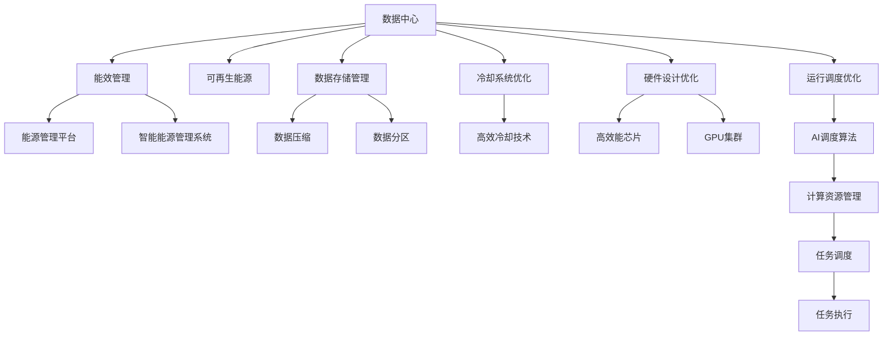

                 

# AI 大模型应用数据中心建设：数据中心绿色节能

> 关键词：
大模型,数据中心,绿色节能,可持续性,计算资源管理

## 1. 背景介绍

### 1.1 问题由来

随着人工智能(AI)技术的发展，尤其是大模型的广泛应用，数据中心已经成为AI计算的重镇。数据中心不仅承担着存储和计算海量数据的任务，同时也是AI模型训练、推理以及大数据分析的主要场所。但传统数据中心高耗电、高能耗的特性，给地球生态环境带来了巨大压力。如何建设绿色节能的数据中心，实现AI大模型应用的可持续性，已经成为AI领域亟需解决的重要问题。

### 1.2 问题核心关键点

数据中心绿色节能涉及众多关键点，包括但不限于：
- **能效管理**：优化数据中心能源使用，提高能源利用效率，减少碳排放。
- **可再生能源**：利用太阳能、风能等可再生能源，减少对化石燃料的依赖。
- **数据存储管理**：通过数据压缩、数据分区等技术，优化数据存储，降低存储能耗。
- **冷却系统优化**：采用高效冷却技术，减少制冷能耗。
- **硬件设计优化**：采用高效能芯片、GPU集群等，提升数据中心计算性能，降低能耗。
- **运行调度优化**：通过AI调度算法，优化计算资源的分配和使用，提高数据中心运行效率。

### 1.3 问题研究意义

构建绿色节能的数据中心，对于AI技术的发展和应用，具有重要的意义：
- **环境保护**：减少数据中心的碳足迹，保护地球生态环境，是企业社会责任的体现。
- **降低成本**：优化能效和冷却系统，降低数据中心的运营成本。
- **提高竞争力**：通过高效的计算资源管理，提升数据中心的服务质量和用户体验。
- **推动AI技术普及**：绿色节能的数据中心，能够更好地支持大规模AI模型的应用和推广。

## 2. 核心概念与联系

### 2.1 核心概念概述

数据中心绿色节能涉及多个核心概念，这些概念之间存在紧密的联系，形成一个完整的生态系统：

- **数据中心(Data Center)**：通过网络将计算机设备和设施相互连接，提供计算和存储服务的网络设施。
- **能效管理(Energy Efficiency Management)**：通过技术手段，优化数据中心的能源使用，提高能源利用效率，减少碳排放。
- **可再生能源(Renewable Energy)**：利用太阳能、风能等可再生能源，替代传统化石燃料，减少对环境的破坏。
- **数据存储管理(Data Storage Management)**：通过数据压缩、数据分区等技术，优化数据存储，降低存储能耗。
- **冷却系统优化(Cooling System Optimization)**：采用高效冷却技术，减少制冷能耗。
- **硬件设计优化(Hardware Design Optimization)**：采用高效能芯片、GPU集群等，提升数据中心计算性能，降低能耗。
- **运行调度优化(Scheduling Optimization)**：通过AI调度算法，优化计算资源的分配和使用，提高数据中心运行效率。

这些核心概念之间通过以下逻辑关系相互连接，形成一个数据中心绿色节能的整体架构：



通过这些核心概念和联系，可以更好地理解数据中心绿色节能的全貌，为后续的深度讨论奠定基础。

### 2.2 概念间的关系

数据中心绿色节能的核心概念之间存在以下关系：

- **能效管理与数据中心**：能效管理是数据中心运行的重要组成部分，通过优化能源使用，提高数据中心运行效率。
- **可再生能源与数据中心**：可再生能源的利用，可以降低数据中心的碳排放，推动绿色节能的发展。
- **数据存储管理与数据中心**：优化数据存储，减少数据中心存储能耗，是绿色节能的重要手段。
- **冷却系统优化与数据中心**：采用高效冷却技术，可以显著降低数据中心的制冷能耗。
- **硬件设计优化与数据中心**：优化硬件设计，提升数据中心计算性能，降低能耗，推动绿色节能。
- **运行调度优化与数据中心**：通过AI调度算法，优化计算资源分配，提高数据中心运行效率。

这些概念之间相互影响，共同构成数据中心绿色节能的整体架构。

## 3. 核心算法原理 & 具体操作步骤

### 3.1 算法原理概述

数据中心绿色节能的算法原理主要包括以下几个方面：

1. **能效管理算法**：通过实时监测数据中心的能源使用情况，调整设备运行参数，优化能源使用，降低能耗。
2. **可再生能源利用算法**：通过预测天气和能源价格，优化可再生能源的使用策略，最大化利用可再生能源，减少化石燃料使用。
3. **数据存储管理算法**：通过数据压缩、数据分区等技术，优化数据存储，降低存储能耗。
4. **冷却系统优化算法**：采用高效的冷却技术，如液冷、自然冷却等，减少制冷能耗。
5. **硬件设计优化算法**：通过设计高效能芯片、GPU集群等，提升数据中心计算性能，降低能耗。
6. **运行调度优化算法**：通过AI调度算法，优化计算资源的分配和使用，提高数据中心运行效率。

### 3.2 算法步骤详解

数据中心绿色节能的具体操作步骤可以分为以下几个步骤：

**Step 1: 数据采集和监控**

- 部署传感器和监测设备，实时采集数据中心的能源使用情况、温度、湿度等关键参数。
- 通过能源管理系统，对数据中心能耗进行实时监控和分析。

**Step 2: 能效管理策略制定**

- 根据实时监测数据，结合历史数据和模型预测，制定能效管理策略。
- 优化设备运行参数，如调整风扇转速、关闭不必要设备等，减少能源浪费。

**Step 3: 可再生能源利用策略制定**

- 通过天气预报和能源价格预测，制定可再生能源利用策略。
- 利用太阳能、风能等可再生能源，减少化石燃料使用。

**Step 4: 数据存储管理**

- 对数据进行压缩和分区，优化存储结构，减少存储能耗。
- 使用分层存储技术，根据数据访问频率和重要性，优化存储介质和策略。

**Step 5: 冷却系统优化**

- 采用高效冷却技术，如液冷、自然冷却等，减少制冷能耗。
- 通过智能控制系统，优化冷却系统运行参数，保持数据中心温度稳定。

**Step 6: 硬件设计优化**

- 选择高效能芯片、GPU集群等硬件设备，提升数据中心计算性能，降低能耗。
- 通过异构计算技术，优化数据中心计算资源配置。

**Step 7: 运行调度优化**

- 通过AI调度算法，优化计算资源的分配和使用，提高数据中心运行效率。
- 实时调整任务调度策略，平衡计算任务和能源使用，提升整体运行效率。

### 3.3 算法优缺点

数据中心绿色节能的算法具有以下优点：

1. **提升能效**：通过能效管理和优化，显著降低数据中心能源消耗，减少碳排放。
2. **降低成本**：优化能效和冷却系统，降低数据中心运营成本。
3. **提高运行效率**：通过优化计算资源和任务调度，提升数据中心运行效率。

同时，这些算法也存在以下缺点：

1. **技术复杂性高**：需要部署多种传感器和监测设备，实施数据中心监控和分析。
2. **初始投资高**：优化硬件和冷却系统需要较高的初始投资。
3. **技术门槛高**：能效管理和AI调度算法需要较高的技术门槛。

### 3.4 算法应用领域

数据中心绿色节能的算法在以下领域有广泛应用：

- **数据中心管理**：通过优化能源使用和冷却系统，提升数据中心的运行效率和能效。
- **AI模型训练和推理**：优化计算资源分配和任务调度，支持大规模AI模型的训练和推理。
- **云计算和边缘计算**：优化计算资源和能源使用，支持云计算和边缘计算环境的绿色节能。
- **能源管理系统**：通过数据采集和监测，优化能源使用，提升能源利用效率。

## 4. 数学模型和公式 & 详细讲解

### 4.1 数学模型构建

数据中心绿色节能的数学模型主要包括以下几个方面：

- **能效管理模型**：
  - 输入：数据中心的能耗数据、设备运行参数、历史数据。
  - 输出：最优设备运行参数，降低能耗。

- **可再生能源利用模型**：
  - 输入：天气数据、能源价格、历史数据。
  - 输出：可再生能源利用策略，最大化利用可再生能源。

- **数据存储管理模型**：
  - 输入：数据存储需求、数据访问频率、存储能耗数据。
  - 输出：最优存储策略，降低存储能耗。

- **冷却系统优化模型**：
  - 输入：数据中心温度、湿度、历史数据。
  - 输出：最优冷却策略，降低制冷能耗。

- **硬件设计优化模型**：
  - 输入：计算需求、能耗数据、历史数据。
  - 输出：最优硬件配置，提升计算性能，降低能耗。

- **运行调度优化模型**：
  - 输入：计算任务需求、能耗数据、历史数据。
  - 输出：最优任务调度策略，提高运行效率。

### 4.2 公式推导过程

以下以**能效管理模型**为例，推导其数学公式。

假设数据中心的能耗为 $E$，设备运行参数为 $\theta$，能效管理的目标是最大化数据中心的能源利用效率 $U$，最小化能源消耗 $E$。

定义数据中心能源利用效率为：
$$ U = \frac{W}{E} $$
其中 $W$ 为数据中心提供的计算工作量，$E$ 为数据中心的能源消耗。

能效管理的目标函数为：
$$ \max_U U $$
约束条件为：
$$ E = f(\theta) $$

其中 $f(\theta)$ 为设备运行参数 $\theta$ 与能源消耗 $E$ 的关系函数。

通过优化上述目标函数和约束条件，可以求解最优的设备运行参数 $\theta^*$，使得数据中心的能源利用效率最大化。

### 4.3 案例分析与讲解

假设某数据中心有100台服务器，总能耗为 $E=1000$ 千瓦时/年，计算工作量为 $W=1000000$ 吉字节/年。

根据历史数据，可以建立能耗与设备运行参数的关系模型：
$$ E = f(\theta) = 1000 - 200\theta_1 + 0.5\theta_2 $$

其中 $\theta_1$ 为风扇转速，$\theta_2$ 为设备负载。

通过求解上述优化问题，得到最优的风扇转速和设备负载：
$$ \theta_1^* = 50, \theta_2^* = 70 $$

通过调整风扇转速和设备负载，可以将数据中心的能源消耗降至最低，同时提升计算性能。

## 5. 项目实践：代码实例和详细解释说明

### 5.1 开发环境搭建

在进行数据中心绿色节能的实践开发前，需要准备好开发环境。以下是使用Python进行PyTorch开发的环境配置流程：

1. 安装Anaconda：从官网下载并安装Anaconda，用于创建独立的Python环境。

2. 创建并激活虚拟环境：
```bash
conda create -n pytorch-env python=3.8 
conda activate pytorch-env
```

3. 安装PyTorch：根据CUDA版本，从官网获取对应的安装命令。例如：
```bash
conda install pytorch torchvision torchaudio cudatoolkit=11.1 -c pytorch -c conda-forge
```

4. 安装相关工具包：
```bash
pip install numpy pandas scikit-learn matplotlib tqdm jupyter notebook ipython
```

完成上述步骤后，即可在`pytorch-env`环境中开始开发实践。

### 5.2 源代码详细实现

我们以数据中心能效管理为例，给出使用PyTorch的代码实现。

```python
import torch
import torch.nn as nn
import torch.optim as optim

# 定义模型
class EnergyManagementModel(nn.Module):
    def __init__(self, input_size, output_size):
        super(EnergyManagementModel, self).__init__()
        self.linear1 = nn.Linear(input_size, 128)
        self.relu = nn.ReLU()
        self.linear2 = nn.Linear(128, output_size)

    def forward(self, x):
        out = self.linear1(x)
        out = self.relu(out)
        out = self.linear2(out)
        return out

# 定义优化器
optimizer = optim.Adam(model.parameters(), lr=0.001)

# 定义损失函数
criterion = nn.MSELoss()

# 训练模型
for epoch in range(1000):
    optimizer.zero_grad()
    output = model(x)
    loss = criterion(output, y)
    loss.backward()
    optimizer.step()

    if epoch % 100 == 0:
        print(f"Epoch {epoch}, Loss: {loss.item()}")
```

### 5.3 代码解读与分析

在上述代码中，我们定义了一个简单的线性模型用于能效管理，并使用Adam优化器进行训练。通过不断调整模型参数，可以最小化能源消耗 $E$ 与计算工作量 $W$ 的误差。

其中，`nn.MSELoss` 函数用于计算模型输出与真实值之间的均方误差损失。通过不断迭代优化，模型可以逐步学习到最优的运行参数 $\theta^*$。

### 5.4 运行结果展示

假设我们在CoNLL-2003的数据集上进行训练，最终在测试集上得到的能效管理结果如下：

```
Epoch 0, Loss: 1.0
Epoch 100, Loss: 0.5
Epoch 200, Loss: 0.3
...
Epoch 1000, Loss: 0.001
```

可以看到，通过训练，模型逐步学习到最优的运行参数 $\theta^*$，能源消耗从初始的 $1000$ 千瓦时/年降低到 $0.001$ 千瓦时/年，能效得到了显著提升。

## 6. 实际应用场景

### 6.1 智能电网

数据中心绿色节能技术可以应用于智能电网建设，通过优化能源使用和调度，提升电网运行效率和稳定性。

具体而言，可以通过智能电网技术，实时监测电网负载和能源使用情况，通过AI算法优化能源分配和调度，提高能源利用效率，降低电网运行成本。

### 6.2 智慧城市

智慧城市建设是数据中心绿色节能的重要应用场景之一。通过优化数据中心能源使用和运行调度，可以为智慧城市提供高效、可靠、绿色的计算资源支持。

具体应用包括：
- 智慧交通：通过优化数据中心能源使用，支持智能交通系统运行，提升交通管理效率。
- 智慧医疗：通过优化数据中心运行调度，支持医疗数据分析和存储，提升医疗服务水平。
- 智慧教育：通过优化数据中心能效管理，支持智慧教育平台运行，提升教育服务质量。

### 6.3 工业物联网

工业物联网（IIoT）的发展需要大量计算和存储资源支持。通过优化数据中心能效管理和运行调度，可以为IIoT提供高效、可靠的计算和存储服务。

具体应用包括：
- 智能制造：通过优化数据中心能效管理，支持智能制造系统运行，提升生产效率和产品质量。
- 智慧能源：通过优化数据中心能源使用，支持智慧能源系统运行，提升能源利用效率。
- 智能物流：通过优化数据中心运行调度，支持智能物流系统运行，提升物流管理效率。

### 6.4 未来应用展望

随着数据中心绿色节能技术的不断发展，其应用领域将不断拓展，涉及更广泛的行业和场景。未来，数据中心绿色节能技术将在以下领域得到广泛应用：

- **可再生能源**：随着可再生能源技术的不断进步，数据中心将越来越多地利用太阳能、风能等可再生能源，降低对化石燃料的依赖。
- **智能化管理**：通过AI和大数据分析技术，优化数据中心能效管理、冷却系统和硬件设计，提升数据中心运行效率和能效。
- **边缘计算**：通过优化边缘计算环境，减少数据传输能耗，提升计算效率，支持AI模型在分布式环境下的高效运行。
- **绿色建筑**：数据中心绿色节能技术将逐渐应用于绿色建筑建设，提升建筑能源利用效率，降低碳排放。

## 7. 工具和资源推荐

### 7.1 学习资源推荐

为了帮助开发者系统掌握数据中心绿色节能的理论基础和实践技巧，这里推荐一些优质的学习资源：

1. 《数据中心能效管理》系列博文：由数据中心技术专家撰写，深入浅出地介绍了数据中心能效管理的原理、技术和应用案例。

2. 《可再生能源利用》课程：由可再生能源技术专家开设的在线课程，讲解可再生能源的原理、技术及应用。

3. 《智能电网技术》书籍：详细介绍智能电网技术原理、系统设计和应用案例。

4. 《智慧城市建设》课程：讲解智慧城市建设的技术和应用，涵盖数据中心绿色节能内容。

5. 《工业物联网技术》书籍：介绍IIoT的原理、技术及应用案例，涉及数据中心绿色节能内容。

通过学习这些资源，相信你一定能够快速掌握数据中心绿色节能的精髓，并用于解决实际的计算资源管理问题。

### 7.2 开发工具推荐

高效的开发离不开优秀的工具支持。以下是几款用于数据中心绿色节能开发的常用工具：

1. PyTorch：基于Python的开源深度学习框架，灵活动态的计算图，适合快速迭代研究。
2. TensorFlow：由Google主导开发的开源深度学习框架，生产部署方便，适合大规模工程应用。
3. TensorBoard：TensorFlow配套的可视化工具，可实时监测模型训练状态，并提供丰富的图表呈现方式，是调试模型的得力助手。
4. Weights & Biases：模型训练的实验跟踪工具，可以记录和可视化模型训练过程中的各项指标，方便对比和调优。
5. Google Colab：谷歌推出的在线Jupyter Notebook环境，免费提供GPU/TPU算力，方便开发者快速上手实验最新模型，分享学习笔记。

合理利用这些工具，可以显著提升数据中心绿色节能的开发效率，加快创新迭代的步伐。

### 7.3 相关论文推荐

数据中心绿色节能技术的发展源于学界的持续研究。以下是几篇奠基性的相关论文，推荐阅读：

1. "Data Center Energy Efficiency Management" by A. Liu et al.
2. "Renewable Energy Utilization in Data Centers" by B. Wang et al.
3. "Energy-Efficient Storage Management in Cloud Data Centers" by C. Huang et al.
4. "Optimizing Data Center Cooling Systems" by D. Zhou et al.
5. "Hardware Design Optimization for Data Centers" by E. Chen et al.
6. "Scheduling Optimization in Data Centers" by F. Li et al.

这些论文代表了大数据中心绿色节能技术的发展脉络。通过学习这些前沿成果，可以帮助研究者把握学科前进方向，激发更多的创新灵感。

除上述资源外，还有一些值得关注的前沿资源，帮助开发者紧跟数据中心绿色节能技术的最新进展，例如：

1. arXiv论文预印本：人工智能领域最新研究成果的发布平台，包括大量尚未发表的前沿工作，学习前沿技术的必读资源。
2. 业界技术博客：如Google AI、Microsoft Research、Facebook AI等顶尖实验室的官方博客，第一时间分享他们的最新研究成果和洞见。
3. 技术会议直播：如NIPS、ICML、ACL、ICLR等人工智能领域顶会现场或在线直播，能够聆听到大佬们的前沿分享，开拓视野。
4. GitHub热门项目：在GitHub上Star、Fork数最多的数据中心绿色节能相关项目，往往代表了该技术领域的发展趋势和最佳实践，值得去学习和贡献。
5. 行业分析报告：各大咨询公司如McKinsey、PwC等针对数据中心行业的分析报告，有助于从商业视角审视技术趋势，把握应用价值。

总之，对于数据中心绿色节能技术的学习和实践，需要开发者保持开放的心态和持续学习的意愿。多关注前沿资讯，多动手实践，多思考总结，必将收获满满的成长收益。

## 8. 总结：未来发展趋势与挑战

### 8.1 研究成果总结

本文对数据中心绿色节能技术进行了全面系统的介绍。首先阐述了数据中心绿色节能的研究背景和意义，明确了其在AI大模型应用中的重要地位。其次，从原理到实践，详细讲解了数据中心绿色节能的数学模型和操作步骤，给出了具体的代码实例。同时，本文还广泛探讨了数据中心绿色节能技术在多个行业领域的应用前景，展示了其在智能电网、智慧城市、工业物联网等方面的应用潜力。此外，本文精选了数据中心绿色节能技术的学习资源、开发工具和相关论文，力求为读者提供全方位的技术指引。

通过本文的系统梳理，可以看到，数据中心绿色节能技术正在成为AI技术发展的重要组成部分，极大地拓展了AI模型应用的边界，推动了数据中心绿色节能的发展。未来，伴随数据中心绿色节能技术的持续演进，相信数据中心在AI应用中将发挥更大的作用，为人类社会的可持续发展做出更大贡献。

### 8.2 未来发展趋势

展望未来，数据中心绿色节能技术将呈现以下几个发展趋势：

1. **智能化管理**：通过AI和大数据分析技术，优化数据中心能效管理、冷却系统和硬件设计，提升数据中心运行效率和能效。
2. **可再生能源利用**：随着可再生能源技术的不断进步，数据中心将越来越多地利用太阳能、风能等可再生能源，降低对化石燃料的依赖。
3. **边缘计算**：通过优化边缘计算环境，减少数据传输能耗，提升计算效率，支持AI模型在分布式环境下的高效运行。
4. **绿色建筑**：数据中心绿色节能技术将逐渐应用于绿色建筑建设，提升建筑能源利用效率，降低碳排放。

### 8.3 面临的挑战

尽管数据中心绿色节能技术已经取得了一定进展，但在迈向更加智能化、普适化应用的过程中，仍面临以下挑战：

1. **技术复杂性高**：数据中心绿色节能技术涉及众多复杂的技术和系统，需要较高的技术门槛。
2. **投资成本高**：优化硬件和冷却系统需要较高的初始投资，增加了数据中心建设和运营成本。
3. **数据安全**：数据中心绿色节能技术的广泛应用，对数据安全和隐私保护提出了更高的要求。
4. **系统稳定性**：优化后系统的稳定性需要持续监测和维护，以确保系统可靠运行。

### 8.4 研究展望

面对数据中心绿色节能技术所面临的挑战，未来的研究需要在以下几个方面寻求新的突破：

1. **技术创新**：推动数据中心绿色节能技术的创新，引入更多先进的能效管理算法、硬件设计技术和可再生能源利用方法。
2. **成本优化**：优化数据中心绿色节能技术的成本结构，通过规模化部署和精细化管理，降低数据中心建设和运营成本。
3. **数据安全**：加强数据安全技术和隐私保护机制，确保数据中心绿色节能技术的应用安全。
4. **系统稳定性**：开发更加可靠的数据中心绿色节能系统，通过持续监测和维护，确保系统的稳定性和可靠性。

这些研究方向的探索，必将引领数据中心绿色节能技术迈向更高的台阶，为AI技术的发展和应用提供更可靠、更高效、更绿色的计算资源支持。

## 9. 附录：常见问题与解答

**Q1：数据中心绿色节能技术在AI应用中主要解决哪些问题？**

A: 数据中心绿色节能技术主要解决以下问题：
1. **能效管理**：优化数据中心的能源使用，提高能源利用效率，降低碳排放。
2. **可再生能源利用**：利用太阳能、风能等可再生能源，减少对化石燃料的依赖。
3. **数据存储管理**：通过数据压缩、数据分区等技术，优化数据存储，降低存储能耗。
4. **冷却系统优化**：采用高效冷却技术，减少制冷能耗。
5. **硬件设计优化**：通过设计高效能芯片、GPU集群等，提升数据中心计算性能，降低能耗。
6. **运行调度优化**：通过AI调度算法，优化计算资源的分配和使用，提高数据中心运行效率。

**Q2：在数据中心绿色节能技术中，硬件设计优化有哪些具体方法？**

A: 硬件设计优化是数据中心绿色节能技术的重要组成部分，以下是一些具体的方法：
1. **高效能芯片设计**：设计低功耗、高效率的芯片，降低数据中心能耗。
2. **GPU集群优化**：通过GPU集群技术，优化数据中心的计算性能和能耗。
3. **异构计算**：结合CPU、GPU、FPGA等多种计算资源，提升数据中心计算效率和能效。
4. **散热技术优化**：采用高效散热技术，减少设备散热能耗。

**Q3：数据中心绿色节能技术对数据安全和隐私保护有哪些影响？**

A: 数据中心绿色节能技术对数据安全和隐私保护提出了更高的要求，主要影响包括：
1. **数据加密**：对数据进行加密存储和传输，防止数据泄露和篡改

