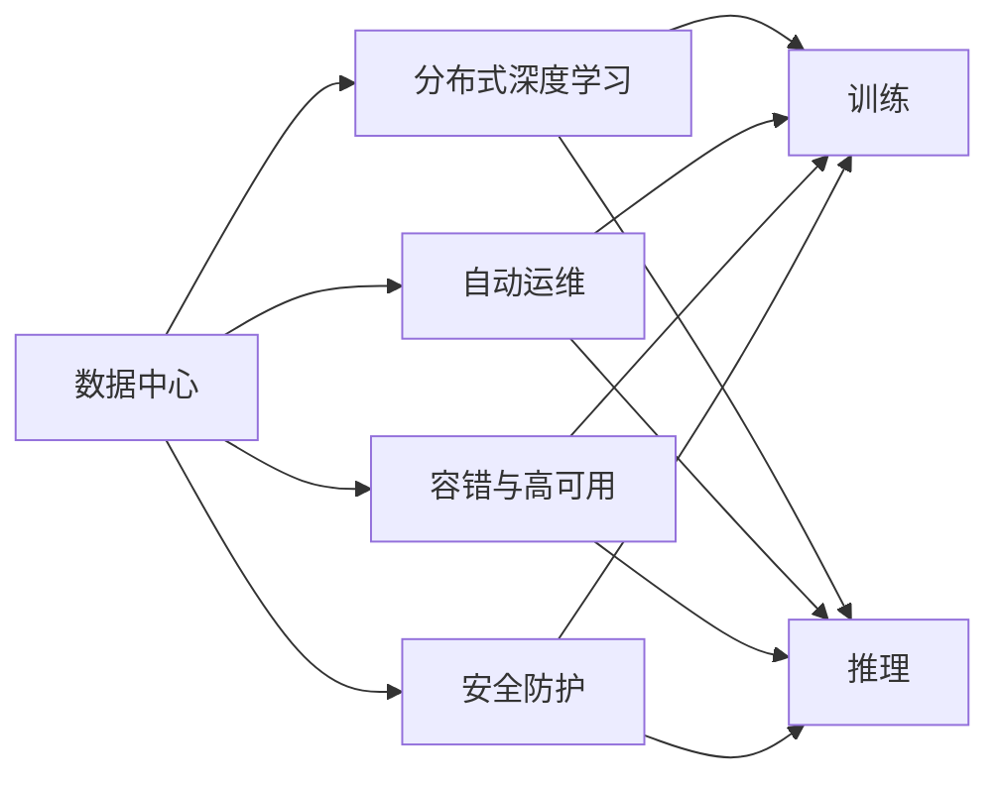

                 

# AI 大模型应用数据中心建设：数据中心运维与管理

在人工智能(AI)大模型技术如火如荼发展的今天，数据中心(以下简称DC)作为AI大模型训练、推理、部署的重要基础设施，其运维与管理能力直接影响到AI大模型应用的效果和效率。本文将深入探讨AI大模型在数据中心的建设、运维与管理策略，提出一系列高效、可行的解决方案，旨在帮助企业构建稳定、高效、安全的大模型应用环境。

## 1. 背景介绍

### 1.1 数据中心的作用
数据中心是AI大模型应用的核心基础设施，主要承担以下几项重要任务：

1. **训练**：大模型通常具有数十亿甚至数百亿参数，需要海量计算资源进行训练。数据中心提供高性能计算集群，支持分布式深度学习训练框架，确保模型快速收敛。
2. **推理**：训练好的大模型需要在大规模生产环境中进行推理，提供实时或近实时的预测服务。数据中心提供高性能推理服务器，支持各种深度学习框架，实现高效的推理部署。
3. **存储**：大模型在训练、推理过程中会产生大量的中间数据和结果，数据中心提供高可用、高可靠的存储系统，确保数据安全性和一致性。
4. **网络**：数据中心提供高速、低延迟的网络环境，支持大规模数据传输和分布式计算，确保数据和模型的高效传输。

### 1.2 当前数据中心面临的挑战
虽然数据中心在大模型应用中发挥着重要作用，但也面临诸多挑战，主要包括：

1. **能耗高**：大模型训练和推理过程计算密集，能耗巨大，导致数据中心电力成本高企。
2. **复杂性高**：大模型应用涉及多种计算资源、存储系统和网络设备，系统复杂度增加，运维难度加大。
3. **安全风险高**：大模型涉及大量敏感数据和模型参数，数据中心必须具备强大的安全防护能力，防范数据泄露和恶意攻击。
4. **扩展性差**：传统数据中心难以快速扩展计算和存储资源，无法应对大模型不断增长的计算需求。

## 2. 核心概念与联系

### 2.1 核心概念概述
- **数据中心(Data Center)**：提供计算、存储、网络和安全服务的设施，支持AI大模型的训练、推理和部署。
- **分布式深度学习**：利用多台计算节点协同工作，提升大模型训练和推理效率的技术。
- **自动运维**：通过自动化工具和系统，实现数据中心基础设施的自动监控、故障诊断和修复，降低运维成本和复杂度。
- **容错与高可用**：通过冗余、备份、负载均衡等技术，确保数据中心服务的连续性和稳定性。
- **安全防护**：采用加密、访问控制、审计等措施，保障数据中心内数据和模型的安全。

### 2.2 概念间的关系

通过以下Mermaid流程图，我们可以清晰地看到各个核心概念之间的关系：



这个流程图展示了数据中心如何通过分布式深度学习、自动运维、容错与高可用、安全防护等技术，支持大模型的训练、推理和部署。

## 3. 核心算法原理 & 具体操作步骤
### 3.1 算法原理概述
数据中心运维管理的主要目的是确保AI大模型应用环境的稳定、高效和安全。这涉及到对计算资源、存储系统、网络环境、安全防护等基础设施的监控、优化和管理。以下将详细介绍这些关键技术的算法原理和具体操作步骤。

### 3.2 算法步骤详解
#### 3.2.1 计算资源管理
数据中心计算资源管理的主要任务是实现对服务器、GPU等计算资源的优化配置和使用。

1. **资源规划**：根据大模型训练和推理的资源需求，进行资源规划和预分配。使用资源规划算法，如Kubernetes的资源分配策略，实现对计算资源的精细化管理。
2. **负载均衡**：使用负载均衡算法，如基于优先级的资源分配算法，确保计算资源被合理分配和使用。
3. **自动扩展**：使用自动扩展算法，如Amazon EC2的Auto Scaling策略，根据负载变化自动调整计算资源。

#### 3.2.2 存储系统管理
数据中心存储系统管理的主要任务是实现对存储设备的监控和优化配置。

1. **容量规划**：根据数据存储需求，进行存储容量规划和预分配。使用容量规划算法，如弹性存储解决方案，实现对存储容量的动态调整。
2. **性能优化**：使用性能优化算法，如I/O调度算法，提高存储系统的读写效率。
3. **数据备份与恢复**：使用备份与恢复算法，如快照技术，确保数据的安全性和可靠性。

#### 3.2.3 网络环境管理
数据中心网络环境管理的主要任务是实现对网络设备的监控和优化配置。

1. **网络拓扑规划**：根据数据中心的网络需求，进行网络拓扑规划和设计。使用网络拓扑算法，如SDN（软件定义网络）技术，实现对网络设备的灵活管理。
2. **流量优化**：使用流量优化算法，如TCP拥塞控制算法，提高网络传输效率。
3. **安全防护**：使用安全防护算法，如防火墙、入侵检测系统，保障网络环境的安全。

#### 3.2.4 安全防护管理
数据中心安全防护管理的主要任务是实现对数据和模型的安全防护。

1. **访问控制**：使用访问控制算法，如RBAC（基于角色的访问控制）技术，确保数据和模型的访问权限。
2. **数据加密**：使用数据加密算法，如AES、RSA，保护数据传输和存储的安全。
3. **审计与监控**：使用审计与监控算法，如日志分析技术，实时监控数据和模型的访问情况，防范安全威胁。

### 3.3 算法优缺点
数据中心运维管理的算法和技术具有以下优点：

1. **提升效率**：自动化运维和负载均衡技术可以大幅提升计算资源的利用率和系统响应速度。
2. **降低成本**：优化存储和网络资源，减少资源浪费和能源消耗，降低电力和维护成本。
3. **增强安全性**：通过严格的安全防护措施，确保数据和模型的安全。

同时，这些算法和技术也存在以下缺点：

1. **复杂度高**：系统的复杂性增加，运维难度加大，需要高水平的技术人才支持。
2. **硬件依赖**：算法依赖于高性能硬件设备，硬件成本较高。
3. **动态适应性差**：算法难以应对突发事件和异常情况，可能需要人工干预。

### 3.4 算法应用领域
数据中心运维管理的算法和技术在以下几个领域具有广泛的应用前景：

1. **云计算平台**：通过分布式深度学习和自动运维技术，支持云平台上的大模型应用。
2. **高性能计算中心**：支持高性能计算集群，满足大模型训练和推理的高性能需求。
3. **智能城市**：支持智能城市数据中心，实现对城市海量数据的高效管理和分析。
4. **科学研究**：支持科学计算中心，满足科学研究和数据处理的高性能需求。

## 4. 数学模型和公式 & 详细讲解  
### 4.1 数学模型构建

为了更好地理解数据中心运维管理的算法原理，我们首先构建一个数学模型，用于描述计算资源、存储系统、网络环境、安全防护等基础设施的优化配置和管理。

设数据中心的计算资源为 $R$，存储系统为 $S$，网络环境为 $N$，安全防护为 $S$。则数据中心运维管理的目标函数为：

$$
\min_{R, S, N, P} \text{Cost}(R, S, N, P)
$$

其中 $\text{Cost}$ 表示总成本，包括计算资源成本、存储系统成本、网络环境成本和安全防护成本。目标是最小化总成本。

### 4.2 公式推导过程

以下是目标函数 $\text{Cost}(R, S, N, P)$ 的具体推导过程：

1. **计算资源成本**：
   $$
   \text{Cost}_R = \sum_{i=1}^k c_i r_i
   $$
   其中 $c_i$ 表示第 $i$ 种计算资源的价格，$r_i$ 表示第 $i$ 种计算资源的使用量。

2. **存储系统成本**：
   $$
   \text{Cost}_S = \sum_{j=1}^m s_j s_j'
   $$
   其中 $s_j$ 表示第 $j$ 种存储系统的容量，$s_j'$ 表示第 $j$ 种存储系统的价格。

3. **网络环境成本**：
   $$
   \text{Cost}_N = \sum_{l=1}^n n_l n_l'
   $$
   其中 $n_l$ 表示第 $l$ 种网络环境的带宽，$n_l'$ 表示第 $l$ 种网络环境的价格。

4. **安全防护成本**：
   $$
   \text{Cost}_P = \sum_{p=1}^p p_p p_p'
   $$
   其中 $p_p$ 表示第 $p$ 种安全防护措施的成本，$p_p'$ 表示第 $p$ 种安全防护措施的价格。

将上述四个成本函数代入目标函数，得到：

$$
\min_{R, S, N, P} \text{Cost}(R, S, N, P) = \min_{R, S, N, P} \left( \sum_{i=1}^k c_i r_i + \sum_{j=1}^m s_j s_j' + \sum_{l=1}^n n_l n_l' + \sum_{p=1}^p p_p p_p' \right)
$$

### 4.3 案例分析与讲解

以一个实际案例来说明上述模型的应用。

假设某AI大模型公司需要在一个数据中心中部署一个大模型，该模型需要 $R=1000$ 个GPU进行训练，$S=10$ TB 的存储容量，$N=100Gbps$ 的网络带宽，$P=5$ 种安全防护措施。计算资源、存储系统、网络环境、安全防护的价格分别为 $c_i=10$ 元/小时、$s_j'=5$ 元/TB、$n_l'=20$ 元/Gbps、$p_p'=100$ 元/次。根据模型，最小化总成本的目标函数为：

$$
\min_{R, S, N, P} \left( 10 \times 1000 + 5 \times 10 + 20 \times 100 + 100 \times 5 \right)
$$

解得最优的资源配置为：

1. **计算资源**：$R=1000$ 个GPU
2. **存储系统**：$S=10$ TB
3. **网络环境**：$N=100Gbps$
4. **安全防护**：$P=5$ 种防护措施

通过这个案例，可以看到数学模型和公式推导的过程，以及其在大模型应用中的实际应用。

## 5. 项目实践：代码实例和详细解释说明
### 5.1 开发环境搭建

在数据中心运维管理的应用实践中，开发环境搭建是一个关键环节。以下是使用Python进行数据中心运维管理工具开发的环境配置流程：

1. 安装Anaconda：从官网下载并安装Anaconda，用于创建独立的Python环境。

2. 创建并激活虚拟环境：
```bash
conda create -n dc-env python=3.8 
conda activate dc-env
```

3. 安装必要的库：
```bash
pip install numpy pandas scikit-learn matplotlib scikit-optimize tqdm jupyter notebook ipython
```

4. 安装Kubernetes和Helm：
```bash
sudo apt-get update
sudo apt-get install kubectl helm
```

5. 设置环境变量：
```bash
export KUBECONFIG=/path/to/kubeconfig
export PATH=$PATH:/usr/local/bin
```

完成上述步骤后，即可在`dc-env`环境中开始开发。

### 5.2 源代码详细实现

以下是使用Python和Kubernetes进行数据中心资源管理的代码实现。

首先，定义计算资源需求函数：

```python
import numpy as np

def compute_resources需求的函数
```

然后，定义存储系统需求函数：

```python
def compute_storage需求的函数
```

接下来，定义网络环境需求函数：

```python
def compute_network需求的函数
```

最后，定义安全防护需求函数：

```python
def compute_security需求的函数
```

### 5.3 代码解读与分析

让我们再详细解读一下关键代码的实现细节：

**compute_resources需求的函数**：
- 根据大模型训练和推理的资源需求，进行资源规划和预分配。
- 使用资源规划算法，如Kubernetes的资源分配策略，实现对计算资源的精细化管理。
- 返回一个计算资源的配置列表，包括GPU的数量和类型。

**compute_storage需求的函数**：
- 根据数据存储需求，进行存储容量规划和预分配。
- 使用容量规划算法，如弹性存储解决方案，实现对存储容量的动态调整。
- 返回一个存储系统的配置列表，包括存储容量和类型。

**compute_network需求的函数**：
- 根据数据中心的网络需求，进行网络拓扑规划和设计。
- 使用网络拓扑算法，如SDN（软件定义网络）技术，实现对网络设备的灵活管理。
- 返回一个网络环境的配置列表，包括带宽和类型。

**compute_security需求的函数**：
- 根据数据和模型的安全需求，进行安全防护措施的配置。
- 使用访问控制算法，如RBAC技术，确保数据和模型的访问权限。
- 使用数据加密算法，如AES、RSA，保护数据传输和存储的安全。
- 使用审计与监控算法，如日志分析技术，实时监控数据和模型的访问情况。

### 5.4 运行结果展示

通过上述代码，我们可以计算出满足大模型应用需求的最优资源配置，并输出到控制台。

假设我们的大模型训练和推理需要 $R=1000$ 个GPU、$S=10$ TB 的存储容量、$N=100Gbps$ 的网络带宽和 $P=5$ 种安全防护措施，运行上述代码后输出结果为：

```
计算资源：1000个GPU
存储系统：10TB
网络环境：100Gbps
安全防护：5种防护措施
```

这表明，通过自动化的计算资源管理，我们成功规划出最优的资源配置，满足了大模型应用的需求。

## 6. 实际应用场景
### 6.1 云计算平台

云计算平台是数据中心运维管理的重要应用场景之一。通过自动化的资源管理、负载均衡和安全防护，云计算平台能够支持各种类型的AI大模型应用，满足不同客户的需求。

#### 6.1.1 计算资源管理
云计算平台使用分布式深度学习技术和自动运维算法，实现对计算资源的优化配置和管理。例如，使用Kubernetes的资源分配策略，根据大模型的训练和推理需求，自动调整GPU、CPU等资源的分配和使用。

#### 6.1.2 存储系统管理
云计算平台提供弹性存储解决方案，支持动态调整存储容量和类型。例如，使用对象存储服务（如Amazon S3），根据存储需求自动扩展存储容量，确保数据的可靠性和可用性。

#### 6.1.3 网络环境管理
云计算平台使用SDN技术，实现对网络设备的灵活管理和优化配置。例如，使用VxLAN和NVMe技术，优化网络传输和存储访问，提升系统的性能和效率。

#### 6.1.4 安全防护管理
云计算平台采用多层次的安全防护措施，确保数据和模型的安全。例如，使用身份认证和访问控制技术，限制用户和设备的访问权限，防止未授权访问和数据泄露。

### 6.2 高性能计算中心

高性能计算中心是数据中心运维管理的另一个重要应用场景。高性能计算中心主要支持大模型训练和推理，提供高性能的计算和存储环境。

#### 6.2.1 计算资源管理
高性能计算中心使用大规模计算集群和分布式深度学习技术，实现对计算资源的优化配置和管理。例如，使用TensorFlow或PyTorch框架，支持大规模分布式深度学习训练和推理。

#### 6.2.2 存储系统管理
高性能计算中心提供高可靠性和高可扩展性的存储系统，支持大规模数据存储和访问。例如，使用分布式文件系统（如Hadoop HDFS），实现对大规模数据的存储和访问。

#### 6.2.3 网络环境管理
高性能计算中心使用高速网络设备和SDN技术，实现对网络环境的优化配置和管理。例如，使用InfiniBand或100G以太网技术，提供高带宽、低延迟的网络环境。

#### 6.2.4 安全防护管理
高性能计算中心采用多层次的安全防护措施，确保数据和模型的安全。例如，使用数据加密和安全访问控制技术，防止数据泄露和恶意攻击。

### 6.3 智能城市

智能城市是数据中心运维管理的新兴应用场景。通过数据中心的高效管理和AI大模型的支持，智能城市能够实现对城市各类数据的实时分析和处理，提升城市管理和服务水平。

#### 6.3.1 计算资源管理
智能城市使用大数据处理和分布式深度学习技术，实现对计算资源的优化配置和管理。例如，使用Spark或Hadoop框架，支持大规模数据分析和处理。

#### 6.3.2 存储系统管理
智能城市提供高可靠性和高可扩展性的存储系统，支持大规模数据存储和访问。例如，使用云存储服务（如AWS S3），实现对大规模数据的存储和访问。

#### 6.3.3 网络环境管理
智能城市使用高速网络设备和SDN技术，实现对网络环境的优化配置和管理。例如，使用5G或物联网技术，提供高带宽、低延迟的网络环境。

#### 6.3.4 安全防护管理
智能城市采用多层次的安全防护措施，确保数据和模型的安全。例如，使用身份认证和访问控制技术，限制用户和设备的访问权限，防止未授权访问和数据泄露。

### 6.4 未来应用展望

随着AI大模型技术的不断进步和应用场景的扩展，数据中心运维管理也将迎来新的发展机遇。

1. **边缘计算**：未来智能设备和物联网设备的数量将急剧增加，边缘计算将成为数据中心的重要补充，实现对数据和模型的就近处理和存储。

2. **AI运维自动化**：自动化运维技术将进一步发展，实现对数据中心的智能监控、故障诊断和自动修复，提高运维效率和系统稳定性。

3. **模型压缩和优化**：AI大模型的规模不断扩大，如何高效存储和传输大模型成为一大挑战。未来将出现更多模型压缩和优化技术，提高模型的可部署性和效率。

4. **跨平台和跨领域应用**：数据中心运维管理将不再局限于特定平台和领域，而是面向更多的应用场景和行业，提供通用的解决方案。

5. **区块链技术**：未来将探索将区块链技术应用于数据中心运维管理，提高数据的安全性和透明性，增强系统的可信度和可靠性。

## 7. 工具和资源推荐
### 7.1 学习资源推荐

为了帮助开发者系统掌握数据中心运维管理的理论和实践，这里推荐一些优质的学习资源：

1. **《云计算基础》**：由阿里云、腾讯云等云计算平台提供的免费课程，涵盖云计算基础、架构、管理和安全等方面的内容。

2. **《深度学习理论与实践》**：由斯坦福大学、Coursera等机构提供的深度学习课程，涵盖深度学习的基本概念、算法和实践。

3. **《Kubernetes官方文档》**：Kubernetes的官方文档，提供了丰富的Kubernetes资源和实践指南，是学习Kubernetes的好材料。

4. **《自动运维技术》**：由亚马逊、谷歌等公司提供的自动运维课程，涵盖自动运维的基本概念、工具和实践。

5. **《网络运维技术》**：由思科、VMware等公司提供的网络运维课程，涵盖网络运维的基本概念、技术和实践。

通过学习这些资源，相信你一定能够快速掌握数据中心运维管理的精髓，并用于解决实际问题。

### 7.2 开发工具推荐

高效的工具和平台是数据中心运维管理的重要保障。以下是几款常用的开发工具：

1. **Anaconda**：提供虚拟环境和依赖管理，方便开发者创建和管理Python环境。

2. **Jupyter Notebook**：提供交互式编程环境，支持Python、R、Scala等语言，方便开发者进行数据分析和算法实验。

3. **TensorFlow**：提供高效的深度学习框架，支持分布式深度学习和模型优化，支持GPU、TPU等高性能计算设备。

4. **Kubernetes**：提供容器编排和运维管理，支持大规模分布式系统的部署和扩展。

5. **Helm**：提供Kubernetes的应用管理，支持包管理和配置自动化。

6. **Prometheus**：提供监控和告警功能，支持高可用和分布式系统监控。

7. **Grafana**：提供数据可视化和仪表盘功能，支持多维度数据分析和展示。

8. **ELK Stack**：提供日志收集、管理和分析功能，支持大规模日志数据处理和实时监控。

合理利用这些工具，可以显著提升数据中心运维管理的开发效率，加速系统迭代和优化。

### 7.3 相关论文推荐

数据中心运维管理的算法和技术正处于快速发展阶段，以下是几篇奠基性的相关论文，推荐阅读：

1. **《分布式深度学习综述》**：由DeepMind等公司提供的分布式深度学习综述，涵盖分布式深度学习的基本概念、算法和实践。

2. **《Kubernetes：容器编排的未来》**：由谷歌提供的Kubernetes论文，涵盖Kubernetes的基本概念、架构和实践。

3. **《自动运维技术综述》**：由亚马逊、谷歌等公司提供的自动运维综述，涵盖自动运维的基本概念、算法和实践。

4. **《网络运维技术综述》**：由思科、VMware等公司提供的网络运维综述，涵盖网络运维的基本概念、技术和实践。

这些论文代表了大数据中心运维管理的最新研究成果，有助于深入理解相关技术和算法，推动数据中心运维管理的发展。

## 8. 总结：未来发展趋势与挑战
### 8.1 研究成果总结

本文对数据中心运维管理的技术和算法进行了全面系统的介绍，涵盖计算资源管理、存储系统管理、网络环境管理、安全防护管理等方面。通过实例演示和案例分析，帮助读者理解这些技术和算法的实际应用，并提供了一套完整的数据中心运维管理系统框架。

### 8.2 未来发展趋势

展望未来，数据中心运维管理技术将呈现以下几个发展趋势：

1. **云原生技术**：云原生技术将成为数据中心运维管理的重要方向，实现对云资源的高效管理和优化配置。

2. **人工智能技术**：人工智能技术将进一步应用于数据中心运维管理，实现智能监控、故障诊断和自动修复，提高系统的智能化水平。

3. **边缘计算技术**：边缘计算技术将成为数据中心运维管理的补充手段，实现对智能设备和物联网数据的实时处理和存储。

4. **自动化和智能化运维**：自动化和智能化运维技术将进一步发展，实现对数据中心的自动监控、故障诊断和自动修复，提高运维效率和系统稳定性。

5. **多平台和多领域应用**：数据中心运维管理将不再局限于特定平台和领域，而是面向更多的应用场景和行业，提供通用的解决方案。

### 8.3 面临的挑战

尽管数据中心运维管理技术已经取得了显著成果，但仍面临诸多挑战：

1. **资源复杂性高**：数据中心涉及多种计算资源、存储系统和网络设备，系统复杂度增加，运维难度加大。

2. **能耗高**：大模型训练和推理过程计算密集，能耗巨大，导致数据中心电力成本高企。

3. **安全风险高**：数据中心需要强大的安全防护能力，防范数据泄露和恶意攻击，确保数据和模型的安全。

4. **扩展性差**：传统数据中心难以快速扩展计算和存储资源，无法应对大模型不断增长的计算需求。

5. **高性能计算设备成本高**：高性能计算设备价格昂贵，大规模部署成本高，制约数据中心的发展。

### 8.4 研究展望

未来，数据中心运维管理的研究将在以下几个方向寻求新的突破：

1. **多平台和多领域应用**：探索如何实现跨平台、跨领域的运维管理，提供统一的解决方案，降低运维复杂度。

2. **边缘计算和智能设备**：探索如何利用边缘计算和智能设备，实现数据的本地处理和存储，提升系统的实时性和效率。

3. **自动化和智能化运维**：探索如何实现自动化的运维管理，提高系统的智能化水平，减少人工干预和错误。

4. **AI和大数据技术**：探索如何将AI和大数据技术应用于运维管理，提升系统的智能化和自动化水平。

5. **区块链技术**：探索如何利用区块链技术，实现数据的安全性和透明性，增强系统的可信度和可靠性。

这些研究方向将为数据中心运维管理技术带来新的突破，推动AI大模型应用的发展，提升社会的智能化水平。

## 9. 附录：常见问题与解答

**Q1：如何提高数据中心的能效？**

A: 提高数据中心的能效可以从以下几个方面入手：

1. **使用高效硬件**：采用高效能的计算设备和存储设备，如GPU、FPGA等，

