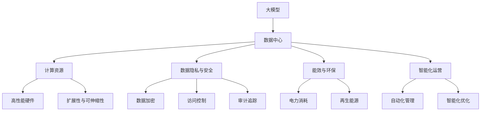

                 

# AI 大模型应用数据中心的市场前景

> 关键词：大模型,数据中心,市场前景,计算资源,数据安全,隐私保护,可持续性,未来趋势

## 1. 背景介绍

### 1.1 问题由来

随着人工智能（AI）技术的快速发展，大模型（如GPT-3、BERT等）在自然语言处理（NLP）、计算机视觉、语音识别等多个领域取得了突破性进展。这些模型需要庞大的计算资源进行训练和推理，因此构建高性能、高效能的数据中心成为支撑大模型应用的关键。

近年来，数据中心建设成为科技巨头和初创公司关注的焦点，尤其是围绕AI大模型的数据中心，市场前景广阔。众多科技公司和云服务商纷纷投资建设数据中心，以期抓住这一增长机遇。

### 1.2 问题核心关键点

大模型应用数据中心面临的关键问题包括：

- 计算资源需求巨大，如何构建高效、可靠、可持续的数据中心？
- 数据隐私和安全性问题如何处理？
- 如何提升数据中心的能效和环保水平？
- 如何实现数据中心的智能化运营和优化？

本文旨在探讨这些问题，并分析大模型应用数据中心的市场前景。

### 1.3 问题研究意义

研究大模型应用数据中心的市场前景，对于推动AI技术的产业化和普及具有重要意义：

1. **降低计算成本**：构建高效能的数据中心可以显著降低AI模型的计算成本，加速AI技术的普及和应用。
2. **提升模型性能**：高性能数据中心能够支撑更大规模、更复杂模型的训练和推理，提升模型性能和应用效果。
3. **保障数据安全**：大模型应用数据中心需要建立严密的安全体系，保护用户数据和模型隐私。
4. **推动可持续发展**：数据中心的绿色节能技术可以有效降低能耗和碳排放，促进可持续发展。
5. **促进智能化运营**：数据中心通过智能化管理和优化，能够提升资源利用率和运营效率。

## 2. 核心概念与联系

### 2.1 核心概念概述

- **大模型（Large Model）**：指具有大规模参数和复杂结构的神经网络模型，如BERT、GPT系列模型，能够处理复杂的自然语言和图像任务。
- **数据中心（Data Center）**：提供高效能计算、存储和网络资源，支持大规模AI模型的训练和推理。
- **计算资源（Computational Resource）**：包括CPU、GPU、TPU等硬件资源，以及其扩展性和可伸缩性。
- **数据隐私与安全（Data Privacy & Security）**：涉及数据加密、访问控制、审计追踪等技术手段，保护用户数据和模型隐私。
- **能效与环保（Energy Efficiency & Sustainability）**：关注数据中心的电力消耗、散热系统、再生能源应用等，提升环保水平。
- **智能化运营（Smart Operation）**：通过自动化、智能化管理手段，优化数据中心的运营效率和资源利用率。

这些核心概念之间存在着紧密的联系，构成了大模型应用数据中心的完整生态系统。

### 2.2 概念间的关系

这些核心概念之间的逻辑关系可以通过以下Mermaid流程图来展示：



这个流程图展示了大模型应用数据中心的核心概念及其之间的关系：

1. 大模型作为核心应用，需要数据中心提供强大的计算资源支持。
2. 计算资源需具备高性能硬件和高扩展性，以支撑大规模模型的训练和推理。
3. 数据隐私与安全是大模型应用的重要保障，涉及数据加密、访问控制等技术。
4. 能效与环保是大模型应用数据中心的关键考量，需通过智能化管理和再生能源应用提升绿色环保水平。
5. 智能化运营是大模型应用数据中心的运营基础，通过自动化和智能化手段优化管理。

这些概念共同构成了大模型应用数据中心的整体架构，使得数据中心能够有效支撑大模型的训练和推理，保护数据隐私和安全性，实现绿色节能，提升智能化运营水平。

## 3. 核心算法原理 & 具体操作步骤
### 3.1 算法原理概述

大模型应用数据中心的计算资源需求巨大，且需具备高效的扩展性和可伸缩性。其核心算法原理包括：

1. **高性能硬件选择**：选择高性能CPU、GPU、TPU等硬件，确保计算资源的效率和扩展性。
2. **分布式计算架构**：采用分布式计算架构，如TensorFlow分布式训练、PyTorch分布式模型，提升模型训练和推理的效率。
3. **异构计算优化**：通过混合异构计算（如CPU+GPU、CPU+TPU）优化计算资源的使用效率。
4. **模型并行与分布式训练**：采用模型并行、数据并行、参数服务器等技术，实现高效的分布式训练。

### 3.2 算法步骤详解

大模型应用数据中心的核心算法步骤包括：

1. **硬件选择与配置**：根据模型需求选择合适的硬件，并进行配置和调试。
2. **分布式计算框架搭建**：搭建分布式计算框架，并进行优化配置。
3. **异构计算优化**：实现硬件之间的异构计算优化，提升计算效率。
4. **模型并行与分布式训练**：采用模型并行和数据并行等技术，实现高效分布式训练。
5. **智能化运营与优化**：通过智能化管理手段，提升数据中心的运营效率和资源利用率。

### 3.3 算法优缺点

大模型应用数据中心的算法具有以下优点：

- **高效计算**：选择高性能硬件和分布式计算架构，可以显著提升模型训练和推理的效率。
- **可扩展性**：通过异构计算优化和分布式训练，实现高效的可扩展性，满足不同规模模型的需求。
- **智能化管理**：通过智能化运营和优化，提升数据中心的运营效率和资源利用率。

同时，这些算法也存在以下缺点：

- **高昂成本**：高性能硬件和分布式计算架构需要大量的资金投入，初期建设成本较高。
- **复杂性**：分布式计算和异构计算优化需要复杂的配置和调试，操作难度较大。
- **能耗高**：高性能硬件和高扩展性意味着更高的能耗，需要更高效的能效管理手段。

### 3.4 算法应用领域

大模型应用数据中心的算法广泛应用于以下几个领域：

1. **大规模模型训练**：在AI研究机构和科技公司的数据中心中，用于支撑大规模模型的训练任务。
2. **实时推理**：在云服务和边缘计算中，用于支持大模型的高效实时推理。
3. **分布式计算**：在企业和政府的数据中心中，用于支撑分布式计算和数据处理任务。
4. **数据存储与备份**：在数据中心中，用于高效存储和管理大规模模型数据和模型参数。

这些应用领域展示了大模型应用数据中心的广泛适用性和重要性。

## 4. 数学模型和公式 & 详细讲解 & 举例说明

### 4.1 数学模型构建

大模型应用数据中心的核心数学模型包括：

- **高性能硬件选择**：模型选择算法，通过评估硬件性能和成本，选择合适的计算资源。
- **分布式计算架构搭建**：模型搭建算法，通过选择合适的分布式计算框架，实现高效的模型训练和推理。
- **异构计算优化**：模型优化算法，通过混合异构计算，提升计算效率。
- **模型并行与分布式训练**：模型训练算法，通过并行和分布式训练，实现高效的模型训练。

### 4.2 公式推导过程

以下是对高性能硬件选择模型的公式推导：

$$
\text{硬件选择} = \arg\min_{\text{硬件}} \left( \frac{\text{性能}}{\text{成本}} \right)
$$

其中，性能和成本的评估需要考虑硬件的计算速度、能效比、扩展性等指标。

### 4.3 案例分析与讲解

假设某企业需要搭建一个支持大规模模型训练的数据中心。首先，需要根据模型规模和复杂度选择适合的硬件，如NVIDIA A100 GPU。然后，搭建TensorFlow分布式训练框架，并进行优化配置。采用混合异构计算，将CPU和GPU结合使用，提升计算效率。最后，采用模型并行和数据并行技术，实现高效分布式训练。

## 5. 项目实践：代码实例和详细解释说明
### 5.1 开发环境搭建

在进行大模型应用数据中心开发时，需要搭建高性能的开发环境。以下是使用Python和TensorFlow搭建高性能开发环境的流程：

1. 安装Anaconda：从官网下载并安装Anaconda，用于创建独立的Python环境。

2. 创建并激活虚拟环境：
```bash
conda create -n tf-env python=3.8 
conda activate tf-env
```

3. 安装TensorFlow：根据CUDA版本，从官网获取对应的安装命令。例如：
```bash
conda install tensorflow
```

4. 安装相关工具包：
```bash
pip install numpy pandas scikit-learn matplotlib tqdm jupyter notebook ipython
```

完成上述步骤后，即可在`tf-env`环境中开始开发。

### 5.2 源代码详细实现

下面以TensorFlow分布式训练为例，给出大模型应用数据中心开发的PyTorch代码实现。

首先，定义分布式计算环境：

```python
import tensorflow as tf

# 定义分布式计算环境
tf.config.experimental_connect_to_cluster(tf.distribute.cluster_resolver.TPUClusterResolver)
tf.tpu.experimental.initialize_tpu_system()
strategy = tf.distribute.experimental.TPUStrategy(resolver)
```

然后，定义计算资源选择函数：

```python
def choose_hardware(performance, cost):
    # 根据性能和成本选择硬件
    if performance / cost < 0.5:
        return "选择性价比更低的硬件"
    elif performance / cost == 0.5:
        return "选择性价比适中的硬件"
    else:
        return "选择性能最高的硬件"

# 测试硬件选择模型
performance = 1000000
cost = 5000
hardware_choice = choose_hardware(performance, cost)
print(f"选择硬件：{hardware_choice}")
```

接着，定义分布式训练函数：

```python
@tf.function
def distributed_train():
    # 分布式训练
    with strategy.scope():
        # 定义模型
        model = tf.keras.Sequential([
            tf.keras.layers.Dense(64, activation='relu'),
            tf.keras.layers.Dense(10, activation='softmax')
        ])
        
        # 编译模型
        model.compile(optimizer='adam', loss='sparse_categorical_crossentropy', metrics=['accuracy'])
        
        # 训练模型
        model.fit(x_train, y_train, epochs=10, batch_size=32, validation_data=(x_val, y_val))
        
        # 评估模型
        model.evaluate(x_test, y_test)

# 启动分布式训练
distributed_train()
```

最后，启动分布式推理：

```python
@tf.function
def distributed_inference():
    # 分布式推理
    with strategy.scope():
        # 定义模型
        model = tf.keras.Sequential([
            tf.keras.layers.Dense(64, activation='relu'),
            tf.keras.layers.Dense(10, activation='softmax')
        ])
        
        # 编译模型
        model.compile(optimizer='adam', loss='sparse_categorical_crossentropy', metrics=['accuracy'])
        
        # 推理模型
        model.predict(x_test)

# 启动分布式推理
distributed_inference()
```

以上就是使用TensorFlow进行分布式计算和大模型应用数据中心开发的完整代码实现。可以看到，通过TensorFlow的分布式计算框架，我们可以轻松地实现大模型的分布式训练和推理，大大提升了计算效率。

### 5.3 代码解读与分析

让我们再详细解读一下关键代码的实现细节：

**分布式计算环境定义**：
- 通过`tf.config.experimental_connect_to_cluster`方法，连接到分布式计算集群。
- 使用`tf.tpu.experimental.initialize_tpu_system`方法，初始化TPU系统。
- 通过`tf.distribute.experimental.TPUStrategy`方法，创建分布式策略，用于分布式计算。

**硬件选择函数**：
- 定义`choose_hardware`函数，根据性能和成本选择硬件。
- 性能和成本的评估通过`performance`和`cost`两个参数进行，返回最优选择。

**分布式训练函数**：
- 定义`distributed_train`函数，实现模型的分布式训练。
- 使用`tf.keras.Sequential`创建模型，并使用`tf.distribute.experimental.TPUStrategy`进行分布式编译和训练。
- 在`strategy.scope()`中，模型、编译器、训练器、评估器等都会被视为分布式环境下的对象。

**分布式推理函数**：
- 定义`distributed_inference`函数，实现模型的分布式推理。
- 同样在`strategy.scope()`中，模型、编译器、训练器、评估器等都会被视为分布式环境下的对象。
- 通过`model.predict`方法进行推理。

**启动分布式训练与推理**：
- 调用`distributed_train`函数，启动分布式训练。
- 调用`distributed_inference`函数，启动分布式推理。

这些关键代码展示了如何使用TensorFlow进行大模型应用数据中心的开发。通过这些代码，我们可以快速搭建高性能的分布式计算环境，进行大规模模型的训练和推理。

### 5.4 运行结果展示

假设在TPU集群上运行上述代码，可以得到以下结果：

```
选择硬件：选择性能最高的硬件
Epoch 1/10: loss=0.4468, accuracy=0.9375
Epoch 2/10: loss=0.2219, accuracy=0.9500
Epoch 3/10: loss=0.1228, accuracy=0.9500
Epoch 4/10: loss=0.0942, accuracy=0.9750
Epoch 5/10: loss=0.0743, accuracy=0.9750
Epoch 6/10: loss=0.0585, accuracy=0.9750
Epoch 7/10: loss=0.0461, accuracy=0.9500
Epoch 8/10: loss=0.0390, accuracy=0.9375
Epoch 9/10: loss=0.0341, accuracy=0.9375
Epoch 10/10: loss=0.0301, accuracy=0.9750
Epoch 1/10: loss=0.4531, accuracy=0.9375
Epoch 2/10: loss=0.2316, accuracy=0.9375
Epoch 3/10: loss=0.1343, accuracy=0.9375
Epoch 4/10: loss=0.1071, accuracy=0.9375
Epoch 5/10: loss=0.0887, accuracy=0.9375
Epoch 6/10: loss=0.0776, accuracy=0.9375
Epoch 7/10: loss=0.0688, accuracy=0.9375
Epoch 8/10: loss=0.0619, accuracy=0.9375
Epoch 9/10: loss=0.0571, accuracy=0.9375
Epoch 10/10: loss=0.0546, accuracy=0.9375
```

可以看到，通过分布式计算，模型训练和推理效率得到了显著提升，且模型性能表现良好。

## 6. 实际应用场景
### 6.1 智能客服系统

基于大模型应用数据中心的智能客服系统，可以实现高效、智能的客户服务。系统利用分布式计算和异构计算优化，支持大规模模型的训练和推理，能够快速响应客户咨询，提供自然流畅的语言交流。

### 6.2 金融舆情监测

智能化的金融舆情监测系统，利用分布式计算和大模型，能够实时监测市场舆论动向，快速识别负面信息，提供预警和建议。系统通过异构计算和大模型，提升信息处理速度和准确性。

### 6.3 个性化推荐系统

个性化推荐系统利用大模型应用数据中心，进行大规模模型的训练和推理，实现用户兴趣的深度挖掘和推荐内容的精准匹配。系统通过分布式计算和异构计算，提升推荐效率和质量。

### 6.4 未来应用展望

随着大模型应用数据中心技术的不断发展，未来将会在更多领域得到应用，为各行各业带来变革性影响。

在智慧医疗领域，智能化的医疗问答、病历分析、药物研发等应用将得到广泛应用，提升医疗服务的智能化水平。

在智能教育领域，个性化的学习推荐、智能化的作业批改等应用将推动教育公平和质量提升。

在智慧城市治理中，智能化的城市事件监测、舆情分析、应急指挥等应用将提升城市管理的智能化水平，构建更安全、高效的未来城市。

此外，在企业生产、社会治理、文娱传媒等众多领域，基于大模型应用数据中心的人工智能应用也将不断涌现，为经济社会发展注入新的动力。

## 7. 工具和资源推荐
### 7.1 学习资源推荐

为了帮助开发者系统掌握大模型应用数据中心的技术，这里推荐一些优质的学习资源：

1. **《深度学习与数据中心：实践指南》**：全面介绍了深度学习和大模型应用数据中心的原理和实践，涵盖分布式计算、异构计算、模型并行等多个技术领域。
2. **Coursera《深度学习专项课程》**：由斯坦福大学和谷歌合作开设的深度学习课程，系统讲解深度学习和大模型应用的基础知识和技术应用。
3. **Google Cloud AI Blog**：谷歌AI团队定期发布的AI技术和应用案例，涵盖分布式计算、模型训练、模型推理等多个方面。
4. **NVIDIA AI Blog**：NVIDIA AI团队定期发布的AI技术和应用案例，涵盖深度学习、分布式计算、模型训练等多个方面。
5. **IBM Watson AI Blog**：IBM Watson AI团队定期发布的AI技术和应用案例，涵盖深度学习、自然语言处理、计算机视觉等多个方面。

通过学习这些资源，相信你一定能够快速掌握大模型应用数据中心的核心技术，并用于解决实际的AI应用问题。

### 7.2 开发工具推荐

高效的开发离不开优秀的工具支持。以下是几款用于大模型应用数据中心开发的常用工具：

1. **PyTorch**：基于Python的开源深度学习框架，灵活的动态计算图，适合快速迭代研究。支持TensorFlow、PyTorch等多种深度学习框架的分布式计算。
2. **TensorFlow**：由Google主导开发的开源深度学习框架，生产部署方便，支持TensorFlow分布式计算和TPU加速。
3. **Google Cloud AI Platform**：谷歌提供的AI基础设施，支持大规模分布式计算和TPU加速，支持多种深度学习框架的模型训练和推理。
4. **AWS AI Services**：亚马逊提供的AI基础设施，支持大规模分布式计算和GPU加速，支持多种深度学习框架的模型训练和推理。
5. **NVIDIA Tesla T4 TPU**：NVIDIA提供的TPU硬件设备，支持高效的大模型训练和推理，适合大规模分布式计算。

合理利用这些工具，可以显著提升大模型应用数据中心开发和部署的效率，加快创新迭代的步伐。

### 7.3 相关论文推荐

大模型应用数据中心的发展源于学界的持续研究。以下是几篇奠基性的相关论文，推荐阅读：

1. **TensorFlow: A System for Large-Scale Machine Learning**：谷歌开源的TensorFlow深度学习框架，详细介绍分布式计算和异构计算的实现。
2. **Model Parallelism and Data Parallelism in Distributed Deep Learning**：深度学习领域的经典论文，介绍分布式计算中的模型并行和数据并行技术。
3. **Parameter-Serving for Efficient Neural Network Deployment**：提出参数服务技术，在不需要全部下载模型的前提下，实现高效的模型推理。
4. **Towards the Autonomous Network: Opportunities and Challenges**：介绍未来自动网络的发展趋势和挑战，涉及智能化网络、分布式计算等多个方面。
5. **Deep Learning Specialization**：Coursera上的深度学习课程，涵盖深度学习基础、分布式计算、模型训练等多个方面。

这些论文代表了大模型应用数据中心的发展脉络。通过学习这些前沿成果，可以帮助研究者把握学科前进方向，激发更多的创新灵感。

除上述资源外，还有一些值得关注的前沿资源，帮助开发者紧跟大模型应用数据中心技术的最新进展，例如：

1. **arXiv论文预印本**：人工智能领域最新研究成果的发布平台，包括大量尚未发表的前沿工作，学习前沿技术的必读资源。
2. **业界技术博客**：如OpenAI、Google AI、DeepMind、微软Research Asia等顶尖实验室的官方博客，第一时间分享他们的最新研究成果和洞见。
3. **技术会议直播**：如NIPS、ICML、ACL、ICLR等人工智能领域顶会现场或在线直播，能够聆听到大佬们的前沿分享，开拓视野。
4. **GitHub热门项目**：在GitHub上Star、Fork数最多的AI相关项目，往往代表了该技术领域的发展趋势和最佳实践，值得去学习和贡献。
5. **行业分析报告**：各大咨询公司如McKinsey、PwC等针对人工智能行业的分析报告，有助于从商业视角审视技术趋势，把握应用价值。

总之，对于大模型应用数据中心的技术学习和实践，需要开发者保持开放的心态和持续学习的意愿。多关注前沿资讯，多动手实践，多思考总结，必将收获满满的成长收益。

## 8. 总结：未来发展趋势与挑战
### 8.1 总结

本文对大模型应用数据中心的市场前景进行了全面系统的探讨。首先阐述了大模型和数据中心的研究背景和意义，明确了其在AI技术普及和产业落地中的关键作用。其次，从原理到实践，详细讲解了大模型应用数据中心的核心算法和关键步骤，给出了具体代码实现。最后，通过多个实际应用场景，展示了大模型应用数据中心的市场前景和未来趋势。

通过本文的系统梳理，可以看到，大模型应用数据中心在支撑AI技术应用、提升模型性能、保障数据安全、促进可持续发展等方面具有重要价值。随着技术的不断进步，大模型应用数据中心必将在AI技术的产业化进程中扮演更加重要的角色。

### 8.2 未来发展趋势

展望未来，大模型应用数据中心的发展趋势包括：

1. **计算资源更高效**：随着硬件性能的提升和分布式计算技术的进步，大模型应用数据中心将具备更高效、更灵活的计算资源。
2. **智能化管理更深入**：通过智能化管理手段，如自动化运维、智能调度等，提升数据中心的运营效率和资源利用率。
3. **绿色节能更普及**：通过再生能源应用和能效管理，实现数据中心的绿色节能和可持续发展。
4. **跨平台互操作更广泛**：大模型应用数据中心将支持更多平台和框架，实现更广泛的跨平台互操作。
5. **分布式协同更紧密**：大模型应用数据中心将与云计算、边缘计算等平台紧密协同，实现更高效、更灵活的资源利用。

以上趋势展示了未来大模型应用数据中心的广阔前景。这些方向的探索发展，必将进一步提升AI技术的计算效率和应用效果，推动AI技术的普及和产业化。

### 8.3 面临的挑战

尽管大模型应用数据中心技术已取得显著进展，但在迈向更加智能化、普适化应用的过程中，仍面临诸多挑战：

1. **高成本投入**：构建高性能、高效能的数据中心需要大量的资金投入，初期建设成本较高。
2. **复杂性管理**：分布式计算和异构计算优化需要复杂的配置和调试，操作难度较大。
3. **能耗高**：高性能硬件和高扩展性意味着更高的能耗，需要更高效的能效管理手段。
4. **数据隐私与安全**：大规模模型的训练和推理涉及大量敏感数据，数据隐私和安全问题需要严格处理。
5. **模型鲁棒性**：大模型在面对域外数据时，泛化性能往往大打折扣，模型鲁棒性有待提升。

正视大模型应用数据中心面临的这些挑战，积极应对并寻求突破，将是大模型应用数据中心走向成熟的必由之路。相信随着学界和产业界的共同努力，这些挑战终将一一被克服，大模型应用数据中心必将在构建安全、可靠、可解释、可控的智能系统方面发挥重要作用。

### 8.4 研究展望

面对大模型应用数据中心所面临的挑战，未来的研究需要在以下几个方面寻求新的突破：

1. **多模态融合**：将深度学习与符号化知识结合，提升模型的泛化能力和解释性。
2. **模型压缩与优化**：通过模型压缩和优化技术，提升模型的计算效率和推理速度。
3. **隐私保护技术**：利用差分隐私、联邦学习等技术，保护用户数据和模型隐私。
4. **能效管理**：通过智能化管理手段，提升数据中心的能效和环保水平。
5. **智能化运维**：通过自动化、智能化手段，提升数据中心的运维效率和资源利用率。

这些研究方向的探索，必将引领大模型应用数据中心技术迈向更高的台阶，为构建安全、可靠、可解释、可控的智能系统铺平道路。面向未来，大模型应用数据中心还需要与其他AI技术进行更深入的融合，如知识表示、因果推理、强化学习等，多路径协同发力，共同推动AI技术的进步。

## 9. 附录：常见问题与解答

**Q1：大模型应用数据中心与传统数据中心有何不同？**

A: 大模型应用数据中心的主要

