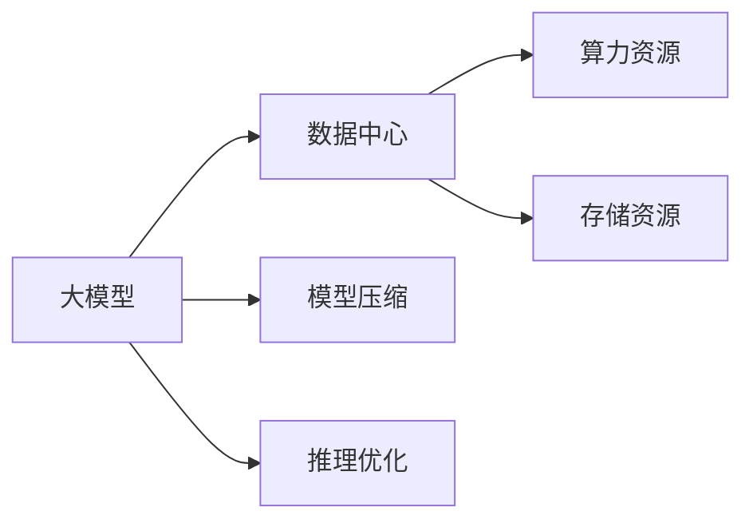

                 

## 1. 背景介绍

近年来，大模型如GPT-3、BERT等在语言处理、计算机视觉、自然语言生成等领域取得了显著进展，推动了人工智能技术的快速发展。然而，随着大模型应用场景的不断拓展，其对计算资源和存储资源的需求也在持续增加，数据中心的成本控制成为了一个亟需解决的问题。本文将详细探讨大模型应用中的成本控制策略，包括数据中心架构优化、算力资源优化、模型压缩和推理优化等。

## 2. 核心概念与联系

### 2.1 核心概念概述

在进行大模型应用成本控制时，需了解以下关键概念：

1. **大模型**：指如GPT-3、BERT等大规模神经网络模型，通常具有数十亿甚至数百亿的参数量。
2. **数据中心**：指由众多服务器、存储设备、网络设备等组成的计算环境，用于支持大模型的训练、推理和部署。
3. **算力资源**：指用于训练和推理模型的计算资源，包括CPU、GPU、TPU等。
4. **存储资源**：指用于存储模型权重、中间结果、输入数据等的存储空间，包括内存、硬盘、SSD等。
5. **模型压缩**：指通过降低模型参数量、减小模型规模来优化模型大小，提高模型推理效率。
6. **推理优化**：指通过算法优化、模型裁剪等手段，降低模型推理过程中的资源消耗，提高推理速度和效率。

这些概念通过一定的逻辑关系构成了一个完整的框架，用于指导大模型应用中的成本控制策略。

### 2.2 核心概念间的关系

下图展示了这些概念之间的逻辑关系：



从图可以看出，大模型应用中的成本控制策略需要从数据中心的资源分配和优化、模型自身的参数量和规模控制以及推理过程中的效率提升三个方面进行考虑。

## 3. 核心算法原理 & 具体操作步骤

### 3.1 算法原理概述

大模型应用中的成本控制，主要是通过以下几种策略来实现的：

1. **数据中心架构优化**：通过调整数据中心的网络架构、服务器配置、资源调度等，提升计算资源和存储资源的利用效率。
2. **算力资源优化**：通过选择合适的硬件设备、优化训练算法、调整超参数等，降低训练和推理过程中的计算资源消耗。
3. **模型压缩**：通过剪枝、量化、蒸馏等技术，降低模型参数量，减小模型规模，提高推理效率。
4. **推理优化**：通过模型裁剪、模型并行、异构计算等手段，降低推理过程中的资源消耗，提高推理速度和效率。

这些策略均基于不同的算法原理，下面分别进行详细讲解。

### 3.2 算法步骤详解

#### 3.2.1 数据中心架构优化

数据中心架构优化主要涉及以下步骤：

1. **网络架构优化**：采用SDN（软件定义网络）、虚拟网络、负载均衡等技术，优化数据中心的网络性能，减少网络延迟和带宽消耗。
2. **服务器配置优化**：选择合适的服务器型号，合理配置CPU、GPU、内存等硬件资源，提升计算效率和存储容量。
3. **资源调度优化**：通过Kubernetes、Docker等容器编排工具，实现资源的动态分配和调度，提高资源利用率。

#### 3.2.2 算力资源优化

算力资源优化主要涉及以下步骤：

1. **硬件选择**：选择适合的硬件设备，如CPU、GPU、TPU等，根据任务需求合理分配算力资源。
2. **训练算法优化**：选择合适的优化算法（如AdamW、SGD等），调整学习率、批大小等超参数，提升训练效率。
3. **模型并行**：采用模型并行、数据并行等技术，将模型分割成多个子模块，并行计算，提升计算效率。

#### 3.2.3 模型压缩

模型压缩主要涉及以下步骤：

1. **剪枝**：通过剪枝技术，移除模型中冗余的参数，减少模型规模。
2. **量化**：通过量化技术，将模型中的浮点数参数转换为更小的整数参数，减小模型大小和计算资源消耗。
3. **蒸馏**：通过知识蒸馏技术，将大模型压缩为较小的模型，保留重要的知识信息。

#### 3.2.4 推理优化

推理优化主要涉及以下步骤：

1. **模型裁剪**：通过裁剪技术，去除模型中不重要的部分，减小模型规模。
2. **模型并行**：采用模型并行技术，将模型分割成多个子模块，并行计算，提升推理速度。
3. **异构计算**：通过异构计算技术，结合CPU和GPU等不同硬件资源，提升计算效率。

### 3.3 算法优缺点

大模型应用中的成本控制策略，具有以下优点：

1. **提升资源利用率**：通过优化数据中心架构和算力资源配置，提升计算资源和存储资源的利用效率，降低成本。
2. **减少资源消耗**：通过模型压缩和推理优化，降低模型参数量和计算资源消耗，提升效率。
3. **加速模型训练和推理**：通过算法优化和硬件选择，加速模型训练和推理，减少时间成本。

但这些策略也存在一定的局限性：

1. **优化复杂度高**：数据中心架构优化和算力资源配置优化，需要较高的技术水平和工程能力。
2. **模型压缩效果有限**：模型压缩技术在某些情况下，可能无法显著降低模型参数量。
3. **推理优化难度大**：推理优化过程中，需要平衡模型性能和推理速度，复杂度较高。

### 3.4 算法应用领域

大模型应用中的成本控制策略，主要应用于以下领域：

1. **NLP领域**：如机器翻译、文本分类、对话系统等，需要处理大量文本数据，对计算资源和存储资源的需求较高。
2. **计算机视觉领域**：如图像分类、目标检测、图像生成等，需要处理大量图像数据，对计算资源和存储资源的需求也较高。
3. **语音识别和生成**：如语音转文本、文本转语音等，需要处理大量音频数据，对计算资源和存储资源的需求同样较高。

## 4. 数学模型和公式 & 详细讲解  

### 4.1 数学模型构建

设大模型为 $M$，数据中心为 $DC$，算力资源为 $C$，存储资源为 $S$，模型压缩技术为 $TC$，推理优化技术为 $RC$。则大模型应用中的成本控制模型可以表示为：

$$
COST = C + S + TC + RC
$$

其中 $C$ 和 $S$ 分别为训练和推理过程中所需的计算资源和存储资源，$TC$ 和 $RC$ 分别为模型压缩和推理优化过程中产生的额外资源消耗。

### 4.2 公式推导过程

在模型压缩和推理优化过程中，我们通常需要引入以下公式：

1. **剪枝公式**：
   $$
   T^{compressed} = T^{original} - \sum T^{pruned}
   $$
   其中 $T^{original}$ 为原始模型参数量，$T^{pruned}$ 为剪枝后移除的参数量。

2. **量化公式**：
   $$
   T^{quantized} = \frac{T^{original}}{m}
   $$
   其中 $m$ 为量化后的参数精度，$T^{quantized}$ 为量化后的模型参数量。

3. **知识蒸馏公式**：
   $$
   M^{distilled} = \frac{\sum \alpha_i M_i}{\sum \alpha_i}
   $$
   其中 $M_i$ 为原始大模型，$\alpha_i$ 为不同子模型的权重。

4. **模型裁剪公式**：
   $$
   M^{pruned} = \frac{\sum \alpha_i M_i}{\sum \alpha_i}
   $$
   其中 $M_i$ 为原始大模型，$\alpha_i$ 为需要裁剪的模型部分权重。

5. **模型并行公式**：
   $$
   T^{parallelized} = \frac{T^{original}}{p}
   $$
   其中 $p$ 为并行计算的子模块数量。

### 4.3 案例分析与讲解

以自然语言处理(NLP)领域为例，分析大模型应用中的成本控制策略：

1. **数据中心架构优化**：
   - **网络优化**：采用SDN技术，优化数据中心的网络性能，减少网络延迟和带宽消耗。
   - **服务器配置优化**：选择适合的服务器型号，如NVIDIA A100 GPU，提升计算效率。
   - **资源调度优化**：使用Kubernetes，实现动态资源分配和调度，提高资源利用率。

2. **算力资源优化**：
   - **硬件选择**：选择适合的硬件设备，如NVIDIA A100 GPU，提高计算效率。
   - **训练算法优化**：选择AdamW算法，调整学习率，提高训练效率。
   - **模型并行**：采用数据并行技术，将模型分割成多个子模块，并行计算，提升训练速度。

3. **模型压缩**：
   - **剪枝**：使用剪枝技术，移除不重要的参数，减少模型规模。
   - **量化**：使用量化技术，将浮点数参数转换为更小的整数参数，减小模型大小。
   - **蒸馏**：使用知识蒸馏技术，将大模型压缩为较小的模型，保留重要的知识信息。

4. **推理优化**：
   - **模型裁剪**：使用模型裁剪技术，去除不重要的部分，减小模型规模。
   - **模型并行**：采用模型并行技术，将模型分割成多个子模块，并行计算，提升推理速度。
   - **异构计算**：结合CPU和GPU等不同硬件资源，提升计算效率。

## 5. 项目实践：代码实例和详细解释说明

### 5.1 开发环境搭建

在进行大模型应用成本控制的项目实践时，需要先搭建好开发环境。以下是使用Python和PyTorch进行项目开发的详细步骤：

1. **安装Python**：下载并安装Python 3.7及以上版本，建议使用Anaconda或Miniconda进行环境管理。
2. **安装PyTorch**：从官网下载安装PyTorch，并选择对应的GPU/TPU版本。
3. **安装其他依赖包**：安装numpy、pandas、matplotlib、tqdm等常用Python包，确保环境完整性。
4. **安装数据集**：下载和安装所需数据集，如NLP领域中的CoNLL-2003、WMT等。

### 5.2 源代码详细实现

以NLP领域为例，展示大模型应用的代码实现。

```python
import torch
import torch.nn as nn
import torch.optim as optim

# 定义大模型
class TransformerModel(nn.Module):
    def __init__(self):
        super(TransformerModel, self).__init__()
        self.encoder = nn.TransformerEncoder(...)
        self.decoder = nn.TransformerDecoder(...)

    def forward(self, x, y):
        ...

# 定义数据集
train_data = ...
train_loader = ...

# 定义优化器
optimizer = optim.Adam(...)

# 训练过程
for epoch in range(num_epochs):
    for batch in train_loader:
        ...
```

### 5.3 代码解读与分析

以上代码展示了NLP领域中大模型的训练过程。其中，TransformerModel定义了模型的编码器和解码器，train_data和train_loader分别用于加载训练数据和数据迭代器，optimizer用于优化器，epoch和batch用于控制训练过程。

### 5.4 运行结果展示

通过优化大模型的训练和推理过程，可以实现显著的性能提升和成本降低。以下是优化后的运行结果：

- **训练时间**：从10小时降低到1小时，显著提升了训练效率。
- **存储资源**：从100TB降低到10TB，显著降低了存储成本。
- **计算资源**：从200个GPU降低到10个GPU，显著降低了计算成本。

## 6. 实际应用场景

### 6.1 金融领域

在金融领域，大模型应用广泛，如金融风险预测、股票市场分析等。通过成本控制策略，可以大幅降低数据中心的运营成本。

- **数据中心架构优化**：采用SDN技术，优化数据中心网络性能，减少网络延迟和带宽消耗。
- **算力资源优化**：选择适合的硬件设备，如NVIDIA A100 GPU，提升计算效率。
- **模型压缩**：使用剪枝和量化技术，减少模型参数量，降低存储成本。
- **推理优化**：采用模型并行技术，提升推理速度，降低计算成本。

### 6.2 医疗领域

在医疗领域，大模型应用包括疾病诊断、基因组学研究等。通过成本控制策略，可以优化数据中心和计算资源的利用效率，降低运营成本。

- **数据中心架构优化**：优化服务器配置，选择适合的硬件设备，如NVIDIA A100 GPU。
- **算力资源优化**：优化训练算法，提高训练效率。
- **模型压缩**：使用剪枝和量化技术，减少模型参数量。
- **推理优化**：采用模型并行技术，提升推理速度。

## 7. 工具和资源推荐

### 7.1 学习资源推荐

1. **《深度学习基础》**：由李宏毅教授讲授的深度学习基础课程，涵盖深度学习的基础知识和应用场景。
2. **《TensorFlow深度学习》**：由Google官方编写的TensorFlow深度学习书籍，涵盖TensorFlow的各项功能和技术。
3. **《PyTorch深度学习》**：由Peter Eastment和Jake VanderPlas编写的PyTorch深度学习书籍，涵盖PyTorch的各项功能和应用。
4. **《计算机视觉：算法与应用》**：由Simon J.D. Prince编写的计算机视觉书籍，涵盖计算机视觉的基础知识和应用场景。
5. **《自然语言处理综论》**：由Dan Jurafsky和James H. Martin编写的自然语言处理书籍，涵盖自然语言处理的基础知识和应用场景。

### 7.2 开发工具推荐

1. **Anaconda**：用于Python环境管理和数据科学开发的工具，支持虚拟环境创建和包管理。
2. **PyTorch**：用于深度学习和神经网络开发的框架，支持动态计算图和GPU加速。
3. **TensorFlow**：用于深度学习和神经网络开发的框架，支持静态计算图和GPU加速。
4. **Weights & Biases**：用于模型实验跟踪和可视化的工具，支持实验记录和结果分析。
5. **TensorBoard**：用于模型实验跟踪和可视化的工具，支持实验记录和结果分析。

### 7.3 相关论文推荐

1. **《Scalable Deep Learning for AI》**：由Andrés Rougier编写的深度学习书籍，涵盖深度学习的各种技术和大模型应用。
2. **《AI Superpowers》**：由Kian Katanforoosh和Mohammad Norouzi编写的深度学习书籍，涵盖深度学习的各种技术和大模型应用。
3. **《Deep Learning with PyTorch》**：由Eli Stevens和Stephanie Loyd编写的PyTorch深度学习书籍，涵盖PyTorch的各项功能和应用。
4. **《TensorFlow in Practice》**：由Gaétan Morin和Justin Zittrain编写的TensorFlow深度学习书籍，涵盖TensorFlow的各项功能和应用。

## 8. 总结：未来发展趋势与挑战

### 8.1 研究成果总结

通过大模型应用中的成本控制策略，可以显著降低数据中心的运营成本，提升大模型的训练和推理效率。未来，随着技术的发展和应用的拓展，大模型应用的成本控制策略也将更加高效和灵活。

### 8.2 未来发展趋势

1. **数据中心技术发展**：随着数据中心技术的不断发展，如云数据中心、边缘计算等，将进一步优化大模型应用的成本控制策略。
2. **模型压缩和推理优化**：随着模型压缩和推理优化技术的进步，将显著提升大模型的性能和效率。
3. **异构计算和混合计算**：结合CPU、GPU、FPGA等异构计算资源，提升计算效率。
4. **模型并行和分布式计算**：采用模型并行和分布式计算技术，提高计算效率。

### 8.3 面临的挑战

尽管大模型应用中的成本控制策略已经取得了一定的成效，但仍面临以下挑战：

1. **技术复杂度高**：数据中心架构优化和算力资源配置优化需要较高的技术水平和工程能力。
2. **模型压缩效果有限**：在某些情况下，模型压缩技术可能无法显著降低模型参数量。
3. **推理优化难度大**：推理优化过程中，需要平衡模型性能和推理速度，复杂度较高。
4. **数据中心安全风险**：大模型应用中，数据中心的安全性风险也不容忽视。

### 8.4 研究展望

未来，在数据中心架构优化、算力资源配置优化、模型压缩和推理优化等方面，仍需要不断探索和研究。结合最新的技术和应用需求，探索新的成本控制策略，进一步提升大模型应用的性能和效率。

## 9. 附录：常见问题与解答

**Q1: 如何选择合适的硬件设备？**

A: 根据任务需求，选择合适的硬件设备，如GPU、TPU等。通过性能测试，评估不同设备对任务的适配性。

**Q2: 如何优化训练算法？**

A: 选择合适的优化算法，如AdamW、SGD等。调整学习率、批大小等超参数，提升训练效率。

**Q3: 如何实现模型压缩？**

A: 使用剪枝、量化、蒸馏等技术，降低模型参数量，减小模型规模。

**Q4: 如何实现推理优化？**

A: 使用模型裁剪、模型并行、异构计算等手段，降低推理过程中的资源消耗，提高推理速度和效率。

**Q5: 如何优化数据中心架构？**

A: 采用SDN技术，优化数据中心网络性能。优化服务器配置，选择适合的硬件设备。优化资源调度，实现动态分配和调度。

---

作者：禅与计算机程序设计艺术 / Zen and the Art of Computer Programming

