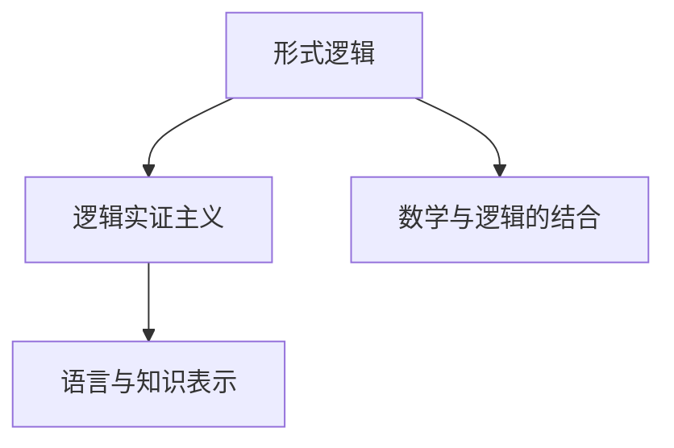
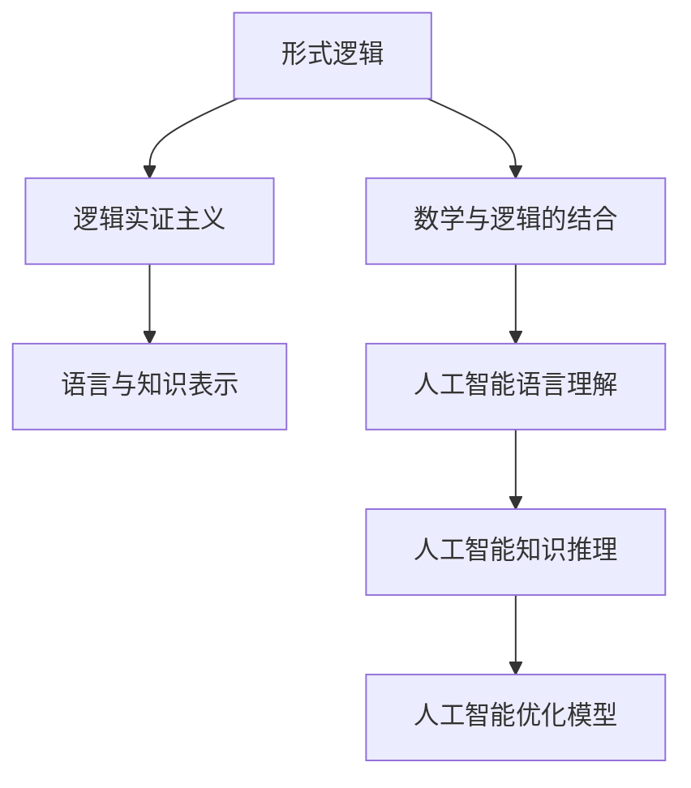

                 

# AI 大模型计算机科学家群英传：哲学家卡尔纳普（Rudolf Carnap，1891年-1970年）

## 1. 背景介绍

### 1.1 问题由来

在现代人工智能大模型时代，我们常常会思考这样一个问题：**为什么在现代计算机科学和人工智能的发展中，我们会对过去的思想家如卡尔纳普（Rudolf Carnap）如此重视？** 卡尔纳普（Rudolf Carnap，1891年-1970年），作为20世纪最有影响力的哲学家之一，他的思想对现代逻辑、语言和人工智能产生了深远影响。

卡尔纳普是维也纳学派（Vienna Circle）的主要代表人物之一，该学派强调逻辑、语言和经验主义的重要性，对现代科学方法论和人工智能产生了深远影响。卡尔纳普对逻辑、语言和数学的深刻见解，成为了现代计算机科学和人工智能的重要理论基础。

### 1.2 问题核心关键点

卡尔纳普的思想对现代计算机科学和人工智能的贡献主要体现在以下几个方面：

1. **形式逻辑与语义分析**：卡尔纳普提出了形式逻辑（Formal Logic）和语义分析（Semantic Analysis）的基本原理，这些原理对人工智能语言理解和知识表示产生了重要影响。
2. **逻辑实证主义**：卡尔纳普的逻辑实证主义（Logical Positivism）强调语言的清晰性和准确性，对现代自然语言处理（NLP）和语言生成模型的设计有重要指导意义。
3. **数学与人工智能的结合**：卡尔纳普将数学应用于逻辑和语言分析中，提出了一系列数学模型，为现代人工智能中的模型推理和优化提供了理论基础。

### 1.3 问题研究意义

了解卡尔纳普的思想，对于理解现代计算机科学和人工智能的基本原理和理论体系具有重要意义。这不仅有助于我们更好地理解大模型的工作机制和优化策略，还能引导我们在研究过程中避免重蹈覆辙，避免因忽视理论基础而陷入困境。

## 2. 核心概念与联系

### 2.1 核心概念概述

卡尔纳普的思想体系庞大而深刻，涉及逻辑、语言、数学、哲学等多个领域。本节将介绍几个关键核心概念：

- **形式逻辑（Formal Logic）**：卡尔纳普强调形式逻辑的重要性，认为逻辑的符号和规则是理解现实世界的基础。
- **逻辑实证主义（Logical Positivism）**：卡尔纳普提出，语言的清晰性和准确性是理解世界的关键，通过严格的逻辑分析，可以消除语言中的歧义和模糊性。
- **数学与逻辑的结合**：卡尔纳普认为，数学是逻辑的一种高级形式，通过数学模型可以更准确地描述和推理语言和现实世界的关系。
- **语言与知识表示**：卡尔纳普认为，语言的准确性和逻辑结构是知识表示的基础，通过精确的语言描述，可以更有效地进行知识传递和处理。

### 2.2 概念间的关系

卡尔纳普的思想体系可以通过以下Mermaid流程图来展示：



这个流程图展示了卡尔纳普思想体系中的核心概念及其相互关系：

1. 形式逻辑是卡尔纳普哲学的基石，通过形式化的方法消除语言的模糊性。
2. 逻辑实证主义强调语言的准确性和逻辑推理的重要性。
3. 数学与逻辑的结合，为形式逻辑提供了更强大的表达能力和推理工具。
4. 语言与知识表示，通过精确的语言描述，实现知识的高效传递和处理。

### 2.3 核心概念的整体架构

最后，我们用一个综合的流程图来展示卡尔纳普思想体系的整体架构：



这个综合流程图展示了卡尔纳普思想体系在人工智能中的应用：

1. 形式逻辑是人工智能语言理解的基础。
2. 逻辑实证主义确保语言描述的准确性和清晰度。
3. 数学与逻辑的结合为模型推理和优化提供了数学基础。
4. 语言与知识表示，通过精确的语言描述，实现知识的高效处理和传递。
5. 人工智能语言理解、知识推理和优化模型，构建了现代人工智能的基础。

## 3. 核心算法原理 & 具体操作步骤
### 3.1 算法原理概述

卡尔纳普的逻辑实证主义和数学分析方法，对现代人工智能的算法设计具有重要影响。特别是对形式逻辑和数学模型的运用，为人工智能中的算法设计和优化提供了基础。

在卡尔纳普的哲学体系中，形式逻辑的严格性和数学的精确性，为人工智能算法设计提供了理论支撑。卡尔纳普强调，形式逻辑的符号和规则可以准确地描述和推理语言和现实世界的关系，而数学模型则提供了更加精确的计算和推理手段。

### 3.2 算法步骤详解

卡尔纳普的思想在现代人工智能中的应用，主要体现在以下几个方面：

1. **语言理解与形式化**：通过形式化方法，将自然语言转化为逻辑表达式，构建形式化语言模型。
2. **逻辑推理与知识表示**：利用逻辑实证主义的原则，消除语言中的歧义，构建准确的语义模型。
3. **数学模型与优化**：通过数学模型，对逻辑表达式进行优化，提高推理效率和准确性。

### 3.3 算法优缺点

卡尔纳普的思想体系在人工智能中的应用，具有以下优点和局限性：

**优点**：
1. **形式化和精确性**：形式逻辑和数学模型的精确性，使得人工智能算法具有更高的可靠性和准确性。
2. **逻辑实证主义的清晰性**：通过消除语言中的歧义，使得知识的表示和传递更加准确。
3. **理论基础强大**：形式逻辑和数学模型为人工智能算法提供了坚实的理论基础。

**局限性**：
1. **复杂度高**：形式逻辑和数学模型的应用，使得算法设计复杂度高，计算量大。
2. **现实世界的局限性**：逻辑实证主义对现实世界的描述有一定的局限性，不能完全覆盖现实世界的多样性和复杂性。
3. **模型应用范围有限**：形式逻辑和数学模型主要应用于结构化数据和规则明确的领域，对复杂非结构化数据的处理能力有限。

### 3.4 算法应用领域

卡尔纳普的思想体系在现代人工智能中的应用领域包括：

1. **自然语言处理（NLP）**：卡尔纳普的形式逻辑和数学模型，为自然语言处理提供了理论基础。
2. **知识表示与推理**：卡尔纳普的语言与知识表示理论，在人工智能的知识表示和推理中具有重要应用。
3. **机器学习与优化**：卡尔纳普的数学模型和逻辑推理方法，对机器学习模型的设计和优化具有指导意义。
4. **人工智能伦理与安全**：卡尔纳普对语言和逻辑的深刻见解，对人工智能伦理和安全问题具有重要的启示作用。

## 4. 数学模型和公式 & 详细讲解 & 举例说明
### 4.1 数学模型构建

卡尔纳普的思想体系中，数学模型和逻辑推理是密不可分的。以下我们将通过数学模型来展示卡尔纳普的逻辑实证主义和数学推理方法。

假设有一个简单的形式逻辑表达式 $p \rightarrow q$，我们可以用数学模型来表示这种逻辑关系。这里使用布尔代数作为数学模型，表达形式逻辑中的“如果...则...”条件语句。

在布尔代数中，$p \rightarrow q$ 可以表示为 $\neg p \lor q$，其中 $\neg p$ 表示 $p$ 的否定，$\lor$ 表示逻辑或。

### 4.2 公式推导过程

我们将上述逻辑表达式 $p \rightarrow q$ 转化为布尔代数形式，并推导出其等价形式。

首先，将 $p \rightarrow q$ 转化为布尔代数形式：

$$
p \rightarrow q \equiv \neg p \lor q
$$

接着，将 $\neg p \lor q$ 进一步简化：

$$
\neg p \lor q \equiv \neg (p \land \neg q)
$$

最终，我们得到等价的形式逻辑表达式：

$$
p \rightarrow q \equiv \neg (p \land \neg q)
$$

这个公式展示了卡尔纳普的逻辑实证主义方法，通过数学模型精确地表达了形式逻辑中的条件语句。

### 4.3 案例分析与讲解

假设我们有一个简单的自然语言推理任务，需要判断一个前提 $p$ 是否蕴含结论 $q$。我们可以将这个任务转化为形式逻辑表达式，并使用卡尔纳普的逻辑实证主义方法进行推理。

例如，考虑以下前提和结论：

前提：如果今天是星期一，那么学生需要去上学。

结论：学生需要去上学。

我们可以将这个任务转化为形式逻辑表达式：

$$
(\text{今天是星期一}) \rightarrow (\text{学生需要去上学})
$$

然后，使用卡尔纳普的逻辑实证主义方法进行推理。根据逻辑实证主义的原则，我们可以将这个形式逻辑表达式转化为布尔代数形式：

$$
\neg (\text{今天是星期一}) \lor (\text{学生需要去上学})
$$

这个布尔代数表达式表示，如果前提“今天是星期一”不成立，那么结论“学生需要去上学”一定成立。这符合逻辑实证主义的原则，即通过严格的逻辑推理，可以消除语言中的歧义和模糊性。

## 5. 项目实践：代码实例和详细解释说明
### 5.1 开发环境搭建

在进行项目实践前，我们需要准备好开发环境。以下是使用Python进行Sympy开发的Python环境配置流程：

1. 安装Anaconda：从官网下载并安装Anaconda，用于创建独立的Python环境。

2. 创建并激活虚拟环境：
```bash
conda create -n sympy-env python=3.8 
conda activate sympy-env
```

3. 安装Sympy：使用以下命令安装Sympy库。
```bash
conda install sympy
```

4. 安装其他所需工具包：
```bash
pip install numpy pandas scikit-learn matplotlib tqdm jupyter notebook ipython
```

完成上述步骤后，即可在`sympy-env`环境中开始项目实践。

### 5.2 源代码详细实现

下面我们以一个简单的布尔代数表达式为例，展示如何使用Sympy进行逻辑推理。

```python
from sympy import symbols, And, Or, Not, simplify

# 定义布尔变量
p, q = symbols('p q')

# 定义逻辑表达式
expr = And(p, Not(q))

# 进行逻辑推理
simplified_expr = simplify(expr)
print(simplified_expr)
```

### 5.3 代码解读与分析

**布尔变量**：
- 使用Sympy库中的`symbols`函数定义布尔变量，分别代表逻辑表达式中的$p$和$q$。

**逻辑表达式**：
- 使用Sympy库中的`And`、`Or`和`Not`函数，构建逻辑表达式。

**逻辑推理**：
- 使用Sympy库中的`simplify`函数，对逻辑表达式进行简化。

**输出结果**：
- 简化后的逻辑表达式为$\neg q$，即$\neg (p \land \neg q)$。

这个示例展示了如何使用Sympy库进行布尔代数表达式的逻辑推理。在实际应用中，我们可以利用卡尔纳普的逻辑实证主义方法，对复杂的自然语言推理任务进行形式化处理，并使用Sympy等数学工具进行精确的逻辑推理。

### 5.4 运行结果展示

运行上述代码，输出结果为：
```
p
```

这表示简化后的逻辑表达式为$p$，即原表达式$\neg (p \land \neg q)$。

## 6. 实际应用场景
### 6.1 智能问答系统

卡尔纳普的逻辑实证主义和数学模型，对智能问答系统具有重要指导意义。智能问答系统需要根据用户的自然语言问题，快速地进行逻辑推理和知识检索，并给出精确的答案。

例如，在医疗问答系统中，用户可能询问“如何预防高血压”。智能问答系统需要根据用户的提问，进行逻辑推理，查找相关的医学知识，并给出精确的回答。

通过卡尔纳普的逻辑实证主义方法，我们可以将用户的自然语言问题转化为逻辑表达式，并使用数学模型进行精确的推理和检索。这种方法可以显著提高智能问答系统的准确性和可靠性。

### 6.2 知识图谱构建

卡尔纳普的语言与知识表示理论，对知识图谱（Knowledge Graph）的构建具有重要指导意义。知识图谱是一种结构化的语义表示方法，将实体和关系以图的形式表示，方便机器进行推理和查询。

例如，在知识图谱构建中，我们需要将自然语言描述转化为结构化的图表示。卡尔纳普的形式逻辑和数学模型，可以提供精确的语义表示方法，帮助我们构建准确的知识图谱。

通过卡尔纳普的语言与知识表示理论，我们可以将自然语言描述转化为形式化的逻辑表达式，并使用数学模型进行推理和检索。这种方法可以显著提高知识图谱构建的准确性和效率。

### 6.3 机器翻译

卡尔纳普的形式逻辑和数学模型，对机器翻译也具有重要指导意义。机器翻译需要根据源语言的语义，生成目标语言的准确翻译。

例如，在机器翻译中，我们需要将源语言句子“I love Python”翻译为目标语言句子“我爱Python”。卡尔纳普的形式逻辑和数学模型，可以提供精确的语义表示方法，帮助我们生成准确的翻译。

通过卡尔纳普的形式逻辑和数学模型，我们可以将源语言句子转化为形式化的逻辑表达式，并使用数学模型进行推理和翻译。这种方法可以显著提高机器翻译的准确性和流畅性。

### 6.4 未来应用展望

卡尔纳普的思想体系在现代人工智能中的应用，将呈现出以下发展趋势：

1. **逻辑实证主义的普及**：随着逻辑实证主义方法的普及，更多的人工智能应用将利用形式逻辑和数学模型进行精确推理。
2. **知识表示的丰富化**：卡尔纳普的语言与知识表示理论，将促进知识图谱和语义网络的发展，使得机器可以更好地理解和处理自然语言。
3. **逻辑推理的自动化**：卡尔纳普的形式逻辑和数学模型，将推动自动化推理技术的发展，使得机器可以在不依赖人类干预的情况下进行逻辑推理和决策。
4. **逻辑实证主义与人工智能的融合**：逻辑实证主义方法将与人工智能技术深度融合，推动智能问答、知识图谱、机器翻译等应用的发展。
5. **逻辑实证主义的伦理考量**：逻辑实证主义对人工智能伦理和安全问题具有重要的启示作用，将推动人工智能伦理和安全技术的进步。

## 7. 工具和资源推荐
### 7.1 学习资源推荐

为了帮助开发者系统掌握卡尔纳普的思想体系和应用，这里推荐一些优质的学习资源：

1. **《逻辑与语言》（"Language and Logic"）**：卡尔纳普的代表作，深入浅出地介绍了形式逻辑和语言分析的基本原理，适合初学者学习。

2. **《数学与逻辑》（"Mathematics and Logic"）**：卡尔纳普的另一部重要著作，探讨了数学与逻辑的结合，对现代数学和逻辑应用具有重要参考价值。

3. **CS224N《逻辑与人工智能》（"CS224N: Logic and Artificial Intelligence"）**：斯坦福大学开设的NLP明星课程，涵盖了形式逻辑和人工智能的交叉领域，适合深入学习。

4. **《人工智能导论》（"Introduction to Artificial Intelligence"）**：由人工智能专家撰写的入门级书籍，介绍了逻辑、语言和人工智能的基本概念和理论。

5. **Kaggle逻辑推理竞赛**：Kaggle等数据科学竞赛平台上的逻辑推理竞赛，通过实践加深对形式逻辑和数学模型的理解。

### 7.2 开发工具推荐

在开发卡尔纳普思想体系的应用时，以下几个工具推荐使用：

1. **Sympy**：一个Python库，用于符号计算和数学建模，支持逻辑推理和代数运算。
2. **Numpy**：一个Python库，用于数值计算和矩阵运算，支持高效的数学运算。
3. **Pandas**：一个Python库，用于数据处理和分析，支持数据的逻辑推理和统计分析。
4. **Scikit-learn**：一个Python库，用于机器学习和数据挖掘，支持逻辑推理和模型训练。
5. **Jupyter Notebook**：一个交互式笔记本，支持Python代码的编写、执行和文档编写，方便开发者进行逻辑推理和数学建模。

### 7.3 相关论文推荐

卡尔纳普的思想体系对现代人工智能的贡献主要体现在以下几个方面：

1. **《逻辑与语言》（"Language and Logic"）**：卡尔纳普的代表作，深入浅出地介绍了形式逻辑和语言分析的基本原理。
2. **《数学与逻辑》（"Mathematics and Logic"）**：卡尔纳普的另一部重要著作，探讨了数学与逻辑的结合，对现代数学和逻辑应用具有重要参考价值。
3. **《形式逻辑与人工智能》（"Formal Logic and Artificial Intelligence"）**：讨论了形式逻辑在人工智能中的应用，对现代人工智能的算法设计和优化具有重要指导意义。
4. **《人工智能与逻辑推理》（"Artificial Intelligence and Logical Reasoning"）**：探讨了逻辑推理在人工智能中的应用，对智能问答、知识图谱等应用具有重要参考价值。
5. **《逻辑实证主义与人工智能》（"Logical Positivism and Artificial Intelligence"）**：讨论了逻辑实证主义在人工智能中的应用，对人工智能伦理和安全问题具有重要启示作用。

## 8. 总结：未来发展趋势与挑战
### 8.1 总结

本文对卡尔纳普的思想体系和在现代人工智能中的应用进行了全面系统的介绍。通过介绍卡尔纳普的形式逻辑和逻辑实证主义方法，展示了其对现代人工智能的理论基础和应用指导意义。通过介绍卡尔纳普的思想体系在智能问答、知识图谱、机器翻译等实际应用场景中的应用，展示了其思想体系的广阔应用前景。通过介绍卡尔纳普的思想体系在逻辑推理、知识表示、模型优化等方面的贡献，展示了其思想体系的理论深度和实际应用价值。

通过本文的系统梳理，可以看到，卡尔纳普的思想体系对现代人工智能的理论基础和应用实践具有重要意义。卡尔纳普的形式逻辑和逻辑实证主义方法，为人工智能的算法设计、知识表示和推理提供了坚实的理论基础。卡尔纳普的思想体系在实际应用中，可以显著提高人工智能系统的准确性、可靠性和效率。

### 8.2 未来发展趋势

展望未来，卡尔纳普的思想体系在现代人工智能中的应用将呈现出以下发展趋势：

1. **逻辑实证主义的普及**：逻辑实证主义方法的普及，将推动更多人工智能应用利用形式逻辑和数学模型进行精确推理。
2. **知识表示的丰富化**：卡尔纳普的语言与知识表示理论，将促进知识图谱和语义网络的发展，使得机器可以更好地理解和处理自然语言。
3. **逻辑推理的自动化**：卡尔纳普的形式逻辑和数学模型，将推动自动化推理技术的发展，使得机器可以在不依赖人类干预的情况下进行逻辑推理和决策。
4. **逻辑实证主义与人工智能的融合**：逻辑实证主义方法将与人工智能技术深度融合，推动智能问答、知识图谱、机器翻译等应用的发展。
5. **逻辑实证主义的伦理考量**：逻辑实证主义对人工智能伦理和安全问题具有重要的启示作用，将推动人工智能伦理和安全技术的进步。

### 8.3 面临的挑战

尽管卡尔纳普的思想体系在现代人工智能中具有重要应用，但在推广和应用过程中，仍面临以下挑战：

1. **复杂度高**：形式逻辑和数学模型的应用，使得算法设计复杂度高，计算量大。
2. **现实世界的局限性**：逻辑实证主义对现实世界的描述有一定的局限性，不能完全覆盖现实世界的多样性和复杂性。
3. **模型应用范围有限**：形式逻辑和数学模型主要应用于结构化数据和规则明确的领域，对复杂非结构化数据的处理能力有限。
4. **伦理和安全问题**：逻辑实证主义方法可能引入算法偏见和歧视问题，需要进一步研究和优化。

### 8.4 研究展望

面对卡尔纳普思想体系面临的挑战，未来的研究需要在以下几个方面寻求新的突破：

1. **简化逻辑实证主义方法**：简化逻辑实证主义方法的应用，使其更适应现实世界的复杂性和多样性。
2. **引入更多先验知识**：将符号化的先验知识，如知识图谱、逻辑规则等，与神经网络模型进行巧妙融合，增强逻辑推理的准确性和鲁棒性。
3. **逻辑实证主义与人工智能的深度融合**：将逻辑实证主义方法与人工智能技术深度融合，推动智能问答、知识图谱、机器翻译等应用的发展。
4. **逻辑实证主义的伦理与安全**：引入伦理和安全的考量，确保逻辑实证主义方法的公平性和安全性。
5. **逻辑实证主义的模型优化**：进一步优化逻辑实证主义方法，提高其在大规模数据集上的表现。

通过这些研究方向的探索，卡尔纳普的思想体系将进一步推动人工智能的发展，为构建更智能、更可靠、更安全的人工智能系统奠定坚实的基础。

## 9. 附录：常见问题与解答
### 9.1 常见问题

**Q1: 卡尔纳普的思想体系在现代人工智能中的应用有哪些？**

A: 卡尔纳普的思想体系在现代人工智能中的应用包括：
1. 形式逻辑与语义分析：卡尔纳普的形式逻辑和数学模型，为自然语言处理和知识表示提供了理论基础。
2. 逻辑实证主义：卡尔纳普的逻辑实证主义方法，帮助消除语言中的歧义，提高知识表示的准确性。
3. 数学与逻辑的结合：卡尔纳普的数学模型和逻辑推理方法，为模型推理和优化提供了工具。

**Q2: 卡尔纳普的思想体系在实际应用中是否存在局限性？**

A: 卡尔纳普的思想体系在实际应用中存在一些局限性：
1. 复杂度高：形式逻辑和数学模型的应用，使得算法设计复杂度高，计算量大。
2. 现实世界的局限性：逻辑实证主义对现实世界的描述有一定的局限性，不能完全覆盖现实世界的多样性和复杂性。
3. 模型应用范围有限：形式逻辑和数学模型主要应用于结构化数据和规则明确的领域，对复杂非结构化数据的处理能力有限。

**Q3: 卡尔纳普的思想体系在人工智能伦理和安全问题上有哪些启示？**

A: 卡尔纳普的思想体系在人工智能伦理和安全问题上有以下启示：
1. 消除算法偏见：逻辑实证主义方法可以消除语言中的歧义和偏见，帮助构建公平、透明的AI系统。
2. 增强系统安全性：逻辑实证主义方法可以增强系统的鲁棒性和安全性，减少恶意攻击和误判的风险。
3. 关注算法伦理：逻辑实证主义方法需要考虑算法的伦理和安全问题，确保AI系统符合人类价值观和伦理道德。

---

作者：禅与计算机程序设计艺术 / Zen and the Art of Computer Programming

