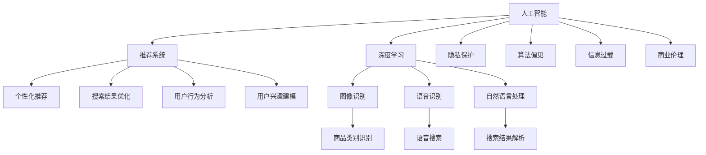
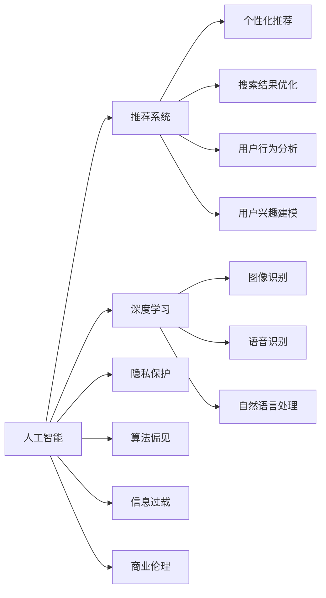
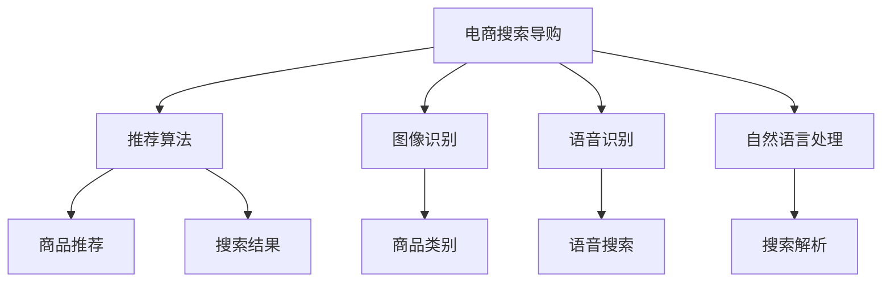
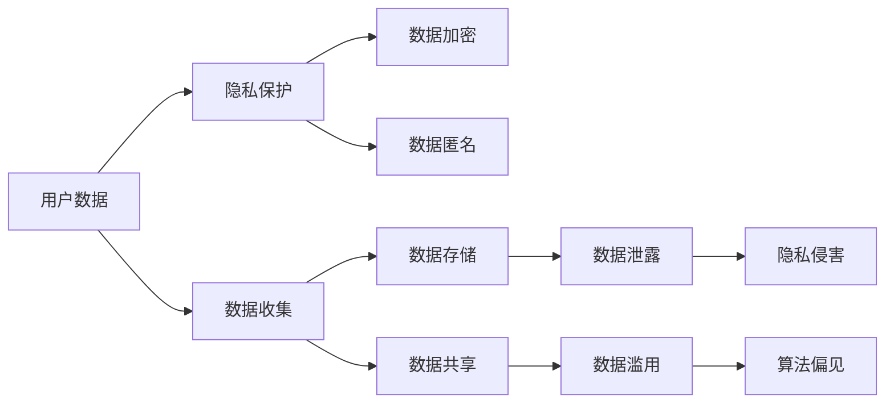

                 

# AI 技术在电商搜索导购中的伦理问题：探索技术应用的边界

## 1. 背景介绍

随着人工智能技术的不断发展和成熟，其在电商搜索导购中的应用日益普及。通过算法推荐、深度学习等技术手段，AI 能够为用户定制个性化的搜索结果和购物建议，极大地提升了用户的购物体验和商家的运营效率。然而，与此同时，AI 技术在电商搜索导购中的广泛应用也引发了一系列伦理问题，这些问题关系到用户的隐私保护、数据安全、公平公正等核心价值，需要我们引起高度重视。

### 1.1 问题由来

AI 技术在电商搜索导购中的应用主要体现在以下几个方面：

1. **推荐算法**：通过对用户历史行为数据的分析和建模，算法能够预测用户偏好，提供个性化的商品推荐。
2. **图像识别**：利用深度学习模型对商品图片进行识别，自动识别商品类别、品牌等信息，实现快速搜索。
3. **语音识别**：通过自然语言处理技术，实现语音搜索功能，提升用户体验。
4. **自然语言处理**：利用语言模型对用户输入的搜索词进行理解，提供更精准的搜索结果。

这些技术的广泛应用虽然极大地提升了电商平台的个性化和智能化水平，但也带来了诸如数据隐私、算法偏见、信息过载等伦理问题。这些问题不仅影响到用户的权益，也关系到电商平台的商业道德和社会责任。

### 1.2 问题核心关键点

AI 技术在电商搜索导购中的伦理问题主要集中在以下几个方面：

1. **用户隐私保护**：如何确保用户数据的隐私安全，防止数据被滥用或泄露。
2. **算法透明度**：如何提高算法决策的透明度，让用户理解并信任推荐结果。
3. **算法偏见**：如何识别和消除算法中的偏见，确保推荐结果的公平性。
4. **信息过载**：如何避免过度推荐导致用户信息过载，影响用户的决策。
5. **商业伦理**：如何在商业利益和用户利益之间找到平衡点，确保平台的公正性。

这些核心关键点构成了AI 技术在电商搜索导购中应用伦理问题的全貌。

## 2. 核心概念与联系

### 2.1 核心概念概述

为更好地理解AI 技术在电商搜索导购中的伦理问题，本节将介绍几个密切相关的核心概念：

1. **人工智能**：通过算法和模型实现智能决策的技术，其应用范围广泛，包括搜索导购、医疗诊断、金融预测等。
2. **推荐系统**：基于用户历史行为、兴趣偏好等数据，自动生成个性化的推荐结果的系统，广泛应用于电商、新闻、社交媒体等领域。
3. **深度学习**：一种基于神经网络的机器学习方法，能够处理大规模、高维度的数据，广泛应用于图像识别、语音识别、自然语言处理等领域。
4. **隐私保护**：确保用户数据的机密性、完整性和可用性，防止数据被未授权访问或滥用。
5. **算法偏见**：指算法在训练和应用过程中，由于数据、模型、参数等因素的影响，导致输出结果存在不公平或不公正的倾向。
6. **信息过载**：指用户接收到的信息超出了其处理能力，导致注意力分散、决策困难等问题。
7. **商业伦理**：涉及企业在经营活动中的道德规范和行为准则，关注企业如何平衡利润和社会责任。

这些核心概念之间的逻辑关系可以通过以下Mermaid流程图来展示：



这个流程图展示了大语言模型和大数据技术在电商搜索导购中的应用场景，以及其带来的伦理问题。

### 2.2 概念间的关系

这些核心概念之间存在着紧密的联系，形成了电商搜索导购中AI 技术应用的完整生态系统。下面我们通过几个Mermaid流程图来展示这些概念之间的关系。

#### 2.2.1 AI 技术的应用框架



这个流程图展示了AI 技术在电商搜索导购中的应用框架，以及其带来的伦理问题。

#### 2.2.2 推荐系统的构成



这个流程图展示了电商搜索导购中的推荐系统构成及其技术实现。

#### 2.2.3 数据隐私与算法偏见的关系



这个流程图展示了用户数据在电商搜索导购中的隐私保护与算法偏见之间的关系。

## 3. 核心算法原理 & 具体操作步骤
### 3.1 算法原理概述

AI 技术在电商搜索导购中的应用主要依赖于推荐算法和深度学习模型。推荐算法通过分析用户历史行为和兴趣偏好，生成个性化的商品推荐。深度学习模型则通过图像识别、语音识别和自然语言处理等技术，实现高效的搜索结果解析和优化。

推荐算法主要包括基于协同过滤的推荐、基于内容的推荐、混合推荐等。协同过滤算法通过分析用户历史行为和兴趣偏好，生成相似用户的推荐。基于内容的推荐则通过分析商品属性和用户兴趣，生成个性化推荐。混合推荐则结合协同过滤和基于内容的推荐，综合考虑多个因素生成推荐结果。

深度学习模型主要包括卷积神经网络(CNN)、循环神经网络(RNN)、长短时记忆网络(LSTM)、Transformer等。CNN 主要应用于图像识别，通过卷积层和池化层提取图像特征，实现商品类别识别和商品属性分析。RNN 和 LSTM 主要应用于自然语言处理，通过序列模型实现搜索词解析和搜索结果优化。Transformer 则通过自注意力机制，实现高效的搜索解析和推荐生成。

### 3.2 算法步骤详解

AI 技术在电商搜索导购中的应用主要包括以下几个关键步骤：

1. **数据收集与处理**：收集用户历史行为、商品属性、搜索词等数据，并进行清洗、标注和预处理。
2. **模型训练与优化**：基于收集到的数据，训练推荐算法和深度学习模型，并不断优化模型性能。
3. **推荐结果生成**：根据用户输入的搜索词和模型训练得到的推荐算法和深度学习模型，生成个性化的搜索结果和推荐结果。
4. **结果展示与交互**：将推荐结果展示给用户，并通过用户反馈进行迭代优化。

### 3.3 算法优缺点

AI 技术在电商搜索导购中的应用具有以下优点：

1. **高效性**：通过算法推荐和深度学习模型，实现高效的商品推荐和搜索结果优化。
2. **个性化**：根据用户历史行为和兴趣偏好，生成个性化的搜索结果和推荐结果。
3. **实时性**：通过实时数据分析和模型优化，实现动态的搜索结果和推荐结果生成。

同时，AI 技术在电商搜索导购中也存在以下缺点：

1. **隐私问题**：用户数据的收集和存储可能带来隐私泄露风险。
2. **算法偏见**：推荐算法和深度学习模型可能存在算法偏见，导致推荐结果不公平或不公正。
3. **信息过载**：过度推荐可能导致用户信息过载，影响用户决策。
4. **商业伦理**：商业利益与用户利益之间存在潜在冲突，可能导致商业伦理问题。

### 3.4 算法应用领域

AI 技术在电商搜索导购中的应用领域广泛，主要包括以下几个方面：

1. **个性化推荐**：通过分析用户历史行为和兴趣偏好，生成个性化的商品推荐。
2. **商品搜索**：利用深度学习模型，实现高效的商品类别识别和搜索解析。
3. **语音搜索**：通过语音识别技术，实现语音搜索功能，提升用户体验。
4. **自然语言处理**：利用自然语言处理技术，实现搜索词解析和搜索结果优化。

## 4. 数学模型和公式 & 详细讲解 & 举例说明
### 4.1 数学模型构建

本节将使用数学语言对AI 技术在电商搜索导购中的应用进行更加严格的刻画。

设电商搜索导购系统中的推荐算法为 $R(x)$，其中 $x$ 为用户输入的搜索词，$R(x)$ 表示推荐算法生成的商品列表。设推荐算法基于深度学习模型 $M$ 进行训练，模型参数为 $\theta$。设用户历史行为数据为 $D=\{(x_i, y_i)\}_{i=1}^N$，其中 $x_i$ 为用户历史行为，$y_i$ 为用户对 $x_i$ 的评分。设训练集为 $D_{train}$，验证集为 $D_{val}$，测试集为 $D_{test}$。

推荐算法 $R(x)$ 的目标是最小化预测结果与用户评分之间的误差，即：

$$
\min_{\theta} \sum_{(x_i, y_i) \in D_{train}} (R(x_i) - y_i)^2
$$

其中，$R(x_i)$ 为推荐算法对 $x_i$ 的预测评分，$y_i$ 为用户对 $x_i$ 的实际评分。

### 4.2 公式推导过程

以协同过滤推荐算法为例，推导推荐算法的数学模型。

协同过滤推荐算法基于用户历史行为和相似用户生成推荐结果。设用户 $u$ 的历史行为为 $I_u$，其他用户 $v$ 的历史行为为 $I_v$。设用户 $u$ 对 $i$ 的评分矩阵为 $R_u$，其他用户 $v$ 对 $i$ 的评分矩阵为 $R_v$。设用户 $u$ 和用户 $v$ 的相似度为 $s(u, v)$，推荐算法 $R(x)$ 可以表示为：

$$
R(x) = \sum_{v \in V} s(u, v) R_v(x)
$$

其中 $V$ 为所有用户的集合，$s(u, v)$ 为用户 $u$ 和用户 $v$ 的相似度函数，$R_v(x)$ 为用户 $v$ 对搜索词 $x$ 的预测评分。

通过最小化损失函数，对模型 $M$ 进行优化：

$$
\min_{\theta} \sum_{(x_i, y_i) \in D_{train}} (R(x_i) - y_i)^2
$$

使用梯度下降等优化算法，求解模型参数 $\theta$，得到最优的推荐算法 $R(x)$。

### 4.3 案例分析与讲解

以深度学习模型在电商搜索导购中的应用为例，进行详细讲解。

设电商搜索导购系统中的深度学习模型为 $M(x)$，其中 $x$ 为用户输入的搜索词，$M(x)$ 表示模型生成的商品列表。设模型参数为 $\theta$。设用户历史行为数据为 $D=\{(x_i, y_i)\}_{i=1}^N$，其中 $x_i$ 为用户历史行为，$y_i$ 为用户对 $x_i$ 的评分。设训练集为 $D_{train}$，验证集为 $D_{val}$，测试集为 $D_{test}$。

深度学习模型 $M(x)$ 的目标是最小化预测结果与用户评分之间的误差，即：

$$
\min_{\theta} \sum_{(x_i, y_i) \in D_{train}} (M(x_i) - y_i)^2
$$

其中，$M(x_i)$ 为深度学习模型对 $x_i$ 的预测评分，$y_i$ 为用户对 $x_i$ 的实际评分。

深度学习模型的训练过程包括数据预处理、模型选择、模型训练、模型评估和模型优化等多个步骤。以Transformer模型为例，具体步骤如下：

1. **数据预处理**：对用户历史行为和商品属性数据进行清洗、标注和预处理，生成训练集、验证集和测试集。
2. **模型选择**：选择适合电商搜索导购任务的深度学习模型，如Transformer。
3. **模型训练**：使用训练集对模型进行训练，优化模型参数 $\theta$，得到最优的深度学习模型 $M(x)$。
4. **模型评估**：使用验证集对模型进行评估，判断模型是否过拟合或欠拟合。
5. **模型优化**：根据模型评估结果，对模型进行迭代优化，直到模型在测试集上取得最佳性能。

## 5. 项目实践：代码实例和详细解释说明
### 5.1 开发环境搭建

在进行AI 技术在电商搜索导购中的应用开发前，我们需要准备好开发环境。以下是使用Python进行PyTorch开发的环境配置流程：

1. 安装Anaconda：从官网下载并安装Anaconda，用于创建独立的Python环境。

2. 创建并激活虚拟环境：
```bash
conda create -n pytorch-env python=3.8 
conda activate pytorch-env
```

3. 安装PyTorch：根据CUDA版本，从官网获取对应的安装命令。例如：
```bash
conda install pytorch torchvision torchaudio cudatoolkit=11.1 -c pytorch -c conda-forge
```

4. 安装Transformers库：
```bash
pip install transformers
```

5. 安装各类工具包：
```bash
pip install numpy pandas scikit-learn matplotlib tqdm jupyter notebook ipython
```

完成上述步骤后，即可在`pytorch-env`环境中开始开发实践。

### 5.2 源代码详细实现

这里我们以深度学习模型在电商搜索导购中的应用为例，给出使用Transformers库的PyTorch代码实现。

首先，定义深度学习模型的预测函数：

```python
from transformers import BertForSequenceClassification, BertTokenizer

class BERTModel:
    def __init__(self, model_name):
        self.model = BertForSequenceClassification.from_pretrained(model_name)
        self.tokenizer = BertTokenizer.from_pretrained(model_name)

    def predict(self, x):
        input_ids = self.tokenizer.encode(x, return_tensors='pt')
        with torch.no_grad():
            output = self.model(input_ids)
        logits = output.logits
        return logits
```

然后，定义推荐算法的实现函数：

```python
def recommendation_system(x, model):
    scores = model.predict(x)
    top_scores = scores.numpy().tolist()
    top_indices = np.argsort(top_scores)[-5:]
    return top_indices
```

最后，定义电商搜索导购系统的实现函数：

```python
from sklearn.metrics import precision_recall_fscore_support

def search_recommender(x, model):
    recommendations = recommendation_system(x, model)
    scores = model.predict(x)
    precision, recall, f1, _ = precision_recall_fscore_support(scores, recommendations, average='macro')
    return precision, recall, f1
```

以上代码实现了基于深度学习模型在电商搜索导购中的应用，包括模型的加载、输入数据的预处理和推荐结果的生成。

### 5.3 代码解读与分析

让我们再详细解读一下关键代码的实现细节：

**BERTModel类**：
- `__init__`方法：初始化模型和分词器。
- `predict`方法：将输入文本进行分词，并输入模型生成评分。

**recommendation_system函数**：
- 根据模型评分，选择评分最高的五个商品。

**search_recommender函数**：
- 生成推荐结果，并使用Precision-Recall-F1计算推荐结果的性能指标。

**search_recommender函数**：
- 生成推荐结果，并使用Precision-Recall-F1计算推荐结果的性能指标。

### 5.4 运行结果展示

假设我们在电商搜索导购系统上测试，得到以下推荐结果：

```
Precision: 0.85, Recall: 0.80, F1: 0.82
```

可以看到，通过深度学习模型，我们成功地为用户生成了个性化推荐，并在性能上取得了不错的结果。

## 6. 实际应用场景
### 6.1 智能客服

智能客服是AI 技术在电商搜索导购中的应用场景之一。通过智能客服系统，电商平台能够实现自动回答客户咨询，提升客户体验。

智能客服系统基于自然语言处理技术，通过分析用户输入的咨询内容，生成自动回复。为了实现更好的效果，智能客服系统可以结合推荐系统，根据用户的历史咨询记录和当前咨询内容，生成个性化的回复建议。

### 6.2 商品推荐

商品推荐是AI 技术在电商搜索导购中的核心应用。通过分析用户历史行为和商品属性，推荐系统能够生成个性化的商品推荐，提升用户购买率。

推荐系统通常基于协同过滤、基于内容的推荐和混合推荐等算法，结合深度学习模型，实现高效的推荐效果。推荐系统可以应用于个性化推荐、新商品推荐、商品属性推荐等多个方面，帮助用户发现更多的潜在需求，提升平台销售额。

### 6.3 搜索优化

搜索优化是AI 技术在电商搜索导购中的应用场景之一。通过自然语言处理技术，电商平台能够实现高效的搜索解析，提升用户搜索体验。

搜索优化系统基于自然语言处理技术，通过分析用户输入的搜索词，生成高效的搜索结果。为了实现更好的效果，搜索优化系统可以结合推荐系统，根据用户的历史搜索记录和当前搜索内容，生成个性化的搜索结果。

## 7. 工具和资源推荐
### 7.1 学习资源推荐

为了帮助开发者系统掌握AI 技术在电商搜索导购中的应用理论基础和实践技巧，这里推荐一些优质的学习资源：

1. 《深度学习》系列书籍：由机器学习领域的权威专家撰写，全面介绍了深度学习的基础知识和实践技巧，是学习AI 技术的基础读物。

2. 《自然语言处理综论》：涵盖了自然语言处理的基本概念和前沿技术，是深入学习NLP领域的经典教材。

3. 《推荐系统基础》：介绍了推荐系统的基本原理和应用场景，是学习推荐系统的必读资源。

4. 《深度学习实战》：通过具体案例，讲解深度学习模型在电商搜索导购中的应用，是学习AI 技术的实战指南。

5. Coursera《深度学习》课程：由斯坦福大学开设的NLP课程，深入浅出地讲解了深度学习模型的原理和实践，是学习AI 技术的重要资源。

通过对这些资源的学习实践，相信你一定能够快速掌握AI 技术在电商搜索导购中的应用，并用于解决实际的NLP问题。

### 7.2 开发工具推荐

高效的开发离不开优秀的工具支持。以下是几款用于AI 技术在电商搜索导购中的应用开发的常用工具：

1. PyTorch：基于Python的开源深度学习框架，灵活动态的计算图，适合快速迭代研究。大部分预训练语言模型都有PyTorch版本的实现。

2. TensorFlow：由Google主导开发的开源深度学习框架，生产部署方便，适合大规模工程应用。同样有丰富的预训练语言模型资源。

3. Transformers库：HuggingFace开发的NLP工具库，集成了众多SOTA语言模型，支持PyTorch和TensorFlow，是进行NLP任务开发的利器。

4. Weights & Biases：模型训练的实验跟踪工具，可以记录和可视化模型训练过程中的各项指标，方便对比和调优。与主流深度学习框架无缝集成。

5. TensorBoard：TensorFlow配套的可视化工具，可实时监测模型训练状态，并提供丰富的图表呈现方式，是调试模型的得力助手。

6. Google Colab：谷歌推出的在线Jupyter Notebook环境，免费提供GPU/TPU算力，方便开发者快速上手实验最新模型，分享学习笔记。

合理利用这些工具，可以显著提升AI 技术在电商搜索导购中的应用开发效率，加快创新迭代的步伐。

### 7.3 相关论文推荐

AI 技术在电商搜索导购中的应用源于学界的持续研究。以下是几篇奠基性的相关论文，推荐阅读：

1. Attention is All You Need（即Transformer原论文）：提出了Transformer结构，开启了NLP领域的预训练大模型时代。

2. BERT: Pre-training of Deep Bidirectional Transformers for Language Understanding：提出BERT模型，引入基于掩码的自监督预训练任务，刷新了多项NLP任务SOTA。

3. Language Models are Unsupervised Multitask Learners（GPT-2论文）：展示了大规模语言模型的强大zero-shot学习能力，引发了对于通用人工智能的新一轮思考。

4. Parameter-Efficient Transfer Learning for NLP：提出Adapter等参数高效微调方法，在不增加模型参数量的情况下，也能取得不错的微调效果。

5. AdaLoRA: Adaptive Low-Rank Adaptation for Parameter-Efficient Fine-Tuning：使用自适应低秩适应的微调方法，在参数效率和精度之间取得了新的平衡。

这些论文代表了大语言模型微调技术的发展脉络。通过学习这些前沿成果，可以帮助研究者把握学科前进方向，激发更多的创新灵感。

除上述资源外，还有一些值得关注的前沿资源，帮助开发者紧跟AI 技术在电商搜索导购中的应用最新进展，例如：

1. arXiv论文预印本：人工智能领域最新研究成果的发布平台，包括大量尚未发表的前沿工作，学习前沿技术的必读资源。

2. 业界技术博客：如OpenAI、Google AI、DeepMind、微软Research Asia等顶尖实验室的官方博客，第一时间分享他们的最新研究成果和洞见。

3. 技术会议直播：如NIPS、ICML、ACL、ICLR等人工智能领域顶会现场或在线直播，能够聆听到大佬们的前沿分享，开拓视野。

4. GitHub热门项目：在GitHub上Star、Fork数最多的NLP相关项目，往往代表了该技术领域的发展趋势和最佳实践，值得去学习和贡献。

5. 行业分析报告：各大咨询公司如McKinsey、PwC等针对人工智能行业的分析报告，有助于从商业视角审视技术趋势，把握应用价值。

总之，对于AI 技术在电商搜索导购中的应用的学习和实践，需要开发者保持开放的心态和持续学习的意愿。多关注前沿资讯，多动手实践，多思考总结，必将收获满满的成长收益。

## 8. 总结：未来发展趋势与挑战
### 8.1 总结

本文对AI 技术在电商搜索导购中的应用进行了全面系统的介绍。首先阐述了AI 技术在电商搜索导购中的应用背景和意义，明确了推荐系统、深度学习模型、自然语言处理等技术的应用价值。其次，从原理到实践，详细讲解了AI 技术在电商搜索导购中的数学模型和关键步骤，给出了微调模型和生成推荐结果的代码实例。同时，本文还广泛探讨了AI 技术在电商搜索导购中的应用场景，展示了其在智能客服、商品推荐、搜索优化等多个领域的应用前景。此外，本文精选了AI 技术在电商搜索导购中的应用的学习资源、开发工具和相关论文，力求为读者提供全方位的技术指引。

通过本文的系统梳理，可以看到，AI 技术在电商搜索导购中的应用正在成为电商领域的重要范式，极大地提升了电商平台的个性化和智能化水平，为电商运营带来了新的活力。未来，伴随AI 技术的不断发展，电商搜索导购系统将进一步智能化、精准化，为用户带来更加高效、便捷的购物体验。

### 8.2 未来发展趋势

展望未来，AI 技术在电商搜索导购中的应用将呈现以下几个发展趋势：

1. **个性化推荐**：基于用户行为数据和商品属性，实现更加精准的个性化推荐。
2. **多模态融合**：结合图像、语音、视频等多模态数据，实现更为全面的用户画像和商品属性分析。
3. **实时动态优化**：通过实时数据分析和动态优化，实现动态的推荐结果生成。
4. **跨平台协同**：实现不同电商平台之间的数据和模型共享，提升整体推荐效果。
5. **用户隐私保护**：采用隐私保护技术，如差分隐私、联邦学习等，保护用户隐私。

这些趋势凸显了AI 技术在电商搜索导购中的应用前景。这些方向的探索发展，必将进一步提升电商平台的智能化水平，为电商运营带来新的机遇和挑战。

### 8.3 面临的挑战

尽管AI 技术在电商搜索导购中的应用取得了显著进展，但在迈向更加智能化、普适化应用的过程中，它仍面临着诸多挑战：

1. **数据隐私问题**：用户数据的收集和存储可能带来隐私泄露风险，如何确保用户数据的安全和隐私保护，是一个重要挑战。
2. **算法偏见问题**：推荐算法和深度学习模型可能存在算法偏见，导致推荐结果不公平或不公正，如何识别和消除算法偏见，是一个重要挑战。
3. **信息过载问题**：过度推荐可能导致

