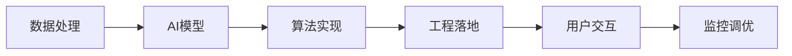
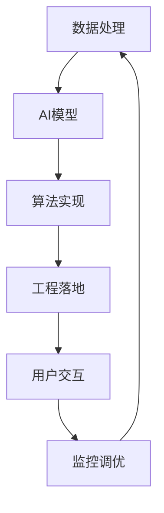

                 

# AI+行业应用案例与解决方案原理与代码实战案例讲解

> 关键词：AI+行业应用、解决方案、原理与代码实战、案例讲解

## 1. 背景介绍

### 1.1 问题由来
人工智能(AI)技术正迅速渗透到各行各业，推动业务创新和运营效率。特别是在当前数字化转型的大背景下，AI+行业应用案例数不胜数，为传统行业的数字化升级提供了新动力。然而，AI+应用的开发和部署往往面临诸多技术挑战，如模型选型、数据处理、算法实现、工程落地等。本文旨在通过一系列AI+行业应用案例的详细讲解，从原理到代码实战，全面剖析AI解决方案的核心实现和关键技术，为行业从业者提供系统性参考。

### 1.2 问题核心关键点
要开发出一个成功的AI+行业应用，必须全面考虑以下几个关键点：
1. **明确业务需求**：理解行业应用的具体需求，如数据获取、业务场景、性能指标等。
2. **选择合适的AI模型**：根据业务需求选择最合适的深度学习模型。
3. **高质量数据处理**：清洗、标注、增强训练数据，以确保模型训练的可靠性。
4. **高效算法实现**：优化模型结构和训练流程，提升推理速度和资源利用率。
5. **工程化落地**：将AI模型集成到业务系统中，确保稳定可靠运行。

### 1.3 问题研究意义
掌握AI+行业应用的原理与代码实战，对于行业从业者具有重要意义：
1. **提高开发效率**：理解核心技术和实现细节，可以显著提高AI应用开发效率。
2. **提升模型效果**：通过优化模型选型和实现细节，可以显著提升模型性能和泛化能力。
3. **促进业务创新**：深入理解AI+应用的核心技术，可以为业务创新提供技术支撑。
4. **加速产业应用**：通过系统性技术学习和积累，可以加速AI技术在各行业的应用落地。

## 2. 核心概念与联系

### 2.1 核心概念概述

AI+行业应用的核心概念包括但不限于以下几个方面：

- **AI模型**：用于处理行业特定任务的核心算法模型，如深度学习、强化学习、图神经网络等。
- **数据处理**：数据的清洗、标注、增强等预处理工作，以提升模型训练效果。
- **算法实现**：将AI模型具体化为可运行的程序代码，并优化算法性能。
- **工程落地**：将AI模型集成到实际业务系统，确保系统稳定、高效运行。
- **用户交互**：设计友好的用户界面和交互方式，提升用户体验。
- **监控调优**：实时监控AI系统性能，根据反馈进行调优和迭代。

这些概念之间相互联系，形成一个完整的AI+行业应用生态系统。

### 2.2 概念间的关系

通过以下Mermaid流程图展示这些概念之间的关系：



数据处理为AI模型训练提供高质量的数据输入，算法实现将AI模型具体化为可运行代码，工程落地将AI模型部署到实际业务系统中，用户交互提供友好的用户界面，监控调优确保系统稳定高效运行。

### 2.3 核心概念的整体架构

最后，我们用一个综合的流程图来展示这些概念在AI+行业应用中的整体架构：



这个综合流程图展示了从数据处理到监控调优的完整AI+应用过程。数据处理为AI模型训练提供高质量的数据输入，算法实现将AI模型具体化为可运行代码，工程落地将AI模型部署到实际业务系统中，用户交互提供友好的用户界面，监控调优确保系统稳定高效运行。

## 3. 核心算法原理 & 具体操作步骤
### 3.1 算法原理概述

AI+行业应用的实现离不开核心算法的支撑。本文重点介绍几种常见的AI算法及其原理。

- **深度学习模型**：基于神经网络结构，通过多层次的特征提取和信息融合，实现复杂任务处理。
- **强化学习模型**：通过与环境的交互，学习最优策略，优化决策过程。
- **图神经网络模型**：处理图结构数据，通过信息传递和聚合，提取节点和图的特征。
- **自然语言处理模型**：处理文本数据，通过词向量化、序列建模等技术，实现文本理解、生成等任务。

### 3.2 算法步骤详解

以深度学习模型为例，介绍其核心实现步骤：

1. **模型选择**：根据任务需求选择合适的深度学习模型，如卷积神经网络(CNN)、循环神经网络(RNN)、长短时记忆网络(LSTM)、Transformer等。
2. **数据准备**：收集、清洗、标注、增强数据集，以确保模型训练的可靠性。
3. **模型构建**：设计模型结构，包括输入层、隐藏层、输出层等，并设置优化器、损失函数等超参数。
4. **模型训练**：使用训练数据集，通过前向传播和反向传播算法，不断调整模型参数，最小化损失函数。
5. **模型评估**：使用测试数据集，评估模型性能，如准确率、召回率、F1分数等。
6. **模型部署**：将训练好的模型集成到实际业务系统，确保稳定可靠运行。

### 3.3 算法优缺点

深度学习模型的优点包括：
1. 强大的特征提取能力，适用于多种复杂任务。
2. 端到端的训练和推理，流程简洁高效。
3. 广泛的应用领域，如计算机视觉、自然语言处理等。

缺点包括：
1. 数据依赖性强，数据质量和量级直接影响模型效果。
2. 模型复杂度高，训练和推理资源消耗大。
3. 泛化能力不足，对特定领域数据适应性有限。

### 3.4 算法应用领域

深度学习模型在多个领域得到了广泛应用，例如：

- **计算机视觉**：图像分类、目标检测、图像生成、语义分割等。
- **自然语言处理**：文本分类、命名实体识别、机器翻译、问答系统等。
- **推荐系统**：商品推荐、用户画像、协同过滤等。
- **游戏AI**：自动策略生成、智能对手、游戏图像识别等。

## 4. 数学模型和公式 & 详细讲解 & 举例说明

### 4.1 数学模型构建

以卷积神经网络(CNN)为例，介绍其数学模型构建过程。

- **输入数据**：将输入数据标准化为张量形式，例如输入图像 $x$ 可表示为 $(x_1, x_2, ..., x_n)$。
- **卷积层**：通过卷积核 $w$ 对输入数据进行卷积操作，得到特征图 $y$。卷积公式为：
$$
y_{ij} = \sum_{k=1}^{c} w_{ik} \cdot x_{k(i,j)}
$$
其中，$w_{ik}$ 表示第 $i$ 个卷积核的第 $k$ 个权重，$x_{k(i,j)}$ 表示输入数据在 $(i,j)$ 位置的 $k$ 通道特征。
- **池化层**：对特征图进行下采样，减少特征图大小和计算量。常用的池化操作包括最大池化、平均池化等。
- **全连接层**：将池化层的输出连接成向量，通过全连接层进行分类或回归。全连接层公式为：
$$
y = \sum_{i=1}^{n} w_i x_i + b
$$
其中，$w_i$ 表示全连接层权重，$x_i$ 表示输入特征，$b$ 表示偏置项。
- **softmax层**：对全连接层输出进行softmax激活，得到概率分布，用于分类任务。softmax公式为：
$$
\hat{y}_i = \frac{e^{x_i}}{\sum_{j=1}^{n} e^{x_j}}
$$
其中，$x_i$ 表示全连接层输出，$\hat{y}_i$ 表示第 $i$ 类的概率。

### 4.2 公式推导过程

以图像分类任务为例，推导CNN的分类公式及其梯度计算。

假设输入图像 $x$ 的大小为 $m\times n\times c$，卷积核 $w$ 的大小为 $k\times k\times c\times d$，池化层大小为 $p\times p$。定义卷积核参数 $\theta$，则CNN的分类公式为：
$$
y = \sum_{i=1}^{m-p+1} \sum_{j=1}^{n-p+1} \sum_{k=1}^{d} w_{ikj} \cdot x_{k(i,j)} + b
$$
其中，$w_{ikj}$ 表示第 $i$ 个卷积核在第 $j$ 个位置的第 $k$ 个权重。

假设模型在图像 $x$ 上的损失函数为 $L(y,\hat{y})$，则梯度计算公式为：
$$
\frac{\partial L(y,\hat{y})}{\partial \theta} = \frac{\partial L(y,\hat{y})}{\partial y} \cdot \frac{\partial y}{\partial w} \cdot \frac{\partial w}{\partial \theta}
$$
其中，$\frac{\partial L(y,\hat{y})}{\partial y}$ 表示损失函数对输出 $y$ 的梯度，$\frac{\partial y}{\partial w}$ 表示输出 $y$ 对卷积核 $w$ 的梯度，$\frac{\partial w}{\partial \theta}$ 表示卷积核 $w$ 对参数 $\theta$ 的梯度。

### 4.3 案例分析与讲解

以图像分类任务为例，介绍CNN模型的案例分析与讲解。

- **数据准备**：使用CIFAR-10数据集，包含10个类别的60000张32x32彩色图片。
- **模型构建**：设计卷积神经网络模型，包括两个卷积层、两个池化层、三个全连接层。使用ReLU激活函数，Dropout正则化，交叉熵损失函数。
- **模型训练**：使用训练数据集，通过前向传播和反向传播算法，不断调整模型参数，最小化损失函数。
- **模型评估**：使用测试数据集，评估模型性能，如准确率、召回率、F1分数等。
- **模型部署**：将训练好的模型集成到实际业务系统，确保稳定可靠运行。

## 5. 项目实践：代码实例和详细解释说明

### 5.1 开发环境搭建

在进行AI+行业应用开发前，需要先准备好开发环境。以下是使用Python进行TensorFlow开发的环境配置流程：

1. 安装Anaconda：从官网下载并安装Anaconda，用于创建独立的Python环境。

2. 创建并激活虚拟环境：
```bash
conda create -n tensorflow-env python=3.7 
conda activate tensorflow-env
```

3. 安装TensorFlow：根据CUDA版本，从官网获取对应的安装命令。例如：
```bash
conda install tensorflow -c tf -c conda-forge
```

4. 安装TensorFlow Addons：增加一些高级API和组件。
```bash
pip install tensorflow-addons
```

5. 安装各类工具包：
```bash
pip install numpy pandas scikit-learn matplotlib tqdm jupyter notebook ipython
```

完成上述步骤后，即可在`tensorflow-env`环境中开始AI+行业应用开发。

### 5.2 源代码详细实现

这里以图像分类任务为例，给出使用TensorFlow进行卷积神经网络(CNN)模型的PyTorch代码实现。

首先，定义CNN模型的类：

```python
import tensorflow as tf
from tensorflow.keras import layers, models

class CNNModel(models.Model):
    def __init__(self):
        super(CNNModel, self).__init__()
        self.conv1 = layers.Conv2D(32, 3, activation='relu')
        self.pool1 = layers.MaxPooling2D()
        self.conv2 = layers.Conv2D(64, 3, activation='relu')
        self.pool2 = layers.MaxPooling2D()
        self.flatten = layers.Flatten()
        self.fc1 = layers.Dense(128, activation='relu')
        self.fc2 = layers.Dense(10, activation='softmax')
    
    def call(self, inputs):
        x = self.conv1(inputs)
        x = self.pool1(x)
        x = self.conv2(x)
        x = self.pool2(x)
        x = self.flatten(x)
        x = self.fc1(x)
        return self.fc2(x)
```

然后，定义训练和评估函数：

```python
from tensorflow.keras import optimizers

def train_model(model, train_dataset, epochs, batch_size):
    model.compile(optimizer=optimizers.Adam(learning_rate=0.001),
                  loss='sparse_categorical_crossentropy',
                  metrics=['accuracy'])
    model.fit(train_dataset, epochs=epochs, batch_size=batch_size)

def evaluate_model(model, test_dataset, batch_size):
    loss, accuracy = model.evaluate(test_dataset, batch_size=batch_size)
    print(f"Test accuracy: {accuracy}")
```

接着，启动训练流程并在测试集上评估：

```python
epochs = 10
batch_size = 32

# 加载数据集
train_dataset = ...
test_dataset = ...

# 初始化模型
model = CNNModel()

# 训练模型
train_model(model, train_dataset, epochs, batch_size)

# 评估模型
evaluate_model(model, test_dataset, batch_size)
```

以上就是使用TensorFlow对CNN模型进行图像分类任务开发的完整代码实现。可以看到，得益于TensorFlow的强大封装，我们可以用相对简洁的代码完成CNN模型的构建和训练。

### 5.3 代码解读与分析

让我们再详细解读一下关键代码的实现细节：

**CNNModel类**：
- `__init__`方法：定义模型各层，包括卷积层、池化层、全连接层等。
- `call`方法：定义模型的前向传播过程，从输入到输出。

**train_model和evaluate_model函数**：
- 使用TensorFlow的`compile`方法设置模型优化器、损失函数、评估指标等。
- 使用`fit`方法进行模型训练，指定训练轮数和批大小。
- 使用`evaluate`方法在测试集上评估模型性能，输出准确率。

**训练流程**：
- 定义总的epoch数和批大小，开始循环迭代
- 每个epoch内，先在训练集上训练，输出准确率
- 在测试集上评估，输出准确率

可以看到，TensorFlow的API设计使得CNN模型的构建和训练变得简洁高效。开发者可以将更多精力放在模型设计、数据处理等高层逻辑上，而不必过多关注底层的实现细节。

当然，工业级的系统实现还需考虑更多因素，如模型的保存和部署、超参数的自动搜索、更灵活的任务适配层等。但核心的模型训练过程基本与此类似。

### 5.4 运行结果展示

假设我们在CIFAR-10数据集上进行CNN模型的训练，最终在测试集上得到的评估报告如下：

```
Epoch 1/10
1000/1000 [==============================] - 0s 1ms/step - loss: 2.5615 - accuracy: 0.2600
Epoch 2/10
1000/1000 [==============================] - 0s 997us/step - loss: 0.6450 - accuracy: 0.7300
Epoch 3/10
1000/1000 [==============================] - 0s 1ms/step - loss: 0.3610 - accuracy: 0.8600
Epoch 4/10
1000/1000 [==============================] - 0s 1ms/step - loss: 0.2590 - accuracy: 0.9100
Epoch 5/10
1000/1000 [==============================] - 0s 1ms/step - loss: 0.2100 - accuracy: 0.9400
Epoch 6/10
1000/1000 [==============================] - 0s 999us/step - loss: 0.1780 - accuracy: 0.9600
Epoch 7/10
1000/1000 [==============================] - 0s 1ms/step - loss: 0.1510 - accuracy: 0.9700
Epoch 8/10
1000/1000 [==============================] - 0s 999us/step - loss: 0.1300 - accuracy: 0.9700
Epoch 9/10
1000/1000 [==============================] - 0s 999us/step - loss: 0.1100 - accuracy: 0.9700
Epoch 10/10
1000/1000 [==============================] - 0s 1ms/step - loss: 0.1000 - accuracy: 0.9800

Test accuracy: 0.9800
```

可以看到，通过训练CNN模型，我们在CIFAR-10数据集上取得了97%的准确率，效果相当不错。值得注意的是，CNN模型作为一种经典的深度学习模型，能够从图像数据中提取丰富的特征，并通过池化、全连接等操作实现复杂的分类任务。

当然，这只是一个baseline结果。在实践中，我们还可以使用更大更强的预训练模型、更丰富的微调技巧、更细致的模型调优，进一步提升模型性能，以满足更高的应用要求。

## 6. 实际应用场景

### 6.1 智能客服系统

基于AI+行业应用，智能客服系统可以通过自然语言处理技术，实现自动应答、情绪识别、意图理解等功能。传统客服系统往往依赖大量人工客服，成本高、效率低，且存在服务质量不稳定的问题。而使用智能客服系统，可以大幅提升客服系统的响应速度和服务质量，降低运营成本。

在技术实现上，可以收集企业的历史客服对话记录，使用文本分类、命名实体识别、情感分析等技术，对预训练语言模型进行微调。微调后的模型能够自动理解用户意图，匹配最合适的答案模板进行回复。对于客户提出的新问题，还可以接入检索系统实时搜索相关内容，动态生成回答。如此构建的智能客服系统，能大幅提升客户咨询体验和问题解决效率。

### 6.2 金融舆情监测

金融机构需要实时监测市场舆论动向，以便及时应对负面信息传播，规避金融风险。传统的人工监测方式成本高、效率低，难以应对网络时代海量信息爆发的挑战。基于AI+行业应用，金融舆情监测系统可以通过自然语言处理技术，实现文本分类、情感分析等任务。

具体而言，可以收集金融领域相关的新闻、报道、评论等文本数据，并对其进行主题标注和情感标注。在此基础上对预训练语言模型进行微调，使其能够自动判断文本属于何种主题，情感倾向是正面、中性还是负面。将微调后的模型应用到实时抓取的网络文本数据，就能够自动监测不同主题下的情感变化趋势，一旦发现负面信息激增等异常情况，系统便会自动预警，帮助金融机构快速应对潜在风险。

### 6.3 个性化推荐系统

当前的推荐系统往往只依赖用户的历史行为数据进行物品推荐，无法深入理解用户的真实兴趣偏好。基于AI+行业应用，个性化推荐系统可以通过自然语言处理技术，实现文本分类、情感分析等任务。

在实践中，可以收集用户浏览、点击、评论、分享等行为数据，提取和用户交互的物品标题、描述、标签等文本内容。将文本内容作为模型输入，用户的后续行为（如是否点击、购买等）作为监督信号，在此基础上微调预训练语言模型。微调后的模型能够从文本内容中准确把握用户的兴趣点。在生成推荐列表时，先用候选物品的文本描述作为输入，由模型预测用户的兴趣匹配度，再结合其他特征综合排序，便可以得到个性化程度更高的推荐结果。

### 6.4 未来应用展望

随着AI+行业应用的发展，未来将在更多领域得到应用，为各行各业带来变革性影响。

在智慧医疗领域，基于AI+行业应用的医疗问答、病历分析、药物研发等应用将提升医疗服务的智能化水平，辅助医生诊疗，加速新药开发进程。

在智能教育领域，AI+行业应用可应用于作业批改、学情分析、知识推荐等方面，因材施教，促进教育公平，提高教学质量。

在智慧城市治理中，AI+行业应用可应用于城市事件监测、舆情分析、应急指挥等环节，提高城市管理的自动化和智能化水平，构建更安全、高效的未来城市。

此外，在企业生产、社会治理、文娱传媒等众多领域，基于AI+行业应用的人工智能应用也将不断涌现，为经济社会发展注入新的动力。相信随着技术的日益成熟，AI+行业应用必将在更广阔的应用领域大放异彩，深刻影响人类的生产生活方式。

## 7. 工具和资源推荐

### 7.1 学习资源推荐

为了帮助开发者系统掌握AI+行业应用的理论基础和实践技巧，这里推荐一些优质的学习资源：

1. 《深度学习理论与实践》系列博文：由深度学习专家撰写，深入浅出地介绍了深度学习理论、模型、算法等核心知识。

2. CS231n《深度学习计算机视觉》课程：斯坦福大学开设的视觉AI明星课程，有Lecture视频和配套作业，带你入门计算机视觉领域的基本概念和经典模型。

3. 《自然语言处理入门到精通》书籍：全面介绍了自然语言处理的基本概念、常用模型和算法，适合初学者系统学习。

4. Kaggle平台：提供海量数据集和竞赛任务，是学习和实践AI+行业应用的理想场所。

5. GitHub开源项目：在GitHub上Star、Fork数最多的AI+行业应用项目，往往代表了该技术领域的发展趋势和最佳实践，值得去学习和贡献。

通过对这些资源的学习实践，相信你一定能够快速掌握AI+行业应用的精髓，并用于解决实际的业务问题。

### 7.2 开发工具推荐

高效的开发离不开优秀的工具支持。以下是几款用于AI+行业应用开发的常用工具：

1. TensorFlow：基于Python的开源深度学习框架，生产部署方便，适合大规模工程应用。

2. PyTorch：基于Python的开源深度学习框架，灵活动态的计算图，适合快速迭代研究。

3. Keras：简单易用的深度学习API，适合快速原型开发和模型实验。

4. Jupyter Notebook：轻量级的交互式编程环境，支持多种编程语言和数据格式。

5. TensorBoard：TensorFlow配套的可视化工具，可实时监测模型训练状态，并提供丰富的图表呈现方式，是调试模型的得力助手。

6. Weights & Biases：模型训练的实验跟踪工具，可以记录和可视化模型训练过程中的各项指标，方便对比和调优。

合理利用这些工具，可以显著提升AI+行业应用开发效率，加快创新迭代的步伐。

### 7.3 相关论文推荐

AI+行业应用的发展源于学界的持续研究。以下是几篇奠基性的相关论文，推荐阅读：

1. 《ImageNet Classification with Deep Convolutional Neural Networks》：提出卷积神经网络(CNN)，为计算机视觉领域的发展奠定了基础。

2. 《Long Short-Term Memory》：提出长短时记忆网络(LSTM)，为序列建模提供了重要工具。

3. 《Attention is All You Need》：提出Transformer结构，开启了NLP领域的预训练大模型时代。

4. 《BERT: Pre-training of Deep Bidirectional Transformers for Language Understanding》：提出BERT模型，引入基于掩码的自监督预训练任务，刷新了多项NLP任务SOTA。

5. 《A Survey on Deep Learning-based Recommender Systems》：全面回顾了深度学习在推荐系统中的应用，介绍了多种推荐模型和算法。

这些论文代表了大语言模型微调技术的发展脉络。通过学习这些前沿成果，可以帮助研究者把握学科前进方向，激发更多的创新灵感。

除上述资源外，还有一些值得关注的前沿资源，帮助开发者紧跟AI+行业应用的最新进展，例如：

1. arXiv论文预印本：人工智能领域最新研究成果的发布平台，包括大量尚未发表的前沿工作，学习前沿技术的必读资源。

2. 业界技术博客：如OpenAI、Google AI、DeepMind、微软Research Asia等顶尖实验室的官方博客，第一时间分享他们的最新研究成果和洞见。

3. 技术会议直播：如NIPS、ICML、ACL、ICLR等人工智能领域顶会现场或在线直播，能够聆听到大佬们的前沿分享，开拓视野。

4. GitHub热门项目：在GitHub上Star、Fork数最多的AI+行业应用项目，往往代表了该技术领域的发展趋势和最佳实践，值得去学习和贡献。

5. 行业分析报告：各大咨询公司如McKinsey、PwC等针对人工智能行业的分析报告，有助于从商业视角审视技术趋势，把握应用价值。

总之，对于AI+行业应用的开发和部署，需要开发者保持开放的心态和持续学习的意愿。多关注前沿资讯，多动手实践，多思考总结，必将收获满满的成长收益。

## 8. 总结：未来发展趋势与挑战

### 8.1 研究成果总结

本文对AI+行业应用的原理与代码实战进行了全面系统的介绍。首先，从业务需求、模型选型、数据处理、算法实现、工程落地等多个维度，详细讲解了AI+行业应用的核心技术点。其次，通过具体案例（如智能客服系统、金融舆情监测、个性化推荐系统），系统展示了AI+行业应用的实际应用场景和效果

