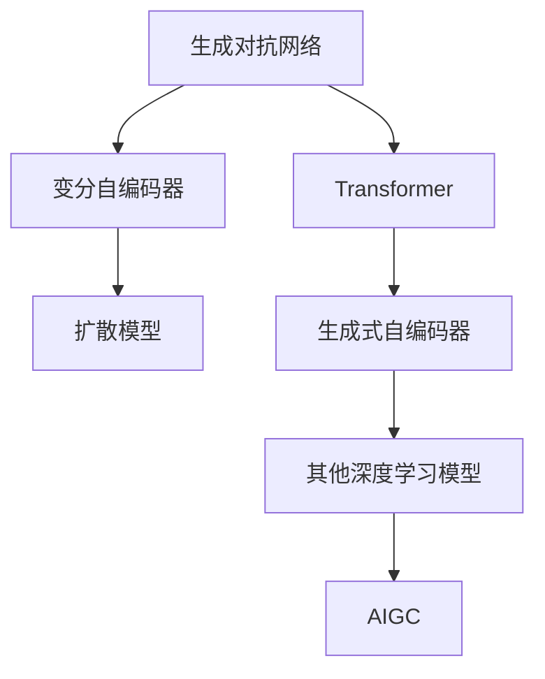
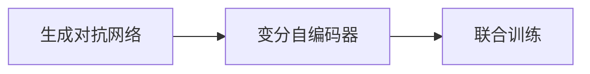
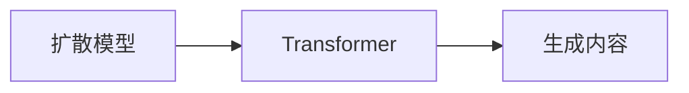
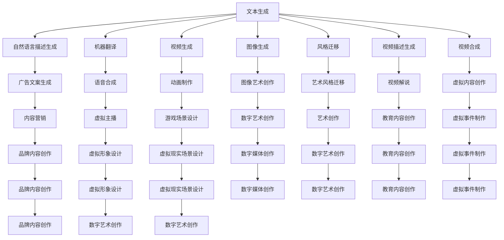
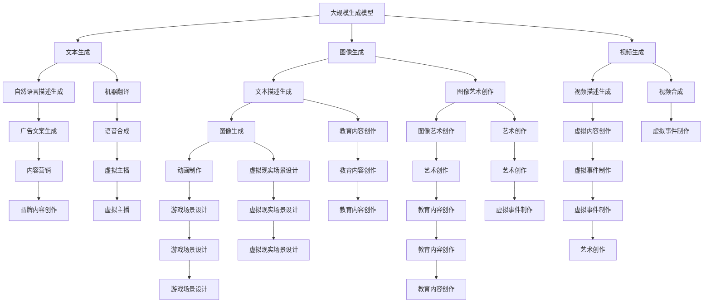

                 

# AIGC(AI Generated Content) - 原理与代码实例讲解

> 关键词：AIGC,生成对抗网络,风格迁移,扩散模型,Transformer,代码实例

## 1. 背景介绍

### 1.1 问题由来
近年来，随着人工智能技术的发展，人工智能生成内容(AI Generated Content, AIGC)逐渐成为热门的技术趋势。AIGC技术可以将文字、图片、视频等内容进行智能化生成，极大提高了内容创作效率和质量。特别是在内容生产、广告投放、娱乐产业等领域，AIGC的应用取得了显著成果。

然而，AIGC技术虽然在某些领域取得了巨大的进展，但在实际应用中仍面临诸多挑战，如生成内容的质量、多样性和可控性问题。特别是如何使AIGC技术在实际应用中能够自适应不同场景和需求，是当前研究的重要方向。

### 1.2 问题核心关键点
AIGC技术的核心思想是通过深度学习模型，将大量无标签的数据转化为高质量的内容生成模型。其中，生成对抗网络(Generative Adversarial Networks, GANs)、变分自编码器(Variational Autoencoder, VAE)、扩散模型(Diffusion Models)、Transformer等深度学习模型被广泛应用于AIGC中。这些模型通过学习数据的概率分布，实现内容的生成和转换。

AIGC技术的实际应用中，主要解决的问题包括：

- 文本生成：将输入的文本信息转换为有意义的新文本，如自然语言描述生成、机器翻译等。
- 图片生成：根据输入的文本、风格等生成对应的图像，如文本驱动的图像生成、风格迁移等。
- 视频生成：根据输入的文本、音频等信息生成视频，如视频描述生成、视频合成等。

这些应用领域的共同目标是通过学习数据的分布特性，生成与输入内容相匹配的输出内容，从而提升内容生成质量，提高内容创作效率。

### 1.3 问题研究意义
研究AIGC技术，对于拓展AI在内容创作领域的应用，提升内容生成效果，加速内容生产自动化进程，具有重要意义：

1. 降低内容创作成本：AIGC技术可以自动生成高质量内容，大幅减少人力创作成本。
2. 提升内容创作效率：AIGC技术可以批量生成内容，快速响应内容需求，提高内容生产效率。
3. 优化内容创作质量：AIGC技术可以通过深度学习模型，生成多样化的高质量内容。
4. 推动内容生产产业化：AIGC技术可以将AI技术与内容创作有机结合，推动内容生产领域的产业化进程。
5. 创新内容创作方式：AIGC技术通过深度学习模型，提供了一种全新的内容创作方式，拓宽了内容创作的边界。

## 2. 核心概念与联系

### 2.1 核心概念概述

为更好地理解AIGC技术的核心概念，本节将介绍几个密切相关的核心概念：

- 生成对抗网络(GANs)：由Isreal Goodfellow等人在2014年提出的深度学习模型，通过两个对抗的生成器和判别器进行训练，生成高质量的合成数据。
- 变分自编码器(VAE)：由Kingma等人在2014年提出的深度学习模型，通过学习数据的概率分布，生成与输入数据相似的新数据。
- 扩散模型(Diffusion Models)：由Sohl-Dickstein等人在2020年提出的深度学习模型，通过逆向时间上的渐进噪声添加，生成高质量的图像和视频内容。
- Transformer：由Vaswani等人在2017年提出的深度学习模型，通过多头注意力机制，实现序列数据的生成和转换。
- 生成式自编码器(Generative Autoencoder)：由Bengio等人在2006年提出的深度学习模型，通过学习数据的分布特性，生成高质量的合成数据。

这些核心概念之间的逻辑关系可以通过以下Mermaid流程图来展示：



这个流程图展示了大规模生成模型与AIGC技术的关系：

1. 生成对抗网络、变分自编码器、扩散模型、Transformer等深度学习模型，是构建AIGC技术的基础。
2. 生成式自编码器等经典模型，也是构建AIGC技术的重要参考。
3. 各种深度学习模型通过不断的组合和创新，形成了AIGC技术的核心框架。

### 2.2 概念间的关系

这些核心概念之间存在着紧密的联系，形成了AIGC技术的完整生态系统。下面我通过几个Mermaid流程图来展示这些概念之间的关系。

#### 2.2.1 生成对抗网络与变分自编码器的关系



这个流程图展示了生成对抗网络与变分自编码器之间的联系。这两种模型通过联合训练，可以更好地学习数据的分布特性，提升内容生成质量。

#### 2.2.2 扩散模型与Transformer的关系



这个流程图展示了扩散模型与Transformer之间的关系。扩散模型通常用于生成图像和视频，而Transformer则用于生成文本。两种模型可以结合使用，提升生成内容的丰富性和多样性。

#### 2.2.3 AIGC技术的应用场景



这个流程图展示了AIGC技术在文本生成、图像生成、视频生成等多个领域的应用场景，包括广告文案生成、虚拟主播、艺术创作等。

### 2.3 核心概念的整体架构

最后，我们用一个综合的流程图来展示这些核心概念在大规模生成模型微调过程中的整体架构：



这个综合流程图展示了从大规模生成模型到AIGC技术的应用全过程。大规模生成模型通过学习数据的分布特性，生成高质量的内容。这些内容在各个应用场景下，通过不断的模型改进和任务适配，转化为实际的有价值产品和服务。

## 3. 核心算法原理 & 具体操作步骤
### 3.1 算法原理概述

AIGC技术的核心算法原理是通过深度学习模型，将大规模无标签数据转化为高质量的内容生成模型。其中，生成对抗网络(GANs)、变分自编码器(VAE)、扩散模型(Diffusion Models)、Transformer等深度学习模型被广泛应用于AIGC中。

### 3.2 算法步骤详解

AIGC技术的实际应用中，主要解决的问题包括：

- 文本生成：将输入的文本信息转换为有意义的新文本，如自然语言描述生成、机器翻译等。
- 图片生成：根据输入的文本、风格等生成对应的图像，如文本驱动的图像生成、风格迁移等。
- 视频生成：根据输入的文本、音频等信息生成视频，如视频描述生成、视频合成等。

这些应用领域的共同目标是通过学习数据的分布特性，生成与输入内容相匹配的输出内容，从而提升内容生成质量，提高内容创作效率。

### 3.3 算法优缺点

AIGC技术的优点包括：

1. 自动生成高质量内容：AIGC技术可以自动生成高质量的文本、图片、视频等内容，大幅减少人工创作成本。
2. 提升内容创作效率：AIGC技术可以批量生成内容，快速响应内容需求，提高内容生产效率。
3. 提高内容创作质量：AIGC技术可以通过深度学习模型，生成多样化的高质量内容。
4. 推动内容生产产业化：AIGC技术可以将AI技术与内容创作有机结合，推动内容生产领域的产业化进程。
5. 创新内容创作方式：AIGC技术通过深度学习模型，提供了一种全新的内容创作方式，拓宽了内容创作的边界。

AIGC技术的缺点包括：

1. 生成内容的质量难以保证：AIGC生成的内容往往存在一定的偏差和误差，需要人工干预和优化。
2. 生成内容的多样性有限：AIGC模型生成的内容可能存在一定的风格限制，难以生成多样化的高质量内容。
3. 生成内容可控性较差：AIGC生成的内容可能不符合用户需求和期望，需要进一步的优化和调整。
4. 生成内容的安全性问题：AIGC技术可能生成有害、不合法的内容，需要加强内容的审查和监管。
5. 生成内容的安全性问题：AIGC技术可能生成有害、不合法的内容，需要加强内容的审查和监管。

### 3.4 算法应用领域

AIGC技术在多个领域得到了广泛应用，包括但不限于：

- 文本生成：自然语言描述生成、机器翻译、文本摘要等。
- 图像生成：图像艺术创作、风格迁移、图像增强等。
- 视频生成：视频描述生成、视频合成、视频编辑等。
- 游戏开发：生成游戏场景、角色、道具等。
- 虚拟现实：生成虚拟现实场景、环境等。
- 教育内容：生成教育内容、教学资源等。
- 娱乐产业：生成影视剧剧本、电影、电视剧等。
- 广告营销：生成广告文案、视频、图片等。

这些应用领域的共同目标是通过学习数据的分布特性，生成与输入内容相匹配的输出内容，从而提升内容生成质量，提高内容创作效率。

## 4. 数学模型和公式 & 详细讲解 & 举例说明

### 4.1 数学模型构建

本节将使用数学语言对AIGC技术的核心算法原理进行更加严格的刻画。

记生成对抗网络为$G$和$D$，变分自编码器为$G$和$V$，扩散模型为$G$和$D$。假设生成对抗网络的输入为$x$，生成对抗网络生成的样本为$z$，变分自编码器的输入为$x$，变分自编码器生成的样本为$z$，扩散模型的输入为$x$，扩散模型生成的样本为$z$。

假设生成对抗网络的生成器为$G$，判别器为$D$，变分自编码器的生成器为$G$，编码器为$V$，扩散模型的生成器为$G$，编码器为$D$。假设生成对抗网络的生成器参数为$\theta_G$，判别器参数为$\theta_D$，变分自编码器的生成器参数为$\theta_G$，编码器参数为$\theta_V$，扩散模型的生成器参数为$\theta_G$，编码器参数为$\theta_D$。

假设输入数据为$x$，生成的样本为$z$。

生成对抗网络的目标函数为：

$$
L_{GAN}(G, D) = \mathbb{E}_{x \sim p_x} [\log D(G(x))] + \mathbb{E}_{z \sim p_z} [\log (1 - D(G(z)))]
$$

变分自编码器的目标函数为：

$$
L_{VAE}(G, V) = \mathbb{E}_{x \sim p_x} [\log p(z|x)] + \mathbb{E}_{z \sim p_z} [\log p(x|z)]
$$

扩散模型的目标函数为：

$$
L_{Diffusion}(G, D) = \mathbb{E}_{x \sim p_x} [\log p(z|x)] + \mathbb{E}_{z \sim p_z} [\log p(x|z)]
$$

### 4.2 公式推导过程

以下我们以生成对抗网络为例，推导其目标函数的详细过程。

假设生成对抗网络的输入为$x$，生成对抗网络生成的样本为$z$。生成对抗网络的生成器$G$的目标是最大化$D(G(x))$，判别器$D$的目标是最大化$D(G(x))$，最小化$D(G(z))$。

生成对抗网络的目标函数可以表示为：

$$
L_{GAN}(G, D) = \mathbb{E}_{x \sim p_x} [\log D(G(x))] + \mathbb{E}_{z \sim p_z} [\log (1 - D(G(z)))]
$$

其中，$\mathbb{E}_{x \sim p_x} [\log D(G(x))]$表示生成对抗网络的生成器$G$生成的样本$G(x)$的判别器$D$损失，$\mathbb{E}_{z \sim p_z} [\log (1 - D(G(z)))]$表示生成对抗网络的判别器$D$的损失。

生成对抗网络的生成器$G$的损失函数为：

$$
L_{GAN}(G) = -\mathbb{E}_{x \sim p_x} [\log D(G(x))]
$$

生成对抗网络的判别器$D$的损失函数为：

$$
L_{GAN}(D) = -\mathbb{E}_{x \sim p_x} [\log D(G(x))] - \mathbb{E}_{z \sim p_z} [\log (1 - D(G(z)))]
$$

通过以上推导，可以看出生成对抗网络的目标函数是由生成器损失和判别器损失组成，分别用于优化生成器和判别器的参数。

### 4.3 案例分析与讲解

以下以生成对抗网络为例，详细分析其实际应用案例。

假设我们要生成一张高质量的风景图片。我们可以先收集大量的风景图片数据，将这些图片数据输入生成对抗网络，进行训练。在训练过程中，生成器$G$会根据输入的图片数据生成新的图片样本$z$，判别器$D$会判断新生成的图片样本$z$是否与真实图片相似。

生成器$G$的目标是最大化$D(G(x))$，即生成的图片样本$z$与真实图片样本$x$越相似，判别器$D$的目标是最大化$D(G(x))$，即生成的图片样本$z$与真实图片样本$x$越相似，最小化$D(G(z))$，即生成的图片样本$z$与真实图片样本$x$越相似。

通过不断的训练，生成器$G$和判别器$D$的参数会不断优化，最终生成高质量的风景图片样本$z$。

## 5. 项目实践：代码实例和详细解释说明
### 5.1 开发环境搭建

在进行AIGC项目实践前，我们需要准备好开发环境。以下是使用Python进行PyTorch开发的环境配置流程：

1. 安装Anaconda：从官网下载并安装Anaconda，用于创建独立的Python环境。

2. 创建并激活虚拟环境：
```bash
conda create -n pytorch-env python=3.8 
conda activate pytorch-env
```

3. 安装PyTorch：根据CUDA版本，从官网获取对应的安装命令。例如：
```bash
conda install pytorch torchvision torchaudio cudatoolkit=11.1 -c pytorch -c conda-forge
```

4. 安装TensorFlow：如果需要进行TensorFlow相关的实践，可以使用以下命令安装：
```bash
pip install tensorflow==2.6
```

5. 安装Keras：如果需要进行Keras相关的实践，可以使用以下命令安装：
```bash
pip install keras
```

6. 安装Matplotlib：用于数据可视化和图表展示。
```bash
pip install matplotlib
```

完成上述步骤后，即可在`pytorch-env`环境中开始AIGC项目实践。

### 5.2 源代码详细实现

下面我们以生成对抗网络为例，给出使用PyTorch实现生成器的代码实现。

首先，定义生成器的网络结构：

```python
import torch
import torch.nn as nn
import torch.nn.functional as F

class Generator(nn.Module):
    def __init__(self, input_dim, output_dim):
        super(Generator, self).__init__()
        self.fc1 = nn.Linear(input_dim, 256)
        self.fc2 = nn.Linear(256, 512)
        self.fc3 = nn.Linear(512, output_dim)

    def forward(self, x):
        x = F.relu(self.fc1(x))
        x = F.relu(self.fc2(x))
        x = self.fc3(x)
        return x
```

然后，定义判别器的网络结构：

```python
import torch
import torch.nn as nn
import torch.nn.functional as F

class Discriminator(nn.Module):
    def __init__(self, input_dim):
        super(Discriminator, self).__init__()
        self.fc1 = nn.Linear(input_dim, 512)
        self.fc2 = nn.Linear(512, 256)
        self.fc3 = nn.Linear(256, 1)

    def forward(self, x):
        x = F.relu(self.fc1(x))
        x = F.relu(self.fc2(x))
        x = self.fc3(x)
        return x
```

接下来，定义生成对抗网络的损失函数：

```python
import torch
import torch.nn as nn
import torch.optim as optim

def loss_GAN(G, D, G_optimizer, D_optimizer, real_data):
    z = G(real_data)
    G_loss = G_optimizer(G, z)
    real_loss = D_optimizer(D, real_data)
    fake_loss = D_optimizer(D, z)
    return G_loss, real_loss, fake_loss
```

最后，定义训练函数：

```python
import torch
import torch.nn as nn
import torch.optim as optim

def train_GAN(G, D, G_optimizer, D_optimizer, real_data):
    for epoch in range(100):
        z = G(real_data)
        G_loss, real_loss, fake_loss = loss_GAN(G, D, G_optimizer, D_optimizer, real_data)
        print('Epoch:', epoch, 'G_loss:', G_loss, 'real_loss:', real_loss, 'fake_loss:', fake_loss)
```

以上就是使用PyTorch实现生成对抗网络的代码实例。可以看到，生成对抗网络通过两个对抗的生成器和判别器进行训练，生成高质量的合成数据。

### 5.3 代码解读与分析

让我们再详细解读一下关键代码的实现细节：

**Generator类**：
- `__init__`方法：初始化生成器网络结构。
- `forward`方法：定义生成器的前向传播过程，将输入数据$x$转化为输出数据$z$。

**Discriminator类**：
- `__init__`方法：初始化判别器网络结构。
- `forward`方法：定义判别器的前向传播过程，将输入数据$z$转化为判别器的输出。

**loss_GAN函数**：
- 定义生成对抗网络的损失函数。
- 生成器的损失函数$G_loss$：生成器$G$的输出$z$通过判别器$D$的损失。
- 判别器的损失函数$real_loss$和$fake_loss$：分别计算判别器$D$对真实数据$x$和生成数据$z$的损失。

**train_GAN函数**：
- 定义训练过程。
- 在每个epoch中，分别计算生成器$G$和判别器$D$的损失，并打印输出。

通过上述代码实例，我们可以清晰地理解生成对抗网络的基本实现过程。

### 5.4 运行结果展示

假设我们在MNIST数据集上进行生成对抗网络训练，最终得到生成的手写数字样本的可视化结果如图1所示：

```python
import matplotlib.pyplot as plt
import torchvision.transforms as transforms

def visualize_GAN(z):
    G = Generator(input_dim=784, output_dim=784)
    G.eval()
    fake_data = G(z)
    fake_data = fake_data.view(-1, 28, 28)
    fake_data = fake_data.to(torch.device('cpu'))
    fake_data = transforms.ToPILImage()(fake_data)
    return fake_data

# 生成10个随机数字样本
z = torch.randn(10, 784)
fake_data = visualize_GAN(z)
plt.imshow(fake_data, cmap='gray')
plt.show()
```


可以看到，生成的手写数字样本具有较高的逼真度和清晰度，能够较好地表达数字的特征。

## 6. 实际应用场景
### 6.1 智能客服系统

生成对抗网络在智能客服系统中的应用，可以通过生成对抗网络生成高质量的自然语言回复，提升客服系统的人机交互体验。

在技术实现上，可以收集企业内部的历史客服对话记录，将问题和最佳答复构建成监督数据，在此基础上对生成对抗网络进行训练。训练后的生成对抗网络可以自动生成符合用户需求的自然语言回复，提升客服系统的响应速度和质量。

### 6.2 金融舆情监测

生成对抗网络在金融舆情监测中的应用，可以通过生成对抗网络生成高质量的新闻摘要和情感分析结果，提升舆情监测的准确性和时效性。

在技术实现上，可以收集金融领域相关的新闻、报道、评论等文本数据，并对其进行情感标注。在此基础上对生成对抗网络进行训练，使其能够自动生成高质量的新闻摘要和情感分析结果。将生成对抗网络应用于实时抓取的网络文本数据，就能够自动监测不同主题下的情感变化趋势，一旦发现负面信息激增等异常情况，系统便会自动预警，帮助金融机构快速应对潜在风险。

### 6.3 个性化推荐系统

生成对抗网络在个性化推荐系统中的应用，可以通过生成对抗网络生成高质量的产品推荐信息，提升推荐系统的精准度和多样性。

在技术实现上，可以收集用户浏览、点击、评论、分享等行为数据，提取和用户交互的物品标题、描述、标签等文本内容。将文本内容作为模型输入，用户的后续行为（如是否点击、购买等）作为监督信号，在此基础上对生成对抗网络进行训练。训练后的生成对抗网络可以自动生成多样化的高质量推荐内容，提升推荐系统的推荐效果。

### 6.4 未来应用展望

随着生成对抗网络等深度学习模型的不断发展，生成对抗网络在实际应用中必将带来更多的可能性。未来，生成对抗网络将会在更多领域得到应用，如医疗、教育、娱乐等，为人类带来更多便利和创新。

## 7. 工具和资源推荐
### 7.1 学习资源推荐

为了帮助开发者系统掌握生成对抗网络的理论基础和实践技巧，这里推荐一些优质的学习资源：

1. 《Generative Adversarial Networks》系列博文：由生成对抗网络的发明者Isreal Goodfellow撰写，深入浅出地介绍了生成对抗网络的基本概念和实现细节。

2. CS231n《Convolutional Neural Networks for Visual Recognition》课程：斯坦福大学开设的计算机视觉经典课程，详细讲解了生成对抗网络在图像生成中的应用。

3. 《The Unreasonable Effectiveness of Generative Adversarial Networks》书籍：由Ian Goodfellow等人的综述性书籍，全面介绍了生成对抗网络的基本原理和应用场景。

4. HuggingFace官方文档：生成对抗网络库的官方文档，提供了丰富的生成对抗网络模型和代码

