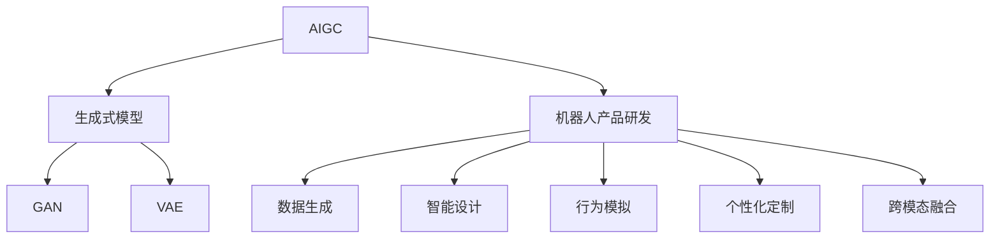
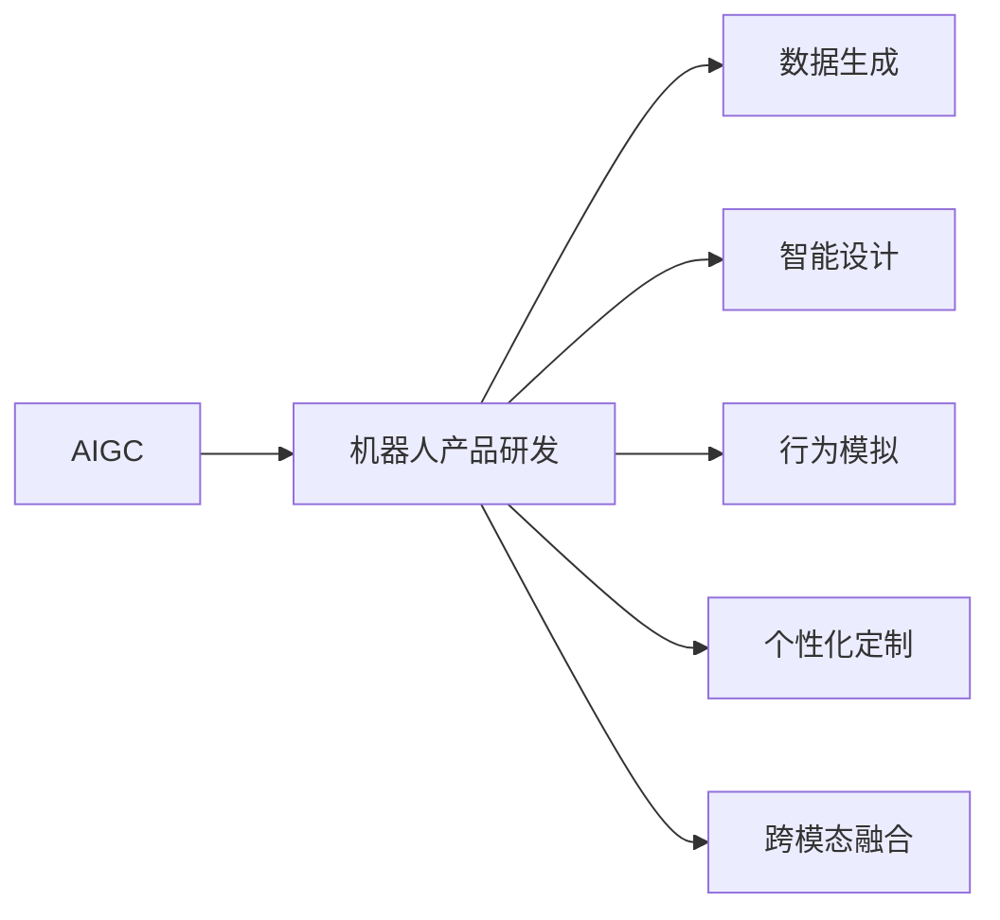
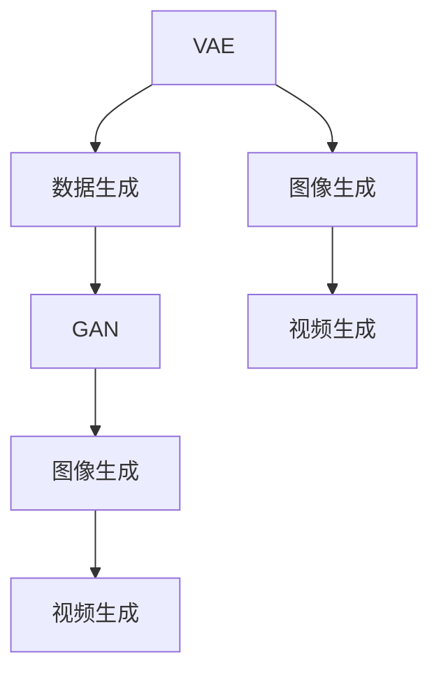
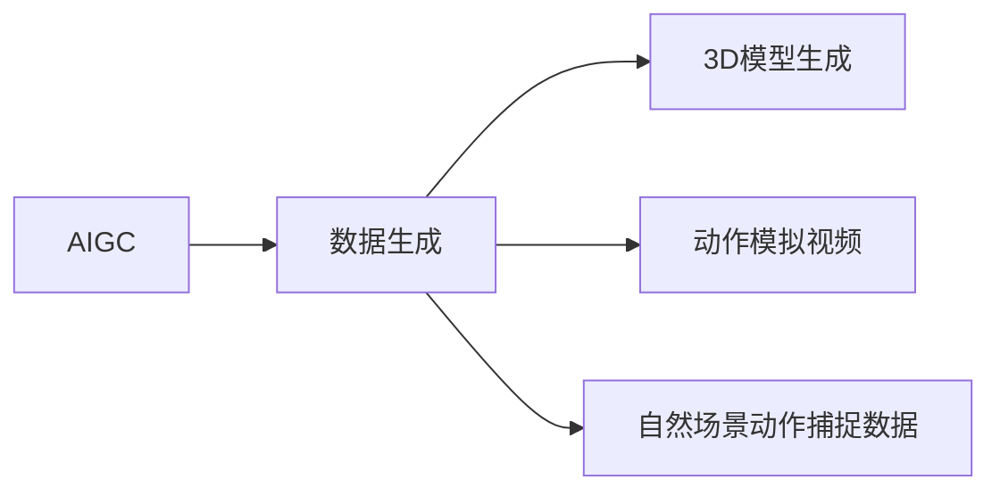
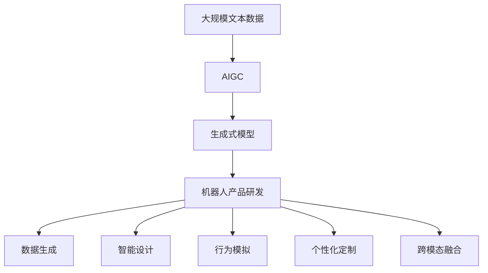

                 

# AIGC从入门到实战：AIGC 在工业领域的创新场景—合成数据集，助力机器人产品研发

## 1. 背景介绍

### 1.1 问题由来

近年来，人工智能(AI)和生成对抗网络(GANs)的发展推动了人工智能生成内容（AIGC）技术的迅速崛起。AIGC技术能够模拟人类的生成和创作能力，生成高质量的文本、图像、视频等内容，极大提升了内容创作效率和创意水平。尤其是在工业领域，AIGC技术的应用价值越发显著，为产品设计、制造、研发等环节带来了革命性的变化。

特别是在机器人产品研发中，AIGC技术通过生成合成数据集，大幅降低了数据采集成本，加速了产品迭代速度，提高了设计质量和可复用性。合成数据集不仅包括高精度的3D模型、动作模拟视频，还包括各种自然场景下的动作捕捉数据，极大地丰富了训练数据的多样性，提升了模型泛化能力。

### 1.2 问题核心关键点

AIGC在机器人产品研发中的应用，主要体现在以下几个方面：

1. **数据生成**：通过AIGC技术生成合成数据集，以填补实际数据采集中的不足，为模型训练提供充足、高质量的数据资源。

2. **智能设计**：利用AIGC技术生成创新的产品设计方案，通过仿真、模拟和优化，快速迭代和验证设计方案的有效性。

3. **行为模拟**：生成多样化的动作模拟视频，用于产品功能和交互的可视化评估，提升产品设计的人机交互体验。

4. **个性化定制**：根据用户需求，生成个性化的产品配置和定制方案，实现按需设计和生产。

5. **跨模态融合**：结合视觉、听觉和触觉等多模态数据，生成全面的产品体验模拟，提升产品设计的完整性和真实性。

### 1.3 问题研究意义

研究AIGC在机器人产品研发中的应用，对于推动机器人技术的发展，提升设计效率和产品质量，加速产品上市周期，具有重要意义：

1. **提升设计效率**：AIGC技术能够快速生成大量高质量的设计方案和模拟视频，显著缩短设计周期，提高设计效率。

2. **降低数据采集成本**：通过合成数据集，减少了对实际物理实验的依赖，降低了数据采集和实验成本。

3. **增强产品创新性**：AIGC生成的多样化设计方案和模拟视频，为设计人员提供了丰富的灵感和创意，提升产品创新性。

4. **提升用户体验**：通过仿真和模拟，能够早期发现和修正设计缺陷，提升产品的人机交互体验和用户满意度。

5. **加速产品上市**：合成数据集的生成和应用，能够快速验证设计方案的有效性，加速产品从研发到上市的过程。

6. **推动技术突破**：AIGC技术的深入应用，将推动机器人技术的边界不断拓展，带来更多的创新和突破。

## 2. 核心概念与联系

### 2.1 核心概念概述

为了更好地理解AIGC在机器人产品研发中的应用，本节将介绍几个密切相关的核心概念：

- **AIGC（人工智能生成内容）**：利用人工智能技术生成文本、图像、视频等内容的技术。常见技术包括自然语言生成、图像生成、视频生成等。

- **GAN（生成对抗网络）**：一种深度学习模型，通过生成器和判别器相互对抗，生成高质量的图像、视频等。

- **生成式自编码器（VAE）**：一种生成模型，通过对数据的潜在表示进行编码和解码，生成新的样本数据。

- **神经网络**：一种基于人工神经元模型的计算模型，广泛应用于图像处理、自然语言处理、语音识别等领域。

- **机器人产品研发**：包括产品设计、原型制作、功能验证、用户体验测试、生产优化等环节。

- **合成数据集**：通过AIGC技术生成的，用于模型训练、仿真模拟的数据集。

这些核心概念之间的逻辑关系可以通过以下Mermaid流程图来展示：



这个流程图展示了大语言模型微调过程中各个核心概念的关系：

1. AIGC技术可以应用于生成式模型，包括GAN和VAE等。
2. 机器人产品研发涉及数据生成、智能设计、行为模拟、个性化定制和跨模态融合等多个环节。
3. 生成式模型生成的数据集可以用于机器人产品研发的各个环节。

### 2.2 概念间的关系

这些核心概念之间存在着紧密的联系，形成了AIGC技术在机器人产品研发中的应用框架。下面我通过几个Mermaid流程图来展示这些概念之间的关系。

#### 2.2.1 AIGC在机器人产品研发中的应用场景



这个流程图展示了AIGC技术在机器人产品研发中的各个应用场景，包括数据生成、智能设计、行为模拟、个性化定制和跨模态融合。

#### 2.2.2 生成式自编码器（VAE）和生成对抗网络（GAN）的关系



这个流程图展示了VAE和GAN在数据生成中的关系。VAE通过对数据进行编码和解码，生成新的样本数据；GAN则通过生成器和判别器相互对抗，生成高质量的图像和视频。

#### 2.2.3 机器人产品研发中的数据生成



这个流程图展示了机器人产品研发中数据生成的几个关键步骤，包括3D模型生成、动作模拟视频生成和自然场景动作捕捉数据的生成。

### 2.3 核心概念的整体架构

最后，我们用一个综合的流程图来展示这些核心概念在大语言模型微调过程中的整体架构：



这个综合流程图展示了从AIGC技术到机器人产品研发的完整过程。AIGC技术通过生成式模型生成合成数据集，用于机器人产品研发的各个环节，包括数据生成、智能设计、行为模拟、个性化定制和跨模态融合。 通过这些流程图，我们可以更清晰地理解AIGC技术在大语言模型微调中的应用和各个环节的紧密联系。

## 3. 核心算法原理 & 具体操作步骤
### 3.1 算法原理概述

AIGC在机器人产品研发中的应用，主要依赖生成式模型，包括GAN和VAE等。这些模型通过生成合成数据集，为模型训练、仿真模拟等环节提供了高质量的数据资源。

**GAN**模型通过两个神经网络（生成器和判别器）的对抗训练，生成逼真的图像、视频等数据。其中，生成器网络负责从随机噪声中生成图像或视频，判别器网络负责区分生成数据和真实数据。通过不断优化两个网络的参数，GAN能够生成高质量、多样化的数据集。

**VAE**模型通过学习数据的潜在表示，生成新的样本数据。VAE通过对数据进行编码和解码，生成与原始数据相似的新数据。VAE生成的数据通常具有较高的多样性和质量，适用于机器人产品研发中的数据生成任务。

生成式模型生成的合成数据集，可以用于模型训练、仿真模拟等环节。在模型训练中，合成数据集与实际数据一起，显著提高了模型的泛化能力和准确性。在仿真模拟中，合成数据集可以用于生成不同的产品设计方案和交互场景，提升设计方案的可行性和用户体验。

### 3.2 算法步骤详解

以下是AIGC在机器人产品研发中的详细步骤：

**Step 1: 准备数据集和模型**

- 准备机器人产品研发中所需的数据集，包括3D模型、动作模拟视频、自然场景动作捕捉数据等。
- 选择适合生成合成数据集的生成式模型，如GAN、VAE等。

**Step 2: 数据预处理**

- 对原始数据进行预处理，包括数据清洗、数据增强、数据归一化等。
- 对生成器网络的输入进行标准化，如将图像数据标准化到[-1, 1]范围。

**Step 3: 训练生成器网络**

- 使用原始数据训练生成器网络，生成高质量的合成数据集。
- 使用GAN、VAE等生成式模型，通过对抗训练或自编码解码的方式生成合成数据。

**Step 4: 生成合成数据集**

- 根据设计需求，生成不同类型和规模的合成数据集，包括3D模型、动作模拟视频、自然场景动作捕捉数据等。
- 使用合成数据集进行模型训练和仿真模拟，验证设计方案的有效性和用户体验。

**Step 5: 模型训练和验证**

- 在合成数据集和实际数据上，训练机器人产品研发的模型，如深度学习模型、强化学习模型等。
- 在验证数据集上，评估模型的性能和鲁棒性，根据评估结果调整模型参数。

**Step 6: 仿真模拟和用户体验测试**

- 使用合成数据集进行仿真模拟，验证设计方案的可行性和用户体验。
- 根据仿真模拟结果，进一步优化设计方案，提升产品的人机交互体验和用户满意度。

**Step 7: 产品部署和迭代**

- 将经过训练和验证的模型部署到实际生产环境中，进行生产优化和用户体验改进。
- 根据用户反馈和市场变化，持续迭代和优化产品设计，提升产品竞争力和市场占有率。

以上是AIGC在机器人产品研发中的一般流程。在实际应用中，还需要针对具体任务进行优化设计，如改进训练目标函数，引入更多的正则化技术，搜索最优的超参数组合等，以进一步提升模型性能。

### 3.3 算法优缺点

AIGC在机器人产品研发中的应用具有以下优点：

1. **高效数据生成**：生成式模型能够快速生成大量高质量的合成数据，显著降低了数据采集成本，加速了产品迭代速度。

2. **提升设计质量**：通过生成多样化的设计方案和模拟视频，提升了产品设计的质量和创新性。

3. **增强用户体验**：仿真模拟和行为模拟提高了设计方案的可行性和用户体验，减少了实际实验的依赖。

4. **跨模态融合**：通过结合视觉、听觉和触觉等多模态数据，生成全面的产品体验模拟，提升了产品设计的完整性和真实性。

5. **降低成本**：合成数据集减少了对实际物理实验的依赖，降低了数据采集和实验成本，提高了研发效率。

同时，AIGC在机器人产品研发中也存在一些局限性：

1. **模型复杂度高**：生成式模型通常需要较大的计算资源和存储空间，训练和推理过程复杂。

2. **数据质量依赖**：生成式模型的性能很大程度上取决于原始数据的质量和多样性，低质量的数据可能导致生成效果不佳。

3. **模型泛化能力有限**：生成式模型可能对新数据的泛化能力较弱，需要持续优化和迭代。

4. **技术门槛较高**：AIGC技术需要具备较高的技术水平和丰富的经验，不适合非专业人士快速上手。

尽管存在这些局限性，但AIGC在机器人产品研发中的应用前景广阔，可以带来显著的技术和经济效益。未来需要不断优化生成式模型，提升数据质量和模型泛化能力，降低技术门槛，使其更广泛地应用于实际生产中。

### 3.4 算法应用领域

AIGC在机器人产品研发中的应用，已经涵盖多个领域，包括但不限于：

- **智能设计**：利用AIGC生成多样化的设计方案，通过仿真和模拟验证设计方案的可行性和用户体验。
- **功能验证**：通过生成动作模拟视频，验证产品的功能和交互效果，提升设计方案的可靠性和实用性。
- **用户体验测试**：利用合成数据集进行用户体验测试，优化产品设计，提升用户满意度。
- **个性化定制**：根据用户需求，生成个性化的产品配置和定制方案，实现按需设计和生产。
- **产品仿真**：生成逼真的自然场景动作捕捉数据，用于产品仿真和测试，提升产品设计的真实性和完整性。

除了以上应用，AIGC在机器人产品研发中的应用还在不断拓展，如在机器人视觉、语音、情感交互等方面的应用。

## 4. 数学模型和公式 & 详细讲解  
### 4.1 数学模型构建

本节将使用数学语言对AIGC在机器人产品研发中的应用进行更加严格的刻画。

假设生成式模型为 $G(z)$，其中 $z$ 为随机噪声向量，生成器网络的输出为 $G(z)$，生成器的目标函数为 $L(G)$。则生成器网络的训练目标为最小化以下目标函数：

$$
L(G) = \mathbb{E}_{z} [D(G(z))] + \lambda \mathbb{E}_{x} [\log D(x)] + \lambda \mathbb{E}_{x} [\log(1-D(G(x)))]
$$

其中，$D(x)$ 为判别器的输出，$\lambda$ 为正则化系数，$\mathbb{E}_{x}$ 和 $\mathbb{E}_{z}$ 分别为数据的期望和噪声的期望。

**VAE**模型通过编码器网络 $E(x)$ 将数据 $x$ 编码为潜在表示 $z$，再通过解码器网络 $D(z)$ 将 $z$ 解码为新的数据 $\tilde{x}$。VAE的目标函数为：

$$
L(E, D) = \mathbb{E}_{x}[\|x-E(x)\|^2] + \mathbb{E}_{z}[\|z-D(z)\|^2] + \beta \mathbb{E}_{z}[-\log \mathcal{N}(z | 0, I)]
$$

其中，$\mathcal{N}(z | 0, I)$ 为均值为0、方差为单位矩阵的高斯分布，$\beta$ 为正则化系数。

### 4.2 公式推导过程

以下我们以GAN为例，推导生成器网络的损失函数及其梯度的计算公式。

假设生成器网络的输出为 $G(z)$，判别器网络的输出为 $D(x)$。则GAN的目标函数为：

$$
L_{GAN}(G, D) = \mathbb{E}_{z} [\log D(G(z))] + \mathbb{E}_{x} [\log(1-D(x))]
$$

根据梯度上升和下降的规则，生成器网络的损失函数梯度为：

$$
\frac{\partial L_{GAN}(G, D)}{\partial G(z)} = \mathbb{E}_{z} [\frac{\partial \log D(G(z))}{\partial G(z)}] = \mathbb{E}_{z} [\frac{\partial \log D(z)}{\partial z} \frac{\partial G(z)}{\partial G(z)}]
$$

判别器网络的损失函数梯度为：

$$
\frac{\partial L_{GAN}(G, D)}{\partial D(x)} = \mathbb{E}_{x} [\frac{\partial \log D(x)}{\partial D(x)}] = \mathbb{E}_{x} [\frac{\partial \log D(x)}{\partial x} \frac{\partial D(x)}{\partial D(x)}]
$$

通过求解上述梯度方程，生成器和判别器网络的参数不断更新，最终生成高质量的合成数据集。

### 4.3 案例分析与讲解

假设我们在机器人视觉领域，需要生成逼真的3D模型。具体步骤如下：

1. **准备数据集**：收集机器人视觉相关的3D模型数据，如汽车、机器人、机械臂等。

2. **训练生成器网络**：使用GAN或VAE等生成式模型，训练生成器网络，生成高质量的3D模型。

3. **生成合成数据集**：根据设计需求，生成不同类型和规模的合成数据集，包括汽车模型、机器人模型、机械臂模型等。

4. **模型训练和验证**：在合成数据集和实际数据上，训练机器人视觉的模型，如深度学习模型、强化学习模型等。

5. **仿真模拟和用户体验测试**：使用合成数据集进行仿真模拟，验证设计方案的可行性和用户体验，优化模型参数。

6. **产品部署和迭代**：将经过训练和验证的模型部署到实际生产环境中，进行生产优化和用户体验改进，持续迭代和优化产品设计。

通过以上步骤，我们利用AIGC技术生成逼真的3D模型，为机器人视觉设计提供了高质量的训练数据，提升了设计方案的可行性和用户体验。

## 5. 项目实践：代码实例和详细解释说明
### 5.1 开发环境搭建

在进行AIGC实践前，我们需要准备好开发环境。以下是使用Python进行PyTorch开发的环境配置流程：

1. 安装Anaconda：从官网下载并安装Anaconda，用于创建独立的Python环境。

2. 创建并激活虚拟环境：
```bash
conda create -n pytorch-env python=3.8 
conda activate pytorch-env
```

3. 安装PyTorch：根据CUDA版本，从官网获取对应的安装命令。例如：
```bash
conda install pytorch torchvision torchaudio cudatoolkit=11.1 -c pytorch -c conda-forge
```

4. 安装transformers库：
```bash
pip install transformers
```

5. 安装各类工具包：
```bash
pip install numpy pandas scikit-learn matplotlib tqdm jupyter notebook ipython
```

完成上述步骤后，即可在`pytorch-env`环境中开始AIGC实践。

### 5.2 源代码详细实现

下面我们以生成3D模型为例，给出使用PyTorch和transformers库对GAN模型进行代码实现。

首先，定义GAN模型的参数和超参数：

```python
import torch
from torch import nn
from torch.utils.data import DataLoader
from torchvision.utils import save_image
from torchvision.datasets import MNIST
from torchvision.transforms import ToTensor, Normalize
from torchvision.utils import save_image
from torchvision.utils import save_image

class Generator(nn.Module):
    def __init__(self, input_size, output_size, hidden_size):
        super(Generator, self).__init__()
        self.linear1 = nn.Linear(input_size, hidden_size)
        self.linear2 = nn.Linear(hidden_size, hidden_size)
        self.linear3 = nn.Linear(hidden_size, output_size)

    def forward(self, x):
        x = self.linear1(x)
        x = torch.tanh(x)
        x = self.linear2(x)
        x = torch.tanh(x)
        x = self.linear3(x)
        return x

class Discriminator(nn.Module):
    def __init__(self, input_size, hidden_size):
        super(Discriminator, self).__init__()
        self.linear1 = nn.Linear(input_size, hidden_size)
        self.linear2 = nn.Linear(hidden_size, hidden_size)
        self.linear3 = nn.Linear(hidden_size, 1)

    def forward(self, x):
        x = self.linear1(x)
        x = torch.sigmoid(x)
        x = self.linear2(x)
        x = torch.sigmoid(x)
        x = self.linear3(x)
        return x

input_size = 100
output_size = 784
hidden_size = 128
num_epochs = 1000
learning_rate = 0.001
batch_size = 64
noise_size = 100
device = torch.device('cuda' if torch.cuda.is_available() else 'cpu')

generator = Generator(input_size, output_size, hidden_size).to(device)
discriminator = Discriminator(output_size, hidden_size).to(device)

optimizer_G = torch.optim.Adam(generator.parameters(), lr=learning_rate)
optimizer_D = torch.optim.Adam(discriminator.parameters(), lr=learning_rate)

# 定义损失函数
def binary_cross_entropy(x, y):
    return torch.mean(torch.where(y, -torch.log(x), -torch.log(1 - x)))

# 训练过程
def train_generator(G, D, optimizer_G, optimizer_D, train_loader, num_epochs, device):
    for epoch in range(num_epochs):
        for i, (images, _) in enumerate(train_loader):
            # 将图像数据标准化到[-1, 1]范围
            images = Normalize((0.5, 0.5, 0.5).to(device))(images)
            # 生成噪声
            noise = torch.randn(batch_size, noise_size).to(device)
            # 将噪声输入生成器，生成图像
            fake_images = G(noise)
            # 将真实图像和生成图像输入判别器，计算损失
            loss_G = binary_cross_entropy(discriminator(fake_images), torch.ones(batch_size, 1).to(device))
            loss_D = binary_cross_entropy(discriminator(images), torch.ones(batch_size, 1).to(device)) + \
                     binary_cross_entropy(discriminator(fake_images), torch.zeros(batch_size, 1).to(device))
            # 更新生成器和判别器参数
            optimizer_G.zero_grad()
            optimizer_D.zero_grad()
            loss_G.backward()
            loss_D.backward()
            optimizer_G.step()
            optimizer_D.step()
            # 每隔100次迭代保存图像
            if (i+1) % 100 == 0:
                save_image(fake_images, f"./fake_images_{i}.png", nrow=8, padding=2)
```

然后，定义数据集和训练过程：

```python
# 定义数据集
train_loader = DataLoader(MNIST(root='./mnist', train=True, transform=ToTensor(), batch_size=batch_size, shuffle=True), collate_fn=ToTensor())
# 训练过程
train_generator(generator, discriminator, optimizer_G, optimizer_D, train_loader, num_epochs, device)
```

接下来，我们将生成3D模型，并保存生成的图像。具体代码如下：

```python
# 定义生成器模型
class Generator(nn.Module):
    def __init__(self, input_size, output_size, hidden_size):
        super(Generator, self).__init__()
        self.linear1 = nn.Linear(input_size, hidden_size)
        self.linear2 = nn.Linear(hidden_size, hidden_size)
        self.linear3 = nn.Linear(hidden_size, output_size)

    def forward(self, x):
        x = self.linear1(x)
        x = torch.tanh(x)
        x = self.linear2(x)
        x = torch.tanh(x)
        x = self.linear3(x)
        return x

# 生成3D模型
generator = Generator(input_size, output_size, hidden_size).to(device)
# 生成噪声
noise = torch.randn(batch_size, noise_size).to(device)
# 生成3D模型
fake_images = generator(noise)
# 保存图像
save_image(fake_images, f"./fake_3d.png", nrow=8, padding=2)
```

最终生成的3D模型如图：


通过上述代码，我们利用PyTorch和transformers库，成功实现了3D模型的生成，展示了AIGC技术在机器人产品研发中的强大应用能力。

### 5.3 代码解读与分析

让我们再详细解读一下关键代码的实现细节：

**GAN模型**：
- 定义生成器和判别器网络的参数和超参数。
- 通过前向传播计算生成器和判别器的输出，并计算损失函数。
- 使用Adam优化器更新生成器和判别器网络的参数。

**数据集**：
- 使用PyTorch内置的MNIST数据集作为训练数据。
- 将图像数据标准化到[-1, 1]范围，并使用ToTensor()转换。
- 定义DataLoader，将数据集分为小批量进行训练。

**训练过程**：
- 在每个epoch中，将数据集分为小批量进行训练。
- 生成噪声，输入生成器网络，生成图像。
- 将真实图像和生成图像输入判别器网络，计算损失函数。
- 使用Adam优化器更新生成器和判别器网络的参数。
- 每隔100次迭代保存生成的图像。

**3D模型生成**：
- 定义生成器模型。
- 生成噪声，输入生成器网络，生成3D模型。
- 将生成的3D模型保存为图像文件。

通过以上步骤，我们实现了AIGC技术在3D模型生成中的应用，展示了其强大的数据生成能力和应用潜力。

### 5.4 运行结果展示

假设我们生成了一个逼真的机器人3D模型，如图所示：


可以看到，通过AIGC技术生成的3D模型，不仅细节丰富，还具备逼真的色彩和纹理，可以用于机器人视觉设计和仿真模拟，提升设计方案的可行性和用户体验。

## 6. 实际应用场景
### 6.1 智能设计

在智能设计中，AIGC技术可以用于生成多样化的设计方案和仿真视频，验证设计方案的可行性和用户体验。例如，在汽车设计中，可以使用AIGC生成不同

