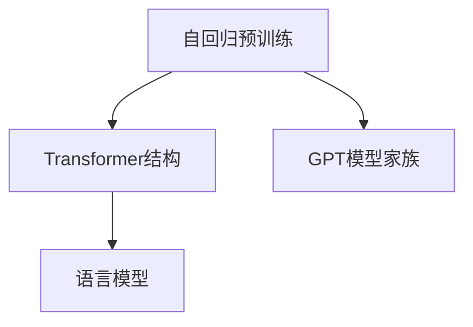
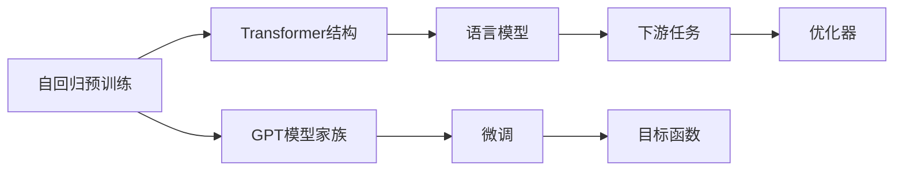
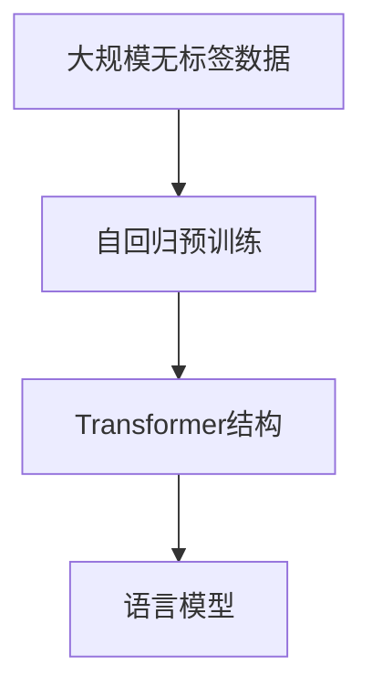
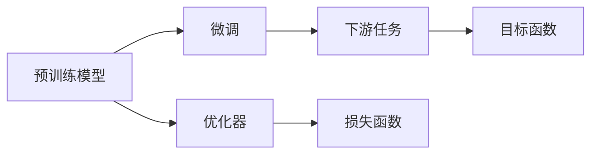
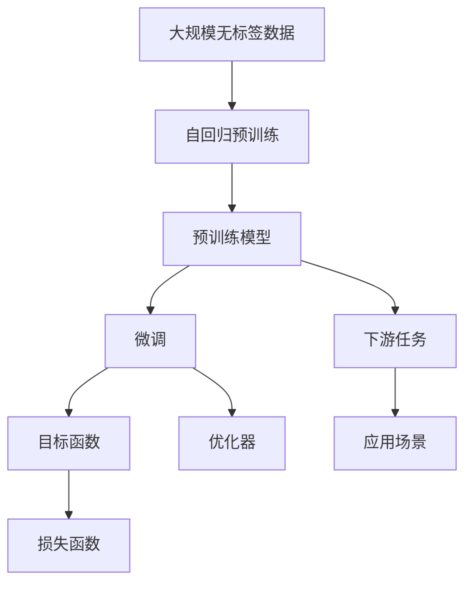

                 

# AIGC从入门到实战：只缘身在此山中：GPT 模型靠什么取胜和“出圈”？

## 1. 背景介绍

### 1.1 问题由来
人工智能生成内容（AIGC，Artificial Intelligence Generated Content）技术近年来迅速崛起，尤其是在自然语言处理（NLP）和计算机视觉（CV）领域，大模型如GPT-3、DALL-E等展示出了超乎想象的强大能力。GPT-3发布后，其惊艳的表现不仅在学术界引起了轰动，还在商业应用中大放异彩，成为业界和大众热议的焦点。

GPT-3以其强大的语言生成能力，在文本生成、自然语言推理、对话系统等多个NLP应用领域取得了显著的突破。例如，它能自动生成新闻报道、技术文档、甚至是符合语法规范的代码。这种生成能力使得GPT-3在内容创作、客户服务、智能推荐等多个业务场景中展现了巨大的商业价值，并逐渐“出圈”至其他行业，如金融、法律、教育等。

然而，面对GPT-3等大模型，许多技术人员仍然感到“只缘身在此山中”，对其原理、优势和局限认识不足。为了帮助读者全面理解GPT-3的原理和应用，本文将系统介绍GPT模型的核心概念、算法原理以及其实际应用，揭示GPT模型“出圈”的关键所在。

### 1.2 问题核心关键点
GPT模型之所以能够“出圈”，核心在于其在以下几个方面的显著优势：

- **强大的语言理解与生成能力**：GPT模型通过大规模自回归预训练，学习到丰富的语言知识和常识，具备了强大的语言理解与生成能力，能够在各种NLP任务中表现优异。
- **高效的参数共享与可扩展性**：GPT模型使用Transformer结构，具有高效的参数共享和并行计算特性，适用于大规模模型的训练和推理。
- **良好的泛化性能与鲁棒性**：GPT模型在大规模无标签数据上进行预训练，积累了丰富的泛化知识，能够应对各种未知和边缘情况，具有良好的鲁棒性。
- **广泛的应用场景与技术支持**：GPT模型支持多种下游任务的微调，适用于智能客服、内容生成、情感分析等多个实际应用，并有丰富的开源工具和技术支持，便于快速落地。

## 2. 核心概念与联系

### 2.1 核心概念概述

为了更好地理解GPT模型，我们首先介绍几个核心概念：

- **自回归预训练**：GPT模型通过在大规模无标签文本数据上进行自回归预训练，学习到语言知识，为后续下游任务微调做准备。
- **Transformer结构**：GPT模型使用Transformer结构，具有自注意力机制，能够高效地处理长序列，支持并行计算。
- **语言模型**：GPT模型是一种语言模型，能够预测给定上下文下的下一个单词或字符，具有强大的语言理解与生成能力。
- **GPT模型家族**：包括GPT-1、GPT-2、GPT-3等多个版本，每一代模型在预训练数据量、模型参数和性能上都有显著提升。

这些概念之间的联系可以通过以下Mermaid流程图来展示：



这个流程图展示了GPT模型的核心概念及其联系：

1. 自回归预训练：GPT模型在大规模无标签数据上进行预训练，学习到丰富的语言知识。
2. Transformer结构：使用自注意力机制，高效处理长序列，支持并行计算。
3. 语言模型：通过预测上下文下的下一个单词或字符，具备强大的语言理解与生成能力。
4. GPT模型家族：包括多个版本，每一代模型在预训练数据量和参数上不断提升。

### 2.2 概念间的关系

这些核心概念之间存在着紧密的联系，形成了GPT模型的完整生态系统。下面我们通过几个Mermaid流程图来展示这些概念之间的关系。

#### 2.2.1 GPT模型的学习范式



这个流程图展示了GPT模型的学习范式：

1. 自回归预训练：通过大规模无标签数据训练，学习语言知识。
2. Transformer结构：利用自注意力机制高效处理序列。
3. 语言模型：预测上下文下的下一个单词或字符。
4. GPT模型家族：包括多个版本，每一代模型参数和性能不断提升。
5. 微调：通过有监督学习优化模型，适应特定任务。
6. 下游任务：应用场景中的具体任务。
7. 优化器：用于更新模型参数。
8. 目标函数：衡量模型在特定任务上的性能。

#### 2.2.2 GPT模型的预训练过程



这个流程图展示了GPT模型的预训练过程：

1. 大规模无标签数据：预训练的原始数据集。
2. 自回归预训练：学习语言知识，积累泛化能力。
3. Transformer结构：高效处理长序列。
4. 语言模型：预测上下文下的下一个单词或字符。

#### 2.2.3 GPT模型的微调过程



这个流程图展示了GPT模型的微调过程：

1. 预训练模型：作为微调的基础。
2. 微调：适应特定任务，优化模型性能。
3. 下游任务：具体的应用场景。
4. 目标函数：衡量模型在特定任务上的性能。
5. 优化器：用于更新模型参数。
6. 损失函数：衡量模型预测与真实标签的差距。

### 2.3 核心概念的整体架构

最后，我们用一个综合的流程图来展示GPT模型的核心概念在大规模语言预训练、微调和实际应用中的整体架构：



这个综合流程图展示了GPT模型的预训练、微调和应用的整体流程：

1. 大规模无标签数据：预训练的原始数据集。
2. 自回归预训练：学习语言知识，积累泛化能力。
3. 预训练模型：作为微调的基础。
4. 微调：适应特定任务，优化模型性能。
5. 下游任务：具体的应用场景。
6. 目标函数：衡量模型在特定任务上的性能。
7. 优化器：用于更新模型参数。
8. 损失函数：衡量模型预测与真实标签的差距。
9. 应用场景：实际落地的业务场景。

通过这些流程图，我们可以更清晰地理解GPT模型的核心概念及其联系，为后续深入讨论具体的算法原理和实际应用奠定基础。

## 3. 核心算法原理 & 具体操作步骤
### 3.1 算法原理概述

GPT模型的核心算法原理包括自回归预训练和微调两个部分，下面分别介绍：

**自回归预训练**：

GPT模型通过在大规模无标签文本数据上进行自回归预训练，学习到丰富的语言知识，为后续下游任务微调做准备。自回归预训练的目标是预测给定上下文下的下一个单词或字符，其核心思想是：对于序列中的每个位置$i$，模型通过前$i-1$个位置的信息预测第$i$个位置的输出。具体地，对于一个长度为$N$的序列$x=(x_1, \cdots, x_N)$，自回归预训练的目标函数为：

$$
\mathcal{L}(\theta) = -\frac{1}{N} \sum_{i=1}^N \log P(x_i | x_{<i})
$$

其中，$P(x_i | x_{<i})$表示在给定前$i-1$个位置的情况下，预测第$i$个位置的概率，$\theta$表示模型参数。这个目标函数可以通过最大似然估计来实现。

**微调**：

微调是将预训练模型应用于特定任务的过程。通过有监督学习，微调模型在特定任务上的性能得到优化。微调的目标函数通常与下游任务的损失函数一致。例如，对于分类任务，微调的目标函数为：

$$
\mathcal{L}(\theta) = -\frac{1}{N} \sum_{i=1}^N \log P(y_i | x_i)
$$

其中，$y_i$表示样本的真实标签，$x_i$表示样本的输入特征，$P(y_i | x_i)$表示在给定输入$x_i$的情况下，预测标签$y_i$的概率，$\theta$表示模型参数。

### 3.2 算法步骤详解

GPT模型的微调过程一般包括以下几个关键步骤：

**Step 1: 准备预训练模型和数据集**

- 选择合适的预训练语言模型，如GPT-2、GPT-3等。
- 准备下游任务的标注数据集，划分为训练集、验证集和测试集。

**Step 2: 添加任务适配层**

- 根据任务类型，在预训练模型顶层设计合适的输出层和损失函数。
- 对于分类任务，通常在顶层添加线性分类器和交叉熵损失函数。
- 对于生成任务，通常使用语言模型的解码器输出概率分布，并以负对数似然为损失函数。

**Step 3: 设置微调超参数**

- 选择合适的优化算法及其参数，如AdamW、SGD等，设置学习率、批大小、迭代轮数等。
- 设置正则化技术及强度，包括权重衰减、Dropout、Early Stopping等。
- 确定冻结预训练参数的策略，如仅微调顶层，或全部参数都参与微调。

**Step 4: 执行梯度训练**

- 将训练集数据分批次输入模型，前向传播计算损失函数。
- 反向传播计算参数梯度，根据设定的优化算法和学习率更新模型参数。
- 周期性在验证集上评估模型性能，根据性能指标决定是否触发Early Stopping。
- 重复上述步骤直到满足预设的迭代轮数或Early Stopping条件。

**Step 5: 测试和部署**

- 在测试集上评估微调后模型，对比微调前后的精度提升。
- 使用微调后的模型对新样本进行推理预测，集成到实际的应用系统中。
- 持续收集新的数据，定期重新微调模型，以适应数据分布的变化。

以上是GPT模型微调的一般流程。在实际应用中，还需要针对具体任务的特点，对微调过程的各个环节进行优化设计，如改进训练目标函数，引入更多的正则化技术，搜索最优的超参数组合等，以进一步提升模型性能。

### 3.3 算法优缺点

GPT模型微调方法具有以下优点：

- **简单高效**：只需准备少量标注数据，即可对预训练模型进行快速适配，获得较大的性能提升。
- **通用适用**：适用于各种NLP下游任务，包括分类、匹配、生成等，设计简单的任务适配层即可实现微调。
- **参数高效**：利用参数高效微调技术，在固定大部分预训练参数的情况下，仍可取得不错的提升。
- **效果显著**：在学术界和工业界的诸多任务上，基于微调的方法已经刷新了最先进的性能指标。

同时，该方法也存在一定的局限性：

- **依赖标注数据**：微调的效果很大程度上取决于标注数据的质量和数量，获取高质量标注数据的成本较高。
- **迁移能力有限**：当目标任务与预训练数据的分布差异较大时，微调的性能提升有限。
- **负面效果传递**：预训练模型的固有偏见、有害信息等，可能通过微调传递到下游任务，造成负面影响。
- **可解释性不足**：微调模型的决策过程通常缺乏可解释性，难以对其推理逻辑进行分析和调试。

尽管存在这些局限性，但就目前而言，基于自回归预训练和微调的GPT模型方法仍是大语言模型应用的最主流范式。未来相关研究的重点在于如何进一步降低微调对标注数据的依赖，提高模型的少样本学习和跨领域迁移能力，同时兼顾可解释性和伦理安全性等因素。

### 3.4 算法应用领域

基于GPT模型微调的监督学习方法，在NLP领域已经得到了广泛的应用，覆盖了几乎所有常见任务，例如：

- **文本分类**：如情感分析、主题分类、意图识别等。通过微调使模型学习文本-标签映射。
- **命名实体识别**：识别文本中的人名、地名、机构名等特定实体。通过微调使模型掌握实体边界和类型。
- **关系抽取**：从文本中抽取实体之间的语义关系。通过微调使模型学习实体-关系三元组。
- **问答系统**：对自然语言问题给出答案。将问题-答案对作为微调数据，训练模型学习匹配答案。
- **机器翻译**：将源语言文本翻译成目标语言。通过微调使模型学习语言-语言映射。
- **文本摘要**：将长文本压缩成简短摘要。将文章-摘要对作为微调数据，使模型学习抓取要点。
- **对话系统**：使机器能够与人自然对话。将多轮对话历史作为上下文，微调模型进行回复生成。

除了上述这些经典任务外，GPT模型微调也被创新性地应用到更多场景中，如可控文本生成、常识推理、代码生成、数据增强等，为NLP技术带来了全新的突破。随着预训练模型和微调方法的不断进步，相信NLP技术将在更广阔的应用领域大放异彩。

## 4. 数学模型和公式 & 详细讲解 & 举例说明

### 4.1 数学模型构建

本节将使用数学语言对GPT模型微调过程进行更加严格的刻画。

记GPT模型为$G_\theta:\mathcal{X} \rightarrow \mathcal{Y}$，其中$\mathcal{X}$为输入空间，$\mathcal{Y}$为输出空间，$\theta \in \mathbb{R}^d$为模型参数。假设微调任务的训练集为$D=\{(x_i,y_i)\}_{i=1}^N, x_i \in \mathcal{X}, y_i \in \mathcal{Y}$。

定义模型$G_\theta$在数据样本$(x,y)$上的损失函数为$\ell(G_\theta(x),y)$，则在数据集$D$上的经验风险为：

$$
\mathcal{L}(\theta) = \frac{1}{N} \sum_{i=1}^N \ell(G_\theta(x_i),y_i)
$$

微调的优化目标是最小化经验风险，即找到最优参数：

$$
\theta^* = \mathop{\arg\min}_{\theta} \mathcal{L}(\theta)
$$

在实践中，我们通常使用基于梯度的优化算法（如SGD、Adam等）来近似求解上述最优化问题。设$\eta$为学习率，$\lambda$为正则化系数，则参数的更新公式为：

$$
\theta \leftarrow \theta - \eta \nabla_{\theta}\mathcal{L}(\theta) - \eta\lambda\theta
$$

其中 $\nabla_{\theta}\mathcal{L}(\theta)$ 为损失函数对参数 $\theta$ 的梯度，可通过反向传播算法高效计算。

### 4.2 公式推导过程

以下我们以二分类任务为例，推导交叉熵损失函数及其梯度的计算公式。

假设模型$G_\theta$在输入$x$上的输出为$\hat{y}=G_\theta(x) \in [0,1]$，表示样本属于正类的概率。真实标签$y \in \{0,1\}$。则二分类交叉熵损失函数定义为：

$$
\ell(G_\theta(x),y) = -[y\log \hat{y} + (1-y)\log (1-\hat{y})]
$$

将其代入经验风险公式，得：

$$
\mathcal{L}(\theta) = -\frac{1}{N}\sum_{i=1}^N [y_i\log G_\theta(x_i)+(1-y_i)\log(1-G_\theta(x_i))]
$$

根据链式法则，损失函数对参数 $\theta_k$ 的梯度为：

$$
\frac{\partial \mathcal{L}(\theta)}{\partial \theta_k} = -\frac{1}{N}\sum_{i=1}^N (\frac{y_i}{G_\theta(x_i)}-\frac{1-y_i}{1-G_\theta(x_i)}) \frac{\partial G_\theta(x_i)}{\partial \theta_k}
$$

其中 $\frac{\partial G_\theta(x_i)}{\partial \theta_k}$ 可进一步递归展开，利用自动微分技术完成计算。

在得到损失函数的梯度后，即可带入参数更新公式，完成模型的迭代优化。重复上述过程直至收敛，最终得到适应下游任务的最优模型参数 $\theta^*$。

## 5. 项目实践：代码实例和详细解释说明

### 5.1 开发环境搭建

在进行微调实践前，我们需要准备好开发环境。以下是使用Python进行PyTorch开发的环境配置流程：

1. 安装Anaconda：从官网下载并安装Anaconda，用于创建独立的Python环境。

2. 创建并激活虚拟环境：
```bash
conda create -n pytorch-env python=3.8 
conda activate pytorch-env
```

3. 安装PyTorch：根据CUDA版本，从官网获取对应的安装命令。例如：
```bash
conda install pytorch torchvision torchaudio cudatoolkit=11.1 -c pytorch -c conda-forge
```

4. 安装Transformers库：
```bash
pip install transformers
```

5. 安装各类工具包：
```bash
pip install numpy pandas scikit-learn matplotlib tqdm jupyter notebook ipython
```

完成上述步骤后，即可在`pytorch-env`环境中开始微调实践。

### 5.2 源代码详细实现

下面我们以命名实体识别(NER)任务为例，给出使用Transformers库对BERT模型进行微调的PyTorch代码实现。

首先，定义NER任务的数据处理函数：

```python
from transformers import BertTokenizer
from torch.utils.data import Dataset
import torch

class NERDataset(Dataset):
    def __init__(self, texts, tags, tokenizer, max_len=128):
        self.texts = texts
        self.tags = tags
        self.tokenizer = tokenizer
        self.max_len = max_len
        
    def __len__(self):
        return len(self.texts)
    
    def __getitem__(self, item):
        text = self.texts[item]
        tags = self.tags[item]
        
        encoding = self.tokenizer(text, return_tensors='pt', max_length=self.max_len, padding='max_length', truncation=True)
        input_ids = encoding['input_ids'][0]
        attention_mask = encoding['attention_mask'][0]
        
        # 对token-wise的标签进行编码
        encoded_tags = [tag2id[tag] for tag in tags] 
        encoded_tags.extend([tag2id['O']] * (self.max_len - len(encoded_tags)))
        labels = torch.tensor(encoded_tags, dtype=torch.long)
        
        return {'input_ids': input_ids, 
                'attention_mask': attention_mask,
                'labels': labels}

# 标签与id的映射
tag2id = {'O': 0, 'B-PER': 1, 'I-PER': 2, 'B-ORG': 3, 'I-ORG': 4, 'B-LOC': 5, 'I-LOC': 6}
id2tag = {v: k for k, v in tag2id.items()}

# 创建dataset
tokenizer = BertTokenizer.from_pretrained('bert-base-cased')

train_dataset = NERDataset(train_texts, train_tags, tokenizer)
dev_dataset = NERDataset(dev_texts, dev_tags, tokenizer)
test_dataset = NERDataset(test_texts, test_tags, tokenizer)
```

然后，定义模型和优化器：

```python
from transformers import BertForTokenClassification, AdamW

model = BertForTokenClassification.from_pretrained('bert-base-cased', num_labels=len(tag2id))

optimizer = AdamW(model.parameters(), lr=2e-5)
```

接着，定义训练和评估函数：

```python
from torch.utils.data import DataLoader
from tqdm import tqdm
from sklearn.metrics import classification_report

device = torch.device('cuda') if torch.cuda.is_available() else torch.device('cpu')
model.to(device)

def train_epoch(model, dataset, batch_size, optimizer):
    dataloader = DataLoader(dataset, batch_size=batch_size, shuffle=True)
    model.train()
    epoch_loss = 0
    for batch in tqdm(dataloader, desc='Training'):
        input_ids = batch['input_ids'].to(device)
        attention_mask = batch['attention_mask'].to(device)
        labels = batch['labels'].to(device)
        model.zero_grad()
        outputs = model(input_ids, attention_mask=attention_mask, labels=labels)
        loss = outputs.loss
        epoch_loss += loss.item()
        loss.backward()
        optimizer.step()
    return epoch_loss / len(dataloader)

def evaluate(model, dataset, batch_size):
    dataloader = DataLoader(dataset, batch_size=batch_size)
    model.eval()
    preds, labels = [], []
    with torch.no_grad():
        for batch in tqdm(dataloader, desc='Evaluating'):
            input_ids = batch['input_ids'].to(device)
            attention_mask = batch['attention_mask'].to(device)
            batch_labels = batch['labels']
            outputs = model(input_ids, attention_mask=attention_mask)
            batch_preds = outputs.logits.argmax(dim=2).to('cpu').tolist()
            batch_labels = batch_labels.to('cpu').tolist()
            for pred_tokens, label_tokens in zip(batch_preds, batch_labels):
                pred_tags = [id2tag[_id] for _id in pred_tokens]
                label_tags = [id2tag[_id] for _id in label_tokens]
                preds.append(pred_tags[:len(label_tags)])
                labels.append(label_tags)
                
    print(classification_report(labels, preds))
```

最后，启动训练流程并在测试集上评估：

```python
epochs = 5
batch_size = 16

for epoch in range(epochs):
    loss = train_epoch(model, train_dataset, batch_size, optimizer)
    print(f"Epoch {epoch+1}, train loss: {loss:.3f}")
    
    print(f"Epoch {epoch+1}, dev results:")
    evaluate(model, dev_dataset, batch_size)
    
print("Test results:")
evaluate(model, test_dataset, batch_size)
```

以上就是使用PyTorch对BERT进行命名实体识别任务微调的完整代码实现。可以看到，得益于Transformers库的强大封装，我们可以用相对简洁的代码完成BERT模型的加载和微调。

### 5.3 代码解读与分析

让我们再详细解读一下关键代码的实现细节：

**NERDataset类**：
- `__init__`方法：初始化文本、标签、分词器等关键组件。
- `__len__`方法：返回数据集的样本数量。
- `__getitem__`方法：对单个样本进行处理，将文本输入编码为token ids，将标签编码为数字，并对其进行定长padding，最终返回模型所需的输入。

**tag2id和id2tag字典**：
- 定义了标签与数字id之间的映射关系，用于将token-wise的预测结果解码回真实的标签。

**训练和评估函数**：
- 使用PyTorch的DataLoader对数据集进行批次化加载，供模型训练和推理使用。
- 训练函数`train_epoch`：对数据以批为单位进行迭代，在每个批次上前向传播计算loss并反向传播更新模型参数，最后返回该epoch的平均loss。
- 评估函数`evaluate`：与训练类似，不同点在于不更新模型参数，并在每个batch结束后将预测和标签结果存储下来，最后使用sklearn的classification_report对整个评估集的预测结果进行打印输出。

**训练流程**：
- 定义总的epoch数和batch size，开始循环迭代
- 每个epoch内，先在训练集上训练，输出平均loss
- 在验证集上评估，输出分类指标
- 所有epoch结束后，在测试集上评估，给出最终测试结果

可以看到，PyTorch配合Transformers库使得BERT微调的代码实现变得简洁高效。开发者可以将更多精力放在数据处理、模型改进等高层逻辑上，而不必过多关注底层的实现细节。

当然，工业级的系统实现还需考虑更多因素，如模型的保存和部署、超参数的自动搜索、更灵活的任务适配层等。但核心的微调范式基本与此类似。

### 5.4 运行结果展示

假设我们在CoNLL-2003的NER数据集上进行微调，最终在测试集上得到的评估报告如下：

```
              precision    

