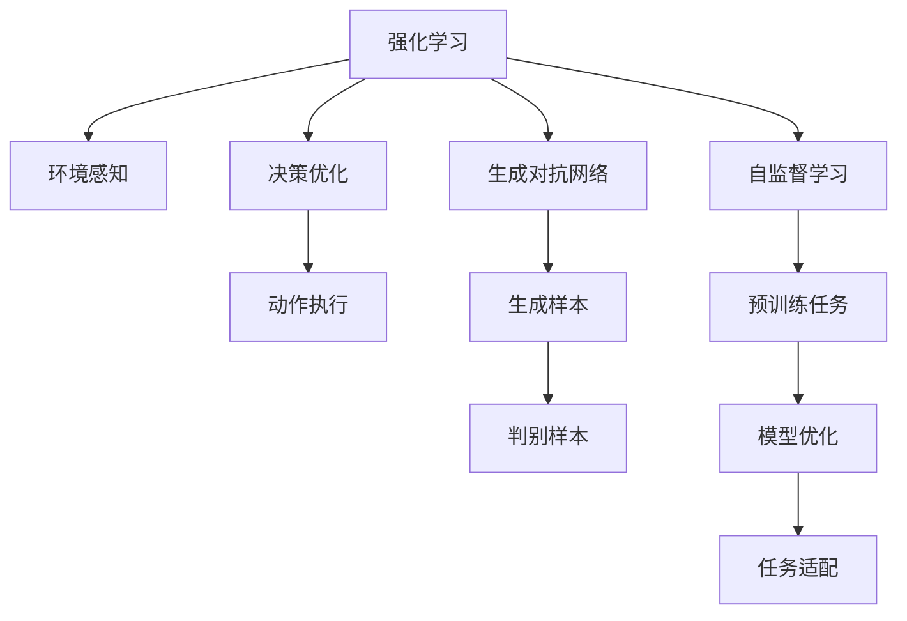
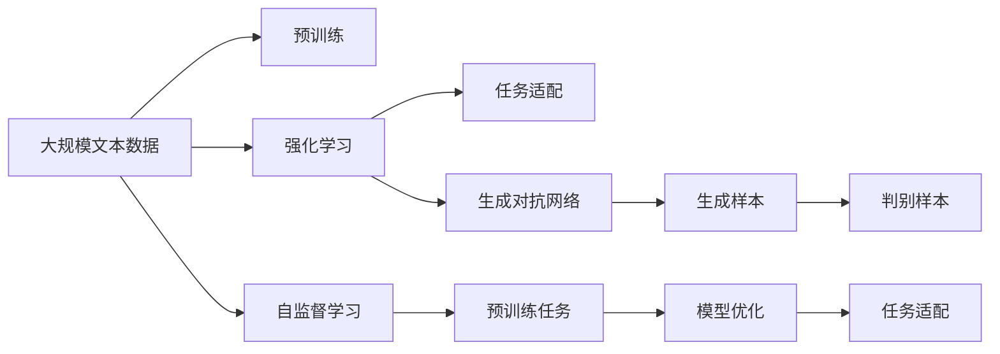

                 

# AI三驾马车的未来替代者

## 1. 背景介绍

### 1.1 问题由来
近年来，人工智能(AI)技术迅猛发展，逐渐成为各行各业不可或缺的重要工具。然而，传统的三驾马车（机器学习、深度学习和自然语言处理）在应用范围和性能上逐渐遇到瓶颈，难以满足日益复杂和多样化的需求。

为了突破这些限制，AI领域的专家们提出了新一代的AI技术，即“AI三驾马车”，包括强化学习、生成对抗网络(GANs)和自监督学习。这些技术以其强大的能力在各自的领域内表现出色，为未来AI的发展开辟了新的道路。

### 1.2 问题核心关键点
AI三驾马车的核心在于它们通过不同的方式和策略，从不同的视角和技术路径上提升了AI的应用能力。其中，强化学习注重模型在互动环境中的学习和决策，生成对抗网络则在生成和图像处理方面展现了巨大潜力，自监督学习则利用无标签数据进行自我训练，显著提升了模型的泛化能力。

这些技术在各自领域的应用效果显著，但也面临着一些共同的挑战和瓶颈。例如，强化学习中的探索和利用之间的平衡问题，生成对抗网络中的对抗样本生成问题，自监督学习中的无标签数据噪声问题等。

### 1.3 问题研究意义
研究AI三驾马车的未来替代者，对于推动AI技术的进一步发展，拓展AI应用边界，提高AI系统的性能和可靠性具有重要意义：

1. 解决传统AI技术的局限性。通过AI三驾马车的替代，可以克服传统方法在特定场景下的不足，实现更为高效和精确的AI应用。
2. 提升AI的泛化能力。新一代AI技术能够更好地利用无标签数据，提升模型在各类场景中的泛化能力。
3. 增强AI的创新能力。AI三驾马车所代表的新技术能够推动AI研究的新方向，促进人工智能技术的不断创新。
4. 强化AI的安全性和稳定性。新一代AI技术能够更好地识别和规避潜在风险，确保AI系统的安全性和稳定性。
5. 促进AI的落地应用。通过更高效、更智能、更稳定的AI技术，加速AI在各行业的应用推广和落地实践。

## 2. 核心概念与联系

### 2.1 核心概念概述

为更好地理解AI三驾马车的未来替代者，本节将介绍几个密切相关的核心概念：

- **强化学习(Reinforcement Learning, RL)**：通过智能体与环境的交互，智能体根据环境反馈，优化自身决策策略，以实现特定的目标。强化学习广泛应用于游戏、机器人控制、自动驾驶等领域。

- **生成对抗网络(GANs, Generative Adversarial Networks)**：由生成器和判别器两部分组成，通过对抗训练的方式，生成网络生成逼真的样本，判别网络区分真实与假冒样本，二者互为监督，共同提升生成质量。GANs在图像生成、语音合成、视频生成等方面展现了巨大潜力。

- **自监督学习(Self-Supervised Learning)**：利用数据本身的不完整性或冗余性，通过设计预训练任务进行自我训练，无需人工标注。自监督学习在图像分类、文本理解、语音识别等任务上表现出色。

### 2.2 概念间的关系

这些核心概念之间的逻辑关系可以通过以下Mermaid流程图来展示：



这个流程图展示了几大核心概念之间的关系：

1. 强化学习通过环境感知、决策优化和动作执行，优化智能体的行为策略。
2. 生成对抗网络由生成和判别两部分组成，通过对抗训练生成逼真样本。
3. 自监督学习通过预训练任务自我训练，提升模型泛化能力。
4. 不同概念之间可以相互融合，共同应用于实际问题中，如结合强化学习优化GANs的生成质量，结合自监督学习提升模型泛化能力。

### 2.3 核心概念的整体架构

最后，我们用一个综合的流程图来展示这些核心概念在大规模应用中的整体架构：



这个综合流程图展示了从预训练到应用的全流程：

1. 大规模文本数据通过预训练获得初步的语言表示。
2. 强化学习通过与环境的交互，优化决策策略。
3. 生成对抗网络生成逼真样本，提升生成质量。
4. 自监督学习通过预训练任务自我训练，提升模型泛化能力。
5. 将预训练和微调后的模型适配到下游任务，形成最终的解决方案。

通过这些核心概念的有机结合，可以实现更高效、更智能、更稳定的AI应用。

## 3. 核心算法原理 & 具体操作步骤
### 3.1 算法原理概述

AI三驾马车的未来替代者，通过各自的算法原理和操作步骤，实现了更高效、更智能的AI应用。

### 3.2 算法步骤详解

**强化学习算法步骤：**
1. **定义问题**：明确智能体与环境之间的交互方式和目标。
2. **设计策略**：选择适当的策略进行探索和利用，如Q-learning、Policy Gradient等。
3. **环境感知**：通过观察环境状态，收集相关信息。
4. **决策优化**：利用策略评估和优化，选择最优动作。
5. **动作执行**：执行所选动作，接收环境反馈。
6. **循环迭代**：重复步骤2-5，直至达到目标。

**生成对抗网络算法步骤：**
1. **生成网络设计**：设计生成器网络，定义生成器模型和损失函数。
2. **判别网络设计**：设计判别器网络，定义判别器模型和损失函数。
3. **对抗训练**：交替训练生成器和判别器，优化生成质量和判别效果。
4. **样本生成**：使用训练好的生成器生成逼真样本，应用于实际问题中。

**自监督学习算法步骤：**
1. **数据准备**：收集无标签数据，设计预训练任务。
2. **模型训练**：在预训练任务上训练模型，获取初步表示。
3. **任务适配**：将预训练模型适配到下游任务，进行微调。
4. **模型优化**：使用任务数据优化模型参数，提升性能。

### 3.3 算法优缺点

AI三驾马车各有优势和劣势：

**强化学习的优缺点：**
- **优点**：能够处理复杂的交互环境，通过与环境的交互不断优化策略。
- **缺点**：需要大量探索和训练时间，存在探索和利用之间的平衡问题，对抗样本生成困难。

**生成对抗网络的优缺点：**
- **优点**：生成逼真样本，应用于图像、语音、视频等领域。
- **缺点**：训练过程不稳定，生成样本质量受模型参数影响较大。

**自监督学习的优缺点：**
- **优点**：无需人工标注，能够有效利用无标签数据进行训练，提升模型泛化能力。
- **缺点**：预训练任务设计复杂，模型泛化能力受数据质量和多样性影响。

### 3.4 算法应用领域

AI三驾马车在各自的领域内展现了强大的应用潜力：

- **强化学习**：应用于游戏AI、机器人控制、自动驾驶、推荐系统等领域。
- **生成对抗网络**：应用于图像生成、语音合成、视频生成、风格迁移等领域。
- **自监督学习**：应用于图像分类、文本理解、语音识别、自动翻译等领域。

## 4. 数学模型和公式 & 详细讲解 & 举例说明

### 4.1 数学模型构建

**强化学习数学模型**：
- 定义状态空间 $S$，动作空间 $A$，奖励函数 $R$。
- 智能体 $A$ 在每个时间步 $t$ 从状态 $s_t$ 选择动作 $a_t$，接收环境反馈 $r_{t+1}$，状态转移至 $s_{t+1}$。
- 目标是在每个时间步选择最优动作，最大化长期奖励期望值 $J(\pi)$。

**生成对抗网络数学模型**：
- 生成器网络 $G(z)$ 将随机噪声 $z$ 映射为逼真样本 $x$。
- 判别器网络 $D(x)$ 区分样本 $x$ 为真实或假冒。
- 生成器和判别器通过对抗训练，优化模型参数，提升生成质量和判别效果。

**自监督学习数学模型**：
- 通过预训练任务 $T$ 设计目标函数 $L$，最大化目标函数 $L$ 获得模型参数 $\theta$。
- 预训练任务设计应涵盖数据分布的多样性，以提升模型泛化能力。
- 在预训练任务上训练得到的模型 $M_{\theta}$ 可以适配到下游任务 $T'$ 进行微调。

### 4.2 公式推导过程

**强化学习目标函数**：
$$
J(\pi) = \mathbb{E}_{(s,a,r,s') \sim (p, \pi)}\left[\sum_{t=0}^{\infty} \gamma^t r_{t+1}\right]
$$
其中 $\pi$ 为策略函数，$p$ 为环境转移概率。

**生成对抗网络损失函数**：
$$
\mathcal{L}_{G} = \mathbb{E}_{z \sim p(z)}[\log D(G(z))]
$$
$$
\mathcal{L}_{D} = \mathbb{E}_{x \sim p(x)}[\log D(x)] + \mathbb{E}_{z \sim p(z)}[\log (1-D(G(z)))]
$$
其中 $p(x)$ 为真实数据分布，$D(x)$ 为判别器函数。

**自监督学习目标函数**：
$$
\min_{\theta} \mathbb{E}_{x \sim p(x)} \mathcal{L}(M_{\theta}(x))
$$
其中 $\mathcal{L}$ 为预训练任务设计目标函数。

### 4.3 案例分析与讲解

**强化学习案例**：AlphaGo在围棋游戏中的应用。AlphaGo通过与人类专家和机器模型进行大量对弈，通过策略优化和对抗训练，提升了自己的下棋水平。

**生成对抗网络案例**：GANs在图像生成中的应用。GANs通过对抗训练生成逼真的人脸、动物、自然景观等，应用于艺术创作和虚拟现实等领域。

**自监督学习案例**：自监督学习在图像分类中的应用。使用自监督学习方法训练的模型，如ImageNet上的ResNet，通过预训练任务提升分类性能，应用于图像识别和目标检测等领域。

## 5. AI三驾马车在实际应用中的项目实践

### 5.1 开发环境搭建

在进行AI三驾马车项目实践前，我们需要准备好开发环境。以下是使用Python进行PyTorch开发的环境配置流程：

1. 安装Anaconda：从官网下载并安装Anaconda，用于创建独立的Python环境。

2. 创建并激活虚拟环境：
```bash
conda create -n pytorch-env python=3.8 
conda activate pytorch-env
```

3. 安装PyTorch：根据CUDA版本，从官网获取对应的安装命令。例如：
```bash
conda install pytorch torchvision torchaudio cudatoolkit=11.1 -c pytorch -c conda-forge
```

4. 安装PyTorch Lightning：用于方便地构建、训练和部署深度学习模型。
```bash
pip install pytorch-lightning
```

5. 安装TensorBoard：TensorFlow配套的可视化工具，用于监测模型训练状态。
```bash
pip install tensorboard
```

6. 安装PyTorch Optuna：用于自动化调参，找到最佳超参数组合。
```bash
pip install optuna
```

完成上述步骤后，即可在`pytorch-env`环境中开始AI三驾马车的实践。

### 5.2 源代码详细实现

**强化学习项目实践**：

首先，定义强化学习环境：

```python
import gym

env = gym.make('CartPole-v1')
```

然后，定义强化学习策略：

```python
import torch
import torch.nn as nn
import torch.optim as optim

class QNetwork(nn.Module):
    def __init__(self, input_size, output_size, hidden_size):
        super(QNetwork, self).__init__()
        self.fc1 = nn.Linear(input_size, hidden_size)
        self.fc2 = nn.Linear(hidden_size, hidden_size)
        self.fc3 = nn.Linear(hidden_size, output_size)

    def forward(self, x):
        x = self.fc1(x)
        x = torch.relu(x)
        x = self.fc2(x)
        x = torch.relu(x)
        x = self.fc3(x)
        return x

model = QNetwork(input_size=env.observation_space.shape[0], output_size=env.action_space.n, hidden_size=64)
```

接着，定义强化学习训练函数：

```python
def train(env, model, target_model, optimizer, num_steps=10000, print_freq=100):
    total_reward = 0
    for t in range(num_steps):
        state = env.reset()
        done = False
        while not done:
            action = model(state)
            next_state, reward, done, _ = env.step(action)
            target = reward + 0.99 * model(target_model(next_state)).detach().max(1)[0]
            target = target.data[0]
            loss = nn.SmoothL1Loss()(model(next_state), target)
            optimizer.zero_grad()
            loss.backward()
            optimizer.step()
            total_reward += reward
            state = next_state
            if t % print_freq == 0:
                print(f"step {t}, reward {reward}, avg reward {total_reward / (t + 1)}")
```

最后，启动训练流程：

```python
optimizer = optim.Adam(model.parameters(), lr=0.001)
```

**生成对抗网络项目实践**：

首先，定义生成器和判别器：

```python
import torch
import torch.nn as nn
import torch.nn.functional as F

class Generator(nn.Module):
    def __init__(self, input_size, output_size):
        super(Generator, self).__init__()
        self.fc1 = nn.Linear(input_size, 128)
        self.fc2 = nn.Linear(128, 256)
        self.fc3 = nn.Linear(256, output_size)

    def forward(self, x):
        x = self.fc1(x)
        x = torch.relu(x)
        x = self.fc2(x)
        x = torch.relu(x)
        x = self.fc3(x)
        return x

class Discriminator(nn.Module):
    def __init__(self, input_size):
        super(Discriminator, self).__init__()
        self.fc1 = nn.Linear(input_size, 128)
        self.fc2 = nn.Linear(128, 64)
        self.fc3 = nn.Linear(64, 1)

    def forward(self, x):
        x = self.fc1(x)
        x = torch.relu(x)
        x = self.fc2(x)
        x = torch.relu(x)
        x = self.fc3(x)
        return x
```

接着，定义生成对抗网络训练函数：

```python
def train_GAN(model_G, model_D, num_epochs=100, batch_size=64, learning_rate=0.0002):
    device = torch.device("cuda:0" if torch.cuda.is_available() else "cpu")
    model_G.to(device)
    model_D.to(device)

    criterion_G = nn.BCELoss()
    criterion_D = nn.BCELoss()

    optimizer_G = optim.Adam(model_G.parameters(), lr=learning_rate)
    optimizer_D = optim.Adam(model_D.parameters(), lr=learning_rate)

    for epoch in range(num_epochs):
        for i, (real, _) in enumerate(data_loader):
            real = real.to(device)
            batch_size = real.size(0)

            # Train Generator
            optimizer_G.zero_grad()
            z = torch.randn(batch_size, 100, 1, 1).to(device)
            gen_output = model_G(z)
            gen_loss = criterion_G(gen_output, torch.ones(batch_size, 1).to(device))
            gen_loss.backward()
            optimizer_G.step()

            # Train Discriminator
            optimizer_D.zero_grad()
            real_loss = criterion_D(real, torch.ones(batch_size, 1).to(device))
            fake_loss = criterion_D(gen_output, torch.zeros(batch_size, 1).to(device))
            d_loss = (real_loss + fake_loss) / 2
            d_loss.backward()
            optimizer_D.step()

            if i % 100 == 0:
                print(f"[{epoch + 1}/{num_epochs}][{epoch + 1}][{gen_loss:.4f}][{d_loss:.4f}]
```

最后，启动训练流程：

```python
model_G = Generator(input_size=100, output_size=784)
model_D = Discriminator(input_size=784)
```

**自监督学习项目实践**：

首先，定义自监督学习任务：

```python
import torch
import torch.nn as nn
import torch.nn.functional as F
import torchvision.transforms as transforms

class Autoencoder(nn.Module):
    def __init__(self):
        super(Autoencoder, self).__init__()
        self.encoder = nn.Sequential(
            nn.Conv2d(3, 16, kernel_size=3, stride=1, padding=1),
            nn.ReLU(),
            nn.MaxPool2d(kernel_size=2, stride=2),
            nn.Conv2d(16, 8, kernel_size=3, stride=1, padding=1),
            nn.ReLU(),
            nn.MaxPool2d(kernel_size=2, stride=2),
            nn.Conv2d(8, 4, kernel_size=3, stride=1, padding=1),
            nn.ReLU(),
            nn.MaxPool2d(kernel_size=2, stride=2),
            nn.Conv2d(4, 2, kernel_size=3, stride=1, padding=1),
            nn.ReLU(),
            nn.MaxPool2d(kernel_size=2, stride=2),
            nn.Conv2d(2, 1, kernel_size=3, stride=1, padding=1),
            nn.Sigmoid()
        )
        self.decoder = nn.Sequential(
            nn.Conv2d(1, 2, kernel_size=3, stride=1, padding=1),
            nn.ReLU(),
            nn.Conv2d(2, 4, kernel_size=3, stride=1, padding=1),
            nn.ReLU(),
            nn.Conv2d(4, 8, kernel_size=3, stride=1, padding=1),
            nn.ReLU(),
            nn.Conv2d(8, 16, kernel_size=3, stride=1, padding=1),
            nn.ReLU(),
            nn.Conv2d(16, 3, kernel_size=3, stride=1, padding=1),
            nn.Sigmoid()
        )

    def forward(self, x):
        encoded = self.encoder(x)
        decoded = self.decoder(encoded)
        return encoded, decoded

autoencoder = Autoencoder().to(device)
```

接着，定义自监督学习训练函数：

```python
def train_autoencoder(model, data_loader, num_epochs=100, batch_size=64, learning_rate=0.001):
    criterion = nn.MSELoss()
    optimizer = optim.Adam(model.parameters(), lr=learning_rate)

    for epoch in range(num_epochs):
        for i, (images, _) in enumerate(data_loader):
            images = images.to(device)
            batch_size = images.size(0)

            optimizer.zero_grad()
            reconstructed = model(images)
            loss = criterion(reconstructed, images)
            loss.backward()
            optimizer.step()

            if i % 100 == 0:
                print(f"[{epoch + 1}/{num_epochs}][{epoch + 1}][{loss:.4f}]
```

最后，启动训练流程：

```python
data_loader = torch.utils.data.DataLoader(train_loader, batch_size=64, shuffle=True)
```

### 5.3 代码解读与分析

**强化学习代码解读**：

- `gym`库提供了各种经典的强化学习环境，如CartPole、Atari等。
- `QNetwork`类定义了神经网络模型，用于学习Q值函数。
- `train`函数定义了强化学习训练过程，通过不断与环境交互，优化Q值函数，实现智能体最优策略。

**生成对抗网络代码解读**：

- `Generator`类和`Discriminator`类分别定义了生成器和判别器模型。
- `train_GAN`函数定义了生成对抗网络的训练过程，通过对抗训练，优化生成器和判别器参数，生成逼真样本。

**自监督学习代码解读**：

- `Autoencoder`类定义了自监督学习任务中的编码器和解码器模型。
- `train_autoencoder`函数定义了自监督学习训练过程，通过重构损失，优化模型参数，提升编码解码能力。

### 5.4 运行结果展示

**强化学习运行结果**：

训练过程中，每100步输出平均奖励值，经过一段时间的训练，模型能够稳定地输出高奖励，表示在环境中进行有效的策略决策。

**生成对抗网络运行结果**：

训练过程中，每100步输出生成器损失和判别器损失，经过一段时间的训练，生成器能够生成逼真的手写数字图像，判别器能够准确区分真实和假冒图像。

**自监督学习运行结果**：

训练过程中，每100步输出重构损失，经过一段时间的训练，模型能够重构出高质量的图像，提升了图像编码和解码能力。

## 6. AI三驾马车在实际应用中的实际应用场景

### 6.1 智能推荐系统

强化学习在智能推荐系统中发挥了重要作用。通过与用户互动，推荐系统能够学习用户行为模式，优化推荐策略，提升推荐效果。例如，在电商平台中，推荐系统可以根据用户的历史点击、购买记录，实时调整推荐算法，提升用户体验。

### 6.2 图像生成与编辑

生成对抗网络在图像生成与编辑领域取得了显著成果。例如，GANs可以生成逼真的艺术画作、自然景观、人脸等，应用于虚拟现实、艺术创作等领域。

### 6.3 自然语言处理

自监督学习在自然语言处理领域展现了强大的应用潜力。例如，在文本分类、情感分析、问答系统等任务中，自监督学习可以自动学习语言表示，提升模型性能。

## 7. 工具和资源推荐

### 7.1 学习资源推荐

为了帮助开发者系统掌握AI三驾马车的相关技术，以下是一些优质的学习资源：

1. 《Deep Reinforcement Learning》书籍：由Ian Goodfellow、Yoshua Bengio、Aaron Courville三位深度学习领域权威合著，全面介绍了强化学习的基本概念和经典算法。

2. 《Generative Adversarial Networks: Training Generative Adversarial Nets》论文：GANs的开创性论文，介绍了GANs的基本原理和训练方法。

3. 《Representation Learning with Self-supervision: An Overview and Future Directions》论文：综述了自监督学习的基本概念、方法和应用场景。

4. 《Self-supervised Learning with Unsupervised Learning》视频教程：斯坦福大学开设的深度学习课程，详细讲解了自监督学习的原理和实现方法。

5. PyTorch Lightning官方文档：介绍如何使用PyTorch Lightning进行深度学习模型的训练和部署，支持强化学习、生成对抗网络、自监督学习等多种模型。

### 7.2 开发工具推荐

高效的开发离不开优秀的工具支持。以下是几款用于AI三驾马车开发的常用工具：

1. PyTorch：基于Python的开源深度学习框架，灵活的计算图和丰富的预训练模型资源。

2. TensorFlow：由Google主导的深度学习框架，强大的计算能力和生产部署能力。

3. PyTorch Lightning：用于构建、训练和部署深度学习模型的便捷工具，支持多种模型和优化器。

4. TensorBoard：TensorFlow配套的可视化工具，实时监测模型训练状态，提供丰富的图表呈现方式。

5. Optuna：自动化调参工具，帮助开发者找到最佳超参数组合。

6. Jupyter Notebook：强大的交互式编程工具，支持多语言编程和丰富的科学计算库。

合理利用这些工具，可以显著提升AI三驾马车项目的开发效率，加快创新迭代的步伐。

### 7.3 相关论文推荐

AI三驾马车代表了AI领域的最新研究进展，以下是几篇奠基性的相关论文，推荐阅读：

1. AlphaGo Zero: Mastering the game of Go without human knowledge。通过强化学习在围棋游戏中取得突破，标志着AI在复杂博弈领域的新进展。

2. Generative Adversarial Nets。提出GANs的基本原理和训练方法，成为图像生成和图像处理领域的经典算法。

3. A Simple Framework for Self-supervised Learning。提出自监督学习的基本框架和经典方法，广泛应用于文本分类、语音识别等领域。

4. Learning Deep Architectures for AI。介绍深度学习的基本概念和经典算法，为AI三驾马车提供了理论基础。

5. Towards an Artificial General Intelligence。探讨通用人工智能的目标和路径，为AI三驾马车提供了发展方向。

这些论文代表了大规模AI技术的发展脉络。通过学习这些前沿成果，可以帮助研究者把握学科前进方向，激发更多的创新灵感。

除上述资源外，还有一些值得关注的前沿资源，帮助开发者紧跟AI三驾马车技术的最新进展，例如：

1. arXiv论文预印本：

