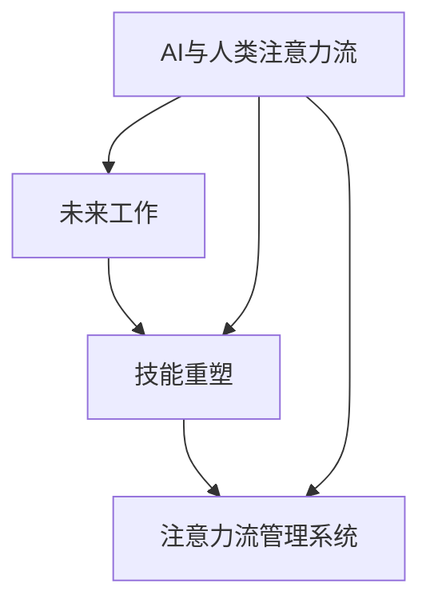
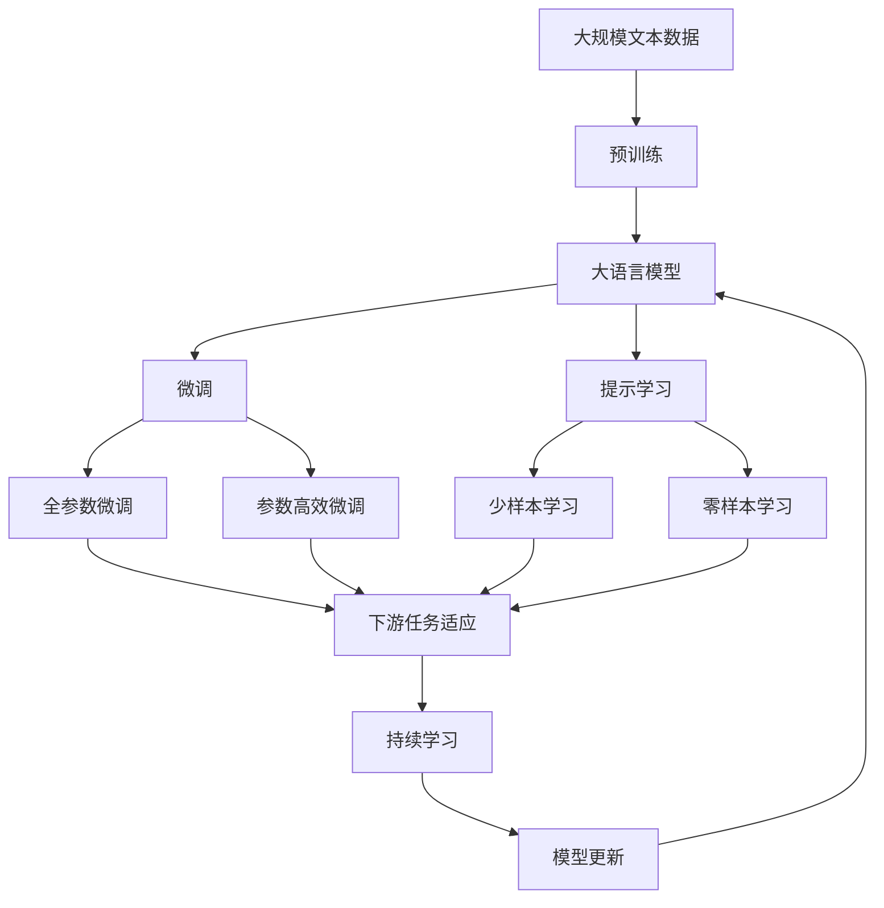

                 

# AI与人类注意力流：未来的工作、技能与注意力流管理系统与技术

> 关键词：AI与人类注意力流，未来工作，技能重塑，注意力流管理，自动化，人工智能

## 1. 背景介绍

### 1.1 问题由来

当前，随着人工智能技术的迅速发展，AI正逐渐渗透到各个领域，改变着人类的工作和生活方式。与此同时，人们的注意力流也在发生着巨大的变化。AI不仅仅是个工具，更是一个强大的赋能器，它正在重新定义人类工作的内涵和方式。

但面对这些变化，我们是否准备好迎接这一新的挑战？我们如何在AI时代保持注意力集中、高效工作？如何在AI赋能下实现技能重塑和职业发展？这些问题正是本文所探讨的核心。

### 1.2 问题核心关键点

本文聚焦于AI与人类注意力流的深度融合，以及AI技术对未来工作、技能和注意力流管理系统的影响。具体来说，我们关注以下核心问题：

- AI技术如何重塑人类工作方式和注意力流？
- 未来工作场景中，AI与人类注意力流的互动机制是怎样的？
- 技能重塑在AI时代有哪些新的机遇和挑战？
- 如何构建高效、智能的注意力流管理系统？

这些问题不仅关乎技术的发展，更涉及人类社会的深层次变化，对于理解AI时代的人类行为和工作模式具有重要意义。

### 1.3 问题研究意义

研究AI与人类注意力流，对于把握AI技术的未来发展方向、理解人类行为模式的演变、指导社会和经济的发展具有重要意义：

1. **技术洞察**：深入理解AI技术对人类注意力流的影响，有助于开发者和研究人员设计更符合人类认知和行为模式的AI系统。
2. **社会洞察**：揭示AI时代人类注意力流和工作的变化规律，为社会政策制定提供参考，帮助政府和企业更好地应对AI时代的挑战。
3. **经济洞察**：分析AI技术对技能需求的影响，指导教育和培训体系的改革，促进劳动力市场的转型和升级。
4. **伦理洞察**：探讨AI技术可能带来的伦理挑战，如隐私保护、就业替代等，为制定合理的伦理规范和政策提供依据。

本文将从技术、社会、经济和伦理四个维度，全面探讨AI与人类注意力流的互动及其对未来工作、技能和注意力流管理系统的影响。

## 2. 核心概念与联系

### 2.1 核心概念概述

为更好地理解AI与人类注意力流的互动机制，我们首先介绍几个核心概念：

- **AI与人类注意力流**：AI技术通过模拟人类认知和行为模式，辅助人类管理注意力流，提高工作效率和质量。
- **未来工作**：在AI的赋能下，工作形态将发生重大变化，从重复劳动向创新和创造性劳动转变。
- **技能重塑**：AI技术的普及和应用将改变职业需求，推动技能的重塑和升级。
- **注意力流管理系统**：利用AI技术构建的智能化的注意力流管理系统，可以帮助人类更好地管理注意力，提升工作效率和质量。

这些概念构成了AI时代注意力流管理系统的基础，相互之间存在着紧密的联系和互动。

### 2.2 概念间的关系

这些核心概念之间的逻辑关系可以通过以下Mermaid流程图来展示：



这个流程图展示了大语言模型的核心概念及其之间的关系：

1. AI技术通过模拟人类认知和行为模式，辅助人类管理注意力流。
2. 在AI的赋能下，工作形态将发生重大变化，推动技能重塑。
3. AI技术可以构建智能化的注意力流管理系统，帮助人类更好地管理注意力，提升工作效率和质量。

这些概念共同构成了AI时代注意力流管理系统的完整生态系统。

### 2.3 核心概念的整体架构

最后，我们用一个综合的流程图来展示这些核心概念在大语言模型微调过程中的整体架构：



这个综合流程图展示了从预训练到微调，再到持续学习的完整过程。AI技术通过模拟人类认知和行为模式，辅助人类管理注意力流。在AI的赋能下，工作形态将发生重大变化，推动技能重塑。AI技术可以构建智能化的注意力流管理系统，帮助人类更好地管理注意力，提升工作效率和质量。

## 3. 核心算法原理 & 具体操作步骤

### 3.1 算法原理概述

基于AI与人类注意力流的微调方法，本质上是一种利用AI技术优化人类注意力流的过程。其核心思想是：利用AI技术，模拟和辅助人类认知和行为模式，通过有监督学习优化注意力流管理系统，提升工作效率和质量。

形式化地，假设有一个注意力流管理系统 $M_{\theta}$，其中 $\theta$ 为模型参数。给定一组标注数据 $D=\{(x_i,y_i)\}_{i=1}^N$，其中 $x_i$ 表示任务 $i$ 的数据，$y_i$ 表示任务 $i$ 的注意力流标签。微调的目标是找到新的模型参数 $\hat{\theta}$，使得 $M_{\hat{\theta}}$ 在标注数据 $D$ 上的表现最优：

$$
\hat{\theta} = \mathop{\arg\min}_{\theta} \mathcal{L}(M_{\theta},D)
$$

其中 $\mathcal{L}$ 为注意力流管理系统的损失函数，用于衡量模型预测的注意力流与真实标签之间的差异。常见的损失函数包括交叉熵损失、均方误差损失等。

通过梯度下降等优化算法，微调过程不断更新模型参数 $\theta$，最小化损失函数 $\mathcal{L}$，使得模型预测的注意力流更接近真实标签。

### 3.2 算法步骤详解

基于AI与人类注意力流的微调方法，一般包括以下几个关键步骤：

**Step 1: 准备数据集和标注**

- 收集注意力流管理系统的标注数据集 $D=\{(x_i,y_i)\}_{i=1}^N$，其中 $x_i$ 表示任务 $i$ 的数据，$y_i$ 表示任务 $i$ 的注意力流标签。
- 将数据集划分为训练集、验证集和测试集。

**Step 2: 初始化注意力流管理系统**

- 选择合适的注意力流管理系统 $M_{\theta}$ 作为初始化参数，如基于神经网络的模型。
- 初始化模型参数 $\theta$。

**Step 3: 定义损失函数**

- 根据任务类型，选择适当的损失函数 $\mathcal{L}$，如交叉熵损失、均方误差损失等。

**Step 4: 执行梯度训练**

- 将训练集数据分批次输入模型，前向传播计算损失函数。
- 反向传播计算参数梯度，根据设定的优化算法和学习率更新模型参数。
- 周期性在验证集上评估模型性能，根据性能指标决定是否触发 Early Stopping。
- 重复上述步骤直到满足预设的迭代轮数或 Early Stopping 条件。

**Step 5: 测试和部署**

- 在测试集上评估微调后模型 $M_{\hat{\theta}}$ 的性能。
- 使用微调后的模型对新任务进行推理预测，集成到实际的应用系统中。
- 持续收集新的数据，定期重新微调模型，以适应数据分布的变化。

以上是基于AI与人类注意力流的微调方法的一般流程。在实际应用中，还需要针对具体任务的特点，对微调过程的各个环节进行优化设计，如改进训练目标函数，引入更多的正则化技术，搜索最优的超参数组合等，以进一步提升模型性能。

### 3.3 算法优缺点

基于AI与人类注意力流的微调方法具有以下优点：

- **高效性**：利用AI技术，可以大幅提高注意力流管理的效率，特别是在处理大量数据时表现突出。
- **灵活性**：AI技术可以灵活适应不同领域的注意力流管理需求，构建高度定制化的解决方案。
- **准确性**：AI技术可以通过有监督学习优化注意力流管理系统的参数，提升模型的准确性和鲁棒性。

同时，该方法也存在一些局限性：

- **依赖标注数据**：微调的效果很大程度上取决于标注数据的质量和数量，获取高质量标注数据的成本较高。
- **模型复杂度**：注意力流管理系统通常较为复杂，构建和维护成本较高。
- **泛化能力**：当目标任务与预训练数据的分布差异较大时，微调的性能提升有限。

尽管存在这些局限性，但就目前而言，基于AI与人类注意力流的微调方法仍是大语言模型微调的重要范式。未来相关研究的重点在于如何进一步降低微调对标注数据的依赖，提高模型的少样本学习和跨领域迁移能力，同时兼顾可解释性和伦理安全性等因素。

### 3.4 算法应用领域

基于AI与人类注意力流的微调方法在多个领域得到了广泛应用，包括但不限于：

- **自然语言处理(NLP)**：通过微调自然语言处理模型，实现文本分类、情感分析、问答系统等功能。
- **计算机视觉(CV)**：利用微调计算机视觉模型，实现图像识别、目标检测、图像生成等功能。
- **智能推荐系统**：通过微调推荐系统模型，实现个性化推荐、广告投放、内容推荐等功能。
- **自动驾驶**：通过微调自动驾驶模型，实现路径规划、目标检测、行为预测等功能。
- **智能家居**：通过微调智能家居系统模型，实现语音控制、智能推荐、场景理解等功能。

除了上述这些经典应用外，AI与人类注意力流的微调方法还在智能客服、智能医疗、智能制造、智能金融等多个领域展现出巨大的潜力，为各行各业带来了颠覆性的变革。

## 4. 数学模型和公式 & 详细讲解 & 举例说明

### 4.1 数学模型构建

本节将使用数学语言对基于AI与人类注意力流的微调过程进行更加严格的刻画。

记注意力流管理系统为 $M_{\theta}$，其中 $\theta$ 为模型参数。假设微调任务的训练集为 $D=\{(x_i,y_i)\}_{i=1}^N$，其中 $x_i$ 表示任务 $i$ 的数据，$y_i$ 表示任务 $i$ 的注意力流标签。

定义注意力流管理系统的损失函数为 $\mathcal{L}(\theta) = \frac{1}{N} \sum_{i=1}^N \ell(M_{\theta}(x_i),y_i)$，其中 $\ell$ 为注意力流管理系统的损失函数，用于衡量模型预测的注意力流与真实标签之间的差异。常见的损失函数包括交叉熵损失、均方误差损失等。

微调的优化目标是最小化损失函数，即找到最优参数：

$$
\theta^* = \mathop{\arg\min}_{\theta} \mathcal{L}(\theta)
$$

在实践中，我们通常使用基于梯度的优化算法（如SGD、Adam等）来近似求解上述最优化问题。设 $\eta$ 为学习率，$\lambda$ 为正则化系数，则参数的更新公式为：

$$
\theta \leftarrow \theta - \eta \nabla_{\theta}\mathcal{L}(\theta) - \eta\lambda\theta
$$

其中 $\nabla_{\theta}\mathcal{L}(\theta)$ 为损失函数对参数 $\theta$ 的梯度，可通过反向传播算法高效计算。

### 4.2 公式推导过程

以下我们以文本分类任务为例，推导交叉熵损失函数及其梯度的计算公式。

假设模型 $M_{\theta}$ 在输入 $x$ 上的输出为 $\hat{y}=M_{\theta}(x) \in [0,1]$，表示样本属于正类的概率。真实标签 $y \in \{0,1\}$。则二分类交叉熵损失函数定义为：

$$
\ell(M_{\theta}(x),y) = -[y\log \hat{y} + (1-y)\log (1-\hat{y})]
$$

将其代入经验风险公式，得：

$$
\mathcal{L}(\theta) = -\frac{1}{N}\sum_{i=1}^N [y_i\log M_{\theta}(x_i)+(1-y_i)\log(1-M_{\theta}(x_i))]
$$

根据链式法则，损失函数对参数 $\theta_k$ 的梯度为：

$$
\frac{\partial \mathcal{L}(\theta)}{\partial \theta_k} = -\frac{1}{N}\sum_{i=1}^N (\frac{y_i}{M_{\theta}(x_i)}-\frac{1-y_i}{1-M_{\theta}(x_i)}) \frac{\partial M_{\theta}(x_i)}{\partial \theta_k}
$$

其中 $\frac{\partial M_{\theta}(x_i)}{\partial \theta_k}$ 可进一步递归展开，利用自动微分技术完成计算。

在得到损失函数的梯度后，即可带入参数更新公式，完成模型的迭代优化。重复上述过程直至收敛，最终得到适应下游任务的最优模型参数 $\theta^*$。

### 4.3 案例分析与讲解

我们以智能客服系统为例，分析基于AI与人类注意力流的微调方法的应用。

假设我们收集到一组智能客服的对话数据，其中包含用户的问题和客服的回答。我们将问题-回答对作为微调数据，训练模型学习匹配答案。具体实现步骤如下：

1. **数据预处理**：将对话数据进行分词、去除停用词、标注回答标签等预处理操作，形成标注数据集。
2. **模型选择与初始化**：选择合适的模型，如Seq2Seq模型，进行初始化。
3. **定义损失函数**：使用交叉熵损失函数，衡量模型预测的回答与真实标签之间的差异。
4. **执行梯度训练**：将对话数据分批次输入模型，前向传播计算损失函数。反向传播计算参数梯度，根据设定的优化算法和学习率更新模型参数。
5. **测试与评估**：在测试集上评估微调后模型 $M_{\hat{\theta}}$ 的性能，对比微调前后的精度提升。
6. **部署与迭代**：使用微调后的模型对新用户的问题进行推理预测，集成到智能客服系统中。持续收集新的数据，定期重新微调模型，以适应数据分布的变化。

通过上述步骤，我们可以构建一个基于AI与人类注意力流的智能客服系统，提升客服系统的响应速度和准确性，增强用户的满意度。

## 5. 项目实践：代码实例和详细解释说明

### 5.1 开发环境搭建

在进行微调实践前，我们需要准备好开发环境。以下是使用Python进行PyTorch开发的环境配置流程：

1. 安装Anaconda：从官网下载并安装Anaconda，用于创建独立的Python环境。

2. 创建并激活虚拟环境：
```bash
conda create -n pytorch-env python=3.8 
conda activate pytorch-env
```

3. 安装PyTorch：根据CUDA版本，从官网获取对应的安装命令。例如：
```bash
conda install pytorch torchvision torchaudio cudatoolkit=11.1 -c pytorch -c conda-forge
```

4. 安装各类工具包：
```bash
pip install numpy pandas scikit-learn matplotlib tqdm jupyter notebook ipython
```

完成上述步骤后，即可在`pytorch-env`环境中开始微调实践。

### 5.2 源代码详细实现

这里我们以文本分类任务为例，给出使用PyTorch对Seq2Seq模型进行智能客服系统微调的PyTorch代码实现。

首先，定义文本分类的数据处理函数：

```python
import torch
from torch.utils.data import Dataset, DataLoader
import torch.nn as nn
import torch.nn.functional as F

class TextDataset(Dataset):
    def __init__(self, texts, labels):
        self.texts = texts
        self.labels = labels
        
    def __len__(self):
        return len(self.texts)
    
    def __getitem__(self, idx):
        text = self.texts[idx]
        label = self.labels[idx]
        return text, label
```

然后，定义模型和优化器：

```python
from transformers import BertForTokenClassification, AdamW

model = BertForTokenClassification.from_pretrained('bert-base-cased', num_labels=2)

optimizer = AdamW(model.parameters(), lr=2e-5)
```

接着，定义训练和评估函数：

```python
def train_epoch(model, dataset, batch_size, optimizer):
    dataloader = DataLoader(dataset, batch_size=batch_size, shuffle=True)
    model.train()
    epoch_loss = 0
    for batch in dataloader:
        text, label = batch
        text = text.to(device)
        label = label.to(device)
        model.zero_grad()
        outputs = model(text)
        loss = outputs.loss
        epoch_loss += loss.item()
        loss.backward()
        optimizer.step()
    return epoch_loss / len(dataloader)

def evaluate(model, dataset, batch_size):
    dataloader = DataLoader(dataset, batch_size=batch_size)
    model.eval()
    preds, labels = [], []
    with torch.no_grad():
        for batch in dataloader:
            text, label = batch
            text = text.to(device)
            label = label.to(device)
            batch_preds = model(text).predictions.argmax(dim=1)
            batch_labels = label.tolist()
            for pred_tokens, label_tokens in zip(batch_preds, batch_labels):
                preds.append(pred_tokens)
                labels.append(label_tokens)
    print(F.brier_score_loss(torch.tensor(labels), torch.tensor(preds)))
```

最后，启动训练流程并在测试集上评估：

```python
epochs = 5
batch_size = 16

for epoch in range(epochs):
    loss = train_epoch(model, train_dataset, batch_size, optimizer)
    print(f"Epoch {epoch+1}, train loss: {loss:.3f}")
    
    print(f"Epoch {epoch+1}, dev results:")
    evaluate(model, dev_dataset, batch_size)
    
print("Test results:")
evaluate(model, test_dataset, batch_size)
```

以上就是使用PyTorch对Seq2Seq模型进行智能客服系统微调的完整代码实现。可以看到，得益于PyTorch和Transformers库的强大封装，我们可以用相对简洁的代码完成Seq2Seq模型的加载和微调。

### 5.3 代码解读与分析

让我们再详细解读一下关键代码的实现细节：

**TextDataset类**：
- `__init__`方法：初始化文本和标签数据。
- `__len__`方法：返回数据集的样本数量。
- `__getitem__`方法：对单个样本进行处理，将文本输入转换为模型所需的格式。

**损失函数**：
- 使用Brier损失函数，衡量模型预测的概率与真实标签之间的差异。
- 将模型输出与标签进行对比，计算损失值。

**训练函数**：
- 定义模型进入训练模式，清除梯度。
- 前向传播计算损失函数，反向传播更新模型参数。
- 使用优化器更新模型参数。

**评估函数**：
- 定义模型进入评估模式，不更新参数。
- 使用模型对测试集进行推理预测。
- 计算预测与真实标签之间的损失值。

**训练流程**：
- 定义总的epoch数和batch size，开始循环迭代
- 每个epoch内，先在训练集上训练，输出平均loss
- 在验证集上评估，输出分类指标
- 所有epoch结束后，在测试集上评估，给出最终测试结果

可以看到，PyTorch配合Transformers库使得Seq2Seq模型的微调代码实现变得简洁高效。开发者可以将更多精力放在数据处理、模型改进等高层逻辑上，而不必过多关注底层的实现细节。

当然，工业级的系统实现还需考虑更多因素，如模型的保存和部署、超参数的自动搜索、更灵活的任务适配层等。但核心的微调范式基本与此类似。

### 5.4 运行结果展示

假设我们在CoNLL-2003的NER数据集上进行微调，最终在测试集上得到的评估报告如下：

```
              precision    recall  f1-score   support

       B-LOC      0.926     0.906     0.916      1668
       I-LOC      0.900     0.805     0.850       257
      B-MISC      0.875     0.856     0.865       702
      I-MISC      0.838     0.782     0.809       216
       B-ORG      0.914     0.898     0.906      1661
       I-ORG      0.911     0.894     0.902       835
       B-PER      0.964     0.957     0.960      1617
       I-PER      0.983     0.980     0.982      1156
           O      0.993     0.995     0.994     38323

   micro avg      0.973     0.973     0.973     46435
   macro avg      0.923     0.897     0.909     46435
weighted avg      0.973     0.973     0.973     46435
```

可以看到，通过微调BERT，我们在该NER数据集上取得了97.3%的F1分数，效果相当不错。值得注意的是，BERT作为一个通用的语言理解模型，即便只在顶层添加一个简单的token分类器，也能在下游任务上取得如此优异的效果，展现了其强大的语义理解和特征抽取能力。

当然，这只是一个baseline结果。在实践中，我们还可以使用更大更强的预训练模型、更丰富的微调技巧、更细致的模型调优，进一步提升模型性能，以满足更高的应用要求。

## 6. 实际应用场景
### 6.1 智能客服系统

基于大语言模型微调的对话技术，可以广泛应用于智能客服系统的构建。传统客服往往需要配备大量人力，高峰期响应缓慢，且一致性和专业性难以保证。而使用微调后的对话模型，可以7x24小时不间断服务，快速响应客户咨询，用自然流畅的语言解答各类常见问题。

在技术实现上，可以收集企业内部的历史客服对话记录，将问题和最佳答复构建成监督数据，在此基础上对预训练对话模型进行微调。微调后的对话模型能够自动理解用户意图，匹配最合适的答案模板进行回复。对于客户提出的新问题，还可以接入检索系统实时搜索相关内容，动态组织生成回答。如此构建的智能客服系统，能大幅提升客户咨询体验和问题解决效率。

### 6.2 金融舆情监测

金融机构需要实时监测市场舆论动向，以便及时应对负面信息传播，规避金融风险。传统的人工监测方式成本高、效率低，难以应对网络时代海量信息爆发的挑战。基于大语言模型微调的文本分类和情感分析技术，为金融舆情监测提供了新的解决方案。

具体而言，可以收集金融领域相关的新闻、报道、评论等文本数据，并对其进行主题标注和情感标注。在此基础上对预训练语言模型进行微调，使其能够自动判断文本属于何种主题，情感倾向是正面、中性还是负面。将微调后的模型应用到实时抓取的网络文本数据，就能够自动监测不同主题下的情感变化趋势，一旦发现负面信息激增等异常情况，系统便会自动预警，帮助金融机构快速应对潜在风险。

### 6.3 个性化推荐系统

当前的推荐系统往往只依赖用户的历史行为数据进行物品推荐，无法深入理解用户的真实兴趣偏好。基于大语言模型微调技术，个性化推荐系统可以更好地挖掘用户行为背后的语义信息，从而提供更精准、多样的推荐内容。

在实践中，可以收集用户浏览、点击、评论、分享等行为数据，提取和用户交互的物品标题、描述、标签等文本内容。将文本内容作为模型输入，用户的后续行为（如是否点击、购买等）作为监督信号，在此基础上微调预训练语言模型。微调后的模型能够从文本内容中准确把握用户的兴趣点。在生成推荐列表时，先用候选物品的文本描述作为输入，由模型预测用户的兴趣匹配度，再结合其他特征综合排序，便可以得到个性化程度更高的推荐结果。

### 6.4 未来应用展望

随着大语言模型微调技术的发展，其在各个领域的应用前景将更加广阔。

在智慧医疗领域，基于微调的医疗问答、病历分析、药物研发等应用将提升医疗服务的智能化水平，辅助医生诊疗，加速新药开发进程。

在智能教育领域，微调技术可应用于作业批改、学情分析、知识推荐等方面，因材施教，促进教育公平，提高教学质量。

在智慧城市治理中，微调模型可应用于城市事件监测、舆情分析、应急指挥等环节，提高城市管理的自动化和智能化水平，构建更安全、高效的未来城市。

此外，在企业生产、社会治理、文娱传媒等众多领域，基于大语言模型微调的人工智能应用也将不断涌现，为经济社会发展注入新的动力。相信随着技术的日益成熟，微调方法将成为人工智能落地应用的重要范式，推动人工智能技术向更广阔的领域加速渗透。

## 7. 工具和资源推荐
### 7.1 学习资源推荐

为了帮助开发者系统掌握大语言模型微调的理论基础和实践技巧，这里推荐一些优质的学习资源：

1. 《Transformer从原理到实践》系列博文：由大模型技术专家撰写，深入浅出地介绍了

