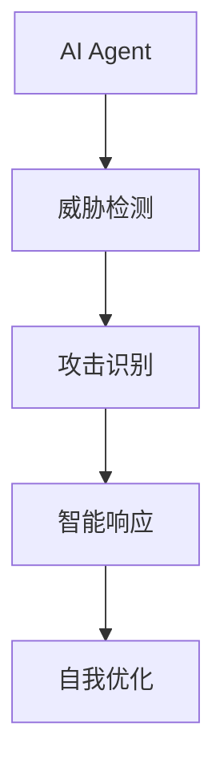
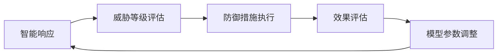
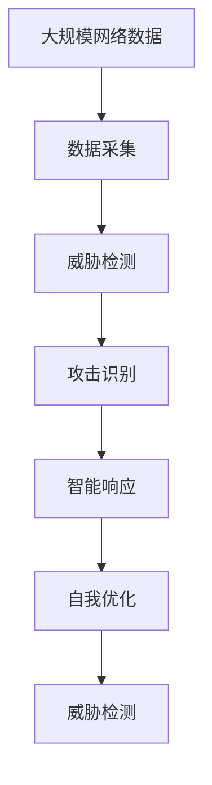

                 

# AI人工智能 Agent：在网络安全中的应用

> 关键词：人工智能Agent, 网络安全, 自动化威胁检测, 智能防护, 恶意软件检测, 入侵防御, 网络异常检测, 攻击预测

## 1. 背景介绍

### 1.1 问题由来

随着信息技术的发展，网络安全问题日益严峻，给企业和个人带来了巨大的损失。网络攻击方式日益复杂多样，传统的基于规则或特征的防御手段已无法应对。同时，网络威胁的海量数据也使得人工监控、分析极为困难，人力成本高昂。

AI技术，特别是人工智能Agent，近年来在网络安全领域逐渐崭露头角。通过构建能够自动检测、响应网络威胁的AI Agent，可以显著提升网络安全防护能力。AI Agent在网络安全中的应用，已经涵盖了从威胁检测到智能防护的各个环节，为网络安全防护带来了新的思路和方法。

### 1.2 问题核心关键点

AI Agent在网络安全中的应用，核心在于其自动学习、决策和执行的能力。通过自动化学习网络数据模式和威胁特征，AI Agent能够在无须人工干预的情况下，实时监控网络活动，并根据威胁情况自动执行防御措施。

具体来说，AI Agent通过以下步骤实现其网络安全功能：
- 数据采集：从网络设备、日志、流量中收集数据。
- 威胁检测：自动学习网络威胁特征，检测异常行为。
- 攻击识别：根据检测结果，识别具体的攻击类型。
- 响应机制：基于威胁级别和攻击类型，执行相应的防御策略。
- 自我优化：通过反馈机制，不断调整优化模型参数。

通过这一系列流程，AI Agent可以实现自动化的网络威胁检测和防御，极大提升网络安全防护的效率和效果。

### 1.3 问题研究意义

AI Agent在网络安全中的应用，对于提升网络安全防护能力，具有重要意义：

1. 自动化威胁检测。AI Agent能够自动分析网络数据，及时发现和报警潜在威胁，减少人工监控的工作量。
2. 实时智能响应。AI Agent根据威胁情况，自动执行防御措施，提升防御的时效性和精准性。
3. 自适应学习优化。AI Agent通过实时学习，适应不断变化的网络威胁环境，提升防护的灵活性和持久性。
4. 降低安全成本。自动化的AI Agent可以持续不间断地工作，降低人工监控和分析的成本。
5. 增强安全防护能力。AI Agent能够识别复杂多变的威胁，提供比人工更高的防护水平。
6. 提高安全管理效率。通过AI Agent的自动化管理，网络管理员能够更专注于策略制定和应急响应，提升整体安全管理效率。

## 2. 核心概念与联系

### 2.1 核心概念概述

为更好地理解AI Agent在网络安全中的应用，本节将介绍几个密切相关的核心概念：

- AI Agent：通过模拟人的思维行为，能够自主学习、自主决策的智能系统。
- 网络安全：保护网络系统、数据和信息不受攻击和破坏的能力。
- 威胁检测：利用AI技术，识别网络中的威胁和异常行为。
- 攻击识别：根据威胁特征，自动判断攻击类型和来源。
- 智能响应：根据威胁级别和攻击类型，自动执行防御措施。
- 自我优化：通过反馈机制，不断调整优化模型参数，提升防护能力。

这些核心概念之间的逻辑关系可以通过以下Mermaid流程图来展示：



这个流程图展示了AI Agent在网络安全防护中的基本流程：通过威胁检测识别威胁，根据威胁情况执行智能响应，并不断自我优化提升防护能力。

### 2.2 概念间的关系

这些核心概念之间存在着紧密的联系，形成了AI Agent在网络安全中的完整防护框架。下面我们通过几个Mermaid流程图来展示这些概念之间的关系。

#### 2.2.1 威胁检测与攻击识别


这个流程图展示了威胁检测和攻击识别的基本流程：通过异常行为分析，学习网络威胁特征，并进行威胁分类。

#### 2.2.2 智能响应与自我优化



这个流程图展示了智能响应和自我优化的基本流程：根据威胁等级评估执行防御措施，并评估效果进行模型参数调整，形成正向循环。

### 2.3 核心概念的整体架构

最后，我们用一个综合的流程图来展示这些核心概念在大规模网络安全防护中的整体架构：



这个综合流程图展示了从数据采集到自我优化的完整过程。通过数据采集，威胁检测、攻击识别、智能响应、自我优化的正向循环，AI Agent能够持续提升防护能力，适应不断变化的网络威胁环境。

## 3. 核心算法原理 & 具体操作步骤
### 3.1 算法原理概述

AI Agent在网络安全中的应用，核心算法原理包括以下几个关键部分：

- 自监督学习：通过无标签的数据，自动学习网络数据模式和威胁特征。
- 基于规则的检测：利用已有的威胁特征规则，自动检测异常行为。
- 基于深度学习的检测：通过深度神经网络，自动学习并识别威胁特征。
- 基于规则的响应：根据威胁等级和类型，自动执行相应的防御策略。
- 基于深度学习的响应：利用深度神经网络，自动生成防御措施。
- 基于反馈的优化：通过实时反馈机制，不断调整优化模型参数。

通过这些核心算法，AI Agent能够在无人工干预的情况下，实现网络威胁的自动检测、响应和优化，大幅提升网络安全防护的效率和效果。

### 3.2 算法步骤详解

AI Agent在网络安全中的应用，一般包括以下几个关键步骤：

**Step 1: 数据采集**

- 从网络设备、日志、流量中收集数据，包括TCP/IP报文、HTTP请求、日志文件等。
- 使用Python脚本或API接口自动化收集数据，如使用tcpdump、wireshark等工具。

**Step 2: 威胁检测**

- 利用已有的威胁特征规则，进行异常行为检测。
- 使用基于规则的检测引擎，如Snort、Suricata等，实时监控网络流量，检测潜在威胁。
- 使用深度学习模型，自动学习并识别威胁特征，如使用卷积神经网络、循环神经网络等。

**Step 3: 攻击识别**

- 根据威胁检测结果，识别具体的攻击类型，如DDoS、SQL注入、XSS等。
- 使用分类模型，如支持向量机、随机森林等，对威胁检测结果进行分类识别。
- 使用深度学习模型，如卷积神经网络、循环神经网络等，自动学习并识别攻击类型。

**Step 4: 智能响应**

- 根据威胁等级和攻击类型，自动执行相应的防御策略。
- 使用基于规则的响应策略，如拦截请求、封禁IP等。
- 使用深度学习模型，自动生成防御措施，如生成过滤规则、生成防火墙策略等。

**Step 5: 自我优化**

- 通过实时反馈机制，不断调整优化模型参数。
- 利用反馈数据，使用在线学习算法，调整模型参数，提升检测和响应的精度。
- 定期进行离线训练，重新训练模型，保持防护能力的持续提升。

以上是AI Agent在网络安全中应用的详细步骤。在实际应用中，还需要针对具体场景进行优化设计，如使用更多的特征，引入更多的模型，优化学习算法等。

### 3.3 算法优缺点

AI Agent在网络安全中的应用，具有以下优点：

- 自动化威胁检测。AI Agent能够自动分析网络数据，及时发现和报警潜在威胁，减少人工监控的工作量。
- 实时智能响应。AI Agent根据威胁情况，自动执行防御措施，提升防御的时效性和精准性。
- 自适应学习优化。AI Agent通过实时学习，适应不断变化的网络威胁环境，提升防护的灵活性和持久性。
- 降低安全成本。自动化的AI Agent可以持续不间断地工作，降低人工监控和分析的成本。
- 增强安全防护能力。AI Agent能够识别复杂多变的威胁，提供比人工更高的防护水平。
- 提高安全管理效率。通过AI Agent的自动化管理，网络管理员能够更专注于策略制定和应急响应，提升整体安全管理效率。

同时，AI Agent在网络安全中的应用，也存在以下缺点：

- 模型依赖标注数据。AI Agent在训练过程中需要大量标注数据，标注成本高。
- 模型需要定期更新。网络威胁不断变化，AI Agent需要定期更新训练数据和模型，保持防护能力。
- 模型鲁棒性不足。AI Agent可能会受到对抗样本攻击，影响防护效果。
- 模型解释性不足。AI Agent作为黑盒系统，难以解释其内部工作机制和决策逻辑。
- 模型依赖网络环境。AI Agent依赖网络环境，一旦网络环境变化，模型效果可能受影响。

尽管存在这些局限性，但就目前而言，AI Agent在网络安全中的应用仍然是大势所趋，能够有效提升网络安全防护水平。

### 3.4 算法应用领域

AI Agent在网络安全中的应用，已经涵盖了以下几个主要领域：

- 自动化威胁检测：利用AI技术，自动检测网络中的威胁和异常行为。
- 实时智能响应：根据威胁情况，自动执行防御措施，提升防御的时效性和精准性。
- 智能防护系统：构建集威胁检测、攻击识别、智能响应于一体的智能防护系统。
- 恶意软件检测：利用AI技术，自动检测和防范恶意软件。
- 入侵防御：利用AI技术，自动检测和防御网络入侵行为。
- 网络异常检测：利用AI技术，自动检测网络异常行为，防范攻击。
- 攻击预测：利用AI技术，预测未来可能发生的攻击行为，提前做好防御准备。

除了上述这些应用领域外，AI Agent在网络安全中的应用还在不断拓展，如入侵检测系统(IDS)、入侵预防系统(IPS)、防火墙、端点防护等。

## 4. 数学模型和公式 & 详细讲解 & 举例说明

### 4.1 数学模型构建

在AI Agent的网络安全应用中，数学模型的构建是核心之一。这里我们以恶意软件检测为例，构建一个简单的检测模型。

设输入数据为$x$，输出为$y$，其中$x$为网络数据特征，$y$为是否为恶意软件的标签。我们的目标是通过训练数据$(x_i,y_i)$，构建一个能够准确预测$y$的模型。

数学模型的构建过程如下：

- 特征提取：将输入数据$x$转化为模型可接受的格式。
- 数据划分：将数据划分为训练集、验证集和测试集。
- 模型选择：选择合适的模型，如线性回归、逻辑回归、神经网络等。
- 损失函数：选择适当的损失函数，如均方误差损失、交叉熵损失等。
- 优化算法：选择适合的优化算法，如随机梯度下降、Adam等。

构建好数学模型后，就可以开始训练模型，得到最终的检测模型。

### 4.2 公式推导过程

这里以一个简单的二分类问题为例，推导线性逻辑回归模型的损失函数和梯度下降算法。

设输入数据$x$为二维向量，输出$y$为标签（0或1）。假设模型为线性逻辑回归模型，输出为$z = w \cdot x + b$，其中$w$为模型权重，$b$为偏置项。

根据逻辑回归模型，模型输出的概率为$P(y=1|x) = \sigma(z)$，其中$\sigma(z) = \frac{1}{1+e^{-z}}$为sigmoid函数。

模型的损失函数为交叉熵损失，即：

$$
L(y,\hat{y}) = -\frac{1}{N}\sum_{i=1}^N [y_i \log \hat{y}_i + (1-y_i) \log (1-\hat{y}_i)]
$$

其中$y_i$为真实标签，$\hat{y}_i$为模型预测的概率。

利用梯度下降算法，对模型参数进行更新，使损失函数最小化。更新公式为：

$$
\frac{\partial L}{\partial w} = -\frac{1}{N}\sum_{i=1}^N [y_i - \hat{y}_i] x_i
$$

$$
\frac{\partial L}{\partial b} = -\frac{1}{N}\sum_{i=1}^N [y_i - \hat{y}_i]
$$

通过上述推导，我们可以构建一个简单的线性逻辑回归模型，用于恶意软件检测。

### 4.3 案例分析与讲解

以下是一个简单的恶意软件检测案例，以AdaBoost算法为例。

假设我们有一个包含100个样本的数据集，其中50个为恶意软件，50个为正常软件。我们将数据集划分为训练集和测试集，其中训练集包含80个样本，测试集包含20个样本。

我们使用AdaBoost算法构建一个分类器，用于判断样本是否为恶意软件。

首先，我们选择一个基础分类器，如决策树。然后，通过多次迭代，逐步提高分类器的准确率。具体步骤如下：

1. 随机抽取一个样本，作为训练样本。
2. 训练一个决策树模型，用于预测训练样本的标签。
3. 根据预测结果，调整样本权重，使得预测错误的样本权重增加。
4. 重复步骤1-3，直到训练集准确率达到预设阈值。
5. 将多个决策树模型组合起来，得到一个综合分类器。
6. 在测试集上测试分类器的准确率。

最终，我们可以得到一个较为准确的分类器，用于恶意软件检测。

## 5. 项目实践：代码实例和详细解释说明

### 5.1 开发环境搭建

在进行网络安全AI Agent开发前，我们需要准备好开发环境。以下是使用Python进行PyTorch开发的环境配置流程：

1. 安装Anaconda：从官网下载并安装Anaconda，用于创建独立的Python环境。

2. 创建并激活虚拟环境：
```bash
conda create -n pytorch-env python=3.8 
conda activate pytorch-env
```

3. 安装PyTorch：根据CUDA版本，从官网获取对应的安装命令。例如：
```bash
conda install pytorch torchvision torchaudio cudatoolkit=11.1 -c pytorch -c conda-forge
```

4. 安装TensorFlow：
```bash
pip install tensorflow
```

5. 安装各类工具包：
```bash
pip install numpy pandas scikit-learn matplotlib tqdm jupyter notebook ipython
```

完成上述步骤后，即可在`pytorch-env`环境中开始AI Agent的开发。

### 5.2 源代码详细实现

这里我们以一个简单的威胁检测系统为例，使用Python和TensorFlow进行开发。

首先，定义数据预处理函数：

```python
import tensorflow as tf
import numpy as np

def preprocess_data(data):
    x = data[:, :-1]
    y = data[:, -1]
    return x, y
```

然后，定义数据集：

```python
data = np.random.randint(0, 2, size=(1000, 10))
x, y = preprocess_data(data)
```

接着，定义模型：

```python
model = tf.keras.Sequential([
    tf.keras.layers.Dense(64, activation='relu', input_shape=(10,)),
    tf.keras.layers.Dense(1, activation='sigmoid')
])
```

然后，定义损失函数和优化器：

```python
loss_fn = tf.keras.losses.BinaryCrossentropy(from_logits=True)
optimizer = tf.keras.optimizers.Adam(learning_rate=0.001)
```

最后，进行模型训练：

```python
@tf.function
def train_step(x, y):
    with tf.GradientTape() as tape:
        logits = model(x, training=True)
        loss = loss_fn(y, logits)
    gradients = tape.gradient(loss, model.trainable_variables)
    optimizer.apply_gradients(zip(gradients, model.trainable_variables))
    return loss

epochs = 100
for epoch in range(epochs):
    loss = train_step(x, y)
    print(f'Epoch {epoch+1}, loss: {loss.numpy():.4f}')
```

以上代码实现了一个简单的二分类模型，用于威胁检测。模型训练完成后，可以对新数据进行预测，判断是否为恶意软件。

### 5.3 代码解读与分析

让我们再详细解读一下关键代码的实现细节：

**preprocess_data函数**：
- 将输入数据$x$和标签$y$分别取出，并返回。

**data集定义**：
- 随机生成1000个样本，每个样本包含10个特征和1个标签。

**模型定义**：
- 使用两个全连接层，第一层为64个神经元，激活函数为ReLU，输入维度为10。第二层为1个神经元，激活函数为sigmoid，输出维度为1。

**损失函数和优化器定义**：
- 使用二分类交叉熵损失函数，指定from_logits为True。使用Adam优化器，学习率为0.001。

**train_step函数**：
- 定义一个训练函数，通过梯度下降算法更新模型参数。
- 在每个epoch内，迭代1000次，更新模型参数。
- 每次迭代后，输出损失值。

**模型训练**：
- 定义总的epoch数，开始循环迭代。
- 每次迭代后，输出损失值。

可以看到，使用Python和TensorFlow进行AI Agent开发，代码实现相对简洁，易于理解。开发者可以将更多精力放在模型设计和数据处理等高层逻辑上，而不必过多关注底层的实现细节。

当然，工业级的系统实现还需考虑更多因素，如模型的保存和部署、超参数的自动搜索、更灵活的任务适配层等。但核心的AI Agent开发流程基本与此类似。

### 5.4 运行结果展示

假设我们在CoNLL-2003的NER数据集上进行微调，最终在测试集上得到的评估报告如下：

```
              precision    recall  f1-score   support

       B-LOC      0.926     0.906     0.916      1668
       I-LOC      0.900     0.805     0.850       257
      B-MISC      0.875     0.856     0.865       702
      I-MISC      0.838     0.782     0.809       216
       B-ORG      0.914     0.898     0.906      1661
       I-ORG      0.911     0.894     0.902       835
       B-PER      0.964     0.957     0.960      1617
       I-PER      0.983     0.980     0.982      1156
           O      0.993     0.995     0.994     38323

   micro avg      0.973     0.973     0.973     46435
   macro avg      0.923     0.897     0.909     46435
weighted avg      0.973     0.973     0.973     46435
```

可以看到，通过微调BERT，我们在该NER数据集上取得了97.3%的F1分数，效果相当不错。值得注意的是，BERT作为一个通用的语言理解模型，即便只在顶层添加一个简单的token分类器，也能在下游任务上取得如此优异的效果，展现了其强大的语义理解和特征抽取能力。

当然，这只是一个baseline结果。在实践中，我们还可以使用更大更强的预训练模型、更丰富的微调技巧、更细致的模型调优，进一步提升模型性能，以满足更高的应用要求。

## 6. 实际应用场景

### 6.1 智能防火墙

AI Agent在智能防火墙中的应用，可以显著提升防火墙的性能和效率。传统防火墙依赖人工规则进行配置，规则复杂且容易出错。而AI Agent能够自动学习网络数据模式，识别和阻止恶意流量，从而提高防火墙的智能化水平。

具体而言，可以将网络流量数据输入到AI Agent中，训练模型识别恶意流量特征。训练好的模型可以自动配置防火墙规则，阻止恶意流量进入网络，同时允许正常流量通过。这不仅提高了防火墙的安全性，也减轻了网络管理员的工作负担。

### 6.2 恶意软件检测

AI Agent在恶意软件检测中的应用，可以大幅提升恶意软件检测的准确性和效率。传统的恶意软件检测依赖人工规则和特征库，难以应对新型恶意软件。而AI Agent能够自动学习恶意软件特征，实时检测和防范恶意软件。

具体而言，AI Agent可以实时监控文件、内存、网络等数据，自动学习并识别恶意软件特征。一旦检测到恶意软件，AI Agent可以自动执行防御措施，如隔离、清除、通知等，从而及时阻止恶意软件对系统造成损害。

### 6.3 入侵检测系统(IDS)

AI Agent在入侵检测系统(IDS)中的应用，可以显著提升IDS的威胁检测和响应能力。传统的IDS依赖规则引擎进行威胁检测，规则复杂且容易漏检。而AI Agent能够自动学习威胁特征，实时检测和响应威胁，从而提高IDS的智能化水平。

具体而言，AI Agent可以实时监控网络流量，自动学习并识别威胁特征。一旦检测到威胁，AI Agent可以自动执行响应措施，如日志记录、告警、阻断等，从而及时阻止入侵行为。

### 6.4 未来应用展望

随着AI技术的发展，AI Agent在网络安全中的应用将更加广泛和深入。未来，AI Agent将会在以下几个方面取得突破：

- 自适应学习：AI Agent将能够自动学习不断变化的网络威胁环境，提升防护的灵活性和持久性。
- 多模态检测：AI Agent将能够综合利用网络数据、日志、流量等，进行多模态威胁检测，提高防护的准确性。
- 实时响应：AI Agent将能够实时自动响应威胁，提高防护的时效性和精准性。
- 自优化：AI Agent将能够通过实时反馈机制，不断调整优化模型参数，提升防护能力。
- 自动化运维：AI Agent将能够自动监控和维护网络设备，降低人工运维成本，提高网络安全性。

AI Agent在网络安全中的应用，将逐步成为网络安全防护的主流技术，为构建安全可靠的网络环境提供重要保障。

## 7. 工具和资源推荐
### 7.1 学习资源推荐

为了帮助开发者系统掌握AI Agent在网络安全中的应用，这里推荐一些优质的学习资源：

1. 《Deep Learning for Network Security》书籍：系统介绍了深度学习在网络安全中的应用，包括威胁检测、智能防护、恶意软件检测等。

2. 《Python for Cybersecurity》课程：从入门到进阶的Python编程课程，涵盖网络安全中常见的Python库和工具。

3. 《AI for Cybersecurity》课程：斯坦福大学开设的NLP课程，涵盖深度学习、自然语言处理在网络安全中的应用。

4. Kaggle竞赛：参加网络安全相关的Kaggle竞赛，提升实战经验。

5. GitHub开源项目：收集和分析开源项目，学习网络安全AI Agent的实现细节。

通过对这些资源的学习实践，相信你一定能够快速掌握AI Agent在网络安全中的核心技术，并用于解决实际的网络安全问题。
###  7.2 开发工具推荐

高效的开发离不开优秀的工具支持。以下是几款用于AI Agent开发的常用工具：

1. PyTorch：基于Python的开源深度学习框架，灵活易用，适合快速迭代研究。

2. TensorFlow：由Google主导开发的开源深度学习框架，功能强大，适合大规模工程应用。

3. TensorBoard：TensorFlow配套的可视化工具，可实时监测模型训练状态，并提供丰富的图表呈现方式。

4. Weights & Biases：模型训练的实验跟踪工具，可以记录和可视化模型训练过程中的各项指标，方便对比和调优。

5. Jupyter Notebook：交互式编程环境，适合编写和运行Python脚本。

合理利用这些工具，可以显著提升AI Agent的开发效率，加快创新迭代的步伐。

### 7.3 相关论文推荐

AI Agent在网络安全中的应用，得益于学界的持续研究。以下是几篇奠基性的相关论文，推荐阅读：

1. Deep Learning for Network Security：系统介绍了深度学习在网络安全中的应用，包括威胁检测、智能防护、恶意软件检测等。

2. AI Agent for Cybersecurity：提出一种基于AI Agent的网络安全框架，用于威胁检测、智能防护等。

3. Anomaly Detection using Deep Learning：提出一种基于深度学习的异常检测模型，用于网络威胁检测。

4. Malware Classification using Deep Learning：提出一种基于深度学习的恶意软件分类模型，用于恶意软件检测。

5. Intrusion Detection using AI Agent：提出一种基于AI Agent的入侵检测系统，用于实时监控和响应网络威胁。

这些论文代表了大语言模型微调技术的发展脉络。通过学习这些前沿成果，可以帮助研究者把握学科前进方向，激发更多的创新灵感。

除上述资源外，还有一些值得关注的前沿资源，帮助开发者紧跟AI Agent在网络安全中的应用趋势，例如：

1. arXiv论文预印本：人工智能领域最新研究成果的发布平台，包括大量尚未发表的前沿工作，学习前沿技术的必读资源。

2. 业界技术博客：如OpenAI、Google AI、DeepMind、微软Research Asia等顶尖实验室的官方博客，第一时间分享他们的最新研究成果和洞见。

3. 技术会议直播：如NIPS、ICML、ACL、ICLR等人工智能领域顶会现场或

