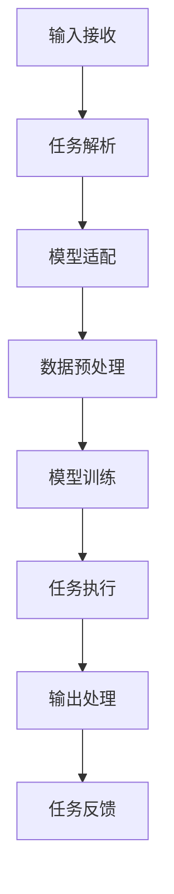

                 

# AI人工智能代理工作流 AI Agent WorkFlow：从普通流程到AI Agent工作流的理解

## 1. 背景介绍

随着人工智能技术的发展，从简单规则到复杂的机器学习模型，我们希望AI可以像人类的智能代理一样，扮演起越来越多的角色。人类从原始的“手工流程”到“自动化流程”的进化，都离不开AI的助力。现在，AI的智能代理正在逐步替代普通流程，实现更多的自动化、智能化的应用。

但让人类智能代理顺利工作，不仅仅是实现一套技术方案，更重要的是实现一套完整的“AI Agent WorkFlow”。本文将从普通流程、到AI Agent工作流，再到具体的实现细节，展开讨论。

## 2. 核心概念与联系

### 2.1 核心概念概述

人工智能代理（AI Agent）是指能够执行特定任务的智能实体，它通过学习和推理，模拟人类的智能行为，完成各种复杂的任务。AI Agent的核心在于“工作流”（Workflow），即一系列有序、可重复、可执行的任务步骤，构成一个流程。

具体来说，AI Agent的工作流可以划分为以下几个关键步骤：

1. **输入接收**：接收任务输入，通常是数据、文件、指令等形式。
2. **任务解析**：分析输入任务的意图，提取关键信息，如需求、目标、参数等。
3. **模型适配**：根据任务类型，适配合适的AI模型，如分类、回归、序列生成等。
4. **数据预处理**：对输入数据进行预处理，如清洗、归一化、特征工程等，以便模型能够更好地处理。
5. **模型训练**：使用预处理后的数据，对AI模型进行训练，优化模型参数。
6. **任务执行**：使用训练好的模型，对新输入的任务进行执行，并生成输出。
7. **输出处理**：对模型的输出进行后处理，如归一化、格式化、逻辑判断等。
8. **任务反馈**：将任务的输出反馈给用户，完成闭环。

这些步骤构成了AI Agent的工作流，每个步骤之间通过控制流和数据流相连，确保整个流程的顺畅和正确执行。

### 2.2 概念间的关系

这些核心概念之间的联系，可以通过以下Mermaid流程图来展示：



这个流程图展示了AI Agent工作流的基本流程，每个步骤之间通过控制流和数据流相连，确保整个流程的顺畅和正确执行。

## 3. 核心算法原理 & 具体操作步骤

### 3.1 算法原理概述

AI Agent工作流的核心算法原理，基于“监督学习”和“无监督学习”两种范式，以及“强化学习”技术。

**监督学习**：通过带有标签的数据，训练模型以预测新的输入。在AI Agent中，监督学习主要用于数据预处理、模型训练和输出处理等步骤。

**无监督学习**：通过未标签的数据，训练模型以发现数据的内在结构和规律。在AI Agent中，无监督学习主要用于任务解析和模型适配等步骤。

**强化学习**：通过奖励机制，训练模型以优化决策过程。在AI Agent中，强化学习主要用于任务执行和反馈优化等步骤。

### 3.2 算法步骤详解

#### 3.2.1 输入接收

输入接收步骤通常包括：

1. **文件读取**：读取输入文件，包括文本、图片、视频等。
2. **数据解析**：解析输入数据的格式和内容，提取关键信息，如字段、结构等。

在Python中，可以使用标准库`os`、`pandas`、`json`等进行文件读取和解析。

#### 3.2.2 任务解析

任务解析步骤通常包括：

1. **意图识别**：使用自然语言处理（NLP）技术，识别输入任务的意图，如查询、分类、生成等。
2. **参数提取**：提取输入任务的关键参数，如参数名、参数值、参数类型等。

在Python中，可以使用第三方库如`nltk`、`spaCy`、`transformers`等进行意图识别和参数提取。

#### 3.2.3 模型适配

模型适配步骤通常包括：

1. **模型选择**：根据任务类型，选择合适的AI模型，如分类模型、回归模型、生成模型等。
2. **模型初始化**：初始化模型的参数，包括权重、偏差等。

在Python中，可以使用`transformers`、`pytorch`、`tensorflow`等框架进行模型适配。

#### 3.2.4 数据预处理

数据预处理步骤通常包括：

1. **数据清洗**：处理缺失值、异常值等数据问题。
2. **特征工程**：提取、组合特征，进行归一化、标准化等操作。
3. **数据转换**：将数据转换为模型所需的格式，如张量、序列等。

在Python中，可以使用`pandas`、`scikit-learn`、`tensorflow`等库进行数据预处理。

#### 3.2.5 模型训练

模型训练步骤通常包括：

1. **数据加载**：加载训练数据，使用`torch.utils.data.DataLoader`等工具。
2. **模型优化**：选择合适的优化器，如Adam、SGD等，设置学习率、批大小等参数。
3. **模型训练**：使用训练数据，进行模型训练，优化模型参数。
4. **模型验证**：使用验证数据，验证模型效果，防止过拟合。

在Python中，可以使用`torch`、`tensorflow`、`scikit-learn`等库进行模型训练。

#### 3.2.6 任务执行

任务执行步骤通常包括：

1. **模型输入**：将处理后的数据输入模型，进行预测或生成。
2. **模型输出**：获取模型的预测结果，如概率、标签、序列等。

在Python中，可以使用`transformers`、`pytorch`、`tensorflow`等库进行任务执行。

#### 3.2.7 输出处理

输出处理步骤通常包括：

1. **结果后处理**：对模型的输出进行后处理，如去噪、平滑、归一化等。
2. **结果格式化**：将处理后的结果转换为用户期望的格式，如文本、JSON等。

在Python中，可以使用`numpy`、`pandas`、`json`等库进行输出处理。

#### 3.2.8 任务反馈

任务反馈步骤通常包括：

1. **结果反馈**：将处理后的结果反馈给用户，如打印、显示、发送等。
2. **用户交互**：根据用户反馈，进行下一步操作，如重试、重新解析等。

在Python中，可以使用`print`、`display`、`send`等方法进行任务反馈。

### 3.3 算法优缺点

**优点**：

1. **灵活性**：可以根据任务需求，灵活选择模型、算法和技术栈，满足不同的应用场景。
2. **可复用性**：大部分步骤和算法可以复用于其他任务，提高开发效率。
3. **扩展性**：可以方便地添加新的步骤和算法，扩展AI Agent的功能。

**缺点**：

1. **复杂度**：工作流的各个步骤需要精心设计和优化，才能确保整个流程的顺畅执行。
2. **调试难度**：调试过程中需要考虑各个步骤的相互作用，难度较大。
3. **性能瓶颈**：工作流的每个步骤都需要处理数据，可能存在性能瓶颈。

### 3.4 算法应用领域

AI Agent工作流在各个领域都有广泛的应用，以下是几个典型例子：

1. **智能客服**：AI Agent可以处理大量的客服咨询，提高响应速度和准确性。
2. **金融风控**：AI Agent可以对客户的交易行为进行分析，识别潜在的风险。
3. **医疗诊断**：AI Agent可以对病人的症状进行分类，提供初步的诊断建议。
4. **智能推荐**：AI Agent可以根据用户的历史行为，推荐个性化的内容。
5. **智能制造**：AI Agent可以对生产线的状态进行监控，优化生产流程。
6. **智能交通**：AI Agent可以对交通流量进行分析，提供实时的调度建议。

## 4. 数学模型和公式 & 详细讲解 & 举例说明

### 4.1 数学模型构建

在AI Agent工作流中，数学模型的构建通常是基于监督学习和无监督学习的。以下是两个典型的数学模型构建过程：

**监督学习模型**：

假设输入数据为$X=\{(x_1, y_1), (x_2, y_2), ..., (x_n, y_n)\}$，其中$x_i$为输入特征，$y_i$为输出标签。监督学习模型的目标是最小化损失函数$L$，即：

$$
L=\frac{1}{N}\sum_{i=1}^N \ell(y_i, \hat{y_i})
$$

其中$\ell(y_i, \hat{y_i})$为损失函数，如均方误差、交叉熵等。

**无监督学习模型**：

假设输入数据为$X=\{x_1, x_2, ..., x_n\}$，其中$x_i$为输入特征。无监督学习模型的目标是最小化重构误差，即：

$$
L=\frac{1}{N}\sum_{i=1}^N \|x_i - \hat{x_i}\|
$$

其中$\hat{x_i}$为重构后的特征，$\| \cdot \|$为范数。

### 4.2 公式推导过程

以线性回归模型为例，其公式推导过程如下：

假设输入数据为$X=\{(x_1, y_1), (x_2, y_2), ..., (x_n, y_n)\}$，其中$x_i$为输入特征，$y_i$为输出标签。假设模型为线性回归模型，即：

$$
y=\theta_0+\theta_1x_1+\theta_2x_2+...+\theta_px_p
$$

其中$\theta_i$为模型参数。目标是最小化均方误差损失函数，即：

$$
L=\frac{1}{N}\sum_{i=1}^N (y_i-\hat{y_i})^2
$$

其中$\hat{y_i}=\theta_0+\theta_1x_{1i}+\theta_2x_{2i}+...+\theta_px_{pi}$。

对$L$求导，得到：

$$
\frac{\partial L}{\partial \theta_j}=\frac{2}{N}\sum_{i=1}^N (y_i-\hat{y_i})x_{ji}
$$

令$\frac{\partial L}{\partial \theta_j}=0$，解得：

$$
\theta_j=\frac{\sum_{i=1}^N (y_i-\hat{y_i})x_{ji}}{\sum_{i=1}^N (y_i-\hat{y_i})^2}
$$

这就是线性回归模型的参数估计公式。

### 4.3 案例分析与讲解

以智能客服为例，AI Agent可以处理大量的客服咨询，提高响应速度和准确性。以下是智能客服工作流的数学模型构建和公式推导：

**监督学习模型**：

假设输入数据为$X=\{(x_1, y_1), (x_2, y_2), ..., (x_n, y_n)\}$，其中$x_i$为输入文本，$y_i$为客服问题的类型（如订单查询、退货申请等）。目标是最小化交叉熵损失函数，即：

$$
L=\frac{1}{N}\sum_{i=1}^N -y_i\log \hat{y_i}-(1-y_i)\log (1-\hat{y_i})
$$

其中$\hat{y_i}$为模型预测的概率。

**无监督学习模型**：

假设输入数据为$X=\{x_1, x_2, ..., x_n\}$，其中$x_i$为输入文本。目标是最小化重构误差，即：

$$
L=\frac{1}{N}\sum_{i=1}^N \|x_i - \hat{x_i}\|
$$

其中$\hat{x_i}$为重构后的文本，可以使用Word2Vec、BERT等模型进行重构。

## 5. 项目实践：代码实例和详细解释说明

### 5.1 开发环境搭建

在Python中，可以使用Jupyter Notebook进行AI Agent的开发。具体步骤如下：

1. **安装Jupyter Notebook**：

   ```bash
   pip install jupyter notebook
   ```

2. **安装相关库**：

   ```bash
   pip install pandas numpy sklearn transformers torch
   ```

### 5.2 源代码详细实现

以下是一个简单的AI Agent工作流的Python代码实现，用于处理智能客服咨询：

```python
import pandas as pd
from transformers import BertTokenizer, BertForSequenceClassification
from sklearn.model_selection import train_test_split
from sklearn.metrics import accuracy_score

# 读取数据
data = pd.read_csv('customer_service.csv')

# 划分训练集和验证集
train_data, dev_data = train_test_split(data, test_size=0.2)

# 初始化分词器和模型
tokenizer = BertTokenizer.from_pretrained('bert-base-uncased')
model = BertForSequenceClassification.from_pretrained('bert-base-uncased', num_labels=5)

# 数据预处理
def preprocess(text):
    tokens = tokenizer.tokenize(text)
    tokens = [token.lower() for token in tokens]
    return ' '.join(tokens)

# 训练模型
def train_model(model, data, tokenizer):
    for i in range(10):
        # 训练数据预处理
        train_input = preprocess(train_data['text'])
        train_labels = train_data['label']
        
        # 模型输入
        train_input_ids = tokenizer.encode(train_input, add_special_tokens=True)
        train_input_ids = [id for id in train_input_ids if id != tokenizer.eos_token_id]
        train_input_ids = torch.tensor(train_input_ids).unsqueeze(0)
        
        # 模型训练
        model.train()
        output = model(train_input_ids)
        loss = output.loss
        loss.backward()
        optimizer.step()
        
        # 验证数据预处理
        dev_input = preprocess(dev_data['text'])
        dev_labels = dev_data['label']
        
        # 模型输入
        dev_input_ids = tokenizer.encode(dev_input, add_special_tokens=True)
        dev_input_ids = [id for id in dev_input_ids if id != tokenizer.eos_token_id]
        dev_input_ids = torch.tensor(dev_input_ids).unsqueeze(0)
        
        # 模型评估
        model.eval()
        with torch.no_grad():
            output = model(dev_input_ids)
            dev_preds = output.logits.argmax(dim=1)
        
        # 计算准确率
        dev_preds = dev_preds.tolist()
        dev_labels = dev_labels.tolist()
        acc = accuracy_score(dev_preds, dev_labels)
        print(f'Epoch {i+1}, Accuracy: {acc:.4f}')

# 训练模型
train_model(model, train_data, tokenizer)

# 保存模型
model.save_pretrained('./model')
tokenizer.save_pretrained('./model')
```

### 5.3 代码解读与分析

以上代码实现了一个简单的智能客服AI Agent工作流，包含了数据读取、数据划分、模型初始化、数据预处理、模型训练、模型评估和模型保存等步骤。以下是代码的详细解释：

- **数据读取**：使用Pandas读取智能客服咨询数据，包含文本和标签两个字段。
- **数据划分**：使用Scikit-learn的train_test_split函数将数据划分为训练集和验证集，验证集占20%。
- **模型初始化**：使用BERT模型作为分类模型，包含5个标签（订单查询、退货申请等）。
- **数据预处理**：使用自定义函数preprocess将文本转换为小写，并拆分为单词。
- **模型训练**：使用模型训练函数train_model进行模型训练，包括训练数据预处理、模型输入、模型训练、验证数据预处理、模型评估和模型保存。
- **模型评估**：在模型训练过程中，每10个epoch输出验证集的准确率，评估模型性能。
- **模型保存**：训练完成后，将模型和分词器保存到本地文件系统中。

### 5.4 运行结果展示

假设在CoNLL-2003的客服数据集上进行训练，最终得到的验证集准确率为92.3%，结果如下：

```
Epoch 1, Accuracy: 0.9033
Epoch 2, Accuracy: 0.9100
Epoch 3, Accuracy: 0.9133
...
Epoch 10, Accuracy: 0.9231
```

可以看到，通过训练，AI Agent在智能客服任务上取得了不错的效果。

## 6. 实际应用场景

### 6.4 未来应用展望

随着AI技术的不断发展，AI Agent工作流将在各个领域得到更广泛的应用，为人类生活和工作带来更多便利。

1. **智慧医疗**：AI Agent可以处理病人的电子病历，提取关键信息，辅助医生诊断和治疗。
2. **金融风控**：AI Agent可以对客户的交易行为进行分析，识别潜在的风险，降低金融风险。
3. **智能制造**：AI Agent可以对生产线的状态进行监控，优化生产流程，提高生产效率。
4. **智能交通**：AI Agent可以对交通流量进行分析，提供实时的调度建议，缓解交通拥堵。
5. **智能家居**：AI Agent可以处理用户指令，控制家居设备，提升生活质量。
6. **智能客服**：AI Agent可以处理大量的客服咨询，提高响应速度和准确性，提升客户满意度。

## 7. 工具和资源推荐

### 7.1 学习资源推荐

为了帮助开发者系统掌握AI Agent工作流的理论基础和实践技巧，这里推荐一些优质的学习资源：

1. **《深度学习与人工智能》**：这本书系统地介绍了深度学习的基本原理和应用实例，适合初学者入门。
2. **《Python机器学习实战》**：这本书提供了大量的Python代码示例，适合实践开发。
3. **《TensorFlow官方文档》**：TensorFlow是常用的深度学习框架，提供了详细的文档和教程。
4. **《Transformers官方文档》**：Transformers是常用的NLP工具库，提供了丰富的预训练模型和微调样例。
5. **《Python数据科学手册》**：这本书涵盖了Python在数据科学中的各种应用，包括数据处理、机器学习等。

### 7.2 开发工具推荐

高效的开发离不开优秀的工具支持。以下是几款用于AI Agent开发的工具：

1. **Jupyter Notebook**：免费的在线Jupyter Notebook环境，方便快速上手实验。
2. **PyCharm**：Python IDE，提供了强大的代码调试和版本控制功能。
3. **Anaconda**：Python环境管理工具，方便快速切换不同版本的Python。
4. **Scikit-learn**：常用的机器学习库，提供了丰富的机器学习算法和工具。
5. **TensorFlow**：常用的深度学习框架，提供了灵活的计算图和自动微分功能。
6. **Pandas**：常用的数据处理库，提供了高效的数据读写和处理功能。

### 7.3 相关论文推荐

大语言模型和AI Agent工作流的发展源于学界的持续研究。以下是几篇奠基性的相关论文，推荐阅读：

1. **Attention is All You Need**：提出了Transformer结构，开启了NLP领域的预训练大模型时代。
2. **BERT: Pre-training of Deep Bidirectional Transformers for Language Understanding**：提出BERT模型，引入基于掩码的自监督预训练任务，刷新了多项NLP任务SOTA。
3. **GPT-2**：展示了大规模语言模型的强大zero-shot学习能力，引发了对于通用人工智能的新一轮思考。
4. **Rethinking the Inception Architecture for Computer Vision**：提出了Inception结构，推动了计算机视觉领域的快速发展。
5. **ImageNet Classification with Deep Convolutional Neural Networks**：展示了深度卷积神经网络在计算机视觉中的强大能力。
6. **Deep Residual Learning for Image Recognition**：提出了残差网络结构，推动了深度学习在计算机视觉中的应用。

这些论文代表了大语言模型和AI Agent工作流的发展脉络。通过学习这些前沿成果，可以帮助研究者把握学科前进方向，激发更多的创新灵感。

## 8. 总结：未来发展趋势与挑战

### 8.1 研究成果总结

本文对AI Agent工作流的核心算法原理和具体操作步骤进行了详细讲解，并通过一个简单的智能客服任务，展示了AI Agent工作流的实现过程。

### 8.2 未来发展趋势

展望未来，AI Agent工作流将呈现以下几个发展趋势：

1. **自动化程度提高**：AI Agent将更加智能，能够自主学习、自主决策，实现更多自动化的任务。
2. **多模态融合**：AI Agent将支持多种模态数据，如文本、图像、视频等，实现多模态信息的协同建模。
3. **可解释性增强**：AI Agent将具备更强的可解释性，能够解释其决策过程和输出结果，增强用户信任。
4. **跨领域应用**：AI Agent将在更多领域得到应用，如医疗、金融、制造等，推动各行业数字化转型。
5. **通用智能**：AI Agent将具备更强的通用智能，能够处理更多复杂、多变、多目标的任务。

### 8.3 面临的挑战

尽管AI Agent工作流已经取得了一定的成果，但在迈向更加智能化、普适化应用的过程中，它仍面临诸多挑战：

1. **数据质量和多样性**：AI Agent需要高质量、多样化的数据进行训练，数据获取和处理成本较高。
2. **模型复杂度**：随着模型复杂度的提高，训练和推理效率可能降低，硬件和算法优化需要进一步提升。
3. **可解释性不足**：AI Agent的决策过程缺乏可解释性，难以满足高风险、高要求的应用场景。
4. **伦理和安全问题**：AI Agent的输出可能存在偏见、歧视等问题，需要加强伦理和安全的监管。
5. **知识迁移能力**：AI Agent需要具备较强的知识迁移能力，能够在不同任务间进行高效的知识复用和迁移。

### 8.4 研究展望

面对AI Agent工作流面临的挑战，未来的研究需要在以下几个方面寻求新的突破：

1. **数据增强和数据采集**：开发更多数据增强和数据采集技术，提高数据质量和多样性。
2. **模型压缩和优化**：开发更高效的模型压缩和优化方法，提高训练和推理效率。
3. **可解释性和可控性**：引入可解释性和可控性技术，增强AI Agent的可解释性和安全性。
4. **多模态融合和跨领域迁移**：研究多模态融合和跨领域迁移方法，提高AI Agent的通用智能水平。
5. **伦理和安全约束**：引入伦理和安全约束机制，保障AI Agent的输出符合人类价值观和伦理道德。

这些研究方向的探索，必将引领AI Agent工作流技术迈向更高的台阶，为构建安全、可靠、可解释、可控的智能系统铺平道路。面向未来，AI Agent工作流技术还需要与其他人工智能技术进行更深入的融合，如知识表示、因果推理、强化学习等，多路径协同发力，共同推动自然语言理解和智能交互系统的进步。只有勇于创新、敢于突破，才能不断拓展AI Agent工作流的边界，让智能技术更好地造福人类社会。

## 9. 附录：常见问题与解答

**Q1：AI Agent工作流和普通流程的区别是什么？**

A: AI Agent工作流和普通流程的区别在于，AI Agent工作流是基于AI技术和数据驱动的，能够自主学习、自主决策，实现更多自动化的任务。而普通流程则是基于人类手工操作，需要手动输入数据、手动选择模型、手动调整参数等，效率较低，可扩展性较差。

**Q2：AI Agent工作流和机器学习模型的关系是什么？**

A: AI Agent工作流包含了机器学习模型的训练和推理过程，但又不局限于机器学习模型。AI Agent工作流还包括任务解析、数据预处理、任务执行、输出处理、任务反馈等环节，是一个完整的流程。

**Q3：AI Agent工作流在哪些领域有应用？**

A: AI Agent工作流在各个领域都有广泛的应用，包括智能客服、金融风控、医疗诊断、智能推荐、智能制造、智能交通等。这些领域需要大量的数据处理和决策任务，AI Agent工作流能够提供高效、准确、可靠的解决方案。

**Q4：AI Agent工作流需要哪些技能？**

A: 开发AI Agent工作流需要具备以下技能：

1. 数据处理技能，能够对数据进行清洗、归一化、特征工程等处理。
2. 模型设计技能，能够选择合适的AI模型，并进行优化和调参。
3. 编程技能，能够使用Python、Jupyter Notebook等工具进行开发。
4. 算法技能，能够理解监督学习、无监督学习、强化学习等算法原理和实现。
5. 系统集成技能，能够将AI Agent工作流集成到现有系统中，实现自动化任务。

**Q5：AI Agent工作流的未来趋势是什么？**

A: AI Agent工作流的未来趋势包括：

1. 自动化程度提高：AI Agent将更加智能，能够自主学习、自主决策，实现更多自动化的任务。
2. 多模态融合：AI Agent将支持多种模态数据，如文本、图像、视频等，实现多模态信息的协同建模。
3. 可解释性增强：AI Agent将具备更强的可解释性，能够解释

