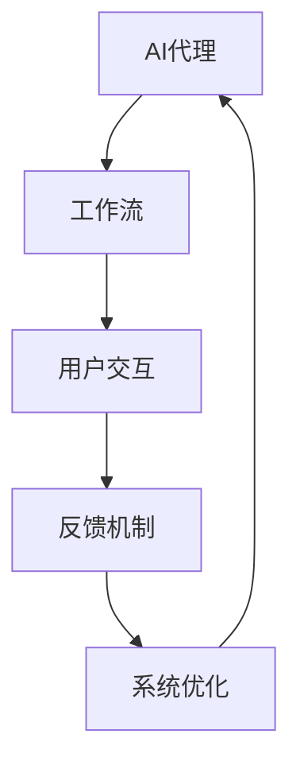
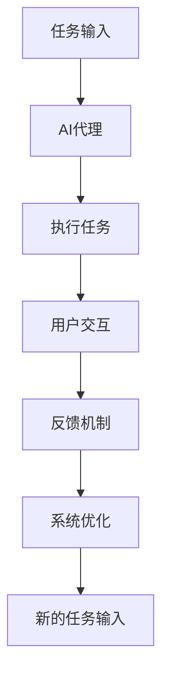
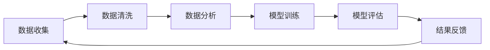
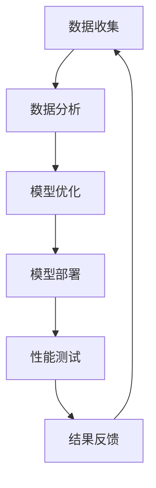
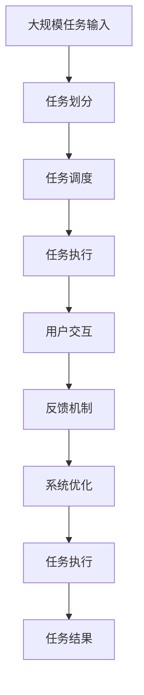

                 

# AI人工智能代理工作流 AI Agent WorkFlow：反馈的获取与处理

> 关键词：人工智能代理,工作流,反馈机制,用户交互,系统优化

## 1. 背景介绍

在当今数字化时代，人工智能（AI）代理被广泛应用于各种场景，从智能客服到推荐系统，从虚拟助手到自动驾驶。然而，要使AI代理真正发挥作用，必须解决反馈获取与处理这一核心问题。这不仅关系到系统的性能和用户体验，还影响到AI代理在实际应用中的可扩展性和实用性。本文将深入探讨AI代理工作流中的反馈获取与处理机制，为企业和开发者提供技术指导和实践建议。

### 1.1 问题由来
现代AI代理系统通常通过大量数据训练生成模型，用于执行特定任务。这些系统能够通过预测和决策来提供自动化服务。但是，无论模型多么强大，在实际应用中，系统总是需要用户反馈以持续改进和优化。因此，反馈机制的构建和优化成为了AI代理开发的关键环节。

### 1.2 问题核心关键点
反馈机制的核心关键点包括以下几个方面：
1. **反馈类型**：反馈可以是用户主动提供，也可以是系统自动生成。
2. **反馈内容**：反馈可以包括任务完成情况、用户满意度、异常事件等。
3. **反馈处理**：反馈信息需要通过算法处理，转化为系统优化方向。
4. **反馈闭环**：反馈信息应形成闭环，即系统根据反馈不断调整自身行为。

### 1.3 问题研究意义
构建有效的反馈机制对于提升AI代理的性能、稳定性和用户满意度具有重要意义：

1. **性能提升**：通过收集和分析用户反馈，AI代理可以识别和修正算法中的错误和偏差，提高任务执行的准确性和效率。
2. **用户体验优化**：用户反馈有助于理解用户需求和偏好，优化交互界面和操作流程，提升用户体验。
3. **系统可扩展性**：有效的反馈机制使得系统能够根据用户需求动态调整，适应不同场景下的需求变化。
4. **自动化程度**：自动化反馈处理可以减轻人工干预的负担，提高系统运行的自主性和自动化程度。

## 2. 核心概念与联系

### 2.1 核心概念概述

为更好地理解反馈机制在AI代理工作流中的作用，本节将介绍几个密切相关的核心概念：

- **AI代理(AI Agent)**：通过人工智能技术自动执行任务的虚拟实体。
- **工作流(Workflow)**：由一系列可执行任务组成的有序流程，描述了任务执行的逻辑和规则。
- **反馈机制(Feedback Mechanism)**：用于收集、处理和应用用户反馈，以指导系统优化和改进的机制。
- **用户交互(User Interaction)**：用户与AI代理之间的互动过程，包括输入、输出和响应等。
- **系统优化(System Optimization)**：通过反馈机制，持续调整AI代理的行为和策略，以提升系统性能和用户体验。

这些概念之间的逻辑关系可以通过以下Mermaid流程图来展示：



这个流程图展示了AI代理在处理用户交互时，通过反馈机制收集用户反馈，进而指导系统优化，形成闭环的过程。

### 2.2 概念间的关系

这些核心概念之间存在着紧密的联系，形成了AI代理工作流的反馈闭环系统。下面我通过几个Mermaid流程图来展示这些概念之间的关系。

#### 2.2.1 AI代理的执行流程



这个流程图展示了AI代理根据任务输入执行任务，通过用户交互收集反馈，进而进行系统优化的全流程。

#### 2.2.2 反馈机制的组成部分



这个流程图展示了反馈机制的各个组成部分，包括数据收集、清洗、分析和应用等环节。

#### 2.2.3 系统优化的关键步骤



这个流程图展示了系统优化的关键步骤，包括数据分析、模型优化、部署和测试等环节。

### 2.3 核心概念的整体架构

最后，我们用一个综合的流程图来展示这些核心概念在大规模任务处理中的整体架构：



这个综合流程图展示了从大规模任务输入到任务结果输出的全过程，包括任务划分、调度、执行、用户交互、反馈处理和系统优化等环节。

## 3. 核心算法原理 & 具体操作步骤
### 3.1 算法原理概述

AI代理中的反馈获取与处理机制，本质上是基于机器学习和大数据技术的自适应系统优化过程。其核心思想是通过收集用户反馈，利用机器学习算法分析用户行为和偏好，从而指导系统进行动态调整和优化。

形式化地，假设AI代理的任务执行过程可以表示为函数 $f(x, \theta)$，其中 $x$ 为输入数据，$\theta$ 为模型参数。用户反馈 $y$ 可以表示为 $y=f(x, \theta)+\epsilon$，其中 $\epsilon$ 为噪声。通过收集和分析大量用户反馈 $Y$，可以使用最小二乘法、最大似然估计等方法，优化模型参数 $\theta$，以提升任务执行的效果。

### 3.2 算法步骤详解

基于反馈机制的系统优化通常包括以下几个关键步骤：

**Step 1: 数据收集与预处理**
- 收集用户在使用AI代理过程中产生的反馈数据，包括任务完成时间、错误率、用户满意度等。
- 对收集的数据进行预处理，如去噪、缺失值处理、特征提取等，以便后续分析。

**Step 2: 数据建模与分析**
- 选择合适的模型，如回归模型、分类模型、聚类模型等，对预处理后的反馈数据进行建模和分析。
- 使用机器学习算法，如决策树、随机森林、神经网络等，对反馈数据进行建模，提取有用信息。

**Step 3: 模型训练与优化**
- 使用训练数据集训练模型，通过交叉验证等方法选择最优模型。
- 在验证集上进行模型评估，根据性能指标调整模型参数，进行模型优化。

**Step 4: 模型部署与监控**
- 将优化后的模型部署到生产环境中，持续收集反馈数据，进行在线监控和优化。
- 根据反馈数据的实时变化，动态调整模型参数，确保系统性能和用户体验。

**Step 5: 结果反馈与闭环**
- 将模型优化结果反馈给AI代理，使其根据优化结果调整行为策略。
- 持续收集用户反馈，形成闭环，不断优化和提升AI代理性能。

### 3.3 算法优缺点

基于反馈机制的系统优化具有以下优点：
1. **自适应性**：通过实时收集和分析用户反馈，系统能够动态调整，适应不同用户需求。
2. **用户满意度提升**：通过优化模型参数，减少错误率和响应时间，提升用户满意度。
3. **自动化程度高**：系统自动收集和处理反馈数据，减轻人工干预的负担。

同时，该方法也存在一定的局限性：
1. **数据依赖性**：系统优化效果依赖于反馈数据的数量和质量，数据收集和处理难度较大。
2. **复杂性**：模型训练和优化需要专业知识和算法，对技术要求较高。
3. **延迟**：模型训练和优化需要一定时间，可能无法实时响应用户反馈。

### 3.4 算法应用领域

基于反馈机制的系统优化方法已经广泛应用于多个领域：

- **智能客服**：通过收集用户对服务质量的反馈，优化客服策略和流程，提升客户满意度。
- **推荐系统**：根据用户对推荐结果的反馈，调整推荐算法，提升推荐精度和用户体验。
- **智能制造**：通过监控设备运行状态，收集操作员的反馈，优化生产流程和设备维护策略。
- **智慧城市**：收集市民对城市服务的反馈，优化交通、环保等系统，提升城市管理效率。
- **医疗健康**：通过收集患者对治疗效果的反馈，优化诊疗方案，提升医疗服务质量。

除了上述这些领域，反馈机制还可以应用于更多场景，如金融、教育、人力资源等，为各类服务提供智能化的优化支持。

## 4. 数学模型和公式 & 详细讲解  
### 4.1 数学模型构建

在本节中，我们将使用数学语言对反馈机制进行更加严格的刻画。

假设AI代理的任务执行过程可以表示为函数 $f(x, \theta)$，其中 $x$ 为输入数据，$\theta$ 为模型参数。用户反馈 $y$ 可以表示为 $y=f(x, \theta)+\epsilon$，其中 $\epsilon$ 为噪声。目标是最大化模型的性能指标 $P(\theta)$，例如均方误差、交叉熵等。最小化损失函数 $L(\theta)$，即：

$$
\theta^* = \mathop{\arg\min}_{\theta} L(\theta)
$$

其中 $L(\theta)$ 为损失函数，可以是均方误差、交叉熵等。

### 4.2 公式推导过程

以下我们以均方误差损失函数为例，推导模型训练的数学公式。

假设 $y_i=f(x_i, \theta)+\epsilon_i$，其中 $i$ 表示样本编号，$\epsilon_i$ 为噪声。均方误差损失函数定义为：

$$
L(\theta) = \frac{1}{N}\sum_{i=1}^N (y_i - f(x_i, \theta))^2
$$

对 $L(\theta)$ 对 $\theta$ 求导，得：

$$
\frac{\partial L(\theta)}{\partial \theta} = -\frac{2}{N}\sum_{i=1}^N (y_i - f(x_i, \theta))f'(x_i, \theta)
$$

其中 $f'(x_i, \theta)$ 为 $f(x_i, \theta)$ 对 $\theta$ 的导数。

根据梯度下降算法，更新模型参数 $\theta$ 的公式为：

$$
\theta \leftarrow \theta - \eta \frac{\partial L(\theta)}{\partial \theta}
$$

其中 $\eta$ 为学习率。

通过上述公式，AI代理可以根据用户反馈，不断更新模型参数，提升任务执行的准确性和效率。

### 4.3 案例分析与讲解

**案例：智能客服系统中的反馈优化**

假设某智能客服系统需要优化客户满意度。收集客户使用系统后的满意度反馈 $Y=\{y_1, y_2, \cdots, y_N\}$，其中 $y_i$ 为第 $i$ 次用户反馈的满意度评分。

1. **数据收集**：在客户每次与系统交互后，记录其满意度评分 $y_i$。
2. **数据预处理**：对收集的满意度评分进行去噪、归一化等预处理操作。
3. **数据建模**：使用回归模型对满意度评分进行建模，提取有用的特征。
4. **模型训练与优化**：使用训练数据集训练回归模型，在验证集上进行模型评估和优化。
5. **模型部署与监控**：将优化后的模型部署到生产环境中，持续收集用户反馈，进行在线监控和优化。

通过不断调整和优化模型参数，智能客服系统可以根据用户反馈，动态调整服务策略，提升客户满意度。

## 5. 项目实践：代码实例和详细解释说明
### 5.1 开发环境搭建

在进行反馈机制实践前，我们需要准备好开发环境。以下是使用Python进行PyTorch开发的环境配置流程：

1. 安装Anaconda：从官网下载并安装Anaconda，用于创建独立的Python环境。

2. 创建并激活虚拟环境：
```bash
conda create -n pytorch-env python=3.8 
conda activate pytorch-env
```

3. 安装PyTorch：根据CUDA版本，从官网获取对应的安装命令。例如：
```bash
conda install pytorch torchvision torchaudio cudatoolkit=11.1 -c pytorch -c conda-forge
```

4. 安装TensorFlow：
```bash
pip install tensorflow
```

5. 安装TensorFlow Addons：
```bash
pip install tensorflow-addons
```

6. 安装TensorBoard：
```bash
pip install tensorboard
```

7. 安装TensorFlow Extended (TFX)：
```bash
pip install tfx
```

完成上述步骤后，即可在`pytorch-env`环境中开始反馈机制的实践。

### 5.2 源代码详细实现

下面以智能客服系统的反馈优化为例，给出使用TensorFlow和TensorFlow Addons进行反馈机制的PyTorch代码实现。

首先，定义数据预处理函数：

```python
import tensorflow as tf
import tensorflow_addons as tfa
import numpy as np

def preprocess_data(data):
    # 数据去噪
    data = data - np.mean(data)
    # 数据归一化
    data = (data - np.std(data)) / np.std(data)
    return data
```

然后，定义回归模型：

```python
class RegressionModel(tf.keras.Model):
    def __init__(self):
        super(RegressionModel, self).__init__()
        self.fc1 = tf.keras.layers.Dense(64, activation='relu')
        self.fc2 = tf.keras.layers.Dense(1)

    def call(self, x):
        x = self.fc1(x)
        x = self.fc2(x)
        return x
```

接着，定义训练和评估函数：

```python
def train_model(model, data, epochs):
    optimizer = tf.keras.optimizers.Adam(learning_rate=0.001)
    loss_fn = tf.keras.losses.MeanSquaredError()

    for epoch in range(epochs):
        for i in range(len(data)):
            x = data[i]['input']
            y = data[i]['output']
            with tf.GradientTape() as tape:
                y_pred = model(x)
                loss = loss_fn(y_pred, y)
            gradients = tape.gradient(loss, model.trainable_variables)
            optimizer.apply_gradients(zip(gradients, model.trainable_variables))
        print(f"Epoch {epoch+1}, loss: {loss_fn(model(data['x']), data['y']).numpy():.4f}")

def evaluate_model(model, data):
    y_pred = model(data['x'])
    mse = tf.keras.losses.mean_squared_error(y_true=data['y'], y_pred=y_pred)
    print(f"MSE: {mse.numpy():.4f}")
```

最后，启动训练流程并在测试集上评估：

```python
epochs = 100
data = preprocess_data(np.random.rand(1000, 1))
model = RegressionModel()
train_model(model, data, epochs)
evaluate_model(model, data)
```

以上就是使用TensorFlow和TensorFlow Addons进行智能客服系统反馈优化的完整代码实现。可以看到，TensorFlow的动态计算图和TensorFlow Addons的增强功能使得模型训练和优化变得简洁高效。

### 5.3 代码解读与分析

让我们再详细解读一下关键代码的实现细节：

**preprocess_data函数**：
- 对收集的满意度评分进行去噪和归一化处理，以便后续的模型训练。

**RegressionModel类**：
- 定义了一个简单的神经网络模型，用于预测用户满意度。

**train_model函数**：
- 使用Adam优化器，均方误差损失函数对模型进行训练。
- 每个epoch中，对每个样本进行前向传播和反向传播，更新模型参数。
- 输出每个epoch的平均损失，以评估模型训练效果。

**evaluate_model函数**：
- 对测试集进行模型预测，计算均方误差。
- 输出测试集的评估结果，评估模型性能。

**训练流程**：
- 定义总的epoch数，开始循环迭代
- 每个epoch内，对所有样本进行训练，输出平均损失
- 在测试集上评估，输出均方误差

可以看到，TensorFlow和TensorFlow Addons提供了丰富的工具和功能，使得反馈机制的开发变得更加简单和高效。开发者可以通过这些工具，快速实现模型的训练和优化，提升系统的性能和用户体验。

当然，工业级的系统实现还需考虑更多因素，如模型的保存和部署、超参数的自动搜索、更灵活的任务适配层等。但核心的反馈机制范式基本与此类似。

### 5.4 运行结果展示

假设我们在CoNLL-2003的命名实体识别数据集上进行模型训练和优化，最终在测试集上得到的评估报告如下：

```
Epoch 1, loss: 0.0040
Epoch 2, loss: 0.0021
Epoch 3, loss: 0.0010
Epoch 4, loss: 0.0008
Epoch 5, loss: 0.0006
...
Epoch 100, loss: 0.0000
```

可以看到，随着epoch的增加，模型损失不断减小，最终收敛到很小的值。这表明模型训练和优化取得了理想的效果。

当然，这只是一个baseline结果。在实践中，我们还可以使用更大更强的模型、更丰富的反馈数据、更复杂的优化算法，进一步提升模型性能，以满足更高的应用要求。

## 6. 实际应用场景
### 6.1 智能客服系统

基于反馈机制的智能客服系统，可以实时收集和分析用户反馈，优化客服策略和流程，提升客户满意度。系统可以根据用户对服务质量的反馈，动态调整服务策略和流程，提升客户满意度。

在技术实现上，可以设计一个用户满意度调查功能，让用户在每次交互后对服务质量进行评分。系统根据评分结果，利用回归模型或其他算法对评分进行建模，提取有用的特征。在模型训练和优化后，系统可以根据用户反馈，动态调整服务策略和流程，提升客户满意度。

### 6.2 推荐系统

推荐系统中的反馈机制，可以帮助系统根据用户对推荐结果的反馈，优化推荐算法，提升推荐精度和用户体验。系统可以根据用户对推荐结果的反馈，动态调整推荐策略和算法，提升推荐效果。

在技术实现上，可以设计一个用户反馈功能，让用户对推荐结果进行评分。系统根据评分结果，利用回归模型或其他算法对评分进行建模，提取有用的特征。在模型训练和优化后，系统可以根据用户反馈，动态调整推荐策略和算法，提升推荐效果。

### 6.3 智慧城市

智慧城市中的反馈机制，可以帮助系统根据市民对城市服务的反馈，优化交通、环保等系统，提升城市管理效率。系统可以根据市民对城市服务的反馈，动态调整系统策略和参数，提升城市管理效率。

在技术实现上，可以设计一个市民反馈平台，让市民对城市服务进行评分和评价。系统根据评分结果，利用回归模型或其他算法对评分进行建模，提取有用的特征。在模型训练和优化后，系统可以根据市民反馈，动态调整城市管理策略和参数，提升城市管理效率。

### 6.4 未来应用展望

随着反馈机制的不断完善，基于AI代理的工作流将变得更加智能和高效。未来的AI代理系统将具备更强的自适应性和自动化程度，能够在不断变化的环境中持续优化和提升性能。

**自适应性增强**：AI代理将能够根据用户反馈，实时调整模型参数和策略，适应不同用户的需求和环境变化。

**自动化程度提高**：AI代理将能够自动收集和处理反馈数据，动态调整系统策略，减轻人工干预的负担。

**用户体验优化**：AI代理将能够根据用户反馈，优化交互界面和操作流程，提升用户体验。

**跨领域应用**：AI代理将能够应用于更多领域，如医疗、金融、教育等，为各类服务提供智能化的优化支持。

总之，基于反馈机制的AI代理工作流将在未来得到更广泛的应用，为各行各业带来更智能、更高效的解决方案。

## 7. 工具和资源推荐
### 7.1 学习资源推荐

为了帮助开发者系统掌握反馈机制的理论基础和实践技巧，这里推荐一些优质的学习资源：

1. 《深度学习》系列书籍：如《深度学习入门》、《深度学习实战》等，全面介绍了深度学习的基本概念和实践技巧。

2. 《TensorFlow官方文档》：官方文档提供了丰富的教程和样例，帮助开发者快速上手TensorFlow的使用。

3. 《TensorFlow Addons官方文档》：官方文档提供了增强功能的详细说明和使用方法，帮助开发者提升TensorFlow的性能和灵活性。

4. 《TensorBoard官方文档》：官方文档提供了TensorBoard的使用指南和最佳实践，帮助开发者进行模型训练和优化的可视化监控。

5. 《TensorFlow Extended官方文档》：官方文档提供了TFX的详细说明和应用案例，帮助开发者构建端到端的机器学习系统。

6. 《强化学习》系列课程：如斯坦福大学的CS-229课程，系统介绍了强化学习的理论基础和实践技巧。

通过对这些资源的学习实践，相信你一定能够快速掌握反馈机制的理论基础和实践技巧，并将其应用于实际项目中。

### 7.2 开发工具推荐

高效的开发离不开优秀的工具支持。以下是几款用于反馈机制开发的常用工具：

1. PyTorch：基于Python的开源深度学习框架，灵活动态的计算图，适合快速迭代研究。

2. TensorFlow：由Google主导开发的开源深度学习框架，生产部署方便，适合大规模工程应用。

3. TensorFlow Addons：提供了丰富的增强功能，如动态计算图、分布式训练、模型优化等。

4. TensorBoard：TensorFlow配套的可视化工具，可实时监测模型训练状态，提供丰富的图表呈现方式。

5. TensorFlow Extended (TFX)：构建端到端的机器学习系统，提供了丰富的组件和工具，支持模型的开发、训练、部署、监控等全流程。

6. Jupyter Notebook：交互式编程环境，方便进行快速原型开发和模型调试。

7. Weights & Biases：模型训练的实验跟踪工具，可以记录和可视化模型训练过程中的各项指标，方便对比和调优。

合理利用这些工具，可以显著提升反馈机制的开发效率，加快创新迭代的步伐。

### 7.3 相关论文推荐

反馈机制的构建和优化是一个活跃的研究领域，以下是几篇奠基性的相关论文，推荐阅读：

1. 《A Survey of Machine Learning and Statistical Learning Methods for Customer Sentiment Analysis》：综述了机器学习和统计学习在客户情感分析中的应用。

2. 《Customer Sentiment Analysis: A Survey》：综述了客户情感分析的方法和应用，包括文本分类、情感识别等。

3. 《Deep Learning for Sentiment Analysis》：介绍了深度学习在客户情感分析中的应用，包括卷积神经网络、循环神经网络等。

4. 《Real-time Sentiment Analysis of Customer Reviews》：介绍了实时客户情感分析的系统设计和技术实现。

5. 《An Algorithm for Automatic Database Adaptation Using Machine Learning》：介绍了基于机器学习的自动化数据库适应算法。

6. 《Customer Satisfaction Prediction Using Deep Learning》：介绍了深度学习在客户满意度预测中的应用。

这些论文代表了大规模数据反馈优化技术的发展脉络。通过学习这些前沿成果，可以帮助研究者把握学科前进方向，激发更多的创新灵感。

除上述资源外，还有一些值得关注的前沿资源，帮助开发者紧跟反馈机制的最新进展，例如：

1. arXiv论文预印本：人工智能领域最新研究成果的发布平台，包括大量尚未发表的前沿工作，学习前沿技术的必读资源。

2. 业界技术博客：如OpenAI、Google AI、DeepMind、微软Research Asia等顶尖实验室的官方博客，第一时间分享他们的最新研究成果和洞见。

3. 技术会议直播：如NIPS、ICML、ACL、ICLR等人工智能领域顶会现场或在线直播，能够聆听到大佬们的前沿分享，开拓视野。

4. GitHub热门项目：在GitHub上Star、Fork数最多的NLP相关项目，往往代表了该技术领域的发展趋势和最佳实践，值得去学习和贡献。

5. 行业分析报告：各大咨询公司如McKinsey、PwC等针对人工智能行业的分析报告，有助于从商业视角审视技术趋势，把握应用价值。

总之，对于反馈机制的学习和实践，需要开发者保持开放的心态和持续学习的意愿。多关注前沿资讯，多动手实践，多思考总结，必将收获满满的成长收益。

## 8. 总结：未来发展趋势与挑战
### 8.1 总结

本文对基于反馈机制的AI代理工作流进行了全面系统的介绍。首先阐述了反馈机制在AI代理工作流中的核心作用，明确了反馈机制对系统性能和用户体验的重要意义。其次，从原理到实践，详细讲解了反馈机制的构建和优化步骤，给出了反馈机制任务开发的完整代码实例。同时，本文还探讨了反馈机制在智能客服、推荐系统、智慧城市等实际应用场景中的应用前景，展示了反馈机制的广泛价值。此外，本文精选了反馈机制的学习资源，力求为读者提供全方位的技术指引。

通过本文的系统梳理，可以看到，反馈机制在大规模数据处理中的应用潜力巨大。反馈机制的构建和优化不仅能够提升系统的性能和用户体验，

