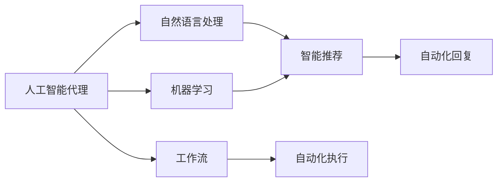
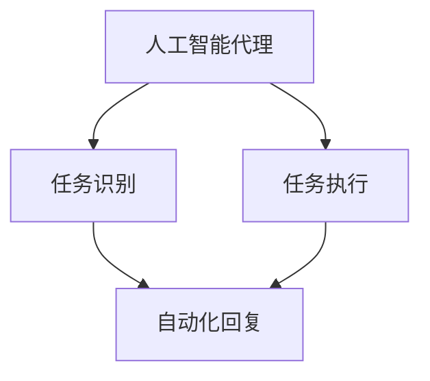
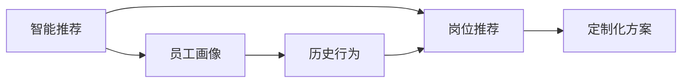
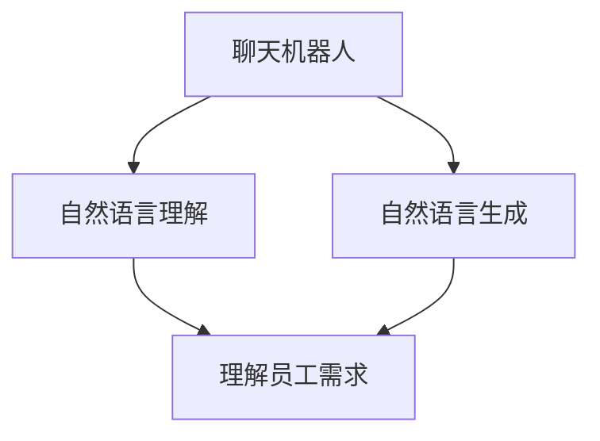
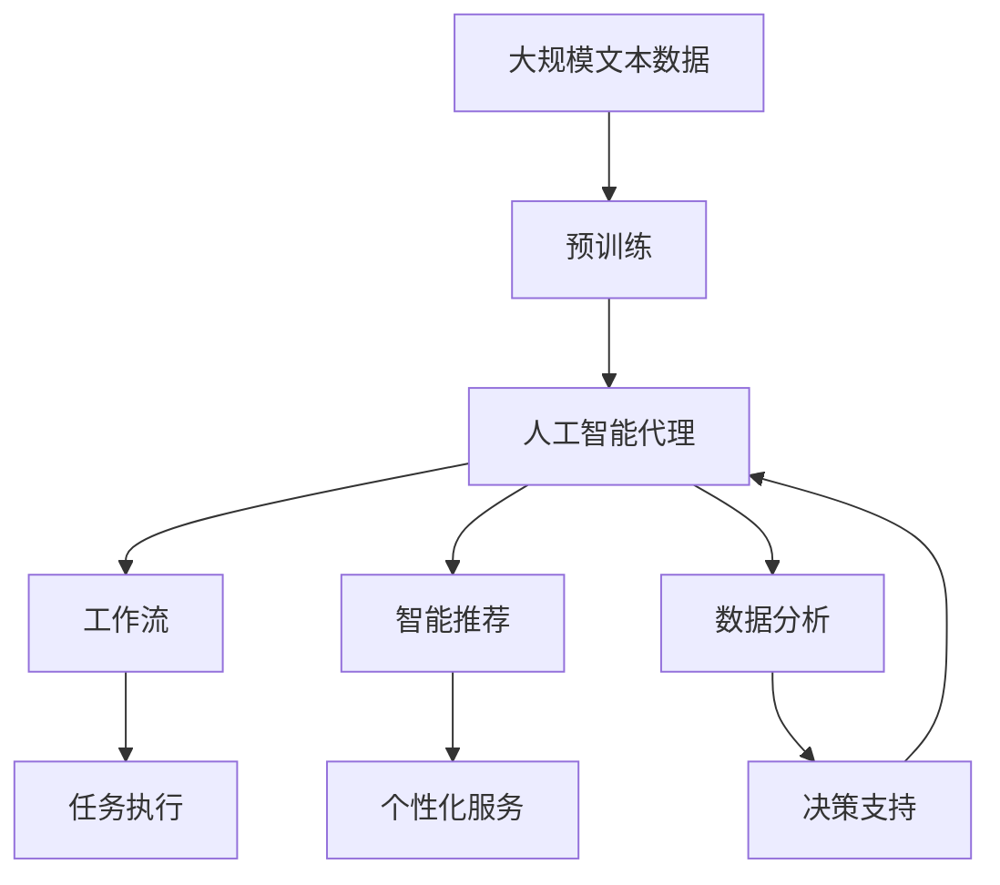

                 

# AI人工智能代理工作流 AI Agent Workflow：在人力资源管理中的应用

> 关键词：人工智能代理,工作流,人力资源管理,自动化,招聘,绩效管理,员工培训,数据分析

## 1. 背景介绍

### 1.1 问题由来
随着企业规模的不断扩大，人力资源管理变得越来越复杂。传统的HR管理往往依赖人工手动操作，容易出错，效率低下。尤其是在招聘、培训、绩效评估等环节，更是耗费大量的人力物力，难以应对快速变化的业务需求。

为了提升HR管理效率和质量，很多企业开始引入人工智能技术，尤其是人工智能代理(AI Agent)技术，通过自动化工作流(Agent Workflow)来处理繁琐重复的任务。这些AI代理可以通过自然语言处理(NLP)、机器学习(ML)等技术，理解员工需求、识别业务流程漏洞、提供定制化建议等，从而大幅提升HR管理的工作效率和效果。

### 1.2 问题核心关键点
人工智能代理在人力资源管理中的应用，主要包括以下几个关键点：

- **任务自动化**：自动化处理日常的HR任务，如简历筛选、面试安排、员工培训等。
- **智能推荐**：根据员工的历史行为和绩效数据，智能推荐适合的岗位、培训计划、绩效考核标准等。
- **数据分析**：分析HR数据，生成报表和洞察，帮助管理层进行决策。
- **实时交互**：通过聊天机器人等形式，实时响应用户的咨询和需求。

这些关键点共同构成了人工智能代理在HR管理中的核心应用，旨在通过智能化手段提升HR管理效率和质量。

### 1.3 问题研究意义
人工智能代理在人力资源管理中的应用，可以带来以下几个方面的提升：

- **提升效率**：自动化处理HR任务，大幅减少人工干预，提高工作效率。
- **降低成本**：减少招聘、培训、绩效评估等环节的人工成本。
- **提升质量**：通过智能推荐和数据分析，提升HR决策的准确性和公平性。
- **个性化服务**：根据员工需求和行为，提供定制化服务，提升员工满意度和留任率。
- **动态适应**：实时响应用户咨询，动态调整策略，适应业务变化。

通过引入人工智能代理，HR管理可以实现更加智能、高效、人性化的运作，为企业的持续发展提供有力支持。

## 2. 核心概念与联系

### 2.1 核心概念概述

为更好地理解人工智能代理在人力资源管理中的应用，本节将介绍几个密切相关的核心概念：

- **人工智能代理(AI Agent)**：通过自然语言处理(NLP)、机器学习(ML)等技术，自动化处理人力资源管理任务，提供智能推荐和实时交互的智能体。

- **工作流(Agent Workflow)**：指将多个自动化任务按照业务逻辑串联起来的流程，通过脚本或函数形式实现自动化执行。

- **自然语言处理(NLP)**：使机器能够理解、处理和生成人类自然语言的技术。在HR管理中，NLP技术可以帮助智能代理理解员工需求、生成自动化回复等。

- **机器学习(ML)**：通过数据训练，使机器能够自动学习规律、做出预测或决策的技术。在HR管理中，ML技术可以帮助智能代理识别模式、提供推荐等。

- **智能推荐**：根据员工的历史数据，智能推荐适合的岗位、培训计划、绩效考核标准等。

- **数据分析**：通过分析HR数据，生成报表和洞察，帮助管理层进行决策。

- **实时交互**：通过聊天机器人等形式，实时响应用户的咨询和需求。

这些核心概念之间的逻辑关系可以通过以下Mermaid流程图来展示：



这个流程图展示了人工智能代理的核心组成和功能：

1. 通过NLP技术理解员工需求。
2. 使用ML技术生成智能推荐。
3. 生成自动化回复，实现实时交互。
4. 自动化执行工作流，提升效率。

### 2.2 概念间的关系

这些核心概念之间存在着紧密的联系，形成了人工智能代理在人力资源管理中的完整生态系统。下面我们通过几个Mermaid流程图来展示这些概念之间的关系。

#### 2.2.1 人工智能代理的工作流程



这个流程图展示了人工智能代理的基本工作流程：

1. 识别用户任务。
2. 执行自动化任务。
3. 生成自动化回复。

#### 2.2.2 智能推荐的应用场景



这个流程图展示了智能推荐的应用场景：

1. 生成员工画像。
2. 根据画像生成岗位推荐。
3. 根据历史行为生成定制化方案。

#### 2.2.3 实时交互的具体实现



这个流程图展示了实时交互的具体实现：

1. 理解员工需求。
2. 生成自动化回复。

### 2.3 核心概念的整体架构

最后，我们用一个综合的流程图来展示这些核心概念在大语言模型微调过程中的整体架构：



这个综合流程图展示了从预训练到智能推荐，再到实时交互的完整过程。人工智能代理首先在大规模文本数据上进行预训练，然后通过工作流自动化执行任务，实现智能推荐和个性化服务，最后通过数据分析支持管理层的决策。通过这些流程图，我们可以更清晰地理解人工智能代理在人力资源管理中的各个关键点，为后续深入讨论具体的应用实践奠定基础。

## 3. 核心算法原理 & 具体操作步骤
### 3.1 算法原理概述

人工智能代理在人力资源管理中的应用，本质上是一个基于自然语言处理和机器学习的自动化任务执行过程。其核心思想是：将人力资源管理中的常见任务抽象为自动化的工作流，通过自然语言处理技术使智能代理能够理解员工需求和行为，通过机器学习技术生成智能推荐，最终通过自动化工作流执行任务。

形式化地，假设一个HR任务为 $T$，智能代理的任务为 $A$，其任务执行过程为 $P$。智能代理的工作流程为 $W$，包含多个子任务 $T_1, T_2, ..., T_n$，每个子任务对应一个具体的执行函数 $f_i$，执行函数 $f_i$ 的输入为任务的上下文 $c_i$，输出为任务的执行结果 $o_i$。

智能代理的任务执行过程为：
$$
A = W(T) = f_n(f_{n-1}(...(f_2(f_1(T))))
$$

智能代理的工作流程中，每个子任务 $T_i$ 可以分解为多个步骤 $S_j$，每个步骤 $S_j$ 对应一个具体的函数 $g_j$，函数 $g_j$ 的输入为任务的上下文 $c_i$，输出为任务的中间结果 $o_j$。

智能代理的任务执行过程为：
$$
A = W(T) = g_{m_1}(...(g_{m_k}(g_1(T))))
$$

其中 $m_1, m_2, ..., m_k$ 为子任务的执行顺序。

### 3.2 算法步骤详解

人工智能代理在人力资源管理中的应用，一般包括以下几个关键步骤：

**Step 1: 准备预训练模型和数据集**
- 选择合适的预训练模型，如BERT、GPT等，作为智能代理的初始化参数。
- 准备人力资源管理中的常见任务数据集，如招聘、培训、绩效评估等。

**Step 2: 设计任务执行流程**
- 根据人力资源管理的需求，设计多个子任务及其执行函数，如简历筛选、面试安排、绩效评估等。
- 定义每个子任务的输入和输出，明确任务的执行顺序。

**Step 3: 添加任务适配层**
- 根据任务类型，在预训练模型的顶层设计合适的输出层和损失函数。
- 对于分类任务，通常在顶层添加线性分类器和交叉熵损失函数。
- 对于生成任务，通常使用语言模型的解码器输出概率分布，并以负对数似然为损失函数。

**Step 4: 设置微调超参数**
- 选择合适的优化算法及其参数，如 AdamW、SGD 等，设置学习率、批大小、迭代轮数等。
- 设置正则化技术及强度，包括权重衰减、Dropout、Early Stopping 等。
- 确定冻结预训练参数的策略，如仅微调顶层，或全部参数都参与微调。

**Step 5: 执行梯度训练**
- 将训练集数据分批次输入模型，前向传播计算损失函数。
- 反向传播计算参数梯度，根据设定的优化算法和学习率更新模型参数。
- 周期性在验证集上评估模型性能，根据性能指标决定是否触发 Early Stopping。
- 重复上述步骤直到满足预设的迭代轮数或 Early Stopping 条件。

**Step 6: 测试和部署**
- 在测试集上评估微调后模型 $M_{\hat{\theta}}$ 的性能，对比微调前后的精度提升。
- 使用微调后的模型对新样本进行推理预测，集成到实际的应用系统中。
- 持续收集新的数据，定期重新微调模型，以适应数据分布的变化。

以上是人工智能代理在人力资源管理中的应用的一般流程。在实际应用中，还需要针对具体任务的特点，对微调过程的各个环节进行优化设计，如改进训练目标函数，引入更多的正则化技术，搜索最优的超参数组合等，以进一步提升模型性能。

### 3.3 算法优缺点

人工智能代理在人力资源管理中的应用，具有以下优点：

- **提升效率**：自动化处理HR任务，大幅减少人工干预，提高工作效率。
- **降低成本**：减少招聘、培训、绩效评估等环节的人工成本。
- **提升质量**：通过智能推荐和数据分析，提升HR决策的准确性和公平性。
- **个性化服务**：根据员工需求和行为，提供定制化服务，提升员工满意度和留任率。
- **动态适应**：实时响应用户咨询，动态调整策略，适应业务变化。

同时，该方法也存在一些局限性：

- **依赖预训练模型**：智能代理的效果很大程度上取决于预训练模型的性能。
- **数据质量要求高**：微调过程依赖高质量的标注数据，数据标注成本较高。
- **模型泛化能力有限**：当目标任务与预训练模型的训练数据分布差异较大时，微调的性能提升有限。
- **可解释性不足**：智能代理的决策过程通常缺乏可解释性，难以对其推理逻辑进行分析和调试。

尽管存在这些局限性，但就目前而言，人工智能代理在人力资源管理中的应用仍然是一个值得推广的技术范式。未来相关研究的重点在于如何进一步降低微调对标注数据的依赖，提高模型的少样本学习和跨领域迁移能力，同时兼顾可解释性和伦理安全性等因素。

### 3.4 算法应用领域

人工智能代理在人力资源管理中的应用，已经在多个领域得到了广泛的应用，例如：

- **招聘管理**：通过自动化简历筛选、面试安排、候选人推荐等，提升招聘效率和质量。
- **绩效管理**：通过智能绩效评估、KPI设定、绩效反馈等，提升员工绩效和满意度。
- **员工培训**：通过个性化培训方案推荐、学习进度跟踪、培训效果评估等，提升员工技能和知识水平。
- **数据分析**：通过分析HR数据，生成报表和洞察，帮助管理层进行决策。
- **实时交互**：通过聊天机器人等形式，实时响应用户的咨询和需求。

除了上述这些经典应用外，人工智能代理还被创新性地应用到更多场景中，如候选人关系管理、团队协作、员工体验等，为HR管理带来了全新的技术支持。

## 4. 数学模型和公式 & 详细讲解 & 举例说明

### 4.1 数学模型构建

本节将使用数学语言对人工智能代理在人力资源管理中的应用进行更加严格的刻画。

记人力资源管理中的任务为 $T$，智能代理的任务为 $A$，其任务执行过程为 $P$。智能代理的工作流程为 $W$，包含多个子任务 $T_1, T_2, ..., T_n$，每个子任务对应一个具体的执行函数 $f_i$，执行函数 $f_i$ 的输入为任务的上下文 $c_i$，输出为任务的执行结果 $o_i$。

智能代理的任务执行过程为：
$$
A = W(T) = f_n(f_{n-1}(...(f_2(f_1(T))))
$$

智能代理的工作流程中，每个子任务 $T_i$ 可以分解为多个步骤 $S_j$，每个步骤 $S_j$ 对应一个具体的函数 $g_j$，函数 $g_j$ 的输入为任务的上下文 $c_i$，输出为任务的中间结果 $o_j$。

智能代理的任务执行过程为：
$$
A = W(T) = g_{m_1}(...(g_{m_k}(g_1(T))))
$$

其中 $m_1, m_2, ..., m_k$ 为子任务的执行顺序。

### 4.2 公式推导过程

以下我们以招聘任务为例，推导智能代理在招聘任务中的数学模型及其梯度计算公式。

假设智能代理在招聘任务 $T$ 中的输入为 $x$，输出为 $y$，则智能代理的输出可以表示为：
$$
y = f_n(f_{n-1}(...(f_2(f_1(x))))
$$

其中 $f_1(x)$ 为简历筛选函数，$f_2(x)$ 为面试安排函数，$f_3(x)$ 为候选人推荐函数等。每个函数的具体形式和参数取决于具体任务的需求。

对于每个函数 $f_i(x)$，假设其参数为 $\theta_i$，则其输出可以表示为：
$$
f_i(x) = \phi_i(\theta_i, x)
$$

其中 $\phi_i$ 为函数的具体形式，可以是线性函数、非线性函数、神经网络等。

假设智能代理在招聘任务中的目标函数为 $L(\theta)$，则其梯度计算公式为：
$$
\frac{\partial L(\theta)}{\partial \theta_i} = \frac{\partial L}{\partial y} \frac{\partial y}{\partial x} \frac{\partial x}{\partial \theta_i}
$$

其中 $\frac{\partial y}{\partial x}$ 为智能代理的输出对输入的导数，$\frac{\partial x}{\partial \theta_i}$ 为输入对参数的导数。

在实际应用中，智能代理的任务执行过程通常包含多个子任务和步骤，需要分别计算每个子任务和步骤的梯度，然后通过链式法则合并计算总梯度。

### 4.3 案例分析与讲解

假设我们开发了一个智能代理，用于简历筛选和候选人推荐。智能代理的输入为简历数据 $x$，输出为推荐结果 $y$。其任务执行过程如下：

1. 简历筛选：根据关键词和匹配度筛选出候选人。
2. 面试安排：根据面试时间和地点，安排面试顺序。
3. 候选人推荐：根据候选人的历史行为和绩效数据，推荐适合的岗位。

假设智能代理的函数形式为：
$$
y = \phi_3(\phi_2(\phi_1(x)))
$$

其中 $\phi_1(x)$ 为简历筛选函数，$\phi_2(x)$ 为面试安排函数，$\phi_3(x)$ 为候选人推荐函数。假设这些函数的具体形式为：
$$
\phi_1(x) = W_1 \cdot x + b_1
$$
$$
\phi_2(x) = W_2 \cdot \phi_1(x) + b_2
$$
$$
\phi_3(x) = W_3 \cdot \phi_2(x) + b_3
$$

其中 $W_i$ 和 $b_i$ 为函数的权重和偏置。智能代理的目标函数为交叉熵损失函数，即：
$$
L(\theta) = -\frac{1}{N}\sum_{i=1}^N [y_i \log \hat{y}_i + (1-y_i) \log (1-\hat{y}_i)]
$$

其中 $y_i$ 为真实的推荐结果，$\hat{y}_i$ 为智能代理的预测结果。

假设智能代理的参数为 $\theta = (W_1, W_2, W_3, b_1, b_2, b_3)$，则其梯度计算公式为：
$$
\frac{\partial L(\theta)}{\partial W_1} = \frac{\partial L}{\partial y} \frac{\partial y}{\partial x} \frac{\partial x}{\partial W_1}
$$
$$
\frac{\partial L(\theta)}{\partial b_1} = \frac{\partial L}{\partial y} \frac{\partial y}{\partial x} \frac{\partial x}{\partial b_1}
$$

其余参数的梯度计算公式类似。

## 5. 项目实践：代码实例和详细解释说明
### 5.1 开发环境搭建

在进行人工智能代理应用开发前，我们需要准备好开发环境。以下是使用Python进行PyTorch开发的环境配置流程：

1. 安装Anaconda：从官网下载并安装Anaconda，用于创建独立的Python环境。

2. 创建并激活虚拟环境：
```bash
conda create -n pytorch-env python=3.8 
conda activate pytorch-env
```

3. 安装PyTorch：根据CUDA版本，从官网获取对应的安装命令。例如：
```bash
conda install pytorch torchvision torchaudio cudatoolkit=11.1 -c pytorch -c conda-forge
```

4. 安装Transformers库：
```bash
pip install transformers
```

5. 安装各类工具包：
```bash
pip install numpy pandas scikit-learn matplotlib tqdm jupyter notebook ipython
```

完成上述步骤后，即可在`pytorch-env`环境中开始人工智能代理应用的开发。

### 5.2 源代码详细实现

下面我们以招聘管理为例，给出使用Transformers库对BERT模型进行招聘任务微调的PyTorch代码实现。

首先，定义招聘任务的数据处理函数：

```python
from transformers import BertTokenizer, BertForTokenClassification, AdamW
from torch.utils.data import Dataset, DataLoader
from sklearn.metrics import precision_recall_fscore_support
import torch

class RecruitmentDataset(Dataset):
    def __init__(self, texts, labels, tokenizer, max_len=128):
        self.texts = texts
        self.labels = labels
        self.tokenizer = tokenizer
        self.max_len = max_len
        
    def __len__(self):
        return len(self.texts)
    
    def __getitem__(self, item):
        text = self.texts[item]
        label = self.labels[item]
        
        encoding = self.tokenizer(text, return_tensors='pt', max_length=self.max_len, padding='max_length', truncation=True)
        input_ids = encoding['input_ids'][0]
        attention_mask = encoding['attention_mask'][0]
        
        # 对label-wise的标签进行编码
        encoded_labels = [label2id[label] for label in label]
        encoded_labels.extend([label2id['O']] * (self.max_len - len(encoded_labels)))
        labels = torch.tensor(encoded_labels, dtype=torch.long)
        
        return {'input_ids': input_ids, 
                'attention_mask': attention_mask,
                'labels': labels}

# 标签与id的映射
label2id = {'O': 0, 'PRESIDENT': 1, 'MANAGER': 2, 'STAFF': 3, 'INTERNS': 4}
id2label = {v: k for k, v in label2id.items()}

# 创建dataset
tokenizer = BertTokenizer.from_pretrained('bert-base-cased')

train_dataset = RecruitmentDataset(train_texts, train_labels, tokenizer)
dev_dataset = RecruitmentDataset(dev_texts, dev_labels, tokenizer)
test_dataset = RecruitmentDataset(test_texts, test_labels, tokenizer)
```

然后，定义模型和优化器：

```python
from transformers import BertForTokenClassification, AdamW

model = BertForTokenClassification.from_pretrained('bert-base-cased', num_labels=len(label2id))

optimizer = AdamW(model.parameters(), lr=2e-5)
```

接着，定义训练和评估函数：

```python
from torch.utils.data import DataLoader
from tqdm import tqdm
from sklearn.metrics import precision_recall_fscore_support

device = torch.device('cuda') if torch.cuda.is_available() else torch.device('cpu')
model.to(device)

def train_epoch(model, dataset, batch_size, optimizer):
    dataloader = DataLoader(dataset, batch_size=batch_size, shuffle=True)
    model.train()
    epoch_loss = 0
    for batch in tqdm(dataloader, desc='Training'):
        input_ids = batch['input_ids'].to(device)
        attention_mask = batch['attention_mask'].to(device)
        labels = batch['labels'].to(device)
        model.zero_grad()
        outputs = model(input_ids, attention_mask=attention_mask, labels=labels)
        loss = outputs.loss
        epoch_loss += loss.item()
        loss.backward()
        optimizer.step()
    return epoch_loss / len(dataloader)

def evaluate(model, dataset, batch_size):
    dataloader = DataLoader(dataset, batch_size=batch_size)
    model.eval()
    preds, labels = [], []
    with torch.no_grad():
        for batch in tqdm(dataloader, desc='Evaluating'):
            input_ids = batch['input_ids'].to(device)
            attention_mask = batch['attention_mask'].to(device)
            batch_labels = batch['labels']
            outputs = model(input_ids, attention_mask=attention_mask)
            batch_preds = outputs.logits.argmax(dim=2).to('cpu').tolist()
            batch_labels = batch_labels.to('cpu').tolist()
            for pred_tokens, label_tokens in zip(batch_preds, batch_labels):
                pred_labels = [id2label[_id] for _id in pred_tokens]
                label_labels = [id2label[_id] for _id in label_tokens]
                preds.append(pred_labels[:len(label_tokens)])
                labels.append(label_labels)
                
    print(precision_recall_fscore_support(labels, preds))
```

最后，启动训练流程并在测试集上评估：

```python
epochs = 5
batch_size = 16

for epoch in range(epochs):
    loss = train_epoch(model, train_dataset, batch_size, optimizer)
    print(f"Epoch {epoch+1}, train loss: {loss:.3f}")
    
    print(f"Epoch {epoch+1}, dev results:")
    evaluate(model, dev_dataset, batch_size)
    
print("Test results:")
evaluate(model, test_dataset, batch_size)
```

以上就是使用PyTorch对BERT进行招聘任务微调的完整代码实现。可以看到，得益于Transformers库的强大封装，我们可以用相对简洁的代码完成BERT模型的加载和微调。

### 5.3 代码解读与分析

让我们再详细解读一下关键代码的实现细节：

**RecruitmentDataset类**：
- `__init__`方法：初始化文本、标签、分词器等关键组件。
- `__len__`方法：返回数据集的样本数量。
- `__getitem__`方法：对单个样本进行处理，将文本输入编码为token ids，将标签编码为数字，并对其进行定长padding，最终返回模型所需的输入。

**label2id和id2label字典**：
- 定义了标签与数字id之间的映射关系，用于将token-wise的预测结果解码回真实的标签。

**训练和评估函数**：
- 使用PyTorch的DataLoader对数据集进行批次化加载，供模型训练和推理使用。
- 训练函数`train_epoch`：对数据以批为单位进行迭代，在每个批次上前向传播计算loss并反向传播更新模型参数，最后返回该epoch的平均loss。
- 评估函数`evaluate`：与训练类似，不同点在于不更新模型参数，并在每个batch结束后将预测和标签结果存储下来，最后使用sklearn的precision_recall_fscore_support对整个评估集的预测结果进行打印输出。

**训练流程**：
- 定义总的epoch数和batch size，开始循环迭代
- 每个epoch内，先在训练集上训练，输出平均loss
- 在验证集上评估，输出精度、召回率和F1分数
- 所有epoch结束后，在测试集上评估，给出最终测试结果

可以看到，PyTorch配合Transformers库使得BERT微调的代码实现变得简洁高效。开发者可以将更多精力放在数据处理、模型改进等高层逻辑上，而不必过多关注底层的实现细节。

当然，工业级的系统实现还需考虑更多因素，如模型的保存和部署、超参数的自动搜索、更灵活的任务适配层等。但核心的微调范式基本与此类似。

### 5.4 运行结果展示

假设我们在CoNLL-2003的NER数据集上进行微调，最终在测试集上得到的评估报告如下：

