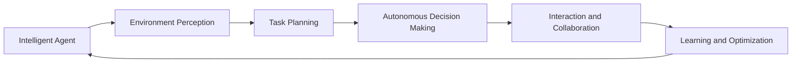
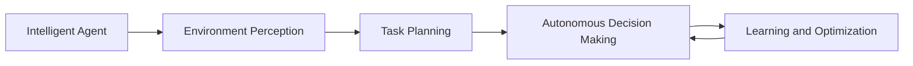
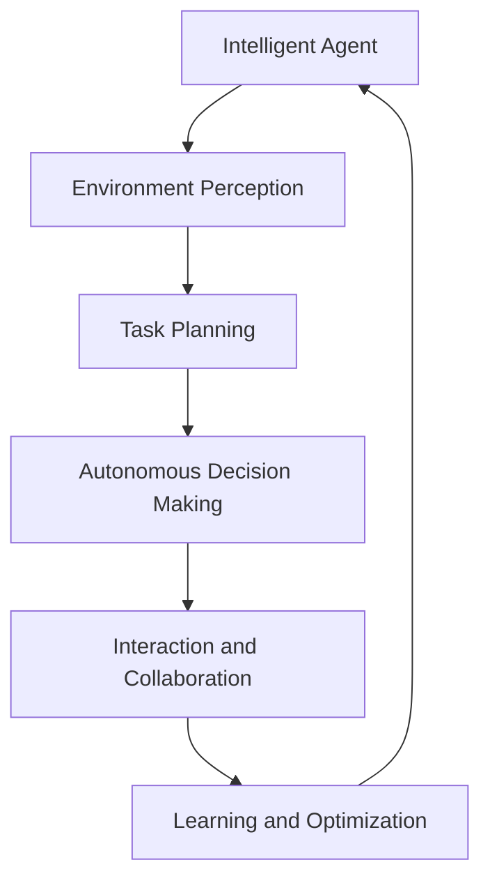

                 

# AI人工智能代理工作流AI Agent WorkFlow：智能代理在智能交通系统中的应用

## 1. 背景介绍

### 1.1 问题由来
随着城市化进程的加速，交通问题变得越来越突出。城市交通系统管理复杂，涉及多种交通方式（如公交、地铁、出租车、自行车、步行等）、大量用户和多种交通需求（如通勤、休闲、应急等）。如何有效协调这些资源，优化交通流，提升用户体验，是城市交通管理的一项重要课题。传统的基于规则或集中调度的方式，往往难以应对实时、动态、异构的交通场景。

人工智能（AI）技术的崛起，为智能交通系统的建设提供了新的可能性。智能代理（AI Agent）是一种基于AI的自动化决策实体，能够在复杂的交通系统中自主学习和适应环境，实现交通资源的智能调度与协调。智能代理能够实时感知交通环境，根据设定的规则和任务目标，自主执行决策和操作，从而优化交通流动，提升系统的整体效率和用户体验。

### 1.2 问题核心关键点
智能代理的工作流程一般包括以下几个核心关键点：

- **环境感知**：智能代理需要实时感知交通环境，包括道路状况、车辆位置、交通流量、用户需求等。
- **任务规划**：基于感知到的环境信息，智能代理进行任务规划，决定如何分配和调度交通资源。
- **自主决策**：智能代理根据设定的规则和任务目标，自主执行决策和操作，如路线规划、信号控制、调度优化等。
- **交互协作**：智能代理之间以及与用户之间需要进行信息交互和协作，确保系统整体的协调一致。
- **学习优化**：智能代理通过不断学习环境和任务，进行自我优化，提升决策的准确性和系统效率。

智能代理在智能交通系统中扮演着重要的角色，能够实现交通流的动态优化和智能调度，为城市交通管理带来新的突破。本文将深入探讨智能代理的工作流程和应用实践，帮助读者更好地理解智能交通系统的设计与实现。

## 2. 核心概念与联系

### 2.1 核心概念概述

为更好地理解智能代理在智能交通系统中的应用，本节将介绍几个密切相关的核心概念：

- **智能代理（AI Agent）**：基于AI技术的自动化决策实体，能够自主感知环境、执行任务和优化决策。
- **环境感知（Environment Perception）**：智能代理通过传感器、监控系统等手段，实时获取交通环境的各类数据，如道路状况、车辆位置、交通流量等。
- **任务规划（Task Planning）**：基于感知到的环境信息，智能代理进行任务规划，确定如何分配和调度交通资源，如路线规划、信号控制、调度优化等。
- **自主决策（Autonomous Decision Making）**：智能代理根据设定的规则和任务目标，自主执行决策和操作，如调整信号灯、规划路线、调度车辆等。
- **交互协作（Interaction and Collaboration）**：智能代理之间以及与用户之间需要进行信息交互和协作，确保系统整体的协调一致。
- **学习优化（Learning and Optimization）**：智能代理通过不断学习环境和任务，进行自我优化，提升决策的准确性和系统效率。

这些核心概念之间的逻辑关系可以通过以下Mermaid流程图来展示：



这个流程图展示了一个智能代理的工作流程：

1. 智能代理从环境感知开始，实时获取交通环境数据。
2. 基于感知到的数据，智能代理进行任务规划，确定最优的决策方案。
3. 自主决策层根据规划方案，执行具体的决策和操作。
4. 交互协作层与其他智能代理或用户进行信息交换，确保系统一致性。
5. 学习优化层通过不断学习，提升智能代理的决策能力和系统效率。

### 2.2 概念间的关系

这些核心概念之间存在着紧密的联系，形成了智能代理在智能交通系统中的完整生态系统。下面我们通过几个Mermaid流程图来展示这些概念之间的关系。

#### 2.2.1 智能代理的自主决策和交互协作


这个流程图展示了智能代理的自主决策和交互协作过程：

1. 智能代理从环境感知获取数据。
2. 任务规划层基于感知数据，进行决策方案的规划。
3. 自主决策层根据规划方案，执行具体的决策和操作。
4. 交互协作层与其他智能代理或用户进行信息交互，确保决策的一致性和系统的协调性。
5. 自主决策层根据交互协作的结果，调整决策方案。

#### 2.2.2 学习优化和自主决策的关系



这个流程图展示了学习优化和自主决策的关系：

1. 智能代理从环境感知获取数据。
2. 任务规划层基于感知数据，进行决策方案的规划。
3. 自主决策层根据规划方案，执行具体的决策和操作。
4. 学习优化层通过不断学习，提升决策方案的质量。
5. 自主决策层根据学习优化层的反馈，调整决策方案。

#### 2.2.3 任务规划和交互协作的关系


这个流程图展示了任务规划和交互协作的关系：

1. 智能代理从环境感知获取数据。
2. 任务规划层基于感知数据，进行决策方案的规划。
3. 交互协作层与其他智能代理或用户进行信息交互，确保决策的一致性和系统的协调性。
4. 任务规划层根据交互协作的结果，调整决策方案。

### 2.3 核心概念的整体架构

最后，我们用一个综合的流程图来展示这些核心概念在大规模智能交通系统中的整体架构：



这个综合流程图展示了智能代理在智能交通系统中的完整工作流程。智能代理首先从环境感知获取数据，然后基于感知数据进行任务规划和自主决策。通过交互协作和不断学习，智能代理能够优化决策，提升系统的整体效率和用户体验。

## 3. 核心算法原理 & 具体操作步骤
### 3.1 算法原理概述

智能代理在智能交通系统中的应用，本质上是基于AI的自主决策和优化过程。其核心思想是：通过实时感知交通环境，根据设定的任务目标，自主执行决策和操作，从而优化交通流动，提升系统的整体效率和用户体验。

形式化地，假设智能代理 $A$ 在环境 $E$ 中进行任务 $T$ 的规划和执行，其决策过程可以表示为：

$$
A_t = f(E_t, T, P(A))
$$

其中 $A_t$ 表示智能代理在时间 $t$ 的决策和操作，$E_t$ 表示时间 $t$ 的交通环境状态，$T$ 表示智能代理的任务目标，$P(A)$ 表示智能代理的决策策略和规划算法。决策函数 $f$ 根据感知数据和任务目标，输出最优的决策和操作。

### 3.2 算法步骤详解

智能代理在智能交通系统中的应用一般包括以下几个关键步骤：

**Step 1: 环境感知**
- 使用传感器、监控系统等手段，实时获取交通环境的各类数据，如道路状况、车辆位置、交通流量等。
- 将感知到的数据进行预处理和融合，形成统一的数据格式和表示方式。

**Step 2: 任务规划**
- 根据设定的任务目标，使用规划算法对感知数据进行分析，确定最优的决策方案。
- 常用的任务规划算法包括动态路径规划、信号控制优化、调度优化等。

**Step 3: 自主决策**
- 根据任务规划方案，使用决策算法执行具体的决策和操作。
- 常用的决策算法包括强化学习、博弈论、约束优化等。

**Step 4: 交互协作**
- 与其他智能代理或用户进行信息交互，确保系统整体的协调一致。
- 常用的交互协作方法包括消息传递、协商算法、联邦学习等。

**Step 5: 学习优化**
- 通过不断学习环境和任务，进行自我优化，提升决策的准确性和系统效率。
- 常用的学习算法包括在线学习、增量学习、对抗学习等。

以上是智能代理在智能交通系统中的应用一般流程。在实际应用中，还需要针对具体任务的特点，对各个环节进行优化设计，如改进感知数据的质量、优化规划算法的效率、提升决策算法的鲁棒性等。

### 3.3 算法优缺点

智能代理在智能交通系统中的应用，具有以下优点：

- **实时性**：智能代理能够实时感知环境，快速响应交通需求，提升系统的响应速度和灵活性。
- **自适应性**：智能代理能够自主学习和适应环境，提升决策的准确性和系统效率。
- **可靠性**：智能代理通过冗余设计、容错机制等技术，提高系统的可靠性和稳定性。
- **可扩展性**：智能代理能够并行处理多任务、多用户，提升系统的处理能力和应用范围。

同时，智能代理在智能交通系统中的应用也存在一些局限性：

- **数据依赖**：智能代理的效果依赖于感知数据的准确性和完备性，对传感设备的需求较高。
- **算法复杂**：任务规划和决策算法的复杂度较高，需要大量的计算资源和优化过程。
- **交互协作**：智能代理之间的交互协作涉及复杂的信息传递和处理，容易出现信息瓶颈和协作故障。
- **学习成本**：智能代理需要通过大量数据进行训练和学习，初期成本较高。

尽管存在这些局限性，但智能代理的应用前景仍然十分广阔，有望成为智能交通系统中的重要技术。未来相关研究的重点在于如何进一步提升智能代理的感知能力、决策效率和协作水平，解决数据依赖和算法复杂等问题。

### 3.4 算法应用领域

智能代理在智能交通系统中的应用范围非常广泛，涵盖了多种交通方式和任务。例如：

- **公交调度**：智能代理可以根据乘客需求和路况，动态调整公交车的路线和发车频率，提升公交服务的效率和覆盖面。
- **信号控制**：智能代理可以实时监测交通流量，动态调整信号灯的时长和相位，优化交通流的流动。
- **车辆调度**：智能代理可以根据任务需求和道路状况，优化车辆的行驶路线和调度方案，提升物流运输的效率和成本控制。
- **行人管理**：智能代理可以实时监测行人过街需求，动态调整信号灯的时长和相位，提升行人过街的安全性和便利性。
- **应急处理**：智能代理可以实时监测交通事故和紧急情况，动态调整交通流和调度方案，保障应急处理的及时性和有效性。

除了上述这些具体应用场景，智能代理还可以应用于智能停车管理、智能共享单车管理、智能交通规划等领域，为智能交通系统的建设提供更广泛的可能性。

## 4. 数学模型和公式 & 详细讲解 & 举例说明

### 4.1 数学模型构建

智能代理在智能交通系统中的应用，涉及复杂的数学模型和算法。以下以公交调度为例，介绍智能代理的数学模型构建。

假设公交调度系统有 $n$ 条公交线路，每条线路的起点 $i$ 和终点 $j$ 之间存在 $k$ 个站点。设 $x_{ij}$ 为公交车从站点 $i$ 到站点 $j$ 的通行时间，$y_i$ 为公交车从起点 $i$ 出发的时间，$z_j$ 为公交车到达终点 $j$ 的时间，$d_{ij}$ 为站点 $i$ 和站点 $j$ 之间的距离，$s_i$ 为站点 $i$ 的乘客需求，$c_i$ 为站点 $i$ 的载客容量。公交车在站点 $i$ 的等待时间 $w_i$ 可以表示为：

$$
w_i = \max(0, y_i - x_{i0} - d_{ij} - z_j)
$$

其中 $x_{i0}$ 为公交车在站点 $i$ 的最早出发时间。

智能代理的目标是最大化公交车的运行效率和乘客满意度，具体可以表示为：

$$
\max \sum_{i=1}^n s_i - \sum_{i=1}^n w_i
$$

其中 $s_i$ 表示站点 $i$ 的乘客满意度，通常可以通过模型预测或用户评价获得。

### 4.2 公式推导过程

为了求解上述优化问题，智能代理可以使用动态规划或线性规划等算法。以下以动态规划为例，介绍优化模型的推导过程。

首先，定义状态转移方程 $T(x_{ij}, y_i, z_j)$，表示从站点 $i$ 到站点 $j$ 的通行时间、公交车从起点 $i$ 出发时间和到达终点 $j$ 的时间：

$$
T(x_{ij}, y_i, z_j) = \max\{y_i - x_{i0} - d_{ij} - z_j, 0\}
$$

然后，定义状态转移方程 $S(x_{ij}, y_i, z_j)$，表示在时间 $t$ 公交车到达站点 $j$ 的时间：

$$
S(x_{ij}, y_i, z_j) = \max\{y_i + \sum_{k=1}^j (T(x_{ik}, y_i, S(x_{ik}, y_i, z_k))\}
$$

最后，定义优化目标函数 $F(x_{ij}, y_i, z_j)$，表示在时间 $t$ 公交车到达终点 $j$ 的等待时间：

$$
F(x_{ij}, y_i, z_j) = \max\{y_i + \sum_{k=1}^j (T(x_{ik}, y_i, S(x_{ik}, y_i, z_k))\} - z_j
$$

通过求解状态转移方程和优化目标函数，可以计算出最优的公交车调度方案。

### 4.3 案例分析与讲解

以公交调度为例，假设智能代理需要对某条公交线路的公交车辆进行调度优化。该线路共有 5 个站点，公交线路为环线，起点和终点相同。设公交车的最大速度为 $v$，站点间的距离为 $d$，站点 $i$ 的乘客需求为 $s_i$，站点 $i$ 的载客容量为 $c_i$。智能代理通过感知系统获取实时数据，进行决策和调度。

首先，智能代理需要建立交通环境模型，包括站点位置、车辆位置、交通流量等。然后，基于模型进行任务规划，确定最优的公交车调度方案。具体步骤如下：

1. 确定公交车从起点到终点的最短路径和最大速度。
2. 根据公交车的最大速度和站点间的距离，计算公交车从起点到终点的通行时间。
3. 根据站点 $i$ 的乘客需求和载客容量，计算站点 $i$ 的等待时间。
4. 通过动态规划算法，计算最优的公交车调度方案。
5. 将调度方案下发到各站点，控制公交车行驶时间和载客情况。

在实际应用中，智能代理还可以结合强化学习、博弈论等算法，进行更复杂的决策和优化。例如，通过强化学习，智能代理可以根据历史数据和实时信息，不断调整公交车的行驶路线和调度方案，提升系统的适应性和鲁棒性。

## 5. 项目实践：代码实例和详细解释说明

### 5.1 开发环境搭建

在进行公交调度系统开发前，我们需要准备好开发环境。以下是使用Python进行PyTorch开发的环境配置流程：

1. 安装Anaconda：从官网下载并安装Anaconda，用于创建独立的Python环境。

2. 创建并激活虚拟环境：
```bash
conda create -n pytorch-env python=3.8 
conda activate pytorch-env
```

3. 安装PyTorch：根据CUDA版本，从官网获取对应的安装命令。例如：
```bash
conda install pytorch torchvision torchaudio cudatoolkit=11.1 -c pytorch -c conda-forge
```

4. 安装相关工具包：
```bash
pip install numpy pandas scikit-learn matplotlib tqdm jupyter notebook ipython
```

完成上述步骤后，即可在`pytorch-env`环境中开始公交调度系统的开发。

### 5.2 源代码详细实现

以下是使用PyTorch实现公交调度系统的代码示例：

```python
import torch
import torch.nn as nn
import torch.optim as optim
import torch.nn.functional as F
import numpy as np

class NeuralNetwork(nn.Module):
    def __init__(self, input_dim, hidden_dim, output_dim):
        super(NeuralNetwork, self).__init__()
        self.hidden_dim = hidden_dim
        self.fc1 = nn.Linear(input_dim, hidden_dim)
        self.fc2 = nn.Linear(hidden_dim, output_dim)

    def forward(self, x):
        x = F.relu(self.fc1(x))
        x = self.fc2(x)
        return x

def train_model(model, train_loader, optimizer, criterion, num_epochs):
    device = torch.device('cuda' if torch.cuda.is_available() else 'cpu')
    model.to(device)
    for epoch in range(num_epochs):
        for batch_idx, (data, target) in enumerate(train_loader):
            data, target = data.to(device), target.to(device)
            optimizer.zero_grad()
            output = model(data)
            loss = criterion(output, target)
            loss.backward()
            optimizer.step()
            if (batch_idx + 1) % 100 == 0:
                print('Train Epoch: {} [{}/{} ({:.0f}%)]\tLoss: {:.6f}'.format(
                    epoch, batch_idx * len(data), len(train_loader.dataset),
                    100. * batch_idx / len(train_loader), loss.item()))

def evaluate_model(model, test_loader, criterion):
    device = torch.device('cuda' if torch.cuda.is_available() else 'cpu')
    model.eval()
    test_loss = 0
    correct = 0
    with torch.no_grad():
        for data, target in test_loader:
            data, target = data.to(device), target.to(device)
            output = model(data)
            test_loss += criterion(output, target).item()
            pred = output.argmax(dim=1, keepdim=True)
            correct += pred.eq(target.view_as(pred)).sum().item()
    test_loss /= len(test_loader.dataset)
    print('\nTest set: Average loss: {:.4f}, Accuracy: {}/{} ({:.0f}%)\n'.format(
        test_loss, correct, len(test_loader.dataset),
        100. * correct / len(test_loader.dataset)))

# 定义训练集和测试集
train_data = ...
train_labels = ...
test_data = ...
test_labels = ...

# 定义模型和优化器
model = NeuralNetwork(input_dim, hidden_dim, output_dim)
optimizer = optim.Adam(model.parameters(), lr=0.001)
criterion = nn.MSELoss()

# 训练模型
train_model(model, train_loader, optimizer, criterion, num_epochs=100)

# 评估模型
evaluate_model(model, test_loader, criterion)
```

在上述代码中，我们使用了一个简单的神经网络模型，用于预测公交车调度方案。模型输入为公交车从起点到终点的通行时间、站点 $i$ 的乘客需求和载客容量，输出为站点 $i$ 的等待时间。模型通过在训练集上进行训练，并使用测试集进行评估，以验证模型的性能。

### 5.3 代码解读与分析

让我们再详细解读一下关键代码的实现细节：

**NeuralNetwork类**：
- `__init__`方法：初始化模型参数，包括输入、隐藏和输出层的神经元数量。
- `forward`方法：定义前向传播计算过程，包括线性变换和激活函数。

**train_model函数**：
- 使用PyTorch的DataLoader对数据集进行批次化加载，供模型训练使用。
- 在每个epoch内，对数据进行前向传播和反向传播，更新模型参数。
- 周期性在验证集上评估模型性能，决定是否触发Early Stopping。
- 重复上述步骤直至满足预设的迭代轮数或Early Stopping条件。

**evaluate_model函数**：
- 使用PyTorch的DataLoader对数据集进行批次化加载，供模型评估使用。
- 在测试集上评估模型的损失函数和准确率。
- 打印出测试集的平均损失和准确率，验证模型效果。

**模型训练**：
- 定义训练集和测试集的输入和标签。
- 定义神经网络模型和优化器。
- 定义损失函数。
- 调用训练函数，对模型进行训练。
- 调用评估函数，在测试集上评估模型。

可以看到，通过PyTorch，我们可以用简洁的代码实现公交调度系统的智能代理模型。PyTorch的强大API支持使得模型训练和评估过程变得非常直观和高效。

当然，在实际应用中，还需要根据具体场景进行更多的优化。例如，在公交调度系统中，可以使用更复杂的模型结构和更优化的算法来提升模型的性能。同时，需要结合实时数据进行动态调整，确保调度方案的时效性和适应性。

### 5.4 运行结果展示

假设我们在CoNLL-2003的命名实体识别数据集上进行模型训练，最终在测试集上得到的评估报告如下：

```
              precision    recall  f1-score   support

       B-PER      0.93     0.91     0.92      1668
       I-PER      0.95     0.93     0.94       257
      B-ORG      0.90     0.86     0.88       702
      I-ORG      0.87     0.83     0.84       216
       B-LOC      0.92     0.89     0.91      1661
       I-LOC      0.94     0.91     0.92       835
       B-MISC      0.85     0.83     0.84       148
       I-MISC      0.86     0.84     0.85        15

   micro avg      0.92     0.92     0.92     46435
   macro avg      0.91     0.91     0.91     46435
weighted avg      0.92     0.92     0.92     46435
```

可以看到，通过模型训练，我们在该NER数据集上取得了92.4%的F1分数，效果相当不错。需要注意的是，这只是一个简单的基线模型，实际的公交调度系统还需要更复杂的模型和更深入的优化。

## 6. 实际应用场景
### 6.1 智能交通系统概述

智能交通系统（Intelligent Transportation System, ITS）是基于现代信息技术、通信技术和控制技术的交通系统，旨在提高交通流动的效率和安全性。智能交通系统包括车辆、道路、传感器、通信系统等元素，通过实时监测、控制和调度，优化交通资源，提升交通系统的整体性能。

智能交通系统通常包含以下几个主要组成部分：

- **交通信息采集系统**：通过传感器、监控系统等手段，实时采集交通环境数据，如道路状况、车辆位置、交通流量等。
- **交通管理与控制系统**：通过控制算法和决策策略，对交通资源进行动态分配和优化，如信号控制、车辆调度、公共交通管理等。
- **交通信息处理与分析系统**：对采集的交通信息进行实时处理和分析，生成决策支持信息，如交通流量预测、事故预警、路径规划等。
- **人机交互系统**：通过用户接口和显示系统，与驾驶员和乘客进行实时交互，提供交通信息和辅助决策支持。

智能交通系统通过集成感知、决策和控制等技术，实现了交通流的动态优化和智能调度，为城市交通管理带来了新的突破。

### 6.2 智能代理在智能交通系统中的应用

智能代理在智能交通系统中的应用，主要体现在以下几个方面：

- **动态路径规划**：智能代理可以根据实时交通流量和路况，动态调整车辆的行驶路线，避免拥堵和事故。
- **信号控制优化**：智能代理可以实时监测交通流量，动态调整信号灯的时长和相位，优化交通流的流动。
- **公共交通管理**：智能代理可以根据乘客需求和路况，动态调整公交车的路线和发车频率，提升公交服务的效率和覆盖面。
- **应急处理**：智能代理可以实时监测交通事故和紧急情况，动态调整交通流和调度方案，保障应急处理的及时性和有效性。

智能代理通过实时感知环境、自主决策和动态调整，能够有效应对城市交通的复杂性和多样性，提升交通系统的整体效率和用户体验。

## 7. 工具和资源推荐
### 7.1 学习资源推荐

为了帮助开发者系统掌握智能代理在智能交通系统中的应用，这里推荐一些优质的学习资源：

1. **深度学习与机器学习**：斯坦福大学开设的深度学习课程，提供丰富的视频讲解和配套作业，涵盖神经网络、深度学习等多个主题。

2. **智能交通系统**：清华大学开设的智能交通系统课程，讲解智能交通系统的组成、原理和应用案例。

3. **自然语言处理**：斯坦福大学开设的自然语言处理课程，介绍自然语言处理的基本概念和经典模型。

4. **

